# Ch20 前沿 AI · 思维导图 (Mermaid)

---

## 一 · 章节主入口

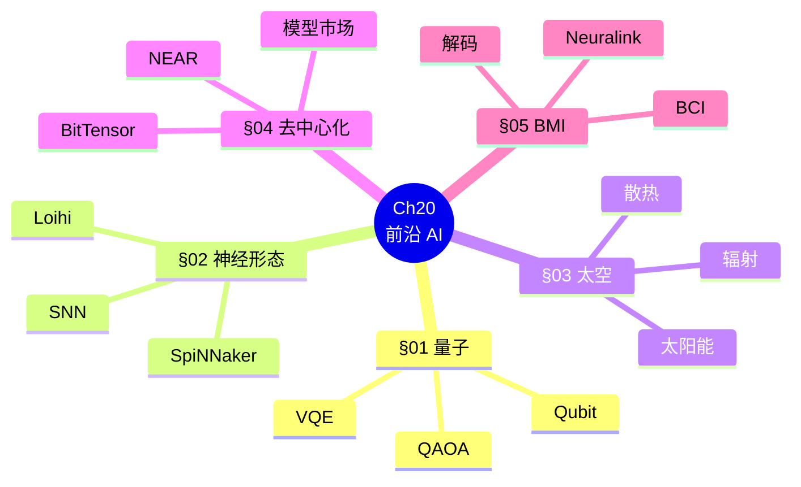

---

## 二 · 五大前沿领域

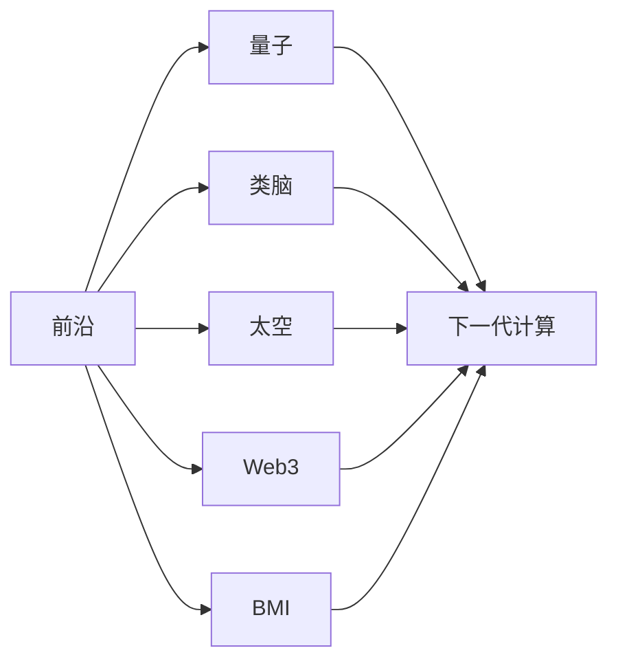

---

## 三 · §01 量子子图

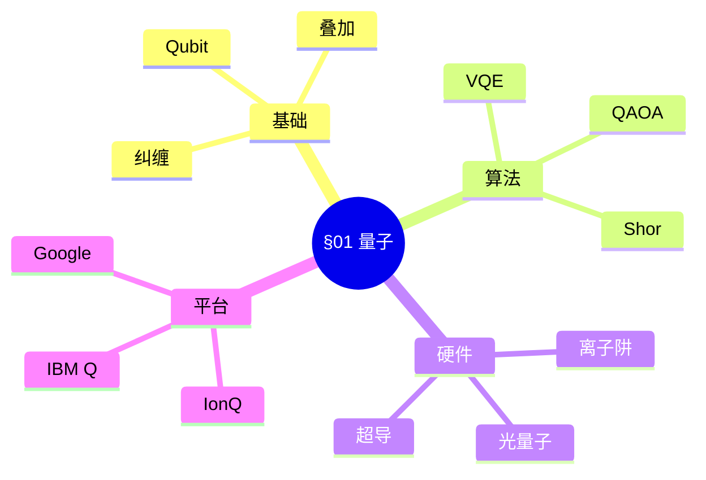

---

## 四 · §02 神经形态子图

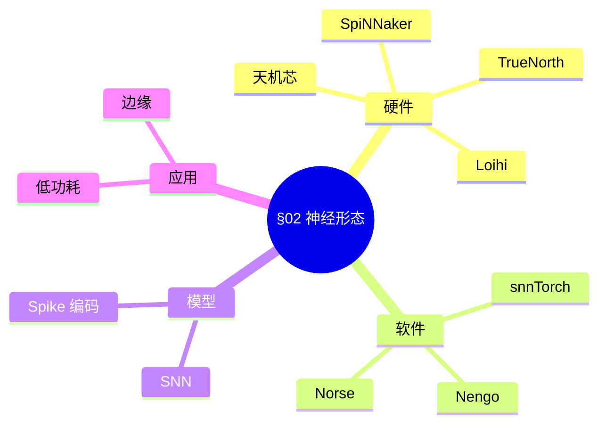

---

## 五 · §03 太空子图

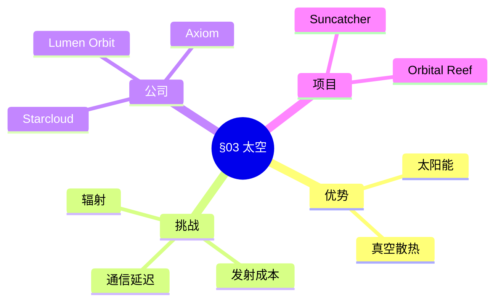

---

## 六 · §04 去中心化 AI 子图

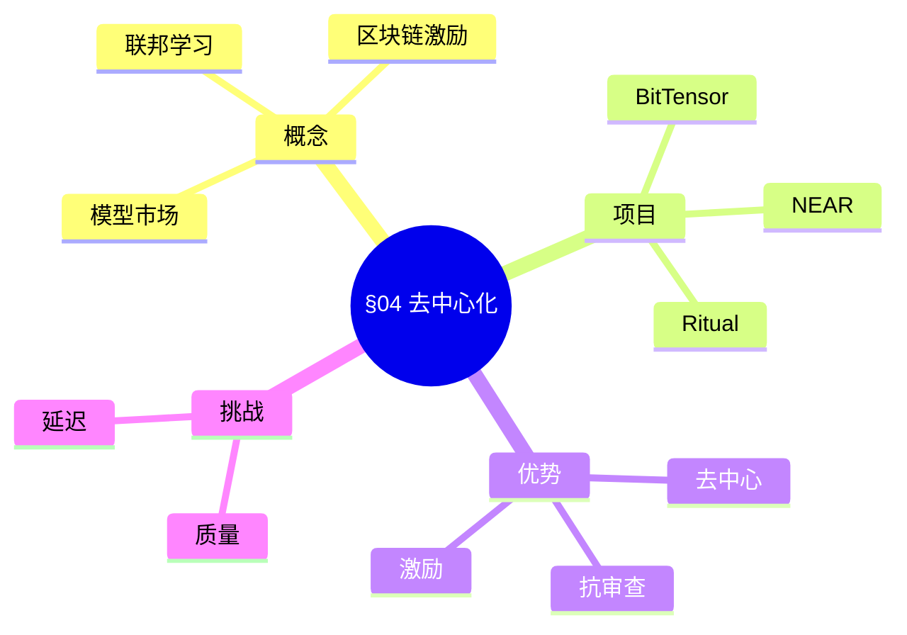

---

## 七 · §05 BMI 子图

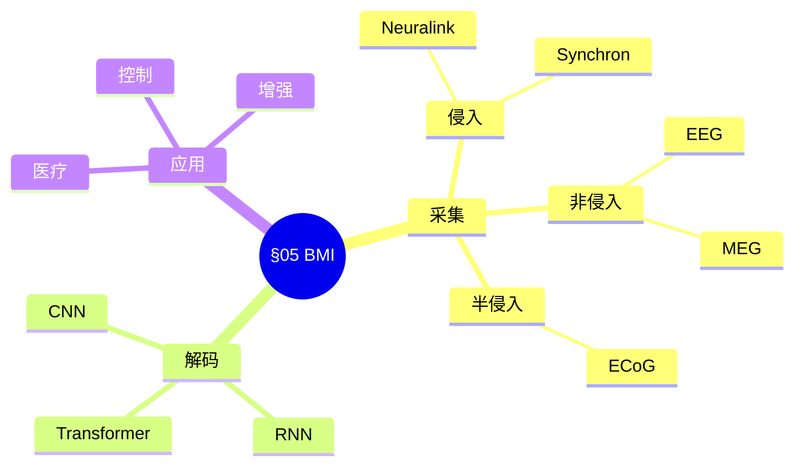

---

## 八 · 跨章桥接

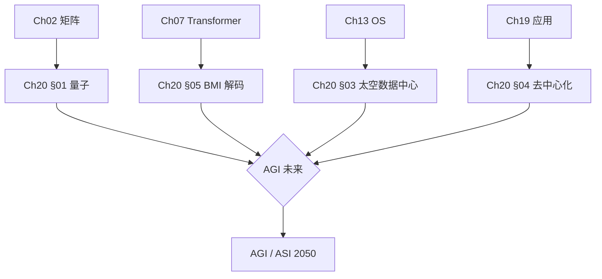

---

## 九 · 演进时间线

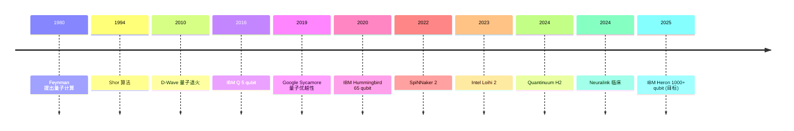

---

## 十 · AGI 时间线 (估计)

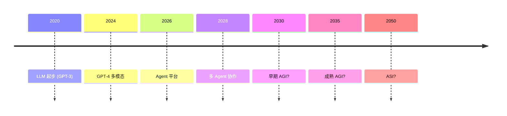

---

## 十一 · 量子 vs 经典对比

| 维度 | 经典 | 量子 |
|------|------|------|
| 状态 | 0/1 | 0/1 叠加 |
| 操作 | AND/OR/NOT | 量子门 |
| 错误率 | 极低 | ~1% |
| 互联 | 总线 | 纠缠 |
| 算法 | 通用 | 特定 (Shor/Grover) |

---

## 十二 · 神经形态 vs GPU

| 维度 | GPU | 神经形态 |
|------|-----|----------|
| 计算模式 | SIMT | 事件驱动 |
| 内存 | HBM 大 | 局部 |
| 功耗 | 高 (300W) | 极低 (<10W) |
| 擅长 | matmul | 时序稀疏 |
| 编程 | CUDA | SNN 工具 |

---

## 十三 · 太空数据中心优势

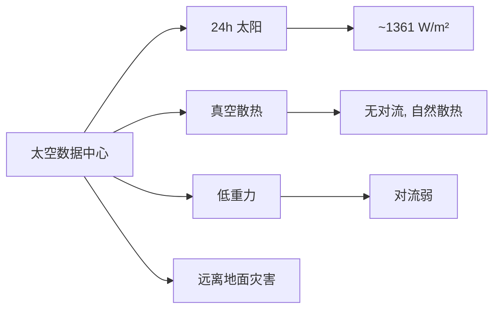

---

> 这张导图覆盖 Ch20 全章。建议: 先背章节主入口 → 按节背子图 → 演进时间线 → AGI 时间线。