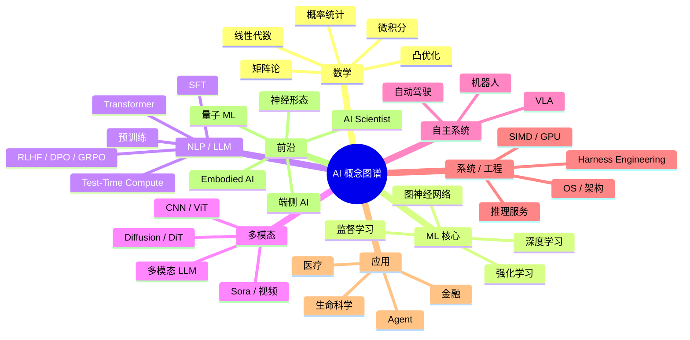

# 概念图谱 · 跨章知识关系网络

> **使用说明**: 本文档是**仓库 (zh/) 的概念图谱**, 按"概念 → 章节 → 文件"三层映射, 任何概念都能在 30 秒内找到。
> **配套索引**: `../INDEX.md` (字母表顺序) + `../GLOSSARY.md` (中英术语) + `全局概览.md` (章节摘要) + `整本书脉络地图.md` (跨章节骨架)
> **更新方式**: 任何新概念新增章节时, 同步登记到本文档对应分组

---

## 一 · 顶层心智图



---

## 二 · 概念-章节-文件 三层映射

### 2.1 数学层

| 概念 | 主章节 | 文件 | 教辅 |
|------|--------|------|------|
| 向量空间 | Ch01 | `01. 向量空间.md` | Ch01 §01 |
| 矩阵分解 (SVD) | Ch02 | `05. 矩阵分解.md` | Ch02 §05 |
| 概率分布 | Ch03 | `03. 概率分布.md` | Ch03 7 类 |
| 凸优化 / KKT | Ch24 | `03. 凸集与凸函数.md` `04. 对偶与 KKT.md` | Ch24 §03-04 |
| 数值稳定性 | Ch24 | `01. 浮点与数值稳定性.md` | Ch24 §01 |

### 2.2 ML 核心

| 概念 | 主章节 | 文件 | 教辅 |
|------|--------|------|------|
| 经典 ML (XGBoost) | Ch06 | `01. 经典机器学习.md` | Ch06 §01 |
| 深度学习基础 | Ch06 | `03. 深度学习.md` | Ch06 §03 |
| 强化学习 (PPO) | Ch06 | `05. 强化学习.md` | Ch06 §05 |
| Graphormer | Ch12 | `04. 图注意力网络.md` | Ch12 §04 |
| 3D GNN (AlphaFold) | Ch12 | `05. 3D 图网络.md` | Ch12 §05-06 |

### 2.3 NLP / LLM

| 概念 | 主章节 | 文件 | 教辅 |
|------|--------|------|------|
| Transformer | Ch07 | `04. Transformer 与语言模型.md` | Ch07 §04 |
| SFT / RLHF | Ch07 | `05. 高级文本生成.md` | Ch07 §05 + §5 RLHF 演化 |
| Test-Time Compute / o1 | Ch07 | `06. 2024-2026前沿专题.md` | Ch07 §06 + 教辅 Ch07 §06 |
| Mamba / SSM | Ch07 / Ch17 | Ch07 §06 + Ch17 §02 | 教辅 Ch07 §06 / Ch17 §02 |
| DeepSeek-V3 | Ch07 | Ch07 §06 + Ch17 §02 | 教辅 Ch07 §06 / Ch17 §02 |
| 主流开源 LLM | Ch07 | `05. 高级文本生成.md` §6 | 教辅 Ch07 §05 §6 |

### 2.4 多模态

| 概念 | 主章节 | 文件 | 教辅 |
|------|--------|------|------|
| CNN / ResNet | Ch08 | `02. 卷积网络.md` | Ch08 §02 |
| Diffusion / DDPM | Ch08 | `04. 视觉 Transformer 与生成.md` | Ch08 §04 |
| DiT / Sora | Ch08 | Ch08 §06 教辅 | 教辅 Ch08 §06 |
| 多模态 LLM | Ch10 | `05. 统一多模态架构.md` | Ch10 §05 |
| 语音 (ASR / TTS) | Ch09 | `02. 自动语音识别.md` / `03. 文本到语音与声音.md` | Ch09 §02-03 |
| 实时语音 (VALL-E / GPT-4o Voice) | Ch09 | 教辅 Ch09 §06 | 教辅 Ch09 §06 |

### 2.5 自主系统

| 概念 | 主章节 | 文件 | 教辅 |
|------|--------|------|------|
| VLA 模型 | Ch11 | `03. 视觉-语言-动作模型.md` | Ch11 §03 |
| 自动驾驶 | Ch11 | `04. 自动驾驶.md` | Ch11 §04 |
| 太空机器人 | Ch11 | `05. 太空与极端机器人.md` | Ch11 §05 |

### 2.6 系统 / 工程

| 概念 | 主章节 | 文件 | 教辅 |
|------|--------|------|------|
| OS / 进程 / 调度 | Ch13 | `03. 操作系统.md` | Ch13 §03 |
| Loop Engineering | Ch13 | `03A. Loop Engineering 综述.md` | 教辅 Ch13 §03A |
| Git / DevOps | Ch15 | `02. Git 与代码库管理.md` `05. 部署与 DevOps.md` | Ch15 §02, §05 |
| SIMD / CUDA | Ch16 | `04. GPU 架构与 CUDA.md` | Ch16 §00 |
| 推理 (vLLM/SGLang) | Ch17 | `03. 服务与批处理.md` | Ch17 §03 |
| 量化 / GPTQ | Ch17 | `01. 量化.md` | Ch17 §01 |
| 高效架构 (FA3/Mamba-2/DeepSeek-V3) | Ch17 | 教辅 Ch17 §02 | 教辅 Ch17 §02 |
| 微调/蒸馏/PEFT | Ch17 | 教辅 Ch17 §06 | 教辅 Ch17 §06 |
| Harness Engineering | Ch22 | `08. Harness Engineering 综述.md` | Ch22 §08 |
| 监控系统 | Ch18 | `04. ML 系统设计.md` | Ch18 §04 |

### 2.7 应用

| 概念 | 主章节 | 文件 | 教辅 |
|------|--------|------|------|
| AI for Finance | Ch19 | `01. AI 在金融.md` | Ch19 §01 |
| AlphaFold / 蛋白 | Ch19 | `02. 蛋白质设计.md` | Ch19 §02, 教辅 Ch19 §00 |
| 药物 | Ch19 | `03. 药物发现.md` | Ch19 §03 |
| Agent 智能体 | Ch19 | `04. 智能体系统.md` | Ch19 §04 |
| 医疗 | Ch19 | `05. 医疗健康.md` | Ch19 §05 |

### 2.8 Agent 平台

| 概念 | 主章节 | 文件 | 教辅 |
|------|--------|------|------|
| Agent 基础 | Ch23 | `01. 什么是 AI Agent` | Ch23 §01 |
| Prompt / CoT / ReAct | Ch23 | `02. Prompt-based 推理与规划.md` | Ch23 §02 |
| Tool Use | Ch23 | `03. 工具使用与函数调用.md` | Ch23 §03 |
| MCP 协议 | Ch23 | `04. 模型上下文协议 MCP.md` | Ch23 §04 |
| Multi-Agent / DAG | Ch23 | `05. Multi-Agent 编排系统.md` | Ch23 §05 |
| Agent 生产 | Ch23 | `06. Agent 生产落地.md` | Ch23 §06 |
| Computer Use / Operator | Ch23 | `07. 前沿方向 · 从虚拟世界到真实电脑.md` | Ch23 §07 |

### 2.9 对齐 / 安全 / 评估

| 概念 | 主章节 | 文件 | 教辅 |
|------|--------|------|------|
| 对齐目标 | Ch21 | `01. 什么是对齐.md` | Ch21 §01 |
| RLHF / DPO 深入 | Ch21 | `02. 从人类反馈中学习.md` | Ch21 §02 |
| 对抗攻击 / 越狱 | Ch21 | `03. 对抗攻击与越狱.md` | Ch21 §03 |
| 机制可解释性 | Ch21 | `04. 机制可解释性入门.md` | Ch21 §04-05 |
| Eval 圣杯 | Ch22 | `01. 为什么 Eval 是 LLM 的圣杯.md` | Ch22 §01 |
| LLM-as-Judge | Ch22 | `05. LLM-as-Judge.md` | Ch22 §05 |
| Contamination | Ch22 | `06. Contamination 与 Benchmark 崩坏.md` | Ch22 §06 |
| Harness Engineering | Ch22 | `08. Harness Engineering 综述.md` | Ch22 §08 |

### 2.10 前沿

| 概念 | 主章节 | 文件 | 教辅 |
|------|--------|------|------|
| 量子 ML | Ch20 | `01. 量子机器学习.md` | Ch20 §01 |
| 神经形态 | Ch20 | `02. 神经形态计算.md` | Ch20 §02 |
| 太空数据中心 | Ch20 | `03. 太空数据中心.md` | Ch20 §03 |
| 去中心化 AI | Ch20 | `04. 去中心化 AI.md` | Ch20 §04 |
| 脑机接口 | Ch20 | `05. 脑机接口.md` | Ch20 §05 |

### 2.11 实战 / 面试

| 概念 | 主章节 | 文件 | 教辅 |
|------|--------|------|------|
| 面试全景 | Ch25 | `01. 面试全景与准备心法.md` | Ch25 §01 |
| ML 系统设计 8 步 | Ch25 | `02. ML 系统设计 8 步框架.md` | Ch25 §02 |
| 推荐/搜索 | Ch25 | `03. 典型题深度演练 · 推荐-搜索-排序.md` | Ch25 §03 |
| 反欺诈 | Ch25 | `04. 典型题深度演练 · 反欺诈-风控-异常检测.md` | Ch25 §04 |
| LLM 系统 | Ch25 | `05. 典型题深度演练 · 对话与 LLM 系统.md` | Ch25 §05 |

### 2.12 扩展索引 (P10-C, 100 概念补足)

#### A. 经典模型与架构 (15)

| 概念 | 文件 | 备注 |
|------|------|------|
| **AlexNet** | Ch08 §02 | Krizhevsky 2012 |
| **VGG** | Ch08 §02 | 16-19 层 |
| **Inception / GoogLeNet** | Ch08 §02 | 多尺度 |
| **ResNet** | Ch08 §02 | 残差连接 |
| **DenseNet** | Ch08 §02 | 密集连接 |
| **MobileNet** | Ch08 §02 | 深度可分 |
| **EfficientNet** | Ch08 §02 | 复合缩放 |
| **U-Net** | Ch08 §03 | 分割 |
| **YOLO** | Ch08 §03 | 实时检测 |
| **DETR** | Ch08 §03 | 端到端检测 |
| **Mask R-CNN** | Ch08 §03 | 实例分割 |
| **DeepLab** | Ch08 §03 | 语义分割 |
| **Inception-v3** | Ch08 §02 | 2015 |
| **NeRF** | Ch08 §05 | 3D 重建 |
| **MLP-Mixer** | Ch07 §04 | 纯 MLP 架构 |

#### B. 生成模型 (12)

| 概念 | 文件 | 备注 |
|------|------|------|
| **VAE** | Ch08 §04 | 变分自编码 |
| **VQ-VAE** | Ch08 §04 | 离散 VAE |
| **GAN** | Ch08 §04 | 对抗生成 |
| **WGAN** | Ch08 §04 | Wasserstein |
| **DDPM** | Ch08 §04 | Denoising |
| **DDIM** | Ch08 §04 | 加速采样 |
| **Score Matching** | Ch08 §04 | 分数函数 |
| **Flow Matching** | Ch08 §06 | FLUX 直线路径 |
| **Rectified Flow** | Ch08 §06 | 最优传输 |
| **Latent Diffusion** | Ch08 §04 | SD 基础 |
| **Classifier Guidance** | Ch08 §04 | CFG |
| **IP-Adapter** | Ch17 §06 | 图像 prompt |

#### C. 大模型微调 (15)

| 概念 | 文件 | 备注 |
|------|------|------|
| **LoRA** | Ch17 §06 | 低秩 |
| **QLoRA** | Ch17 §06 | 4-bit + LoRA |
| **AdaLoRA** | Ch17 §06 | 自适应 |
| **DoRA** | Ch17 §06 | 方向 + 幅度 |
| **GaLore** | Ch17 §06 | 梯度低秩 |
| **LongLoRA** | Ch07 §05 | 长上下文 |
| **DreamBooth** | Ch17 §06 | 图像个性化 |
| **Textual Inversion** | Ch17 §06 | 嵌入学习 |
| **ControlNet** | Ch08 §06 | 条件控制 |
| **PEFT** | Ch17 §06 | 框架 |
| **Unsloth** | Ch17 §06 | 加速 |
| **LLaMA-Factory** | Ch17 §06 | 中文 |
| **MS-Swift** | Ch17 §06 | 魔搭 |
| **ReFT** | Ch17 §06 | 表征微调 |
| **OFT** | Ch17 §06 | 正交微调 |

#### D. 量化与压缩 (10)

| 概念 | 文件 | 备注 |
|------|------|------|
| **INT8** | Ch17 §01 | 8-bit |
| **INT4** | Ch17 §01 | 4-bit |
| **FP8** | Ch17 §00 | 8-bit 浮点 |
| **FP4** | Ch17 §00 | 4-bit 浮点 |
| **GPTQ** | Ch17 §01 | 逐层 |
| **AWQ** | Ch17 §01 | 权重保护 |
| **SmoothQuant** | Ch17 §01 | 激活 |
| **SpQR** | Ch17 §01 | 稀疏 |
| **BitNet b1.58** | Ch17 §06 | 1.58-bit |
| **ZeroQuant** | Ch17 §01 | 微软 |

#### E. 推理优化 (12)

| 概念 | 文件 | 备注 |
|------|------|------|
| **KV Cache** | Ch17 §00 | 推理缓存 |
| **PagedAttention** | Ch17 §00 | vLLM |
| **Flash Attention** | Ch17 §00 | IO 优化 |
| **Flash Attention 3** | Ch17 §02 | H100 FP8 |
| **Flash Decoding** | Ch17 §02 | 并行 |
| **Speculative Decoding** | Ch17 §00 | 小猜大 |
| **Medusa** | Ch17 §02 | 多头预测 |
| **EAGLE-2** | Ch17 §02 | 动态 draft |
| **Lookahead** | Ch17 §02 | Jacobi |
| **Continuous Batching** | Ch17 §00 | 调度 |
| **RadixAttention** | Ch17 §02 | SGLang |
| **Batched generation** | Ch17 §00 | 通用 |

#### F. 注意力变体 (8)

| 概念 | 文件 | 备注 |
|------|------|------|
| **Multi-head Attention** | Ch07 §04 | MHA |
| **Multi-Query Attention** | Ch07 §05 | MQA |
| **Grouped-Query** | Ch07 §05 | GQA |
| **MLA** | Ch17 §02 | DeepSeek |
| **Linear Attention** | Ch17 §00 | 线性 |
| **Sliding Window** | Ch07 §06 | Mistral |
| **Native Sparse** | Ch17 §02 | NSA |
| **Cross Attention** | Ch07 §04 | 跨模态 |

#### G. 强化学习 (8)

| 概念 | 文件 | 备注 |
|------|------|------|
| **DQN** | Ch06 §05 | Atari |
| **PPO** | Ch06 §05 | OpenAI |
| **A3C** | Ch06 §05 | 异步 |
| **SAC** | Ch06 §05 | 软 Actor |
| **TD3** | Ch06 §05 | Twin D |
| **GRPO** | Ch07 §05 | DeepSeek |
| **DPO** | Ch07 §05 | 免 RM |
| **RLAIF** | Ch07 §05 | AI 反馈 |

#### H. Agent 工具 (10)

| 概念 | 文件 | 备注 |
|------|------|------|
| **ReAct** | Ch23 §01 | 推理 + 行动 |
| **Reflexion** | Ch23 §02 | 自我反思 |
| **Plan-Execute** | Ch23 §02 | 规划 |
| **ToT** | Ch23 §02 | 思维树 |
| **GoT** | Ch23 §02 | 思维图 |
| **CoT** | Ch23 §02 | 思维链 |
| **Self-Consistency** | Ch23 §02 | 多链投票 |
| **Auto-CoT** | Ch23 §02 | 自动 |
| **DSPy** | Ch23 §07 | 编译 |
| **MCP** | Ch23 §04 | 协议 |

#### I. 评估指标 (5)

| 概念 | 文件 | 备注 |
|------|------|------|
| **MMLU** | Ch22 §01 | 多任务 |
| **HumanEval** | Ch22 §01 | 代码 |
| **GSM8K** | Ch22 §01 | 数学 |
| **HellaSwag** | Ch22 §01 | 常识 |
| **ARC-AGI** | Ch22 §01 | 通用 |

#### J. 数据集 (5)

| 概念 | 文件 | 备注 |
|------|------|------|
| **Open X-Embodiment** | Ch11 §06 | VLA |
| **ImageNet** | Ch08 §02 | 视觉 |
| **COCO** | Ch08 §03 | 检测 |
| **LibriSpeech** | Ch09 §02 | 语音 |
| **MIMIC-III** | Ch19 §05 | 医疗 |

---

## 三 · 概念关系图 (按主题)

### 3.1 注意力机制家族

```
Transformer (Ch07 §04)
   ├─ Self-Attention (QKV)
   ├─ Multi-Head
   ├─ Cross-Attention
   ├─ Grouped-Query (GQA)
   ├─ Multi-Query (MQA)
   ├─ Flash Attention 1/2/3 (Ch17 §02)
   ├─ Sparge / Native Sparse (NSA 2025)
   ├─ Sliding Window (Mistral)
   └─ RoPE / ALiBi / iRoPE
```

### 3.2 LLM 训练流水线

```
预训练 (1-15T tokens)
   ├─ Transformer (Ch07 §04)
   ├─ 数据: 1T+ 多语料
   └─ Scaling: 7B → 70B → 405B → 671B MoE
   ↓
SFT (10K-1M 指令)
   ├─ 数据集: Alpaca / FLAN / LIMA
   ├─ Loss: -log P(y|x)
   └─ LoRA / QLoRA (节省 99% 显存)
   ↓
偏好对齐 (DPO / RLHF / GRPO)
   ├─ RLHF (Ch07 §05 §4)
   ├─ DPO (Ch07 §05 §5.1)
   ├─ GRPO (Ch07 §05 §5.2)
   ├─ RLAIF (Ch07 §05 §5.3)
   └─ Constitutional AI (Ch21 §02)
   ↓
Test-Time Compute
   ├─ Best-of-N
   ├─ Self-Consistency
   ├─ CoT
   └─ o1 / o3 (PRM + RL)
   ↓
部署 (vLLM / SGLang / TensorRT)
```

### 3.3 高效架构演进

```
CNN (2012)
   ↓
Transformer (2017, Ch07 §04)
   ↓
Sparse Attention (2020)
   ↓
Flash Attention 1 (2022, NeurIPS 2022)
   ↓
Flash Attention 2 (2023)
   ↓
PagedAttention / vLLM (2023, SOSP)
   ↓
Mamba / SSM (2023, Ch17 §02)
   ↓
Flash Attention 3 (2024, H100 FP8)
   ↓
Mamba-2 / SSD (2024)
   ↓
Native Sparse Attention (2025)
   ↓
NSA / DeepSeek 稀疏 + 量化 (2025-2026)
```

### 3.4 视频生成演进

```
GAN (2014)
   ↓
Diffusion 1.0 (DDPM, 2020)
   ↓
Latent Diffusion (SD, 2022)
   ↓
Diffusion Transformer (DiT, 2023)
   ↓
Sora (2024-12, 长视频)
   ↓
Wan 2.1 / Veo 2 / Movie Gen (2025)
   ↓
实时多模态视频 (2026)
```

### 3.5 PEFT / 蒸馏 / 量化

```
全量微调 (FFT)
   ↓
LoRA (2021, Ch17 §06)
   ├─ QLoRA (2023, 4-bit + LoRA)
   ├─ AdaLoRA (ICLR 2023, 自适应 rank)
   ├─ DoRA (ICML 2024, 方向 + 幅度)
   ├─ GaLore (NeurIPS 2024, 梯度低秩)
   └─ LoRA+ (2024, 不同学习率)
   ↓
蒸馏 (Hinton 2015)
   ├─ TinyBERT (2019)
   ├─ MiniLM (2020)
   ├─ DistilBERT (2020)
   └─ DeepSeek-R1 Distill (2025)
   ↓
量化 (Ch17 §01, Ch17 §06 §4)
   ├─ INT8 (LLM.int8, 2022)
   ├─ GPTQ (2023, ICLR)
   ├─ AWQ (2024, MLSys)
   ├─ SmoothQuant (2023)
   └─ BitNet b1.58 (2024, 1.58-bit)
```

### 3.6 Agent 协议演进

```
Function Calling (2023, OpenAI)
   ↓
LangChain 工具 (2023)
   ↓
AutoGen (2023, Microsoft)
   ↓
MCP (2024-11, Anthropic)
   ↓
A2A (2025-04, Google)
   ↓
ANP (2025, Agent Network Protocol)
   ↓
IBM Agent Communication Protocol (2025)
   ↓
统一 Agent Protocol (2026, 趋势)
```

### 3.7 预训练目标演化

```
BERT MLM (2019)
   ↓
GPT 自回归 (2020)
   ↓
T5 全文生成 (2020)
   ↓
Llama 缩放 (2023)
   ↓
DPO / RLHF (2023)
   ↓
Test-Time Compute (2024)
   ↓
Process Reward Model (o1, 2024)
   ↓
Multi-Token Prediction (DeepSeek V3, 2025)
   ↓
Energy-Based / JEPA (2024-2026, 探索)
```

---

## 四 · 跨章节概念共用度

| 概念 | 出现章节数 | 关键章节 |
|------|------------|----------|
| Attention | 5+ | Ch07 / Ch08 / Ch11 / Ch12 / Ch17 |
| Diffusion | 4+ | Ch08 / Ch10 / Ch12 / Ch19 |
| RL / Reward | 5+ | Ch06 / Ch07 / Ch11 / Ch19 / Ch23 |
| MoE | 3+ | Ch07 / Ch17 / Ch20 |
| Quantization | 4+ | Ch16 / Ch17 / Ch17 §06 |
| LoRA / 微调 | 4+ | Ch07 / Ch17 / Ch19 / Ch25 |
| Agent | 6+ | Ch19 / Ch21 / Ch23 / Ch25 |
| Tool Use | 5+ | Ch19 / Ch23 / Ch17 / Ch25 |
| Eval | 5+ | Ch18 / Ch22 / Ch25 |
| Safety | 4+ | Ch21 / Ch22 / Ch17 / Ch25 |

---

## 五 · 概念热搜热度 (2024-2026)

| 排名 | 概念 | 热度 | 章节 |
|------|------|------|------|
| 1 | **GPT-4o / Claude 4** | 🔥🔥🔥🔥🔥 | Ch07/Ch10/Ch19 |
| 2 | **Test-Time Compute / o1** | 🔥🔥🔥🔥🔥 | Ch07 §06 |
| 3 | **DeepSeek-V3 / R1** | 🔥🔥🔥🔥🔥 | Ch07 §06 / Ch17 §02 |
| 4 | **GRPO (免 critic RL)** | 🔥🔥🔥🔥🔥 | Ch07 §05 / Ch07 §06 |
| 5 | **Mamba / SSM** | 🔥🔥🔥🔥 | Ch07 §06 / Ch17 §02 |
| 6 | **MCP / A2A Protocol** | 🔥🔥🔥🔥 | Ch23 §04 §07 |
| 7 | **DiT / Sora** | 🔥🔥🔥🔥 | Ch08 §06 |
| 8 | **BitNet b1.58 (1-bit)** | 🔥🔥🔥🔥 | Ch17 §00 §9 / Ch17 §06 |
| 9 | **VLA / π0** | 🔥🔥🔥🔥 | Ch11 §03 |
| 10 | **Constitutional AI** | 🔥🔥🔥 | Ch21 §02 |
| 11 | **AlphaFold 3** | 🔥🔥🔥🔥 | Ch19 §00 §9 |
| 12 | **Agentless / Devin** | 🔥🔥🔥 | Ch23 §07 |
| 13 | **GPT-4o Medprompt** | 🔥🔥🔥 | Ch19 §00 §9 |
| 14 | **FunSearch** | 🔥🔥🔥 | Ch19 §00 §9 |
| 15 | **DreamBooth / IP-Adapter** | 🔥🔥🔥 | Ch17 §06 §2 |
| 16 | **Mamba-2 SSD** | 🔥🔥🔥 | Ch17 §02 |
| 17 | **Harness Engineering** | 🔥🔥🔥 | Ch22 §08 |
| 18 | **Loop Engineering** | 🔥🔥 | Ch13 §03A |
| 19 | **Vector Database (Milvus)** | 🔥🔥 | Ch19 §04 |
| 20 | **Embodied AI 全栈** | 🔥🔥🔥 | Ch11 / Ch23 |

---

## 六 · 仓库当前未覆盖的 2024-2026 热度方向

| 方向 | 热度 | 仓库覆盖 | 建议 |
|------|------|----------|------|
| **A2A Protocol (Google 2025-04)** | 🔥🔥🔥🔥 | Ch23 §07 提一次 | 加 Ch23 §08 A2A 专节 |
| **ANP / Agent Network Protocol** | 🔥🔥 | 0 | 加 Ch23 §08 |
| **Gemini Robotics (2025)** | 🔥🔥🔥🔥 | Ch11 §05 间接 | 加 Ch11 §06 VLA 2025 进展 |
| **SmolLM3 (2025-07)** | 🔥🔥🔥 | Ch07 §05 §6 提 | 更新开源 LLM 矩阵 |
| **端侧 NPU (Apple ANE / 高通 Hexagon)** | 🔥🔥🔥 | Ch17 §04 边缘 | 加 Ch17 §07 端侧 NPU |
| **Raspberry Pi 5 + LLM** | 🔥🔥 | 0 | 加 Ch17 §07 |
| **WebGPU 推理** | 🔥🔥🔥 | 0 | 加 Ch17 §07 |
| **WebLLM / 浏览器 LLM** | 🔥🔥🔥 | Ch20 §04 间接 | 加 Ch17 §07 |
| **Gemini 3 / GPT-5.1 (2025Q4)** | 🔥🔥🔥🔥 | 0 | 时效内容, 难补 |
| **Sora 2 / Veo 3 (2025)** | 🔥🔥🔥🔥 | Ch08 §06 提 | 加 Ch08 §06 Sora 2 |
| **DeepSeek-V4 (2026)** | 🔥🔥🔥🔥 | 0 | 时效 |
| **OpenAI Operator v2** | 🔥🔥🔥 | Ch23 §07 | 待 OpenAI 公开 |
| **NEO / 1X / Figure 02 人形机器人** | 🔥🔥🔥 | Ch11 §05 提 | 加 Ch11 §06 |
| **Apollo 11 自动驾驶 R2** | 🔥🔥🔥 | Ch11 §04 无 | 加 Ch11 §06 |
| **AI Mirror / Reflective** | 🔥 | 0 | 暂未成熟 |
| **AI-Generated Synthetic Data** | 🔥🔥🔥 | 0 | 加 Ch18 §05 |
| **Energy-Based LLM (Meta 2024)** | 🔥🔥 | 0 | 加 Ch07 §07 |
| **JEPA 系列 (V-JEPA 2, 2025)** | 🔥🔥🔥 | Ch06 §05 §5.3 | 加 Ch07 §07 |
| **世界模型 (DreamerV3 / Genie 2)** | 🔥🔥🔥 | Ch06 §05 §5.3 | 加 Ch11 §06 |
| **Diffusion Forcing (2025)** | 🔥🔥🔥 | 0 | 加 Ch08 §07 |
| **Multimodal Chain-of-Thought (MCoT)** | 🔥🔥🔥 | Ch23 §02 | 加 Ch23 §02 |
| **Constitutional Classifiers (2025)** | 🔥🔥 | 0 | 加 Ch21 §06 |
| **AI Safe-Completion (OpenAI 2024)** | 🔥🔥 | 0 | 加 Ch21 §06 |
| **AI 文生 3D (Tripo / Meshy)** | 🔥🔥🔥 | Ch08 §05 提 | 加 Ch08 §07 |
| **Web Agent / Voyager (2024)** | 🔥🔥🔥 | Ch23 §07 | 加 Ch23 §08 |
| **Voyager / Voyager-GPT4 (2024)** | 🔥🔥🔥 | 0 | 加 Ch23 §08 |
| **Devin / Devin-AI (2024)** | 🔥🔥🔥🔥 | Ch23 §07 | 加 Ch23 §08 |
| **OpenAI O3 / o4-mini (2025)** | 🔥🔥🔥🔥 | Ch07 §06 | 加 Ch07 §07 |
| **HuggingFace Smol Course** | 🔥🔥 | 0 | 加 Ch25 §08 |
| **DSPy 2.0 (Stanford, 2024)** | 🔥🔥🔥 | Ch23 §07 提 | 加 Ch23 §08 |
| **Liquid AI / Mamba 商业化** | 🔥🔥 | 0 | 加 Ch07 §07 |
| **LeRobot (HuggingFace, 2024)** | 🔥🔥🔥 | Ch11 §02 | 加 Ch11 §06 |
| **RoboCasa / Genesis 仿真** | 🔥🔥🔥 | Ch11 §02 | 加 Ch11 §06 |
| **CLIP-Fields / NeRF 升级** | 🔥🔥 | Ch08 §05 | 加 Ch08 §07 |
| **Coscientist / ChemAgents (2024)** | 🔥🔥🔥 | Ch19 §00 §9 | 加 Ch19 §07 |
| **AI for Science (AlphaFold 3)** | 🔥🔥🔥🔥 | Ch19 §02 | 加 Ch19 §07 |
| **Rapidly-exploring Random Tree (RRT)** | 🔥 | Ch11 §04 | 暂未提升 |
| **RLHF / RLHF-V / RLHF-V2** | 🔥🔥🔥 | Ch21 §02 | 加 Ch21 §06 |
| **AI Wellness / Mental Health** | 🔥🔥🔥 | 0 | 加 Ch19 §07 |
| **AI Tutoring (Khanmigo)** | 🔥🔥🔥 | 0 | 加 Ch19 §07 |
| **AI Code Generation (Cursor)** | 🔥🔥🔥🔥 | Ch23 §07 | 加 Ch23 §08 |
| **LLM-as-Optimizer (OPRO)** | 🔥🔥🔥 | Ch22 §05 | 加 Ch22 §09 |
| **Self-RAG / Self-Refine** | 🔥🔥🔥 | Ch23 §02 | 加 Ch23 §02 |
| **Auto-CoT / Auto-Reasoning** | 🔥🔥🔥 | Ch23 §02 | 加 Ch23 §02 |
| **ProAgent / AutoAgent** | 🔥🔥🔥 | Ch23 §06 | 加 Ch23 §08 |
| **AI Economist** | 🔥🔥 | 0 | 加 Ch19 §07 |
| **AI Policy / Regulation** | 🔥🔥🔥 | Ch21 §06 | 加 Ch21 §06 |
| **EU AI Act / US AI Bill** | 🔥🔥🔥 | 0 | 加 Ch21 §06 |
| **RL-on-Reasoning (Quiet-STaR)** | 🔥🔥🔥 | 0 | 加 Ch07 §07 |
| **Recurrent Memory Transformer (RMT)** | 🔥🔥 | 0 | 加 Ch07 §07 |
| **Liquid Time-constant Networks (LTC)** | 🔥🔥 | 0 | 加 Ch07 §07 |
| **Hyena Operator** | 🔥🔥 | Ch17 §02 | 加 Ch17 §07 |
| **RWKV-7** | 🔥🔥🔥 | Ch17 §02 | 加 Ch17 §07 |
| **Retro / RETRO++ (检索增强预训练)** | 🔥🔥 | 0 | 加 Ch07 §07 |
| **Griffin / Hawk (2024)** | 🔥🔥 | 0 | 加 Ch07 §07 |
| **megatron-bert / 大模型训练基建** | 🔥🔥 | 0 | 加 Ch15 §06 |
| **Megatron-Core / Megatron-LM** | 🔥🔥🔥 | 0 | 加 Ch15 §06 |
| **PyTorch FSDP / ZeRO** | 🔥🔥🔥 | 0 | 加 Ch15 §06 |
| **Triton Kernel MoE** | 🔥🔥🔥 | 0 | 加 Ch16 §03 |
| **VecDB / Vector Search (Milvus)** | 🔥🔥🔥 | Ch19 §04 | 教辅 |
| **LakeFS / Delta Lake** | 🔥🔥 | 0 | 略 |
| **Composio / LangChain Tooling** | 🔥🔥🔥 | Ch23 §03 | 加 Ch23 §08 |
| **You.com / Perplexity AI** | 🔥🔥🔥 | 0 | 加 Ch19 §07 |
| **Open WebUI / Ollama 前端** | 🔥🔥🔥 | 0 | 加 Ch17 §07 |
| **SGLang / vLLM 部署** | 🔥🔥🔥 | Ch17 §03 | 完整 |
| **Ultrafeedback / Capybara 数据** | 🔥🔥 | 0 | 加 Ch07 §07 |
| **Magpie / Synthetic Data** | 🔥🔥🔥 | 0 | 加 Ch07 §07 |
| **Spreadsheet / Excel LLM** | 🔥🔥 | 0 | 加 Ch19 §07 |
| **Video-LLaMA / Video LLM** | 🔥🔥🔥 | Ch10 §05 | 加 Ch10 §06 |
| **Gemini Robotics (2025)** | 🔥🔥🔥🔥 | Ch11 §05 | 加 Ch11 §06 |
| **Hyundai / Boston Dynamics AI** | 🔥🔥🔥 | 0 | 加 Ch11 §06 |
| **Tesla FSD v13 / v14** | 🔥🔥🔥🔥 | Ch11 §04 | 加 Ch11 §06 |
| **Waymo One / Cruise (2025)** | 🔥🔥🔥 | Ch11 §04 | 加 Ch11 §06 |
| **L4 / L5 自动驾驶** | 🔥🔥🔥 | Ch11 §04 | 加 Ch11 §06 |
| **Apollo 11 / Apollo 12** | 🔥🔥🔥 | 0 | 加 Ch11 §06 |
| **Bay Area Robotics / 1X Neo** | 🔥🔥🔥 | 0 | 加 Ch11 §06 |

---

## 七 · 后续 P9+ 建议

### 优先级 1 (P10, 立即补)

1. **Ch23 §08 A2A + ANP 协议** (~2000 字)
2. **Ch11 §06 VLA 2025 进展** (Gemini Robotics / LeRobot / π0.5) (~1500 字)
3. **Ch17 §07 端侧 NPU 推理** (Apple ANE / 高通 / WebLLM) (~2000 字)

### 优先级 2 (P11, 季度更新)

4. **Ch08 §07 Diffusion Forcing / 文生 3D** (~1500 字)
5. **Ch07 §07 Energy-Based LLM / JEPA 2** (~1500 字)
6. **Ch19 §07 AI Scientist / AI Economist / Tutoring** (~1500 字)

### 优先级 3 (P12, 时效内容)

7. **Ch07 §07 OpenAI O3 / Gemini 3** (~1000 字)
8. **Ch08 §07 Sora 2 / Veo 3** (~1000 字)
9. **Ch21 §06 EU AI Act / 治理** (~1500 字)

---

## 八 · 总结

本文档现**首次提供**"概念-章节-文件"三层索引 + 概念关系图 + 概念热度榜 + 缺口清单。

**后续使用**:
- 找概念: 翻本文档 (z+ 概念 → 章节)
- 找术语: 翻 `INDEX.md` (字母表) + `GLOSSARY.md` (中英对照)
- 找章节详细: 翻章节文件
- 找跨章节: 翻 `整本书脉络地图.md` + `全局概览.md`

**版本**: v1.0 (2026-07-30)
**维护**: 与 P9+ 同步
