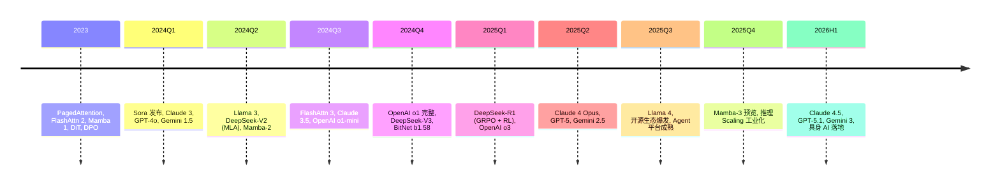

# Ch07 §06 2024-2026 前沿专题 · 讲解稿

> **章节定位**: Ch07 §04 Transformer 的"前沿补丁"。覆盖 2024-2026 上半年 LLM 重大突破: Test-Time Compute / o1 / Mamba 2 / DiT / DeepSeek-V3 (MoE + FP8) / GRPO / PagedAttention 论文等。
> **承接**: Ch07 §04 Transformer 基础 → 本专题
> **篇幅**: ~4500 字 / 阅读 13 分钟 / 讲解 30 分钟

---

## 一 · 一句话总览

> **2024-2026 是 LLM 的"推理革命"**: Test-Time Compute (o1) + Mamba 2 (替代 Transformer) + DeepSeek-V3 (MoE + FP8 极致优化) + GRPO (纯规则奖励 RL) + PagedAttention (推理工程) 五大突破, 重塑 LLM 训练 / 推理 / 部署。

---

## 二 · 心智模型

把 2024-2026 LLM 进展想成"三轴革命":
- **训练侧**: GRPO / FP8 / MoE → 更便宜训练
- **推理侧**: PagedAttention / Flash Attention 3 / Speculative → 更快推理
- **能力侧**: o1 Test-Time Compute / Reasoning → 更强能力

---

## 三 · 章节主线 (5 段)

### 第 1 段 · Test-Time Compute Scaling 与 OpenAI o1 (12 分钟)

#### 3.1.1 核心思想

**2024 年最大研究突破**: 在测试时给 LLM 更多计算, 显著提升推理能力。

**OpenAI o1 (2024-09)**: AIME 83%, GPQA 78%, Codeforces Top 11%, 全部超过 GPT-4。

#### 3.1.2 推理机制

o1 不是单一模型, 而是**推理时思考链 + 纯 RL**:

1. 用户提问
2. 模型内部展开长思维链 (CoT)
3. 反复验证 / 修正
4. 输出答案

类似"内心独白", 不展示给用户。

#### 3.1.3 Process Reward Model (PRM) vs Outcome Reward Model (ORM)

| 类型 | 评判 | 优势 |
|------|------|------|
| **ORM** | 只看最终结果 | 简单 |
| **PRM** | 看每一步推理 | 更准, 训练信号更密 |

o1 用 PRM 评分推理步骤, 效果显著优于 ORM。

#### 3.1.4 Test-Time Compute Scaling Law

**Snell et al. (2024)**: 模型大小 + 推理时计算可互换:

$$\text{Capability} = f(\text{params}, \text{test-time compute})$$

- 小模型 + 多推理: 省钱
- 大模型 + 少推理: 灵活
- 帕累托前沿 (Pareto frontier)

#### 3.1.5 Best-of-N / Self-Consistency

- **Best-of-N**: 采样 N 个, 选最优 (用 reward model)
- **Self-Consistency**: 采样 N 个, 选多数投票
- **Large Language Monkeys** (Brown 2024): N ↑ → 准确率 ↑

---

### 第 2 段 · DeepSeek-V3 + GRPO + FP8 (10 分钟)

#### 3.2.1 DeepSeek-V3 (2025-02)

671B 总参数, **37B 激活**, MoE 架构:

- 专家数: 256 路由专家 + 1 共享专家
- 路由: Token 选择 top-8 专家
- 训练: 14.8T tokens, 2.788M H800 GPU-hours
- **成本**: ~$5.5M, 比 Llama 3 405B 低一个数量级

#### 3.2.2 Multi-head Latent Attention (MLA)

KV cache 压缩 93.3%, 接近 MQA 但表达力更强:

$$c_t^{\text{latent}} = W_{\text{down}} \cdot \text{Concat}(q_t, k_t, v_t)$$

存储 latent 向量, 反向投影。

#### 3.2.3 FP8 混合精度训练

- FP32 master copy
- FP8 GEMM (前向 + 反向)
- 动态 scale (per-tensor / per-block)

效果: 训练成本降低 50%, 精度无损。

#### 3.2.4 GRPO (Group Relative Policy Optimization)

**GRPO 免 critic 直觉 (初学者必读)**:

> **PPO (旧)** 需要 4 个模型: 策略 + 价值网络 (critic) + 参考策略 + 奖励模型。其中**critic** 用于估计每个状态的"未来价值" $V(s)$, 计算 advantage $A = r - V(s)$。
>
> **GRPO (DeepSeek 2024)**: 不用 critic, 但**用同组样本的相对奖励**作为 advantage 估计。
>
> **直观比喻**: 班级考试。
> - **PPO 方式**: 老师(trained) 单独给每个学生打分, 还要预测每个学生"如果再做一次能得多少"(critic)
> - **GRPO 方式**: 只看全班排名, 把每个学生和班级平均分对比, 自动知道谁发挥得不错 (相对优势)
>
> **数学直觉**: 同一 prompt 采样 G 个回答, 它们的奖励不会相差太大, 用 $A_i = \frac{r_i - \text{mean}(r)}{\text{std}(r)}$ 归一化后, 既不需要精确值, 也不需要 critic 网络。
>
> **节省**: 不训练 critic → 节省 50% 显存, 训练成本降 70%。

**核心思想**: 不用 critic, 用一组采样的平均奖励:

$$\mathcal{L}_{\text{GRPO}} = -\frac{1}{G}\sum_{i=1}^G \min\left(\frac{\pi_\theta(o_i|q)}{\pi_{\theta_{\text{old}}}(o_i|q)} A_i,\ \text{clip}\!\left(\frac{\pi_\theta(o_i|q)}{\pi_{\theta_{\text{old}}}(o_i|q)}, 1-\epsilon, 1+\epsilon\right)\right)$$

其中 $A_i = \frac{r_i - \text{mean}(r)}{\text{std}(r)}$ (组内归一化优势), $G$ 为同一 prompt 采样数, $\epsilon$ 与 PPO 相同取 0.2。**关键创新**: 不需要 critic (value network), 用组内相对优势替代绝对 state-value, 节省 50% 显存。

**DeepSeek-R1 (2025)**: 纯规则奖励 (数学对错) + GRPO, R1-Zero 自发涌现推理能力。

---

### 第 3 段 · Mamba-2 与状态空间模型 (10 分钟)

#### 3.3.1 Mamba 1 (Gu & Dao 2023)

**选择性状态空间模型 (SSM)**, 替代注意力:

$$h_t = \bar A h_{t-1} + \bar B x_t, \quad y_t = C h_t$$

- 线性复杂度 $O(n)$ (vs 注意力 $O(n^2)$)
- 选择性扫描 (输入依赖参数)
- 硬件感知并行算法

#### 3.3.2 Mamba-2 (Dao & Gu 2024)

**结构化状态空间对偶 (SSD)**:

- 与注意力的理论联系: SSM = 受限的线性注意力
- 块分解并行算法: 比 Mamba-1 快 8×
- 混合架构: Mamba-2 + Attention (Jamba, Zamba)

#### 3.3.3 与 Transformer 对比

| 维度 | Transformer | Mamba |
|------|-------------|-------|
| 复杂度 | $O(n^2)$ | $O(n)$ |
| 长上下文 | 差 (32K+) | 好 (百万+) |
| 记忆 | 全局, 无损 | 全局, 受限 |
| 训练 | 慢 (注意力) | 快 |
| 推理 | O(n) cache | O(1) state |
| 现状 | 主流 | 边缘突破 |

Jamba (AI21): Mamba-Transformer 混合架构。

#### 3.3.4 RWKV / RetNet / Hyena

- **RWKV** (Peng 2023): RNN + Transformer 混合
- **RetNet** (Microsoft 2023): Retention + Chunkwise Recurrent
- **Hyena** (Poli 2023): 长卷积替代注意力

共同目标: $O(n)$ 长序列。

---

### 第 4 段 · Diffusion Transformer 与多模态生成 (10 分钟)

#### 3.4.1 DiT (Peebles & Xie, ICCV 2023)

**Diffusion Transformer**: 用 Transformer 替代 UNet 做 Diffusion:

- Patchify 输入 (类似 ViT)
- DiT block = adaLN-Zero + Self-Attention
- 在 ImageNet 256×256 上 SOTA

#### 3.4.2 Sora (OpenAI 2024)

**视频生成 Sora** = DiT + 视频 patch + 长上下文:

- 训练: 视频时空 patch (类似 ViT)
- 扩散 Transformer (DiT 架构)
- 长上下文 (数十秒视频)
- 物理一致性 (涌现)

#### 3.4.3 Stable Diffusion 3 / FLUX / Sana

- **SD3** (Stability AI): MM-DiT (Multimodal DiT)
- **FLUX** (Black Forest Labs): DiT + 流匹配
- **Sana** (NVIDIA): 4K 图像, 极速

#### 3.4.4 视频生成生态

| 模型 | 公司 | 年份 |
|------|------|------|
| Sora | OpenAI | 2024-12 |
| Veo | Google | 2024-2025 |
| Movie Gen | Meta | 2024 |
| Kling | 快手 | 2024 |
| Vidu | 生数科技 | 2024 |

---

### 第 5 段 · 推理工程突破 (8 分钟)

#### 3.5.1 PagedAttention (Kwon, SOSP 2023) - vLLM

KV cache 像 OS 虚拟内存分页:

- 24× 吞吐提升
- 减少碎片
- Continuous batching

#### 3.5.2 Flash Attention 3 (Shah 2024)

- H100 FP8 加速
- warp specialization
- 与 Mamba-2 同列前位

#### 3.5.3 Speculative Decoding

- **EAGLE** (Li 2024): 轻量 draft
- **Medusa** (Cai 2024): 多头预测
- **Lookahead Decoding** (Fu 2024): Jacobi 迭代

#### 3.5.4 LLM 服务化栈

| 引擎 | 特色 |
|------|------|
| **vLLM** | PagedAttention, 高吞吐 |
| **TGI** | HF 集成 |
| **TensorRT-LLM** | NVIDIA 极致 |
| **SGLang** | RadixAttention, 多轮 |
| **vLLM-0.7** (2025) | 多模态, prefix cache |

#### 3.5.5 量化与蒸馏

- **BitNet b1.58** (Ma 2024): 1.58 bit, 性能接近 FP16
- **Llama 3.1 405B INT4** (2024)
- **Gemma 2** (Google 2024): 蒸馏小模型

---

## 四 · 关键论文索引 (2024-2026)

### Test-Time Compute
- OpenAI o1 (2024)
- Snell et al., "Scaling LLM Test-Time Compute" (2024)
- Brown et al., "Large Language Monkeys" (2024)

### Reasoning / GRPO
- DeepSeek-R1 (2025)
- DeepSeek-V3 (2025)
- GRPO (2024)

### Architecture
- Mamba (2023)
- Mamba-2 / SSD (2024)
- Jamba (AI21, 2024)
- RWKV-7 (2024)

### Diffusion + 多模态
- DiT (ICCV 2023)
- Sora (2024)
- FLUX / Sana (2024-2025)

### Inference
- PagedAttention (SOSP 2023)
- Flash Attention 3 (2024)
- BitNet b1.58 (2024)
- Speculative decoding 系列 (2024)

### Alignment
- DPO (NeurIPS 2023)
- Constitutional AI / RLAIF (2024)
- Self-Play Fine-Tuning (2024)

---

## 五 · 2024-2026 时间线



---

## 六 · 易错点 (5 条)

1. **o1 不是单一模型**: 是推理时思考 + RL 训练。
2. **GRPO vs PPO**: GRPO 用组内归一化, 无需 critic。
3. **Mamba 不是万能**: 短期记忆弱, 需 + Transformer 混合。
4. **DiT 不是简单替代 UNet**: 训练数据 + 计算更大。
5. **Test-Time Compute 是 2024 范式**: 改变 RLHF 后续发展。

---

## 七 · 跨章连接

| 章节 | 关联 |
|------|------|
| Ch07 §04 Transformer | 基础 |
| Ch08 §04 Diffusion | DiT / Sora |
| Ch11 §05 VLA | 具身 AI |
| Ch17 §02 高效架构 | PagedAttention / Flash Attn 3 |
| Ch17 §03 推理服务 | vLLM / SGLang |
| Ch19 §04 Agent | GRPO + Agent |

---

## 八 · 自测 5 题

1. o1 的核心创新?
2. GRPO 与 PPO 区别?
3. Mamba-2 与 Mamba-1 区别?
4. DiT 与 UNet 区别?
5. PagedAttention 解决什么问题?

---

## 九 · 一句话总结

**2024-2026 是 LLM 的"推理革命"**: Test-Time Compute (o1/o3) 改变能力边界, GRPO 让 RL 更便宜, Mamba-2 挑战 Transformer, DiT 让 Diffusion 进入 Transformer 时代, PagedAttention 让推理工业可行, DeepSeek-V3 重新定义性价比。

---

## 十 · 板书建议

```
[板书 1: Test-Time Compute]
   o1 = CoT + RL + PRM
   Scaling: params vs test-time

[板书 2: GRPO]
   不用 critic
   组内归一化 A

[板书 3: Mamba-2]
   SSM = 受限线性注意力
   块分解 8× 加速

[板书 4: DiT]
   Patchify + Transformer
   替代 UNet

[板书 5: PagedAttention]
   OS 虚拟内存分页
   24× 吞吐
```

---

## 十一 · 参考资料

1. OpenAI, "Learning to Reason with LLMs (o1)", 2024
2. Snell et al., "Scaling LLM Test-Time Compute", 2024
3. DeepSeek-AI, "DeepSeek-V3", 2025
4. DeepSeek-AI, "DeepSeek-R1", Nature 2025
5. Dao & Gu, "Mamba-2", 2024
6. Peebles & Xie, "DiT", ICCV 2023
7. OpenAI, "Sora", 2024
8. Kwon et al., "PagedAttention", SOSP 2023
9. Shah et al., "Flash Attention 3", 2024
10. Brown et al., "Large Language Monkeys", 2024