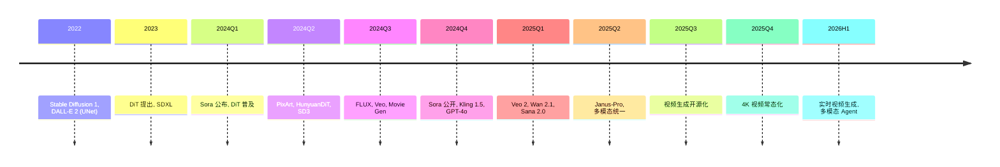

# Ch08 §06 2024-2026 多模态生成前沿 · 讲解稿

> **章节定位**: Ch08 §04 Diffusion + §05 视频的"2024-2026 前沿补丁"。覆盖 DiT 演进, Sora, FLUX, Sana, 视频生成生态。
> **承接**: Ch08 §04 Diffusion 基础 → Ch08 §05 视频 → 本前沿专题
> **篇幅**: ~3500 字 / 阅读 10 分钟 / 讲解 20 分钟

---

## 一 · 一句话总览

> **2024-2026 多模态生成 = DiT 一统江湖**: Diffusion Transformer 取代 UNet, 主导图像 / 视频 / 音频所有生成任务。

---

## 二 · 心智模型

把多模态生成想成"四代演进":
- **第一代 (2020)**: GAN (对抗式)
- **第二代 (2022)**: Diffusion UNet (CNN)
- **第三代 (2023)**: Diffusion Transformer (Patch)
- **第四代 (2024-2026)**: 模态统一 + 多模态 DiT

---

## 三 · 章节主线 (4 段)

### 第 1 段 · DiT 全面崛起 (8 分钟)

#### 3.1.1 DiT 基础 (Peebles & Xie, ICCV 2023)

**Diffusion Transformer**:
- 用 Transformer 替代 UNet
- Patchify 输入 (类似 ViT)
- adaLN-Zero 条件调制
- ImageNet 256×256 SOTA

**架构对比**:

| 组件 | UNet | DiT |
|------|------|-----|
| Backbone | CNN | Transformer |
| 条件注入 | 拼接/加性 | adaLN / Cross-Attn |
| 计算 | 卷积 | 自注意力 |
| 扩展性 | 差 | 强 (scaling) |
| 训练数据 | 1-2M 图像 | 1B+ |

#### 3.1.2 DiT 演进

**U-ViT / DiffiT / MDT** (2023-2024):
- 各种 Transformer + Diffusion 变体

**PixArt-α/Σ (2024)**:
- 4K 图像生成
- T5 文本编码
- 0.6B 参数训练高效

**Hunyuan-DiT (2024, 腾讯)**:
- 中文双语
- 15B 参数
- 开源

**kolors (快手, 2024)**:
- 视觉 + 文本协同
- SFT/DPO 对齐

#### 3.1.3 扩展定律

**Scaling DiT**:
- XL 变体: 675M → 3B → 7B
- 数据: 1M → 1B ImageText
- 训练: 256 → 1024 分辨率

**FID vs 模型大小**:
- 1B+ 模型后, 显著优于 UNet
- 配合 CLIP 文本编码, 接近 SOTA

---

### 第 2 段 · Sora 与视频生成革命 (10 分钟)

#### 3.2.1 Sora 技术报告 (OpenAI 2024-12)

**核心架构**:
- Diffusion Transformer (DiT)
- 视频时空 patch (类似 ViT)
- 长上下文 (数十秒)
- 物理一致性 (涌现)

**关键技术**:
- **Patchification**: 视频 → (3D patch)
- **Spacetime Attention**: 时空联合 attention
- **Recaptioning**: DALL-E 3 重写
- **Latent Diffusion**: 在压缩潜空间

**性能**:
- 最大 60s 1080p
- 多机多卡训练
- 物理直觉涌现

#### 3.2.2 视频生成生态

| 模型 | 公司 | 年份 | 特点 |
|------|------|------|------|
| **Sora** | OpenAI | 2024-12 | DiT 极致 |
| **Veo 2** | Google | 2024-12 | 4K 60 秒 |
| **Movie Gen** | Meta | 2024-10 | 16s 1080p |
| **Kling 1.5** | 快手 | 2024-12 | 中文优秀 |
| **Vidu** | 生数科技 | 2024-07 | 类 Sora |
| **Hailuo** | MiniMax | 2024-09 | 高质量 |
| **Runway Gen-3** | Runway | 2024 | 商用领先 |
| **Pika 2.0** | Pika | 2024 | 创意特效 |
| **Mochi 1** | Genmo | 2024 | 开源 |
| **Wan 2.1** | 阿里 | 2025 | 开源 SOTA |

#### 3.2.3 关键技术挑战

**时空一致性**:
- 帧间 attention
- 3D 位置编码
- Flow matching

**长视频**:
- KV cache 压缩
- 分段 + 平滑
- 上下文窗口

**物理性**:
- 数据 + 涌现
- 物理模拟器
- 合成数据

**动作 + 相机**:
- 轨迹控制
- 多视角
- 摄像机运动

---

### 第 3 段 · 图像生成生态 (10 分钟)

#### 3.3.1 Stable Diffusion 3

**SD3 (Stability AI, 2024)**:
- MM-DiT (Multimodal DiT)
- Flow Matching 替代 DDPM
- 2B 参数
- 文本理解显著提升

**核心技术**:
- **Flow Matching: 直线路径** (核心创新, 见下方初学者直觉)
- 纠错码文本编码
- 时间步简化

**Flow Matching 直觉 (初学者必读)**:

> **DDPM (传统 Diffusion)**: 从噪声到图像走的是**弯曲随机路径**。每一步加少量噪声, 1000 步才完成。训练时网络要预测每一步的"噪声去除量"。
>
> **Flow Matching (FLUX/SD3)**: 从噪声到图像走**直线**。数学上可以证明, 直线的**期望轨迹**和 DDPM 一样指向数据分布, 但梯度更稳定, 训练步数更少 (8-50 步就够)。
>
> **直观比喻**: 想象从山顶 (噪声) 走到山脚 (图像)。
> - **DDPM**: 走 1000 步 Z 字形下山, 每步很小心
> - **Flow Matching**: 走 50 步直线下山, 路径更短更稳
>
> **Reflow (Refined Flow)**: 进一步把路径"拉直", 训练时直接拟合直线速度场, 推理时 1-4 步即可。

**FLUX = DiT + Rectified Flow**: 完整 Rectified Flow 解释, 4 步推理可达 SOTA 质量。

#### 3.3.2 FLUX (Black Forest Labs)

**FLUX.1 [pro/dev/schnell]** (2024):
- DiT + 完整 rectified flow
- 12B 参数
- 业界领先质量

**te2 (2024)**:
- 文本编辑
- 局部重绘

#### 3.3.3 Sana (NVIDIA, 2024)

**4K 图像 1 秒生成**:
- 0.6B 参数
- SGLD 调度
- 32× 加速 vs SDXL

**核心技术**:
- Deep Compression AE
- 线性注意力
- 渐进训练

#### 3.3.4 国产开源

- **HunyuanDiT** (腾讯, 2024)
- **CogView3** (智谱, 2024)
- **kolors** (快手, 2024)
- **Wan2.1** (阿里, 2025)
- **Janus / JanusFlow** (DeepSeek, 2025)

#### 3.3.5 音频 / 音乐生成

| 模型 | 特点 |
|------|------|
| **Suno v4** | 60s 歌曲 |
| **Udio** | 高质量 |
| **Stable Audio 2** | 开源 |
| **AudioBox** | Meta |
| **MusicGen** | Meta 开源 |
| **VALL-E 2** | 微软 TTS |
| **Seed-Music** | 字节跳动 |

---

### 第 4 段 · 多模态理解 (8 分钟)

#### 3.4.1 LMM (Large Multimodal Models)

**GPT-4o / 4o-mini** (OpenAI 2024):
- 原生多模态
- 实时语音
- 视觉 + 听觉 + 文本统一

**Claude 3.5 Sonnet** (Anthropic 2024):
- 视觉理解
- Computer Use
- 工具使用

**Gemini 1.5 / 2.0 / 2.5** (Google 2024-2025):
- 1M 上下文 (1.5)
- 视频理解
- 原生多模态

#### 3.4.2 开源多模态

- **LLaVA / LLaVA-1.5** (2024)
- **Qwen-VL** (阿里, 2024-2025)
- **InternVL2** (上海 AI Lab, 2024)
- **CogVLM2** (智谱, 2024)
- **Janus / Janus-Pro** (DeepSeek, 2025)
- **Molmo** (AI2, 2024)

#### 3.4.3 关键创新

**Visual Instruction Tuning**:
- 多模态 SFT
- 视觉问答
- 工具使用

**Visual Tokenizer**:
- VQ-VAE / VQGAN
- Patch / Pixel
- 连续 vs 离散

**Unified Model**:
- 输入输出统一
- 任意模态
- Janus-Pro 架构

---

## 四 · 论文清单 (2024-2026)

### Diffusion + Transformer
- Peebles & Xie, "DiT", ICCV 2023
- PixArt-α/Σ (2024)
- Hunyuan-DiT (2024)
- Stable Diffusion 3 (2024)
- FLUX (2024)

### 视频生成
- OpenAI, "Sora", 2024
- Veo / Veo 2 (Google, 2024)
- Movie Gen (Meta, 2024)
- Kling (快手, 2024)
- Vidu (生数, 2024)
- Wan 2.1 (阿里, 2025)

### 图像
- Sana (NVIDIA, 2024)
- Kolors (快手, 2024)
- CogView3 (智谱, 2024)

### 多模态理解
- GPT-4o (OpenAI, 2024)
- Gemini 1.5/2.0/2.5 (Google, 2024-2025)
- Claude 3.5 (Anthropic, 2024)
- LLaVA-1.5 (2024)
- Qwen-VL (2024-2025)
- InternVL2 (2024)
- Janus-Pro (DeepSeek, 2025)

### 音频
- Suno v4 (2024)
- Udio (2024)
- MusicGen (Meta, 2024)
- VALL-E 2 (Microsoft, 2024)

---

## 五 · 2024-2026 时间线



---

## 六 · 易错点 (5 条)

1. **DiT ≠ 简单替换 UNet**: 训练数据 + 计算更大
2. **Sora ≠ 完美**: 物理一致性仍不够
3. **FLUX ≠ 完全开源**: 只有 schnell 开放权重
4. **多模态 LLM ≠ 简单拼接**: 需要原生对齐
5. **视频生成 ≠ 图像 + 时序**: 时空联合建模

---

## 七 · 跨章连接

| 章节 | 关联 |
|------|------|
| Ch07 §04 Transformer | 基础 |
| Ch08 §04 Diffusion | 基础 |
| Ch08 §05 视频/3D | 扩展 |
| Ch10 §05 多模态 LLM | 理解 |
| Ch19 §04 Agent | 内容生成 |

---

## 八 · 自测 5 题

1. DiT 与 UNet 区别?
2. Sora 核心技术?
3. FLUX 优势?
4. Sana 1 秒 4K 怎么做到?
5. 多模态 LMM 关键创新?

---

## 九 · 一句话总结

**2024-2026 多模态生成 = DiT 称王 + 视频元年**: 从 GLIDE 到 Sora, 从 SDXL 到 FLUX, Diffusion Transformer 统一图像/视频/音频, 推动生成式 AI 进入"任意模态"时代。

---

## 十 · 板书建议

```
[板书 1: DiT 演进]
   UNet → DiT → MM-DiT
   1B → 12B 参数

[板书 2: Sora]
   视频 patch + DiT
   60s 1080p

[板书 3: FLUX/Sana]
   Flow Matching
   4K 1秒

[板书 4: 视频生态]
   Sora / Veo / Kling
   1-2 年成熟

[板书 5: 多模态 LMM]
   原生 vs 拼接
   GPT-4o / Gemini
```

---

## 十一 · 参考资料

1. Peebles & Xie, "DiT", ICCV 2023
2. OpenAI, "Sora Technical Report", 2024
3. Stability AI, "Stable Diffusion 3", 2024
4. Black Forest Labs, "FLUX", 2024
5. NVIDIA, "Sana", 2024
6. Google, "Veo 2", 2024
7. Meta, "Movie Gen", 2024
8. OpenAI, "GPT-4o System Card", 2024
9. DeepSeek, "Janus-Pro", 2025
10. 阿里, "Wan 2.1", 2025
