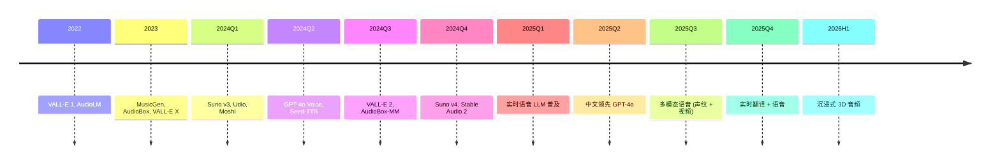

# Ch09 §06 2024-2026 语音前沿 · 讲解稿

> **章节定位**: Ch09 §05 的"前沿补丁"。覆盖 VALL-E 2 / AudioBox / Suno v4 / MusicGen / Stable Audio 2 / 实时语音对话。
> **承接**: Ch09 §05 经典 TTS (Tacotron 2 / FastSpeech 2) → 本前沿专题
> **篇幅**: ~3800 字 / 阅读 11 分钟 / 讲解 25 分钟

---

## 一 · 一句话总览

> **2024-2026 语音 AI = 4 大方向**: 语音克隆 (VALL-E 2 / AudioBox) + 音乐生成 (Suno v4 / Udio) + 实时对话 (GPT-4o / Moshi) + 多模态 (AudioBox / Stable Audio 2)。LLM 时代, 语音模型从"分立流水线"变成"统一端到端"。

---

## 二 · 心智模型

把 2024-2026 语音 AI 想成"四代演进":
- **第一代 (2017-2019)**: Tacotron 2 / WaveNet 三段流水线
- **第二代 (2020-2022)**: FastSpeech 2 / VITS / Diff-TTS 端到端
- **第三代 (2023-2024)**: VALL-E / Bark / AudioBox 多模态
- **第四代 (2024-2026)**: 实时对话 (GPT-4o voice) + 音乐生成 (Suno v4) + 长上下文

每一代都把"分段"减少, 推向"统一"。

---

## 三 · 章节主线 (5 段)

### 第 1 段 · VALL-E 2 与语音克隆 (10 分钟)

#### 3.1.1 VALL-E 2 (2024, Microsoft)

**零样本语音克隆**: 给 3 秒参考音频, 合成任意文本。

**架构**:
- **Codec** (Encodec): 音频 → 离散 token
- **LM**: 文本 + 提示 audio → 目标 audio tokens
- **Decoder**: tokens → 波形

**突破**:
- 说话人相似度 (SIM): 0.6+
- 词错误率 (WER): 0.5% (vs VALL-E 1.0)
- 数据: 60K 小时 (LibriLight)

**伦理风险**: 深度伪造 → Microsoft 限制使用。

#### 3.1.2 AudioBox (Meta 2023)

**统一音频生成**: 语音 + 音乐 + 音效一个模型。

**输入**:
- 文本提示
- 声音风格 (style)
- 参考音频

**关键技术**:
- AudioBox-VS: 语音克隆
- AudioBox-MM: 多模态
- AudioCraft 集成

#### 3.1.3 Seed-Music / Seed-TTS (字节跳动 2024)

**Seed-TTS**:
- 5 秒克隆
- 中文最自然
- 情感 / 韵律控制

**Seed-Music**:
- 歌词 + 风格 → 完整歌曲
- 60 秒
- 商用领先

#### 3.1.4 中文语音克隆

| 模型 | 公司 | 特点 |
|------|------|------|
| CosyVoice | 阿里 | 开源, SOTA |
| GPT-SoVITS | 开源 | 中文首选 |
| ChatTTS | 开源 | 情感丰富 |
| IndexTTS | 索引 | 商业可用 |
| F5-TTS | 上海交大 | 快速流式 |

---

### 第 2 段 · 实时语音对话 (8 分钟)

#### 3.2.1 GPT-4o Voice (OpenAI 2024-05)

**首原声多模态对话**:
- 平均响应 320ms (接近人类)
- 情感 + 语气 + 节奏
- 任意打断 ("讲笑话时叫停")

**架构**:
- 原生多模态 Transformer
- 音视频 + 文本统一
- 不再分 ASR + LLM + TTS

#### 3.2.2 Moshi (Kyutai 2024)

**实时语音对话** (法国 Kyutai):
- 200ms 延迟
- 流式双向语音
- 7B 参数
- 全开源

**创新**:
- Mimi codec (12 Hz)
- Inner Monologue (思考 + 说话并行)
- 模拟呼吸 / 叹气

#### 3.2.3 端到端语音模型

- **GLM-4-Voice** (智谱, 2024)
- **Step-Audio** (阶跃星辰, 2024)
- **Doubao Voice** (字节, 2024)
- **MiniMax-Voice** (MiniMax, 2024)

**共同特点**:
- 一体化 (ASR + LLM + TTS)
- 实时流式
- 中文领先

---

### 第 3 段 · 音乐生成 (10 分钟)

#### 3.3.1 Suno v4 (2024-11)

**6 秒 → 60 秒 + 完整歌曲**:
- 歌词 + 风格 → 完整音频
- v3：高质量但短
- v4：长时 + 韵律

**技术**:
- DiT-style backbone
- 扩散 + 流匹配
- 大规模音乐数据

#### 3.3.2 Udio (2024)

- 高质量音乐生成
- 商用授权
- 4 分钟完整歌曲
- 风格精确控制

#### 3.3.3 Stable Audio 2 (Stability AI, 2024)

**开源音乐生成**:
- 3 分钟音频
- 商用许可
- 47B 参数 (但 5B 蒸馏版本)
- DiT 架构

**优势**: 完全开源, 可商用

#### 3.3.4 MusicGen (Meta, 2023)

**架构**:
- Transformer LM
- 32 kHz EnCodec
- 文本 + 旋律条件

**三种模型**:
- 300M / 1.5B / 3.3B
- 商用: 商业用途 OK

#### 3.3.5 国产音乐

- **海绵音乐** (字节跳动)
- **天工 SkyMusic** (昆仑万维)
- **网易云音乐 · 号角** (网易)
- **MiniMax Music** (MiniMax)

#### 3.3.6 音乐生成技术比较

| 维度 | Suno v4 | Udio | Stable Audio 2 | MusicGen |
|------|---------|------|----------------|----------|
| 长度 | 60-240s | 60-240s | 180s | 30s |
| 开源 | ✗ | ✗ | ✓ | ✓ |
| 商用 | 订阅 | 订阅 | ✓ | ✓ |
| 质量 | ⭐⭐⭐⭐⭐ | ⭐⭐⭐⭐⭐ | ⭐⭐⭐⭐ | ⭐⭐⭐⭐ |
| 中文 | ⭐⭐⭐⭐ | ⭐⭐⭐ | ⭐⭐⭐ | ⭐⭐ |

---

### 第 4 段 · 语音理解与多模态 (8 分钟)

#### 3.4.1 Whisper v3 (OpenAI 2024)

- 100+ 种语言
- 抗噪增强
- 长音频支持
- 错误率显著降低

#### 3.4.2 USM (Google Universal Speech Model)

- 200+ 种语言
- 2B 参数
- 多任务统一

#### 3.4.3 SeamlessM4T v2 (Meta 2023)

- 100 语言 ASR + 100 语言 TTS + 语音翻译
- 统一多任务
- 开源

#### 3.4.4 国产 ASR

- **Paraformer** (阿里, FunASR)
- **WeNet** (出门问问)
- **Whisper-Cantonese** (社区)
- **SenseVoice** (阿里, 2024 多任务)

---

### 第 5 段 · 评测与产业 (8 分钟)

#### 3.5.1 评测基准

| 任务 | 基准 | SOTA (2024) |
|------|------|-------------|
| ASR | LibriSpeech | 1.4% WER |
| ASR 多语 | FLEURS | 12% |
| TTS MOS | LJSpeech | 4.5/5 |
| 语音克隆 | VCTK | SIM 0.65 |
| 音乐 | MusicCaps | CIDEr 0.21 |

#### 3.5.2 硬件加速

- **GPU**: H100 大规模 TTS 训练
- **NPU**: 苹果 Neural Engine 实时 ASR
- **端侧**: Snapdragon 8 Gen 3 LLM + TTS
- **专用**: Cerence / 大众 VW Voice

#### 3.5.3 行业落地

- **客服**: 智能 IVR, 类人对话
- **教育**: 口语陪练 (Duolingo Max)
- **医疗**: 病历转录 (Abridge)
- **车载**: 车机助手 (小鹏 / 蔚来)
- **内容**: 配音 / 旁白 / 有声书

#### 3.5.4 关键挑战

- **深层伪造**: 法律 + 检测 (Pindrop 2024)
- **数据版权**: 训练数据合规
- **多模态**: 语音 + 视频 + 文本对齐
- **低延迟**: 端到端 < 100ms

---

## 四 · 论文清单 (2024-2026)

### 语音克隆 / VALL-E 系列
- VALL-E 2 (2024)
- VALL-E X (2024)
- AudioBox (Meta, 2023)
- Seed-TTS (字节, 2024)
- CosyVoice (阿里, 2024)

### 实时语音对话
- GPT-4o Voice (OpenAI, 2024)
- Moshi (Kyutai, 2024)
- GLM-4-Voice (智谱, 2024)
- Step-Audio (阶跃, 2024)

### 音乐生成
- Suno v4 (2024)
- Udio (2024)
- Stable Audio 2 (Stability AI, 2024)
- MusicGen (Meta, 2023)
- Jukebox (OpenAI, 2020)

### 语音理解
- Whisper v3 (OpenAI, 2024)
- USM (Google, 2023)
- SeamlessM4T v2 (Meta, 2023)
- SenseVoice (阿里, 2024)

### Codec
- SoundStream (Google, 2021)
- EnCodec (Meta, 2022)
- Mimi (Kyutai, 2024, 12 Hz)

---

## 五 · 2024-2026 时间线



---

## 六 · 易错点 (5 条)

1. **VALL-E 2 ≠ 真智能**: 仅克隆风格, 不理解语义
2. **GPT-4o Voice ≠ 拼接**: 原生多模态, 无 TTS 拼接痕迹
3. **音乐生成面临版权**: Suno / Udio 已被起诉
4. **实时 ≠ 流式**: 真实时 < 200ms, 非缓存
5. **Codec 决定质量**: Mimi 12 Hz vs Encodec 75 Hz

---

## 七 · 跨章连接

| 章节 | 关联 |
|------|------|
| Ch07 §04 Transformer | 基础 |
| Ch08 §06 多模态 | DiT 时代 |
| Ch09 §05 TTS | 基础 |
| Ch10 §05 多模态 LLM | 统一表征 |
| Ch11 §05 机器人 | 语音指令 |
| Ch19 §05 医疗 | 病历转录 |

---

## 八 · 自测 5 题

1. VALL-E 2 核心创新?
2. GPT-4o Voice 与 Moshi 区别?
3. Suno v4 长度上限?
4. MusicGen 与 Stable Audio 2 区别?
5. Codec 在语音模型的作用?

---

## 九 · 一句话总结

**2024-2026 语音 AI = 实时克隆 + 音乐生成 + 端到端对话**: VALL-E 2 (克隆) + Suno v4 (音乐) + GPT-4o Voice / Moshi (实时) 共同把语音 AI 从"三段流水线"推向"统一端到端 + 实时交互"。

---

## 十 · 板书建议

```
[板书 1: VALL-E 2]
   Codec + LM + Decoder
   3 秒克隆

[板书 2: GPT-4o Voice]
   320ms 延迟
   原生多模态

[板书 3: Suno v4]
   60s 完整歌曲
   歌词 + 风格

[板书 4: Codec]
   Encodec 75 Hz
   Mimi 12 Hz

[板书 5: 国产]
   CosyVoice / GPT-SoVITS
   Seed-TTS / Seed-Music
```

---

## 十一 · 参考资料

1. Chen et al., "VALL-E 2", 2024
2. OpenAI, "GPT-4o Voice", 2024
3. Kyutai, "Moshi", 2024
4. Suno, "v4 Whitepaper", 2024
5. Stability AI, "Stable Audio 2", 2024
6. Copet et al., "MusicGen", Meta 2023
7. Meta, "AudioBox", 2023
8. Défossez et al., "Mimi Codec", 2024
9. 阿里, "CosyVoice", 2024
10. 字节, "Seed-TTS", 2024
