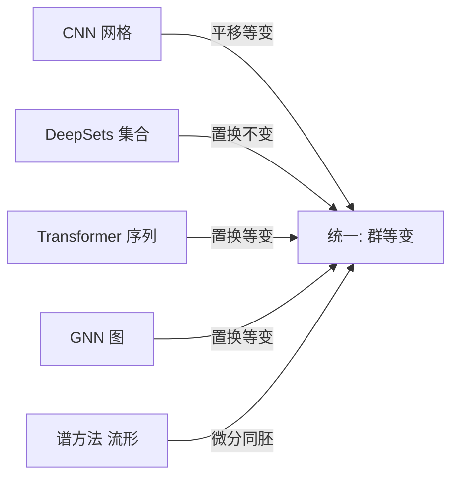

# Ch12 §01 几何深度学习 · 讲解稿

> **章节定位**: Ch12 总入口, 教"为什么 CNN / Transformer / GNN 都是同一个原理 — 群等变性"。先有"对称性"心智模型, 再谈具体架构。
> **承接**: Ch07 Transformer + Ch08 CNN + Ch11 RL → Ch12 GDL 统一视角
> **走向**: §02 图论基础 → §03 GNN 三件套 → §04 图注意力 → §05 3D 图
> **篇幅**: ~4200 字 / 阅读 12 分钟 / 讲解 25-30 分钟

---

## 一 · 一句话总览

> **几何深度学习 (Geometric Deep Learning, GDL)** = "识别数据对称性, 然后构建等变/不变网络"。CNN (平移)、Transformer (置换)、GNN (节点置换)、DeepSets (集合置换) 都是这条原理的实例。

---

## 二 · 三维心智模型

我们要从三个维度去理解 GDL:

1. **数学层 (群论)**: 对称性 = 群, 模型 = 群上的等变/不变函数
2. **结构层 (五大域)**: 网格 / 集合 / 序列 / 图 / 流形, 每域对应一种对称群
3. **工程层 (架构)**: CNN / DeepSets / Transformer / GNN / 谱方法, 都是群等变的具体实现

---

## 三 · 章节主线 (5 段)

### 第 1 段 · 对称性 = 群 (10 分钟)

**起点问题**: 为什么有些模型特别擅长处理某些数据? CNN 为什么天生适合图像?

**答案**: 因为它们"尊重"了数据的对称性。

#### 3.1.1 什么是对称性

**定义**: 一个变换如果让对象的"本质"不变, 它就是对称性。
- 正方形有 8 种对称 (4 旋转 + 4 反射)
- 圆形有无穷多 (任意角度旋转都是)
- 猫图像: 平移、缩放、轻微旋转都不会改变"是猫"

**机器学习启示**: 如果任务有对称性, 模型应该对对称变换不敏感。猫检测器对猫在左上还是右下, 都应该输出"猫"。

#### 3.1.2 群的四条公理

对称性用**群** $G$ 严格描述。群有四条公理:

| 公理 | 含义 | 例子 |
|------|------|------|
| **Closure** | 两个变换复合还是群内变换 | 旋转 90° + 旋转 90° = 旋转 180° |
| **Associativity** | $(g_1 g_2) g_3 = g_1 (g_2 g_3)$ | 矩阵乘法结合律 |
| **Identity** | 存在"啥也不做"的 $e$ | 单位旋转 0° |
| **Inverse** | 每个 $g$ 有逆 $g^{-1}$ | 旋转 +30° 配旋转 -30° |

回忆 Ch02 §04 矩阵乘法 — 这些公理和向量空间公理同源。区别是: 群作用于"变换", 向量空间作用于"向量"。

#### 3.1.3 深度学习里的关键群

| 群 | 符号 | 作用于 | 对应架构 |
|----|------|--------|----------|
| 平移群 | $\mathbb{R}^n, +$ | 图像/信号平移 | **CNN** |
| 置换群 | $S_n$ | 节点/词 token 重排 | **GNN / Transformer** |
| 旋转群 | $SO(n)$ | 2D / 3D 旋转 | **等变网络** |
| 欧氏群 | $E(n)$ | 旋转 + 反射 + 平移 | 物理建模 |
| 特殊欧氏群 | $SE(n)$ | 旋转 + 平移 (刚体) | 机器人 / 分子 |

**群作用 (group action)** $\rho: G \times X \to X$ 描述"群如何变换数据"。例如: 平移群作用于图像 = 像素坐标偏移; 置换群作用于图 = 节点重编号。

---

### 第 2 段 · 不变性 vs 等变性 (8 分钟)

**核心**: 这两个概念是 GDL 的语言, 必须分清。

#### 3.2.1 不变性 (Invariance)

$$f(\rho(g, x)) = f(x), \quad \forall g \in G$$

**含义**: 输入怎么变, 输出都不变。

**例子**:
- 图像分类: 猫在左上/右下都是"猫" → 分类输出不变
- 图像亮度: 整体亮度调整, 平均亮度不变
- 图性质: 节点编号重排, 图的连通性不变

#### 3.2.2 等变性 (Equivariance)

$$f(\rho_{\text{in}}(g, x)) = \rho_{\text{out}}(g, f(x)), \quad \forall g \in G$$

**含义**: 输入怎么变, 输出"对应地变"。

**例子**:
- CNN 卷积: 图像右移 5 像素 → 特征图也右移 5 像素
- 目标检测: 猫移动 → 边界框跟着移动
- GNN 节点分类: 节点排列 → 输出跟着排列

#### 3.2.3 何时用哪个

| 位置 | 选择 | 理由 |
|------|------|------|
| **中间层** | 等变 | 保留结构给下游用 |
| **最终输出** | 不变 | 答案不应依赖变换 |

CNN 典型套路: 卷积层 (等变) 堆叠 → 全局池化 (不变) → 分类。

#### 3.2.4 等变性的工程价值

**定理 (GDL 第一性原理)**: 把对称性"烧进"架构, 比从数据"学出来"指数级高效。

例如: 平移等变 CNN 用权重共享, 比全连接网络"猫在 (10,10) 与 (200,150) 都要学" 节省指数级参数。

---

### 第 3 段 · 五大几何域 (12 分钟)

GDL 识别出五大基础数据域, 每个有专属对称群。

#### 3.3.1 网格 (Grids) — CNN

- **数据**: 图像、音频频谱、体数据
- **对称**: 平移 (可选: 旋转 + 反射)
- **架构**: CNN
- **关键**: 卷积 = 平移等变算子, 权重共享是平移等变的具体实现

```python
# CNN 卷积: 平移等变
import torch.nn as nn
conv = nn.Conv2d(3, 64, kernel_size=3, padding=1)
# 图像平移 → 输出对应平移
```

#### 3.3.2 集合 (Sets) — DeepSets / PointNet

- **数据**: 点云、粒子系统
- **对称**: 置换不变
- **架构**: DeepSets / PointNet (Ch08)
- **公式**: $f(\{x_1, \dots, x_n\}) = \phi\left(\sum_i \psi(x_i)\right)$

```python
# DeepSets: 共享函数 + 置换不变聚合
import torch
def deepsets(x):
    # x: [n, d]
    h = torch.relu(torch.nn.Linear(d, 64)(x))  # psi
    g = h.sum(dim=0)  # sum = 置换不变
    return torch.nn.Linear(64, 10)(g)  # phi
```

#### 3.3.3 序列 (Sequences) — Transformer / RNN

- **数据**: 文本、时间序列
- **对称**: 复杂 — 绝对位置可重要 / 可不重要
- **架构**: RNN (自回归) / Transformer (全连接注意力)
- **关键**: 自注意力置换等变 (在加入位置编码前)

#### 3.3.4 图 (Graphs) — GNN (本章重点)

- **数据**: 社交网络、分子、知识图谱
- **对称**: 节点置换
- **架构**: GNN — 消息传递
- **关键**: 邻居聚合, 共享函数, 与节点顺序无关

#### 3.3.5 流形 (Manifolds) — 谱方法 / 几何深度

- **数据**: 表面、3D 形状
- **对称**: 微分同胚 (smooth deformation)
- **架构**: Laplace-Beltrami 算子、内蕴表示
- **应用**: 形状分析、球面气候建模、蛋白表面

#### 3.3.6 统一视角



**金句**: CNN = 网格图上的 GNN, Transformer = 完全图上的 GNN, DeepSets = 无边图 GNN。

---

### 第 4 段 · 尺度分离与粗化 (8 分钟)

#### 3.4.1 多尺度结构

真实数据有多尺度:
- 图像: 像素 → 边缘 → 部件 → 整体场景
- 分子: 原子 → 官能团 → 整体形状
- 文本: 字 → 词 → 句 → 段 → 文档

#### 3.4.2 尺度分离原则

**核心**: 分层处理, 从细到粗, 每一层学一个抽象级别。

$$x \xrightarrow{\text{local features}} h^{(1)} \xrightarrow{\text{coarsen}} h^{(2)} \xrightarrow{\text{coarsen}} \cdots \xrightarrow{\text{global}} y$$

每一层 $h^{(l)}$ 对当前尺度的对称群等变, 最终全局表征 $y$ 不变。

#### 3.4.3 各架构实例

| 架构 | 粗化方式 |
|------|----------|
| CNN | Max/Avg Pooling |
| GNN | DiffPool / TopK Pool |
| Transformer | 池化注意力 / Swin Window |
| PointNet++ | KNN + 分层 max |

#### 3.4.4 深度网络的胜利

**定理 (深度 ≈ 抽象级别数)**: 更深的网络 = 更多层抽象 = 更好性能。每一层学一个尺度, 多层叠加构成复杂不变特征。

---

### 第 5 段 · 实践: 验证对称性 (8 分钟)

三个 Python 实验验证三条原理。

#### 3.5.1 实验 1: 卷积平移等变

```python
import jax.numpy as jnp

# 1D 信号
signal = jnp.array([0, 0, 0, 1, 2, 3, 2, 1, 0, 0, 0], dtype=float)
kernel = jnp.array([1, 0, -1], dtype=float)

# Convolve then shift
conv_result = jnp.convolve(signal, kernel, mode="same")
shifted_signal = jnp.roll(signal, 3)
conv_shifted = jnp.convolve(shifted_signal, kernel, mode="same")
shifted_conv = jnp.roll(conv_result, 3)

# Equivariant: shift(conv(x)) == conv(shift(x))
assert jnp.allclose(shifted_conv, conv_shifted, atol=1e-5)
print("CNN is translation-equivariant ✓")
```

#### 3.5.2 实验 2: DeepSets 置换不变

```python
import jax
import jax.numpy as jnp

x = jnp.array([[1.0, 2.0], [3.0, 4.0], [5.0, 6.0], [7.0, 8.0]])
psi = lambda v: v ** 2

def deepsets(points):
    return jnp.sum(jax.vmap(psi)(points), axis=0)

result1 = deepsets(x)
perm = jnp.array([2, 0, 3, 1])
result2 = deepsets(x[perm])

assert jnp.allclose(result1, result2)
print("DeepSets is permutation-invariant ✓")
```

#### 3.5.3 实验 3: 旋转矩阵的群公理

```python
import jax.numpy as jnp

def rot2d(theta):
    return jnp.array([[jnp.cos(theta), -jnp.sin(theta)],
                       [jnp.sin(theta),  jnp.cos(theta)]])

R1 = rot2d(jnp.pi / 6)
R2 = rot2d(jnp.pi / 4)
R3 = rot2d(jnp.pi / 3)

# Closure: 旋转的积还是旋转
R12 = R1 @ R2
assert jnp.allclose(R12.T @ R12, jnp.eye(2), atol=1e-5)
assert jnp.isclose(jnp.linalg.det(R12), 1.0)

# Identity
assert jnp.allclose(rot2d(0), jnp.eye(2))

# Inverse
assert jnp.allclose(R1 @ R1.T, jnp.eye(2))
print("SO(2) satisfies all group axioms ✓")
```

---

## 四 · 易错点 (5 条)

1. **混淆不变与等变**: 不变 = 输出不变; 等变 = 输出跟着变。目标检测要等变, 分类要不変。
2. **群 ≠ 群作用**: 群是变换的集合, 群作用是"变换如何作用于数据"。
3. **SE(3) ≠ E(3)**: SE(3) 含旋转+平移, E(3) 还含反射。物理常用 SE(3), 化学分子考虑 E(3)。
4. **CNN 是 GDL 的特例**: 平移是它的对称群, 但 CNN 也可以加旋转等变 (e.g., group equivariant CNN)。
5. **五大域可重叠**: 图可以是流形上的图 (流形上的节点); 序列是 1D 网格。所有域互相渗透。

---

## 五 · 跨章连接

| 章节 | 关联 |
|------|------|
| Ch02 §04 矩阵论 | 群 = 满足四条公理的变换集合, 矩阵乘法是常见实现 |
| Ch06 §03 CNN | 平移等变, 网格数据 |
| Ch07 §04 Transformer | 置换等变 (无位置编码时) |
| Ch08 §04 Diffusion | 扩散方程满足旋转/平移等变 |
| Ch11 §05 VLA | 状态空间是图 (机器人/物体), GNN 可编码 |
| Ch14 §04 图算法 | 邻接/拉普拉斯/Dijkstra 的数学基础 |

---

## 六 · 自测 5 题

1. 群的四条公理是什么?
2. 不变与等变的区别? 举两个例子。
3. SO(3) 与 SE(3) 的差别?
4. CNN 是平移等变, 还是平移不变? 目标检测呢?
5. 五大几何域分别是什么? 各自的对称群?

---

## 七 · 一句话总结

**几何深度学习** = "识别数据对称性 → 构建群等变/不变网络"。它把 CNN / Transformer / GNN 统一在同一个框架下, 并指导新架构设计。Ch12 接下来 §02-§05 都建立在 GDL 的"群等变"地基上。

---

## 八 · 板书建议

```
[板书 1: 群公理]
   G, closure, associativity, identity, inverse

[板书 2: 不变 vs 等变]
   f(g·x) = f(x)         ← 不变
   f(g·x) = g·f(x)       ← 等变

[板书 3: 五大域]
   网格 (平移) → CNN
   集合 (置换) → DeepSets
   序列 (置换) → Transformer
   图 (置换)   → GNN
   流形 (微分) → 谱方法

[板书 4: 尺度分离]
   x → h⁽¹⁾ → h⁽²⁾ → ... → y
   细 → 粗 → 全局
```

---

## 九 · 参考资料

1. Bronstein, Bruna, Cohen, Velickovic, "Geometric Deep Learning: Grids, Groups, Graphs, Geodesics, and Gauges", 2021
2. Michael Bronstein YouTube 系列: GDL 教程
3. Ch07 Transformer (本套书)
4. Ch08 CNN (本套书)
5. PyTorch Geometric 文档 (GNN 实现)