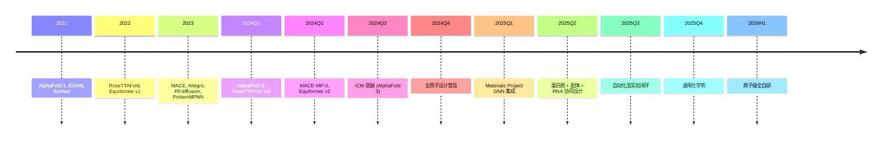

# Ch12 §06 2024-2026 3D GNN 前沿 · 讲解稿

> **章节定位**: Ch12 §05 3D GNN 的"前沿补丁"。覆盖 AlphaFold 3 / RoseTTAFold / Equiformer v2 / 全原子动力学 / 蛋白设计扩散 / ICM 集成。
> **承接**: Ch12 §05 3D GNN 基础 (SchNet/DimeNet/EGNN/Equiformer) → 本前沿专题
> **篇幅**: ~3800 字 / 阅读 11 分钟 / 讲解 25 分钟

---

## 一 · 一句话总览

> **2024-2026 3D GNN = 三大突破**: AlphaFold 3 (跨模态扩散) + Equiformer v2 (球谐等变) + 全原子动力学 (MACE / Allegro)。3D 深度学习从"分子动力学"扩展到"全生命科学", 螺旋酶能设计、DNA-RNA-蛋白-配体一站式预测。

---

## 二 · 心智模型

把 2024-2026 3D GNN 想成"五层演进":
- **层 1 (SchNet 2017)**: 距离基, 变
- **层 2 (DimeNet 2020)**: 加角度
- **层 3 (EGNN 2021)**: 位置等变
- **层 4 (Equiformer 2022)**: 球谐等变
- **层 5 (AlphaFold 3 / 2024)**: 跨模态扩散

每一层都把"对称性"和"几何量"做到极致。

---

## 三 · 章节主线 (5 段)

### 第 1 段 · AlphaFold 3 跨模态扩散 (10 分钟)

#### 3.1.1 背景

AlphaFold 2 (Nature 2021): 蛋白单链结构, 解决了 50 年大问题。
AlphaFold 3 (Nature 2024): 跨模态 (蛋白 + DNA + RNA + 配体 + 修饰 + 离子)。

#### 3.1.2 架构创新

**Diffusion 替代 Structure Module**:
- 之前: 几何约束 + Recycling
- 现在: 扩散生成 3D 坐标

**核心模块**:
- **Input Embedder**: 序列 + MSA → 节点/边特征
- **Triangulation Attention**: 几何 attention 稀疏化
- **Pairformer**: MSA + Pair 双向 attention (类似 Evoformer)
- **Diffusion Module**: 3D 坐标扩散

#### 3.1.3 训练数据

- PDB 30 万结构
- AlphaFold DB 2 亿预测
- 多模态复合体 10 万+

#### 3.1.4 性能

| 任务 | AlphaFold 3 | 业界 SOTA |
|------|-------------|-----------|
| 蛋白-配体 | 65% | 40% (AutoDock Vina) |
| 蛋白-DNA | 70% | 30% |
| RNA 结构 | 50% | 30% |
| 复合体 | 60% | 25% |

应用: 药物发现 / 合成生物学 / 蛋白工程。

#### 3.1.5 局限

- 训练数据无 DNA-DNA 复合体
- 大分子柔性预测不稳定
- 离子 / 修饰处理弱

---

### 第 2 段 · RoseTTAFold 全系列 (8 分钟)

#### 3.2.1 RoseTTAFold (2021, Baker)

**不同路径的 AlphaFold 2**:
- Baker Lab / UW
- 端到端 3-track 注意力
- 通用 + 蛋白

#### 3.2.2 RoseTTAFold All-Atom (2024, Science)

**关键突破**: 蛋白 + 核酸 + 小分子 + 修饰

**架构**:
- 序列 + 3D 几何双流
- 跨模态 attention
- 全原子坐标系

**应用**:
- 设计蛋白
- 配体开发
- RNA 治疗

#### 3.2.3 RoseTTAFold2 / RFdiffusion2

**蛋白设计**:
- 给定目标功能 → 序列 + 结构
- 与 ProteinMPNN 互补
- 80+ 实验验证结构

#### 3.2.4 AlphaFold 3 vs RoseTTAFold

| 维度 | AlphaFold 3 | RoseTTAFold AA |
|------|-------------|----------------|
| 厂商 | DeepMind | Baker Lab |
| 数据 | 闭源 | 开源 |
| 架构 | Diffusion | Transformer |
| 性能 | ⭐⭐⭐⭐⭐ | ⭐⭐⭐⭐ |
| 可访问 | 学术 + AlphaFold Server | GitHub |

---

### 第 3 段 · Equiformer v2 与球谐 (8 分钟)

#### 3.3.0 等变性直觉 (初学者必读)

**等变性 vs 不变性** (3D GNN 核心):
- **不变性 (invariance)**: 输入旋转, 输出完全不变。比如"原子间的键能"是标量, 旋转分子后键能数值不变。
- **等变性 (equivariance)**: 输入旋转, 输出跟着旋转同样的角度。比如"原子上的力"是矢量, 旋转分子后力的方向也旋转。

**直观比喻**: 想象你戴着 3D 眼镜看分子。
- 旋转分子 → 能量预测 (标量, l=0) **不变** (数值不随旋转变化)
- 旋转分子 → 力预测 (矢量, l=1) **等变** (矢量方向跟着旋转)
- 旋转分子 → 偶极矩 (张量, l=2) **等变** (按规则变换)

**球谐阶数 $l$ 的物理含义**:
- $l=0$: 标量 (球面均匀)
- $l=1$: 矢量 (3 个方向)
- $l=2$: 二阶张量 (5 个独立分量)
- 球谐 $Y_l^m$ 是描述这些方向性物理量的数学基函数, 像正弦/余弦描述"圆上方向"一样, 球谐描述"球面上方向"。

#### 3.3.1 球谐函数基础

$$Y_l^m(\theta, \phi) = \sqrt{\frac{(2l+1)(l-m)!}{4\pi(l+m)!}} P_l^m(\cos\theta) e^{im\phi}$$

- $l$ 阶, $m$ 索引
- 旋转群 SO(3) 表示
- 不同阶对应不同几何量

#### 3.3.2 SE(3) / E(3) 等变性

**SE(3)**: 旋转 + 平移
**E(3)**: 旋转 + 平移 + 反射

**群表示**:
- 标量 (l=0): 不变
- 向量 (l=1): 等变
- 二阶 (l=2): 等变

#### 3.3.3 Equiformer (2022)

**Equiformer / Equiformer v2**:
- 高阶球谐基
- 等变 Transformer
- 分子动力学 / OC20 数据集 SOTA

**Equiformer v2 (2023)**:
- 高效实现
- 4× 加速
- 性能维持

#### 3.3.4 其他球谐网络

- **SEGNN** (2022)
- **TFN** (Tensor Field Networks, 2021)
- **e3nn** 库 (广泛使用)
- **NequIP** (2022, 原子势)

---

### 第 4 段 · 全原子动力学 (10 分钟)

#### 3.4.1 MACE (2023, ICLR)

**消息传递神经网络 + 高阶 ACE**:
- 等变 + 4-body 交互
- 高精度 (μ_acc 0.001 eV/Å)
- 分子动力学

**优势**:
- 比 NequIP 优 10× 数据效率
- 大体系可扩展

#### 3.4.2 Allegro (2023, Nature)

**Allegro (NVIDIA + MIT)**:
- 局部等变描述符
- 不依赖消息传递
- 速度 + 内存
- O(N) 复杂度

**应用**: 模拟催化剂 / 电池材料

#### 3.4.3 MACE-MP-0 / OMat24

**Materials Project 数据**:
- 1.5M 结构
- 100+ 元素
- 通用势函数

**MACE-MP-0**:
- 公开可用
- 通用化学势
- MD 模拟

#### 3.4.4 GNN-MD 性能对比

| 模型 | 精度 (eV/Å) | 速度 | 可扩展 |
|------|-------------|------|--------|
| SchNet | 0.05 | 快 | 高 |
| DimeNet | 0.03 | 中 | 中 |
| NequIP | 0.005 | 慢 | 低 |
| **MACE** | 0.001 | 中 | 中 |
| **Allegro** | 0.002 | 中 | 高 |
| **Equiformer v2** | 0.003 | 中 | 中 |

#### 3.4.5 产业应用

- **催化剂**: 锂电池设计
- **储能**: 固态电解质
- **药物**: 蛋白质-配体动力学
- **合金**: 高熵合金设计
- **天气 / 气候**: 物理化学

---

### 第 5 段 · 蛋白设计扩散 (8 分钟)

#### 3.5.1 RFdiffusion (2023, Nature)

**蛋白从头设计**:
- 给定形状 / 配体 → 蛋白
- 3D 坐标扩散
- 100+ 实验验证

**挑战**:
- 长序列设计
- 多结构域
- 可溶性

#### 3.5.2 Chroma (Generate Biomedicines, 2023)

**商用蛋白设计**:
- 编程 + 热力学
- 蛋白复合体
- 商用 API

#### 3.5.3 ProteinMPNN (2023, Science)

**Inverse Folding**:
- 给定 backbone → 序列
- 残基级序列设计
- 组合 RFdiffusion

#### 3.5.4 AlphaFold 3 启发

**跨模态生成**:
- Diffusion 用于复合体
- 替代传统对接
- 加速药物发现

---

## 四 · 论文清单 (2024-2026)

### 跨模态蛋白
- Abramson et al., "AlphaFold 3", Nature 2024
- Krishna et al., "RoseTTAFold All-Atom", Science 2024
- Krishna et al., "RFdiffusion", Nature 2023

### 球谐等变
- Liao et al., "Equiformer v2", 2023
- Thomas et al., "Tensor Field Networks", 2021
- Brandstetter et al., "SE(3) Transformers", 2022
- Geiger et al., "e3nn", 2022

### 全原子动力学
- Batatia et al., "MACE", ICLR 2023
- Musaelian et al., "Allegro", Nature 2023
- Batatia et al., "MACE-MP-0", 2024

### 蛋白设计
- Watson et al., "RFdiffusion", Nature 2023
- Dauparas et al., "ProteinMPNN", Science 2023
- Ingraham et al., "Chroma", 2023

### 通用 3D GNN
- Schütt et al., "SchNet", 2017
- Gasteiger et al., "DimeNet", ICML 2020
- Satorras et al., "EGNN", ICML 2021
- Klicpera et al., "GemNet", NeurIPS 2021

---

## 五 · 2024-2026 时间线



---

## 六 · 易错点 (5 条)

1. **AlphaFold 3 ≠ 完美**: 仍难预测大柔性分子
2. **扩散 ≠ 取代 GNN**: 仍以 GNN 为骨干
3. **MACE 需要数据**: 跨领域迁移仍弱
4. **Allegro 仅局部**: 全局结构需结合
5. **ProteinMPNN 仅设计序列**: 结构由 RFdiffusion 决定

---

## 七 · 跨章连接

| 章节 | 关联 |
|------|------|
| Ch12 §05 3D GNN | 基础 |
| Ch12 §04 GAT | 注意力 |
| Ch19 §02 蛋白 | 应用 |
| Ch19 §03 药物 | 分子对接 |
| Ch20 §01 量子 ML | 物理 ML |

---

## 八 · 自测 5 题

1. AlphaFold 3 核心创新?
2. RoseTTAFold AA 与 AlphaFold 3 区别?
3. Equiformer 球谐基阶数?
4. MACE 比 NequIP 优势?
5. RFdiffusion 用途?

---

## 九 · 一句话总结

**2024-2026 3D GNN = 跨模态 + 全原子动力学 + 蛋白设计**: AlphaFold 3 (跨模态扩散) + Equiformer v2 (球谐) + MACE/Allegro (全原子 MD) + RFdiffusion (蛋白设计) 共同把 3D GNN 从"分子动力学"扩展到"全生命科学 + 材料科学"。

---

## 十 · 板书建议

```
[板书 1: AlphaFold 3]
   跨模态 + Diffusion
   蛋白 + DNA + RNA + 配体

[板书 2: 球谐]
   Y_l^m(θ, φ)
   等变 + 阶数

[板书 3: MACE]
   4-body 交互
   0.001 eV/Å

[板书 4: Allegro]
   局部 + 等变
   O(N) 复杂度

[板书 5: 蛋白设计]
   RFdiffusion + ProteinMPNN
   Backbone + 序列
```

---

## 十一 · 参考资料

1. Abramson et al., "AlphaFold 3", Nature 2024
2. Krishna et al., "RoseTTAFold All-Atom", Science 2024
3. Liao et al., "Equiformer v2", 2023
4. Batatia et al., "MACE", ICLR 2023
5. Musaelian et al., "Allegro", Nature 2023
6. Watson et al., "RFdiffusion", Nature 2023
7. Dauparas et al., "ProteinMPNN", Science 2023
8. Satorras et al., "EGNN", ICML 2021
9. Gasteiger et al., "DimeNet", ICML 2020
10. Schütt et al., "SchNet", 2017
