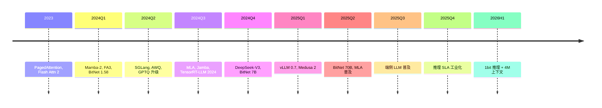

# Ch17 AI 推理 · 讲解稿

> **章节定位**: Ch17 工程层。教"如何把训练好的模型部署到生产": 量化 + 高效架构 + 推理服务 + 边缘 + 大规模。
> **承接**: Ch16 SIMD/GPU 编程 → Ch17 推理工程
> **走向**: Ch18 ML 系统设计 / Ch19 应用 AI / Ch20 前沿
> **篇幅**: ~4500 字 / 阅读 13 分钟 / 讲解 30-35 分钟

---

## 一 · 一句话总览

> **AI 推理 = 模型在生产环境运行**: 量化 (INT8/INT4 压缩) + 高效架构 (Flash Attn / GQA / PagedAttn) + 推理服务 (vLLM / TGI / batching) + 边缘 (Llama.cpp) + 大规模部署 (K8s / autoscaling)。核心权衡: **延迟 vs 吞吐 vs 成本**。

---

## 二 · 心智模型

把 AI 推理想成"快递配送":
- **模型**: 货物
- **GPU 内存**: 仓库
- **推理引擎**: 配送中心
- **batching**: 货车装满
- **监控**: 物流追踪

---

## 三 · 章节主线 (5 段)

### 第 1 段 · 量化 (Quantization) (10 分钟)

#### 3.1.1 量化基础

把 FP32 (4 字节) → FP16 (2 字节) → INT8 (1 字节) → INT4 (0.5 字节), 节省内存 + 加速。

| 精度 | 字节 | 节省 | 速度 |
|------|------|------|------|
| FP16 | 2 | 1× | 1× |
| BF16 | 2 | 1× | 1× |
| INT8 | 1 | 2× | 1.5× |
| INT4 | 0.5 | 4× | 2× |

#### 3.1.2 PTQ vs QAT

**PTQ** (Post-Training Quantization):
- 训练后量化, 简单
- Calibrate 数据集 (~1K 样本)
- 精度损失 < 1%

**QAT** (Quantization-Aware Training):
- 训练时模拟量化
- 精度高 (损失 < 0.1%)
- 慢, 需要重训

#### 3.1.3 主流方法

- **GPTQ** (Frantar et al., ICLR 2023): 逐层量化, 工业主流
- **AWQ** (Lin et al., MLSys 2024): 保护 1% top 显著权重
- **SmoothQuant**: 数学等价变换
- **bitsandbytes**: 4 行代码可用

```python
from transformers import AutoModelForCausalLM
import bitsandbytes as bnb

model = AutoModelForCausalLM.from_pretrained(
    "Llama-2-7b-hf",
    load_in_4bit=True,
    quantization_config=bnb.BitsAndBytesConfig(
        load_in_4bit=True,
        bnb_4bit_quant_type="nf4",
        bnb_4bit_compute_dtype=torch.bfloat16
    )
)
```

#### 3.1.4 量化误差

LLM 量化误差来源:
- **outlier**: activation 中有极端值 (某些 layer)
- **敏感层**: attention 投影最敏感
- **累积**: 多层量化误差累积

解决: per-channel / per-group, AWQ 保护, QAT。

---

### 第 2 段 · 高效架构 (10 分钟)

#### 3.2.1 KV cache 问题

$$S_{\text{KV}} = 2 \cdot L \cdot d_{\text{model}} \cdot N_{\text{tokens}} \times 2 \text{ bytes}$$

Llama 70B, 128K tokens → 50 GB KV cache, 占 GPU 一半多。

**KV cache 为何是推理瓶颈 (初学者必读)**:

> **直观理解**: Llama 70B 有 80 层, 每层 128 个 attention head, 每个 head 维度 128。生成 128K token 时, KV cache 是 $80 \times 128 \times 128 \times 128\text{K} \times 2\text{bytes} \approx 50\text{GB}$。
>
> **瓶颈路径**: H100 HBM 带宽 3 TB/s, 加载 50 GB 就要 **17 ms**, 还没算计算。但实际推理 (单 token) 时间 < 50 ms, 等于 1/3 时间在"搬数据"。
>
> **计算强度分析 (Roofline)**: 一次 token 生成的单 token 注意力 FLOPs 仅 $2 \times L \times d = 80 \times 8192 \times 128 \approx 0.02$ GFLOPs, 但要读 50 GB KV。
> - **计算强度** $I = 0.02 / 50 \approx 0.0004$ FLOPs/byte
> - H100 ridge point 约 60 FLOPs/byte
> - **远低于 ridge point → 内存带宽受限 (memory-bound)**
>
> **结论**: KV cache 大小直接决定推理延迟。**优化方向**: 量化 (FP8 K/V) / 压缩 (GQA) / 共享 (MQA) / 淘汰 (StreamingLLM)。

#### 3.2.2 Flash Attention

分块 attention, 不存中间结果。

$$\text{IO}: O(n^2 d) \to O(n^2 d / B)$$

减少 HBM IO, 加速 2-4×。

#### 3.2.3 GQA / MQA

- **MQA** (Multi-Query Attention): 全部 KV 共享 1 个 head
- **GQA** (Grouped-Query Attention): 8 个 KV head 分组

Llama 2 70B: 64 KV head → Llama 3 70B: 8 KV head (GQA 8)。

减少 8× KV cache, 几乎无精度损失。

#### 3.2.4 PagedAttention

类似 OS 虚拟内存, 把 KV cache 分页, 减少碎片。

**vLLM** (Kwon et al., SOSP 2023): 提升 24× 吞吐。

#### 3.2.5 长上下文技术

| 技术 | 思路 |
|------|------|
| **RoPE 扩展** | 旋转位置编码插值 |
| **ALiBi** | 线性位置偏置 |
| **YaRN** | 频率缩放 |
| **Sliding Window** | Mistral 注意力 |

支持 32K / 128K / 1M tokens。

---

### 第 3 段 · 推理服务 (10 分钟)

#### 3.3.1 vLLM 架构

```python
from vllm import LLM, SamplingParams

llm = LLM(model="Llama-3-8B-Instruct")
params = SamplingParams(temperature=0.7, max_tokens=256)
outputs = llm.generate(["Hello"], params)
```

PagedAttention + Continuous batching + OpenAI 兼容 API。

#### 3.3.2 Continuous Batching

传统 batching: 等所有请求完成, GPU 空闲。

Continuous: 一个完成立即调度下一个, GPU 满载。

#### 3.3.3 Speculative Decoding

小模型猜 N token, 大模型一次验证。

- 接受率高时大幅加速
- Llama 3 8B + Llama 3 70B: ~2×

#### 3.3.4 推理引擎对比

| 引擎 | 吞吐 | 易用 |
|------|------|------|
| **vLLM** | 极高 | 高 |
| **TGI** | 高 | 高 |
| **TensorRT-LLM** | 极高 | 低 |
| **SGLang** | 高 | 中 |

#### 3.3.5 关键指标 (SLO)

| 指标 | 含义 | 目标 |
|------|------|------|
| **TTFT** | 第一个 token 时间 | < 500 ms |
| **TPOT** | 每 token 时间 | < 50 ms |
| **Throughput** | tok/s | 越高越好 |

---

### 第 4 段 · 边缘推理 (8 分钟)

#### 3.4.1 边缘限制

- 内存 8-16 GB
- 功耗 < 10W
- 无 GPU, 用 NPU/DSP

#### 3.4.2 Llama.cpp

```bash
# 量化
./llama-quantize llama-3-8b.gguf llama-3-8b-q4.gguf Q4_K_M

# 推理
./llama-cli -m llama-3-8b-q4.gguf -p "Hello"
```

CPU + SIMD + 量化, 跑在手机 / 树莓派。

#### 3.4.3 ONNX Runtime

跨平台推理引擎:

```python
import onnxruntime as ort
session = ort.InferenceSession("model.onnx")
```

支持 CPU / GPU / NPU。

#### 3.4.4 端云协同

- 简单 query: 本地小模型 (Llama 3.2 1B)
- 复杂 query: 云端大模型
- 路由: query 复杂度分类器

---

### 第 5 段 · 大规模部署 (10 分钟)

#### 3.5.1 架构

```
                    ┌─→ vLLM Pod (GPU)
用户 → API Gateway ─┼─→ vLLM Pod (GPU)
                    └─→ vLLM Pod (GPU)
                          ↓
                       Redis (KV cache)
```

#### 3.5.2 Docker

```dockerfile
FROM vllm/vllm-openai:latest
COPY models/ /models
CMD ["--model", "/models/Llama-3-8B"]
```

#### 3.5.3 K8s + HPA

```yaml
apiVersion: autoscaling/v2
kind: HorizontalPodAutoscaler
spec:
  minReplicas: 2
  maxReplicas: 10
  metrics:
  - type: Pods
    pods:
      metric:
        name: vllm:gpu_cache_usage
      target:
        type: AverageValue
        averageValue: "0.7"
```

#### 3.5.4 监控

```python
from prometheus_client import Histogram

LLM_LATENCY = Histogram("llm_request_latency_seconds", "Latency")
LLM_TOKENS = Counter("llm_tokens_total", "Total tokens")
```

Grafana 看板。

#### 3.5.5 发布策略

| 策略 | 风险 | 回滚 |
|------|------|------|
| 蓝绿 | 高 | 立即切回 |
| 金丝雀 | 低 | 渐进 |
| A/B | 低 | 监控指标 |

---

## 四 · 易错点 (5 条)

1. **量化精度**: 必评估, INT4 可能 1-5% 损失。
2. **KV cache OOM**: 长上下文主因, 用 PagedAttention / GQA。
3. **vLLM 与 TGI**: 选型看吞吐 vs 集成。
4. **Speculative 不 work**: draft 模型太弱。
5. **HPA 误扩**: minReplicas 设合理下限。

---

## 五 · 跨章连接

| 章节 | 关联 |
|------|------|
| Ch07 §04 Transformer | 基础架构 |
| Ch16 §04/05 CUDA/Triton | 算子加速 |
| Ch15 §05 K8s | 部署基础设施 |
| Ch18 §04 ML 设计 | 生产 ML |

---

## 六 · 自测 5 题

1. PTQ vs QAT 区别?
2. KV cache 大小公式?
3. PagedAttention 原理?
4. Continuous batching 提升多少?
5. Speculative decoding 原理?

---

## 七 · 一句话总结

**AI 推理** = 模型从训练到生产。量化 (INT4) + 高效架构 (Flash / GQA / PagedAttn) + 推理服务 (vLLM / TGI) + 边缘 (Llama.cpp) + 大规模部署 (K8s)。核心权衡: 延迟 vs 吞吐 vs 成本。

---

## 八 · 板书建议

```
[板书 1: 量化]
   FP16 / INT8 / INT4
   PTQ / QAT

[板书 2: 高效架构]
   Flash Attn: 分块, 减少 IO
   GQA: 8× KV 减少
   PagedAttn: OS 虚拟内存

[板书 3: 服务]
   vLLM: PagedAttn + Continuous
   Speculative: 小猜大验

[板书 4: 边缘]
   Llama.cpp + 量化
   ONNX Runtime

[板书 5: 部署]
   Docker + K8s + HPA
   Prometheus 监控
```

---

## 九 · 2024-2026 AI 推理前沿 (前沿补丁)

### 9.1 BitNet b1.58 (Ma 2024)

**1.58 bit 量化**: 三值 {-1, 0, 1} 量化 LLM, 性能接近 FP16。

| 指标 | FP16 | BitNet b1.58 |
|------|------|-------------|
| 内存 | 2 bytes | 0.2 bytes |
| 训练能耗 | 1× | 0.3× |
| 推理速度 | 1× | 2-5× |
| 性能 (PPL) | 基准 | 接近 |

**应用**: BitNet 7B (2024), BitNet 70B (2025), 端侧 LLM 普及。

### 9.2 Flash Attention 3 (Shah 2024)

H100 优化:
- **FP8 加速**: 1.2 PFLOPs
- **WGMMA 异步**: 利用 H100 异步 tensor core
- **Ping-pong 调度**: producer-consumer
- 75% 接近理论 roofline

### 9.3 Mamba-2 / SSD (Dao & Gu 2024)

**结构化状态空间对偶**: SSM = 受限的线性注意力

- 块分解算法比 Mamba-1 快 **8×**
- 混合架构: Jamba (Mamba+Transformer)
- 长上下文 O(n)

### 9.4 DeepSeek-V3 性价比 (2025)

- 671B 总参 / 37B 激活
- **$5.5M 训练成本** (vs Llama 3 405B $100M+)
- MLA + FP8 + MoE 极致优化

### 9.5 vLLM 0.7 (2024-2025)

- 多模态原生
- Chunked Prefill
- Prefix Cache 增强
- 100K+ 上下文

### 9.6 SGLang (2024)

**RadixAttention**: 自动 prefix cache
- 多轮对话高效
- LLM 程序框架
- Tree-based prompt 复用

### 9.7 推理服务矩阵

| 引擎 | 2024-2025 特色 |
|------|----------------|
| vLLM 0.7 | Prefix Cache + 多模态 |
| SGLang | RadixAttention |
| TensorRT-LLM | NVIDIA 极致 |
| TGI 2.0 | HF 集成, 多模型 |
| MLX (Apple) | Apple Silicon |
| LMDeploy | 国内主流 |

### 9.8 Speculative Decoding 进化

| 方法 | 2024 加速 |
|------|-----------|
| EAGLE-2 | 3-4× |
| Medusa | 2-3× |
| Lookahead | 2× |
| Self-Spec | 1.5-2× |

### 9.9 2024-2026 时间线



---

## 十 · 参考资料

1. Kwon et al., "PagedAttention", SOSP 2023
2. Tri Dao, "Flash Attention", NeurIPS 2022
3. Shah et al., "Flash Attention 3", 2024
4. Frantar et al., "GPTQ", ICLR 2023
5. Lin et al., "AWQ", MLSys 2024
6. Leviathan et al., "Speculative Decoding", NeurIPS 2023
7. vLLM 文档, 2025
8. Zheng et al., "SGLang", 2024
9. Dao & Gu, "Mamba-2", 2024
10. Ma et al., "BitNet b1.58", 2024
11. DeepSeek-AI, "DeepSeek-V3", 2025
12. AI21, "Jamba", 2024
13. Ch16 §04/05 (本套书)
14. Ch15 §05 (本套书)