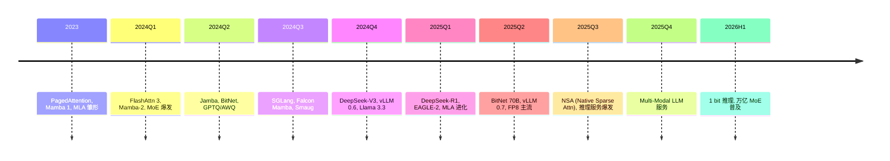

# Ch17 §02 2024-2026 高效架构前沿 · 讲解稿

> **章节定位**: Ch17 §02 的"2024-2026 前沿补丁"。覆盖 Flash Attention 3, Mamba-2, DeepSeek-V3 (MoE + FP8), 多模态融合。
> **承接**: Ch17 §02 基础 (PagedAttention, Flash Attn 2) → 本前沿专题
> **篇幅**: ~4000 字 / 阅读 12 分钟 / 讲解 25 分钟

---

## 一 · 一句话总览

> **2024-2026 高效架构四主线**: Flash Attention 3 (FP8 + 异步) + Mamba-2 (SSD 块分解) + DeepSeek-V3 (MoE + FP8) + MLA。共同目标: **更低成本, 更长上下文, 更高吞吐**。

---

## 二 · 心智模型

把高效架构想成"三层优化":
- **算法层**: 稀疏注意力, 线性注意力, 状态空间
- **数值层**: FP8, INT4, 1.58 bit
- **系统层**: 调度, 内存, 通信

每一层都在 2024-2026 有突破。

---

## 三 · 章节主线 (4 段)

### 第 1 段 · Flash Attention 3 (8 分钟)

#### 3.1.1 FA2 回顾

- Tiling + Recompute
- 避免 $O(n^2)$ 的 HBM 读写
- A100 上 2-4× 加速

#### 3.1.2 FA3 创新 (Shah 2024)

**目标**: H100 上的极致性能

**3 大技术创新**:
1. **WGMMA (Warp Group Matrix Multiply Accumulate) 异步**: 利用 H100 异步 tensor core
2. **Ping-pong 调度**: producer-consumer
3. **FP8 支持**: 进一步降低内存

**WGMMA 异步直觉 (初学者必读)**:

> **传统 GPU 程序 (同步)**: CPU 发一条指令 → 等 GPU 算完 → 再发下一条。CPU 和 GPU 是"串行老板与员工"。
>
> **WGMMA 异步 (H100 Hopper)**: CPU 可以**同时发下一条 GEMM 指令**, GPU 在算上一条的同时, 已经收到下一条指令。
>
> **直观比喻**: 工厂流水线。
> - **同步**: 第 1 个工人做完洗完 → 等衣服交给第 2 人 → 第 1 工人才能开始洗下一件
> - **异步 (WGMMA)**: 第 1 工人洗完 → 立刻开始洗下一件, 同时第 2 工人在擦上一件 (流水线)
>
> **H100 硬件能力**: 4 个 warp (32 thread × 4 = 128 thread) 组成一个 warp group, 共享**异步调度器**。Flash Attention 3 用 WGMMA 让 GEMM 计算和数据搬运**重叠**, 避免 GPU 空闲等数据。
>
> **数据搬运 vs 计算重叠**:
> - 普通 GPU: 数据搬运 10 ms, 计算 5 ms, 总 15 ms
> - WGMMA 重叠: 总 10 ms (搬运与计算同时进行)
>
> **效果**: H100 异步版的 GEMM 矩阵乘, 实际利用率从 50% 提升到 75%+ roofline。

**性能**:
- H100 FP16: 740 TFLOPs (理论 989 的 75%)
- H100 FP8: 1.2 PFLOPs
- vs FA2: 1.5-2× 加速

**工程细节**:
- FP8 块量化 (per-block scale)
- 数值稳定性 → 4-pass 算法
- Hopper 架构专属优化

---

### 第 2 段 · Mamba-2 与 SSD (10 分钟)

#### 3.2.1 Mamba-1 回顾

$$h_t = \bar A h_{t-1} + \bar B x_t, \quad y_t = C h_t$$

- 选择性 SSM, $O(n)$ 复杂度
- 输入依赖参数
- 硬件感知并行算法

#### 3.2.2 SSD 理论 (Structured State Space Duality)

**Dao & Gu 2024 核心**: SSM = 受限的线性注意力

**理论联系**:
$$\text{SSM}_{\text{selective}} = \text{MaskLinearAttn}_{\text{causal + 1D}}$$

**结构化掩码**: SSM 的 A 矩阵强制对角 + 低秩 (1D 因果)

**块分解算法**:
- 把 $L$ 长度序列切成 $L/B$ 块
- 块内: 并行 SSM
- 块间: 递推
- 速度: 比 Mamba-1 快 **8×**

**实现**:
```python
# Mamba-2 简化伪代码
def mamba2_scan(x, A, B, C, D, chunk_size):
    # 块内并行
    for chunk in chunks(x, chunk_size):
        y_intra = parallel_ssm(chunk, A, B, C)
    # 块间递推
    for i in range(N):
        h[i] = combine(h[i-1], y_intra[i])
    return y
```

#### 3.2.3 混合架构

**Jamba (AI21, 2024)**: Mamba + Transformer 8:1 比例
- 256K 上下文
- 52B 总参, 12B 激活
- 比 Mixtral 快速

**Zamba (Zyphra, 2024)**: 7B SSM-Transformer
**Falcon Mamba (TII, 2024)**: 纯 Mamba 7B

#### 3.2.4 性能对比

| 指标 | Mamba-2 | Transformer |
|------|---------|-------------|
| 训练 FLOPs | 1× | 1× |
| 推理速度 | 8× | 1× |
| 长上下文 | 1M | 32K |
| 检索 (MWE) | 弱 | 强 |
| 复制 | 强 | 强 |

---

### 第 3 段 · DeepSeek-V3 极致优化 (10 分钟)

#### 3.3.1 架构总览

**DeepSeek-V3 (2025-02)**:
- 671B 总参数, **37B 激活**
- 256 路由专家 + 1 共享专家
- top-8 路由
- 14.8T tokens 训练
- 2.788M H800 GPU-hours
- **成本**: ~$5.5M

#### 3.3.2 MLA (Multi-head Latent Attention)

**前身**: DeepSeek-V2 引入

**核心创新**: KV cache 压缩到 latent 向量

$$c_t = W_{\text{down}} \cdot \text{Concat}(q_t, k_t, v_t)$$

存储 $c_t$ (低维), 反向投影:
$$[q_t, k_t, v_t] = W_{\text{up}} \cdot c_t$$

**效果**:
- KV cache 减少 **93.3%** (vs 标准 MHA)
- 比 MQA 更强表达
- 推理成本显著降低

#### 3.3.3 DeepSeekMoE

**架构**:
- 256 路由专家 (细粒度)
- 1 共享专家 (公共特征)
- top-8 激活

**优势**:
- 比 8/16 专家 MoE 效果更好
- 共享专家避免重复学习
- 路由更稳定

**辅助损失** (DeepSeek 实际损失):
$$L_{\text{aux}} = \alpha \sum_{i=1}^{N_r} f_i \cdot P_i$$

其中 $f_i = \frac{1}{G}\sum_{x \in B} \mathbb{1}[\text{Expert } i \text{ was selected for } x]$ 为专家 $i$ 在 batch $B$ 中被选中的频率, $P_i = \frac{1}{G}\sum_{x \in B} p_i(x)$ 为专家 $i$ 的平均路由概率, $N_r$ 为路由专家数 (DeepSeek-V3 = 256), $\alpha$ 为平衡系数 (训练时常取 0.001。**作用**: 防止路由坍缩 (route collapse), 强制每个专家获得足够流量)。

#### 3.3.4 FP8 混合精度训练

**关键技术**:
- FP32 master copy
- FP8 GEMM (前向 + 反向)
- 动态 per-tensor / per-block scale
- 累加器用 FP32

**收益**:
- 训练成本降低 **50%**
- 精度几乎无损
- 兼容现有算法

**工程**:
- DeepGEMM (FP8 GEMM 库)
- Tile-wise 量化
- 异常处理

#### 3.3.5 Multi-Token Prediction

**MTP (Multi-Token Prediction)**:
- 一次预测 2 个 token
- 训练信号更密
- 推理时投机解码基础

---

### 第 4 段 · 推理系统栈 (12 分钟)

#### 3.4.1 vLLM 持续演进

**vLLM 0.7 (2025)**:
- 多模态原生支持
- Prefix cache 改进
- Continuous batching
- 异步调度

**核心创新**:
- **PagedAttention** (2023): 24× 吞吐
- **Chunked Prefill**: 预填 + 解码混合
- **Speculative Decoding**: 5× 加速

#### 3.4.2 SGLang (2024)

**RadixAttention**: 自动 prefix cache
- 多轮对话友好
- 树状 prompt 复用
- LLM 程序框架

#### 3.4.3 TensorRT-LLM 2024

- NVIDIA 极致优化
- In-flight batching
- FP8 内核
- 100K+ 上下文

#### 3.4.4 Speculative Decoding 矩阵

| 方法 | 原理 | 加速 |
|------|------|------|
| **EAGLE-2** (2024) | 动态 draft 长度 | 3-4× |
| **Medusa** (2024) | 多头预测 | 2-3× |
| **Lookahead** (2024) | Jacobi 迭代 | 2× |
| **Self-Speculative** | 部分层 draft | 1.5-2× |

#### 3.4.5 量化全景

| 量化 | 精度 | 模型 | 论文 |
|------|------|------|------|
| **FP8** | 8 bit | DeepSeek-V3 | NVIDIA H100 |
| **INT4** | 4 bit | Llama 3.1 405B | GPTQ/AWQ |
| **BitNet b1.58** | 1.58 bit | BitNet 7B | Ma 2024 |
| **二值** | 1 bit | BitNet b1 | 2023 |

**BitNet b1.58 突破**: 1.58 bit 性能接近 FP16, **内存 1/12**。

#### 3.4.6 长上下文架构

- **RoPE 扩展**: YaRN, NTK-aware
- **ALiBi**: 位置无关插值
- **Sliding Window**: Mistral 滑动窗口
- **Ring Attention**: 跨设备注意力

---

## 四 · 论文清单 (2024-2026)

### 高效注意力
- Flash Attention 3 (Shah, 2024)
- FlexAttention (PyTorch native, 2024)
- Sliding Window Attention (Mistral)
- Native Sparse Attention (DeepSeek, 2025)

### 状态空间
- Mamba (Gu & Dao, 2023)
- Mamba-2 / SSD (Dao & Gu, 2024)
- Jamba (AI21, 2024)
- Falcon Mamba (TII, 2024)
- Zamba (Zyphra, 2024)

### 高效架构
- DeepSeek-V2 (MLA, 2024)
- DeepSeek-V3 (MoE + FP8, 2025)
- Mixtral 8x22B (Mistral, 2024)
- DBRX (Databricks, 2024)
- Grok-1 (xAI, 2024)

### 推理系统
- vLLM 0.7 (2024-2025)
- SGLang (2024)
- TensorRT-LLM 2024 (NVIDIA)
- TGI 2.0 (HuggingFace, 2024)
- BitNet b1.58 (Ma, 2024)

### 量化
- GPTQ (2023)
- AWQ (2024)
- BitsAndBytes 4-bit (HF, 2024)
- SmoothQuant (2023)

---

## 五 · 2024-2026 时间线



---

## 六 · 易错点 (5 条)

1. **FP8 ≠ 简单减半精度**: 需要 per-block scale, 训练需特殊处理
2. **Mamba ≠ 替代 Transformer**: 混合架构更优
3. **MLA ≠ MQA**: 表达力更强, 但解码稍慢
4. **PagedAttention ≠ 简单分页**: 需考虑 prefix share
5. **BitNet b1.58 仅 1.58 bit**: 三值 {-1, 0, 1}, 不是 1 bit

---

## 七 · 跨章连接

| 章节 | 关联 |
|------|------|
| Ch07 §04 Transformer | 基础 |
| Ch07 §05 LLM 训练 | RLHF/GRPO |
| Ch17 §03 推理服务 | vLLM / SGLang |
| Ch18 §04 监控系统 | 性能监控 |
| Ch16 §04 Flash Attn | 硬件视角 |

---

## 八 · 自测 5 题

1. Flash Attention 3 的 3 大创新?
2. SSD 是什么 (Mamba-2 核心)?
3. DeepSeek-V3 的 MoE 配置?
4. MLA 压缩 KV 的原理?
5. BitNet b1.58 的 1.58 含义?

---

## 九 · 一句话总结

**2024-2026 高效架构 = 极致推理经济性**: Flash Attention 3 (FP8) + Mamba-2 (SSD) + DeepSeek-V3 (MoE + FP8 + MLA) + 量化 (1.58 bit) 共同把 LLM 推理成本降低 1-2 个数量级, 让 GPT-4 级模型可本地部署。

---

## 十 · 板书建议

```
[板书 1: Flash Attn 3]
   H100 异步 + FP8 + ping-pong
   75% roofline

[板书 2: SSD]
   SSM = 受限线性注意力
   块分解 8×

[板书 3: DeepSeek-V3]
   671B / 37B 激活
   MoE + FP8 + MLA

[板书 4: 量化]
   FP8 → INT4 → 1.58 bit
   内存 1/12

[板书 5: 服务栈]
   vLLM / SGLang / TensorRT
   调度 + 量化 + 投机
```

---

## 十一 · 参考资料

1. Shah et al., "Flash Attention 3", 2024
2. Dao & Gu, "Mamba-2: SSD", 2024
3. DeepSeek-AI, "DeepSeek-V3", 2025
4. Kwon et al., "PagedAttention", SOSP 2023
5. Ma et al., "BitNet b1.58", 2024
6. Zheng et al., "SGLang", 2024
7. Mistral, "Mixtral 8x22B", 2024
8. Liu et al., "AWQ", 2024
9. AI21, "Jamba", 2024
10. Frantar et al., "GPTQ", 2023
