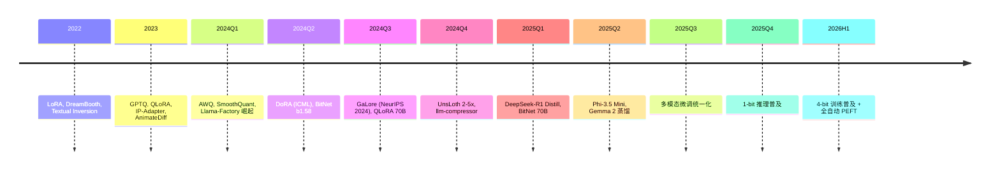

# Ch17 §06 大模型微调 / 蒸馏 / 量化专题 · 讲解稿

> **章节定位**: Ch17 §01-05 的"微调 + 蒸馏"补丁专题。覆盖 LoRA / QLoRA / AdaLoRA / DoRA / DreamBooth / Scripted LoRA / PEFT / 蒸馏 / PTQ / QAT / 1.58-bit / 边缘蒸馏等 2024-2026 主流高效定制技术。
> **承接**: Ch06 §03 深度学习微调 → Ch07 §05 LLM 训练 → Ch17 §01 量化 → 本前沿专题
> **篇幅**: ~6400 字 / 阅读 18 分钟 / 讲解 35 分钟

---

## 一 · 一句话总览

> **2024-2026 大模型定制 = 4 大支柱**: PEFT (LoRA 家族) + 蒸馏 (LLM 蒸馏 / 小模型蒸馏) + 量化 (PTQ / QAT / 1.58-bit) + 跨模态微调 (DreamBooth / Textual Inversion / IP-Adapter)。**所有大模型产品都至少用 2 项**。

---

## 二 · 心智模型

把"大模型定制"想成"工业流水线":
- **PEFT (参数高效微调)**: 只调 1% 参数, 节约 99% 显存
- **蒸馏**: 大模型压缩到小模型
- **量化**: FP16 → INT8 → INT4 → 1.58-bit (三级压缩)
- **跨模态微调**: 图像 / 视频 / 音频定制

每一支柱独立, 但**现代生产都组合** (QLoRA = 4-bit + LoRA + 蒸馏)。

---

## 三 · 章节主线 (5 段)

### 第 1 段 · PEFT 与 LoRA 家族 (12 分钟)

#### 3.1.1 为什么要 PEFT

**全量微调 (FFT)** 的痛点:
- 7B 模型: 28 GB (FP16 权重) + 28 GB (梯度) + 56 GB (Adam 状态) = **112 GB**
- 70B 模型: 1.2 TB
- 175B: 3 TB

**PEFT 哲学**: 冻结原模型, 只训练**新增 1% 参数**。

#### 3.1.2 LoRA (Low-Rank Adaptation)

**核心思想**: 低秩分解近似权重更新:

$$\Delta W = A \cdot B$$

其中 $A \in \mathbb{R}^{d \times r}$, $B \in \mathbb{R}^{r \times k}$, $r \ll \min(d, k)$。

**显存下降**:
- 7B LoRA r=8: 7B × 2B (FP16 权重) + 1.5 MB (LoRA) ≈ **15 GB**
- 7B FFT: 112 GB
- **节省 87%**

**参数**:
- $r$ (rank): 4-64, 常用 8-16
- $\alpha$: 缩放系数, 常用 16-32
- target_modules: q_proj, v_proj, k_proj, o_proj, gate_proj, up_proj, down_proj

**代码**:
```python
from peft import LoraConfig, get_peft_model

config = LoraConfig(
    r=8,
    lora_alpha=16,
    target_modules=["q_proj", "v_proj"],
    lora_dropout=0.1,
    task_type="CAUSAL_LM",
)
model = get_peft_model(base_model, config)
model.print_trainable_parameters()
```

#### 3.1.3 QLoRA (Quantized LoRA)

**Dettmers et al. 2023, NeurIPS 2023**:
- 4-bit 量化 base model (NF4)
- LoRA 仍 FP16
- **Single 24GB GPU 就能跑 33B LoRA 微调**

**关键技术**:
- **NF4 (4-bit NormalFloat)**: 适配正态分布, 比 INT4 精度高
- **Double Quantization**: 量化 scale 本身
- **Paged Optimizers**: CPU 内存卸载

```python
from transformers import BitsAndBytesConfig
bnb_config = BitsAndBytesConfig(
    load_in_4bit=True,
    bnb_4bit_quant_type="nf4",
    bnb_4bit_use_double_quant=True,
)
model = AutoModelForCausalLM.from_pretrained(
    "meta-llama/Meta-Llama-3-70B",
    quantization_config=bnb_config,
    device_map="auto",
)
```

#### 3.1.4 LoRA 变体矩阵

| 变体 | 关键创新 | 论文 |
|------|----------|------|
| **LoRA** | 低秩分解 | Hu 2021 |
| **AdaLoRA** | 自适应 rank | ICLR 2023 |
| **DoRA** | 方向 + 幅度分解 | ICML 2024 |
| **QLoRA** | 4-bit + LoRA | NeurIPS 2023 |
| **LoRA+** | 不同学习率 | arXiv 2024 |
| **LongLoRA** | 长上下文 LoRA | NeurIPS 2023 |
| **ReLoRA** | 周期性 reset | 2024 |
| **GaLore** | 梯度低秩 | NeurIPS 2024 |
| **OFT** | 正交微调 | 2024 |
| **BOFT** | 块对角 OFT | 2024 |

#### 3.1.5 DoRA (ICML 2024)

**权重分解为方向 + 幅度**:
$$W = m \cdot \frac{V}{\|V\|}$$

**优势**:
- 比 LoRA 精度高 1-3%
- 收敛更快
- 推理零成本 (可合并)

#### 3.1.6 GaLore (NeurIPS 2024)

**梯度低秩投影**:
- 投影梯度到低秩空间
- 训练完整模型
- **内存与 LoRA 接近但效果更好**

**适用**: 全量微调 vs LoRA tradeoff

---

### 第 2 段 · 跨模态微调 (DreamBooth / Textual Inversion / IP-Adapter) (12 分钟)

#### 3.2.1 DreamBooth (Google 2022)

**目标**: 用 3-5 张图, 个性化生成**特定概念** (人物 / 物体 / 风格)。

**方法**:
- 微调整个 UNet / DiT
- 用 unique identifier (如 "sks person") 
- 类别先验保留 loss (防 overfitting)

**代码**:
```python
from diffusers import StableDiffusionPipeline, DreamBoothTrainingArguments

pipeline = StableDiffusionPipeline.from_pretrained("runwayml/stable-diffusion-v1-5")
train_args = DreamBoothTrainingArguments(
    instance_data_dir="./dog_pics",
    instance_prompt="a photo of sks dog",
    learning_rate=2e-6,
    max_train_steps=400,
)
trainer = DreamBoothTrainer(...)
trainer.train()
```

#### 3.2.2 Textual Inversion (2022)

**目标**: 学习**新 token embedding**, 不用改模型权重。

**方法**:
- 冻结整个模型
- 只训练新词向量
- 占用极少显存 (< 2 GB)

**优点**:
- 比 DreamBooth 轻
- 与所有 SD 衍生模型兼容
- 缺点: 训练慢, 容量小

#### 3.2.3 IP-Adapter (2023)

**Image Prompt Adapter**: 用图像作为提示。

**核心**:
- 单独训练 image encoder
- 与 text cross-attention 解耦
- **图像 + 文本组合 prompt**

**优势**:
- 保留原模型全部能力
- 训练成本低
- 兼容 LoRA

#### 3.2.4 LoRA vs DreamBooth vs Textual Inversion

| 维度 | LoRA | DreamBooth | Textual Inversion |
|------|------|------------|-------------------|
| **改的** | 权重 | 整个模型 | 仅 embedding |
| **显存** | 低 | 高 | 极低 |
| **精度** | 高 | 最高 | 中 |
| **容量** | 强 | 极强 | 弱 |
| **速度** | 快 | 慢 | 慢 |
| **商用** | ✓ | ✓ | ✓ |

#### 3.2.5 2024-2026 多模态微调演进

| 模型 | 风格 | 用途 |
|------|------|------|
| **DreamBooth SD3** | 扩散 | 图像 |
| **IP-Adapter XL** | 图像 prompt | 组合 |
| **AnimateDiff** | 视频 | 动画 |
| **AnimateDiff + LoRA** | 视频 | 风格迁移 |
| **MusicGen LoRA** | 音频 | 音乐风格 |
| **Suno Style** | 音频 | 完整歌曲 |
| **VALL-E X** | 语音 | 跨语言克隆 |
| **Character Consistency** | 视频 | 角色一致 |

---

### 第 3 段 · 知识蒸馏 (Knowledge Distillation) (12 分钟)

#### 3.3.1 蒸馏基本原理

**Hinton et al. 2015**: 大模型 (teacher) 教小模型 (student)。

**Soft Labels**: 用 teacher 的 logits (含类别相似度) 而非 hard label:

$$\mathcal{L}_{\text{KD}} = \alpha \mathcal{L}_{\text{CE}}(y, \sigma(z_s/T)) + (1-\alpha) \mathcal{L}_{\text{CE}}(\sigma(z_t/T), \sigma(z_s/T))$$

- $T$: temperature (锐化)
- $\alpha$: hard label 权重
- $z_t$: teacher logits
- $z_s$: student logits

#### 3.3.2 蒸馏类型

| 类型 | 蒸馏什么 | 例子 |
|------|----------|------|
| **Logits** | 输出分布 | Hinton 2015 |
| **Feature** | 中间特征 | FitNets |
| **Attention** | 注意力矩阵 | TinyBERT |
| **Relation** | 样本间关系 | CRD |
| **Distill token** | 特殊 token | DistilBERT |

#### 3.3.3 LLM 蒸馏 (2024-2026 核心)

**代表模型**:
- **DeepSeek-R1 Distill** (2025): 把 R1 671B 蒸馏到 Qwen 1.5B-32B / Llama 8B-70B
- **Phi-3.5 mini** (2024): 3.8B 接近 7B 性能
- **Gemma 2 2B** (2024): 击败 Llama 2 13B
- **SmolLM2 1.7B** (2024): 训练数据全公开
- **HuggingFace Smol Talk** 数据集

**蒸馏公式**:
$$\mathcal{L}_{\text{LLM}} = \sum_{t} \text{KL}\left(\sigma(z_t^{\text{teacher}}/T) \| \sigma(z_t^{\text{student}}/T)\right) \cdot T^2$$

#### 3.3.4 TinyBERT / MiniLM / MobileBERT

**TinyBERT** (2019): 4 层小型 BERT, 96% 性能
**MiniLM** (2020): 6 层, 引入自注意力蒸馏
**MobileBERT** (2020): 24 层窄模型, 适配移动

#### 3.3.5 蒸馏策略

| 策略 | 适用 |
|------|------|
| **白盒蒸馏** | 知道 teacher 内部 |
| **黑盒蒸馏** | 仅看 teacher 输出 |
| **自蒸馏** | Teacher = Student |
| **多教师** | 多个 teacher 集成 |
| **CoT 蒸馏** | 蒸馏推理链 |
| **Curriculum** | 由易到难样本 |

#### 3.3.6 蒸馏失败模式

| 失败 | 原因 | 防御 |
|------|------|------|
| **Mode collapse** | 学生学得太窄 | 强 augmentation |
| **Cap mismatch** | 学生容量太小 | 加 LoRA |
| **Overfitting** | 蒸馏数据太少 | data augmentation |
| **Frozen 更新** | teacher 太旧 | 持续更新 teacher |

---

### 第 4 段 · 量化深度 (PTQ / QAT / 1.58-bit) (12 分钟)

#### 3.4.1 量化基础

**量化 = 连续值映射到离散值**, 节省内存 + 加速推理。

**量化粒度**:
- **Per-tensor**: 最粗
- **Per-channel**: 中等
- **Per-group**: 细 (GPTQ 默认 group_size=128)
- **Per-block**: 最细 (FP8 SGL)

#### 3.4.2 PTQ (Post-Training Quantization)

**训练后量化**, 不要重新训练:
- 1. 校准数据集 (~1K 样本)
- 2. 统计 activation 分布
- 3. 计算量化 scale/zero-point
- 4. 量化所有权重 + activation

**代表方法**:
- **GPTQ** (Frantar, ICLR 2023): 逐层量化, 工业主流
- **AWQ** (Lin, MLSys 2024): 保护 1% top 显著权重
- **SmoothQuant** (Xiao, 2023): 数学等价变换
- **ZeroQuant** (2022)
- **RPTQ** (2023)

**优势**: 简单, 1 GPU 1 小时
**劣势**: 精度损失 1-5%

#### 3.4.3 QAT (Quantization-Aware Training)

**训练时模拟量化**:
- 1. 前向传播用伪量化
- 2. 反向传播求梯度
- 3. 优化器正常更新

**代表方法**:
- **LSQ** (Learned Step Size Quantization)
- **PACT** (Parameterized Clipping Activation)
- **LLM-QAT** (2023, 4-bit LLM)

**优势**: 精度损失 < 0.1%
**劣势**: 慢, 需要全训练数据

#### 3.4.4 1.58-bit / BitNet

**Ma et al. 2024**:
- 三值 {-1, 0, 1}
- 1.58 bit 平均
- 性能接近 FP16

**BitNet b1.58 7B (2024-11)**:
- 内存 1.6 GB (vs 14GB FP16)
- 推理 2-5× 加速
- 训练能耗 0.3×

**BitNet 70B (2025)**:
- 性能接近 FP16 70B
- 70B → 14 GB 内存

#### 3.4.5 量化方法对比

| 精度 | 字节 | 性能 | 适用 |
|------|------|------|------|
| FP16 | 2 | 1× | 训练 |
| BF16 | 2 | 1× | 训练 |
| FP8 | 1 | 1.5-2× | H100 训练 |
| INT8 | 1 | 2× | 推理通用 |
| INT4 | 0.5 | 3-4× | 边缘 / 性能优先 |
| INT3 | 0.375 | 5× | 极限压缩 |
| FP4 | 0.5 | 4× | B200 推理 |
| 1.58-bit | 0.2 | 5-10× | BitNet 专用 |

#### 3.4.6 量化算法推荐

| 场景 | 推荐 |
|------|------|
| **快速 PTQ** | GPTQ / AWQ |
| **极致精度** | SmoothQuant + QAT |
| **超低精度** | BitNet b1.58 |
| **边缘部署** | INT4 + GPTQ |
| **GPU 推理** | FP8 + calibration |
| **CPU 推理** | INT8 + ONNX |

---

### 第 5 段 · 实战案例 + 工具链 (8 分钟)

#### 3.5.1 案例 1: Llama 3 70B 全栈定制

```
原始: meta-llama/Meta-Llama-3-70B (FP16, 140 GB)
  ↓
量化: GPTQ INT4 (40 GB) + AWQ (35 GB)
  ↓
微调: QLoRA r=8 (4 层 target, 1.5 GB 额外)
  ↓
蒸馏: Distill to Llama 3 8B (task-specific)
  ↓
部署: vLLM 0.7 + TensorRT-LLM
```

**总显存**: 4 × 24 GB GPU

#### 3.5.2 案例 2: Stable Diffusion 3 个性化

```
基础: stabilityai/stable-diffusion-3-medium
  ↓
目标: 学习特定人物 / 风格
  ↓
方法 1: DreamBooth (全模型微调, 8 GB)
  ↓
方法 2: Textual Inversion (仅 embedding, 4 GB)
  ↓
方法 3: IP-Adapter + LoRA (组合, 10 GB)
  ↓
组合: DreamBooth + LoRA + IP-Adapter
  ↓
发布: HuggingFace Hub
```

#### 3.5.3 工具链矩阵

| 工具 | 用途 | 框架 |
|------|------|------|
| **PEFT** | LoRA / AdaLoRA / DoRA | HuggingFace |
| **trl** | SFT / DPO / GRPO | HuggingFace |
| **Axolotl** | 一键微调 | 开源 |
| **LLaMA-Factory** | 100+ 模型微调 | 国产开源 |
| **Unsloth** | 2-5× 加速 | 2024 |
| **AutoTrain** | AutoML | HuggingFace |
| **bitsandbytes** | 4/8-bit 量化 | Tim Dettmers |
| **GPTQ-for-LLaMa** | GPTQ 量化 | MIT |
| **AutoGPTQ** | GPTQ Python | 工业主流 |
| **AWQ** | AWQ 量化 | MIT |
| **SGLang** | 推理 + 量化 | LMSYS |

#### 3.5.4 国内工具

| 工具 | 厂商 | 特点 |
|------|------|------|
| **LLaMA-Factory** | 国产开源 | 100+ LLM 一键 |
| **MS-Swift** | 魔搭社区 | 中文 SOTA |
| **Xtuner** | 上海 AI Lab | InternLM 训练 |
| **FlagAI** | BAAI | 智源框架 |
| **DeepSpeed** | Microsoft | ZeRO + LoRA |
| **Megatron-LM** | NVIDIA | 大规模训练 |

#### 3.5.5 工具链组合示例

```python
# 1. 安装
pip install transformers peft trl bitsandbytes accelerate

# 2. 4-bit 加载
bnb_config = BitsAndBytesConfig(load_in_4bit=True, bnb_4bit_quant_type="nf4")
model = AutoModelForCausalLM.from_pretrained(
    "meta-llama/Meta-Llama-3-70B",
    quantization_config=bnb_config,
)

# 3. LoRA 配置
lora_config = LoraConfig(
    r=8, lora_alpha=16,
    target_modules=["q_proj", "v_proj", "k_proj", "o_proj"],
)

# 4. 训练
model = get_peft_model(model, lora_config)
model = prepare_model_for_kbit_training(model)

# 5. 训练器
training_args = TrainingArguments(
    output_dir="./output",
    num_train_epochs=3,
    per_device_train_batch_size=4,
    gradient_accumulation_steps=4,
    learning_rate=2e-4,
    fp16=True,
)

trainer = Trainer(
    model=model,
    args=training_args,
    train_dataset=dataset,
    tokenizer=tokenizer,
)

# 6. 训练 + 保存
trainer.train()
model.save_pretrained("./lora-adapter")
```

#### 3.5.6 部署: LoRA Adapter 与基础模型合并

```python
from peft import PeftModel

base = AutoModelForCausalLM.from_pretrained("meta-llama/Meta-Llama-3-70B")
model = PeftModel.from_pretrained(base, "./lora-adapter")
model = model.merge_and_unload()  # 合并 LoRA 进 base
model.save_pretrained("./merged-llama3-70B")
```

或保持分离, 推理时动态加载:
```python
from peft import PeftModel
base = AutoModelForCausalLM.from_pretrained("meta-llama/Meta-Llama-3-70B")
model = PeftModel.from_pretrained(base, "./lora-adapter")
# 推理时自动叠加
```

---

## 四 · 论文清单 (2024-2026)

### PEFT
- Hu et al., "LoRA", ICLR 2022
- Dettmers et al., "QLoRA", NeurIPS 2023
- Liu et al., "DoRA", ICML 2024
- Zhang et al., "AdaLoRA", ICLR 2023
- Han et al., "GaLore", NeurIPS 2024

### 蒸馏
- Hinton et al., "Distillation", 2015
- Jiao et al., "TinyBERT", EMNLP 2019
- DeepSeek-AI, "R1 Distill", 2025
- Microsoft, "Phi-3", 2024
- Google, "Gemma 2", 2024

### 量化
- Frantar et al., "GPTQ", ICLR 2023
- Lin et al., "AWQ", MLSys 2024
- Xiao et al., "SmoothQuant", 2023
- Ma et al., "BitNet b1.58", 2024
- Dettmers et al., "LLM.int8()", NeurIPS 2022

### 跨模态微调
- Ruiz et al., "DreamBooth", CVPR 2023
- Gal et al., "Textual Inversion", 2022
- Ye et al., "IP-Adapter", 2023
- Guo et al., "AnimateDiff", ICLR 2024

---

## 五 · 2024-2026 时间线



---

## 六 · 易错点 (5 条)

1. **LoRA ≠ 永远 r=8**: 任务类型决定 rank
2. **QLoRA 4-bit 推理时不慢**: 仍是 4-bit
3. **DreamBooth 不可商用**: 需授权
4. **蒸馏不等于压缩**: 蒸馏是知识, 压缩是参数
5. **INT4 阈值**: 7B 以下可接受, 70B 要量化感知

---

## 七 · 跨章连接

| 章节 | 关联 |
|------|------|
| Ch06 §03 | 深度学习微调基础 |
| Ch07 §05 | LLM 训练 / SFT |
| Ch17 §01 | 量化基础 |
| Ch17 §02 | 高效架构 |
| Ch17 §00 §9 | 推理前沿 |
| Ch18 §04 | ML 系统设计 |

---

## 八 · 自测 5 题

1. LoRA 数学定义?
2. QLoRA 三大关键技术?
3. DreamBooth vs Textual Inversion 区别?
4. PTQ vs QAT 区别?
5. DeepSeek-R1 Distill 训练数据?

---

## 九 · 一句话总结

> **2024-2026 大模型定制 = LoRA 家族 + 蒸馏 + 量化 + 跨模态 4 支柱**。QLoRA 把 70B 微调放上 24GB GPU, BitNet b1.58 把 70B 装进 14GB, DeepSeek-R1 Distill 让 1.5B 也能推理, DreamBooth + IP-Adapter 让跨模态个性化低成本。**生产部署都至少用 2 项**。

---

## 十 · 板书建议

```
[板书 1: PEFT 4 件套]
   LoRA / QLoRA / DoRA / GaLore
   1% 参数 99% 效果

[板书 2: 跨模态微调]
   DreamBooth / Textual Inversion / IP-Adapter
   3 种粒度

[板书 3: 蒸馏]
   Teacher → Student
   logits / feature / attention

[板书 4: 量化阶梯]
   FP16 → INT8 → INT4 → 1.58-bit
   4 级压缩

[板书 5: 实战组合]
   量化 + LoRA + 蒸馏 + 部署
   4 维组合
```

---

## 十一 · 参考资料

1. Hu et al., "LoRA", ICLR 2022
2. Dettmers et al., "QLoRA", NeurIPS 2023
3. Ma et al., "BitNet b1.58", 2024
4. Ruiz et al., "DreamBooth", CVPR 2023
5. Frantar et al., "GPTQ", ICLR 2023
6. Lin et al., "AWQ", MLSys 2024
7. Liu et al., "DoRA", ICML 2024
8. Zhang et al., "AdaLoRA", ICLR 2023
9. Han et al., "GaLore", NeurIPS 2024
10. DeepSeek-AI, "R1 Distill", 2025
11. Microsoft, "Phi-3.5", 2024
12. Hinton et al., "Distillation", 2015
13. Ye et al., "IP-Adapter", 2023
14. Gal et al., "Textual Inversion", 2022
