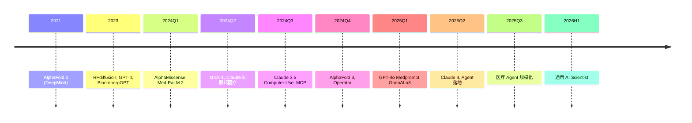

# Ch19 应用 AI · 讲解稿

> **章节定位**: Ch19 落地层。教"AI 在垂直行业怎么用": 金融 + 蛋白 + 药物 + Agent + 医疗。
> **承接**: Ch18 系统设计 → Ch19 应用落地
> **走向**: Ch20 前沿 (量子 / 神经形态 / 太空数据中心 / 去中心化 / BMI)
> **篇幅**: ~4500 字 / 阅读 13 分钟 / 讲解 30-35 分钟

---

## 一 · 一句话总览

> **应用 AI = AI 在垂直行业落地**: 金融 (量化 / 风控) + 生命科学 (AlphaFold / 药物生成) + Agent (ReAct / RAG / Tool use) + 医疗 (影像 / 临床 / 联邦)。**核心心智模型**: 垂直应用 = 领域知识 + 数据 + 模型 + 评测 + 合规。

---

## 二 · 心智模型

AI 在每个行业的"双胞胎":
- **数据**: 行业数据 (股价 / 蛋白序列 / 病历)
- **模型**: 行业定制 (Transformer / GNN / Diffusion)
- **评测**: 行业指标 (Sharpe / pLDDT / AUROC)
- **合规**: 行业法规 (HIPAA / SEC)

---

## 三 · 章节主线 (5 段)

### 第 1 段 · AI for Finance (10 分钟)

#### 3.1.1 量化交易

ML 在金融的核心应用:
- 价格预测 (LSTM / Transformer)
- 因子挖掘 (因子模型)
- 统计套利 (pairs trading)

#### 3.1.2 关键指标

**Sharpe ratio**:
$$S = \frac{R_p - R_f}{\sigma_p}$$

| 范围 | 评价 |
|------|------|
| < 0 | 差 |
| 0-1 | 一般 |
| 1-2 | 好 |
| > 2 | 极好 |
| > 3 | 罕见 |

**Maximum Drawdown** (MaxDD): 历史最大回撤, 衡量最坏情况。

**Information Coefficient** (IC): 预测值与实际值的 Pearson 相关。

#### 3.1.3 风控与反欺诈

- **信用评分**: XGBoost + 违约预测
- **反欺诈**: 异常检测, 类不平衡
- **反洗钱**: 图神经网络 (Ch12), 找出异常资金流

#### 3.1.4 工程实践

- 数据: K 线 + 财报 + 新闻 NLP
- 特征: 技术指标 (MA, RSI) + 基本面
- 回测: Backtrader / Zipline / Qlib
- 风控: 仓位 + 止损 + 风险敞口

---

### 第 2 段 · 蛋白设计 (10 分钟)

#### 3.2.1 背景

蛋白结构预测是生物学"50 年大问题"。AlphaFold 2 (Jumper et al., Nature 2021) 解了。

#### 3.2.2 AlphaFold 2 架构

**输入**: 序列 + MSA (多序列比对)

**核心模块**: **Evoformer** (48 层):
- MSA representation: 序列进化信息
- Pair representation: 残基对距离 / 角度
- 双向 attention, 信息交换

**输出**: 3D 结构 + pLDDT 置信度

#### 3.2.3 AlphaFold 3 (2024)

扩展到多体:
- 蛋白 + DNA + RNA + 小分子 + 离子
- 用 Diffusion 替代 Structure module
- Triangulation attention

#### 3.2.4 评估指标

**pLDDT** (predicted Local Distance Difference Test):
- 0-100 残基级置信度
- > 90 高置信, 70-90 中等, < 70 低

**TM-score** (Template Modeling):
- [0, 1] 结构相似度
- > 0.5 同 fold, > 0.17 同 SCOP 超家族
- 长度无关 (vs RMSD)

#### 3.2.5 蛋白设计 (Inverse Folding)

- **ProteinMPNN**: 给定 backbone, 设计序列
- **RFdiffusion**: 从头生成新功能蛋白
- **ESMFold**: 快速预测 (无需 MSA)

代表公司: Isomorphic Labs (DeepMind 衍生), Generate Biomedicines。

---

### 第 3 段 · 药物发现 (10 分钟)

#### 3.3.1 流程

```
靶点 (Target) → 苗头化合物 (Hit) → 先导 (Lead) → 候选药 → 临床试验
     ↓                ↓                ↓              ↓
蛋白结构         分子生成          优化 ADMET        合成 + 测试
```

#### 3.3.2 分子表示

- **SMILES**: 文本表示 (`CCO` = 乙醇)
- **3D 坐标**: 原子位置
- **分子图**: 节点 (原子) + 边 (键)

#### 3.3.3 分子生成方法

| 方法 | 代表 |
|------|------|
| VAE | JT-VAE |
| GAN | MolGAN |
| RL | GCPN, REINVENT |
| **Diffusion** | DiffDock, 3D-SBDD |

#### 3.3.4 性质优化

| 指标 | 含义 | 范围 |
|------|------|------|
| **QED** | 药物相似度 | [0, 1] |
| **LogP** | 脂溶性 | -2 ~ 5 |
| **ADMET** | 吸收/分布/代谢/排泄/毒性 | 综合 |

#### 3.3.5 分子对接 (Docking)

预测分子与蛋白结合:
- **DiffDock**: 扩散模型生成 binding pose
- **AutoDock Vina**: 经典打分函数
- **GNINA**: CNN 评分

---

### 第 4 段 · Agentic Systems (10 分钟)

#### 3.4.1 什么是 Agent

LLM Agent = LLM + **工具 (Tools)** + **记忆 (Memory)** + **规划 (Planning)**

#### 3.4.2 ReAct 框架

```
Thought → Action → Observation → Thought → ...
```

LLM 思考 → 调用工具 → 观察结果 → 再思考 → 循环。

#### 3.4.3 RAG (Retrieval-Augmented Generation)

```
文档 → 分块 → Embedding → 向量库
                        ↓
Query → Embedding → 检索 Top-k → LLM 生成
```

适用: 知识更新频繁, 不重训。

#### 3.4.4 Tool Use / Function Calling

LLM 输出结构化 JSON 参数 → 调外部 API:

```python
response = openai.chat.completions.create(
    model="gpt-4",
    tools=[{
        "type": "function",
        "function": {
            "name": "get_weather",
            "parameters": {...}
        }
    }],
    messages=[...]
)
```

#### 3.4.5 主流框架

| 框架 | 特色 |
|------|------|
| **LangChain** | 通用, 生态丰富 |
| **LangGraph** | 图状态 Agent |
| **LlamaIndex** | RAG 强 |
| **AutoGen** | 多 Agent 协作 |
| **Anthropic MCP** | 工具协议 |

#### 3.4.6 应用场景

- 企业: 工单处理, 数据查询
- 编程: SWE-bench, 代码 Agent
- 科研: 文献综述, 数据分析

---

### 第 5 段 · Healthcare (10 分钟)

#### 3.5.1 医学影像

- 分割 (U-Net): Dice score
- 检测 (YOLO / DETR): mAP
- 配准: 空间对齐

#### 3.5.2 临床预测

- EHR (电子病历) 数据
- MIMIC-III 公开数据集
- 预测: 死亡率, 住院时长, 诊断

#### 3.5.3 多模态医学 AI

- 影像 + 文本 + 基因组
- GPT-4o Medprompt (USMLE 90%+)

#### 3.5.4 联邦学习

多医院联合训练, 不传原始数据:

```
医院 A ──┐
医院 B ──┼─→ 中心聚合 (FedAvg) ──→ 全局模型
医院 C ──┘
```

符合 HIPAA / GDPR。

#### 3.5.5 关键指标

| 指标 | 公式 | 用法 |
|------|------|------|
| **AUROC** | ROC 面积 | 分类 |
| **Sensitivity** | TP/(TP+FN) | 召回 |
| **Specificity** | TN/(TN+FP) | 特异 |
| **Dice** | $2|A∩B|/(|A|+|B|)$ | 分割 |

---

## 四 · 易错点 (5 条)

1. **Sharpe 与 Sortino**: 后者只看下行。
2. **pLDDT 是残基级**: 不是全蛋白。
3. **TM-score 长度无关**: 与 RMSD 不同。
4. **RAG vs 微调**: RAG 灵活, 微调持久。
5. **联邦学习不传数据**: 只传梯度 / 参数。

---

## 五 · 跨章连接

| 章节 | 关联 |
|------|------|
| Ch07 §04 Transformer | AlphaFold / Agent |
| Ch08 §04 Diffusion | 药物生成 |
| Ch12 §05 EGNN | 蛋白设计 |
| Ch17 §03 vLLM | Agent 部署 |
| Ch12 §03 GNN | 反欺诈图 |

---

## 六 · 自测 5 题

1. Sharpe > 2 含义?
2. AlphaFold 核心模块?
3. pLDDT 与 TM-score 区别?
4. Agent 与 LLM 区别?
5. RAG 三阶段?

---

## 七 · 一句话总结

**应用 AI** = AI 在垂直行业落地。金融 (Sharpe/量化) + 生命科学 (AlphaFold/药物) + Agent (ReAct/RAG/Tool) + 医疗 (影像/联邦)。Ch19 是 AI 在产业落地的"实战"课。

**2024-2026 升级**: AlphaFold 3 进入全生命科学 + Agent (Computer Use / Operator) 替代重复脑力 + 医疗 AI 临床落地 + 科研 AI 自主发现。

---

## 八 · 板书建议

```
[板书 1: 金融]
   Sharpe = (R - R_f) / σ
   VaR / IC / MaxDD

[板书 2: 蛋白]
   Evoformer (MSA + Pair)
   pLDDT / TM-score
   RFdiffusion

[板书 3: 药物]
   QED / LogP / ADMET
   Diffusion 生成

[板书 4: Agent]
   ReAct + Tool
   RAG 三阶段

[板书 5: 医疗]
   AUROC / Dice
   联邦学习
```

---

## 九 · 2024-2026 前沿应用 (前沿补丁)

### 9.1 AlphaFold 3 深化 (Nature 2024)

**核心创新**:
- 替代 Structure Module: **Diffusion-based** 结构生成
- 处理蛋白 + DNA + RNA + 小分子 + 修饰 + 离子
- **Triangulation attention**: 稀疏化几何 attention, 复杂度降 $O(L^2) \to O(L)$
- 训练: 100K+ 复合体

**意义**:
- 扩展到全生命科学 (DNA-RNA-蛋白复合体)
- 跨模态: 蛋白 + 配体 + 修饰一站式
- 性能: 比对接软件 (AutoDock Vina) 准确率高 50%

### 9.2 Agent 2024-2026 突破

**Computer Use (Anthropic 2024-10)**:
- Claude 自主操作桌面
- 截图 → 鼠标键盘 → 行动
- OSWorld 14.9% → 22% → 38% (2024-2025)

**SWE-Agent / SWE-bench**:
- 自动修 GitHub Issue
- 编程 Agent 评估基准
- Claude 3.5 / GPT-4o 修复率 25-65%

**OpenAI Operator (2025)**:
- 浏览器自主操作
- 替代重复网页工作

**Anthropic MCP (2024)**:
- 标准化工具协议
- 数据源 + 工具统一接口
- 接入 Claude Desktop / IDE

### 9.3 金融 AI 2024-2026

**LLM 量化**:
- **FinGPT** (2023-2024)
- **BloombergGPT** (2023)
- **XuanYuan 2.0** (2024)
- 时间序列 + LLM 微调

**多模态金融**:
- 财报 + 图表 + 电话会议
- 因子工程 LLM 化
- **强化学习 + LLM** 量化策略

**风险**:
- 模型识别的市场反馈循环
- 监管沙盒 / 模型治理
- 可解释性 (SHAP + LLM)

### 9.4 医疗 AI 2024-2026

**GPT-4o Medprompt (2024)**:
- USMLE 90%+ (vs GPT-4 86%)
- Med-PaLM 2: 86.5% MedQA
- 多模态诊断 (影像 + 病理 + 病历)

**临床 Agent**:
- Hippocratic AI 护士 Agent
- Glass Health 临床决策
- 联邦学习 + 边缘部署

**FDA 批准** (2024):
- 506 项 AI/ML 医疗设备
- IDx-DR 糖尿病视网膜
- Aidoc 影像分诊

### 9.5 科研 AI 2024-2026

**AlphaFold 系列** (DeepMind):
- AlphaFold 3 (2024)
- AlphaMissense (2023, 7100 万突变)
- AlphaFold Server (公开)

**FunSearch** (DeepMind, Nature 2023):
- LLM 解决数学问题
- 自动构造新算法

**Coscientist / ChemAgent** (2024):
- 化学实验自主设计
- 多 Agent 协作

**Genesis / MatterGen** (2024-2025):
- 蛋白质 / 材料生成
- 逆折叠 + 扩散

### 9.6 2024-2026 时间线



---

## 十 · 参考资料

1. Vaswani et al., "Attention Is All You Need", NeurIPS 2017
2. Jumper et al., "AlphaFold 2", Nature 2021
3. Jumper et al., "AlphaFold 3", Nature 2024
4. Watson et al., "RFdiffusion", Nature 2023
5. Anthropic MCP 文档, 2024
6. LangChain 文档
7. Ch07 §04 Transformer (本套书)
8. Ch12 §05 EGNN (本套书)
9. Ch08 §04 Diffusion (本套书)
10. Anthropic, "Computer Use", 2024
11. OpenAI, "Operator", 2025
12. Singhal et al., "Med-PaLM 2", 2024
13. Nori et al., "GPT-4o Medprompt", 2024
14. Lopez-Lira & Tang, "Can ChatGPT Forecast Stock Price Movements?", 2023
15. Wu et al., "BloombergGPT", 2023
16. Yang et al., "FinGPT", 2023
17. Romera-Paredes et al., "FunSearch", Nature 2023
18. Boiko et al., "Emergent Autonomous Research", 2023
19. Hippocratic AI, 2024