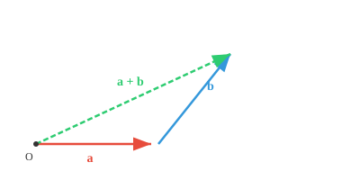
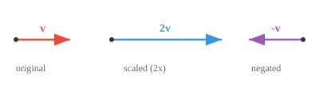
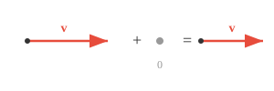

# 向量空间

*作者按:* 我一直觉得, 学线性代数最容易劝退新手的地方, 不是公式复杂, 而是"顺序错了"。教材往往一上来就抛出十条公理, 让人还没建立直觉就先陷入符号海洋。这一章我特意换了个走法: 先请你把向量空间想象成一座乐园, 里面住着一群可以相加、可以被缩放的"居民"; 然后借身高体重年龄这种日常特征, 把抽象定义落到具体的人身上; 最后才把十条公理拿出来收尾, 让它们成为"事后追认的规则", 而不是横亘在门口的门槛。我也故意反复强调那句"不逃出这个空间", 因为封闭性 (closure) 才是整个向量空间概念的灵魂, 也是子空间、线性映射、矩阵一切后续内容的根。等你读完本节, 再回头去看那些冷冰冰的公理, 应该会有种"原来它们只是把我一直在做的事情写下来"的感觉。这份笃定, 就是我希望你带进第 02 节的东西。

> **一句话总结**: 向量空间就是一个装向量的"游乐园", 里面的向量做加法和缩放, 永远不会跑出去. 十条公理就是这座乐园的规则手册.

## 🗺️ 本章导览

- 本章覆盖向量的一切: 空间 → 性质 → 度量 → 运算 → 高级结构
- **01. 向量空间** (本节): 定义向量与它们生活的空间, 引入公理
- **02. 向量的性质**: 长度、方向、单位化、正交
- **03. 范数与度量**: 各种距离与相似度
- **04. 向量积**: 点积、叉积、外积
- **05. 基与对偶**: 换基、对偶空间, 通往矩阵一章的桥梁

*向量空间构成了机器学习安身立命的数学乐园。本文覆盖向量加法、标量乘法、封闭性公理、子空间, 以及为什么 AI 里几乎一切都用向量来表示。*

- 把向量空间 (Vector Space) 想成一个特别的乐园, 里面住着各种数学对象, 每一个对象就叫做一个向量 (vector)。

- 向量空间的正式定义是: 一堆向量的集合, 它们可以相加、可以被缩放, 但结果始终不逃出这个空间。

- 一个有用的反例: 整数 $\mathbb{Z}$ 在实数域上不是一个向量空间, 因为把 $3$ 缩放 $0.5$ 得到 $1.5$, 而这个数不在整数集里。定义里"不逃出这个空间"这一句可不是白写的。

- 为了机器学习 (Machine Learning, ML) 里的几何直觉, 我们始终把向量当成欧几里得空间里的一个点, 用它的坐标来表示。

- 向量 $\mathbf{a}$ (数学上一般用加粗的小写字母表示) 有 $n$ 个坐标, 每个坐标代表沿某个坐标轴的位置。

$$\mathbf{a} = [a_1, a_2, a_3]$$

> **约定**: 本文默认向量为列向量, 但为节省行内空间, 采用行形式书写; 实际做矩阵运算时视为列向量。


- 向量空间里的向量遵守一套非常明确、不可打破的规则。第一条叫向量加法 (Vector Addition, 组合): 你可以任取两个向量, 把它们组合成一个新的向量。把向量想成一条移动指令。如果向量 A 意思是"往前走 3 步", 向量 B 意思是"往右走 2 步", 那 A + B 得到的新指令就是"往前走 3 步, 再往右走 2 步"。第二条叫标量乘法 (Scalar Multiplication, 缩放): 你可以任取一个向量, 用一个普通数 (即"标量") 去缩放它。可以拉长它、缩短它、也可以让它反向。如果向量 A 是"往前走 3 步", 把它乘以 2 就变成"往前走 6 步"; 乘以 -1 就整个反过来, 变成"往后走 3 步"。

- 向量空间的维度 (dimension) 就是它里面独立方向的个数。$\mathbb{R}^2$ 是二维的 (需要 2 个坐标), 而上面的 $\mathbf{a}$ 住在 $\mathbb{R}^3$ 里。

- 举个例子, 我们可以把任何一个对象——比如一个人——表示成一个向量, 其中 $h_1$ = 身高 (单位 cm), $h_2$ = 体重 (单位 kg), $h_3$ = 年龄。

$$\mathbf{h} = [185, 75, 30]$$

- 我们现在就造出了一个向量空间, 里面的向量代表一个人。

- 我们可以同时表示多个人, 看看他们之间是靠得近还是离得远!


- 我们还能加进更多特征, 让一个人的表示更丰富, 在 ML 里这种向量常叫做特征向量 (feature vector)。你手上独特而有意义的特征越多, 特征向量就越有描述力, 这一点很重要, 别忘了。

- 一旦超过 3 维, 向量就很难用眼睛去看了, 这也催生了一整门数学——线性代数 (Linear Algebra)。

- 说白了, 线性代数就是研究向量、向量空间, 以及向量之间的映射的学问。

- 在 AI/ML 里, 我们几乎把所有东西都表示成向量, 所以线性代数就是这个领域的基石。

- 向量加法可以这样做直观演示: 把一个向量的起点接到另一个向量的终点, 然后从原点画到最终的终点。



- 对于两个向量 $\mathbf{a} = (a_1, a_2)$ 和 $\mathbf{b} = (b_1, b_2)$: $\mathbf{a} + \mathbf{b} = (a_1 + b_1, a_2 + b_2)$

- 向量也可以做减法, 加法的所有规则同样适用。

- 用一个标量乘以向量, 就是把向量沿原方向按这个比例缩放。



- 对于标量 $c$ 和向量 $\mathbf{v} = (v_1, v_2)$: $c\mathbf{v} = (cv_1, cv_2)$

- 十条公理具体是这样的。先说两条封闭性: 加法封闭性 (closure under addition) 要求 $\mathbf{u}, \mathbf{v} \in V$ 时 $\mathbf{u} + \mathbf{v} \in V$; 标量乘法封闭性 (closure under scalar multiplication) 要求 $\mathbf{v} \in V$、$c \in F$ 时 $c\mathbf{v} \in V$。这两条是"不逃出空间"的正式说法。

- 加法层面还有四条: 交换律 (commutativity) 说 $\mathbf{u} + \mathbf{v} = \mathbf{v} + \mathbf{u}$; 结合律 (associativity) 说 $(\mathbf{u} + \mathbf{v}) + \mathbf{w} = \mathbf{u} + (\mathbf{v} + \mathbf{w})$; 存在零向量 $\mathbf{0}$ 使 $\mathbf{v} + \mathbf{0} = \mathbf{v}$; 每个向量 $\mathbf{v}$ 都有加法逆元 $-\mathbf{v}$ 使 $\mathbf{v} + (-\mathbf{v}) = \mathbf{0}$。


- 沿平行四边形的两条路径最终都到达同一个点。




- 标量乘法层面另有四条: 两条分配律分别对应 $c(\mathbf{u} + \mathbf{v}) = c\mathbf{u} + c\mathbf{v}$ 与 $(c + d)\mathbf{v} = c\mathbf{v} + d\mathbf{v}$; 结合律要求 $(cd)\mathbf{v} = c(d\mathbf{v})$; 单位元 (identity element) 要求 $1\mathbf{v} = \mathbf{v}$, 其中 $1$ 是标量域中的乘法单位元。


- 对和向量做缩放 (金色) 与先分别缩放再相加, 结果一致。

- 一些向量空间的例子:

    - $\mathbb{R}^n$ (n 维空间): n 维空间中的所有实数向量, 例如向量 [1,4,3000...第 n 项], 把两个点相加或对某一个点做缩放, 结果依然落在这个平面上。

    - 灰度图像: 一张 $28 \times 28$ 的图片其实就是 784 个像素强度值, 也就是 $\mathbb{R}^{784}$ 里的一个向量。把两张图相加 (混合) 或者缩放一张 (调亮), 得到的还是一张同尺寸的图。

    - 音频信号: 一段 44.1kHz 采样、时长 1 秒的音频, 就是一个有 44,100 个分量的向量。把两段音频混在一起, 无非就是向量加法。

    - 多项式: 两个多项式相加、或者一个多项式乘以某个数, 结果还是多项式, 所以它们也构成一个向量空间。向量不一定长得像箭头!

- **子空间 (subspace)** 就是大乐园里嵌套的一个小乐园。把三维空间想成一个房间, 一张穿过房间中心的平面纸片就是一个子空间, 一根穿过中心的直铁丝也是。

- 关键要求是, 子空间必须穿过原点。如果你把那张纸偏离中心, 它就不再是子空间了, 因为零向量不在上面。


- 向量空间的所有规则 (加法、缩放、封闭性) 在子空间里同样成立。你可以在子空间内做加法或缩放, 结果永远不会"掉出去"到外面的更大空间。

- 一条过原点的直线是 1 维子空间, 一个过原点的平面是 2 维子空间, 而整个空间本身也是自己的子空间。

- 在 ML 里, 子空间自然而然会冒出来。高维数据往往具有某种结构, 实际上住在一个更低维的子空间里。像主成分分析 (Principal Component Analysis, PCA) 这类技术就是去找出这个子空间, 让我们能更高效地处理数据。

## 编码任务 (在 CoLab 或 notebook 里使用)

1. 运行代码验证分配律, 然后修改代码去试试其他规则!
```python
import jax.numpy as jnp

u = jnp.array([1, 2])
v = jnp.array([3, 0])
c = 2

lhs = c * (u + v)
rhs = c*u + c*v

print(f"LHS: {lhs}")
print(f"RHS: {rhs}")
```

2. 运行代码可视化不同向量, 然后修改各个坐标的值, 感受每个坐标轴如何影响位置。
```python
import jax.numpy as jnp
import matplotlib.pyplot as plt

# 试试改这些向量!
a = jnp.array([3, 2, 4])
b = jnp.array([1, 4, 2])
c = jnp.array([4, 1, 3])

fig = plt.figure()
ax = fig.add_subplot(111, projection="3d")

for vec, name, color in [(a, "a", "red"), (b, "b", "blue"), (c, "c", "green")]:
    ax.quiver(0, 0, 0, *vec, color=color, arrow_length_ratio=0.1, linewidth=2, label=name)

lim = int(jnp.abs(jnp.stack([a, b, c])).max()) + 1
ax.set_xlim([0, lim]); ax.set_ylim([0, lim]); ax.set_zlim([0, lim])
ax.set_xlabel("X"); ax.set_ylabel("Y"); ax.set_zlabel("Z")
ax.legend()
plt.show()
```

## 支线任务 (需要了解的一些数学符号)

| 符号 | 含义 | 示例 |
|---|---|---|
| ∈ | 属于 | x ∈ A: x 属于集合 A |
| ∉ | 不属于 | x ∉ A |
| ⊂ | 真子集 | A ⊂ B |
| ⊆ | 子集或相等 | A ⊆ B |
| ∪ | 并集 | A ∪ B: 属于 A 或属于 B 的元素 |
| ∩ | 交集 | A ∩ B: 同时属于 A 和 B 的元素 |
| ∅ | 空集 | A = ∅ |
| ℝ | 实数 | x ∈ ℝ |
| ℤ | 整数 | -2, -1, 0, 1, 2 |
| ℕ | 自然数 | 1, 2, 3, ... |
| ℚ | 有理数 | 像 1/2 这样的分数 |
| ⇒ | 蕴含 | x > 2 ⇒ x > 1 |
| ⇔ | 当且仅当 | x = 2 ⇔ x² = 4, 需附加条件 |
| ∀ | 对所有 | ∀x ∈ ℝ |
| ∃ | 存在 | ∃x 使得 x² = 4 |
| ¬ | 非 | ¬P: 非 P |
| ∧ | 与 | P ∧ Q |
| ∨ | 或 | P ∨ Q |
| ∴ | 因此 | x = 2, ∴ x² = 4 |

---

## 📌 本节要点

- **向量空间**: 一组能相加、能被标量缩放且始终不逃出去的向量集合; 加法与标量乘法的封闭性、交换律、加法结合律、标量乘法结合律、两条分配律、零向量、加法逆元、单位元这十条公理共同规定了它的合法性
- 反例的启示: 整数集 $\mathbb{Z}$ 在实数上不构成向量空间, 因为 $0.5 \times 3 = 1.5$ 逃出整数集
- 维度是向量空间中独立方向的个数, $\mathbb{R}^n$ 需要 $n$ 个坐标才能定位一点
- 特征向量 (feature vector) 用一组数字刻画一个对象 (身高、体重、年龄...), 是 ML 表示一切的基本手段; 而线性代数 (Linear Algebra) 正是研究向量、向量空间与它们之间映射的数学分支, 是 AI/ML 的基石
- **子空间**: 大空间里嵌套的小空间, 必须过原点, 保留原空间的全部运算规则
- 通用性: 灰度图像、音频信号、多项式都可视为向量, 只要满足十条公理; 高维数据常住在低维子空间中 (主成分分析 (PCA) 就是找这个子空间)
