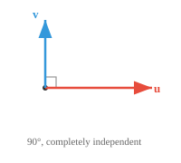

# 向量的性质

> **一句话总结**: 向量的模长、方向、单位化、正交与线性无关等性质, 共同构成一切机器学习 (Machine Learning, ML) 特征空间的几何语言.

*向量的性质描述了决定向量行为的几何与代数特征。本节涵盖模长、方向、单位向量、相等、平行、正交与线性无关——这些是每个 ML 特征空间的基本构件。*

- 向量的**模长 (magnitude)** （或长度）告诉你它伸得*有多远*。把它想象成箭头的长度。对于向量 $\mathbf{a} = (a_1, a_2, a_3)$, 它的模长是：

$$\|\mathbf{a}\| = \sqrt{a_1^2 + a_2^2 + a_3^2}$$

- 这其实就是勾股定理往高维的推广, 度量的是从原点到那个点的直线距离。

- 向量的**方向 (direction)** 告诉你它*指向哪*; 想象一下从原点到该坐标点画一条直线就行。

- 当原点没有明确指定时, 我们通常默认是 (0,0,...0), 也就是中心点, 至少在可视化时是这样。

- 位置不重要, 关键始终是位移：向量 $(3, 2)$ 从原点画出, 和同样的 $(3, 2)$ 从另一个点画出, 依然相等。


- 两个向量可以长度相同但方向完全不同, 也可以方向一致但长度不同。


- 两个向量**相等**当且仅当它们对应的所有分量都相同; 同样的长度, 同样的方向, 一模一样的箭头。

$$\mathbf{a} = \mathbf{b} \iff a_i = b_i \text{ for all } i$$

- 两个向量**平行 (parallel)** 当且仅当其中一个是另一个的标量倍。它们沿同一条直线, 要么同向, 要么严格反向。

$$\mathbf{a} \parallel \mathbf{b} \iff \mathbf{a} = k\mathbf{b} \text{ for some scalar } k \neq 0$$


- 如果 $k > 0$, 它们同向。如果 $k < 0$, 它们反向。无论哪种情形, 它们都躺在过原点的同一条直线上。

- 直观地说, 平行向量带不来"新的"方向信息。一个不过是另一个被拉伸或翻转后的版本。

- 两个向量**正交 (orthogonal)** （垂直）, 意思是它们指向完全独立的方向。沿其中一个走, 在另一个上没有任何进展。



- 想象一下先往北走, 再往东走, 这就是正交方向, 你往北走再多, 也不会让你往东移动一分一毫。正交这个概念我们会反复遇到。

- 正交对 ML 至关重要：正交的特征携带完全独立的信息, 这对于表征来说是最理想的。

- 更一般地, 任意两个向量之间都有一个**夹角 (angle)** $\theta$, 范围从 $0°$ 到 $180°$。

- 这个夹角刻画了两个方向之间的全部关系：$0°$ 表示平行（同向）, $180°$ 表示平行（反向）, $90°$ 表示正交。介于两者之间的都是某种混合。

- ML 里大多数向量关系都落在这个谱系中的某处。之后我们会看到精确的工具（点积、余弦相似度）来计算这个夹角。

- 一组向量是**线性相关 (linearly dependent)** 的, 意思是至少有一个向量可以通过对其他向量做缩放和相加拼出来。它没有给这个集合带来任何新信息。

- 例如, 如果 $\mathbf{c} = 2\mathbf{a} + 3\mathbf{b}$, 那么 $\mathbf{c}$ 就是冗余的, 通过 $\mathbf{a}$ 和 $\mathbf{b}$ 你已经拥有了 $\mathbf{c}$ 能提供的一切。

- 平行向量总是线性相关的, 因为一个不过是另一个的缩放副本。任何包含零向量的集合也都是线性相关的。

- 向量是**线性无关 (linearly independent)** 的, 意思是其中没有一个能由其他向量拼出来。每一个都贡献了一个真正新的方向。正交的向量总是线性无关的。

- 一点直觉：如果你想研究不同的人, 并把他们表示成向量, 线性相关的向量（人）会让观测偏向被过度采样的数据点, 这在为人工智能 (Artificial Intelligence, AI) 训练设计数据集时是个重要因素。

- 在 2D 中, 两个线性无关的向量可以到达平面上任意一点。在 3D 中, 你需要三个。这个"需要多少个线性无关的向量"的想法, 直接连到了维度这个概念。

- 一个向量是**稀疏 (sparse)** 的, 意思是它大部分分量都是零。反过来, 大部分分量都非零, 就叫**稠密 (dense)**。

$$\mathbf{s} = [0, 0, 3, 0, 0, 0, 1, 0, 0, 0]$$

- 稀疏性之所以重要, 是因为它同时影响存储和计算。稀疏向量只需追踪那些非零项, 就能被更高效地存储和处理。

- **单位向量 (unit vector)** 是模长恰好为 1 的向量。它纯粹表示一个方向, 不带任何长度信息。任意向量都可以通过除以自己的模长, 变成单位向量：

$$\hat{\mathbf{a}} = \frac{\mathbf{a}}{\|\mathbf{a}\|}$$

- 这个过程叫**归一化 (normalisation)**。它剥掉"有多远", 只保留"朝哪个方向", 这在机器学习中是一个重要因素。

- 标准单位向量沿着每个坐标轴指出去：$\hat{\mathbf{i}} = (1, 0, 0)$, $\hat{\mathbf{j}} = (0, 1, 0)$, $\hat{\mathbf{k}} = (0, 0, 1)$。任何向量都可以写成它们的组合, 例如 $(3, 2, 4) = 3\hat{\mathbf{i}} + 2\hat{\mathbf{j}} + 4\hat{\mathbf{k}}$。

## 编程任务 (用 CoLab 或 notebook)

1. 计算一个向量的模长, 验证它与勾股定理吻合, 然后改写为计算单位向量。
```python
import jax.numpy as jnp

a = jnp.array([3.0, 4.0])

magnitude = jnp.sqrt(jnp.sum(a ** 2))
print(f"Magnitude of a: {magnitude}") 
```

2. 通过测试一个向量是否是另一个的标量倍, 检查两个向量是否平行。
```python
import jax.numpy as jnp

a = jnp.array([2, 4, 6])
b = jnp.array([1, 2, 3])

ratios = a / b
print(f"Ratios: {ratios}")
print(f"Parallel: {jnp.allclose(ratios, ratios[0])}")
```

---

## 📌 本节要点

- **模长**: 向量的长度, 由勾股定理向高维推广, $\|\mathbf{a}\| = \sqrt{\sum_i a_i^2}$, 度量原点到目标点的直线距离.
- **方向与相等**: 向量只关心位移不关心位置, 两向量相等当且仅当所有对应分量一致.
- **平行与正交**: 平行意味着一个是另一个的非零标量倍, 不带新方向信息; 正交夹角为 $90°$, 携带完全独立的信息, 是 ML 特征设计的理想状态.
- **线性无关**: 一组向量线性无关当且仅当没有一个可由其他线性组合得到, 每一个都贡献新方向, 直接对应"维度"的直觉.
- **单位向量与归一化**: 单位向量模长为 1, 由 $\hat{\mathbf{a}} = \mathbf{a}/\|\mathbf{a}\|$ 得到, 剥掉长度只留方向; 稀疏向量只需存非零项, 显著节省存储与计算.
