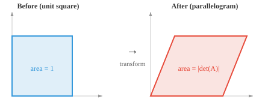

# 矩阵的性质

> **一句话总结**: 矩阵是存储数据、编码变换、支撑每一层神经网络的核心结构; 本节把维度、转置、迹、秩、行列式、逆、条件数、范数与正定性一次讲透。

## 🗺️ 本章导览

- 本章覆盖矩阵的一切: 性质 → 类型 → 运算 → 线性变换 → 分解
- **01. 矩阵的性质** (本节): 定义、维度、元素、转置、迹、秩、行列式、逆、条件数、范数、正定
- **02. 矩阵类型**: 方阵、对角、三角、对称、正交等
- **03. 矩阵运算**: 加减、乘法、逆、行列式的实际计算
- **04. 线性变换**: 矩阵作为向量空间之间的映射
- **05. 矩阵分解**: LU、QR、奇异值分解 (Singular Value Decomposition, SVD)、特征分解

*矩阵是承载数据集、编码变换、定义每一层神经网络的数据结构。本节讲的是矩阵的维度、元素、转置、迹、行列式、逆、秩、零空间——这些贯穿整个线性代数与机器学习的基础性质。*

- 说到底, **矩阵 (matrix)** 就是一格一格排成行与列的数字网格。如果说向量是一列数字, 那矩阵就是一摞向量堆起来的样子。

```math
A = \begin{bmatrix} 1 & 2 & 3 \\ 4 & 5 & 6 \end{bmatrix}
```

- 如果一个人用向量 $[\text{age}, \text{height}, \text{weight}]$ 描述, 那么三个人就构成一个矩阵, 每一行代表一个人:

```math
\begin{bmatrix} 25 & 170 & 65 \\ 30 & 180 & 80 \\ 22 & 160 & 55 \end{bmatrix}
```

- 这个矩阵有 3 行 3 列, 所以我们称它为 $3 \times 3$ 矩阵。

- 网格中的每个数字叫做**元素 (element)** 或**元 (entry)**, 由所在的行号和列号定位: $A_{ij}$ 表示第 $i$ 行、第 $j$ 列的元素。

- 矩阵的**转置 (transpose)** 就是沿着对角线把矩阵翻一下, 行变列、列变行。如果 $A$ 是 $m \times n$, 那么 $A^T$ 就是 $n \times m$。

```math
A = \begin{bmatrix} 1 & 2 & 3 \\ 4 & 5 & 6 \end{bmatrix} \quad \Rightarrow \quad A^T = \begin{bmatrix} 1 & 4 \\ 2 & 5 \\ 3 & 6 \end{bmatrix}
```

- 一个矩阵乘上它自己的转置, 总能得到方阵: $AA^T$ 是 $m \times m$, $A^TA$ 是 $n \times n$。

- 方阵的**迹 (trace)** 是对角元素之和: $\text{tr}(A) = A_{11} + A_{22} + \cdots + A_{nn}$。迹等于所有特征值之和 (后面会讲)。


- **注意**: 迹只对方阵有定义。上面例子中的 $2 \times 3$ 矩阵不是方阵, 因此没有迹。以下面这个 $3 \times 3$ 方阵为例:

```math
B = \begin{bmatrix} 1 & 2 & 3 \\ 4 & 5 & 6 \\ 7 & 8 & 9 \end{bmatrix}
```

其迹为 $\text{tr}(B) = B_{11} + B_{22} + B_{33} = 1 + 5 + 9 = 15$。只有高亮的对角线元素才参与计算 (据线性代数标准定义, e.g. Strang, *Introduction to Linear Algebra*, 5th ed., §7.2)。

- **行/列向量约定**: 本节采用"每一行代表一个样本、每一列代表一个特征"的机器学习惯例 (与 scikit-learn、pandas DataFrame 一致)。在部分数学与物理文献中会反过来 (每列一个样本), 阅读时需先确认约定 (据 scikit-learn 官方文档 2024)。

- 如果两个矩阵在不同的基下表示同一个线性变换, 那它们的迹一定相同。迹是"与基无关"的量。

- 矩阵的**秩 (rank)** 是它线性无关的行 (或者等价地, 列) 的数量。它告诉你这个矩阵携带了多少"有效信息"。

- 举个例子, 下面这个矩阵的秩是 2, 因为两行谁都不是对方的倍数:

```math
\begin{bmatrix} 1 & 2 \\ 3 & 4 \end{bmatrix}
```

而下面这个矩阵秩是 1, 因为第二行不过是第一行的 2 倍, 没有带来任何新信息:

```math
\begin{bmatrix} 1 & 2 \\ 2 & 4 \end{bmatrix}
```

- 一个 $5 \times 3$ 矩阵的秩最多是 3。如果其中有些行只是别人的缩放或组合, 秩就会下降。秩达到最大可能值的矩阵, 叫做**满秩 (full rank)**。


- 一个方阵可逆 (即存在逆矩阵) 当且仅当它是满秩的。

- 秩与**零空间 (null space)** (即被矩阵映射到零向量的输入集合) 之间, 由**秩–零度定理 (rank-nullity theorem)** 联系起来: $\text{rank}(A) + \text{nullity}(A) = \text{number of columns of } A$。矩阵保留下来的 (秩) 加上它抹掉的 (零度), 就等于总维度。

- 矩阵的**列空间 (column space)** 是用任意向量乘上这个矩阵后, 所有可能输出构成的集合。它由矩阵的各列张成。如果一个矩阵有 3 列但只有 2 列线性无关, 那它的列空间就是一个二维平面, 而不是整个三维空间。


- **行空间 (row space)** 也是同样的思路, 只不过是从行的角度看。秩既等于列空间的维度, 也等于行空间的维度, 两者永远一致。

- 合在一起看: 列空间告诉你"这个矩阵能产生哪些输出?", 零空间告诉你"哪些输入会被映射到零?"。这两个空间, 就完全刻画了矩阵在做什么。

- 方阵的**行列式 (determinant)** 是一个单一的数值, 它捕捉的是矩阵对空间的缩放程度。把一个 $2 \times 2$ 矩阵想象成把单位正方形变换成一个平行四边形——行列式就是这个平行四边形的面积 (带符号)。

```math
\det\begin{bmatrix} a & b \\ c & d \end{bmatrix} = ad - bc
```



- 例如:

```math
\det\begin{bmatrix} 2 & 1 \\ 0 & 3 \end{bmatrix} = 2 \cdot 3 - 1 \cdot 0 = 6
```

这个变换把单位正方形拉伸成了一个面积为 6 的平行四边形。

- 如果行列式为正, 变换保持定向 (东西不会被"翻过来"); 如果为负, 就翻转了定向 (像照镜子); 如果为零, 说明矩阵把空间挤压到了更低的维度, 把平行四边形压成一条线甚至一个点。

- 行列式为零的矩阵叫做**奇异矩阵 (singular)**。它没有逆矩阵, 并且永久性地丢失了信息。

- 对于比 $2 \times 2$ 更大的矩阵, 行列式要用**子式 (minor)** 和**余子式 (cofactor)** 来计算。**子式** $M_{ij}$ 就是把第 $i$ 行和第 $j$ 列划掉之后, 剩下那个小矩阵的行列式。


- **余子式** $C_{ij} = (-1)^{i+j} M_{ij}$ 给每个子式附上一个符号 (像棋盘一样交替: $+, -, +, \ldots$)。整个矩阵的行列式就是沿着某一行或某一列做求和: $\det(A) = \sum_j A_{1j} \cdot C_{1j}$。这个方法叫**余子式展开 (cofactor expansion)**。

- 方阵 $A$ 的**逆 (inverse)**, 记作 $A^{-1}$, 就是能把 $A$ 干的事"撤销"回去的那个矩阵: $AA^{-1} = A^{-1}A = I$ ($I$ 是单位矩阵)。只有非奇异矩阵才有逆。

- 对于 $2 \times 2$ 矩阵, 逆有一个直接公式:

```math
\begin{bmatrix} a & b \\ c & d \end{bmatrix}^{-1} = \frac{1}{ad - bc}\begin{bmatrix} d & -b \\ -c & a \end{bmatrix}
```

注意分母上就是行列式——这正解释了为什么奇异矩阵 (行列式为零) 没有逆。

- **条件数 (condition number)** 衡量的是一个矩阵对输入微小变化有多敏感, 定义为 $\kappa(A) = \|A\| \cdot \|A^{-1}\|$。

- 条件数接近 1 的矩阵叫做**良态 (well-conditioned)**: 输入变一点点, 输出也只变一点点。条件数很大的矩阵则是**病态 (ill-conditioned)**: 微小误差会被放大到天上去。正交矩阵和单位矩阵的条件数是 1, 而奇异矩阵的条件数是无穷大。

- 举个例子, 下面这个矩阵的条件数是 $10^8$。它一个方向被正常缩放, 另一个方向几乎被压到零, 所以沿那个方向的小扰动会被剧烈扭曲:

```math
\begin{bmatrix} 1 & 0 \\ 0 & 10^{-8} \end{bmatrix}
```

- 就像向量有范数 (长度) 一样, 矩阵也有**范数 (norm)** 来度量它的"大小"。最常见的是 **Frobenius 范数**, 它把矩阵当作一条长向量, 直接算长度:

```math
\|A\|_F = \sqrt{\sum_{i}\sum_{j} A_{ij}^2}
```

- 例如:

```math
\left\|\begin{bmatrix} 1 & 2 \\ 3 & 4 \end{bmatrix}\right\|_F = \sqrt{1 + 4 + 9 + 16} = \sqrt{30} \approx 5.48
```

- **谱范数 (spectral norm)** $\|A\|_2$ 是 $A$ 的最大奇异值。它衡量的是矩阵能把任意一个单位向量拉伸的最大幅度。在机器学习里, 矩阵范数被用来做权重正则化 (惩罚过大的权重) 和监控训练稳定性。

- 一个对称矩阵 $A$ 是**正定的 (positive definite)**, 如果对任意非零向量 $\mathbf{x}$: $\mathbf{x}^T A \mathbf{x} > 0$。这种二次型总是给出正数。

- 例如, 下面这个矩阵是正定的:

```math
A = \begin{bmatrix} 2 & 1 \\ 1 & 3 \end{bmatrix}
```

随便挑一个向量, 比如 $\mathbf{x} = [1, -1]^T$: $\mathbf{x}^T A \mathbf{x} = 2 - 1 - 1 + 3 = 3 > 0$。不管你选哪个非零 $\mathbf{x}$, 结果永远是正的。

- 正定矩阵之所以重要, 是因为它们保证优化问题有唯一的最小值。

- 如果把条件放宽到 $\mathbf{x}^T A \mathbf{x} \geq 0$ (允许取零), 这个矩阵就叫**半正定 (positive semi-definite, PSD)**。PSD 矩阵到处都是: 协方差矩阵、支持向量机 (Support Vector Machine, SVM) 里的核矩阵、局部极小点处的海森矩阵, 都是 PSD 的。它和严格正定的区别在于, PSD 允许某些方向是"平的" (曲率为零), 而不是严格向上弯曲。

## Coding Tasks (use CoLab or notebook)

1. 计算一个矩阵的迹、秩和行列式。试着把某一行变成另一行的倍数, 看看秩和行列式怎么变。
```python
import jax.numpy as jnp

A = jnp.array([[1.0, 2.0],
               [3.0, 4.0]])

print(f"Trace: {jnp.trace(A)}")
print(f"Rank: {jnp.linalg.matrix_rank(A)}")
print(f"Determinant: {jnp.linalg.det(A):.2f}")
```

2. 计算矩阵的逆, 把它和原矩阵相乘, 验证结果是单位矩阵。然后再试一个奇异矩阵, 观察一下会发生什么。
```python
import jax.numpy as jnp

A = jnp.array([[1.0, 2.0],
               [3.0, 4.0]])

A_inv = jnp.linalg.inv(A)
print(f"A * A_inv:\n{A @ A_inv}")
```

---

## 📌 本节要点

- **矩阵**: 行列排布的数字网格; 一行代表一个样本, 一列代表一个特征。
- **转置**: 沿对角线翻转, $A^T$ 把 $m \times n$ 变成 $n \times m$; $AA^T$ 与 $A^TA$ 都是方阵。
- **迹**: 对角元素之和, 等于所有特征值之和, 与基的选择无关。
- **秩**: 线性无关的行 (或列) 数量, 衡量矩阵携带的信息量; 满秩才可逆。
- **秩–零度定理**: 秩加零度等于列数, 表达"保留的信息 + 抹掉的信息 = 总维度"。
- **列空间与行空间**: 前者由列张成 (可能输出集合), 后者由行张成, 两者维度都等于秩。
- **行列式**: 面积/体积缩放因子, 正保持定向、负翻转、零则压维退化。
- **奇异矩阵**: 行列式为零, 无逆, 信息永久丢失。
- **条件数**: $\kappa(A) = \|A\| \cdot \|A^{-1}\|$, 越接近 1 越良态, 越大越病态、误差被放大。
- **正定与半正定**: 二次型 $\mathbf{x}^T A \mathbf{x}$ 恒正 (或非负); 保证优化问题有唯一极小; 协方差、核矩阵、局部极小处的海森都是 PSD。
