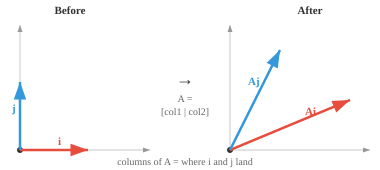
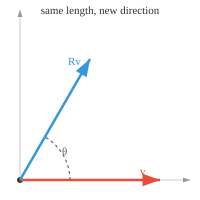
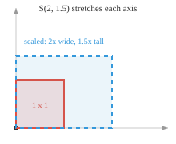
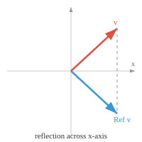
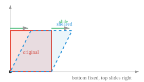

# 线性变换

> **一句话总结**：每次矩阵乘法本质上都是一次线性变换，它在保持线性的前提下对向量进行旋转、缩放、反射、错切或投影，是神经网络逐层堆叠计算的基础。

*每一次矩阵乘法都是一次线性变换，一个在保持线性的同时对向量进行重塑、旋转或投影的函数。本节涵盖旋转、反射、缩放、错切、投影，一个映射的核与像，以及神经网络各层如何把这些变换串起来。*

- **线性变换** (linear transformation，或叫线性映射) 是一个函数：它把一个向量映到另一个向量，并且保持加法与标量缩放。若 $T$ 是线性的，则：

    - $T(\mathbf{u} + \mathbf{v}) = T(\mathbf{u}) + T(\mathbf{v})$
    - $T(c\mathbf{u}) = cT(\mathbf{u})$

- 每一个线性变换都可以表示成矩阵乘法。矩阵**就是**变换本身。当你用一个矩阵去乘一个向量，你就是在对它施加一次线性变换。

- 把一个 $2 \times 2$ 矩阵想象成一台机器：吃进去 2D 向量，吐出来新的 2D 向量。矩阵的两列告诉你，标准基向量 $\hat{\mathbf{i}}$ 与 $\hat{\mathbf{j}}$ 变换后落在哪里。剩下的一切都由线性性质自动决定。



- 举个例子，若

$$
A = \begin{bmatrix} 2 & 1 \\ 1 & 2 \end{bmatrix}
$$

  那么 $\hat{\mathbf{i}} = [1, 0]^T$ 落到 $[2, 1]^T$ (第一列)，$\hat{\mathbf{j}} = [0, 1]^T$ 落到 $[1, 2]^T$ (第二列)。任何其他向量都是这两个基向量的组合，所以它们变换后的位置也就自动确定了。

- 两个矩阵相乘可以看成"一个变换接一个变换地施加"。若 $B$ 先把向量从某个空间变换过来，$A$ 再把结果继续变换，那么 $AB$ 就是把这两步串起来做。在游戏引擎里，"先旋转角色再向前移动"和"先移动再旋转"结果不一样，这正是为什么矩阵乘法不满足交换律。

- **旋转** (rotation) 把向量按角度 $\theta$ 转动，长度不变。向量大小没变，只是指向了新的方向。



- 在 2D 中，旋转矩阵为：

$$
R(\theta) = \begin{bmatrix} \cos\theta & -\sin\theta \\ \sin\theta & \cos\theta \end{bmatrix}
$$

- 当 $\theta = 90°$ 时：

$$
R = \begin{bmatrix} 0 & -1 \\ 1 & 0 \end{bmatrix}
$$

  所以 $[1, 0]^T$ 变成了 $[0, 1]^T$。原本指向右侧的向量现在指向上方。旋转矩阵是正交矩阵，行列式恒为 1。当你在手机上旋转一张照片时，每一个像素坐标都被套用了这个矩阵。

- 在 3D 中，每个坐标轴各自有一个旋转矩阵。机械臂的每个关节都绕特定的轴旋转，每个关节就对应一个旋转矩阵。绕 z 轴的旋转看起来像是 2D 情形嵌到了 3D 里：

$$
R_z(\theta) = \begin{bmatrix} \cos\theta & -\sin\theta & 0 \\ \sin\theta & \cos\theta & 0 \\ 0 & 0 & 1 \end{bmatrix}
$$

- **缩放** (scaling) 沿每个坐标轴独立地拉伸或压缩向量：

$$
S(s_x, s_y) = \begin{bmatrix} s_x & 0 \\ 0 & s_y \end{bmatrix}
$$



- $S(2, 1.5)$ 会把 x 分量翻倍，把 y 分量乘 1.5。沿某轴用 $-1$ 缩放就会翻转该分量。对角矩阵永远是一次缩放变换。当你把一张图缩到 50% 大小时，你就是在对每个像素坐标套用 $S(0.5, 0.5)$。

- **反射** (reflection) 把向量沿一条轴或直线翻转，就像照镜子。沿 x 轴反射会保留 x 分量、反转 y 分量：

$$
\text{Ref}_x = \begin{bmatrix} 1 & 0 \\ 0 & -1 \end{bmatrix}
$$



- 举例来说，$[3, 2]^T$ 变成了 $[3, -2]^T$。当你的手机把自拍水平翻转让文字能正着读，它套用的就是一个反射矩阵。沿直线 $y = x$ 反射则会交换两个分量：

$$
\text{Ref}_{y=x} = \begin{bmatrix} 0 & 1 \\ 1 & 0 \end{bmatrix}
$$

- 反射矩阵的行列式为 $-1$，这也印证了它会翻转朝向。

- 旋转和反射都属于 **刚体变换** (rigid transformation)：它们保距离、保角度。表示它们的矩阵是正交矩阵，这也就是为什么正交矩阵的行列式总是 $+1$ (旋转) 或 $-1$ (反射)。

- **错切** (shearing) 把向量沿某个轴按另一个轴的比例斜推。水平错切、错切因子为 $k$：

$$
\text{Sh}_x(k) = \begin{bmatrix} 1 & k \\ 0 & 1 \end{bmatrix}
$$



- 每一个点沿水平方向移动的距离等于 $k$ 乘以它的高度。当 $k = 0.5$ 时，高度为 2 的点会向右滑 1。底部不动，顶部滑走。斜体字就是这么来的：把正立的字母做一次错切，让它们向右倾斜。

- 上面这些 (旋转、缩放、反射、错切) 都是 **线性** 变换。它们保持原点不动，也保持直线仍为直线。那 **平移** (把所有东西整体挪一段) 呢？

- 平移**不是**线性变换，因为它挪动了原点。若你把每个点都向右平移 3 个单位，零向量就会跑到 $[3, 0]^T$，线性性质就破了。为了处理平移，我们引入 **仿射变换** (affine transformation)，它把线性变换与平移合起来：

$$\mathbf{y} = A\mathbf{x} + \mathbf{t}$$

- 为了把它写成单次矩阵乘法，我们用 **齐次坐标** (homogeneous coordinates)：给每个向量末尾补一个 1，然后用一个 $(n+1) \times (n+1)$ 的矩阵：

$$
\begin{bmatrix} A & \mathbf{t} \\ \mathbf{0}^T & 1 \end{bmatrix} \begin{bmatrix} \mathbf{x} \\ 1 \end{bmatrix} = \begin{bmatrix} A\mathbf{x} + \mathbf{t} \\ 1 \end{bmatrix}
$$

- 仿射变换保持直线与平行关系，但不一定保持角度或长度。电子游戏里的每一个物体都是靠仿射变换摆放位置的：先旋转、再缩放、再放到正确的位置，全部编码到一个矩阵里。

- **退化变换** (degenerate transformation，奇异矩阵) 会把整个空间压塌到更低的维度。

- 例如矩阵

$$
\begin{bmatrix} 1 & 2 \\ 2 & 4 \end{bmatrix}
$$

  会把每一个 2D 向量都映射到同一条直线上，因为它的两列指向同一个方向。行列式为零，信息丢失了，这个变换也没法逆过来。

- 把一张彩色图 (每像素 3 个值：红、绿、蓝) 转成灰度 (每像素 1 个值) 就是一次退化变换：颜色信息永久丢失。

- 在机器学习 (Machine Learning, ML) 里，线性变换是神经网络的核心：数据被表示成一个矩阵 (由一堆向量堆叠而成，每个向量代表一个对象的特征，人、飞机、文本、图像……什么都行！)。

- 每一层都施加一次矩阵乘法 (线性变换)，细节会在其他章节展开。这里我们只需先把数据结构讲清楚，为神经网络铺好动机。

- 有意思的是，今天最主流的技术几乎完全依赖把数据穿过一连串线性变换，我们把这样的模型叫做 **Transformer**。

- Gemini、ChatGPT、Claude、Qwen、DeepSeek，以及当今世界上表现最好的 AI，都是 Transformer！

## 编程任务 (用 CoLab 或 notebook)

1. 对一个向量施加旋转矩阵，把原始向量和旋转后的向量一起画出来。多试几个角度。
```python
import jax.numpy as jnp
import matplotlib.pyplot as plt

theta = jnp.pi / 3
R = jnp.array([[jnp.cos(theta), -jnp.sin(theta)],
               [jnp.sin(theta),  jnp.cos(theta)]])

v = jnp.array([1.0, 0.0])
v_rot = R @ v

plt.figure(figsize=(5, 5))
plt.quiver(0, 0, v[0], v[1], angles='xy', scale_units='xy', scale=1, color='red', label='original')
plt.quiver(0, 0, v_rot[0], v_rot[1], angles='xy', scale_units='xy', scale=1, color='blue', label='rotated')
plt.xlim(-1.5, 1.5); plt.ylim(-1.5, 1.5)
plt.grid(True); plt.legend(); plt.gca().set_aspect('equal')
plt.show()
```

2. 对组成一个正方形的一组点施加错切变换，把变形后的形状画出来。
```python
import jax.numpy as jnp
import matplotlib.pyplot as plt

square = jnp.array([[0,0],[1,0],[1,1],[0,1],[0,0]]).T

k = 0.5
shear = jnp.array([[1, k],
                    [0, 1]])
sheared = shear @ square

plt.figure(figsize=(6, 4))
plt.plot(square[0], square[1], 'r-o', label='original')
plt.plot(sheared[0], sheared[1], 'b-o', label='sheared')
plt.grid(True); plt.legend(); plt.gca().set_aspect('equal')
plt.show()
```

---

## 📌 本节要点

- **线性变换**：保持向量加法与标量缩放的函数，等价于矩阵乘法。
- **列的几何意义**: $n \times n$ 矩阵的列就是标准基向量变换后落到的位置。
- **矩阵乘法不交换**：变换的先后顺序会改变最终结果，如"先旋转再平移"不同于"先平移再旋转"。
- **旋转**：由正交矩阵表示，行列式为 $+1$，保长度保角度。
- **缩放与反射**：对角矩阵即缩放；反射行列式为 $-1$，会翻转朝向。
- **错切**：沿一轴按另一轴比例斜推，斜体字就是水平错切的产物。
- **平移不是线性的**：它会挪动原点，必须用仿射变换 + 齐次坐标才能写成单次矩阵乘法。
- **仿射变换**：线性变换加平移，保持直线与平行关系，是游戏引擎中物体定位的通用工具。
- **退化变换**：奇异矩阵会把空间压到更低维度，行列式为 0，信息不可恢复 (如彩色转灰度)。
- **神经网络与 Transformer**：每层都是一次矩阵乘法，Transformer 正是靠一连串线性变换驱动今天所有顶尖大模型。