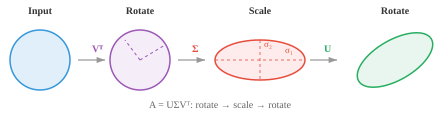

# 矩阵分解

> **一句话总结**: 矩阵分解把复杂矩阵拆成简单因子, 用于解线性方程组、稳定求逆、压缩数据; 高斯消元、LU、QR、Cholesky、特征分解、SVD 是撑起 PCA、推荐系统与数值稳定性的一整套引擎.

*矩阵分解把复杂矩阵拆成更简单的因子, 用来解方程组、计算逆矩阵、压缩数据. 本节覆盖高斯消元、LU 分解、QR 分解、Cholesky 分解、特征分解与奇异值分解 (Singular Value Decomposition, SVD), 这些正是主成分分析 (Principal Component Analysis, PCA)、推荐系统以及机器学习中数值稳定性的算法根基.*

- 一次矩阵分解 (matrix decomposition, 又叫 factorisation) 就是把一个矩阵拆成几块更容易处理的因子. 想象一下给整数做因式分解: $12 = 3 \times 4$ 比单独一个 12 好推理得多.

- 我们分解矩阵, 是为了更快地解方程组、稳定地算逆、找特征值、压缩数据, 以及理解变换背后的几何.

- 最基础的手法是**高斯消元** (Gaussian elimination, 又叫行简化). 思路很简单: 给定线性方程组 $A\mathbf{x} = \mathbf{b}$, 用三种被允许的行运算把 $A$ 化简, 直到答案一目了然.

- 这三种运算是: 交换两行、用非零标量乘某一行、把某一行的倍数加到另一行上.

- 举个例子, 要把下面这个矩阵第一列在主元下方的元素消掉, 就把第一行的倍数从下面几行减掉:

```math
\begin{bmatrix} 2 & 1 & 5 \\ 4 & 3 & 7 \\ 6 & 5 & 9 \end{bmatrix} \xrightarrow{R_2 - 2R_1} \begin{bmatrix} 2 & 1 & 5 \\ 0 & 1 & -3 \\ 6 & 5 & 9 \end{bmatrix} \xrightarrow{R_3 - 3R_1} \begin{bmatrix} 2 & 1 & 5 \\ 0 & 1 & -3 \\ 0 & 2 & -6 \end{bmatrix}
```

- 目标形式叫**行阶梯形** (Row Echelon Form, REF): 每个主元 (每行第一个非零元素) 下方都是零, 且每行的主元位于上一行主元的右侧. 整个矩阵看起来像一层层台阶.


- 再进一步就是**简化行阶梯形** (Reduced Row Echelon Form, RREF): 每个主元都等于 1, 而且是它所在那一列里唯一的非零元素. 每个矩阵都有唯一的 RREF.

- 一旦化到三角形, 就可以**回代** (back substitution) 求解: 最后一行直接给出最后一个变量, 然后一路往上代.

- 这是所有其他分解方法的地基. 所有分解的共同目标, 都是把矩阵化成三角形, 好让我们能回代解出变量.

- **LU 分解** (LU decomposition) 把高斯消元形式化, 将一个方阵分解为 $A = LU$ (若涉及行交换则写作 $A = PLU$), 其中 $L$ 是下三角矩阵, $U$ 是上三角矩阵.


- 解 $A\mathbf{x} = \mathbf{b}$ 的流程: 先用前代法 (从上往下) 解 $L\mathbf{y} = \mathbf{b}$, 再用回代法 (从下往上) 解 $U\mathbf{x} = \mathbf{y}$. 两个简单的三角求解替代一次困难的一般求解.

- LU 相比原始高斯消元的优势在于**复用**. 一旦拿到 $L$ 和 $U$, 就能对许多不同的 $\mathbf{b}$ 反复求解, 不用重新分解.

- 如果要用同一个系统解 1000 个不同的右端向量 (仿真里很常见), 只需分解一次, 然后复用.

- 当矩阵是对称正定的 (比如协方差矩阵), 我们能做得更好.

- **Cholesky 分解** (Cholesky decomposition) 把它写成 $A = LL^T$, 其中 $L$ 是下三角矩阵. 例如:

```math
\begin{bmatrix} 4 & 2 \\ 2 & 5 \end{bmatrix} = \begin{bmatrix} 2 & 0 \\ 1 & 2 \end{bmatrix} \begin{bmatrix} 2 & 1 \\ 0 & 2 \end{bmatrix}
```

- 它大约比 LU 快一倍, 而且数值上一定稳定. 把它想成矩阵的"平方根".

- 如果分解过程中失败 (在开根号时出现负数), 那说明矩阵不是正定的. 因此 Cholesky 同时也是一个正定性检测器.

- 一个方阵 $A$ 的**特征向量** (eigenvector) 是那些特殊的方向: 变换只把它们拉长或压缩, 不做旋转. **特征值** (eigenvalue) 就是那个缩放因子:

$$A\mathbf{x} = \lambda\mathbf{x}$$


- 大多数向量被矩阵一乘方向就变了. 但特征向量很特别: 输出与输入指向同一方向, 只是被 $\lambda$ 倍缩放. $\lambda = 2$ 就把特征向量拉长一倍; $\lambda = -1$ 就翻转方向; $\lambda = 0$ 就压扁到原点.

- 举例来说, 对于:

```math
A = \begin{bmatrix} 3 & 1 \\ 0 & 2 \end{bmatrix}
```

  向量 $[1, 0]^T$ 就是一个特征向量, 对应 $\lambda = 3$, 因为 $A[1, 0]^T = [3, 0]^T = 3[1, 0]^T$.

- 要找特征值, 需要求解**特征多项式** (characteristic polynomial) $\det(A - \lambda I) = 0$. 它的根就是特征值. 然后把每个 $\lambda$ 代回 $(A - \lambda I)\mathbf{x} = \mathbf{0}$, 就能解出对应的特征向量.

- 几条关键性质:

    - $A$ 的迹等于其所有特征值之和.
    - $A$ 的行列式等于其所有特征值之积.
    - 对称矩阵的特征向量两两正交, 特征值都是实数.
    - 正定矩阵的特征值全部为正.
    - 协方差矩阵 (统计学中会遇到) 一定是半正定的.

- 用特征多项式算特征值, 对大矩阵不现实. 实际用的是迭代法:

    - **幂迭代** (power iteration): 反复用 $A$ 乘再归一化. 会收敛到主特征向量 (对应最大特征值). 简单, 但一次只能找一对特征值和特征向量.

    - **QR 算法** (QR algorithm): 主力方法. 反复用 QR 分解拆开再合上, 直到矩阵收敛为三角形, 对角线上就是所有特征值.

    - **反迭代** (inverse iteration): 找离给定目标值最近的那个特征向量. 已知大概想要哪个特征值时很好用.

    - 对大型稀疏矩阵, **Arnoldi** 迭代与 **Lanczos** 迭代能利用稀疏性提升效率.

- 如果一个方阵拥有一组线性无关的完整特征向量, 它就可以被**对角化** (diagonalised): $A = PDP^{-1}$, 其中 $D$ 是由特征值构成的对角矩阵, $P$ 的列就是特征向量.

- 有什么用? 对角矩阵操作起来轻而易举. 要算 $A^{100}$? 不必把 $A$ 自乘 100 次, 直接算 $PD^{100}P^{-1}$ 就行, 而对角矩阵的幂只需把每个对角元素独立乘方. 这就把昂贵的运算变成了廉价的.

- **特征基** (eigenbasis) 就是一组全由特征向量构成的基. 在这个基下, 矩阵变成对角形, 变换就是沿每个特征向量方向的独立缩放. 相当于为这个变换找到了它的自然坐标系.

- **QR 分解** (QR decomposition) 把任意矩阵 $A$ 分解为 $A = QR$, 其中 $Q$ 是正交矩阵 (列向量两两单位正交), $R$ 是上三角矩阵. 把它想成: 把"方向"信息 ($Q$) 与"缩放和混合"信息 ($R$) 分开.

- **Gram-Schmidt 过程** (Gram-Schmidt process) 逐列构造 $Q$. 取 $A$ 的第一列, 归一化. 取第二列, 减去它在第一列上的投影 (让它们正交), 再归一化. 每一列都这样处理. 结果就是一组单位正交向量.

- QR 分解是特征值 QR 算法背后的引擎. 它也可以直接用来解**最小二乘问题**: 当 $A\mathbf{x} = \mathbf{b}$ 无精确解时 (方程比未知数多), QR 能找到最佳的近似解.

- **奇异值分解 (Singular Value Decomposition, SVD)** 是最通用、也可以说最重要的一种分解. 每个矩阵 (任意形状、任意秩) 都有 SVD: $A = U\Sigma V^T$

    - $V^T$ ($n \times n$, 正交): 旋转输入
    - $\Sigma$ ($m \times n$, 对角): 沿正交轴做缩放 (即奇异值, 非负, 从大到小排列)
    - $U$ ($m \times m$, 正交): 旋转输出



- 几何上, SVD 告诉我们: 无论多复杂的线性变换, 都不过是先转一下、沿各轴伸缩一下、再转一下. 一个圆最后变成一个椭圆.

- 奇异值 ($\sigma_1 \geq \sigma_2 \geq \ldots$) 揭示了每个方向的"重要性". 奇异值大的方向最关键. $A$ 的秩等于非零奇异值的个数.

- **低秩逼近** (low-rank approximation): 只保留最大的 $k$ 个奇异值, 其余置零, 就得到 $A$ 的最佳秩- $k$ 逼近. 图像压缩就靠这招: 一张 $1000 \times 1000$ 的图像也许只要 $k = 50$ 个奇异值就几乎看不出差别, 相当于压缩了 20 倍.

- SVD 还给出**伪逆** (pseudo-inverse): $A^+ = V\Sigma^+U^T$, 其中 $\Sigma^+$ 是把非零奇异值取倒数.

- 特征分解只对方阵管用, 而 SVD 对任何矩阵都能做. 这是它的关键优势.

- **主成分分析 (Principal Component Analysis, PCA)** 利用特征分解 (或 SVD) 做降维.

- 想象一个数据集, 每个样本有 100 个特征 (100 维向量堆成矩阵). 这些特征里很多是相关的、冗余的.

- PCA 找到数据实际变化最大的方向, 让你只保留有用的部分.


- 第一主成分 (PC1) 是方差最大的方向.

- 第二主成分 (PC2) 抓住剩余方差里最大的那部分, 并且和 PC1 正交.

- 如果大部分方差都集中在少数几个方向上, 就可以把数据投影到这些方向, 丢掉其他方向, 损失几乎可以忽略.

- 步骤如下:

    - 标准化数据 (减均值, 除以标准差), 让所有特征贡献均衡
    - 计算协方差矩阵
    - 求它的特征值和特征向量
    - 挑出特征值最大的 $k$ 个特征向量 (它们就是主成分)
    - 把数据投影到这些主成分上

- 标准化很关键: 不标准化的话, 用公里为单位测的特征会盖过用厘米为单位测的特征, 与真实重要性无关.

- 实际中, PCA 用于可视化 (把高维数据投到 2D 或 3D)、降噪 (丢弃低方差方向, 那里大多是噪声), 以及减少输入特征数量以加速机器学习模型.

- **核 PCA** (Kernel PCA) 把 PCA 推广到非线性关系. 它先用一个核函数把数据映射到更高维空间, 让结构在那里变成线性, 再做标准 PCA, 然后投影回来.

- **Schur 分解** (Schur decomposition) 把方阵分解为 $A = QTQ^\ast$, 其中 $Q$ 是酉矩阵, $T$ 是上三角矩阵. 每个方阵都有 Schur 分解, 即便它不可对角化也一样.

- **非负矩阵分解 (Non-negative Matrix Factorisation, NMF)** 把矩阵分解为两个非负矩阵之积: $A \approx WH$, 其中 $W$ 和 $H$ 的所有元素都 $\geq 0$. 与 SVD 可能产生负值不同, NMF 只做加法, 不做减法. 这让分解出来的成分可解释: 在主题建模里, $W$ 给出每篇文档的主题权重, $H$ 给出每个主题的词权重, 全部非负, 契合我们思考"每篇文档里含多少某主题"的方式.

- **谱定理** (spectral theorem) 说: 对称矩阵 (或 Hermitian 矩阵) 一定可以用一个正交矩阵 (或酉矩阵) 对角化. 它们的特征值总是实数, 特征向量总是正交的. 这就是 PCA 的理论基石.

## 编程任务 (在 Colab 或 notebook 中完成)

1. 计算一个对称矩阵的特征值与特征向量. 验证特征向量两两垂直, 并从特征分解重建这个矩阵.
```python
import jax.numpy as jnp

A = jnp.array([[4.0, 2.0],
               [2.0, 3.0]])

eigenvalues, eigenvectors = jnp.linalg.eigh(A)
print(f"Eigenvalues: {eigenvalues}")
print(f"Eigenvectors orthogonal: {jnp.dot(eigenvectors[:,0], eigenvectors[:,1]):.6f}")

# 重建: A = P D P^T
D = jnp.diag(eigenvalues)
A_reconstructed = eigenvectors @ D @ eigenvectors.T
print(f"Reconstruction matches: {jnp.allclose(A, A_reconstructed)}")
```

2. 实现幂迭代找最大特征值, 用反迭代找最小特征值. 与 `jnp.linalg.eigh` 比对. 然后自己动手实现一遍 QR 算法.
```python
import jax.numpy as jnp

A = jnp.array([[4.0, 2.0],
               [2.0, 3.0]])

# 幂迭代: 找最大 (LARGEST) 特征值
v = jnp.array([1.0, 0.0])
for _ in range(20):
    v = A @ v
    v = v / jnp.linalg.norm(v)
print(f"Largest eigenvalue:  {v @ A @ v:.4f}")

# 反迭代: 用 A^{-1} 而非 A 相乘, 找最小 (SMALLEST) 特征值
v = jnp.array([1.0, 0.0])
for _ in range(20):
    v = jnp.linalg.solve(A, v)
    v = v / jnp.linalg.norm(v)
print(f"Smallest eigenvalue: {1.0 / (v @ jnp.linalg.solve(A, v)):.4f}")

print(f"jnp.linalg.eigh:    {jnp.linalg.eigh(A)[0]}")
```

3. 对一个矩阵做 SVD, 再用前 k 个奇异值重建, 观察 k 变化时逼近质量的变化.
```python
import jax.numpy as jnp

A = jnp.array([[1.0, 2.0, 3.0],
               [4.0, 5.0, 6.0],
               [7.0, 8.0, 9.0]])

U, S, Vt = jnp.linalg.svd(A)

for k in [1, 2, 3]:
    approx = U[:, :k] @ jnp.diag(S[:k]) @ Vt[:k, :]
    error = jnp.linalg.norm(A - approx)
    print(f"k={k}, reconstruction error: {error:.4f}")
```

---

## 📌 本节要点

- **高斯消元**: 用行交换、行缩放、行相加三种运算, 把矩阵化到行阶梯形以求解方程组.
- **REF 与 RREF**: 分解的通用目标是三角形; RREF 是唯一的规范形式, 主元均为 1.
- **LU 分解**: 把方阵拆成下三角与上三角, 一次分解可复用于多组右端向量.
- **Cholesky 分解**: 对称正定矩阵的"平方根", 比 LU 快一倍, 且可当作正定性检验.
- **特征值与特征向量**: 变换下只被缩放不被旋转的方向, 由 $A\mathbf{x} = \lambda\mathbf{x}$ 定义.
- **对角化与特征基**: $A = PDP^{-1}$ 让 $A^n$ 的计算变得廉价; 在特征基下变换即独立缩放.
- **QR 分解**: 分离"方向"与"缩放", 支撑 QR 算法与最小二乘.
- **SVD**: 任意矩阵皆可写成"旋转-缩放-旋转", 是最通用的分解.
- **低秩逼近与 PCA**: 保留主要奇异值/主成分即可显著压缩数据或降维.
- **谱定理**: 对称矩阵必可正交对角化, 是 PCA 的理论支柱; NMF 与 Schur 分解则是补充工具.
