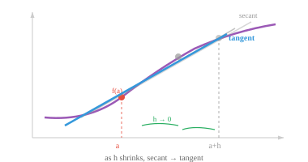

# 微分学

> **一句话总结**: 微分学捕捉"瞬时变化率", 用极限定义导数, 用几条求导法则 (尤其是链式法则) 撑起从数学到反向传播的整条通路.

## 🗺️ 本章导览

- 本章覆盖微积分的一切: 微分 → 积分 → 多元 → 逼近 → 优化
- **01. 微分学** (本节): 极限、导数、求导法则、链式法则 (反向传播的地基)
- **02. 积分学**: 定积分与不定积分
- **03. 多元微积分**: 偏导、梯度、Jacobian、Hessian
- **04. 函数逼近**: Taylor 级数、Fourier 分析
- **05. 优化**: 一阶与二阶方法、梯度下降与变体

*微分学捕捉的是瞬时变化率. 本节涵盖极限、导数、求导法则、链式法则 (反向传播的基石), 以及机器学习中反复出现的常见导数.*

- 前几章里, 我们学了怎么把数据表示成向量, 再用矩阵对它们做变换. 但现实世界里很多现象并不是静态的. 汽车会加速, 股价在波动, 神经网络的损失随着权重更新一直在变. **微积分** (calculus) 就是关于变化的数学.

- 微积分问两个问题: 某个东西此刻变化得多快 (微分学), 以及它随时间累积了多少 (积分学). 本节要处理的是"多快"这个问题.

- 想象一下, 你在开车, 瞄了一眼速度表, 上面写着 60 km/h. 这个数字不是你整趟旅程的平均速度, 而是你**此时此刻**的速度. 微分学给我们一整套工具, 用来计算这种瞬时变化率.

- 但先回到直线方程: $y = mx + b$.

- 这是两个量之间最简单的关系.

    - $b$ 是 **y 轴截距** (y-intercept), 也就是直线与 y 轴的交点 ($x = 0$ 时的起点值).
    - $m$ 是 **斜率** (slope), 也就是变化率: $x$ 每增加 1 个单位, $y$ 变化 $m$.
- 若 $m = 3$, 直线陡峭上升; 若 $m = 0$, 直线水平; 若 $m = -2$, 直线下降.

- 斜率的计算方式是 $m = \frac{\Delta y}{\Delta x} = \frac{y_2 - y_1}{x_2 - x_1}$, 也就是 "$y$ 变化了多少" 与 "$x$ 变化了多少" 之比.


- 一旦你知道 $m$ 和 $b$, 就能对任何 $x$ 算出 $y$.

- 举个例子, 若 $m = 2$, $b = 3$, 则 $x = 5$ 时: $y = 2(5) + 3 = 13$.

- 两个参数完全决定了这条直线, 预测任何输出无非就是代入公式.

- 对直线来说, 斜率处处相同.

- 这个想法可以推广到直线之外. 任何函数都是一条把输入映射到输出的规则, 只要你知道它的公式 (参数与形状), 就能对任意输入算出输出并画出图像.

- $y = x^2$ 给出一条抛物线, $y = \sin(x)$ 给出一条波形, $y = e^x$ 给出指数增长. 每个公式定义一条特定的曲线, 而"把函数当作形状去读"这种感觉, 对后面的一切都至关重要.

- 对直线来说, 斜率处处相同. 但大多数有趣的函数都是弯的, 所以斜率一处一处不一样. 微积分给了我们一种方法, 用来求曲线上任何一个单点处的斜率.

- 我们还需要**极限** (limit) 这个概念. 极限描述的是: 当函数的输入越来越接近某个目标值时, 函数的输出趋近于哪个数 (不一定真的取到).

$$\lim_{x \to a} f(x) = L$$

- 读作: "当 $x$ 趋近于 $a$ 时, $f(x)$ 趋近于 $L$". 函数**不需要**在 $x = a$ 处真的等于 $L$, 只需要能任意接近就行.

- 举个例子, 取 $f(x) = \frac{x^2 - 1}{x - 1}$. 直接代入 $x = 1$ 会得到 $\frac{0}{0}$, 未定义.

- 但试试接近 1 的值: $f(0.9) = 1.9$, $f(0.99) = 1.99$, $f(1.01) = 2.01$. 输出明显在朝 2 靠拢.

- 代数上也能看出原因: 把分子因式分解为 $(x-1)(x+1)$, 约掉 $(x-1)$, 就得到 $f(x) = x + 1$ (对所有 $x \neq 1$). 所以 $x \to 1$ 时, $f(x) \to 2$.

- 这个函数在 $x = 1$ 处有个洞, 但极限依然存在.

- 极限是微积分中一切其他东西的地基.

- 函数 $f(x)$ 在 $x = a$ 处的**导数** (derivative) 衡量的是**瞬时变化率**. 几何上, 它就是曲线在那一点处切线的斜率.


- 要算这个斜率, 我们先在曲线上取两个点, 求它们连线 (**割线**, secant line) 的斜率. 然后让第二个点一点点向第一个点靠近, 看割线的斜率趋近于什么值. 这就是**差商** (difference quotient):

$$f'(a) = \lim_{h \to 0} \frac{f(a + h) - f(a)}{h}$$



- 分子 $f(a+h) - f(a)$ 是输出的变化, 分母 $h$ 是输入的变化. 它们的比值就是一小段区间上的平均变化率. 当 $h \to 0$, 这个平均值就变成了瞬时变化率.

- 举个例子, 令 $f(x) = x^2$. 在 $x = 3$ 处:

$$f'(3) = \lim_{h \to 0} \frac{(3+h)^2 - 9}{h} = \lim_{h \to 0} \frac{9 + 6h + h^2 - 9}{h} = \lim_{h \to 0} (6 + h) = 6$$

- 所以在 $x = 3$ 处, 函数 $x^2$ 正以 "输入每增加 1 单位, 输出增加 6 单位" 的速率增长.

- 一个函数在某点**可微** (differentiable) 当且仅当上面那个极限存在. 要让极限存在, 函数在该点必须连续 (没有跳跃)、光滑 (没有尖角), 而且在该点邻域内有定义.

- 如果你能一笔画完曲线, 中间不抬笔也没有折点, 那它在那里大概就是可微的.

- 每次都从极限定义去算导数会很累. 好在有一小组法则, 让我们能又快又稳地对几乎任何函数求导.

- **常数法则**: 常数的导数是零. 若 $f(x) = 5$, 则 $f'(x) = 0$. 水平线的斜率为零.

- **幂法则** (power rule): 求导的主力. 把指数搬下来, 再把指数减一:

$$\frac{d}{dx} x^n = n x^{n-1}$$

- 例如: $\frac{d}{dx} x^3 = 3x^2$. 三次函数变成二次函数. 对任意实数指数都成立, 包括负数和分数: $\frac{d}{dx} x^{-1} = -x^{-2}$, $\frac{d}{dx} \sqrt{x} = \frac{d}{dx} x^{1/2} = \frac{1}{2}x^{-1/2}$.

- **和差法则**: 逐项求导.

$$\frac{d}{dx}[f(x) \pm g(x)] = f'(x) \pm g'(x)$$

- **乘积法则** (product rule): 两个函数相乘时, 导数**不是**导数的乘积. 而是:

$$\frac{d}{dx}[f(x) \cdot g(x)] = f'(x)g(x) + f(x)g'(x)$$

- 想成: "第一个的变化率乘第二个, 加上第一个乘第二个的变化率". 例如, $\frac{d}{dx}[x^2 \sin x] = 2x \sin x + x^2 \cos x$.

- **商法则** (quotient rule): 对函数之比求导:

$$\frac{d}{dx}\left[\frac{f(x)}{g(x)}\right] = \frac{f'(x)g(x) - f(x)g'(x)}{[g(x)]^2}$$

- 有个好记的口诀: "下导上减上导下, 除以下的平方"[^quotient-mnemonic].

- **链式法则** (chain rule): 对 ML 来说最重要的法则. 当函数被复合起来 (一个套在另一个里面), 导数就是这条链上各个导数的乘积:

$$\frac{d}{dx} f(g(x)) = f'(g(x)) \cdot g'(x)$$

- 想成剥洋葱: 先对外层函数求导 (保持内层函数不动), 再乘上内层函数的导数.


- 例如, $\frac{d}{dx} (3x + 1)^5 = 5(3x+1)^4 \cdot 3 = 15(3x+1)^4$. 外层函数是 $(\cdot)^5$, 内层是 $3x+1$.

- 链式法则是神经网络里**反向传播** (backpropagation) 的数学地基. 一个深度网络就是一条被复合起来的长长的函数链. 要算损失对每个权重的变化率, 我们就从输出层一路往输入层反着套用链式法则, 每一步把当地的导数乘进去.

- 下面是你以后会反复遇到的常见导数. 每一个都能从极限定义推出来, 但背下来能省不少时间:

| 函数 | 导数 | 备注 |
|---|---|---|
| $e^x$ | $e^x$ | 唯一一个导数等于自身的函数 |
| $a^x$ | $a^x \ln a$ | 指数函数的推广 |
| $\ln x$ | $\frac{1}{x}$ | 自然对数 |
| $\log_a x$ | $\frac{1}{x \ln a}$ | 一般对数 |
| $\sin x$ | $\cos x$ | |
| $\cos x$ | $-\sin x$ | 注意负号 |
| $\tan x$ | $\sec^2 x$ | |

- 指数函数 $e^x$ 很特别: 它是唯一一个导数等于自身的函数. 这也是为什么 $e$ 在 ML 里到处都是, 从 Softmax 激活到各种概率分布, 都离不开它.

- **洛必达法则** (L'Hopital's Rule) 处理产生不定型 (indeterminate form) 的极限, 比如 $\frac{0}{0}$ 或 $\frac{\infty}{\infty}$. 当直接代入得到这些形式时, 可以分别对分子和分母求导, 再重新求极限:

$$\lim_{x \to a} \frac{f(x)}{g(x)} = \lim_{x \to a} \frac{f'(x)}{g'(x)}$$

- 前提条件: $f$ 和 $g$ 都得在 $a$ 附近可微, 且 $g'(x) \neq 0$ 在 $a$ 附近成立 (在 $a$ 点本身除外). 原来的极限必须给出不定型.

- 举个例子: $\lim_{x \to 0} \frac{\sin x}{x}$. 直接代入得 $\frac{0}{0}$. 套用洛必达法则: $\lim_{x \to 0} \frac{\cos x}{1} = 1$. 这个极限非常基础, 会在信号处理和傅里叶分析里反复出现.

- 如果结果还是不定型, 可以反复用这条法则. 比如 $\lim_{x \to 0} \frac{1 - \cos x}{x^2}$ 得 $\frac{0}{0}$. 第一次套用: $\lim_{x \to 0} \frac{\sin x}{2x}$, 还是 $\frac{0}{0}$. 第二次套用: $\lim_{x \to 0} \frac{\cos x}{2} = \frac{1}{2}$.

- 如果两个函数都可微, 那么它们的和、差、积、复合以及商 (分母不为零处) 也都可微. 这就是为什么我们可以放心大胆地对由简单块搭起来的复杂表达式求导.

## Coding Tasks (use CoLab or notebook)

1. 可视化常见函数. 把 $x^2$、$\sin(x)$、$e^x$ 并排画出来, 建立"不同公式产生不同形状"的直觉. 试着改改参数 (比如 $2x^2$、$\sin(2x)$), 看曲线怎么变.
```python
import jax.numpy as jnp
import matplotlib.pyplot as plt

x = jnp.linspace(-3, 3, 300)

fig, axes = plt.subplots(1, 3, figsize=(12, 3))
axes[0].plot(x, x**2, color="#e74c3c")
axes[0].set_title("x²  (parabola)")
axes[1].plot(x, jnp.sin(x), color="#3498db")
axes[1].set_title("sin(x)  (wave)")
axes[2].plot(x, jnp.exp(x), color="#27ae60")
axes[2].set_title("eˣ  (exponential)")
for ax in axes:
    ax.axhline(0, color="gray", linewidth=0.5)
    ax.axvline(0, color="gray", linewidth=0.5)
plt.tight_layout()
plt.show()
```

2. 用 JAX 的自动微分算 $f(x) = x^3 - 2x + 1$ 在若干点处的导数. 把结果和解析导数 $f'(x) = 3x^2 - 2$ 对照.
```python
import jax
import jax.numpy as jnp

f = lambda x: x**3 - 2*x + 1
df = jax.grad(f)

for x in [0.0, 1.0, 2.0, -1.0]:
    print(f"x={x:5.1f}  autodiff: {df(x):.4f}  analytical: {3*x**2 - 2:.4f}")
```

2. 用数值方式验证链式法则. 定义 $f(x) = \sin(x^2)$, 用 `jax.grad` 算它的导数, 再和解析结果 $2x\cos(x^2)$ 对照.
```python
import jax
import jax.numpy as jnp

f = lambda x: jnp.sin(x**2)
df = jax.grad(f)

for x in [0.5, 1.0, 2.0]:
    auto = df(x)
    analytical = 2*x * jnp.cos(x**2)
    print(f"x={x:.1f}  autodiff: {auto:.6f}  analytical: {analytical:.6f}")
```

3. 把导数画出来. 在同一张图上画 $f(x) = x^3 - 3x$ 和它的导数 $f'(x) = 3x^2 - 3$. 注意观察 $f'(x) = 0$ 的位置对应 $f$ 的峰和谷.
```python
import jax
import jax.numpy as jnp
import matplotlib.pyplot as plt

f = lambda x: x**3 - 3*x
# jax.grad 只能作用在标量上; jax.vmap 把它向量化, 让它能一次处理一整个输入数组
df = jax.vmap(jax.grad(f))

x = jnp.linspace(-2.5, 2.5, 200)
plt.plot(x, jax.vmap(f)(x), label="f(x)")
plt.plot(x, df(x), label="f'(x)", linestyle="--")
plt.axhline(0, color="gray", linewidth=0.5)
plt.legend()
plt.title("A function and its derivative")
plt.show()
```

[^quotient-mnemonic]: 译注: 原文口诀 "low d-high minus high d-low, over the square of what's below", 借助英文押韵便于记忆. 中文里可简记为"下导上减上导下, 除以下的平方".

---

## 📌 本节要点

- **微积分的两大问**: 微分学问"此刻变化多快", 积分学问"累积了多少".
- **极限**: 微积分的地基, 描述 $x$ 无限逼近 $a$ 时 $f(x)$ 趋近的值, 不必真取到.
- **导数**: 瞬时变化率, 几何上是切线斜率, 由差商 $\frac{f(a+h)-f(a)}{h}$ 在 $h \to 0$ 取极限而来.
- **可微性**: 需要连续、光滑, 一笔画完不抬笔也不折角.
- **幂法则**: $\frac{d}{dx}x^n = n x^{n-1}$, 对任意实数指数都成立, 是求导主力.
- **乘积/商法则**: 复合结构必须按公式展开, 不能直接对分子分母分别求导.
- **链式法则**: 复合函数的导数是各层导数的乘积, 反向传播的数学地基.
- **常见导数**: $e^x$ 导数是自己 (唯一)、$\sin/\cos$ 互变但带负号、$\ln x$ 导数是 $1/x$.
- **洛必达法则**: 遇到 $\frac{0}{0}$ 或 $\frac{\infty}{\infty}$, 对分子分母分别求导再重算极限, 可反复使用.
- **可微性传递**: 可微函数的和、差、积、商、复合仍可微 (商需分母非零).
