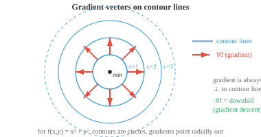

# 多元微积分

> **一句话总结**：多元微积分把导数和积分推广到多变量函数，是理解梯度、雅可比、海森与反向传播的关键工具，支撑起百万参数模型的训练。

*多元微积分把导数与积分推广到多变量函数，这在机器学习中不可或缺，因为模型往往有数百万参数。 本节涵盖偏导数、梯度、雅可比、海森，以及让反向传播成为可能的多元链式法则.*

- 到目前为止，我们的函数都是接受单个输入 $x$ 并产出单个输出 $f(x)$. 但在机器学习 (Machine Learning, ML) 里，我们几乎从不只跟一个变量打交道。

- 想一个两变量函数，比如 $f(x, y) = x^2 + y^2$. 它在三维空间里画出一张曲面，形如一只碗。 我们想知道：保持 $y$ 不变，只轻推 $x$ 一点点，$f$ 会怎么变？这就是 **偏导数** (partial derivative).

- $f$ 关于 $x$ 的 **偏导数**，记作 $\frac{\partial f}{\partial x}$，把其他所有变量当成常数，然后照常对 $x$ 求导。

- 对 $f(x, y) = x^2y + 3x - 2y$:

$$\frac{\partial f}{\partial x} = 2xy + 3 \qquad \frac{\partial f}{\partial y} = x^2 - 2$$

- 算 $\frac{\partial f}{\partial x}$ 时，把 $y$ 当常数，于是 $x^2y$ 变成 $2xy$, $3x$ 变成 $3$, $-2y$ 变成 $0$.

- 算 $\frac{\partial f}{\partial y}$ 时，把 $x$ 当常数，于是 $x^2y$ 变成 $x^2$, $3x$ 变成 $0$, $-2y$ 变成 $-2$.

- 从几何上看，对 $x$ 求偏导，就像用一张平行于 $xz$ 平面的刀 (在某个固定的 $y$ 值处) 切开三维曲面，然后看切出来那条曲线的斜率。


- **梯度** (gradient) 把所有偏导数收进一个向量里:

$$\nabla f = \left(\frac{\partial f}{\partial x_1}, \frac{\partial f}{\partial x_2}, \ldots, \frac{\partial f}{\partial x_n}\right)$$

- 对 $f(x, y) = x^2 + y^2$: $\nabla f(x, y) = (2x, 2y)$. 在点 $(1, 2)$ 处：$\nabla f(1, 2) = (2, 4)$.

- 梯度有两个关键性质:

    - **方向**：它指向函数上升最陡的方向。 想象一个登山者站在山上，他所处位置的梯度笔直指向最陡的上山路径。

    - **大小**: $\|\nabla f\|$ 给出在这个最陡方向上的上升速率。 梯度大，说明地形陡；梯度小，说明几乎是平地。



- 既然梯度指向上坡，那么反方向 ($-\nabla f$) 就是下坡，通向更低的函数值。 这个简单想法就是 **梯度下降** (gradient descent) 的基础，一种我们会在后面章节详细展开的优化技术。 现在只要记住：梯度告诉你哪边是"上"，以及攀登有多陡。

- **方向导数** (directional derivative) 是偏导数的推广。 与其问"$f$ 沿 $x$ 轴方向怎么变?"，不如问"$f$ 沿任意方向 $\mathbf{u}$ 怎么变?" 它由梯度与单位向量的点积算出:

$$D_{\mathbf{u}} f = \nabla f \cdot \mathbf{u}$$

- 对 $f(x, y) = x^2 + y^2$ 在 $(1, 2)$ 处沿方向 $\mathbf{v} = (3, 4)$：先归一化得 $\mathbf{u} = (3/5, 4/5)$，然后 $D_{\mathbf{u}} f = (2, 4) \cdot (3/5, 4/5) = 6/5 + 16/5 = 22/5$.

- 偏导数是方向导数的特例，只是方向恰好沿着某条坐标轴。 如果某方向的方向导数为零，说明函数在该点沿这个方向是平的。

- **等高线** (contour lines，或称水平曲线) 把函数取相同值的点连起来。 对 $f(x, y) = x^2 + y^2$，等高线是以原点为中心的一组圆：$x^2 + y^2 = c$，每个 $c$ 对应一条。

- 等高线永远不相交 (同一个点不可能有两个函数值).

- 梯度始终垂直于等高线，并从低值指向高值。

- 等高线密集的地方地形陡，稀疏的地方坡度缓。

- 目前为止，我们的函数都只输出一个值。 但很多函数会同时输出多个值。 一个函数 $\mathbf{F}: \mathbb{R}^n \to \mathbb{R}^m$ 接收 $n$ 个输入，产出 $m$ 个输出。 **雅可比矩阵** (Jacobian matrix) 把这种向量值函数的所有偏导数组织起来:

$$
J = \begin{bmatrix} \frac{\partial f_1}{\partial x_1} & \cdots & \frac{\partial f_1}{\partial x_n} \\ \vdots & \ddots & \vdots \\ \frac{\partial f_m}{\partial x_1} & \cdots & \frac{\partial f_m}{\partial x_n} \end{bmatrix}
$$

- 雅可比的每一行都是某个输出分量的梯度。 对于 3 输入 2 输出的函数，雅可比是一个 $2 \times 3$ 的矩阵。

- 雅可比把导数概念推广到了向量值函数。

- 就像标量函数的导数告诉你输出对单位输入变化的响应，雅可比告诉你每个输出对每个输入的响应。

- **雅可比行列式** (determinant of the Jacobian) 衡量一个变换在局部把空间拉伸或压缩了多少。

- 如果行列式是 $2$，小区域的面积会翻倍；如果是 $0$，变换把空间压到了更低的维度 (回忆矩阵一章里讲过，零行列式意味着一个奇异、不可逆的变换).

- 当多个变换复合 (前一个的输出喂给下一个) 时，整体映射的雅可比是各个雅可比的乘积。 我们会在后面章节看到这个想法变成核心。

- 梯度捕捉的是一阶信息 (斜率)，而 **海森矩阵** (Hessian matrix) 捕捉的是二阶信息 (曲率).

- 对标量函数 $f(x_1, \ldots, x_n)$，海森是一个 $n \times n$ 的矩阵，装着所有的二阶偏导数:

$$
H = \begin{bmatrix} \frac{\partial^2 f}{\partial x_1^2} & \frac{\partial^2 f}{\partial x_1 \partial x_2} & \cdots \\ \frac{\partial^2 f}{\partial x_2 \partial x_1} & \frac{\partial^2 f}{\partial x_2^2} & \cdots \\ \vdots & \vdots & \ddots \end{bmatrix}
$$

- 对 $f(x, y) = x^3 + 2xy^2 - y^3$，梯度是 $(3x^2 + 2y^2,\; 4xy - 3y^2)$，海森是:

$$
H = \begin{bmatrix} 6x & 4y \\ 4y & 4x - 6y \end{bmatrix}
$$

- 对角元 ($6x$ 和 $4x - 6y$) 告诉你：沿 $x$ 方向移动时，$x$ 方向的斜率如何变化；$y$ 方向同理。

- 非对角元 ($4y$) 告诉你：沿一个方向移动时，另一个方向上的斜率如何变化。

- **克莱罗定理** (Clairaut's theorem) 保证：只要函数的二阶偏导数连续，混合偏导数就相等：$\frac{\partial^2 f}{\partial x \partial y} = \frac{\partial^2 f}{\partial y \partial x}$.

- 这意味着海森矩阵是对称的，而对称矩阵 (在矩阵一章看过) 保证有实特征值以及正交的特征向量。

- 海森告诉我们函数在临界点 (梯度为零处) 附近的形状:

    - 若 $H$ 正定 (所有特征值为正)，该点是 **局部极小** (local minimum)，曲面在各个方向上都向上弯，像一只碗。
    - 若 $H$ 负定 (所有特征值为负)，该点是 **局部极大** (local maximum)，曲面向下弯，像一只倒扣的碗。
    - 若 $H$ 既有正特征值又有负特征值，该点是 **鞍点** (saddle point)，曲面在某些方向上升，在另一些方向下降，像一个山间垭口。

- **多元链式法则** (multivariate chain rule) 把链式法则推广到多变量函数。 如果 $z = f(x, y)$，而 $x = g(t)$, $y = h(t)$，那么:

$$\frac{dz}{dt} = \frac{\partial f}{\partial x}\frac{dx}{dt} + \frac{\partial f}{\partial y}\frac{dy}{dt}$$

- 从 $t$ 到 $z$ 的每条路径都贡献一项：沿这条路径的偏导数，乘以中间变量对 $t$ 的导数。

- 例如，若 $z = x^2 y + 3x - y^2$, $x = \cos(t)$, $y = \sin(t)$:

$$\frac{dz}{dt} = (2xy + 3)(-\sin t) + (x^2 - 2y)(\cos t)$$

- 除了手算导数，还有三种做法:

    - **数值微分** (numerical differentiation)：用 $f'(x) \approx \frac{f(x+h) - f(x-h)}{2h}$ 对小的 $h$ 做近似。 简单，但有噪声，也不够精确。
    - **符号微分** (symbolic differentiation)：用代数方式套用微分规则，得到精确公式。 缺点是表达式可能爆炸式增长。
    - **自动微分** (Automatic Differentiation, autodiff)：跟踪运算链，高效计算精确导数。 这就是 JAX、PyTorch、TensorFlow 用的方法。 它给出的是精确数值 (不是近似)，而且不会产生臃肿的符号表达式。

## 编程练习 (用 CoLab 或 notebook)

1. 用 `jax.grad` 计算 $f(x, y) = x^2 y + 3x - 2y$ 在点 $(1, 2)$ 处的梯度。 由于 $f$ 接收向量输入，用 `jax.grad` 时要配合 `argnums`.
```python
import jax
import jax.numpy as jnp

def f(x, y):
    return x**2 * y + 3*x - 2*y

df_dx = jax.grad(f, argnums=0)
df_dy = jax.grad(f, argnums=1)

x, y = 1.0, 2.0
print(f"∂f/∂x = {df_dx(x, y):.4f}  (expected: {2*x*y + 3:.4f})")
print(f"∂f/∂y = {df_dy(x, y):.4f}  (expected: {x**2 - 2:.4f})")
```

2. 用 `jax.jacobian` 计算向量值函数的雅可比。 与手算结果对比。
```python
import jax
import jax.numpy as jnp

def F(x):
    return jnp.array([x[0]**2 + x[1], x[0] * x[1]**2])

J = jax.jacobian(F)
x = jnp.array([1.0, 2.0])
print(f"Jacobian at (1,2):\n{J(x)}")
# 预期: [[2*x[0], 1], [x[1]**2, 2*x[0]*x[1]]] = [[2, 1], [4, 4]]
```

3. 用 `jax.hessian` 计算 $f(x, y) = x^3 + 2xy^2 - y^3$ 的海森矩阵，并验证它是对称的。
```python
import jax
import jax.numpy as jnp

def f(xy):
    x, y = xy[0], xy[1]
    return x**3 + 2*x*y**2 - y**3

H = jax.hessian(f)
point = jnp.array([1.0, 2.0])
hess = H(point)
print(f"Hessian:\n{hess}")
print(f"Symmetric: {jnp.allclose(hess, hess.T)}")
# 预期: [[6x, 4y], [4y, 4x-6y]] = [[6, 8], [8, -8]]
```

4. 从零搭一个最小的自动微分引擎。
    - 每个 `Var` 记录自己的值，以及如何通过链式法则把梯度往回传。
    - 试着扩展更多运算 (除法、幂等).
    - 这是 JAX、PyTorch、NumPy 设计思路的地基。
```python
class Var:
    def __init__(self, val, children=(), backward_fn=None):
        self.val = val
        self.grad = 0.0
        self.children = children
        self.backward_fn = backward_fn

    def __add__(self, other):
        out = Var(self.val + other.val, children=(self, other))
        def _backward():
            self.grad += out.grad    # d(a+b)/da = 1
            other.grad += out.grad   # d(a+b)/db = 1
        out.backward_fn = _backward
        return out

    def __mul__(self, other):
        out = Var(self.val * other.val, children=(self, other))
        def _backward():
            self.grad += other.val * out.grad  # d(a*b)/da = b
            other.grad += self.val * out.grad  # d(a*b)/db = a
        out.backward_fn = _backward
        return out

    def backward(self):
        # 先拓扑排序, 再反向传播梯度
        # 具体细节会在数据结构与算法一章展开
        order, visited = [], set()
        def topo(v):
            if v not in visited:
                visited.add(v)
                for c in v.children:
                    topo(c)
                order.append(v)
        topo(self)
        self.grad = 1.0
        for v in reversed(order):
            if v.backward_fn:
                v.backward_fn()

# f(x, y) = x*x*y + x  at (3, 2)
x = Var(3.0)
y = Var(2.0)
f = x * x * y + x       # = 3*3*2 + 3 = 21

f.backward()
print(f"f = {f.val}")           # 21.0
print(f"df/dx = {x.grad}")     # 2*x*y + 1 = 13.0
print(f"df/dy = {y.grad}")     # x*x = 9.0
```

---

## 📌 本节要点

- **偏导数**：对多元函数，固定其他变量，只对一个变量求导；几何上是用平面切曲面看斜率。
- **梯度**：把所有偏导数打包成向量，指向最陡上升方向，长度即上升速率。
- **梯度下降**：沿 $-\nabla f$ 方向走就是下坡，这是训练模型的核心优化思路。
- **方向导数**: $D_{\mathbf{u}} f = \nabla f \cdot \mathbf{u}$，衡量函数沿任意方向的变化率，偏导数是其特例。
- **等高线**：函数值相同点的连线，永不相交，梯度总垂直于它，密集处坡陡。
- **雅可比矩阵**：向量值函数所有偏导数的排布，每行是一个输出分量的梯度；行列式衡量局部体积变化，复合变换等于雅可比相乘。
- **海森矩阵**：二阶偏导数矩阵，描述曲率；克莱罗定理保证对称，因此有实特征值和正交特征向量。
- **临界点分类**：海森正定 → 局部极小；负定 → 局部极大；特征值有正有负 → 鞍点。
- **多元链式法则**：从中间变量到最终输出，每条路径贡献一项，是反向传播的数学基础。
- **自动微分**：追踪运算链得到精确数值梯度，既避免数值近似误差，又避免符号表达式爆炸，是现代深度学习框架的核心。