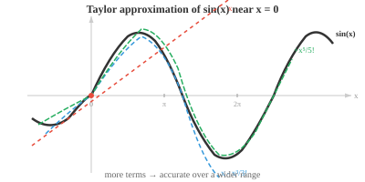

# 函数逼近

> **一句话总结**: 用简单函数 (多项式、正弦余弦、神经网络) 去替代复杂函数, 从线性化到泰勒级数, 再到万能逼近定理, 构成了深度学习为何能拟合任意映射的理论根基.

*函数逼近用更简单、足够接近的函数替代复杂函数, 使其"够用即可"。本节涵盖线性化、泰勒级数、多项式逼近、傅里叶级数, 以及万能逼近定理 —— 神经网络能学到任意映射的理论支柱.*

- 我们碰到的很多函数太复杂, 没法直接处理。手算 $e^{0.1}$、预测卫星轨迹, 这些背后的函数都没有简单的闭式解。

- **函数逼近 (function approximation)** 就是用一个在我们关心的区域内"足够接近"的简单函数, 去替换那个复杂函数。

- 最自然的逼近手段是多项式。多项式无非就是 $x$ 的各次幂加上系数, 求值、求导、求积分都很方便。

- 但多项式为什么这么好用? 想想 $x$ 的每一次幂都贡献了什么。

    - 常数项 $a_0$ 定基线值。
    - $a_1 x$ 项加上斜率。
    - $a_2 x^2$ 项加上曲率。
    - 每一次更高的幂都在捕捉函数形状的更细节。


- 只要挑对系数, 我们就能在某一点上一步步匹配函数的值、斜率、曲率, 以及更高阶的行为。

- 项数够多的时候, 多项式几乎可以模仿任何光滑函数。

- 问题变成: 我们怎么找到合适的系数?

- **线性化 (linearisation)** 是最简单的逼近。在点 $x = a$ 附近, 我们用切线来替换函数:

$$L(x) = f(a) + f'(a)(x - a)$$

- 这就是一阶**泰勒逼近 (Taylor approximation)**。它说的是: 从已知值 $f(a)$ 起步, 再按斜率乘以离 $a$ 的距离作修正。

- 举个例子, 把 $\sin(x)$ 在 $x = 0$ 处线性化: $f(0) = 0$, $f'(0) = \cos(0) = 1$, 所以 $L(x) = x$。在零附近, $\sin(x) \approx x$。试一下: $\sin(0.1) = 0.0998\ldots \approx 0.1$。

- 但线性化只在离 $a$ 非常近的地方才靠谱。走远一点, 逼近就崩了。要做得更好, 得加入更高阶的项。

- **泰勒级数 (Taylor series)** 把函数表示成无穷多项多项式的和, 每一项都在捕捉函数在 $a$ 附近的更细一层行为:

$$f(x) = \sum_{n=0}^{\infty} \frac{f^{(n)}(a)}{n!}(x - a)^n = f(a) + f'(a)(x-a) + \frac{f''(a)}{2!}(x-a)^2 + \frac{f'''(a)}{3!}(x-a)^3 + \cdots$$



- 每往后一项都在做一次修正。第一项匹配值, 第二项匹配斜率, 第三项匹配曲率, 以此类推。项数越多, 逼近保持精确的区域也越大。

- 分母里的 $n!$ 不是凭空冒出来的。你把 $(x - a)^n$ 求导正好 $n$ 次, 结果就是 $n!$。这个阶乘正好抵消掉, 保证泰勒多项式的 $n$ 阶导数在 $x = a$ 处等于原函数的 $n$ 阶导数。

- **麦克劳林级数 (Maclaurin series)** 就是以 $a = 0$ 为中心的泰勒级数:

$$f(x) = \sum_{n=0}^{\infty} \frac{f^{(n)}(0)}{n!} x^n$$

- 几个著名的麦克劳林级数:

$$e^x = 1 + x + \frac{x^2}{2!} + \frac{x^3}{3!} + \cdots$$

$$\sin x = x - \frac{x^3}{3!} + \frac{x^5}{5!} - \frac{x^7}{7!} + \cdots$$

$$\cos x = 1 - \frac{x^2}{2!} + \frac{x^4}{4!} - \frac{x^6}{6!} + \cdots$$

- 注意 $\sin x$ 只有奇数次幂 (它是奇函数), $\cos x$ 只有偶数次幂 (它是偶函数)。交替的正负号让逼近在真实值两侧来回振荡, 从两边收敛。

- 我们用四项来逼近 $e^{0.5}$: $1 + 0.5 + \frac{0.25}{2} + \frac{0.125}{6} = 1 + 0.5 + 0.125 + 0.02083 \approx 1.6458$。真实值是 $1.6487\ldots$, 四项就已经给出三位正确小数。

- 不是每个泰勒级数处处都收敛。**收敛半径 (radius of convergence)** 告诉我们离中心 $a$ 多远之内, 级数还能给出有效结果。在这个半径内, 只要加更多的项, 多项式逼近就能达到任意精度。半径之外, 级数发散。

- **幂级数 (power series)** 是一般形式: $\sum_{n=0}^{\infty} a_n (x - c)^n$。泰勒级数是系数由导数决定的幂级数; 别的幂级数也许由别的规则定义。**比值判别法 (ratio test)** 用来判定收敛: 计算 $\lim_{n \to \infty} \left|\frac{a_{n+1}}{a_n}\right|$。若极限为 $L$, 则收敛半径 $R = 1/L$。

- 当我们把泰勒级数截断到 $n$ 项时, 会引入误差。**拉格朗日余项 (Lagrange remainder)** 给出误差界:

$$R_n(x) = \frac{f^{(n+1)}(c)}{(n+1)!}(x-a)^{n+1}$$

- 这里 $c$ 是 $a$ 和 $x$ 之间某个我们不知道的点。虽然 $c$ 不确定, 但通常能对 $|f^{(n+1)}(c)|$ 做出上界估计, 从而得到最坏情况的误差。分母里的 $(n+1)!$ 增长极快, 所以只要在收敛半径之内, 加项时误差会迅速缩小。

- 对于多元函数, 泰勒展开还包含混合偏导数。函数 $f(\mathbf{x})$ 在点 $\mathbf{a}$ 附近的二阶逼近为:

$$f(\mathbf{x}) \approx f(\mathbf{a}) + \nabla f(\mathbf{a})^T (\mathbf{x} - \mathbf{a}) + \frac{1}{2} (\mathbf{x} - \mathbf{a})^T H(\mathbf{a}) (\mathbf{x} - \mathbf{a})$$

- 第一项是函数值, 第二项用到梯度 (一个向量, 我们在多元微积分里见过), 第三项用到海森矩阵 (Hessian, 它捕捉曲率)。这一下就把矩阵那一章直接接到了微积分: 海森是一个二阶导数矩阵, 描述函数曲面的形状。

- 这个多元二阶逼近正是牛顿法以及其他二阶优化技术的基础, 下一节我们就会见到。

- 除了多项式, 还有一些值得了解的其他逼近方法:

    - **样条插值 (spline interpolation)**: 不用一个高次多项式, 而是用许多低次多项式平滑地拼在一起。这样可以避免高次多项式那种狂野的振荡。
    - **傅里叶级数 (Fourier series)**: 把周期函数逼近成正弦和余弦的和。信号处理和音频领域必备。
    - **神经网络**: 万能函数逼近器。只要神经元足够多, 它们就能把任意连续函数逼近到任意精度。这就是深度学习的理论正当性。

- 一个函数被称为"良态"(well-behaved) 的, 是指它具备让逼近可靠的性质: 连续 (无跳跃)、可微 (无尖角)、光滑 (各阶导数都存在)、有界 (输出保持有限)。

- 多项式、指数函数、三角函数都是良态的。函数越良态, 你想要好的逼近所需的泰勒项数就越少。

## 编程练习 (使用 CoLab 或 notebook)

1. 用逐渐增多的泰勒项数逼近 $e^x$, 并可视化逼近如何逐步改善。
```python
import jax.numpy as jnp
import matplotlib.pyplot as plt

x = jnp.linspace(-2, 3, 300)
plt.plot(x, jnp.exp(x), "k-", linewidth=2, label="eˣ (exact)")

colors = ["#e74c3c", "#3498db", "#27ae60", "#9b59b6"]
for n, color in zip([1, 2, 4, 8], colors):
    approx = sum(x**k / jnp.array(float(jnp.prod(jnp.arange(1, k+1)) if k > 0 else 1))
                 for k in range(n+1))
    plt.plot(x, approx, color=color, linestyle="--", label=f"{n} terms")

plt.ylim(-2, 15)
plt.legend()
plt.title("Taylor approximation of eˣ")
plt.show()
```

2. 计算拉格朗日余项, 给出用不同项数的泰勒级数逼近 $\sin(1)$ 时的误差界。
```python
import jax.numpy as jnp

x = 1.0
exact = jnp.sin(x)

taylor = 0.0
for n in range(8):
    sign = (-1)**n
    factorial = float(jnp.prod(jnp.arange(1, 2*n+2)))
    taylor += sign * x**(2*n+1) / factorial
    error = abs(exact - taylor)
    bound = x**(2*n+3) / float(jnp.prod(jnp.arange(1, 2*n+4)))
    print(f"terms={n+1}  approx={taylor:.10f}  error={error:.2e}  bound={bound:.2e}")
```

3. 比较 $\cos(x)$ 在 $x = 0$ 附近的线性化与二次泰勒逼近。把两条逼近曲线和真实函数一起画出来, 观察各自的精确区间。
```python
import jax.numpy as jnp
import matplotlib.pyplot as plt

x = jnp.linspace(-3, 3, 300)
plt.plot(x, jnp.cos(x), "k-", linewidth=2, label="cos(x)")
plt.plot(x, jnp.ones_like(x), "--", color="#e74c3c", label="linear: 1")
plt.plot(x, 1 - x**2/2, "--", color="#3498db", label="quadratic: 1 - x²/2")
plt.plot(x, 1 - x**2/2 + x**4/24, "--", color="#27ae60", label="4th order")
plt.ylim(-2, 2)
plt.legend()
plt.title("Taylor approximations of cos(x)")
plt.show()
```

---

## 📌 本节要点

- **函数逼近**: 用简单函数替换复杂函数, 只求在关心的区域内足够接近。
- **多项式为何好用**: 常数项定基线、一次项给斜率、二次项给曲率, 更高阶捕捉更细节。
- **线性化**: 用切线做一阶泰勒逼近, 只在展开点附近有效。
- **泰勒级数**: 无穷多项多项式和, 逐项匹配函数在 $a$ 处的各阶导数。
- **$n!$ 的来历**: 求导 $n$ 次 $(x-a)^n$ 恰好得 $n!$, 阶乘正好抵消, 让 $n$ 阶导数完全对上。
- **麦克劳林级数**: 中心在 $a = 0$ 的泰勒级数; $e^x$、$\sin x$、$\cos x$ 有经典展开式。
- **收敛半径与比值判别法**: 幂级数只在半径内收敛, 半径 $R = 1/L$, 其中 $L$ 是相邻系数比值的极限。
- **拉格朗日余项**: 截断误差有 $(n+1)!$ 在分母, 因此加项时误差衰减极快。
- **多元二阶泰勒**: 用梯度和海森矩阵刻画曲面, 是牛顿法等二阶优化的基础。
- **其他逼近器**: 样条 (拼多项式)、傅里叶级数 (周期函数)、神经网络 (万能逼近器, 深度学习的理论支柱)。
