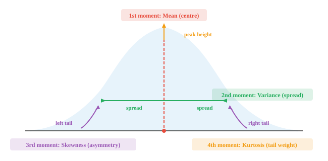

# 统计学基础

> **一句话总结**: 统计学是从数据中学习的科学, 本节用分布、随机变量、PMF/PDF、期望与矩这套核心语言, 把"数据长啥样、值往哪儿聚、散得有多开"讲清楚。

## 🗺️ 本章导览

- 本章覆盖统计学的核心链条: 基础 → 描述 → 抽样 → 检验 → 推断
- **01. 基础** (本节): 分布、随机变量、PMF/PDF/CDF、期望、方差、矩、中心极限定理
- **02. 描述性度量**: 均值、方差、分位数、可视化
- **03. 抽样**: 抽样分布、中心极限定理
- **04. 假设检验**: p 值、Z 检验、t 检验、卡方
- **05. 统计推断**: 置信区间、贝叶斯推断入门

*统计学为描述数据和量化不确定性提供了语言。本节介绍分布、随机变量、概率质量函数 (Probability Mass Function, PMF)、概率密度函数 (Probability Density Function, PDF)、累积分布函数 (Cumulative Distribution Function, CDF)、期望、方差、矩以及中心极限定理 —— 这些概念支撑起每一个机器学习 (Machine Learning, ML) 评估指标与损失函数。*

- 统计学是**从数据中学习**的科学。你收集观测值, 总结它们, 然后得出结论 —— 结论往往关于那些没法直接测量的东西。

- 想象一下, 你想知道某个国家所有成年人的平均身高。你没法挨个去量, 于是只测一个样本, 再用统计学对整体做一个有依据的猜测。

- 统计学有两大分支:
    - **描述性统计** (descriptive statistics): 总结你已经拿到的数据 (平均值、图表、表格)
    - **推断性统计** (inferential statistics): 用样本对更大的群体作出论断

- 统计学的基本构件是**分布** (distribution) —— 一种关于"值如何分散"的描述。其他一切东西 (均值、检验、预测) 都源自对分布的理解。

- **频率分布** (frequency distribution) 数的是每个值 (或每个值区间) 在你数据里出现的频次。想象把考试成绩按分数段装进桶里, 再数每个桶里有几个学生。结果就是一张直方图。

- **概率分布** (probability distribution) 把原始频次换成概率。它不说"12 个学生考在 70 到 80 分", 而说"考在 70 到 80 分的概率是 0.24"。当数据是连续的, 直方图的柱子就变成了一条光滑的曲线。


- 左边的直方图是从你实际收集的数据里搭出来的。右边的光滑曲线则是一个数学模型, 用来刻画数据背后的规律。一个是经验的, 一个是理论的。

- 要在数学上处理分布, 我们得有办法给每个结果分配一个数。这正是**随机变量**做的事。

- 随机变量是一个函数, 把实验的每个结果映射到一个实数。抛一枚硬币: 结果是"正面"或"反面", 但一个随机变量 $X$ 会把它转成 $X(\text{heads}) = 1$ 和 $X(\text{tails}) = 0$。现在我们能做算术了。


- **离散** (discrete) 随机变量取一组可数的值: 抛 10 次硬币里正面的次数、骰子的点数、一小时内收到的邮件数。

- **连续** (continuous) 随机变量可以取一个区间里的任何值: 你精确的身高、下一辆公交到站前的等待时间、正午的气温。

- 这个区分很重要, 因为它决定了我们怎么算概率。对离散变量, 我们求和; 对连续变量, 我们积分 (回想一下第 3 章的积分)。

- 对于离散随机变量, **概率质量函数** (Probability Mass Function, PMF) 给出每一个具体值的概率:

$$P(X = x) = p(x), \quad \text{where } \sum_{x} p(x) = 1$$

- 对于连续随机变量, **概率密度函数** (Probability Density Function, PDF) 给出落在某个区间内的概率。任何单一精确值的概率为零; 只有区间才有正的概率:

$$P(a \le X \le b) = \int_a^b f(x)\, dx, \quad \text{where } \int_{-\infty}^{\infty} f(x)\, dx = 1$$

- 现在我们能给结果分配数值了, 最自然的问题就是: 平均下来我们预期哪个值?

- **期望** (expectation, 也叫期望值) 是所有可能值的加权平均, 权重就是概率。把它想成分布的"重心"。

- 如果你把一枚公平的骰子扔很多次, 你的平均点数会收敛到 3.5。这就是期望值, 尽管你永远真的掷不出 3.5 来。

- 对离散随机变量:

$$E[X] = \sum_{x} x \cdot p(x)$$

- 对连续随机变量 (用到第 3 章的积分):

$$E[X] = \int_{-\infty}^{\infty} x \cdot f(x)\, dx$$

- 举个例子: 一枚公平的六面骰子, 对 $x = 1, 2, 3, 4, 5, 6$ 有 $p(x) = 1/6$。

$$E[X] = 1 \cdot \tfrac{1}{6} + 2 \cdot \tfrac{1}{6} + 3 \cdot \tfrac{1}{6} + 4 \cdot \tfrac{1}{6} + 5 \cdot \tfrac{1}{6} + 6 \cdot \tfrac{1}{6} = \frac{21}{6} = 3.5$$

- 期望是线性的, 也就是说 $E[aX + b] = aE[X] + b$。这个性质极其有用, 在 ML 损失函数里经常出现。

- 期望告诉我们中心在哪儿, 但没说值散得多开。要刻画分布的完整形状, 我们需要**矩** (moments)。

- 一个矩就是 $X$ 的某次幂的期望。第 $k$ 个**原点矩** (raw moment) 定义为:

$$\mu_k' = E[X^k]$$

- 第 1 个原点矩 ($k = 1$) 就是均值: $\mu_1' = E[X] = \mu$。

- 原点矩是从零点开始度量的。很多时候我们更关心相对于均值的偏离。第 $k$ 个**中心矩** (central moment) 把度量的原点挪到均值上:

$$\mu_k = E[(X - \mu)^k]$$

- 第 1 个中心矩恒为零 (在均值上方与下方的偏离相互抵消)。第 2 个中心矩就是**方差** (variance)。

- 为了比较不同尺度上的分布, 我们通过除以标准差 $\sigma$ 的合适次幂来**标准化**:

$$\tilde{\mu}_k = \frac{\mu_k}{\sigma^k}$$

- 每一个矩都刻画了分布形状的一个不同侧面:



- **1 阶矩 (均值)**: 分布的中心在哪里。平衡点。
- **2 阶矩 (方差)**: 值围绕均值散得多开。方差越大, 分布越宽。
- **3 阶矩 (偏度)**: 分布向左还是向右倾斜。偏度为零表示对称。
- **4 阶矩 (峰度)**: 尾部有多厚重。峰度越高, 极端离群值越多。

- 我们用一个具体数据集把四个矩挨个算一遍: $X = \{2, 4, 4, 4, 5, 5, 7, 9\}$。

- **第 1 步: 均值** (第 1 个原点矩)

$$\mu = \frac{2 + 4 + 4 + 4 + 5 + 5 + 7 + 9}{8} = \frac{40}{8} = 5$$

- **第 2 步: 方差** (第 2 个中心矩)。把每个值减去均值, 平方, 再取平均:

$$\sigma^2 = \frac{(2{-}5)^2 + (4{-}5)^2 + (4{-}5)^2 + (4{-}5)^2 + (5{-}5)^2 + (5{-}5)^2 + (7{-}5)^2 + (9{-}5)^2}{8}$$

$$= \frac{9 + 1 + 1 + 1 + 0 + 0 + 4 + 16}{8} = \frac{32}{8} = 4$$

- **标准差** (standard deviation) 为 $\sigma = \sqrt{4} = 2$。

- **第 3 步: 偏度** (标准化的第 3 中心矩)。把偏离量立方, 取平均, 再除以 $\sigma^3$:

$$\tilde{\mu}_3 = \frac{1}{8} \cdot \frac{(-3)^3 + (-1)^3 + (-1)^3 + (-1)^3 + 0^3 + 0^3 + 2^3 + 4^3}{2^3}$$

$$= \frac{1}{8} \cdot \frac{-27 -1 -1 -1 + 0 + 0 + 8 + 64}{8} = \frac{42}{64} = 0.656$$

- 正的偏度意味着右尾更长, 这也说得通 —— 9 远远高于均值。

- **第 4 步: 峰度** (标准化的第 4 中心矩)。把偏离量升到 4 次方:

$$\tilde{\mu}_4 = \frac{1}{8} \cdot \frac{(-3)^4 + (-1)^4 + (-1)^4 + (-1)^4 + 0^4 + 0^4 + 2^4 + 4^4}{2^4}$$

$$= \frac{1}{8} \cdot \frac{81 + 1 + 1 + 1 + 0 + 0 + 16 + 256}{16} = \frac{356}{128} = 2.781$$

- 正态分布的峰度是 3 (称为"中峰态", mesokurtic)。我们算出来的 2.781 很接近, 说明尾部大致正态。高于 3 (称"尖峰态", leptokurtic) 表示尾部更厚重; 低于 3 (称"低峰态", platykurtic) 表示尾部更轻。有些公式会报**超额峰度** (excess kurtosis), 也就是减去 3 后的值, 那么我们的超额峰度就是 $-0.219$。

## Coding Tasks (use CoLab or notebook)

1. 对一枚被做过手脚的骰子计算期望值: 6 点面的概率是 0.3, 其他点面平分剩下的概率。用 100,000 次模拟来验证。
```python
import jax
import jax.numpy as jnp

# 加权骰子: 6 点概率 0.3, 其余平分 0.7
probs = jnp.array([0.14, 0.14, 0.14, 0.14, 0.14, 0.30])
faces = jnp.array([1, 2, 3, 4, 5, 6])

# 解析期望值
ev = jnp.sum(faces * probs)
print(f"Expected value (formula): {ev:.4f}")

# 模拟
key = jax.random.PRNGKey(42)
rolls = jax.random.choice(key, faces, shape=(100_000,), p=probs)
print(f"Expected value (simulation): {rolls.mean():.4f}")
```

2. 对示例中的数据集算出全部四个矩 (均值、方差、偏度、峰度), 然后改一改数据, 观察每个矩如何变化。
```python
import jax.numpy as jnp

x = jnp.array([2, 4, 4, 4, 5, 5, 7, 9], dtype=jnp.float32)

mean = jnp.mean(x)
variance = jnp.mean((x - mean) ** 2)
std = jnp.sqrt(variance)
skewness = jnp.mean(((x - mean) / std) ** 3)
kurtosis = jnp.mean(((x - mean) / std) ** 4)

print(f"Mean:     {mean:.3f}")
print(f"Variance: {variance:.3f}")
print(f"Std Dev:  {std:.3f}")
print(f"Skewness: {skewness:.3f}")
print(f"Kurtosis: {kurtosis:.3f}")
print(f"Excess K: {kurtosis - 3:.3f}")
```

3. 把一枚公平骰子的 PMF 与 CDF 并排画出来。试着改改概率, 看形状怎么变。
```python
import jax.numpy as jnp
import matplotlib.pyplot as plt

faces = jnp.array([1, 2, 3, 4, 5, 6])
pmf = jnp.ones(6) / 6  # 公平骰子; 试着改这里!
cdf = jnp.cumsum(pmf)

fig, (ax1, ax2) = plt.subplots(1, 2, figsize=(10, 4))

ax1.bar(faces, pmf, color="#3498db", alpha=0.8)
ax1.set_title("PMF")
ax1.set_xlabel("Face")
ax1.set_ylabel("P(X = x)")
ax1.set_ylim(0, 0.5)

ax2.step(faces, cdf, where="mid", color="#e74c3c", linewidth=2)
ax2.set_title("CDF")
ax2.set_xlabel("Face")
ax2.set_ylabel("P(X ≤ x)")
ax2.set_ylim(0, 1.1)

plt.tight_layout()
plt.show()
```

---

## 📌 本节要点

- **分布**: 描述数据值如何分散的核心对象, 频率分布是经验的, 概率分布是理论的。
- **随机变量**: 把实验结果映射到实数的函数, 是让概率能做算术的关键桥梁。
- **离散 vs 连续**: 离散取可数值用求和 (PMF), 连续取区间用积分 (PDF)。
- **PMF / PDF**: 前者给单点概率, 后者给密度; PDF 下任何单点的概率都是零。
- **期望**: 分布的重心, 所有值以概率为权的加权平均, 满足线性 $E[aX+b] = aE[X] + b$。
- **原点矩 vs 中心矩**: 前者从零点度量, 后者从均值度量; 第 2 中心矩就是方差。
- **四个矩的直觉**: 均值给中心, 方差给宽度, 偏度给倾斜, 峰度给尾部厚度。
- **超额峰度**: 峰度减 3, 用于跟正态分布 (峰度 = 3) 直接比较。
