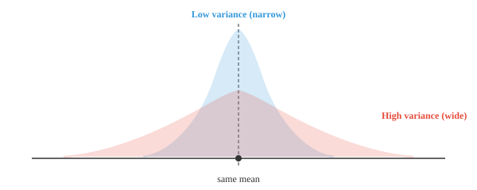
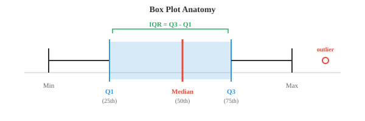

# 描述性度量

> **一句话总结**: 用离散度、位置、形状、关联四类单一数值总结数据分布, 支撑机器学习 (Machine Learning, ML) 中的探索性分析与特征工程.

*统计度量用单个数字概括数据, 抓住离散度、位置、形状与关联。本节涵盖方差、标准差、四分位数、偏度、峰度、协方差、相关系数与 z 分数, 是机器学习中探索性数据分析和特征工程的工具箱。*

- 上一节我们把矩作为一族汇总统计量引入。这里我们展开由它们衍生出的实用工具: 离散度、位置、形状与关联度量。

- **离散度 (dispersion)** 回答: 数据有多分散? 两个教室平均分可能相同, 但分散程度可以差很多。



- 窄的 (蓝色) 分布方差小: 大多数值紧紧围绕均值。宽的 (红色) 分布方差大: 值散得更远。

- **方差 (variance)** 是到均值的平方距离的平均。取平方是为了避免正负偏差互相抵消。

$$\sigma^2 = \frac{1}{N} \sum_{i=1}^{N} (x_i - \mu)^2$$

- 处理样本 (而非整个总体) 时, 我们除以 $N - 1$ 而不是 $N$。这个修正 (称为贝塞尔修正, Bessel's correction) 是因为样本倾向于低估真实的变异性:

$$s^2 = \frac{1}{N-1} \sum_{i=1}^{N} (x_i - \bar{x})^2$$

- **标准差 (standard deviation)** 是方差的平方根: $\sigma = \sqrt{\sigma^2}$。它把度量拉回原始单位。如果数据以厘米为单位, 方差的单位是 cm$^2$, 但标准差又回到了 cm。

- **平均绝对偏差 (Mean Absolute Deviation, MAD)** 是一个更简单的替代方案。不取平方, 而是对每个偏差取绝对值:

$$\text{MAD} = \frac{1}{N} \sum_{i=1}^{N} |x_i - \mu|$$

- MAD 比方差更抗离群点, 因为它不会通过平方把大偏差放大。不过方差在数学上更方便 (在证明和 ML 优化中能漂亮地分解)。

- **位置 (position)** 回答另一个问题: 某个特定值相对于其余数据落在哪里?

- **四分位数 (quartiles)** 把排好序的数据分成四等份。Q1 (第 25 百分位数) 是低于它的数据占 25% 的值。Q2 是中位数 (第 50 百分位数)。Q3 是第 75 百分位数。

- **四分位距 (Interquartile Range, IQR)** 是 $Q3 - Q1$。它刻画数据中间 50% 的分散度, 忽略极端值。



- 箱线图是统计学中最好用的可视化之一。箱体从 Q1 延伸到 Q3, 中间的横线是中位数, 须线延伸到最极端的非离群值, 须线之外的点是离群点。

- **百分位数 (percentiles)** 是四分位数的推广。第 $p$ 百分位数是低于它的观测占 $p\%$ 的值。Q1 是第 25 百分位数, 中位数是第 50, Q3 是第 75。

- **z 分数 (z-score)** 告诉你某个值离均值有多少个标准差:

$$z = \frac{x - \mu}{\sigma}$$

- z 分数为 2 表示这个值在均值以上 2 个标准差处。z 分数为 $-1.5$ 表示它在均值以下 1.5 个标准差处。这也叫**标准化 (standardisation)**, ML 中做特征缩放时用得非常多, 因为它把任何分布转换成均值为 0、标准差为 1 的形式。

- **形状 (shape)** 描述分布在中心和分散之外的几何特征。

- **偏度 (skewness)** (上一节的标准化三阶矩) 度量非对称性。像正态曲线这样完全对称的分布偏度为 0。正偏度意味着右尾更长 (例如收入分布)。负偏度意味着左尾更长 (例如退休年龄)。

$$\text{Skewness} = \frac{1}{N} \sum_{i=1}^{N} \left(\frac{x_i - \mu}{\sigma}\right)^3$$

- **峰度 (kurtosis)** (标准化四阶矩) 度量尾部的厚重程度。正态分布的峰度为 3。尾部更厚 (更容易出现离群点) 的分布峰度大于 3。

$$\text{Kurtosis} = \frac{1}{N} \sum_{i=1}^{N} \left(\frac{x_i - \mu}{\sigma}\right)^4$$

- **相关 (correlation)** 度量两个变量之间关系的强度和方向。它回答: 当一个变量上升时, 另一个是倾向于跟着上升、下降, 还是没反应?


- **皮尔逊相关系数 (Pearson correlation)** ($r$) 度量*线性*关联。取值从 $-1$ (完美负相关) 经过 $0$ (无关) 到 $+1$ (完美正相关)。

$$r = \frac{\sum_{i=1}^{N} (x_i - \bar{x})(y_i - \bar{y})}{\sqrt{\sum (x_i - \bar{x})^2} \cdot \sqrt{\sum (y_i - \bar{y})^2}}$$

- 如果还记得第 1 章的点积, 皮尔逊相关系数本质上就是 $\mathbf{x}$ 与 $\mathbf{y}$ 去均值版本之间的余弦相似度。

- **斯皮尔曼相关系数 (Spearman correlation)** ($\rho$) 度量*单调*关联。它不用原始值, 而是先做秩变换, 再在秩上算皮尔逊相关。这让它抗离群点, 也能处理非线性关系, 只要关系是持续上升或持续下降的。

- **几何平均 (geometric mean)** 是数值需要相乘时的合适平均, 比如增长率。如果你的投资先增长 10%, 再 20%, 再 30%, 平均增长因子不是这几个比率的算术平均, 而是:

$$\bar{x}_{\text{geo}} = \left(\prod_{i=1}^{N} x_i\right)^{1/N}$$

- 具体到增长率, 先把百分比换成因子 (1.10, 1.20, 1.30), 算几何平均, 再减 1。

- **指数移动平均 (Exponential Moving Average, EMA)** 给近期观测更多权重。不同于窗口内所有点权重相同的简单移动平均, EMA 是指数衰减的:

$$\text{EMA}_t = \alpha \cdot x_t + (1 - \alpha) \cdot \text{EMA}_{t-1}$$

- 平滑因子 $\alpha$ (取 0 到 1 之间) 控制旧观测失去影响的速度。$\alpha$ 越大, 对近期变化响应越快; 越小则越平滑。在 ML 中, EMA 用在 Adam 这类优化器和批归一化 (batch normalization) 的运行统计里。

- **离群点检测 (outlier detection)** 识别距其余数据异常远的数据点。两种常用方法:
    - **IQR 方法**: 若某点落在 $Q1 - 1.5 \times \text{IQR}$ 之下或 $Q3 + 1.5 \times \text{IQR}$ 之上, 就是离群点
    - **z 分数方法**: 若 $|z| > 3$ (离均值超过 3 个标准差), 就是离群点

- IQR 方法更稳健, 因为它不假设正态分布。z 分数方法在数据近似正态时效果不错, 但分布严重偏斜时会失效。

## 编程任务 (使用 Colab 或 notebook)

1. 计算数据集的方差、标准差和 MAD 并做对比。观察加入一个极端离群点后会发生什么。
```python
import jax.numpy as jnp

data = jnp.array([4, 8, 6, 5, 3, 7, 9, 5, 6, 7], dtype=jnp.float32)

mean = jnp.mean(data)
variance = jnp.var(data)
std = jnp.std(data)
mad = jnp.mean(jnp.abs(data - mean))

print("Original data:")
print(f"  Variance: {variance:.3f}, Std: {std:.3f}, MAD: {mad:.3f}")

# 加入一个离群点并重新计算
data_outlier = jnp.append(data, 100.0)
mean2 = jnp.mean(data_outlier)
print(f"\nWith outlier (100):")
print(f"  Variance: {jnp.var(data_outlier):.3f}, Std: {jnp.std(data_outlier):.3f}, MAD: {jnp.mean(jnp.abs(data_outlier - mean2)):.3f}")
```

2. 计算两个变量之间的皮尔逊和斯皮尔曼相关系数。试试不同的关系。
```python
import jax
import jax.numpy as jnp

# 完美线性关系
x = jnp.array([1, 2, 3, 4, 5, 6, 7, 8], dtype=jnp.float32)
y = 2 * x + 1  # 试着改改这里!

def pearson(a, b):
    a_c = a - jnp.mean(a)
    b_c = b - jnp.mean(b)
    return jnp.sum(a_c * b_c) / (jnp.sqrt(jnp.sum(a_c**2)) * jnp.sqrt(jnp.sum(b_c**2)))

def spearman(a, b):
    rank_a = jnp.argsort(jnp.argsort(a)).astype(jnp.float32)
    rank_b = jnp.argsort(jnp.argsort(b)).astype(jnp.float32)
    return pearson(rank_a, rank_b)

print(f"Pearson r:  {pearson(x, y):.4f}")
print(f"Spearman ρ: {spearman(x, y):.4f}")
```

3. 用 IQR 和 z 分数两种方法实现离群点检测, 并在偏斜数据上比较结果。
```python
import jax.numpy as jnp

data = jnp.array([2, 3, 3, 4, 5, 5, 5, 6, 6, 7, 50], dtype=jnp.float32)

# IQR 方法
q1, q3 = jnp.percentile(data, 25), jnp.percentile(data, 75)
iqr = q3 - q1
lower, upper = q1 - 1.5 * iqr, q3 + 1.5 * iqr
iqr_outliers = data[(data < lower) | (data > upper)]
print(f"IQR bounds: [{lower:.1f}, {upper:.1f}]")
print(f"IQR outliers: {iqr_outliers}")

# z 分数方法
z_scores = (data - jnp.mean(data)) / jnp.std(data)
z_outliers = data[jnp.abs(z_scores) > 3]
print(f"\nZ-scores: {z_scores}")
print(f"Z-score outliers (|z| > 3): {z_outliers}")
```

4. 用不同的平滑因子在带噪数据上计算并绘制指数移动平均。
```python
import jax.numpy as jnp
import matplotlib.pyplot as plt

# 生成带噪数据
key = __import__("jax").random.PRNGKey(0)
noise = __import__("jax").random.normal(key, shape=(50,))
signal = jnp.linspace(0, 5, 50) + noise

def ema(data, alpha):
    result = jnp.zeros_like(data)
    result = result.at[0].set(data[0])
    for t in range(1, len(data)):
        result = result.at[t].set(alpha * data[t] + (1 - alpha) * result[t - 1])
    return result

plt.figure(figsize=(10, 4))
plt.plot(signal, "o", alpha=0.3, label="raw data", color="#999")
for alpha, color in [(0.1, "#e74c3c"), (0.3, "#3498db"), (0.7, "#27ae60")]:
    plt.plot(ema(signal, alpha), label=f"α={alpha}", color=color, linewidth=2)
plt.legend()
plt.title("EMA with different smoothing factors")
plt.show()
```

---

## 📌 本节要点

- **方差与标准差**: 方差是到均值的平方距离的平均, 标准差是其平方根, 与原始数据同单位。
- **贝塞尔修正**: 样本方差除以 $N-1$ 而非 $N$, 修正样本对真实变异性的低估。
- **MAD**: 平均绝对偏差, 抗离群点但数学性质不如方差好。
- **四分位数与 IQR**: Q1/Q2/Q3 三分位加中间 50% 区间, 构成箱线图的骨架, 不受极端值影响。
- **z 分数**: 值离均值多少个标准差, 用于标准化把任意分布变为均值 0、方差 1。
- **偏度与峰度**: 三阶矩量非对称性, 四阶矩量尾部厚重程度; 正态峰度为 3。
- **皮尔逊 vs 斯皮尔曼**: 前者衡量线性关联 (等价于去均值余弦相似度), 后者用秩衡量单调关联, 抗离群且能处理非线性。
- **几何平均**: 增长率等乘性数据的正确平均方式, 先转成因子再连乘开 $N$ 次方。
- **EMA**: 指数加权的移动平均, 由 $\alpha$ 控制响应速度, 在 Adam 和批归一化里常用。
- **离群点检测**: IQR 方法不假设正态更稳健, z 分数方法在近似正态时好用但对偏斜数据失效。
