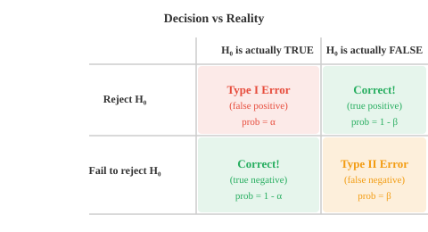

# 假设检验

> **一句话总结**：假设检验提供严谨框架，判断观测到的差异是真实效应还是纯属偶然，是 A/B 测试、模型对比与科研的通用逻辑。

*假设检验给出一套严格的框架，用来判断观测到的效应究竟是真实存在，还是只是运气使然。 本节涵盖零假设与备择假设、p 值、显著性水平、t 检验、卡方检验、方差分析 (Analysis of Variance, ANOVA)，以及第一类和第二类错误 —— 这套逻辑正是 A/B 测试、模型对比与科研中反复用到的.*

- 统计学不只是描述数据。 很多时候你要做决策：新药到底有没有效？一个算法是不是比另一个更快？平均值有没有真的变？假设检验给你一个结构化的框架，用数据回答这些问题。

- 思路其实很简单：先假设"什么都没变" (即零假设)，然后看数据是不是极端到让这个假设难以立足。

- **零假设** ($H_0$) 是默认主张，通常是"无效应"或"无差异"的陈述。 例如："平均送达时间仍是 30 分钟"，或"新模型并不比旧模型好".

- **备择假设** ($H_1$ 或 $H_a$) 是你怀疑可能才对的那个说法："平均送达时间变了"，或"新模型更好".

- 你永远无法直接证明 $H_1$. 你要问的是：如果 $H_0$ 为真，那么看到眼前这么极端的数据的可能性有多大？如果很小，就拒绝 $H_0$，转而支持 $H_1$.

- **检验统计量 (test statistic)** 是一个数，汇总了你的样本结果距离 $H_0$ 预测的位置有多远。 不同检验用不同公式，但逻辑是一样的：度量观测值与预期值之间的距离。

- **p 值 (p-value)** 是：在 $H_0$ 为真的前提下，观察到不小于当前检验统计量的极端结果的概率。 p 值很小，说明数据在 $H_0$ 下显得非常反常。

- **显著性水平** ($\alpha$) 是你在看数据之前就设定的阈值。 若 $p \le \alpha$，就拒绝 $H_0$. 常用的取值是 $\alpha = 0.05$ (5%) 和 $\alpha = 0.01$ (1%).


- 两侧阴影部分就是拒绝域。 如果你的检验统计量落在里面，说明数据在 $H_0$ 下极不寻常，足以拒绝之。 绿色区域表示某个具体检验统计量对应的 p 值。

- 一步一步来看流程:
    - **第 1 步**：写出 $H_0$ 与 $H_1$
    - **第 2 步**：选定显著性水平 $\alpha$
    - **第 3 步**：收集数据，计算检验统计量
    - **第 4 步**：求出 p 值 (或把检验统计量与临界值比较)
    - **第 5 步**：若 $p \le \alpha$，拒绝 $H_0$；否则，无法拒绝 $H_0$

- **实例演算**：某工厂声称自家螺栓平均长度是 10 cm. 你量了 36 颗，样本均值为 10.3 cm. 已知总体标准差为 0.9 cm. 均值是否真的变了?

- $H_0$: $\mu = 10$, $H_1$: $\mu \neq 10$, $\alpha = 0.05$

- 检验统计量 (由于 $\sigma$ 已知且 $n$ 较大，用 z 检验):

$$z = \frac{\bar{x} - \mu_0}{\sigma / \sqrt{n}} = \frac{10.3 - 10}{0.9 / \sqrt{36}} = \frac{0.3}{0.15} = 2.0$$

- 对双侧检验、$\alpha = 0.05$，临界值是 $\pm 1.96$. 我们算出的 $z = 2.0 > 1.96$，所以拒绝 $H_0$. 对应的 p 值大约是 0.046，小于 0.05.

- 结论：有统计上显著的证据表明螺栓的平均长度不等于 10 cm.

- **单侧检验 (one-tailed test)** 只考察一个方向的效应 ($H_1$: $\mu > 10$ 或 $\mu < 10$). 整个 $\alpha$ 都堆到一侧，在该方向上更容易拒绝 $H_0$，但另一侧的效应完全看不到。

- **双侧检验 (two-tailed test)** 检查任何方向的差异 ($H_1$: $\mu \neq 10$). $\alpha$ 被均分到两侧 (每侧 $\alpha/2$). 更保守，但两个方向的效应都能捕捉。

- 就算流程再严谨，错误还是会发生。 错误只有两种:



- **第一类错误 (Type I Error，假阳性)**: $H_0$ 本来是对的，你却拒绝了它。 犯这种错的概率就是 $\alpha$，你可以通过选定显著性水平来控制。 就像没火却响的火警。

- **第二类错误 (Type II Error，假阴性)**: $H_0$ 本来是错的，你却没能拒绝它。 犯这种错的概率记作 $\beta$. 就像着了火却一声不响的火警。

- **功效 (power)** 是 $1 - \beta$，即正确地拒绝一个假的 $H_0$ 的概率。 功效越高，越擅长察觉真实存在的效应。 功效在以下情形会提升:
    - 真实效应量更大 (差距越大越好察觉)
    - 样本量更大 (数据越多越精确)
    - 显著性水平 $\alpha$ 更大 (但这会抬高第一类错误的风险)
    - 变异性更小 (噪声更少)

- 第一类和第二类错误之间存在张力。 把 $\alpha$ 调低 (对假阳性更谨慎)，会把 $\beta$ 抬高 (假阴性变多). 在样本量固定的情况下，你无法同时把两者都压到最小。

- **参数检验 (parametric tests)** 假设数据服从某个特定分布 (通常是正态分布). 假设成立时，它们更强大。

- **z 检验 (Z-test)**：当 $\sigma$ 已知且 $n$ 较大 ($n \ge 30$) 时，用来比较样本均值与某个已知值。 检验统计量:

$$z = \frac{\bar{x} - \mu_0}{\sigma / \sqrt{n}}$$

- **t 检验 (T-test)**：与 z 检验类似，但适用于 $\sigma$ 未知 (改用样本估计) 或 $n$ 较小的情形。 它用的是 t 分布，尾巴比正态分布更厚。 厚尾正是为了体现"用样本估计 $\sigma$"引入的额外不确定性。

$$t = \frac{\bar{x} - \mu_0}{s / \sqrt{n}}$$

- t 分布有一个参数叫**自由度 (degrees of freedom)** ($df = n - 1$). 随着 $df$ 增大，t 分布会越来越接近正态分布。

- t 检验有好几种口味:
    - **单样本 t 检验 (one-sample t-test)**：样本均值和某个特定值是否不同?
    - **独立双样本 t 检验 (independent two-sample t-test)**：两组独立样本的均值是否不同?
    - **配对 t 检验 (paired t-test)**：两组有关联的测量的均值是否不同 (例如同一批受试者的治疗前后)?

- **方差分析 (Analysis of Variance, ANOVA)**：检验三组或更多组的均值是否相等。 相比之下，挨个跑多次 t 检验会抬高第一类错误率；ANOVA 只做一次检验，把组间方差与组内方差做对比。

$$F = \frac{\text{组间方差}}{\text{组内方差}}$$

- $F$ 比值很大，说明各组之间的差异比纯随机波动能造成的差异要大得多。

- **非参数检验 (non-parametric tests)** 对数据分布的假设更少。 它们基于秩 (rank) 而不是原始数值，因而对离群点和非正态数据更稳健。

- **卡方检验 (Chi-square test)** ($\chi^2$)：检验观测频数是否与期望频数相符。 适用于分类数据。 例如：红、蓝、绿三种颜色的车的比例是否与厂商声称的比例一致?

$$\chi^2 = \sum \frac{(O_i - E_i)^2}{E_i}$$

- **Mann-Whitney U 检验**：独立双样本 t 检验的非参数替代品。 它通过比较秩来判断一组是否倾向于取更大的值。

- **Wilcoxon 符号秩检验 (Wilcoxon signed-rank test)**：配对 t 检验的非参数替代品。 它同时考察配对观测差值的大小与方向。

- **Kruskal-Wallis 检验**：单因素 ANOVA 的非参数替代品。 通过比较所有组之间的秩，检验多组是否来自同一个分布。

- **拟合优度检验 (goodness-of-fit tests)** 检查你的数据是否服从某个特定的理论分布。 卡方拟合优度检验就是把各分箱的观测计数与假设分布下的期望计数做对比。

- **正态性检验 (normality tests)** 专门检查数据是否服从正态分布。 常见的有 Shapiro-Wilk 检验 (小样本下功效更强) 和 Kolmogorov-Smirnov 检验 (把样本累积分布函数 (Cumulative Distribution Function, CDF) 与理论 CDF 做对比).

- 在机器学习 (Machine Learning, ML) 里，假设检验常出现在比较模型性能的场景。 如果模型 A 达到 92% 准确率，模型 B 达到 91%，这个差距是真的，还是纯粹的噪声？对交叉验证得分做配对 t 检验就能给出答案。

## 编程练习 (用 CoLab 或 notebook)

1. 对文中螺栓工厂例子做 z 检验。 计算检验统计量、p 值，并给出结论。
```python
import jax.numpy as jnp

x_bar = 10.3    # 样本均值
mu_0 = 10.0     # 零假设下的均值
sigma = 0.9     # 已知的总体标准差
n = 36           # 样本量
alpha = 0.05

# 检验统计量
z = (x_bar - mu_0) / (sigma / jnp.sqrt(n))
print(f"z = {z:.4f}")

# 双侧 p 值, 用正态 CDF 近似
# 对 |z| = 2.0, p ≈ 0.0456
from jax.scipy.stats import norm
p_value = 2 * (1 - norm.cdf(jnp.abs(z)))
print(f"p-value = {p_value:.4f}")
print(f"Reject H₀? {p_value <= alpha}")
```

2. 模拟第一类错误：在 $H_0$ 为真时，我们错误拒绝的频率是多少？跑 10,000 次实验，检查拒绝率是否与 $\alpha$ 相符。
```python
import jax
import jax.numpy as jnp

key = jax.random.PRNGKey(0)
mu_0 = 50.0
sigma = 10.0
n = 30
alpha = 0.05
n_experiments = 10_000

rejections = 0
for i in range(n_experiments):
    key, subkey = jax.random.split(key)
    sample = mu_0 + sigma * jax.random.normal(subkey, shape=(n,))
    z = (sample.mean() - mu_0) / (sigma / jnp.sqrt(n))
    p_value = 2 * (1 - __import__("jax").scipy.stats.norm.cdf(jnp.abs(z)))
    if p_value <= alpha:
        rejections += 1

print(f"Rejection rate: {rejections/n_experiments:.4f}")
print(f"Expected (α):   {alpha}")
```

3. 在两组数据上分别跑 t 检验和 Mann-Whitney U 检验。 构造一组均值略高的数据，看哪种检验能察觉差异。
```python
import jax
import jax.numpy as jnp

key = jax.random.PRNGKey(99)
k1, k2 = jax.random.split(key)

group_a = jax.random.normal(k1, shape=(25,)) * 5 + 100
group_b = jax.random.normal(k2, shape=(25,)) * 5 + 103  # 均值略高

# 双样本 t 检验 (假设方差相等)
n_a, n_b = len(group_a), len(group_b)
mean_a, mean_b = group_a.mean(), group_b.mean()
pooled_var = ((n_a - 1) * group_a.var() + (n_b - 1) * group_b.var()) / (n_a + n_b - 2)
se = jnp.sqrt(pooled_var * (1/n_a + 1/n_b))
t_stat = (mean_a - mean_b) / se
print(f"T-test statistic: {t_stat:.4f}")

# Mann-Whitney: 数一下 group_a 的值有多少次比 group_b 的值小
u_stat = jnp.sum(group_a[:, None] < group_b[None, :])
print(f"Mann-Whitney U:   {u_stat}")
print(f"\nGroup A mean: {mean_a:.2f}, Group B mean: {mean_b:.2f}")
```

---

## 📌 本节要点

- **零假设 $H_0$ 与备择假设 $H_1$**：前者是"无效应"的默认主张，后者是我们想证据支持的说法，我们只拒绝或不拒绝 $H_0$，从不"证明" $H_1$.
- **p 值**：在 $H_0$ 为真时，观察到不小于当前检验统计量的极端结果的概率，p 值越小数据越反常。
- **显著性水平 $\alpha$**：事先设定的拒绝门槛，常取 0.05 或 0.01, $p \le \alpha$ 时拒绝 $H_0$.
- **单侧 vs 双侧检验**：单侧只查一个方向、更易拒绝，双侧允许任一方向差异、更保守。
- **第一类错误 $\alpha$ 与第二类错误 $\beta$**：前者是"没火却报警"，后者是"着火却没报警"，二者存在此消彼长的张力。
- **功效 $1 - \beta$**：正确察觉真实效应的能力，随效应量、样本量、$\alpha$ 增大、噪声减少而提升。
- **z 检验与 t 检验**: $\sigma$ 已知用 z 检验，未知或小样本用 t 检验，后者尾更厚以补偿估计 $\sigma$ 的不确定性。
- **ANOVA 与 $F$ 比值**：用组间方差与组内方差之比一次性比较多组均值，避免多次 t 检验抬高第一类错误率。
- **非参数替代品**: Mann-Whitney U、Wilcoxon 符号秩、Kruskal-Wallis 分别对应独立 t、配对 t、单因素 ANOVA，对分布假设更宽松。
- **卡方检验**：面向分类数据，比较观测频数与期望频数，也用于拟合优度检验。