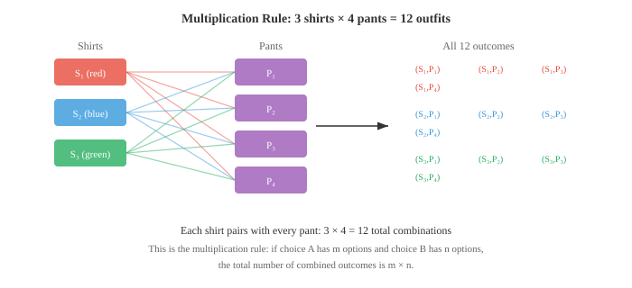
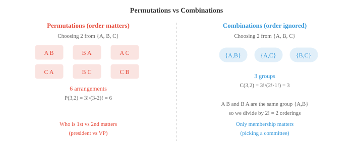

# 计数

> **一句话总结**：概率的前提是数清结果；本节讲加法/乘法法则、阶乘、排列、组合与二项系数，为后续概率、采样与分布打地基。

## 🗺️ 本章导览

- 本章覆盖概率论：计数 → 概念 → 分布 → 贝叶斯 → 信息论
- **01. 计数** (本节)：排列组合、二项系数
- **02. 概率概念**：事件、条件概率、独立性
- **03. 概率分布**：常见离散与连续分布
- **04. 贝叶斯方法**：先验、后验、贝叶斯定理与推断
- **05. 信息论**：熵、KL 散度、互信息，通往 ML 目标函数

*计数是计算概率的前提：你必须先知道有多少种结果，才能给它们分配可能性。本节涵盖乘法与加法法则、阶乘、排列、组合以及二项系数——这些组合工具支撑着机器学习中的采样、哈希与概率分析。*

- 想算概率，得先会数结果。要知道拿到一手赢牌的机会有多大，得先知道扑克里总共有多少种手牌、其中有多少能赢。计数就是让概率精确起来的机器。

- 最简单的计数原理是**乘法法则**。若一个决定有 $m$ 种选择，另一个独立决定有 $n$ 种选择，组合起来的总结果数就是 $m \times n$。

- 想象一下早上穿衣服。你有 3 件衬衫和 4 条裤子。每件衬衫都能配每条裤子，所以有 $3 \times 4 = 12$ 种可能的穿搭。



- 乘法法则可以推广到任意多个选择。如果你还有 2 双鞋，总穿搭数就变成 $3 \times 4 \times 2 = 24$。每多一个独立的选择，就再乘一次。

- **加法法则**处理 "或" 的场景。如果事件 A 有 $m$ 种发生方式，事件 B 有 $n$ 种发生方式，且两者不能同时发生 (互斥)，那么总共有 $m + n$ 种方式。

- 假设你从城市 X 到城市 Y 可以开车 (3 条路) 或坐火车 (2 条路)。你不能同时用两种方式，所以总选项是 $3 + 2 = 5$。

- 当事件重叠时，就得减掉被重复计算的那部分。若 $A$ 和 $B$ 可以同时发生，则计数为 $|A \cup B| = |A| + |B| - |A \cap B|$。这就是容斥原理 (inclusion-exclusion principle)，它在后面讨论概率加法法则时还会再出现。

- 非负整数 $n$ 的**阶乘** (factorial) 是从 $1$ 到 $n$ 所有正整数的乘积:

$$n! = n \times (n-1) \times (n-2) \times \cdots \times 2 \times 1$$

- 把阶乘想成回答这个问题：把 $n$ 个不同的物体排成一列，有多少种排法？书架上三本书可以有 $3! = 3 \times 2 \times 1 = 6$ 种排列方式。约定 $0! = 1$。

- 阶乘增长极快。$10! = 3{,}628{,}800$，而 $20!$ 已经超过 $2.4 \times 10^{18}$。正是这种爆炸式增长，让组合问题中的暴力搜索变得不切实际。

- **排列** (permutation) 是有序的排布。从 $n$ 个不同物体中取 $r$ 个，且顺序重要，排列数为:

$$P(n, r) = \frac{n!}{(n - r)!}$$

- 想象从一个 10 人俱乐部里选出主席、副主席和司库。第一个职位有 10 位候选人，第二个还剩 9 位，第三个还剩 8 位，得到 $P(10, 3) = 10 \times 9 \times 8 = 720$。公式也印证了这一点：$\frac{10!}{7!} = 720$。

- **组合** (combination) 是无序的挑选。从 $n$ 个里选 $r$ 个，顺序不重要时，我们要把重复的排序除掉:

$$C(n, r) = \binom{n}{r} = \frac{n!}{r!(n - r)!}$$

- 记号 $\binom{n}{r}$ 读作 "n 选 r"。关键洞察是：每个组合对应 $r!$ 种排列 (被选中的 $r$ 个物体可以以 $r!$ 种方式重排)，所以我们把排列数除以 $r!$。



- 例子：从 10 个人里挑出一个 3 人委员会，有多少种挑法？顺序不重要 (没有主席副主席之分，都是普通成员)，所以用组合:

$$\binom{10}{3} = \frac{10!}{3! \cdot 7!} = \frac{10 \times 9 \times 8}{3 \times 2 \times 1} = 120$$

- 同样是这 10 个人，能产生 720 种排列，却只有 120 种组合，因为每组 3 人内部有 $3! = 6$ 种排序。

- 组合是概率的核心。二项系数 (binomial coefficient) $\binom{n}{r}$ 数的是 $n$ 次试验中恰好 $r$ 次成功的方式数，这正是二项分布的心脏 (第 03 节会讲)。

- 我们来做一个经典的委员会题，把前面几个计数思路串起来。

- **问题**：一个俱乐部有 8 名男性和 6 名女性。组成一个 5 人委员会，其中恰好包含 3 名男性和 2 名女性，有多少种方式?

- **第 1 步**：从 8 名男性中选 3 名。

$$\binom{8}{3} = \frac{8!}{3! \cdot 5!} = \frac{8 \times 7 \times 6}{3 \times 2 \times 1} = 56$$

- **第 2 步**：从 6 名女性中选 2 名。

$$\binom{6}{2} = \frac{6!}{2! \cdot 4!} = \frac{6 \times 5}{2 \times 1} = 15$$

- **第 3 步**：用乘法法则。每一种男性选法都能与每一种女性选法配对:

$$56 \times 15 = 840 \text{ 种委员会}$$

- 这种套路——把复杂计数题拆成互相独立的小选择，再相乘——正是组合数学里的标准招式。

- 还有**允许重复的排列**。物体可以重复时，从 $n$ 类中取 $r$ 个的结果数为 $n^r$。一个用 0-9 数字组成的 4 位 PIN 码有 $10^4 = 10{,}000$ 种可能。每一位有 10 种选择，剩下的交给乘法法则。

- **允许重复的组合** (又叫 "隔板法", stars and bars) 计算的是：从 $n$ 类里选 $r$ 个，允许重复且顺序不重要时的方式数:

$$\binom{n + r - 1}{r} = \frac{(n + r - 1)!}{r!(n - 1)!}$$

- 例子：从 4 种冰淇淋口味里挑 3 勺 (允许重复)，共有 $\binom{4 + 3 - 1}{3} = \binom{6}{3} = 20$ 种选法。

- 把计数工具箱总结一下:

| 场景 | 公式 |
|---|---|
| 有序、不重复 (排列) | $P(n,r) = \frac{n!}{(n-r)!}$ |
| 无序、不重复 (组合) | $\binom{n}{r} = \frac{n!}{r!(n-r)!}$ |
| 有序、可重复 | $n^r$ |
| 无序、可重复 | $\binom{n+r-1}{r}$ |

- 只要结果等可能，概率计算都用公式 $P(\text{事件}) = \frac{\text{有利结果数}}{\text{总结果数}}$。计数给了我们分子和分母。有了这个基础，我们就可以在下一节正式定义概率了。

## 编程练习 (用 CoLab 或 notebook)

1. 用阶乘公式和直接计算两种方式算出 $P(10, 3)$ 和 $\binom{10}{3}$。验证排列数总是组合数的 $r!$ 倍。
```python
import jax.numpy as jnp
from math import factorial

n, r = 10, 3

perm = factorial(n) // factorial(n - r)
comb = factorial(n) // (factorial(r) * factorial(n - r))

print(f"P({n},{r}) = {perm}")
print(f"C({n},{r}) = {comb}")
print(f"P / C = {perm // comb} (should equal {r}! = {factorial(r)})")
```

2. 用程序解上面的委员会问题 (从 8 男中选 3，从 6 女中选 2)，并通过枚举所有合法委员会来验证。
```python
from itertools import combinations
from math import factorial

def comb_count(n, r):
    return factorial(n) // (factorial(r) * factorial(n - r))

# 公式法
men_ways = comb_count(8, 3)
women_ways = comb_count(6, 2)
print(f"Formula: {men_ways} × {women_ways} = {men_ways * women_ways}")

# 枚举法
men = [f"M{i}" for i in range(1, 9)]
women = [f"W{i}" for i in range(1, 7)]
count = sum(1 for _ in combinations(men, 3) for _ in combinations(women, 2))
print(f"Enumeration: {count}")
```

3. 数一下用 26 个小写字母能组成多少个 4 字符密码 (允许重复)，再数出其中没有重复字母的有多少。
```python
from math import factorial

n = 26
r = 4

with_rep = n ** r
without_rep = factorial(n) // factorial(n - r)

print(f"With repetition:    {with_rep:>10,}")
print(f"Without repetition: {without_rep:>10,}")
print(f"Fraction with repeats: {1 - without_rep/with_rep:.2%}")
```

4. 模拟生日问题：在一个 $k$ 人的小组里，至少两人生日相同的概率是多少？画出 $k = 1$ 到 $60$ 的概率曲线，并找出它越过 50% 的位置。
```python
import jax
import jax.numpy as jnp
import matplotlib.pyplot as plt

def birthday_prob_exact(k):
    """k 人小组中至少两人生日相同的概率。"""
    p_no_match = 1.0
    for i in range(k):
        p_no_match *= (365 - i) / 365
    return 1 - p_no_match

ks = list(range(1, 61))
probs = [birthday_prob_exact(k) for k in ks]

plt.figure(figsize=(8, 4))
plt.plot(ks, probs, color="#3498db", linewidth=2)
plt.axhline(y=0.5, color="#e74c3c", linestyle="--", alpha=0.7, label="50%")
cross = next(k for k, p in zip(ks, probs) if p >= 0.5)
plt.axvline(x=cross, color="#e74c3c", linestyle="--", alpha=0.7)
plt.xlabel("Group size (k)")
plt.ylabel("P(at least one shared birthday)")
plt.title(f"Birthday Problem (crosses 50% at k={cross})")
plt.legend()
plt.grid(alpha=0.3)
plt.show()
```

---

## 📌 本节要点

- **乘法法则**：独立选择相乘，$m$ 选与 $n$ 选组合起来得 $m \times n$ 种结果。
- **加法法则**：互斥事件相加；有重叠时用容斥原理 $|A \cup B| = |A| + |B| - |A \cap B|$。
- **阶乘 $n!$**：数 $n$ 个不同物体的线性排列数，规定 $0! = 1$，增长极快。
- **排列 $P(n,r)$**：有序取 $r$ 个，等于 $n!/(n-r)!$。
- **组合 $\binom{n}{r}$**：无序取 $r$ 个，等于 $n!/[r!(n-r)!]$，是排列数除以 $r!$。
- **二项系数**: $\binom{n}{r}$ 数的是 $n$ 次试验中恰好 $r$ 次成功的方式数，直接支撑二项分布。
- **可重复计数**：有序可重复用 $n^r$；无序可重复用 $\binom{n+r-1}{r}$ (隔板法)。
- **计数 → 概率**：结果等可能时，$P(\text{事件}) = \frac{\text{有利结果数}}{\text{总结果数}}$，计数同时给出分子与分母。