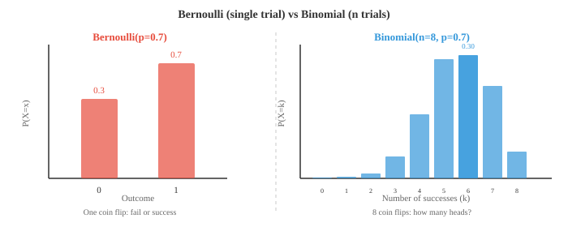
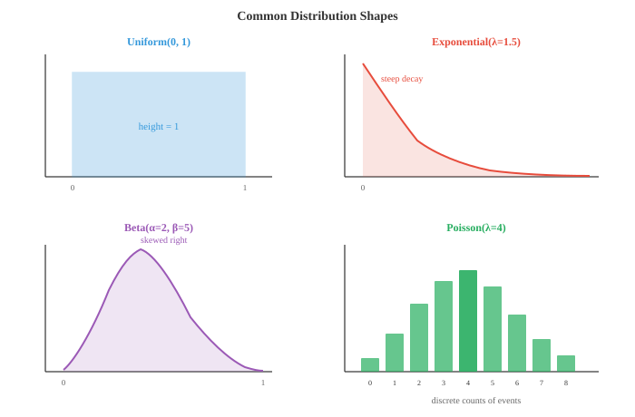

# 概率分布

> **一句话总结**: 概率分布描述随机结果在可能取值上的分布规律, 本节盘点离散与连续两大家族的核心分布, 给出公式、直觉与 ML 场景 (损失函数、先验、噪声模型).

*概率分布描述随机结果在可能取值上的分布规律。本文盘点关键的离散与连续分布 —— 伯努利、二项、泊松、高斯、指数、贝塔等等, 逐一给出公式、直觉, 以及它们在机器学习中的用途 (损失函数、先验、噪声模型).*

- 在第 4 章我们介绍了随机变量、概率质量函数 (Probability Mass Function, PMF)、概率密度函数 (Probability Density Function, PDF) 和累积分布函数 (Cumulative Distribution Function, CDF). 本节盘点你在机器学习 (Machine Learning, ML) 与统计学里最常遇到的概率分布, 逐个给出直觉、公式、均值与方差.

- 三个核心函数的快速回顾 (完整定义见第 4 章):
    - **PMF** $P(X = x)$: 给出每个离散结果的概率. 就是柱状图里的那些柱子.
    - **PDF** $f(x)$: 给出连续变量在每一点上的密度. 曲线在两点之间围出的面积就是那段的概率.
    - **CDF** $F(x) = P(X \le x)$: 到 $x$ 为止的累积概率. 值从 0 到 1, 且单调不减.

- 分布的**支撑集** (support) 是 PMF 或 PDF 取正值的那些点. 一颗骰子的支撑集是 $\{1,2,3,4,5,6\}$; 正态分布的支撑集是全体实数 $(-\infty, \infty)$.

- 分布整齐地分成两大家族: 离散型 (结果可数, 用 PMF) 与连续型 (结果不可数, 用 PDF).

- **伯努利分布 (Bernoulli distribution)**: 最简单的分布. 单次试验, 两种结果: 成功 (1) 概率为 $p$, 失败 (0) 概率为 $1-p$.

$$P(X = x) = p^x (1 - p)^{1-x}, \quad x \in \{0, 1\}$$

- 均值: $E[X] = p$. 方差: $\text{Var}(X) = p(1-p)$.

- 每一次抛硬币, 每一次 yes/no 分类, 每一个二元结果, 都是一次伯努利试验. 在 ML 里, Sigmoid 函数的输出就正是伯努利分布的参数 $p$.

- **二项分布 (Binomial distribution)**: 数一数 $n$ 次独立伯努利试验中成功的次数, 每次试验成功概率都是 $p$.

$$P(X = k) = \binom{n}{k} p^k (1-p)^{n-k}, \quad k = 0, 1, \ldots, n$$

- 第 01 节介绍过的二项系数 $\binom{n}{k}$, 数的是"$n$ 次试验里挑 $k$ 次成功"有多少种排法.

- 均值: $E[X] = np$. 方差: $\text{Var}(X) = np(1-p)$.



- 例子: 抛一枚有偏硬币 ($p = 0.7$) 八次. 正好出现 6 次正面的概率是 $\binom{8}{6}(0.7)^6(0.3)^2 = 28 \times 0.1176 \times 0.09 \approx 0.296$.

- **泊松分布 (Poisson distribution)**: 在给定平均发生率 $\lambda$ 的前提下, 数一数在固定时间或空间区间内事件发生的次数. 适合稀有且独立的事件.

$$P(X = k) = \frac{\lambda^k e^{-\lambda}}{k!}, \quad k = 0, 1, 2, \ldots$$

- 均值: $E[X] = \lambda$. 方差: $\text{Var}(X) = \lambda$. 均值等于方差, 这是它的招牌性质.

- 例子: 每小时收到的邮件数 ($\lambda = 5$)、每页错别字数、每秒服务器请求数. 在 ML 里, 泊松回归用来对计数数据建模 —— 换成线性模型的话可能会预测出负数.

- 当 $n \to \infty$、$p \to 0$、乘积 $np = \lambda$ 保持不变时, Binomial$(n,p)$ 收敛到 Poisson$(\lambda)$. 这就是为什么泊松分布特别适合"大总体里的稀有事件".

- **几何分布 (Geometric distribution)**: 数一数直到首次成功之前一共做了多少次试验. "抛硬币要抛几次, 才能第一次抛出正面?"

$$P(X = k) = (1-p)^{k-1} p, \quad k = 1, 2, 3, \ldots$$

- 均值: $E[X] = 1/p$. 方差: $\text{Var}(X) = (1-p)/p^2$.

- 几何分布是**无记忆的** (memoryless): 再等 $k$ 次才成功的概率, 与你之前已经等了多久无关. 这在离散分布里独此一家.

- **负二项分布 (Negative Binomial distribution)**: 几何分布的推广 —— 数的是直到第 $r$ 次成功一共做了多少次试验 (几何分布就是 $r=1$ 的特例).

$$P(X = k) = \binom{k-1}{r-1} p^r (1-p)^{k-r}, \quad k = r, r+1, r+2, \ldots$$

- 均值: $E[X] = r/p$. 方差: $\text{Var}(X) = r(1-p)/p^2$.

- 实践中, 负二项分布也常用来建模**过离散** (overdispersed) 的计数数据 —— 方差大于均值的那类数据, 泊松分布搞不定, 它可以.

- 现在我们进入连续分布.

- **均匀分布 (Uniform distribution)**: 区间 $[a, b]$ 上所有值取到的概率都一样. PDF 是一条平坦的矩形.

$$f(x) = \frac{1}{b - a}, \quad a \le x \le b$$

- 均值: $E[X] = \frac{a+b}{2}$. 方差: $\text{Var}(X) = \frac{(b-a)^2}{12}$.

- 随机数生成器都是先产出 Uniform(0,1) 样本作起点, 其他分布再通过变换这些均匀样本得到.

- **正态分布 (高斯分布, Normal / Gaussian distribution)**: 统计学里最重要的分布. 它由中心极限定理 (见第 4 章) 自然涌现: 大量独立随机变量的平均值, 无论原分布是什么, 都会趋近正态分布.

$$f(x) = \frac{1}{\sigma\sqrt{2\pi}} \exp\!\left(-\frac{(x - \mu)^2}{2\sigma^2}\right)$$

- 均值: $E[X] = \mu$. 方差: $\text{Var}(X) = \sigma^2$.

- **标准正态分布** (standard normal) 是 $\mu = 0$、$\sigma = 1$ 的特例. 任何正态变量 $X$ 都可以通过 $Z = (X - \mu)/\sigma$ 标准化成标准正态 $Z$.


- **经验法则** (empirical rule, 也叫 68-95-99.7 法则) 说:
    - 约 68% 的数据落在均值的 $\pm 1\sigma$ 之内
    - 约 95% 落在 $\pm 2\sigma$ 之内
    - 约 99.7% 落在 $\pm 3\sigma$ 之内

- 在 ML 里, 正态分布无处不在: 权重初始化、数据增强中的噪声、均方误差 (Mean Squared Error, MSE) 损失背后的隐含假设 (它默认误差是高斯的), 还有变分自编码器 (Variational Autoencoder, VAE) 里的重参数化技巧.

- **指数分布 (Exponential distribution)**: 建模泊松过程中相邻两次事件之间的等待时间. 若事件以速率 $\lambda$ 到达, 相邻事件之间的等待时间就服从 Exponential$(\lambda)$.

$$f(x) = \lambda e^{-\lambda x}, \quad x \ge 0$$

- 均值: $E[X] = 1/\lambda$. 方差: $\text{Var}(X) = 1/\lambda^2$.

- 就像几何分布对离散变量那样, 指数分布也是**无记忆的**: $P(X > s + t | X > s) = P(X > t)$. 再等 $t$ 个单位的概率, 与你之前已经等了多久无关.

- **伽马分布 (Gamma distribution)**: 指数分布的推广. 它建模的是泊松过程中直到第 $\alpha$ 次事件发生的等待时间 (指数分布就是 $\alpha = 1$).

$$f(x) = \frac{\beta^\alpha}{\Gamma(\alpha)} x^{\alpha - 1} e^{-\beta x}, \quad x > 0$$

- 这里 $\alpha$ (形状) 控制形状, $\beta$ (速率) 控制尺度. $\Gamma(\alpha)$ 是伽马函数, 它把阶乘推广到了实数: 对正整数 $n$ 有 $\Gamma(n) = (n-1)!$.

- 均值: $E[X] = \alpha/\beta$. 方差: $\text{Var}(X) = \alpha/\beta^2$.

- **贝塔分布 (Beta distribution)**: 定义在区间 $[0, 1]$ 上, 用来建模概率、比例、比率再合适不过.

$$f(x) = \frac{x^{\alpha - 1}(1 - x)^{\beta - 1}}{B(\alpha, \beta)}, \quad 0 \le x \le 1$$

- 分母 $B(\alpha, \beta) = \frac{\Gamma(\alpha)\Gamma(\beta)}{\Gamma(\alpha + \beta)}$ 叫贝塔函数, 是归一化常数.

- 均值: $E[X] = \frac{\alpha}{\alpha + \beta}$. 方差: $\text{Var}(X) = \frac{\alpha\beta}{(\alpha+\beta)^2(\alpha+\beta+1)}$.

- 贝塔分布是伯努利与二项似然的**共轭先验** (conjugate prior). 意思是: 先验若为贝塔、数据是伯努利, 那后验也是贝塔 —— 贝叶斯更新在解析上就可以直接算. 我们会在第 04 节用到这一点.



- **卡方分布 (Chi-squared distribution, $\chi^2$)**: 取 $k$ 个独立的标准正态随机变量, 把它们的平方加起来, 结果就服从自由度为 $k$ 的 $\chi^2$ 分布.

$$f(x) = \frac{1}{2^{k/2}\Gamma(k/2)} x^{k/2 - 1} e^{-x/2}, \quad x > 0$$

- 均值: $E[X] = k$. 方差: $\text{Var}(X) = 2k$.

- $\chi^2$ 分布其实是伽马分布的特例, 对应 $\alpha = k/2$、$\beta = 1/2$. 它出现在假设检验 (第 4 章的卡方检验)、拟合优度检验, 以及方差的置信区间计算中.

- **学生 t 分布 (Student's t-distribution)**: 长得像正态分布, 但尾部更重. 当你用小样本估计正态总体的均值、又不知道总体方差时, 它就出场了.

$$f(x) = \frac{\Gamma\!\left(\frac{\nu+1}{2}\right)}{\sqrt{\nu\pi}\,\Gamma\!\left(\frac{\nu}{2}\right)} \left(1 + \frac{x^2}{\nu}\right)^{-(\nu+1)/2}$$

- 参数 $\nu$ (读作 nu) 是自由度. 当 $\nu \to \infty$, t 分布收敛到标准正态. $\nu$ 较小时, 更重的尾部给极端值分配了更多概率, 反映了小样本带来的额外不确定性.

- 均值: $E[X] = 0$ (当 $\nu > 1$). 方差: $\text{Var}(X) = \frac{\nu}{\nu - 2}$ (当 $\nu > 2$).

- t 分布用于 t 检验 (第 4 章), 在贝叶斯推断中, 当我们对未知方差积分掉时, 它也会以边缘分布的形式冒出来.

- 关键分布汇总如下:

| 分布 | 类型 | 支撑集 | 均值 | 方差 |
|---|---|---|---|---|
| Bernoulli$(p)$ | 离散 | $\{0,1\}$ | $p$ | $p(1-p)$ |
| Binomial$(n,p)$ | 离散 | $\{0,\ldots,n\}$ | $np$ | $np(1-p)$ |
| Poisson$(\lambda)$ | 离散 | $\{0,1,2,\ldots\}$ | $\lambda$ | $\lambda$ |
| Geometric$(p)$ | 离散 | $\{1,2,3,\ldots\}$ | $1/p$ | $(1-p)/p^2$ |
| Uniform$(a,b)$ | 连续 | $[a,b]$ | $(a+b)/2$ | $(b-a)^2/12$ |
| Normal$(\mu,\sigma^2)$ | 连续 | $(-\infty,\infty)$ | $\mu$ | $\sigma^2$ |
| Exponential$(\lambda)$ | 连续 | $[0,\infty)$ | $1/\lambda$ | $1/\lambda^2$ |
| Gamma$(\alpha,\beta)$ | 连续 | $(0,\infty)$ | $\alpha/\beta$ | $\alpha/\beta^2$ |
| Beta$(\alpha,\beta)$ | 连续 | $[0,1]$ | $\alpha/(\alpha+\beta)$ | 见上文 |
| $\chi^2(k)$ | 连续 | $(0,\infty)$ | $k$ | $2k$ |
| Student's $t(\nu)$ | 连续 | $(-\infty,\infty)$ | $0$ | $\nu/(\nu-2)$ |

## 编程练习 (使用 CoLab 或 notebook)

1. 画出 $n=20$、若干个 $p$ 值下的二项分布 PMF. 观察形状如何从左偏 → 对称 → 右偏.
```python
import jax.numpy as jnp
import matplotlib.pyplot as plt
from math import comb

n = 20
ks = jnp.arange(0, n + 1)

fig, axes = plt.subplots(1, 3, figsize=(12, 4), sharey=True)
for ax, p, color in zip(axes, [0.2, 0.5, 0.8], ["#e74c3c", "#3498db", "#27ae60"]):
    pmf = jnp.array([comb(n, int(k)) * p**k * (1-p)**(n-k) for k in ks])
    ax.bar(ks, pmf, color=color, alpha=0.7)
    ax.set_title(f"Binomial(n={n}, p={p})")
    ax.set_xlabel("k")
axes[0].set_ylabel("P(X = k)")
plt.tight_layout()
plt.show()
```

2. 验证泊松对二项的近似. 取 $n = 1000$、$p = 0.003$, 对比 Binomial$(n, p)$ 与 Poisson$(\lambda = np)$.
```python
import jax.numpy as jnp
import matplotlib.pyplot as plt
from math import comb, factorial, exp

n, p = 1000, 0.003
lam = n * p
ks = jnp.arange(0, 15)

binom_pmf = jnp.array([comb(n, int(k)) * p**k * (1-p)**(n-k) for k in ks])
poisson_pmf = jnp.array([lam**k * exp(-lam) / factorial(int(k)) for k in ks])

plt.figure(figsize=(8, 4))
plt.bar(ks - 0.15, binom_pmf, width=0.3, color="#3498db", alpha=0.7, label=f"Binomial({n},{p})")
plt.bar(ks + 0.15, poisson_pmf, width=0.3, color="#e74c3c", alpha=0.7, label=f"Poisson({lam})")
plt.xlabel("k")
plt.ylabel("P(X = k)")
plt.title("Poisson approximation to Binomial")
plt.legend()
plt.show()
```

3. 从正态分布抽样, 验证经验法则. 统计落在 1、2、3 个标准差之内的样本比例.
```python
import jax
import jax.numpy as jnp

key = jax.random.PRNGKey(42)
mu, sigma = 5.0, 2.0
samples = mu + sigma * jax.random.normal(key, shape=(100_000,))

for k in [1, 2, 3]:
    within = jnp.abs(samples - mu) <= k * sigma
    print(f"Within {k}σ: {within.mean():.4f} (expected: {[0.6827, 0.9545, 0.9973][k-1]:.4f})")
```

4. 通过改变 $\alpha$ 与 $\beta$ 探索贝塔分布. 画出多种形状, 观察分布如何从均匀 → 偏斜 → 集中变化.
```python
import jax
import jax.numpy as jnp
import matplotlib.pyplot as plt

x = jnp.linspace(0.01, 0.99, 200)

def beta_pdf(x, a, b):
    # 未归一化, 仅用于形状对比
    return x**(a-1) * (1-x)**(b-1)

plt.figure(figsize=(10, 5))
params = [(1,1,"Uniform"), (2,5,"Left skew"), (5,2,"Right skew"),
          (5,5,"Symmetric"), (0.5,0.5,"U-shape")]
colors = ["#999", "#e74c3c", "#3498db", "#27ae60", "#9b59b6"]

for (a, b, label), color in zip(params, colors):
    y = beta_pdf(x, a, b)
    y = y / jnp.trapezoid(y, x)  # 归一化
    plt.plot(x, y, label=f"α={a}, β={b} ({label})", color=color, linewidth=2)

plt.xlabel("x")
plt.ylabel("Density")
plt.title("Beta distribution shapes")
plt.legend()
plt.grid(alpha=0.3)
plt.show()
```

---

## 📌 本节要点

- **PMF / PDF / CDF**: 分别刻画离散概率、连续密度与累积概率, 是所有分布的三种"视角".
- **伯努利分布**: 单次二元试验 $p$ / $1-p$; Sigmoid 输出可直接看作它的参数.
- **二项分布**: $n$ 次独立伯努利里数成功次数; 均值 $np$, 方差 $np(1-p)$.
- **泊松分布**: 固定窗口内稀有事件计数, 均值 = 方差 = $\lambda$; 是二项 $n\to\infty$、$p\to 0$ 的极限.
- **几何 / 指数分布**: 分别是离散与连续版的"等待时间", 均具**无记忆性**.
- **正态分布**: 由中心极限定理自然涌现; ML 里权重初始化、MSE 假设、VAE 重参数化都靠它.
- **经验法则**: 正态数据约 68 / 95 / 99.7% 落在 $\pm 1 / 2 / 3\sigma$ 之内.
- **伽马与贝塔分布**: 伽马建模第 $\alpha$ 次事件到达时间; 贝塔定义在 $[0,1]$ 上, 是伯努利/二项的**共轭先验**.
- **卡方与 t 分布**: 卡方是标准正态平方和, 用于假设检验; t 分布用小样本估均值时的重尾正态替代品.
- **共轭先验**: 先验与后验属于同一族, 让贝叶斯更新解析可算 —— 贝塔 + 伯努利就是经典组合.
