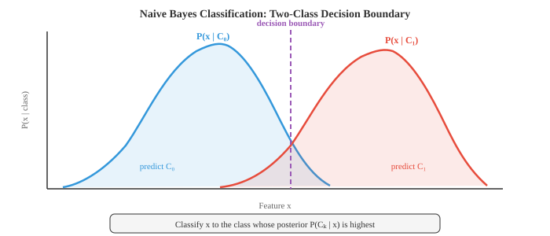
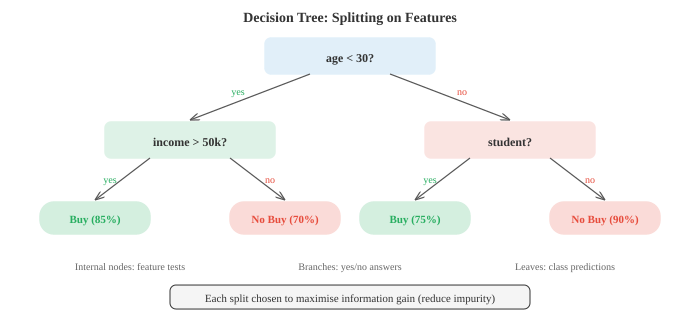
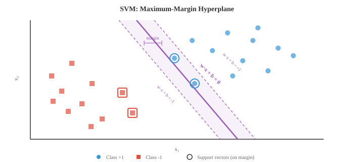

# 经典机器学习

> **一句话总结**：经典机器学习不靠梯度下降，而是用闭式解或启发式搜索从数据中学模式，涵盖朴素贝叶斯、k 近邻、决策树、随机森林、SVM、k 均值与 PCA 等基石算法。

## 🗺️ 本章导览

- 本章覆盖 ML 全景：经典 → 梯度方法 → 深度学习 → 强化学习 → 分布式训练
- **01. 经典机器学习** (本节)：线性回归、逻辑回归、SVM、决策树、集成方法
- **02. 梯度机器学习**：目标函数、梯度下降与变体
- **03. 深度学习**：前馈网络、反向传播、卷积神经网络 (Convolutional Neural Network, CNN)、循环神经网络 (Recurrent Neural Network, RNN) 基础
- **04. 强化学习**: MDP、Q-learning、策略梯度、Actor-Critic
- **05. 分布式深度学习**：数据/模型并行、参数服务器、Ring AllReduce

*经典机器学习 (Machine Learning, ML) 算法不需要显式编程，而是通过闭式解或启发式搜索、而非梯度下降从数据中学模式。 本节涵盖朴素贝叶斯 (Naive Bayes)、k 近邻 (k-Nearest Neighbors, k-NN)、决策树、随机森林、支持向量机 (Support Vector Machine, SVM)、k 均值聚类以及主成分分析 (Principal Component Analysis, PCA).*

- 机器学习研究的是这样一类算法：它们通过从数据中学习来提升在某项任务上的表现，而不是靠人写死规则。 你不用再写 "if 收入 > 50k and 年龄 < 30 then 批准贷款"，而是把成千上万条历史贷款决策交给算法，让它自己找出模式。

- 大方向有三种范式。 **监督学习 (supervised learning)** 用带标签的数据，即每个输入都配好了已知的正确输出，算法要学的是从输入到输出的映射。 **无监督学习 (unsupervised learning)** 处理无标签数据，试图挖掘隐藏结构，比如聚类或压缩表示。 **强化学习 (reinforcement learning)** 通过试错来学，在环境中执行动作后接收奖励或惩罚 (详见本章第 04 节).

- 在监督学习内部，**分类 (classification)** 预测离散类别 (垃圾邮件还是正常邮件，猫还是狗), **回归 (regression)** 预测连续值 (房价、明天的气温). 二者的边界并不总是清晰：逻辑回归 (logistic regression) 名字里带 "回归"，但做的其实是分类。

- 概率模型里有个关键区分：**生成式 vs 判别式 (generative vs discriminative)**. 生成式模型学的是联合分布 $P(x, y)$，意思是它理解数据本身是怎么生成的，因此可以采样出新样本。 判别式模型直接学 $P(y \mid x)$，只关心类别之间的边界。 朴素贝叶斯属于生成式；逻辑回归 (第 02 节) 属于判别式。 生成式模型更灵活但难训练好；判别式模型在数据足够时通常给出更好的分类准确率。

- **朴素贝叶斯 (Naive Bayes)** 是最简单也最有效的分类器之一。 它直接套用贝叶斯定理 (见第 05 章):

$$P(C_k \mid x) = \frac{P(x \mid C_k) \, P(C_k)}{P(x)}$$

- "朴素" 之处在于一个很强的独立性假设：给定类别后，它把每个特征都当作独立。 拿垃圾邮件分类举例，朴素贝叶斯会假设：一旦你知道邮件是垃圾邮件，出现单词 "free" 对是否出现单词 "winner" 就没有任何影响。 现实中几乎不可能成立，但这个分类器居然还挺好用。

- 因为 $P(x)$ 对所有类别都相同，分类就简化为挑出让分子最大的那个类:

$$\hat{y} = \arg\max_{k} \; P(C_k) \prod_{i=1}^{n} P(x_i \mid C_k)$$

- 先验 $P(C_k)$ 就是每个类别在训练集中的占比。 似然 $P(x_i \mid C_k)$ 则取决于特征的种类，由此衍生出三种常见变体。

- **多项式朴素贝叶斯 (Multinomial Naive Bayes)** 面向计数型数据，比如文档里的词频。 每个特征 $x_i$ 代表词 $i$ 出现了多少次，似然服从多项式分布。 它是文本分类、情感分析、垃圾邮件过滤的标配。

- **高斯朴素贝叶斯 (Gaussian Naive Bayes)** 假设每个类别下每个特征都服从正态分布。 从训练数据估出特征 $i$ 在类别 $k$ 下的均值 $\mu_{ik}$ 与方差 $\sigma_{ik}^2$，再算:

$$P(x_i \mid C_k) = \frac{1}{\sqrt{2\pi\sigma_{ik}^2}} \exp\!\left(-\frac{(x_i - \mu_{ik})^2}{2\sigma_{ik}^2}\right)$$

- 当特征是连续测量值 (身高、体重、传感器读数) 时，这是自然选择。



- **伯努利朴素贝叶斯 (Bernoulli Naive Bayes)** 建模二值特征：特征要么存在 (1) 要么不存在 (0). 你不数某个词出现几次，只关心它有没有出现。 这对短文本或二值特征向量很合适。

- 有个实际问题：训练集里如果某个特征值从未与某类别同时出现过，那对应的似然就是 0，由于所有项是连乘，整个后验会直接塌成 0. **拉普拉斯平滑 (Laplace smoothing)** 解决办法是给每一对 "特征值-类别" 组合都加一个小计数 (通常是 1):

$$P(x_i \mid C_k) = \frac{\text{count}(x_i, C_k) + \alpha}{\text{count}(C_k) + \alpha \cdot V}$$

- 其中 $\alpha$ 是平滑参数 (一般取 1), $V$ 是该特征可能取值的个数。 这样任何概率都不会精确为 0.

- **决策树 (decision tree)** 走的是完全不同的路线。 它不算概率，而是用一连串 yes/no 问题把特征空间切开。 想象 "二十个问题" 游戏：每一步都问那个能把可能性缩得最狠的问题。

- 一棵树从根节点开始，手握全部训练样本。 每个内部节点挑一个特征和一个阈值来分裂 (比如 "年龄 < 30 吗?"). 样本根据答案流向左或右。 递归下去，直到叶节点，叶节点给出预测：分类任务用多数类，回归任务用均值。



- 关键问题是：到底该按哪个特征分裂？你想要的分裂能让子节点尽可能 "纯"，即绝大多数样本属于同一类。 两个常用的不纯度度量是 **基尼不纯度 (Gini impurity)** 与 **熵 (entropy)**.

- **基尼不纯度** 衡量：如果按节点内的分布随机给一个样本贴标签，它被错分的概率:

$$\text{Gini}(S) = 1 - \sum_{k=1}^{K} p_k^2$$

- 如果节点完全纯 (全部同类)，基尼为 0. 如果类别完全均衡 (二分类就是 50/50)，基尼取到最大值 0.5.

- **熵** (来自第 05 章信息论那一节) 衡量平均意外度:

$$H(S) = -\sum_{k=1}^{K} p_k \log_2 p_k$$

- 纯节点熵为 0. 完全均衡的二分类节点熵为 1 bit. 实践中，基尼和熵给出的树非常相似；基尼不用算对数，速度略快一点。

- **对齐 sklearn API**：在 `sklearn.tree.DecisionTreeClassifier` 与 `RandomForestClassifier` 里，这两个准则通过 `criterion` 参数切换。 分类树的合法取值是 `"gini"` (默认)、`"entropy"` 与 `"log_loss"` (后两者等价，都算香农熵)；回归树 (`DecisionTreeRegressor`) 的 `criterion` 则是 `"squared_error"` (默认)、`"friedman_mse"`、`"absolute_error"` 或 `"poisson"`，对应上面提到的方差下降那一类分裂准则。 sklearn 默认基尼是有原因的：大多数数据集上两者精度差别在噪声范围内，而基尼省掉了对数运算，训练更快 [scikit-learn Decision Trees User Guide, sklearn.tree.DecisionTreeClassifier v1.5 API].

- **信息增益 (information gain)** 是一次分裂带来的不纯度下降。 对于把集合 $S$ 分成 $S_L$ 和 $S_R$ 的分裂:

$$\text{IG}(S, \text{split}) = H(S) - \frac{|S_L|}{|S|} H(S_L) - \frac{|S_R|}{|S|} H(S_R)$$

- 算法在每个节点贪心地挑信息增益最大的分裂。 这是局部最优、不是全局最优，但在实践中效果不错。

- **回归树 (regression tree)** 机制一样，只是叶节点预测连续值 (落到该叶的样本的均值)，分裂准则换成方差下降，而不是基尼或熵。

- 不加约束的话，决策树会一直分裂到每个叶都纯，本质就是把训练集背下来，这是严重的过拟合。 **剪枝 (pruning)** 是解药。 预剪枝在生长阶段就设限：最大深度、每叶最少样本数、或分裂所需的最小信息增益。 后剪枝先把完整树长出来，再砍掉那些在验证集上不带来提升的分支。

- 单棵决策树好解释，但不稳定：数据里一点小变动可能长出一棵完全不同的树。 **集成方法 (ensemble methods)** 通过组合多个模型，拿到单模型达不到的预测效果。

- 核心思想是 "群体智慧". 让 100 个平庸的分类器投票，只要它们的错误之间某种程度上相互独立，集成的结果可以非常优秀。

- **Bagging** (bootstrap aggregating，自助聚合) 在数据的不同随机子集上训练多个模型，每个子集是有放回抽样 (bootstrap 样本)，每个模型大约看到原始数据的 63%. 预测时，回归取输出均值、分类取多数票。 由于各模型看到的数据不同，犯的错也不同，一平均，方差就被抵消掉大半。

- **随机森林 (Random Forest)** 是把 Bagging 用在决策树上，外加一个小花招：每次分裂时，树只考虑随机子集的特征 (通常从 $d$ 个特征里挑 $\sqrt{d}$ 个). 这进一步让树之间去相关，集成更强。 随机森林是整个机器学习里最可靠的 "拿来就能用" 分类器之一。


- **Boosting (提升)** 走的是相反的哲学。 它不独立训练模型，而是顺序训练，每个新模型专注于前面模型做错的样本。

- **AdaBoost** (Adaptive Boosting，自适应提升) 给每个训练样本维护一个权重。 初始权重相等。 训完一个弱学习器 (通常是很浅的决策树，叫 "树桩") 后，被错分的样本权重被抬高，下一个学习器就会多关注它们。 最终预测是所有学习器的加权投票，表现好的学习器话语权更大:

$$H(x) = \text{sign}\!\left(\sum_{t=1}^{T} \alpha_t \, h_t(x)\right)$$

- 学习器 $t$ 的权重 $\alpha_t$ 取决于它的错误率 $\epsilon_t$:

$$\alpha_t = \frac{1}{2} \ln\!\left(\frac{1 - \epsilon_t}{\epsilon_t}\right)$$

- 错误率低的学习器拿到大正权重；表现只等同于抛硬币 ($\epsilon = 0.5$) 的权重为 0.

- **梯度提升 (Gradient Boosting)** 把这个思路推广。 它不再给样本重新加权，而是让每个新模型去拟合当前集成的残差 (损失函数的负梯度). 对平方误差损失，残差就是预测与目标的差值。 决策树上的梯度提升 (Gradient Boosted Decision Trees, GBDT) 是结构化数据竞赛里许多冠军方案的核心 (XGBoost、LightGBM、CatBoost 都是流行实现).

- 关键对比：Bagging 降 **方差 (variance)** (平均掉噪声), Boosting 降 **偏差 (bias)** (纠正系统性错误). 单模型容易过拟合时选 Bagging，单模型欠拟合时选 Boosting.

- 转到无监督学习，**K 均值聚类 (K-Means clustering)** 是最简单也是最常用的聚类算法。 给定 $n$ 个数据点与目标簇数 $K$，它把每个点分到 $K$ 组之一，目标是让每个点到所在簇中心的总距离最小。

- 算法交替两步。 第一步，**分配**：每个点归到最近的簇中心。 第二步，**更新**：每个簇中心变成分配给它的所有点的均值。 反复直到分配不再变化。 由于簇内总距离在每一步都不会上升，收敛是有保证的。


- 严格地讲，K 均值最小化簇内平方和，又叫 **惯量 (inertia)**:

$$J = \sum_{k=1}^{K} \sum_{x \in C_k} \|x - \mu_k\|^2$$

- 其中 $\mu_k$ 是簇 $C_k$ 的中心。

- K 均值对初始化很敏感。 起始簇心选得不好会陷入糟糕的局部极小。 **K-Means++** 初始化策略是：第一个簇心随机选，之后每个新簇心以 "到当前最近簇心的平方距离" 为概率来选。 这样初始点会散得开，结果几乎总是更好。

- **空簇处理 (empty cluster handling)**：更新步骤中，如果某个簇没被任何点分配到 (即 $|C_k| = 0$)，均值 $\mu_k$ 就是 0/0，数值上退化为 NaN. 常见对策有两种：(a) **随机重初始化**，从数据中随机挑一个点作为新簇心；(b) **最远点重初始化 (farthest-point reinit)**，挑当前离最近簇心最远的那个点作为新簇心，相当于就地补一次 K-Means++ 采样。 scikit-learn 的实现走的是最远点策略 (据 scikit-learn 官方文档 2024).

- $K$ 怎么选？有两个常用工具。 **肘部法 (elbow method)** 画出惯量随 $K$ 的曲线，找那个 "拐点"，拐点之后加簇不再显著降低惯量。 **轮廓系数 (silhouette score)** 衡量一个点与自己簇的相似度和与最近其他簇的相似度之比，范围 -1 (分错簇) 到 +1 (分得漂亮). 所有点轮廓系数取均值，就是整体聚类质量的度量。

- K 均值也有局限：它假设簇是球形且大小接近，而且做 "硬" 分配 (每个点属于且仅属于一个簇). **高斯混合模型 (Gaussian Mixture Model, GMM)** 把这两个限制都松开。

- GMM 把数据建模为 $K$ 个高斯分布的混合，每个高斯有自己的均值 $\mu_k$、协方差 $\Sigma_k$ 与混合权重 $\pi_k$ (权重之和为 1):

$$P(x) = \sum_{k=1}^{K} \pi_k \, \mathcal{N}(x \mid \mu_k, \Sigma_k)$$

- 不再是硬分配，每个点得到 **软分配 (soft assignment)**：属于每个簇的概率 (叫 "责任度"). 一个位于两个高斯边界的点，可能 60% 属于簇 A、40% 属于簇 B.

- GMM 用 **期望最大化 (Expectation-Maximization, EM) 算法** 拟合，与 K 均值一样两步交替。 **E 步 (E-step)** 计算责任度：对每个点，它来自每个高斯的概率是多少？**M 步 (M-step)** 更新参数：给定责任度，最佳的均值、协方差、混合权重是什么？EM 保证每一轮数据似然都不下降，收敛到局部极大。

- K 均值其实是 EM + GMM 的特例：对应等协方差的球形高斯与 (0/1) 硬责任度。

- **支持向量机 (Support Vector Machine, SVM)** 从几何视角看分类。 给定两个线性可分的类，能分开它们的超平面有无数条。 SVM 挑那条 **最大间隔 (maximum margin)** 的，即超平面到两侧最近点之间的间隙最大。

- 那些最近点，正好落在间隔边缘上的点，叫 **支持向量 (support vectors)*. 它们是唯一决定边界的点；其他训练点删掉也不影响超平面。



- 对线性分类器 $f(x) = w \cdot x + b$，求最大间隔等价于解:

$$\min_{w, b} \; \frac{1}{2}\|w\|^2 \quad \text{subject to} \quad y_i(w \cdot x_i + b) \geq 1 \; \text{for all } i$$

- 这是一个凸二次规划，有唯一全局解 (不用担心局部极小).

- 真实数据几乎不会完全可分。 **软间隔 SVM (soft-margin SVM)** 引入松弛变量 $\xi_i \geq 0$，允许一些点越界:

$$\min_{w, b, \xi} \; \frac{1}{2}\|w\|^2 + C \sum_{i=1}^{n} \xi_i \quad \text{subject to} \quad y_i(w \cdot x_i + b) \geq 1 - \xi_i$$

- 超参数 $C$ 控制权衡：$C$ 大就狠罚错分 (更贴数据，可能过拟合), $C$ 小则容许更多越界 (间隔更宽，更正则化).

- SVM 最强的招式是 **核技巧 (kernel trick)**. 很多在原特征空间线性不可分的数据集，映射到更高维空间后就变得可分。 核技巧让你在那个高维空间里算点积，而不用显式做映射。

- 核函数 $K(x_i, x_j) = \phi(x_i) \cdot \phi(x_j)$ 替换掉 SVM 优化里每一个点积。 最常用的是 **径向基函数 (Radial Basis Function, RBF) 核**:

$$K(x_i, x_j) = \exp\!\left(-\gamma \|x_i - x_j\|^2\right)$$

- RBF 核隐式把数据映到无穷维空间。 参数 $\gamma$ 控制单个训练点的影响范围：$\gamma$ 大意味着每个点只影响它周围一小圈 (可能过拟合), $\gamma$ 小则给出更平滑的边界。

- 其他常见核有多项式核 $K(x_i, x_j) = (x_i \cdot x_j + c)^d$ 与线性核 $K(x_i, x_j) = x_i \cdot x_j$ (线性核就是不做任何变换的标准 SVM).

- 实践中，在深度学习接管以前，带 RBF 核的 SVM 长期是分类王者。 到今天它在中小规模数据上仍然好用，特别是特征维度相对样本数很大的情况。

- SVM 与第 02 章 (矩阵) 的联系很深。 它的优化通常在对偶形式下解，解只依赖训练样本之间的点积，这正是让核技巧成立的关键。 整个算法都在内积与线性代数的语言里运作。

- 经典 ML 工具箱小结:

| 算法 | 类型 | 主要优势 | 主要弱点 |
|---|---|---|---|
| 朴素贝叶斯 | 监督 (生成式) | 快，数据少也能用 | 独立性假设 |
| 决策树 | 监督 | 可解释 | 容易过拟合 |
| 随机森林 | 监督 (集成) | 稳健，超参数少 | 可解释性下降 |
| 梯度提升 | 监督 (集成) | 表格数据上的 SOTA | 慢，需调参 |
| K 均值 | 无监督 (聚类) | 简单，可扩展 | 假设球形簇 |
| GMM | 无监督 (聚类) | 软分配，形状灵活 | 对初始化敏感 |
| SVM | 监督 | 高维空间下有效 | 大数据集慢 |

## Coding Tasks (use CoLab or notebook)

1. 从零实现高斯朴素贝叶斯。 在合成的 2D 两类数据上训练并可视化决策边界。 与 scikit-learn 的实现对比。
```python
import jax.numpy as jnp
import matplotlib.pyplot as plt
from sklearn.datasets import make_classification

# 生成合成数据
X, y = make_classification(n_samples=300, n_features=2, n_redundant=0,
                           n_informative=2, n_clusters_per_class=1, random_state=42)
X, y = jnp.array(X), jnp.array(y)

# 从零拟合高斯朴素贝叶斯
classes = jnp.unique(y)
params = {}
for c in classes:
    c = int(c)
    mask = y == c
    X_c = X[mask]
    params[c] = {
        'mean': jnp.mean(X_c, axis=0),
        'var': jnp.var(X_c, axis=0),
        'prior': jnp.sum(mask) / len(y)
    }

def gaussian_log_likelihood(x, mean, var):
    return -0.5 * jnp.sum(jnp.log(2 * jnp.pi * var) + (x - mean)**2 / var)

def predict(X):
    preds = []
    for x in X:
        log_posts = []
        for c in [0, 1]:
            log_post = jnp.log(params[c]['prior']) + gaussian_log_likelihood(
                x, params[c]['mean'], params[c]['var'])
            log_posts.append(log_post)
        preds.append(jnp.argmax(jnp.array(log_posts)))
    return jnp.array(preds)

# 决策边界可视化
xx, yy = jnp.meshgrid(jnp.linspace(X[:,0].min()-1, X[:,0].max()+1, 200),
                       jnp.linspace(X[:,1].min()-1, X[:,1].max()+1, 200))
grid = jnp.column_stack([xx.ravel(), yy.ravel()])
zz = predict(grid).reshape(xx.shape)

plt.figure(figsize=(8, 6))
plt.contourf(xx, yy, zz, alpha=0.3, cmap='coolwarm')
plt.scatter(X[y==0, 0], X[y==0, 1], c='#3498db', label='Class 0', edgecolors='k', s=20)
plt.scatter(X[y==1, 0], X[y==1, 1], c='#e74c3c', label='Class 1', edgecolors='k', s=20)
plt.title("Gaussian Naive Bayes Decision Boundary")
plt.legend()
plt.grid(alpha=0.3)
plt.show()

accuracy = jnp.mean(predict(X) == y)
print(f"Training accuracy: {accuracy:.2%}")
```

2. 构建用基尼不纯度分裂的决策树。 实现单个节点的分裂逻辑，展示信息增益如何挑出最好的特征与阈值。
```python
import jax.numpy as jnp

def gini_impurity(y):
    """标签数组的基尼不纯度."""
    classes, counts = jnp.unique(y, return_counts=True)
    probs = counts / len(y)
    return 1.0 - jnp.sum(probs ** 2)

def information_gain(y, left_mask):
    """按布尔掩码把 y 分成 left/right 后的信息增益."""
    parent_gini = gini_impurity(y)
    left_y, right_y = y[left_mask], y[~left_mask]
    n = len(y)
    if len(left_y) == 0 or len(right_y) == 0:
        return 0.0
    child_gini = (len(left_y)/n) * gini_impurity(left_y) + \
                 (len(right_y)/n) * gini_impurity(right_y)
    return float(parent_gini - child_gini)

def best_split(X, y):
    """找出让信息增益最大的特征与阈值."""
    best_ig, best_feat, best_thresh = -1, None, None
    for feat in range(X.shape[1]):
        thresholds = jnp.unique(X[:, feat])
        for thresh in thresholds:
            mask = X[:, feat] <= float(thresh)
            ig = information_gain(y, mask)
            if ig > best_ig:
                best_ig, best_feat, best_thresh = ig, feat, float(thresh)
    return best_feat, best_thresh, best_ig

# 例: 合成数据
from sklearn.datasets import make_classification
X, y = make_classification(n_samples=100, n_features=4, n_redundant=0, random_state=0)
X, y = jnp.array(X), jnp.array(y)

feat, thresh, ig = best_split(X, y)
print(f"Best split: feature {feat}, threshold {thresh:.3f}, info gain {ig:.4f}")
print(f"Parent Gini: {gini_impurity(y):.4f}")
mask = X[:, feat] <= thresh
print(f"Left Gini:   {gini_impurity(y[mask]):.4f} ({int(jnp.sum(mask))} samples)")
print(f"Right Gini:  {gini_impurity(y[~mask]):.4f} ({int(jnp.sum(~mask))} samples)")
```

3. 从零实现带 K-Means++ 初始化的 K 均值。 对合成数据集聚类，并可视化每次迭代的簇结果。
```python
import jax
import jax.numpy as jnp
import matplotlib.pyplot as plt
from sklearn.datasets import make_blobs

# 生成合成簇
X, y_true = make_blobs(n_samples=300, centers=4, cluster_std=0.8, random_state=42)
X = jnp.array(X)

def kmeans_plus_plus_init(X, K, key):
    """K-Means++ 初始化."""
    n = X.shape[0]
    idx = jax.random.randint(key, (), 0, n)
    centroids = [X[idx]]
    for _ in range(1, K):
        dists = jnp.min(jnp.stack([jnp.sum((X - c)**2, axis=1) for c in centroids]), axis=0)
        probs = dists / jnp.sum(dists)
        key, subkey = jax.random.split(key)
        idx = jax.random.choice(subkey, n, p=probs)
        centroids.append(X[idx])
    return jnp.stack(centroids)

def kmeans(X, K, max_iters=20, key=jax.random.PRNGKey(0)):
    centroids = kmeans_plus_plus_init(X, K, key)
    history = [centroids]
    for _ in range(max_iters):
        # 分配步骤
        dists = jnp.stack([jnp.sum((X - c)**2, axis=1) for c in centroids])
        labels = jnp.argmin(dists, axis=0)
        # 更新步骤
        new_centroids = jnp.stack([
            jnp.mean(X[labels == k], axis=0) for k in range(K)
        ])
        history.append(new_centroids)
        if jnp.allclose(centroids, new_centroids):
            break
        centroids = new_centroids
    return labels, centroids, history

K = 4
labels, centroids, history = kmeans(X, K)

# 画出最终结果
colors = ['#3498db', '#e74c3c', '#27ae60', '#9b59b6']
plt.figure(figsize=(8, 6))
for k in range(K):
    mask = labels == k
    plt.scatter(X[mask, 0], X[mask, 1], c=colors[k], s=20, alpha=0.6)
    plt.scatter(centroids[k, 0], centroids[k, 1], c=colors[k], marker='X',
                s=200, edgecolors='k', linewidths=1.5)
plt.title(f"K-Means Clustering (K={K}, {len(history)-1} iterations)")
plt.grid(alpha=0.3)
plt.show()

# 计算惯量
inertia = sum(jnp.sum((X[labels == k] - centroids[k])**2) for k in range(K))
print(f"Final inertia: {inertia:.2f}")
```

4. 演示核技巧。 通过对多项式核比较 "核矩阵" 与 "显式特征映射后的点积"，说明 RBF 核在高维空间里算的确实是点积。
```python
import jax.numpy as jnp

# 简单 2D 数据
X = jnp.array([[1.0, 2.0], [3.0, 4.0], [5.0, 6.0]])

# 多项式核: K(x,y) = (x·y + 1)^2
def poly_kernel(X, degree=2, c=1.0):
    return (X @ X.T + c) ** degree

# 2D 的显式二次特征映射: (1, sqrt(2)*x1, sqrt(2)*x2, x1^2, x2^2, sqrt(2)*x1*x2)
def poly_features(X):
    x1, x2 = X[:, 0], X[:, 1]
    return jnp.column_stack([
        jnp.ones(len(X)),
        jnp.sqrt(2) * x1,
        jnp.sqrt(2) * x2,
        x1 ** 2,
        x2 ** 2,
        jnp.sqrt(2) * x1 * x2
    ])

K_trick = poly_kernel(X)
phi = poly_features(X)
K_explicit = phi @ phi.T

print("Kernel trick (polynomial degree 2):")
print(K_trick)
print("\nExplicit feature map dot products:")
print(K_explicit)
print(f"\nMatrices match: {jnp.allclose(K_trick, K_explicit)}")

# RBF 核: 没有有限的显式映射
def rbf_kernel(X, gamma=0.5):
    sq_dists = jnp.sum(X**2, axis=1, keepdims=True) + \
               jnp.sum(X**2, axis=1) - 2 * X @ X.T
    return jnp.exp(-gamma * sq_dists)

K_rbf = rbf_kernel(X)
print("\nRBF kernel matrix:")
print(K_rbf)
print("Diagonal is always 1 (a point is identical to itself)")
print("Off-diagonal entries decay with distance")
```

---

## 📌 本节要点

- **机器学习范式**：监督学习学映射，无监督学习挖结构，强化学习靠试错。
- **生成式 vs 判别式**：前者学联合分布 $P(x, y)$ 可采样，后者直接学 $P(y \mid x)$ 更擅分类。
- **朴素贝叶斯**：强独立性假设 + 贝叶斯定理，简单快速，三种变体 (多项式/高斯/伯努利) 应对不同特征。
- **拉普拉斯平滑**：给每个特征-类别对加小计数，避免零概率吞掉整个后验。
- **决策树**：用基尼或熵找信息增益最大的分裂，直观但易过拟合，需剪枝或限深。
- **Bagging vs Boosting**: Bagging 并行降方差 (随机森林), Boosting 串行降偏差 (AdaBoost、梯度提升).
- **K 均值与 GMM**: K 均值做硬分配 + 假设球形簇；GMM 用 EM 做软分配，支持椭圆形簇。
- **SVM 最大间隔**：只支持向量决定超平面，软间隔用 $C$ 权衡，核技巧把线性方法送进高维。
- **RBF 核**：隐式映射到无穷维，$\gamma$ 越大边界越弯，深度学习之前的分类王者。
- **算法选型**：表格数据首选梯度提升，高维小样本用 SVM，需要可解释性选决策树，数据稀少上朴素贝叶斯。