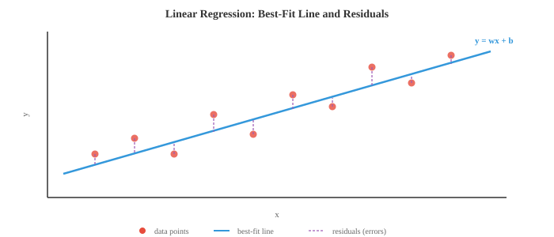
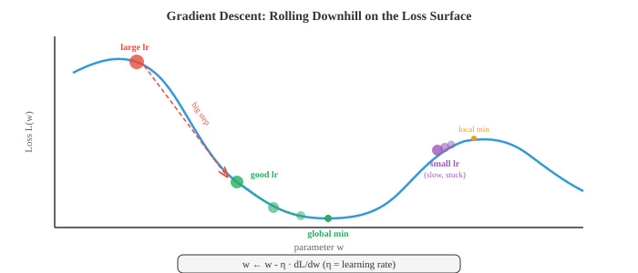

# 梯度机器学习

> **一句话总结**: 梯度学习靠"顺着损失曲面的坡度走"迭代更新参数, 从线性回归到最大的神经网络都靠它, 本节覆盖线性/逻辑回归、优化器族、正则化与偏差-方差权衡.

*基于梯度的学习通过反复顺着损失曲面的坡度走来优化模型参数. 本节覆盖线性回归、逻辑回归、Softmax 分类、梯度下降的各种变体、正则化 (L1/L2) 与偏差-方差权衡.*

- 文件 01 里的经典方法要么靠巧妙的启发式, 要么靠闭式解. 本节要讲的算法则完全不同: 它们靠跟随梯度学习, 在损失曲面上小步下山, 直到找到好参数. 基于梯度的学习是从线性回归到最大规模神经网络背后的共同引擎.

- **线性回归 (linear regression)** 是最简单的梯度模型, 同时又有闭式解, 是完美的起点. 模型就是一条直线 (在高维就是一个超平面):

$$\hat{y} = w \cdot x + b = \sum_{i=1}^{d} w_i x_i + b$$

- 换成矩阵记号 (来自第 02 章): 把所有训练输入按行堆成矩阵 $X$, 再把偏置吸收进 $w$ (给 $X$ 加一列 1), 上式就变成 $\hat{y} = Xw$.

- 目标是最小化**均方误差 (Mean Squared Error, MSE)**, 也就是预测值和真实值差的平方的平均:

$$\mathcal{L}(w) = \frac{1}{n} \sum_{i=1}^{n} (y_i - \hat{y}_i)^2 = \frac{1}{n} \|y - Xw\|^2$$

- 为什么用平方误差? 它有概率上的理由: 假设目标由 $y = Xw + \epsilon$ 生成, 其中 $\epsilon \sim \mathcal{N}(0, \sigma^2)$, 那么最大化高斯似然 (第 05 章) 就等价于最小化 MSE. 平方误差还有一个好处: 它对大错误的惩罚远重于小错误, 这在很多场景里正是我们想要的.



- 因为 MSE 是 $w$ 的二次函数, 它有唯一的全局最小值, 我们可以解析地求出来. 对 $w$ 求导, 令导数为零, 就得到**正规方程 (normal equation)**:

$$w^{*} = (X^T X)^{-1} X^T y$$

- 这直接用到了第 02 章的矩阵逆. 其中 $X^T X$ 是 $d \times d$ 矩阵 ($d$ 是特征数), $X^T y$ 是 $d$ 维向量. 正规方程一步就给出最优权重.

- 正规方程什么时候会挂? 当 $X^T X$ 奇异 (不可逆) 时, 也就是特征线性相关, 或特征数比样本数还多 ($d > n$). 这时就得靠正则化 (下面会讲) 或梯度下降.

- **逻辑回归 (logistic regression)** 把线性模型改造成二分类模型. 我们不想输出一个连续值, 而想要一个 0 到 1 之间的概率. **Sigmoid 函数**正好把任何实数压到这个区间:

$$\sigma(z) = \frac{1}{1 + e^{-z}}$$

- 模型先算 $z = w \cdot x + b$ (一个线性打分, 和线性回归一样), 再过一次 Sigmoid: $\hat{y} = \sigma(w \cdot x + b)$. 输出 $\hat{y}$ 就解释成 $P(y = 1 \mid x)$.


- Sigmoid 有几个好性质: $\sigma(0) = 0.5$, $z \to \infty$ 时 $\sigma(z) \to 1$, $z \to -\infty$ 时 $\sigma(z) \to 0$, 而且它的导数有个非常漂亮的形式 $\sigma'(z) = \sigma(z)(1 - \sigma(z))$.

- 逻辑回归的损失函数是**二元交叉熵 (Binary Cross-Entropy, BCE)**, 它直接从伯努利似然 (第 05 章) 推出来:

$$\mathcal{L} = -\frac{1}{n} \sum_{i=1}^{n} \left[ y_i \log(\hat{y}_i) + (1 - y_i) \log(1 - \hat{y}_i) \right]$$

- 真实标签是 1 时, 只有第一项起作用, 它惩罚偏低的预测; 真实标签是 0 时, 只有第二项起作用, 它惩罚偏高的预测. 对数让 "自信但错" 的预测代价极高: 真实标签是 1 却预测 0.01, 代价远比预测 0.4 高得多.

- 和线性回归的 MSE 不一样, 最小化 BCE 没有闭式解. 我们需要一种迭代方法: **梯度下降 (gradient descent)**.

- 梯度下降的直觉很简单: 想象你站在雾里的山坡上 (也就是损失曲面). 你看不见全局最低点, 但你能感觉到脚下的坡度. 你就往下坡方向迈一步, 再感觉一次坡度, 再迈一步, 就这么反复, 最后就滚到某个山谷.

$$w \leftarrow w - \eta \frac{\partial \mathcal{L}}{\partial w}$$

- 学习率 (learning rate) $\eta$ 控制步长. 步长太大, 你会跨过山谷, 来回乱撞不收敛; 步长太小, 你就慢慢蠕动, 甚至可能卡在某个局部极小值里.



- 梯度 $\frac{\partial \mathcal{L}}{\partial w}$ 是一个指向最陡上升方向的向量. 我们要下山, 所以取负号. 这就是第 03 章的链式法则应用在损失函数上.

- **批量梯度下降 (batch gradient descent)** 每一步都用整个训练集算梯度. 梯度精确, 但当 $n$ 很大时非常昂贵.

- **随机梯度下降 (Stochastic Gradient Descent, SGD)** 每一步只用一个随机样本. 梯度是有噪声的 (只用一个样本估计真实梯度), 但每步极快. 噪声本身有时能帮助跳出浅的局部极小值.

- **小批量梯度下降 (mini-batch gradient descent)** 折中: 每步用 $B$ 个样本 (常见是 32、64 或 256). 它平衡了计算效率 (整批做向量化操作) 和梯度质量. 几乎所有深度学习都在用小批量 SGD.

- **反向传播 (backpropagation)** 是我们在参数超多的模型 (比如神经网络) 里实际计算梯度的方式. 它就是第 03 章的链式法则, 沿着计算图有系统地走一遍.

- 任何模型都能表示成一张有向无环图: 输入进来, 乘权重、加和、过非线性、最后产出一个损失. **前向传播 (forward pass)** 是数据从输入流到输出、算出损失的过程.

- **反向传播 (backward pass)** 让梯度反向流. 从损失出发, 一路用链式法则算出损失对每个中间量的偏导. 如果 $L$ 依赖 $z$, $z$ 又依赖 $w$, 就有:

$$\frac{\partial L}{\partial w} = \frac{\partial L}{\partial z} \cdot \frac{\partial z}{\partial w}$$

- 每个节点只需要知道自己的局部导数, 以及从上游流下来的梯度. 这让反向传播既模块化又高效: 反向的代价大约是前向的两倍 (前向一次 + 反向一次).

- 原始 SGD 有个毛病: 它在陡峭方向来回震荡, 在平坦方向进展缓慢. **优化器 (optimizer)** 通过利用梯度历史来自适应地调整步长, 改善了这一点.

- **带动量的 SGD (SGD with momentum)** 维护一个过去梯度的滑动平均 (指数移动平均, 见第 04 章). 它平滑掉震荡, 沿着一致方向加速:

$$v_t = \beta v_{t-1} + (1 - \beta) \nabla \mathcal{L}$$
$$w \leftarrow w - \eta \, v_t$$

- 想象一个球在下坡: 动量让它在一致方向上累积速度, 同时抑制侧向抖动. 典型取值是 $\beta = 0.9$.

- **Nesterov 加速梯度 (Nesterov Accelerated Gradient, NAG)** 是一个小而聪明的改动: 不在当前位置算梯度, 而在 "预看" 位置 $w - \eta \beta v_{t-1}$ 算梯度. 这个修正步能减少冲过头:

$$v_t = \beta \, v_{t-1} + \nabla \mathcal{L}(w - \eta \beta \, v_{t-1})$$
$$w \leftarrow w - \eta \, v_t$$

- **Adagrad** 给每个参数配一个自适应学习率: 收到大梯度的参数, 学习率会变小, 反之变大. 它累加梯度的平方:

$$G_t = G_{t-1} + g_t^2, \quad w \leftarrow w - \frac{\eta}{\sqrt{G_t + \epsilon}} g_t$$

- 问题是: $G_t$ 只增不减, 有效学习率单调下降, 最终小到学不动.

- **RMSprop** 用指数移动平均替代累加和来解决这个问题, 最近的梯度权重比远古的大:

$$s_t = \beta \, s_{t-1} + (1 - \beta) g_t^2, \quad w \leftarrow w - \frac{\eta}{\sqrt{s_t + \epsilon}} g_t$$

- **Adam** (自适应矩估计, Adaptive Moment Estimation) 把动量和 RMSprop 合起来. 它同时维护一阶矩估计 (梯度的均值, 像动量) 和二阶矩估计 (梯度平方的均值, 像 RMSprop):

$$m_t = \beta_1 m_{t-1} + (1 - \beta_1) g_t$$
$$v_t = \beta_2 v_{t-1} + (1 - \beta_2) g_t^2$$

- 由于 $m_t$ 和 $v_t$ 从零初始化, 训练早期它们会偏向零. 偏差修正 (bias correction) 修好这一点:

$$\hat{m}_t = \frac{m_t}{1 - \beta_1^t}, \quad \hat{v}_t = \frac{v_t}{1 - \beta_2^t}$$

$$w \leftarrow w - \frac{\eta}{\sqrt{\hat{v}_t} + \epsilon} \hat{m}_t$$


- 默认超参数 ($\beta_1 = 0.9$, $\beta_2 = 0.999$, $\epsilon = 10^{-8}$) 在很广泛的问题上都好用, 这也是为什么 Adam 是大多数深度学习工作的默认优化器.

- **AdamW** 把权重衰减 (weight decay) 从梯度更新里解耦出来. 标准 L2 正则化和权重衰减在 SGD 下等价, 但在 Adam 下不等价. AdamW 把权重衰减直接施加在参数上, 而不是把 $\lambda w$ 加进梯度里. 这带来更好的泛化, 目前已是 Transformer 训练的标配:

$$w \leftarrow w - \eta \left( \frac{\hat{m}_t}{\sqrt{\hat{v}_t} + \epsilon} + \lambda \, w \right)$$

- **LION** (演化的符号动量, EvoLved Sign Momentum) 是一种通过程序搜索发现的新优化器. 它只用动量更新的**符号**(不管幅度), 让每次更新的规模都均匀. LION 比 Adam 更省内存 (不用二阶矩缓冲区), 在很多任务上能打平甚至超过 Adam:

$$w \leftarrow w - \eta \cdot \text{sign}(\beta_1 \, m_{t-1} + (1 - \beta_1) \, g_t)$$
$$m_t = \beta_2 \, m_{t-1} + (1 - \beta_2) \, g_t$$

- **Muon** (动量 + 正交化, Momentum + Orthogonalisation) 先做 Nesterov 动量, 再用 Newton-Schulz 迭代对更新矩阵做正交化 —— 这个过程近似极分解 (polar decomposition). 得到的更新方向落在 Stiefel 流形上, 意味着每次更新在所有奇异方向上的幅度大致相等, 没有任何单一方向能主导. 这样就不再需要自适应的二阶矩估计 (没有像 Adam 那样的 $v_t$ 缓冲), 显著省内存. Muon 在 Transformer 训练上已经拿出很强的结果, 常常能在更快收敛的同时匹配 AdamW 的质量, 尤其是在注意力和 MLP 权重矩阵上. 嵌入层和输出层通常仍然交给 AdamW.

$$G_t = \text{NesterovMomentum}(\nabla \mathcal{L})$$
$$U_t = \text{NewtonSchulz}(G_t) \approx G_t (G_t^T G_t)^{-1/2}$$
$$W \leftarrow W - \eta \, U_t$$

- Newton-Schulz 迭代通过反复执行 $X_{k+1} = \frac{1}{2} X_k (3I - X_k^T X_k)$ (通常 5-10 步) 来算出正交因子. 这避免了做完整奇异值分解 (Singular Value Decomposition, SVD) 的高昂代价, 又能给出一个不错的近似.


- 除了 MSE 和 BCE, 还有几种常用的**损失函数 (loss function)**.

- **平均绝对误差 (Mean Absolute Error, MAE)**, 也叫 L1 损失, 取绝对差的平均: $\frac{1}{n}\sum|y_i - \hat{y}_i|$. 它比 MSE 更抗离群点, 因为它不对大误差平方.

- **Huber 损失 (Huber loss)** 兼具两者优点: 小误差时表现得像 MSE (平滑, 易优化), 大误差时表现得像 MAE (抗离群点). 它有一个阈值 $\delta$ 控制切换点.

- **多类交叉熵 (Categorical Cross-Entropy, CCE)** 把 BCE 推广到多分类. 若 $\hat{y}_k$ 是模型给类别 $k$ 的预测概率, 真实类别是 $c$, 则:

$$\mathcal{L} = -\log(\hat{y}_c)$$

- 这就是正确类别的负对数概率. 最小化交叉熵等价于最大化似然, 这又和第 05 章的信息论对上了: 交叉熵衡量的是用预测分布代替真实分布时需要多出多少比特.

- **合页损失 (hinge loss)** 是支持向量机 (Support Vector Machine, SVM) 用的: $\mathcal{L} = \max(0, 1 - y \cdot f(x))$. 它只惩罚落在错误一侧或在间隔 (margin) 内的预测. 一旦一个点被以足够置信度正确分类, 损失就是 0.

- **正则化 (regularisation)** 通过给复杂模型加惩罚来防止过拟合. 加了正则化的损失是:

$$\mathcal{L}_{\text{reg}} = \mathcal{L}_{\text{data}} + \lambda \, R(w)$$

- **L2 正则化 (Ridge, 也叫权重衰减 weight decay)** 惩罚权重平方和: $R(w) = \|w\|^2 = \sum w_i^2$. 它不让任何单个权重变得过大, 会把所有权重都往零收缩, 但基本不会把它们压到严格为零.

- **L1 正则化 (Lasso)** 惩罚权重绝对值之和: $R(w) = \|w\|_1 = \sum |w_i|$. 它鼓励稀疏, 会把很多权重推到严格为零, 相当于自动做特征选择.

- **弹性网 (Elastic Net)** 把两者混起来: $R(w) = \alpha \|w\|_1 + (1 - \alpha) \|w\|^2$, 兼顾稀疏和收缩.

- 这里有一个漂亮的贝叶斯解释 (来自第 05 章): L2 正则化等价于给权重加高斯先验后取最大后验估计 (Maximum A Posteriori, MAP). L1 正则化对应拉普拉斯先验. 正则化强度 $\lambda$ 就是你相信先验多于相信数据的程度.

- **评估指标 (evaluation metrics)** 告诉你模型到底行不行. 回归用 MSE 和 MAE 就是标准. 分类就要多一些讲究.

- **混淆矩阵 (confusion matrix)** 是二分类里四个计数的表格:
  - 真正例 (True Positive, TP): 预测正, 实际正
  - 假正例 (False Positive, FP): 预测正, 实际负
  - 真负例 (True Negative, TN): 预测负, 实际负
  - 假负例 (False Negative, FN): 预测负, 实际正

- **准确率 (accuracy)** = $\frac{TP + TN}{TP + TN + FP + FN}$, 在类别不平衡时会误导你. 假如 99% 的邮件不是垃圾邮件, 一个永远预测 "不是垃圾邮件" 的模型也能拿 99% 的准确率, 但这模型完全没用.

- **精确率 (precision)** = $\frac{TP}{TP + FP}$ 回答: 所有被预测为正的样本里, 真正是正的占多少? 精确率高意味着误报少.

- **召回率 (recall, 或 sensitivity)** = $\frac{TP}{TP + FN}$ 回答: 所有真的是正的样本里, 你抓住了多少? 召回率高意味着漏报少.

- **F1 分数** = $\frac{2 \cdot \text{precision} \cdot \text{recall}}{\text{precision} + \text{recall}}$ 是精确率和召回率的调和均值, 兼顾两者.

- **ROC 曲线**把真正例率 (即召回率) 对假正例率 ($\frac{FP}{FP + TN}$) 作图, 横扫分类阈值从 0 到 1. 完美的分类器会紧贴左上角. **AUC** (ROC 曲线下面积, Area Under the Curve) 把整体表现浓缩成一个数: 1.0 是完美, 0.5 就是瞎猜.

- **交叉验证 (cross-validation)** 给出更可靠的泛化性能估计. 在 $k$ 折交叉验证里, 你把数据分成 $k$ 折, 用其中 $k-1$ 折训练, 用剩下 1 折测试, 然后轮换. 所有 $k$ 折的平均测试性能就是你的估计. 这样所有数据都参与了训练和测试 (只是不同时参与), 数据紧张时尤其宝贵.

- **偏差-方差权衡 (bias-variance tradeoff)** (来自第 04 章) 是 ML 里最根本的张力. 模型的期望误差可以拆成:

$$\text{Error} = \text{Bias}^2 + \text{Variance} + \text{Irreducible Noise}$$

- **偏差 (bias)** 是由错误假设带来的系统性偏差 (比如用直线去拟合弯曲数据). **方差 (variance)** 是模型对训练数据波动的敏感度 (比如用 20 次多项式去拟合噪声). 简单模型高偏差、低方差; 复杂模型低偏差、高方差. 甜蜜点是让二者之和最小的位置.

- **学习率调度 (learning rate scheduling)** 在训练过程中调整 $\eta$. 常见策略:
  - 阶梯衰减 (step decay): 每 $N$ 个 epoch 把 $\eta$ 乘以一个因子 (比如 0.1)
  - 余弦退火 (cosine annealing): 让 $\eta$ 沿余弦曲线从初始值平滑降到接近 0
  - 预热 (warmup): 从非常小的 $\eta$ 开始, 前几千步线性升上去, 之后再衰减. 这能避免训练初期的大梯度把模型带偏
  - 1cycle: 用一个余弦周期先升再降, 有时能加速收敛

- **超参数调优 (hyperparameter tuning)** 就是给学习率、批大小、正则化强度这些不是靠梯度下降学的设定找到好值. 常见方法:
  - 网格搜索 (grid search): 在预定义网格上试每一种组合 (穷尽但昂贵)
  - 随机搜索 (random search): 随机采组合, 通常更高效, 因为不同超参数的重要程度差别很大
  - 贝叶斯优化 (Bayesian optimisation): 给目标函数建一个模型, 智能地挑下一个要试的超参数
  - **ASHA** (异步逐次减半算法, Asynchronous Successive Halving Algorithm): 并行跑很多短预算的试验, 把最有希望的挑出来给更大预算, 剩下的早早砍掉. 它把早停和大规模并行结合起来 —— 与其跑 100 次完整训练, 不如让 100 个都便宜地起步, 每一轮只保留前四分之一, 只有极少数跑到底. 这也是 Ray Tune 这类现代大规模调参框架的核心.

- **无调度学习 (schedule-free learning)** 干脆去掉学习率调度. 它不再让 $\eta$ 沿固定曲线衰减, 而是维护两条序列: 缓慢移动的迭代平均 $z_t$ (它收敛到最优点) 和快速探索的迭代 $y_t$ (梯度在这里计算). 最终输出是平均序列, 可以证明它的收敛率能匹配事后最优的调度. 这就彻底把调度作为一个超参数消掉了 —— 你只设一个基础学习率, 剩下的交给优化器. SGD 和 Adam 的无调度变体都已经被证明能匹配甚至超过精心调过调度的版本.

## 编程练习 (用 CoLab 或 notebook 完成)

1. 用正规方程和梯度下降两种方式实现线性回归. 对比两种解, 并画出梯度下降损失随迭代变化的收敛曲线.
```python
import jax
import jax.numpy as jnp
import matplotlib.pyplot as plt

# 生成合成数据: y = 3x + 2 + 噪声
key = jax.random.PRNGKey(42)
n = 100
X = jax.random.uniform(key, (n, 1), minval=0, maxval=10)
y = 3 * X[:, 0] + 2 + jax.random.normal(key, (n,)) * 1.5

# 加偏置列
X_b = jnp.column_stack([X, jnp.ones(n)])

# 正规方程
w_exact = jnp.linalg.solve(X_b.T @ X_b, X_b.T @ y)
print(f"Normal equation: w={w_exact[0]:.4f}, b={w_exact[1]:.4f}")

# 梯度下降
w_gd = jnp.zeros(2)
lr = 0.005
losses = []
for step in range(500):
    pred = X_b @ w_gd
    error = pred - y
    loss = jnp.mean(error ** 2)
    losses.append(float(loss))
    grad = (2 / n) * X_b.T @ error
    w_gd = w_gd - lr * grad

print(f"Gradient descent: w={w_gd[0]:.4f}, b={w_gd[1]:.4f}")

fig, axes = plt.subplots(1, 2, figsize=(12, 4))
axes[0].scatter(X[:, 0], y, s=15, alpha=0.5, color='#3498db')
axes[0].plot([0, 10], [w_exact[1], w_exact[0]*10 + w_exact[1]], color='#e74c3c', linewidth=2)
axes[0].set_title("Linear Regression Fit")
axes[0].set_xlabel("x"); axes[0].set_ylabel("y")

axes[1].plot(losses, color='#27ae60', linewidth=1.5)
axes[1].set_title("GD Loss Convergence")
axes[1].set_xlabel("Step"); axes[1].set_ylabel("MSE")
axes[1].set_yscale('log')
plt.tight_layout()
plt.show()
```

2. 从零实现逻辑回归 + 梯度下降. 在一个 2D 数据集上训练, 并可视化学到的决策边界.
```python
import jax
import jax.numpy as jnp
import matplotlib.pyplot as plt
from sklearn.datasets import make_moons

# 生成数据
X, y = make_moons(n_samples=300, noise=0.2, random_state=42)
X, y = jnp.array(X), jnp.array(y, dtype=jnp.float32)

def sigmoid(z):
    return 1 / (1 + jnp.exp(-z))

# 加偏置列
X_b = jnp.column_stack([X, jnp.ones(len(X))])
w = jnp.zeros(3)
lr = 0.5
losses = []

for step in range(2000):
    z = X_b @ w
    pred = sigmoid(z)
    # BCE 损失
    loss = -jnp.mean(y * jnp.log(pred + 1e-8) + (1 - y) * jnp.log(1 - pred + 1e-8))
    losses.append(float(loss))
    # 梯度
    grad = X_b.T @ (pred - y) / len(y)
    w = w - lr * grad

# 决策边界
xx, yy = jnp.meshgrid(jnp.linspace(-2, 3, 200), jnp.linspace(-1.5, 2, 200))
grid = jnp.column_stack([xx.ravel(), yy.ravel(), jnp.ones(xx.size)])
zz = sigmoid(grid @ w).reshape(xx.shape)

plt.figure(figsize=(8, 6))
plt.contourf(xx, yy, zz, levels=[0, 0.5, 1], alpha=0.3, colors=['#e74c3c', '#3498db'])
plt.contour(xx, yy, zz, levels=[0.5], colors='#9b59b6', linewidths=2)
plt.scatter(X[y==0, 0], X[y==0, 1], c='#e74c3c', s=15, label='Class 0')
plt.scatter(X[y==1, 0], X[y==1, 1], c='#3498db', s=15, label='Class 1')
plt.title("Logistic Regression Decision Boundary")
plt.legend()
plt.grid(alpha=0.3)
plt.show()
```

3. 在一个二维二次曲面上对比不同优化器的轨迹. 从同一起点跑 SGD、SGD+Momentum 和 Adam, 画出各自的路径.
```python
import jax
import jax.numpy as jnp
import matplotlib.pyplot as plt

# 拉长的二次: L(w1, w2) = 0.5*w1^2 + 10*w2^2
def loss_fn(w):
    return 0.5 * w[0]**2 + 10 * w[1]**2

grad_fn = jax.grad(loss_fn)

def run_sgd(w0, lr=0.05, steps=80):
    w = w0.copy()
    path = [w.copy()]
    for _ in range(steps):
        g = grad_fn(w)
        w = w - lr * g
        path.append(w.copy())
    return jnp.stack(path)

def run_momentum(w0, lr=0.05, beta=0.9, steps=80):
    w, v = w0.copy(), jnp.zeros(2)
    path = [w.copy()]
    for _ in range(steps):
        g = grad_fn(w)
        v = beta * v + (1 - beta) * g
        w = w - lr * v
        path.append(w.copy())
    return jnp.stack(path)

def run_adam(w0, lr=0.05, b1=0.9, b2=0.999, eps=1e-8, steps=80):
    w, m, v = w0.copy(), jnp.zeros(2), jnp.zeros(2)
    path = [w.copy()]
    for t in range(1, steps + 1):
        g = grad_fn(w)
        m = b1 * m + (1 - b1) * g
        v = b2 * v + (1 - b2) * g**2
        m_hat = m / (1 - b1**t)
        v_hat = v / (1 - b2**t)
        w = w - lr * m_hat / (jnp.sqrt(v_hat) + eps)
        path.append(w.copy())
    return jnp.stack(path)

w0 = jnp.array([8.0, 3.0])
sgd_path = run_sgd(w0)
mom_path = run_momentum(w0)
adam_path = run_adam(w0)

# 画图
fig, ax = plt.subplots(figsize=(8, 6))
w1 = jnp.linspace(-10, 10, 100)
w2 = jnp.linspace(-4, 4, 100)
W1, W2 = jnp.meshgrid(w1, w2)
L = 0.5 * W1**2 + 10 * W2**2
ax.contour(W1, W2, L, levels=20, cmap='Greys', alpha=0.4)
ax.plot(sgd_path[:,0], sgd_path[:,1], 'o-', color='#3498db', markersize=2, linewidth=1, label='SGD')
ax.plot(mom_path[:,0], mom_path[:,1], 'o-', color='#27ae60', markersize=2, linewidth=1, label='Momentum')
ax.plot(adam_path[:,0], adam_path[:,1], 'o-', color='#e74c3c', markersize=2, linewidth=1, label='Adam')
ax.plot(0, 0, 'k*', markersize=15, label='Minimum')
ax.set_xlabel('w₁'); ax.set_ylabel('w₂')
ax.set_title("Optimizer Trajectories on Elongated Quadratic")
ax.legend()
plt.grid(alpha=0.3)
plt.show()
```

4. 展示 L1 vs L2 正则化对权重稀疏性的影响. 分别用两种惩罚训练线性回归, 对比最终的权重向量.
```python
import jax
import jax.numpy as jnp
import matplotlib.pyplot as plt

# 合成数据: 20 个特征里只有前 3 个相关
key = jax.random.PRNGKey(0)
n, d = 200, 20
w_true = jnp.zeros(d).at[:3].set(jnp.array([3.0, -2.0, 1.5]))
X = jax.random.normal(key, (n, d))
y = X @ w_true + 0.5 * jax.random.normal(key, (n,))

def train_ridge(X, y, lam=1.0, lr=0.01, steps=2000):
    """L2 正则化线性回归 (梯度下降)."""
    w = jnp.zeros(X.shape[1])
    for _ in range(steps):
        pred = X @ w
        grad = (2/len(y)) * X.T @ (pred - y) + 2 * lam * w
        w = w - lr * grad
    return w

def train_lasso(X, y, lam=1.0, lr=0.01, steps=2000):
    """L1 正则化线性回归 (近端梯度下降)."""
    w = jnp.zeros(X.shape[1])
    for _ in range(steps):
        pred = X @ w
        grad = (2/len(y)) * X.T @ (pred - y)
        w = w - lr * grad
        # 软阈值 (L1 的近端算子)
        w = jnp.sign(w) * jnp.maximum(jnp.abs(w) - lr * lam, 0)
    return w

w_l2 = train_ridge(X, y, lam=0.1)
w_l1 = train_lasso(X, y, lam=0.1)

fig, axes = plt.subplots(1, 3, figsize=(14, 4))
axes[0].bar(range(d), w_true, color='#333', alpha=0.7)
axes[0].set_title("True Weights"); axes[0].set_xlabel("Feature")
axes[1].bar(range(d), w_l2, color='#3498db', alpha=0.7)
axes[1].set_title("L2 (Ridge): shrinks all"); axes[1].set_xlabel("Feature")
axes[2].bar(range(d), w_l1, color='#e74c3c', alpha=0.7)
axes[2].set_title("L1 (Lasso): zeros out irrelevant"); axes[2].set_xlabel("Feature")
plt.tight_layout()
plt.show()

print(f"L2 non-zero weights: {int(jnp.sum(jnp.abs(w_l2) > 0.01))}/{d}")
print(f"L1 non-zero weights: {int(jnp.sum(jnp.abs(w_l1) > 0.01))}/{d}")
```

---

## 📌 本节要点

- **线性回归**: 最简单的梯度模型, 拟合直线/超平面, 有正规方程闭式解 $w^{*} = (X^T X)^{-1} X^T y$.
- **逻辑回归**: 线性打分过 Sigmoid 得到概率, 用二元交叉熵 (BCE) 训练, 无闭式解, 需迭代求解.
- **梯度下降**: 顺着 $-\nabla \mathcal{L}$ 走小步下山, 学习率 $\eta$ 决定步长, 太大发散、太小卡住.
- **小批量 SGD**: 每步用 32-256 个样本, 平衡计算效率与梯度质量, 深度学习的标配.
- **反向传播**: 链式法则在计算图上系统展开, 反向流梯度, 代价约为前向的两倍.
- **Adam 与 AdamW**: 融合动量 (一阶矩) 和 RMSprop (二阶矩), AdamW 解耦权重衰减, Transformer 训练标配.
- **LION 与 Muon**: 更省内存的新一代优化器, LION 用动量符号, Muon 通过 Newton-Schulz 正交化更新矩阵.
- **正则化**: L2 收缩权重 (对应高斯先验), L1 促稀疏 (对应拉普拉斯先验), 都以最大后验估计 (MAP) 解释.
- **分类评估**: 类别不平衡时准确率不可靠, 用精确率/召回率/F1, 全阈值扫看 ROC 曲线下面积 (AUC).
- **偏差-方差权衡**: 期望误差 = 偏差² + 方差 + 不可约噪声, 模型复杂度调节两者的此消彼长.
