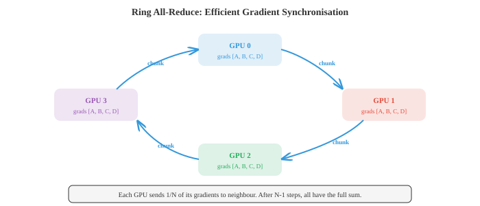

# 分布式深度学习

> **一句话总结**：分布式训练把计算摊到多张 GPU 与多台机器上，靠混合精度、数据并行、模型并行、流水线并行、ZeRO、FSDP、张量并行，以及 all-reduce 这类通信原语，才养得起当今这些巨型模型。

*分布式训练把计算铺开到多张 GPU 和多台机器上，用来训练那些单卡装不下、或单卡跑起来慢得要命的模型。本节覆盖混合精度、数据并行、模型并行、流水线并行、ZeRO、FSDP、张量并行，以及 all-reduce 这类通信原语 —— 全都是训练大语言模型 (Large Language Model, LLM) 时绕不开的核心工具。*

- 在单张 GPU (Graphics Processing Unit, GPU) 上训练一个大神经网络，迟早会撞墙。要么模型装不进显存，要么训练要跑好几个月。分布式训练把工作分摊到多个设备 (GPU、TPU (Tensor Processing Unit, TPU)，或整台整台的机器) 上，让训练更快、模型更大。本节就讲让这一切成为可能的技术。

- 要理解为什么需要分布式，先从训练的 **计算成本** 讲起。对一个稠密层做一次前向传播，输入维度是 $d_{\text{in}}$，输出维度是 $d_{\text{out}}$，批大小是 $B$，大约需要 $2 \cdot B \cdot d_{\text{in}} \cdot d_{\text{out}}$ 次浮点运算 (FLOPs)：输出矩阵每个元素上一次乘法加一次加法。反向传播的开销大约是前向的两倍 (要对输入和权重都求梯度)，所以稠密层一步训练大概是 $6 \cdot B \cdot d_{\text{in}} \cdot d_{\text{out}}$ FLOPs。

- 对一个隐藏维度为 $d$ 的 Transformer 层，自注意力块里有四个投影 (Q, K, V 和输出投影)，每个的开销是 $O(B \cdot n \cdot d^2)$ FLOPs (其中 $n$ 是序列长度)，再加上注意力矩阵本身的计算 $O(B \cdot n^2 \cdot d)$。前馈块由两个稠密层组成，一般先扩到 $4d$ 再收回来：$O(B \cdot n \cdot 8d^2)$。整层加起来大约是 $O(B \cdot n \cdot 12d^2 + B \cdot n^2 \cdot d)$。再乘上层数，你就明白为什么训练 GPT (Generative Pre-trained Transformer, GPT) 量级的模型要吃掉成千上万个 GPU 小时了。

- **显存墙** 通常是更紧的约束。训练时，GPU 显存里同时得住着四样东西:


- **参数**：模型权重。一个 70 亿参数的模型，存成 FP32 (每个参数 4 字节)，光权重就要 28 GB。
- **梯度**：和参数一样大，又是 28 GB。
- **优化器状态**: Adam 会额外维护两个缓冲区 (一阶矩和二阶矩估计)，每个都和参数一样大。为了数值稳定，即便模型本身用低精度，这些状态也保持 FP32。对我们那 70 亿参数的模型，就是 $2 \times 28 = 56$ GB。
- **激活值**：前向时保存下来、反向时要用的中间值。大小取决于批大小、序列长度和模型宽度。这一块往往是最大的，而且随批大小线性增长。

- 我们这个 70 亿参数模型配 FP32 Adam: 28 (参数) + 28 (梯度) + 56 (优化器) = 112 GB，这还没算激活值。单张 80 GB 的 A100 根本装不下，这就是为什么必须上分布式。

- **混合精度训练 (mixed precision training)** 是第一道防线。别把所有东西都存成 FP32 (32 位浮点数)，前向和反向都用 FP16 或 BF16 (16 位) 跑，但保留一份 FP32 的权重母本，专门给优化器更新用。

- **FP16** 精度不低 (10 位尾数)，但表示范围窄，容易溢出或下溢。**损失缩放 (loss scaling)** —— 反向前把损失乘一个大因子，反向后再把梯度除掉同样的因子 —— 可以缓解这个问题。

- **BF16** (brain float) 的指数范围和 FP32 一样 (8 位指数)，只是精度低一些 (7 位尾数)。它几乎不会溢出，也几乎不用损失缩放，用起来更省心。BF16 现在是训练 Transformer 的默认选择。

- 混合精度大致把激活值和梯度的显存砍了一半 (这俩是前向/反向阶段的大头)，而优化器状态仍然留在 FP32 保数值稳定。

- **数据并行 (data parallelism)** 是最简单的分布式策略。把整个模型复制到 $N$ 张 GPU 上，每个 mini-batch 均分成 $N$ 块，一张 GPU 拿一块。每张 GPU 独立跑自己那块的前向和反向。然后所有 GPU 上的梯度做平均 (用 all-reduce 操作)，每张 GPU 各自更新自己那份模型副本。

- 从模型视角看，这等价于用一个 $N$ 倍大的 mini-batch 训练。如果每张 GPU 处理的批大小是 $B$，有效批大小就是 $N \cdot B$。


- 梯度平均可以同步也可以异步。**同步 SGD (Synchronous Stochastic Gradient Descent, SGD)** 等所有 GPU 都跑完再做平均，数学上和单卡用更大 batch 训练完全等价。缺点是最慢的那张 GPU (所谓的 "掉队者", straggler) 会拖住所有人。

- **异步 SGD** 让每张 GPU 独立地去更新一个共享的参数服务器，不用等别人。这消除了掉队者问题，但引入了 "陈旧梯度 (stale gradients)"：某张 GPU 算出来的梯度，可能对应的是稍微旧一点的参数。陈旧梯度会引入噪声，拖慢收敛。实际工程上，一般还是选带高效通信的同步 SGD。

- **梯度累积 (gradient accumulation)** 是个软件层面的技巧，用来在有限硬件上模拟更大的 batch size。别每个 mini-batch 都更新一次，而是跑几次前向/反向、把梯度累加起来，最后再统一更新一次。效果和用更大 batch 一样，但不需要额外的激活显存 (同一时刻只有一个 mini-batch 的激活在显存里)。

- 当模型自己都塞不进单张 GPU 时，就得上 **模型并行 (model parallelism)**。主流有两种玩法。

- **张量并行 (tensor parallelism)** 把单个层拆到多张 GPU 上。一个大的矩阵乘 $Y = XW$ 可以按列切：把 $W$ 拆成 $[W_1, W_2]$ 分给两张 GPU，分别并行算 $Y_1 = XW_1$ 和 $Y_2 = XW_2$，最后拼起来。注意力投影和前馈层都能这么切。它要求 GPU 之间通信极快 (一般是节点内的 NVLink)，因为每一层都要合并部分结果。

- **流水线并行 (pipeline parallelism)** 把不同的层分给不同的 GPU。GPU 0 跑第 1-4 层，GPU 1 跑第 5-8 层，以此类推。数据像流水线上的产品一样往下走。朴素做法会有 "流水线气泡 (pipeline bubble)": GPU 0 在处理第 1 个 micro-batch 的前向时，GPU 1-3 都在闲着。**微批 (micro-batching)** 能缓解这个问题 —— 把 mini-batch 切成一串更小的 micro-batch，让它们依次流过流水线，大部分时间里所有 GPU 都忙起来。

- **混合并行 (hybrid parallelism)** 把数据并行、张量并行和流水线并行捏在一起。一个典型的大模型训练布局：节点内用张量并行 (一个节点 8 张 GPU 用高速 NVLink 连着)，节点之间用流水线并行，再在节点组之间做数据并行。GPT-4、Llama 这种模型都是这么训的。

- 分布式训练的效率极度依赖 **通信**。核心操作是 **all-reduce**：每张 GPU 上有一个值，计算它们的和 (或均值)，再把结果广播回所有 GPU。

- 朴素 all-reduce 把所有数据送到一张 GPU，求和，再广播出去。通信复杂度是 $O(N)$，而且在根节点处形成瓶颈。

- **环形 all-reduce (ring all-reduce)** 就高效多了。把 $N$ 张 GPU 排成一个环，每张 GPU 把自己的数据切成 $N$ 块。用 $N - 1$ 步，每张 GPU 往下一个邻居发一块、从另一个邻居收一块，一路累加部分和；再用 $N - 1$ 步把完整和传播给所有 GPU。每张 GPU 传输的总数据量：数据大小的 $2(N-1)/N$ 倍，当 $N$ 增大时逼近 $2\times$。关键在于这个数不会随 $N$ 增长，所以是带宽最优的。



- **参数服务器 (parameter servers)** 是另一种架构：有专门的服务器节点负责存模型参数。工作节点算完梯度就发给服务器，服务器更新完再发回来。写起来简单，但服务器容易成为通信瓶颈。

- **NCCL** (英伟达集合通信库，NVIDIA Collective Communications Library, NCCL) 是 GPU 之间通信的标准库。它提供了 all-reduce、all-gather、broadcast 等集合操作的优化实现，会根据网络拓扑自动挑最合适的算法。

- **缩放律 (scaling laws)** 描述模型性能如何随算力、数据和模型规模变化。最早的 Kaplan 等人 (2020) 的缩放律发现，损失随每一项都按幂律下降:

$$L(N) \propto N^{-\alpha_N}, \quad L(D) \propto D^{-\alpha_D}, \quad L(C) \propto C^{-\alpha_C}$$

- 其中 $N$ 是参数量，$D$ 是数据集大小，$C$ 是计算预算。

- **Chinchilla 缩放律** (Hoffmann 等人，2022) 指出，之前大部分模型其实都训练不足：在给定算力预算下，应该训练一个更小的模型，但喂它更多数据，比之前想的要多。最优比例大约是每个参数配 20 个 token。一个 70 亿参数模型该看到 1400 亿 token，而不是 Llama 1 拿 650 亿模型去啃的那 3000 亿 token。这一发现把整个领域推向了 "算力最优 (compute-optimal)" 训练。

- **专家混合 (Mixture of Experts, MoE)** 是一种能在不同步增加算力的前提下扩容模型的架构。原本 Transformer 每层就一个前馈网络，现在换成 $N$ 个 "专家" 网络 (每个都是标准的 FFN)。一个 **门控网络 (gating network)**，也叫路由 (router)，会看每个 token，把它送给分数最高的 top-$K$ 个专家 (一般 $K = 1$ 或 $K = 2$)。


- 总参数量大了很多 (因为有 $N$ 个专家)，但每个 token 的 FLOPs 基本没变 (因为每个 token 只激活 $K$ 个专家)。举个例子，Mixtral 8x7B 总参数 470 亿，但每次前向只用大约 130 亿参数，用一个小模型的算力开销拿到大模型的性能。

- MoE 也有它的麻烦。**负载均衡**：如果路由把大部分 token 都送到同一个专家，其他专家就浪费了。一个辅助损失可以鼓励路由更均匀。**通信**：不同专家可能住在不同 GPU 上，路由 token 就得做 all-to-all 通信，这很贵。

- **容错 (fault tolerance)** 在训练要跑几周几个月、用几千张 GPU 时非常关键。一张 GPU 挂了，你可不想前功尽弃。**检查点 (checkpointing)** 定期把模型权重、优化器状态和训练状态 (学习率、步数、数据位置) 存到磁盘上。出故障就从上一次检查点恢复。

- **梯度检查点 (gradient checkpointing)**，也叫激活重算，是显存优化手段，不是容错机制。前向时不再保存所有激活留给反向，而是只在若干位置存 "检查点激活"。反向时，再从这些检查点重新算出中间那些激活。这是拿算力换显存：前向开销大约多 33%，但激活显存能压到原来的 $\sqrt{L}$ 分之一 ($L$ 是层数)。

- 把这些拼起来：训练一个前沿模型，会同时用上所有招数 —— BF16 混合精度，数千张 GPU 上的数据并行 + 环形 all-reduce，节点内张量并行，节点间流水线并行，梯度检查点省显存，MoE 提参数效率，再加上定期检查点做容错。这里的系统工程难度，跟算法设计不相上下。

- 把分布式训练工具箱汇总一下:

| 技术 | 干什么用 | 代价 |
|---|---|---|
| 混合精度 (BF16) | 激活/梯度显存减半 | 微小数值差异 |
| 数据并行 | 在多张 GPU 上扩批大小 | 梯度同步的通信开销 |
| 张量并行 | 把层切到多张 GPU 上 | 要求高速互连 |
| 流水线并行 | 把模型阶段分到多张 GPU | 流水线气泡 (算力浪费) |
| 梯度累积 | 模拟大 batch | 变慢 (多次前向/反向) |
| 梯度检查点 | 降低激活显存 | 多约 33% 算力 |
| 环形 all-reduce | 高效做梯度平均 | 大模型下受带宽限制 |
| MoE | 更大容量，相同 FLOPs | 负载均衡、路由复杂 |
| 缩放律 | 指导算力分配 | 经验规律，不一定在所有规模都成立 |

## 编程练习 (用 CoLab 或 notebook)

1. 计算一个 Transformer 层的 FLOPs 与显存需求。给定隐藏维度 $d$、序列长度 $n$、批大小 $B$ 和层数，估算整体训练成本。
```python
import jax.numpy as jnp

def transformer_layer_flops(d, n, B):
    """一个 Transformer 层前向传播的近似 FLOPs。"""
    # QKV 投影: 3 * (B * n * d * d) * 2 (乘加各一次)
    qkv_flops = 3 * 2 * B * n * d * d
    # 注意力: QK^T 需要 (B * n * n * d) * 2, attn*V 需要 (B * n * n * d) * 2
    attn_flops = 2 * 2 * B * n * n * d
    # 输出投影: (B * n * d * d) * 2
    out_flops = 2 * B * n * d * d
    # FFN: 两层, d->4d 和 4d->d, 一共 2 * (B * n * d * 4d) * 2
    ffn_flops = 2 * 2 * B * n * d * 4 * d
    return qkv_flops + attn_flops + out_flops + ffn_flops

def transformer_layer_memory(d, n, B, dtype_bytes=2):
    """一层激活值的近似显存 (字节)。"""
    # QKV: 3 * B * n * d
    qkv_mem = 3 * B * n * d * dtype_bytes
    # 注意力权重: B * heads * n * n (近似 B * n * n * sizeof)
    attn_mem = B * n * n * dtype_bytes
    # FFN 中间层: B * n * 4d
    ffn_mem = B * n * 4 * d * dtype_bytes
    return qkv_mem + attn_mem + ffn_mem

# 示例: GPT-2 规模
d, n, B, L = 1024, 1024, 8, 24
fwd_flops = transformer_layer_flops(d, n, B)
total_flops = 3 * L * fwd_flops  # 前向 + 反向大约 3 倍
act_mem = L * transformer_layer_memory(d, n, B)
param_count = L * (12 * d * d + 13 * d)  # 近似

print(f"Model: d={d}, n={n}, B={B}, L={L}")
print(f"Parameters: {param_count / 1e6:.0f}M")
print(f"FLOPs per step: {total_flops / 1e12:.2f} TFLOPs")
print(f"Activation memory: {act_mem / 1e9:.2f} GB (BF16)")
print(f"Parameter memory (FP32): {param_count * 4 / 1e9:.2f} GB")
print(f"Adam optimizer memory: {param_count * 8 / 1e9:.2f} GB")
print(f"Total training memory: {(param_count * 16 + act_mem) / 1e9:.2f} GB")
```

2. 模拟数据并行训练。把数据集切到多张 "虚拟 GPU" 上，独立算梯度，做平均，验证结果与单卡训练一致。
```python
import jax
import jax.numpy as jnp

# 简单线性模型: y = wx + b
key = jax.random.PRNGKey(0)
X = jax.random.normal(key, (64, 4))
w_true = jnp.array([1.0, -2.0, 3.0, 0.5])
y = X @ w_true + 0.1 * jax.random.normal(key, (64,))

def loss_fn(w, X, y):
    return jnp.mean((X @ w - y) ** 2)

grad_fn = jax.grad(loss_fn)

# 单 GPU: 整批梯度
w = jnp.zeros(4)
grad_single = grad_fn(w, X, y)

# 数据并行: 切到 4 张 "GPU" 上
n_gpus = 4
chunk_size = len(X) // n_gpus
grads = []
for i in range(n_gpus):
    X_chunk = X[i*chunk_size:(i+1)*chunk_size]
    y_chunk = y[i*chunk_size:(i+1)*chunk_size]
    grads.append(grad_fn(w, X_chunk, y_chunk))

# All-reduce: 对梯度求平均
grad_parallel = jnp.mean(jnp.stack(grads), axis=0)

print("Single-GPU gradient:", grad_single)
print("Data-parallel gradient (avg):", grad_parallel)
print(f"Match: {jnp.allclose(grad_single, grad_parallel, atol=1e-5)}")

# 分别训练并对比
w_single, w_parallel = jnp.zeros(4), jnp.zeros(4)
lr = 0.1
for step in range(100):
    w_single = w_single - lr * grad_fn(w_single, X, y)

    grads = [grad_fn(w_parallel, X[i*chunk_size:(i+1)*chunk_size],
                     y[i*chunk_size:(i+1)*chunk_size]) for i in range(n_gpus)]
    avg_grad = jnp.mean(jnp.stack(grads), axis=0)
    w_parallel = w_parallel - lr * avg_grad

print(f"\nAfter 100 steps:")
print(f"Single-GPU weights: {w_single}")
print(f"Data-parallel weights: {w_parallel}")
print(f"Max difference: {jnp.max(jnp.abs(w_single - w_parallel)):.2e}")
```

3. 实现一个简单的专家混合层。做一个门控网络，把 token 路由到 top-K 个专家，再组合它们的输出。
```python
import jax
import jax.numpy as jnp

def expert_fn(x, W1, b1, W2, b2):
    """简单两层 FFN 专家。"""
    h = jnp.maximum(0, x @ W1 + b1)  # ReLU
    return h @ W2 + b2

def moe_layer(x, gate_W, experts_params, top_k=2):
    """
    MoE 前向传播。
    x: (batch, d_model)
    gate_W: (d_model, n_experts)
    experts_params: 每个专家的 (W1, b1, W2, b2) 列表
    """
    n_experts = len(experts_params)

    # 门控: 计算路由分数
    gate_logits = x @ gate_W  # (batch, n_experts)
    gate_probs = jax.nn.softmax(gate_logits, axis=-1)

    # Top-K 选择
    top_k_indices = jnp.argsort(-gate_probs, axis=-1)[:, :top_k]
    top_k_probs = jnp.take_along_axis(gate_probs, top_k_indices, axis=-1)
    # 重新归一化
    top_k_probs = top_k_probs / jnp.sum(top_k_probs, axis=-1, keepdims=True)

    # 算专家输出 (为简化, 先全跑一遍所有专家, 再做掩码)
    expert_outputs = jnp.stack([
        expert_fn(x, *experts_params[i]) for i in range(n_experts)
    ], axis=1)  # (batch, n_experts, d_model)

    # 收集 top-K 专家的输出并加权
    batch_idx = jnp.arange(x.shape[0])[:, None]
    selected_outputs = expert_outputs[batch_idx, top_k_indices]  # (batch, top_k, d_model)
    output = jnp.sum(selected_outputs * top_k_probs[:, :, None], axis=1)

    return output, gate_probs

# 初始化
key = jax.random.PRNGKey(42)
batch, d_model, d_ff, n_experts = 8, 16, 32, 4

# 初始化专家
experts_params = []
for i in range(n_experts):
    k1, k2, key = jax.random.split(key, 3)[0], jax.random.split(key, 3)[1], jax.random.split(key, 3)[2]
    experts_params.append((
        jax.random.normal(k1, (d_model, d_ff)) * 0.1,
        jnp.zeros(d_ff),
        jax.random.normal(k2, (d_ff, d_model)) * 0.1,
        jnp.zeros(d_model),
    ))

key, subkey = jax.random.split(key)
gate_W = jax.random.normal(subkey, (d_model, n_experts)) * 0.1
x = jax.random.normal(key, (batch, d_model))

output, gate_probs = moe_layer(x, gate_W, experts_params, top_k=2)

print(f"Input shape: {x.shape}")
print(f"Output shape: {output.shape}")
print(f"Gate probabilities (first sample): {gate_probs[0]}")
print(f"Expert usage (avg across batch):")
for i in range(n_experts):
    usage = jnp.mean(gate_probs[:, i])
    print(f"  Expert {i}: {usage:.3f}")
```

---

## 📌 本节要点

- **显存墙**：训练时显存要同时装参数、梯度、优化器状态、激活值，70 亿模型 FP32 Adam 就要 112 GB，单卡装不下。
- **混合精度**：用 BF16/FP16 跑前向反向，用 FP32 存权重母本，显存减半而数值仍稳。
- **数据并行**：复制整模型，切分 batch，用 all-reduce 平均梯度，有效批大小放大 $N$ 倍。
- **张量并行**：把单层的矩阵乘拆到多张 GPU 上并行算，需要节点内高速互连。
- **流水线并行**：把不同层分给不同 GPU，用 micro-batch 填气泡、保持忙碌。
- **环形 all-reduce**：每卡传输量趋近数据大小的 $2\times$，不随 GPU 数量增长，带宽最优。
- **Chinchilla 缩放律**：算力最优时每个参数配约 20 token，大部分早期模型其实训练不足。
- **MoE**：只激活 top-$K$ 专家，总参数变大但每 token FLOPs 基本不变，用小算力拿大模型效果。
- **梯度检查点**：反向时重算激活，前向多 33% 算力换来激活显存降到 $\sqrt{L}$ 分之一。
- **前沿训练组合拳**: BF16 + 数据/张量/流水线混合并行 + 梯度检查点 + MoE + 容错检查点，系统工程和算法难度相当。