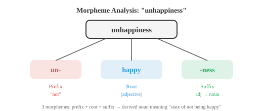
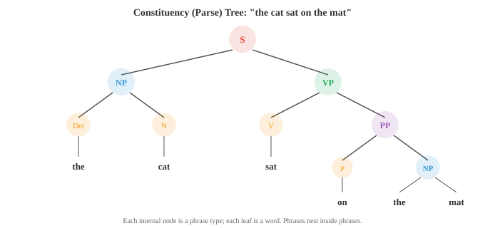
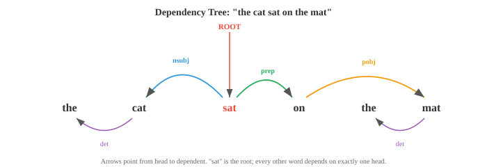

# 语言学基础

> **一句话总结**: 语言学在音系、形态、句法、语义、语用五个层次上刻画语言结构, 为 NLP 提供了从分词到语义理解的整套概念底座。

## 🗺️ 本章导览

- 本章从语言学基础出发, 走向现代大语言模型: 基础 → 经典 NLP → 表示学习 → Transformer → 前沿生成
- **01. 语言学基础** (本节): 语言的层次 —— 音位、形态、句法、语义、语用
- **02. 文本处理与经典 NLP**: 分词、规范化、TF-IDF、n-gram、POS、NER
- **03. 词嵌入与序列模型**: word2vec、GloVe、RNN、LSTM、GRU、Seq2Seq
- **04. Transformer 与语言模型**: 注意力、Transformer、BERT / GPT 家族
- **05. 高级文本生成**: 解码策略、RLHF、MoE、SSM、文本扩散

*语言学提供了自然语言处理 (Natural Language Processing, NLP) 系统隐式学习和利用的结构性词汇。本文涵盖形态学、句法、语义、语用、音系、成分句法分析与依存句法分析,以及分布假说 —— 这门研究人类语言的科学,为人工智能 (Artificial Intelligence, AI) 中的分词、语法和意义奠定基础。*

- 在动手构建能理解或生成语言的系统之前, 我们得先弄清楚语言本身是怎么运作的。

- 语言学 (linguistics) 是研究语言的科学,它提供了 NLP 不断借用的概念性词汇。

- 即便是从原始数据中学习语言的现代神经模型, 也会隐式地重新发现语言学家已经编目了几十年的许多结构。

- 语言在每个层面都有结构: 组成词的声音、组成词的部件、把词组合成句的规则、句子承载的意义, 以及语境如何塑造解读。我们会自底向上把每一层走一遍。

- **形态学 (morphology)** 研究词的内部结构。词不是原子性的; 它们由更小的、有意义的单位构成, 这些单位叫**语素 (morpheme)**。

- 单词 "unhappiness" 包含三个语素: "un-" (前缀, 意为 "不")、"happy" (词根) 和 "-ness" (把形容词变成名词的后缀)。每个语素都贡献了一份意义。

- **词根 (root)** (又叫词干, stem) 是承载主要意义的核心语素。"Happy"、"run"、"compute" 都是词根。

- **词缀 (affix)** 是附着在词根上、用来修饰词根的语素。

- 英语有**前缀 (prefix)** (放在词根前面: un-、re-、pre-) 和**后缀 (suffix)** (放在后面: -ing、-ed、-tion)。有些语言还有中缀 (infix, 插在词根内部) 和环缀 (circumfix, 把词根包起来)。



- 形态学过程有两类。**屈折 (inflection)** 改变词的语法属性, 但不改变核心意义或词性: "run" 变成 "runs" (第三人称)、"running" (进行时)、"ran" (过去时)。词依旧是同一个动词, 意思也没变。

- **派生 (derivation)** 造出新词, 常常改变词性: "happy" (形容词) 变成 "happiness" (名词), "compute" (动词) 变成 "computation" (名词) 再变成 "computational" (形容词)。每一次派生都会平移意义和语法类别。

- 各种语言在形态复杂度上差异极大。英语相对**分析型 (analytic)** (每个词包含的语素少, 主要靠语序表意)。

- 土耳其语和芬兰语是**黏着型 (agglutinative)** 的 (一个词里可以串接很多语素)。阿拉伯语和希伯来语用**模板式 (templatic)** 形态学 (词根是像 k-t-b (意为 "写") 这样的辅音骨架, 再插入元音模式造出不同的词: kitab "书"、kataba "他写了"、maktub "被写下的")。

- 形态学对 NLP 很重要, 因为它影响分词。词级分词器会把 "run"、"runs"、"running"、"ran" 当成四个毫无关联的符号。

- 而形态感知的系统会认出它们共享同一个词根。子词分词 (字节对编码 (Byte-Pair Encoding, BPE)、WordPiece) 是形态分析的统计近似, 我们会在 02 号文件里细讲。

- **句法 (syntax)** 研究词如何组合成短语和句子。每种语言都有规范词序和结构的规则; 违反它们就成了胡言乱语。

- "The cat sat on the mat" 是合乎英语语法的; "Mat the on sat cat the" 就不是。

- 描述句法结构主要有两种框架。

- **短语结构语法 (phrase structure grammar)** (又叫成分语法, constituency grammar) 认为句子是由短语一层层嵌套构建出来的。一个句子 (S) 由一个名词短语 (NP) 和一个动词短语 (VP) 构成。

- 一个名词短语可能是一个限定词 (Det) 加一个名词 (N)。一个动词短语可能是一个动词 (V) 加一个名词短语。这些规则搭出一棵树:



- 这棵树叫**成分树 (constituency tree)** (或语法分析树, parse tree)。每个内部节点是一种短语类型, 每个叶子是一个词。这棵树捕捉了层级化的分组: "on the mat" 是一个单位 (介词短语), "sat on the mat" 是一个单位 (动词短语), 而整体是一个句子。

- **上下文无关文法 (context-free grammar, CFG)** 把这些规则形式化。它由一组产生式规则组成, 每条形如 $A \to \alpha$, 其中 $A$ 是一个非终结符 (像 NP 或 VP 这样的短语类型), $\alpha$ 是一串终结符 (词) 和非终结符的序列。例如:

```
S  → NP VP
NP → Det N
NP → Det N PP
VP → V NP
VP → V PP
PP → P NP
Det → "the" | "a"
N  → "cat" | "mat" | "dog"
V  → "sat" | "chased"
P  → "on" | "under"
```

- 从 S 出发反复套用规则, 你就能生成语法允许的所有句子。句法分析则反过来: 给定一个句子, 找出产生它的树 (或多棵树)。一个句子如果有多棵有效的分析树, 就叫**句法歧义 (syntactically ambiguous)**。"I saw the man with the telescope" 就有两种分析: 我用望远镜看到了那个人, 或者我看到了一个带着望远镜的人。

- **依存语法 (dependency grammar)** 采取另一种视角。它不搞短语嵌套, 而是描述词与词之间的直接关系。句子里每个词都恰好依附于另一个词 (它的**中心词, head**), 除了句子的根节点。结果是一棵**依存树 (dependency tree)**, 边上标注着语法关系 (主语、宾语、修饰语等)。



- 在依存视角下, "sat" 是根。"Cat" 作为主语依附于 "sat" (nsubj)。"On" 作为介词修饰语依附于 "sat"。"Mat" 作为该介词的宾语依附于 "on"。每个词都挂在恰好一个中心词下, 形成一棵树。

- 依存语法已经成为现代 NLP 的主流框架, 因为依存树更容易用统计句法分析器产出, 而且这些关系更直接地映射到语义角色 (谁对谁做了什么)。

- **配价 (valency)** 描述一个动词需要多少个论元。"Sleep" 是**不及物 (intransitive)** 的 (一个论元: 睡觉的人)。"Eat" 是**及物 (transitive)** 的 (两个: 吃的人和被吃的东西)。"Give" 是**双及物 (ditransitive)** 的 (三个: 给的人、给的东西、收的人)。知道一个动词的配价, 就能约束哪些分析树是有效的。

- **语义学 (semantics)** 研究意义。句法告诉你一个句子是怎么组织的; 语义告诉你它是什么意思。

- **词汇语义 (lexical semantics)** 关心单个词的意义。词与词之间存在系统性的关系:

    - **同义 (synonymy)**: 意义 (几乎) 相同的词。"Big" 和 "large" 就是同义词。真正完美的同义几乎不存在; 内涵或用法上几乎总有微妙差别。
    - **反义 (antonymy)**: 意义相反的词。"Hot" 与 "cold"、"buy" 与 "sell"。
    - **上下义 (hypernymy/hyponymy)**: "是一个" 的关系。"Dog" 是 "animal" 的下义词 (hyponym) (狗是一种动物)。"Animal" 是 "dog" 的上义词 (hypernym)。它们构成分类层级。
    - **部分整体关系 (meronymy)**: "是一部分" 的关系。"Wheel" 是 "car" 的部分整体词。
    - **多义 (polysemy)**: 一个词有多个相关的意义。"Bank" 既可以指金融机构, 也可以指河岸。上下文来消歧。

- **词义消歧 (Word Sense Disambiguation, WSD)** 的任务, 是在给定的上下文中判断一个多义词到底用的是哪个义项。在 "I deposited money at the bank" 里, 金融义正确。在 "We sat by the river bank" 里, 地理义正确。WSD 曾是早期 NLP 的核心问题; 现代上下文嵌入 (ELMo、BERT (Bidirectional Encoder Representations from Transformers)) 通过为同一个词的不同用法生成不同的向量表示, 基本把它解决了。

- **组合语义 (compositional semantics)** 追问: 单个词的意义如何合起来形成短语或句子的意义。**组合性原则 (principle of compositionality)** (归功于 Frege) 说, 一个复杂表达式的意义, 由其部件的意义和用于组合它们的规则共同决定。"The cat chased the dog" 和 "the dog chased the cat" 意思不同, 因为句法结构 (谁是主语, 谁是宾语) 与词义相互作用。

- 并不是所有意义都是组合性的。像 "kick the bucket" (意为 "翘辫子") 这样的**习语 (idiom)**, 它的意义没法从各部件推导出来。这对任何组合式方法都是个挑战。

- **分布式语义 (distributional semantics)** 是支撑现代 NLP 的计算式意义研究进路。**分布假说 (distributional hypothesis)** (Firth, 1957) 说: "看一个词, 就看它跟什么词一起出现" (You shall know a word by the company it keeps)。出现在相似上下文里的词, 意义往往也相似。这是词嵌入 (Word2Vec、GloVe) 的理论基础, 我们会在 03 号文件里探索。

- **语用学 (pragmatics)** 研究语境如何影响意义。同一个句子, 因说话人、时间、地点和目的不同, 可以有不同的意思。

- "Can you pass the salt?" 从句法上看是一个关于能力的是非问句。从语用上看, 它是一个请求。你不能答一句 "Yes, I can" 然后就坐在那儿一动不动。要理解这一点, 需要超越字面文字的知识, 具体来说, 就是**言语行为 (speech act)** 的惯例。

- **言语行为理论 (speech act theory)** (Austin、Searle) 把言语行为分为:
    - **言内行为 (locutionary act)**: 字面内容 ("Can you pass the salt?")
    - **言外行为 (illocutionary act)**: 意图功能 (一个请求)
    - **言后行为 (perlocutionary act)**: 对听者的效果 (他们把盐递了过来)

- **会话含义 (implicature)** (Grice) 指那些暗示了但没明说的意义。如果有人问 "John 厨艺好吗?", 你回 "他是英国人", 你并没有从字面上回答那个问题, 但听者可以推断出 (借助文化刻板印象, 公不公平另说) 你的意思是 "不好"。Grice 的**合作原则 (cooperative principle)** 认为, 说话人一般会尽量做到有信息量、真实、切题、清晰, 而听者在解读话语时也假定这些准则成立。

- **共指 (coreference)** 是一种语用现象, 不同的表达式指向同一个实体。在 "Alice went to the store. She bought milk" 里, "she" 指的是 Alice。共指消解是理解跨句文本的关键, 也是 NLP 的一项重要任务。

- **篇章结构 (discourse structure)** 描述句子如何连接起来形成连贯的文本。叙事有开头、中间和结尾。论证有主张和证据。**修辞结构理论 (Rhetorical Structure Theory, RST)** 把文本分析成一棵由篇章关系 (细化、对比、因果等) 连接不同片段而成的树。

- 语用是 NLP 最难啃的地方。现代语言模型通过训练数据隐式地处理了大部分句法和语义, 但语用推理 —— 理解讽刺、会话含义和依赖语境的意义 —— 仍然是前沿难题。

- **音系学 (phonology)** 研究语言的语音系统。虽然本章聚焦文本, 简要过一下这里可以桥接到音频与语音那一章 (第 09 章)。

- **音位 (phoneme)** 是能区分意义的最小声音单位。英语大约有 44 个音位。"Bat" 和 "pat" 就差一个音位 (/b/ 对 /p/), 意义完全变了。这叫**最小对立对 (minimal pair)**。

- **音位变体 (allophone)** 是同一个音位在物理上的不同实现, 但不改变意义。"pin" 里的 "p" (送气, 带一股气流) 和 "spin" 里的 "p" (不送气), 在英语里都是 /p/ 的音位变体; 母语者把它们当同一个音。

- **国际音标 (International Phonetic Alphabet, IPA)** 提供了跨语言音位的标准化记法。"cat" 一词记作 /kæt/。IPA 是书面文本与语音系统之间的桥梁。

- **韵律 (prosody)** 涵盖语音的节奏、重音和语调。"I didn't say he stole the money" 根据强调哪个词的不同, 可以有七种不同的意思。韵律承载着文本单独会丢掉的信息, 所以文本转语音系统必须小心地建模它。

- 在 NLP 里, 音系知识会出现在文本转语音 (字素到音素转换)、语音识别 (把声学信号映射到音位), 甚至拼写纠错和音译中。

## 编程任务 (使用 CoLab 或 notebook)

1. 构建一个简单的形态分析器, 用常见前后缀列表把英文单词拆成可能的语素。
```python
prefixes = ['un', 're', 'pre', 'dis', 'mis', 'over', 'under', 'out', 'non']
suffixes = ['ing', 'ed', 'ly', 'ness', 'ment', 'tion', 'able', 'ible', 'er', 'est', 'ful', 'less', 'ous']

def analyse_morphemes(word):
    """使用已知词缀做简易语素分析。"""
    parts = []
    remaining = word.lower()

    # 检查前缀
    for p in sorted(prefixes, key=len, reverse=True):
        if remaining.startswith(p) and len(remaining) > len(p) + 2:
            parts.append(f"[prefix: {p}]")
            remaining = remaining[len(p):]
            break

    # 检查后缀
    for s in sorted(suffixes, key=len, reverse=True):
        if remaining.endswith(s) and len(remaining) > len(s) + 2:
            root = remaining[:-len(s)]
            parts.append(f"[root: {root}]")
            parts.append(f"[suffix: {s}]")
            remaining = None
            break

    if remaining is not None:
        parts.append(f"[root: {remaining}]")

    return parts

for word in ['unhappiness', 'reusable', 'disconnected', 'overreacting', 'kindness']:
    print(f"{word:20s} → {' + '.join(analyse_morphemes(word))}")
```

2. 用递归下降实现一个简单的上下文无关文法分析器。定义一个小文法, 把一个句子解析成一棵成分树。
```python
class CFGParser:
    """针对一个极小英语文法的递归下降分析器。"""
    def __init__(self, tokens):
        self.tokens = tokens
        self.pos = 0

    def peek(self):
        return self.tokens[self.pos] if self.pos < len(self.tokens) else None

    def consume(self, expected=None):
        tok = self.peek()
        if expected and tok != expected:
            return None
        self.pos += 1
        return tok

    def parse_det(self):
        if self.peek() in ('the', 'a'):
            return ('Det', self.consume())
        return None

    def parse_noun(self):
        if self.peek() in ('cat', 'dog', 'mat', 'man'):
            return ('N', self.consume())
        return None

    def parse_verb(self):
        if self.peek() in ('sat', 'chased', 'saw'):
            return ('V', self.consume())
        return None

    def parse_prep(self):
        if self.peek() in ('on', 'under', 'with'):
            return ('P', self.consume())
        return None

    def parse_np(self):
        save = self.pos
        det = self.parse_det()
        noun = self.parse_noun()
        if det and noun:
            # 检查可选的 PP
            pp = self.parse_pp()
            if pp:
                return ('NP', det, noun, pp)
            return ('NP', det, noun)
        self.pos = save
        return None

    def parse_pp(self):
        save = self.pos
        prep = self.parse_prep()
        np = self.parse_np()
        if prep and np:
            return ('PP', prep, np)
        self.pos = save
        return None

    def parse_vp(self):
        save = self.pos
        verb = self.parse_verb()
        if verb:
            np = self.parse_np()
            if np:
                return ('VP', verb, np)
            pp = self.parse_pp()
            if pp:
                return ('VP', verb, pp)
        self.pos = save
        return None

    def parse_sentence(self):
        np = self.parse_np()
        vp = self.parse_vp()
        if np and vp and self.pos == len(self.tokens):
            return ('S', np, vp)
        return None

def print_tree(tree, indent=0):
    if isinstance(tree, str):
        print(' ' * indent + tree)
    elif isinstance(tree, tuple):
        print(' ' * indent + tree[0])
        for child in tree[1:]:
            print_tree(child, indent + 2)

sentences = [
    "the cat sat on the mat",
    "a dog chased the cat",
]

for sent in sentences:
    tokens = sent.split()
    parser = CFGParser(tokens)
    tree = parser.parse_sentence()
    print(f"\n'{sent}':")
    if tree:
        print_tree(tree)
    else:
        print("  (no parse found)")
```

3. 通过搭一张简单的词图来探索词汇关系。给定一个带同义、反义和上位关系的小词表, 找出词与词之间的路径。
```python
relations = {
    ('big', 'large'): 'synonym',
    ('big', 'small'): 'antonym',
    ('small', 'tiny'): 'synonym',
    ('dog', 'animal'): 'hypernym',
    ('cat', 'animal'): 'hypernym',
    ('puppy', 'dog'): 'hypernym',
    ('happy', 'glad'): 'synonym',
    ('happy', 'sad'): 'antonym',
    ('hot', 'cold'): 'antonym',
    ('hot', 'warm'): 'synonym',
}

# 构建邻接表
from collections import defaultdict, deque

graph = defaultdict(list)
for (w1, w2), rel in relations.items():
    graph[w1].append((w2, rel))
    graph[w2].append((w1, rel))

def find_path(start, end):
    """用 BFS 在关系图上找两个词之间的路径。"""
    queue = deque([(start, [(start, None)])])
    visited = {start}
    while queue:
        node, path = queue.popleft()
        if node == end:
            return path
        for neighbor, rel in graph[node]:
            if neighbor not in visited:
                visited.add(neighbor)
                queue.append((neighbor, path + [(neighbor, rel)]))
    return None

pairs = [('big', 'tiny'), ('puppy', 'cat'), ('happy', 'sad')]
for w1, w2 in pairs:
    path = find_path(w1, w2)
    if path:
        steps = " → ".join(f"{w}({r})" if r else w for w, r in path)
        print(f"{w1} → {w2}: {steps}")
    else:
        print(f"{w1} → {w2}: no path found")
```

---

## 📌 本节要点

- **形态学**: 词由语素构成, 屈折改变语法属性、派生造出新词; 直接影响分词与子词切分
- **句法两大框架**: 短语结构语法搭出成分树, 依存语法给出词与词的直接关系; CFG 把前者形式化
- **句法歧义与配价**: 一个句子可有多棵有效分析树; 动词的论元数量约束合法结构
- **词汇语义**: 同义、反义、上下义、部分整体、多义构成词与词的关系网; WSD 靠上下文嵌入基本解决
- **组合性与分布假说**: Frege 的组合性原则决定句义合成; "看一个词就看它跟谁一起出现" 是 Word2Vec / GloVe 的理论根基
- **语用学**: 语境塑造意义, 涵盖言语行为、会话含义、共指与篇章结构, 是 NLP 最难啃的前沿
- **音系学**: 音位、音位变体、IPA 与韵律共同刻画语音, 桥接文本与语音识别 / 合成
