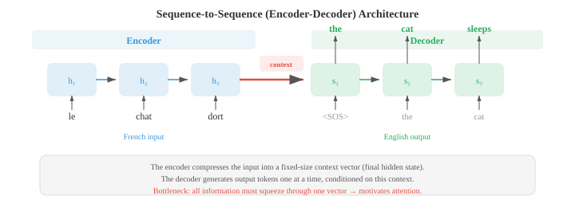
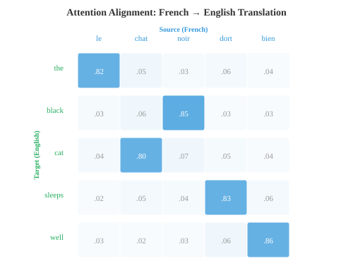

# 词嵌入与序列模型

> **一句话总结**: 词嵌入把稀疏离散的文本压进稠密向量空间, 让"语义相近"变成"几何相邻"; 本节串起 Word2Vec、GloVe、FastText、RNN/LSTM/GRU、带注意力的 seq2seq, 一路走到上下文表示.

*词嵌入把稀疏、符号化的文本压缩到稠密向量空间, 让语义相似度变成几何邻近。本文覆盖 Word2Vec (CBOW、Skip-gram)、GloVe、FastText、循环神经网络 (Recurrent Neural Network, RNN)、长短期记忆网络 (Long Short-Term Memory, LSTM)、门控循环单元 (Gated Recurrent Unit, GRU)、带注意力的 seq2seq 以及编码器-解码器范式, 完整走一遍从词袋到上下文表示的演进.*

- 01 节我们介绍了分布假设: 出现在相似上下文中的词, 语义也相似. 02 节我们用词频-逆文档频率 (Term Frequency-Inverse Document Frequency, TF-IDF) 这类稀疏、手工设计的特征来表示文本. 这些向量生活在极高维空间里 (词表里每个词占一个维度), 而且几乎全是零. **词嵌入 (word embedding)** 把这些信息压进稠密低维向量, 捕捉语义关系, 而且是直接从数据里学出来的.

- **Word2Vec** (Mikolov 等, 2013) 通过在一个简单预测任务上训练浅层神经网络来学词嵌入. 它有两种架构.

- **连续词袋 (Continuous Bag of Words, CBOW)** 模型从周围上下文词预测中心词. 给一段上下文窗口 (例如 "the cat ___ on the"), 模型把它们的嵌入向量取平均, 过一个线性层, 预测缺失的那个词 ("sat"). 训练目标是最大化:

$$P(w_t \mid w_{t-k}, \ldots, w_{t-1}, w_{t+1}, \ldots, w_{t+k})$$

- **Skip-gram** 模型反过来: 给一个目标词, 预测它周围的上下文词. 对目标词 "sat", 模型分别去预测 "the"、"cat"、"on"、"the". 目标是最大化:

$$P(w_{t+j} \mid w_t) \quad \text{for each } j \in [-k, k], \; j \neq 0$$


- Skip-gram 对低频词效果更好, 因为每个词会产生多个训练样本 (每个上下文位置一个). CBOW 更快, 对高频词稍好, 因为它对多个上下文信号做了平均.

- 在完整词表上训练很贵, 因为 softmax 分母要对全部 $V$ 个词求和. **负采样 (negative sampling)** 用二分类近似这件事: 把真实的上下文词 (正样本) 与随机采样出来的噪声词 (负样本) 区分开. 模型不用算完整的 softmax, 只更新目标词、真实上下文词和少量负样本的嵌入:

$$\mathcal{L} = \log \sigma(v_{w_O}^T v_{w_I}) + \sum_{i=1}^{k} \mathbb{E}_{w_i \sim P_n} [\log \sigma(-v_{w_i}^T v_{w_I})]$$

- 这里 $v_{w_I}$ 是输入词嵌入, $v_{w_O}$ 是输出 (上下文) 词嵌入, $P_n$ 是噪声分布, 常用一元词频的 3/4 次方 (这会压一压 "the" 这种超高频词).

- 为什么这么简单的目标能产出有意义的嵌入? Levy 和 Goldberg (2014) 证明, 带负采样的 skip-gram 隐式地在做一件事: 分解一个**偏移的逐点互信息 (Pointwise Mutual Information, PMI)** 矩阵. 收敛后, 两个词向量的点积近似为:

$$v_w^T v_c \approx \text{PMI}(w, c) - \log k$$

- 其中 $\text{PMI}(w, c) = \log \frac{P(w, c)}{P(w) P(c)}$ 衡量词 $w$ 和 $c$ 共同出现的频率比"独立随机情况下"预期的高多少 (见第 05 章信息论), $k$ 是负样本数. 共现远高于随机水平的词, PMI 高, 点积也高 (嵌入相似). 共现少于预期的词, PMI 为负, 嵌入也不相似. 这揭示了一个事实: Word2Vec 干的事其实和经典的分布语义方法 (如对共现矩阵做奇异值分解 (Singular Value Decomposition, SVD) 的潜在语义分析) 是一回事, 只不过它的方式更可扩展、更在线.

- Word2Vec 嵌入最让人意外的性质是通过向量算术捕捉**类比 (analogy)**. 向量 $v_{\text{king}} - v_{\text{man}} + v_{\text{woman}}$ 离 $v_{\text{queen}}$ 最近. 之所以行得通, 是因为嵌入空间把语义关系编码成了近似线性的方向: "皇室"方向大致就是 $v_{\text{king}} - v_{\text{man}}$, 把它加到 $v_{\text{woman}}$ 上就落在 $v_{\text{queen}}$ 附近. 这和第 01 章的线性代数呼应上了: 语义关系就是向量的平移.

- **GloVe** (Global Vectors for Word Representation, Pennington 等, 2014) 走了另一条路. 它不是一次次从局部上下文窗口里学, 而是先建一个全局的词共现矩阵 $X$, 其中 $X_{ij}$ 统计整个语料里词 $j$ 出现在词 $i$ 上下文里的次数. 然后模型学一组嵌入, 让它们的点积近似 log 共现值:

$$w_i^T \tilde{w}_j + b_i + \tilde{b}_j = \log X_{ij}$$

- 损失函数对每一对给出一个权重, 用一个截顶函数 $f(X_{ij})$ 防止超高频共现主导训练:

$$\mathcal{L} = \sum_{i,j=1}^{V} f(X_{ij}) \left(w_i^T \tilde{w}_j + b_i + \tilde{b}_j - \log X_{ij}\right)^2$$

- GloVe 把全局矩阵分解 (类似潜在语义分析) 的好处和 Word2Vec 的局部上下文学习结合了起来. 实践中, GloVe 和 Word2Vec 产出的嵌入质量差不多.

- **FastText** (Bojanowski 等, 2017) 在 skip-gram 基础上做了扩展: 把每个词表示成字符 n-gram 的袋. 词 "where" 在 $n = 3$ 时被拆成: "<wh"、"whe"、"her"、"ere"、"re>", 再加上整词 token "<where>". 这个词的嵌入就是所有 n-gram 嵌入之和.

- 这带来一个关键优势: FastText 能给训练时从未见过的词也产出嵌入. 词 "whereabouts" 和 "where" 共享 n-gram, 所以即使训练数据里从没出现过 "whereabouts", 它的嵌入也不会太离谱. 这对形态丰富的语言 (见 01 节) 特别有用, 因为这些语言里一个词会有很多屈折形式.

- **嵌入评估**一般用两类基准. **类比任务 (analogy task)** 测试 $v_a - v_b + v_c \approx v_d$ (例如 "Paris" $-$ "France" $+$ "Italy" $\approx$ "Rome"). **相似度基准 (similarity benchmark)** 把词对的余弦相似度 (见第 01 章) 和人类打分比较. 常见数据集有 WordSim-353、SimLex-999 和 Google 类比测试集. 有个现实的告诫: 类比任务上表现好的嵌入, 在情感分类这类下游任务上不一定最好. 最好的评估往往就是任务本身.

- 第 06 章我们把 RNN、LSTM、GRU 作为处理序列数据的架构介绍过了. 这里我们专门看它们怎么用在语言任务上.

- **语言模型 RNN** 一次读一个 token, 每一步预测下一个 token. 隐藏状态 $h_t$ 把整段历史 $w_1, \ldots, w_t$ 压进一个固定大小的向量里, 再用一个线性层加 softmax 把 $h_t$ 映射成词表上的分布. 训练时用真实下一个 token 的交叉熵损失, 这和最小化困惑度 (见 02 节) 等价. 关键的局限: 固定大小的隐藏状态得把整段历史都编进去, 早期 token 的信息会被逐渐覆盖.

- **双向 RNN (bidirectional RNN)** 从两个方向处理序列: 一个 RNN 从左到右读, 另一个从右到左读. 在每个位置 $t$, 前向隐藏状态 $\overrightarrow{h}_t$ 和后向隐藏状态 $\overleftarrow{h}_t$ 拼起来, 形成上下文感知的表示 $h_t = [\overrightarrow{h}_t ; \overleftarrow{h}_t]$. 这让模型同时能看到过去和未来的上下文, 对词性标注 (Part-of-Speech, POS) 和命名实体识别 (Named Entity Recognition, NER) 这类任务 (见 02 节) 非常有用, 因为一个词的标签常同时依赖前后的词. 双向 RNN 不能用来做语言建模, 因为你在预测下一个 token 时不能"偷看"未来.


- **深层堆叠 RNN (deep stacked RNN)** 把多个 RNN 层叠在一起. 第 $l$ 层在所有时间步上的隐藏状态构成第 $l + 1$ 层的输入序列. 堆 2-4 层通常能通过构建层次化表示提升效果, 类似深层卷积神经网络 (Convolutional Neural Network, CNN) 构建特征层级 (见第 06 章). 超过 4 层, 梯度消失和过拟合就成了问题, 除非在层之间加残差连接.

- **序列到序列 (sequence-to-sequence, seq2seq)** 架构 (Sutskever 等, 2014) 把变长输入序列映射到变长输出序列. 它由一个**编码器 (encoder)** RNN 读入输入并压成一个上下文向量 (最后一步的隐藏状态), 以及一个**解码器 (decoder)** RNN 逐 token 生成输出, 条件是这个上下文向量.



- seq2seq 是机器翻译的突破性架构. 编码器读一句法语, 解码器产出英文翻译. 解码器从一个特殊的 start-of-sequence token 起步, 自回归生成 token, 直到产出 end-of-sequence token. 一个实用小技巧: 把输入序列翻过来 (喂 "chat le" 而不是 "le chat") 效果反而更好, 因为这样第一个输入词和第一个输出词在计算图上离得更近, 梯度路径更短.

- 瓶颈问题: 整个输入必须被压进一个固定大小的向量. 句子一长, 这个向量装不下所有信息, 效果就掉下来了. 这催生了**注意力机制 (attention mechanism)**.

- 第 06 章介绍了注意力的现代 Q、K、V 表述. NLP 里最早的注意力机制是另一种形式, 作为编码器和解码器状态之间的对齐模型.

- **Bahdanau 注意力** (加性注意力, Bahdanau 等, 2015) 用一个学出来的前馈网络计算解码器隐藏状态 $s_t$ 和每个编码器隐藏状态 $h_i$ 之间的对齐分数:

$$e_{ti} = v^T \tanh(W_s s_{t-1} + W_h h_i)$$

- 分数经过 softmax 归一化成注意力权重, 上下文向量就是编码器状态的加权和:

$$\alpha_{ti} = \frac{\exp(e_{ti})}{\sum_j \exp(e_{tj})}, \quad c_t = \sum_i \alpha_{ti} h_i$$

- 解码器再用 $s_{t-1}$ 和 $c_t$ 一起产出下一个输出. 关键洞察: 不再是整句话共用一个固定的上下文向量, 而是每一个解码步都拿到一份不同的编码器状态加权组合, 让模型能"回头看"输入里相关的地方.

- **Luong 注意力** (乘性注意力, Luong 等, 2015) 把分数计算简化了. **dot** 变体用 $e_{ti} = s_t^T h_i$. **general** 变体用 $e_{ti} = s_t^T W h_i$. 这些比 Bahdanau 的加性分数快, 因为用的是矩阵乘法而不是前馈网络. Luong 注意力还从当前解码器状态 $s_t$ (而非 $s_{t-1}$) 计算上下文向量, 这让它拿到更多信息, 但计算流程稍有不同.



- 注意力权重常被可视化成热力图, 展示解码器在生成每个输出 token 时聚焦在哪些输入 token 上. 在翻译任务里, 这些热力图大致描出源语言和目标语言之间的词对齐, 对角线模式会被语序调整打破 (例如法语和英语的形容词-名词顺序不同).

- 推理时, 解码器每一步都得挑一个 token. **贪心解码 (greedy decoding)** 每个位置都取概率最高的 token, 但这会导致次优的序列: 一个局部好的选择可能把模型逼进一个全局差的句子. **束搜索 (beam search)** 每一步都保留 top $k$ (束宽) 个部分序列, 每个都尝试所有可能的下一个 token, 再整体保留最好的 $k$ 个.

- 当束宽 $k = 1$ 时, 束搜索退化为贪心解码. 典型值是 $k = 4$ 到 $k = 10$. 束越大, 找到的序列越好, 但速度成比例变慢. 束搜索还需要**长度归一化 (length normalisation)**, 否则模型会偏爱短序列, 因为短序列自然乘的项少、总概率高. 归一化分数是:

$$\text{score}(y) = \frac{1}{|y|^\alpha} \sum_{t=1}^{|y|} \log P(y_t \mid y_{<t})$$

- 其中 $|y|$ 是序列长度, $\alpha$ (常取 0.6-0.7) 控制长度惩罚的强度. $\alpha = 0$ 时没有长度归一化. $\alpha = 1$ 时分数就是每 token 的对数概率 (几何平均). 中间值在"倾向简洁"和"避免过早截断"之间取平衡.

- RNN 是顺序处理文本的, **1D CNN** 则通过在 token 序列上滑动滤波器来并行处理. 每个滤波器检测一个局部模式 (一个 n-gram 特征).

- **TextCNN** (Kim, 2014) 在输入嵌入矩阵上应用多个宽度不同的一维卷积滤波器 (例如 3、4、5 个 token). 每个滤波器产出一张特征图, **max-over-time pooling (时间维最大池化)** 从每张特征图里取单一最大值, 记录这个模式在文本中的任意位置是否出现过 (与位置无关). 所有滤波器池化后的特征拼起来, 送入分类器.


- TextCNN 又快又意外地好用, 在情感分析这类文本分类任务上很能打. 它能捕捉局部 n-gram 模式, 但没法建模长程依赖: 一个宽度 5 的滤波器只能看到 5 个连续 token. **膨胀因果卷积 (dilated causal convolution)** 通过在滤波器元素之间插入空隙 (膨胀) 解决这个问题. 把层叠起来, 膨胀率按指数增长 (1、2、4、8……), 感受野也指数增长, 参数量却不变, 让模型能捕获几百个 token 范围内的依赖.

- 到这里为止说的所有嵌入 (Word2Vec、GloVe、FastText) 都是每个词类型给出一个向量, 与上下文无关. "Bank" 不管指银行还是河岸, 拿到的都是同一个嵌入. 这是个根本局限, 而**上下文嵌入 (contextual embedding)** 就是来解决它的.

- **ELMo** (Embeddings from Language Models, Peters 等, 2018) 在输入文本上跑一个深度双向 LSTM 语言模型, 产出上下文相关的词表示. 前向 LSTM 每个位置预测下一个词; 一个独立的后向 LSTM 每个位置预测上一个词. 两个都在大语料上作为语言模型训练.

- 在每个位置 $k$, ELMo 用任务相关的可学权重把所有 $L$ 层的隐藏状态组合起来:

$$\text{ELMo}_k = \gamma \sum_{j=0}^{L} s_j \, h_{k,j}$$

- 这里 $h_{k,j}$ 是位置 $k$、第 $j$ 层的隐藏状态 (第 0 层是原始 token 嵌入), $s_j$ 是经过 softmax 归一化的标量权重, $\gamma$ 是任务相关的缩放因子. 不同层捕捉不同信息: 底层捕捉句法 (POS 标签、词形态), 高层捕捉语义 (词义、语义角色). 把所有层用可学权重混起来, ELMo 嵌入就能适应各种下游任务.

- ELMo 标志着**预训练-微调 (pre-train then fine-tune)** 范式的开端: 先在海量无标注文本上训一个大语言模型, 再把它的表示用于下游任务. ELMo 具体做法是把预训练表示作为固定或轻微调整的特征, 拼在任务相关的输入上. BERT 和 GPT (见 04 节) 把这条路走得更远——端到端微调整个模型, 效果好得多.

- 从 Word2Vec 到 ELMo 的演进展示了 NLP 里一个反复出现的主题: 从静态到动态表示, 从局部到全局上下文, 从浅层到深层模型. 每一步都在计算成本和更丰富的表示之间做权衡. Transformer (见 04 节) 完成了这段演进: 用注意力彻底取代循环, 既能做深度上下文化, 又能并行计算.

## 编程任务 (用 Colab 或 notebook)

1. 从零实现带负采样的 Word2Vec skip-gram. 在一个小语料上训练, 用主成分分析 (Principal Component Analysis, PCA) 可视化学到的嵌入.
```python
import jax
import jax.numpy as jnp
import matplotlib.pyplot as plt

# 小语料
corpus = """the king ruled the kingdom . the queen ruled the kingdom .
the prince is the son of the king . the princess is the daughter of the queen .
a man worked in the castle . a woman worked in the castle .
the king and queen lived in the castle . the prince and princess played outside .""".lower().split()

vocab = sorted(set(corpus))
word2idx = {w: i for i, w in enumerate(vocab)}
idx2word = {i: w for w, i in word2idx.items()}
V = len(vocab)

# 用窗口大小 2 生成 skip-gram 对
window = 2
pairs = []
for i, word in enumerate(corpus):
    for j in range(max(0, i - window), min(len(corpus), i + window + 1)):
        if i != j:
            pairs.append((word2idx[word], word2idx[corpus[j]]))

pairs = jnp.array(pairs)
print(f"Vocabulary: {V} words, Training pairs: {len(pairs)}")

# 模型参数
embed_dim = 16
key = jax.random.PRNGKey(42)
k1, k2 = jax.random.split(key)
W_in = jax.random.normal(k1, (V, embed_dim)) * 0.1    # 输入嵌入
W_out = jax.random.normal(k2, (V, embed_dim)) * 0.1   # 输出嵌入

# 单对样本的负采样损失
def neg_sampling_loss(W_in, W_out, target, context, neg_ids):
    v_in = W_in[target]      # (embed_dim,)
    v_out = W_out[context]   # (embed_dim,)
    v_neg = W_out[neg_ids]   # (k, embed_dim)

    pos_loss = -jax.nn.log_sigmoid(jnp.dot(v_in, v_out))
    neg_loss = -jnp.sum(jax.nn.log_sigmoid(-v_neg @ v_in))
    return pos_loss + neg_loss

# 训练循环
num_neg = 5
lr = 0.05

@jax.jit
def train_step(W_in, W_out, target, context, neg_ids):
    loss, (g_in, g_out) = jax.value_and_grad(neg_sampling_loss, argnums=(0, 1))(
        W_in, W_out, target, context, neg_ids)
    return loss, W_in - lr * g_in, W_out - lr * g_out

key = jax.random.PRNGKey(0)
for epoch in range(50):
    total_loss = 0.0
    for i in range(len(pairs)):
        key, subkey = jax.random.split(key)
        neg_ids = jax.random.randint(subkey, (num_neg,), 0, V)
        loss, W_in, W_out = train_step(W_in, W_out, pairs[i, 0], pairs[i, 1], neg_ids)
        total_loss += loss
    if (epoch + 1) % 10 == 0:
        print(f"Epoch {epoch+1}: avg loss = {total_loss / len(pairs):.4f}")

# 用 PCA 可视化 (见第 01 章)
embeddings = W_in
mean = embeddings.mean(axis=0)
centered = embeddings - mean
U, S, Vt = jnp.linalg.svd(centered, full_matrices=False)
coords = centered @ Vt[:2].T  # 投影到前 2 个主成分

plt.figure(figsize=(10, 8))
for i, word in idx2word.items():
    plt.scatter(coords[i, 0], coords[i, 1], c='#3498db', s=40)
    plt.annotate(word, (coords[i, 0] + 0.02, coords[i, 1] + 0.02), fontsize=9)
plt.title("Word2Vec Skip-gram Embeddings (PCA projection)")
plt.grid(alpha=0.3); plt.show()
```

2. 搭一个字符级 RNN 语言模型, 让它学会从一小段训练字符串里生成文本.
```python
import jax
import jax.numpy as jnp

# 极小训练文本
text = "to be or not to be that is the question "
chars = sorted(set(text))
char2idx = {c: i for i, c in enumerate(chars)}
idx2char = {i: c for c, i in char2idx.items()}
V = len(chars)
data = jnp.array([char2idx[c] for c in text])

# RNN 参数
hidden_dim = 64
key = jax.random.PRNGKey(0)
k1, k2, k3, k4, k5 = jax.random.split(key, 5)

params = {
    'Wx': jax.random.normal(k1, (V, hidden_dim)) * 0.1,
    'Wh': jax.random.normal(k2, (hidden_dim, hidden_dim)) * 0.05,
    'bh': jnp.zeros(hidden_dim),
    'Wy': jax.random.normal(k3, (hidden_dim, V)) * 0.1,
    'by': jnp.zeros(V),
}

def rnn_step(params, h, x_idx):
    x = jnp.eye(V)[x_idx]  # one-hot 编码
    h = jnp.tanh(x @ params['Wx'] + h @ params['Wh'] + params['bh'])
    logits = h @ params['Wy'] + params['by']
    return h, logits

def loss_fn(params, inputs, targets):
    h = jnp.zeros(hidden_dim)
    total_loss = 0.0
    for t in range(len(inputs)):
        h, logits = rnn_step(params, h, inputs[t])
        log_probs = jax.nn.log_softmax(logits)
        total_loss -= log_probs[targets[t]]
    return total_loss / len(inputs)

grad_fn = jax.jit(jax.grad(loss_fn))

# 训练
inputs = data[:-1]
targets = data[1:]
lr = 0.01

for step in range(500):
    grads = grad_fn(params, inputs, targets)
    params = {k: params[k] - lr * grads[k] for k in params}
    if (step + 1) % 100 == 0:
        l = loss_fn(params, inputs, targets)
        print(f"Step {step+1}: loss = {l:.4f}")

# 生成文本
def generate(params, seed_char, length=60):
    h = jnp.zeros(hidden_dim)
    idx = char2idx[seed_char]
    result = [seed_char]
    key = jax.random.PRNGKey(42)
    for _ in range(length):
        h, logits = rnn_step(params, h, idx)
        key, subkey = jax.random.split(key)
        idx = jax.random.categorical(subkey, logits)
        result.append(idx2char[int(idx)])
    return ''.join(result)

print(f"\nGenerated: {generate(params, 't')}")
```

3. 实现一个带 Bahdanau 注意力的玩具 seq2seq 模型, 做序列反转. 可视化注意力对齐矩阵.
```python
import jax
import jax.numpy as jnp
import matplotlib.pyplot as plt

# 任务: 反转一串数字 (例如 [3, 1, 4] -> [4, 1, 3])
vocab_size = 10  # 数字 0-9
SOS, EOS = 10, 11  # 特殊 token
total_vocab = 12
embed_dim, hidden_dim = 16, 32
max_len = 5

key = jax.random.PRNGKey(42)
keys = jax.random.split(key, 8)

params = {
    'embed': jax.random.normal(keys[0], (total_vocab, embed_dim)) * 0.1,
    'enc_Wx': jax.random.normal(keys[1], (embed_dim, hidden_dim)) * 0.1,
    'enc_Wh': jax.random.normal(keys[2], (hidden_dim, hidden_dim)) * 0.05,
    'dec_Wx': jax.random.normal(keys[3], (embed_dim, hidden_dim)) * 0.1,
    'dec_Wh': jax.random.normal(keys[4], (hidden_dim, hidden_dim)) * 0.05,
    # Bahdanau 注意力
    'Ws': jax.random.normal(keys[5], (hidden_dim, hidden_dim)) * 0.1,
    'Wh_att': jax.random.normal(keys[6], (hidden_dim, hidden_dim)) * 0.1,
    'v_att': jax.random.normal(keys[7], (hidden_dim,)) * 0.1,
    # 输出映射 (从隐藏 + 上下文到词表)
    'Wo': jax.random.normal(keys[0], (hidden_dim * 2, total_vocab)) * 0.1,
}

def encode(params, seq):
    """编码输入序列, 返回所有隐藏状态."""
    h = jnp.zeros(hidden_dim)
    states = []
    for t in range(len(seq)):
        x = params['embed'][seq[t]]
        h = jnp.tanh(x @ params['enc_Wx'] + h @ params['enc_Wh'])
        states.append(h)
    return jnp.stack(states), h

def bahdanau_attention(params, dec_state, enc_states):
    """计算 Bahdanau 注意力权重和上下文向量."""
    scores = jnp.tanh(enc_states @ params['Wh_att'] + dec_state @ params['Ws'])
    e = scores @ params['v_att']  # (src_len,)
    alpha = jax.nn.softmax(e)
    context = alpha @ enc_states
    return context, alpha

def decode_step(params, dec_h, prev_token, enc_states):
    x = params['embed'][prev_token]
    dec_h = jnp.tanh(x @ params['dec_Wx'] + dec_h @ params['dec_Wh'])
    context, alpha = bahdanau_attention(params, dec_h, enc_states)
    combined = jnp.concatenate([dec_h, context])
    logits = combined @ params['Wo']
    return dec_h, logits, alpha

def seq2seq_loss(params, src, tgt):
    enc_states, enc_final = encode(params, src)
    dec_h = enc_final
    loss = 0.0
    prev_token = SOS
    for t in range(len(tgt)):
        dec_h, logits, _ = decode_step(params, dec_h, prev_token, enc_states)
        log_probs = jax.nn.log_softmax(logits)
        loss -= log_probs[tgt[t]]
        prev_token = tgt[t]
    return loss / len(tgt)

# 生成训练数据: 反转序列
key = jax.random.PRNGKey(0)
train_srcs, train_tgts = [], []
for _ in range(200):
    key, subkey = jax.random.split(key)
    length = jax.random.randint(subkey, (), 3, max_len + 1)
    key, subkey = jax.random.split(key)
    seq = jax.random.randint(subkey, (int(length),), 0, vocab_size)
    train_srcs.append(seq)
    train_tgts.append(seq[::-1])  # 反转

# 训练
grad_fn = jax.grad(seq2seq_loss)
lr = 0.01

for epoch in range(100):
    total_loss = 0.0
    for src, tgt in zip(train_srcs, train_tgts):
        grads = grad_fn(params, src, tgt)
        params = {k: params[k] - lr * grads[k] for k in params}
        total_loss += seq2seq_loss(params, src, tgt)
    if (epoch + 1) % 20 == 0:
        print(f"Epoch {epoch+1}: avg loss = {total_loss / len(train_srcs):.4f}")

# 可视化某个例子的注意力
test_src = jnp.array([3, 1, 4, 1, 5])
test_tgt = test_src[::-1]

enc_states, enc_final = encode(params, test_src)
dec_h = enc_final
attentions = []
prev_token = SOS
for t in range(len(test_tgt)):
    dec_h, logits, alpha = decode_step(params, dec_h, prev_token, enc_states)
    attentions.append(alpha)
    prev_token = test_tgt[t]

att_matrix = jnp.stack(attentions)
fig, ax = plt.subplots(figsize=(6, 5))
im = ax.imshow(att_matrix, cmap='Blues')
ax.set_xlabel("Source position"); ax.set_ylabel("Target position")
src_labels = [str(int(x)) for x in test_src]
tgt_labels = [str(int(x)) for x in test_tgt]
ax.set_xticks(range(len(src_labels))); ax.set_xticklabels(src_labels)
ax.set_yticks(range(len(tgt_labels))); ax.set_yticklabels(tgt_labels)
for i in range(len(tgt_labels)):
    for j in range(len(src_labels)):
        ax.text(j, i, f"{att_matrix[i,j]:.2f}", ha='center', va='center', fontsize=9)
ax.set_title("Bahdanau Attention Alignment (sequence reversal)")
plt.colorbar(im); plt.tight_layout(); plt.show()
```

---

## 📌 本节要点

- **词嵌入**: 把稀疏离散词表压进稠密低维向量, 让语义相似度变成几何邻近, 直接从数据里学出来.
- **Word2Vec 两种架构**: CBOW 用上下文预测中心词 (对高频词更好); Skip-gram 用中心词预测上下文 (对低频词更好).
- **负采样**: 用二分类近似完整 softmax, 隐式分解偏移 PMI 矩阵, 让训练大幅提速.
- **类比线性性**: 嵌入空间把语义关系编码成近似线性方向, 于是 $v_{\text{king}} - v_{\text{man}} + v_{\text{woman}} \approx v_{\text{queen}}$.
- **GloVe 与 FastText**: GloVe 用全局共现矩阵 + 加权最小二乘; FastText 用字符 n-gram, 能处理训练时未见过的词.
- **RNN 语言模型局限**: 固定大小隐藏状态难以保留长历史, 早期 token 信息会被覆盖.
- **双向 RNN 与堆叠 RNN**: 前者拿到过去+未来上下文 (适合 POS/NER, 不能用于语言建模), 后者构建层次表示.
- **seq2seq 与注意力**: 编码器压成上下文向量成为瓶颈; Bahdanau (加性) 与 Luong (乘性) 注意力让解码每一步都能"回头看"输入.
- **解码策略**: 贪心易陷局部最优; 束搜索保留 top $k$ 候选, 需要长度归一化避免偏爱短句.
- **上下文嵌入**: ELMo 用深度双向 LSTM 产生随上下文变化的表示, 开启预训练-微调范式, 为 BERT/GPT 铺路.
