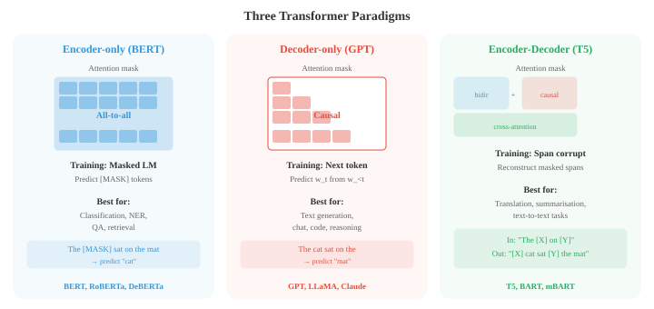
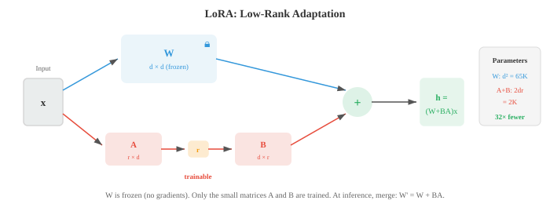
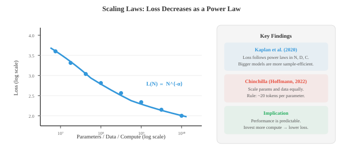

# Transformer 与语言模型

> **一句话总结**: Transformer 用自注意力取代循环, 成为语言理解与生成的统治性架构; 本节讲清 BERT、GPT、T5 三大范式, 位置编码 (正弦 / RoPE)、预训练目标 (MLM / CLM)、微调、提示工程与缩放律——现代大语言模型的完整蓝图.

*Transformer 用自注意力取代了循环, 成为语言理解与生成的主流架构. 本文覆盖 BERT、GPT、T5、位置编码 (正弦、RoPE)、预训练目标 (MLM、CLM)、微调、提示工程与缩放律——现代大语言模型 (Large Language Model, LLM) 背后的完整蓝图.*

- 第 06 章已经介绍了 Transformer 架构: 自注意力、多头注意力、位置编码、编码器-解码器结构. 这里我们聚焦于: Transformer 如何针对具体的自然语言处理 (Natural Language Processing, NLP) 范式做适配、定义了现代 NLP 的那几个模型 (BERT、GPT、T5), 以及让它们能在规模上真正跑起来的技术.

- 回忆一下核心操作: **缩放点积注意力** 计算 $\text{softmax}(QK^T / \sqrt{d_k}) V$, 其中查询、键、值都是输入的线性投影. **多头注意力** 并行跑 $h$ 个注意力头, 每个头用不同的可学习投影, 最后把结果拼接. Transformer 块再套上残差连接、层归一化 (Layer Normalization, LN) 和逐位置的前馈网络 (feed-forward network) (第 06 章).

- 一个微妙但重要的架构选择, 是**层归一化**放在哪. 原始 Transformer 用 **post-norm**: 残差和归一化在子层之后, 即 $\text{LayerNorm}(x + \text{Sublayer}(x))$.

- 大多数现代模型改用 **pre-norm**: 先归一化再进子层, 即 $x + \text{Sublayer}(\text{LayerNorm}(x))$. Pre-norm 训练更稳, 因为残差直接走恒等通路传梯度, 不受归一化影响. 这样即使模型很深, 也不需要小心翼翼地调学习率预热.

- 每个 Transformer 块里的**前馈子层**, 是一个对每个 token 位置独立作用的两层多层感知机 (Multi-Layer Perceptron, MLP):

$$\text{FFN}(x) = W_2 \cdot \text{GELU}(W_1 x + b_1) + b_2$$

- 内部维度通常是模型维度的 4 倍 (例如 $d_{\text{model}} = 768$, $d_{\text{ff}} = 3072$). 这个 FFN 大约占了每一块参数量的三分之二, 一般认为它扮演了一个键值记忆的角色, 把训练里学到的事实知识存起来.

- **位置编码** 给模型提供 token 的顺序信息, 因为注意力本身是置换等变的. 原始的**正弦位置编码** (第 06 章) 用不同频率的固定正弦、余弦函数. **可学习位置嵌入**给每个位置加一个可训练的向量 (BERT 与 GPT-2 就是这么用的). 两者都是绝对编码: 位置 5 拿到的向量与上下文无关.

- **旋转位置编码 (Rotary Position Embedding, RoPE)** 通过在二维子空间里旋转查询和键向量来编码位置. 对一对维度 $(q_{2i}, q_{2i+1})$, 按角度 $m\theta_i$ 旋转 (其中 $m$ 是位置, $\theta_i = 10000^{-2i/d}$), 变换如下:

```math
\begin{bmatrix} q'_{2i} \\ q'_{2i+1} \end{bmatrix} = \begin{bmatrix} \cos m\theta_i & -\sin m\theta_i \\ \sin m\theta_i & \cos m\theta_i \end{bmatrix} \begin{bmatrix} q_{2i} \\ q_{2i+1} \end{bmatrix}
```


- RoPE 的妙处在于, 旋转后的查询与键的点积 $q'^T k'$ 只依赖相对位置 $m - n$, 与绝对位置无关.

- 要看清这一点, 把旋转写成 $q' = R_m q$、$k' = R_n k$, 其中 $R_m$ 是分块对角旋转矩阵. 注意力分数变成:

$$q'^T k' = (R_m q)^T (R_n k) = q^T R_m^T R_n \, k = q^T R_{n-m} \, k$$

- 最后一步用到旋转群的性质: $R_m^T R_n = R_{n-m}$ (先反向旋转 $m$ 再正向旋转 $n$, 等价于旋转 $n - m$).

- 也就是说, 注意力分数只依赖相对距离 $n - m$, 与 $m$、$n$ 各自的绝对值无关.

- 模型不需要任何可学习的位置参数, 就获得了自然的距离感, 而且能推广到训练中没见过的序列长度.

- **ALiBi** (Attention with Linear Biases, 带线性偏置的注意力) 用了一种更简单的思路: 直接根据距离给注意力分数加一个固定的线性惩罚, 即 $\text{score}_{ij} = q_i^T k_j - m \cdot |i - j|$, 其中 $m$ 是每个头特有的斜率. 不同的头用不同的斜率, 让一些头看局部, 另一些头看全局. ALiBi 完全不需要学习任何位置参数, 而且对更长序列的外推很友好.

- 有了自注意力和位置编码, 我们就搭好了 token 之间信息流动的通道; 但真正决定模型能做什么的, 是它被要求预测什么、以及在预测时能看到多少上下文. 语言任务本质上都是**条件生成** (conditional generation): 分类是给定输入预测标签, 翻译是给定源句预测目标句, 对话是给定历史预测回复, 甚至掩码语言建模也是给定周围 token 预测被遮的 token. 不同任务对"条件"与"生成"边界的划分, 决定了模型该怎么设计.

- 而**注意力掩码** (谁能看谁) 和**训练目标** (损失惩罚谁) 就是划分这条边界的两把手术刀. 下面要讲的三种范式, 正是围绕这两把手术刀展开: 让全部 token 互看、只在被遮位置算损失 → 双向理解; 让 token 只看过去、在每个位置预测下一个 → 自回归生成; 让编码器与解码器各司其职、用交叉注意力衔接 → 序列到序列. 掩码与目标一变, 模型的定位就变了.

- 基于 Transformer 的语言模型有三种主导范式: **仅编码器** (encoder-only)、**仅解码器** (decoder-only)、**编码器-解码器** (encoder-decoder). 它们的区别在于模型能看到什么 (注意力掩码) 以及怎么训练.



- **BERT** (Bidirectional Encoder Representations from Transformers, Devlin et al., 2019) 是仅编码器模型的代表. 它用完全的双向注意力处理文本: 每个 token 都可以关注其他任意 token, 无论左侧还是右侧. 这给了 BERT 很丰富的上下文表示, 但也意味着它不能像自回归那样生成文本.

- BERT 用两个目标做预训练. **掩码语言建模 (Masked Language Modelling, MLM)** 随机遮住 15% 的输入 token, 让模型预测这些 token. 被选中的 token 里, 80% 替换为 [MASK], 10% 替换成随机词, 10% 保持原样 (防止模型只在看到 [MASK] 时才预测). 训练目标是:

$$\mathcal{L}_{\text{MLM}} = -\sum_{i \in \mathcal{M}} \log P(w_i \mid w_{\backslash \mathcal{M}})$$

- 其中 $\mathcal{M}$ 是被遮位置的集合, $w_{\backslash \mathcal{M}}$ 是这些位置被遮住之后的句子. 这是一个**去噪** (denoising) 目标: 让模型学会从被破坏的输入还原原文.


- **下一句预测 (Next Sentence Prediction, NSP)** 训练 BERT 判断两句话在原文里是否相邻. 输入开头有一个特殊的 [CLS] token, 用来做这个二分类. 加入 NSP 是为了帮问答这类需要理解句间关系的任务, 不过后来的工作 (RoBERTa) 表明它贡献很小, 完全可以去掉.

- BERT 预训练得到的表示, 通过在顶部加一个任务专属的头 (一个简单的线性层) 再对整个模型微调, 就能迁移到下游任务. 分类任务用 [CLS] token 的表示; token 级任务 (命名实体识别 (Named Entity Recognition, NER)、词性 (Part-of-Speech, POS) 标注) 用每个 token 的表示. 这种**微调** (fine-tuning) 方法能把预训练时学到的语言学知识, 迁移到只有少量标注数据的新任务上.

- **GPT** (Generative Pre-trained Transformer, Radford et al., 2018) 是仅解码器模型的代表. 它用**因果 (自回归) 注意力**: 每个 token 只能关注之前的位置 (以及自身). 实现方式是在注意力矩阵里把未来位置的分数在 softmax 之前设为 $-\infty$. 训练目标很简单, 就是**因果语言建模** (Causal Language Modelling, CLM): 给定所有之前的 token, 预测下一个 token.

$$\mathcal{L}_{\text{CLM}} = -\sum_{i=1}^{n} \log P(w_i \mid w_1, \ldots, w_{i-1})$$

- 这和文件 02 里的 n-gram 语言模型目标是同一个, 只是换成了 Transformer 参数化, 可以基于整个前文条件化, 而不再只是最后 $k-1$ 个 token.

- **GPT-2** 把这套东西扩到 15 亿参数, 展示了很强的零样本能力: 完全不微调, 只用自然语言提示词 (如 "Translate English to French: ...") 条件化, 就能完成任务.

- **GPT-3** (1750 亿参数) 证明: 光靠规模就能激活**上下文学习** (In-Context Learning, ICL) —— 在提示词里给几个输入-输出示例, 模型不用任何梯度更新就能完成新任务.

- **编码器-解码器模型**, 如 **T5** (Text-to-Text Transfer Transformer, Raffel et al., 2020), 把所有 NLP 任务统一成"文本到文本": 输入是一段文字 (可能带任务前缀, 如 "translate English to German:"), 输出也是一段文字. 编码器用双向注意力处理输入, 解码器用带交叉注意力的自回归方式生成输出.

- T5 用**片段破坏** (span corruption) 做预训练: 随机选一些连续 token 片段, 用哨兵 (sentinel) token 替换, 让模型生成原始 token. 例如 "The cat sat on the mat" 可能变成输入 "The [X] on [Y]", 目标是 "[X] cat sat [Y] the mat". 这是把 BERT 的 MLM 从单个 token 推广到片段.

- **BART** (Lewis et al., 2020) 是另一个编码器-解码器模型, 也用去噪目标预训练, 但破坏策略更丰富: token 掩码、token 删除、片段掩码、句子重排、文档旋转. 这种多样性迫使模型学出更鲁棒的表示.

- 随着语言模型越做越大, **全量微调** (更新全部参数) 变得不切实际: 一个 1750 亿参数的模型光是存优化器状态就要几百 GB. **参数高效微调 (Parameter-Efficient Fine-Tuning, PEFT)** 方法只调整很小一部分参数.

- **适配器** (adapter) 在原有的 Transformer 层之间插入小的瓶颈层 (通常是两层线性带一个非线性: 先降维到很小, 再升维回来). 只训练适配器权重, 原模型冻结. 这样新增参数不到 5%, 但在大多数任务上能追平全量微调.

- **LoRA** (Low-Rank Adaptation, 低秩适配) 不加新层, 而是直接改写权重矩阵. 它不去更新完整的权重矩阵 $W$, 而是学习该更新的低秩分解: $W' = W + BA$, 其中 $B$ 是 $d \times r$、$A$ 是 $r \times d$、$r \ll d$ (通常 $r = 4$ 到 $r = 64$). 原始 $W$ 冻结, 只训练 $A$ 与 $B$. 推理时, 更新可以直接合并进原始权重, 不带来任何额外延迟:

$$W' = W + BA$$



- **前缀微调** (prefix tuning) 在每个注意力层的键和值矩阵前, 拼上一段可学习的"虚拟 token". 模型把这些前缀向量当真 token 来关注, 只训练前缀参数. 它与提示微调类似, 只不过操作发生在激活空间, 而不是嵌入空间.

- **提示工程** (prompt engineering) 是一门艺术: 设计输入文本, 使预训练模型在不更新任何参数的情况下产出想要的行为.

    - **零样本提示** (zero-shot prompting) 用自然语言描述任务 (如 "Classify the sentiment of the following review:").

    - **少样本提示** (few-shot prompting) 在真正的查询之前, 给几个输入-输出示例.

    - **思维链 (Chain-of-Thought, CoT) 提示** 加入 "Let's think step by step" 这样的句子, 或在示例里包含推理过程. 这在算术与逻辑推理任务上能大幅提高表现, 因为它引导模型把问题拆解开.

- **上下文学习 (In-Context Learning, ICL)** 指大语言模型能仅凭提示词里的示例学会执行任务, 不需任何梯度更新. 模型的权重完全不变, 它把示例当作某种隐式规格说明来使用.

- ICL 到底是怎么运作的, 仍是活跃的研究问题; 一个假说是, 注意力层在前向传播中实现了某种形式的梯度下降, 相当于在这些上下文示例上"训练"了一遍.

- **缩放律** (scaling laws) 描述了模型规模、数据规模、算力预算与性能 (以损失衡量) 之间可预测的关系. Kaplan et al. (2020) 发现损失在每个变量上都服从幂律:

$$L(N) \propto N^{-\alpha_N}, \quad L(D) \propto D^{-\alpha_D}, \quad L(C) \propto C^{-\alpha_C}$$

- 其中 $N$ 是参数量, $D$ 是数据集规模, $C$ 是算力预算. 这些幂律在若干个数量级上都成立, 意味着简单地"放大"就能带来可预测的提升.



- **Chinchilla 缩放律** (Hoffmann et al., 2022) 修正了这一结论, 指出大多数大模型是训练不足的. 对固定的算力预算 $C$, 最优的分配是模型规模与训练数据同等放大:

$$N_{\text{opt}} \propto C^{0.5}, \quad D_{\text{opt}} \propto C^{0.5}$$

- 也就是说, 算力预算翻倍时, 模型规模和数据集规模都应该乘以 $\sqrt{2}$, 而不是只把模型做大. 

- Kaplan 等人当初建议 $N$ 比 $D$ 涨得更快, 结果就催生了大量参数极多但数据严重不足的模型. Chinchilla (700 亿参数, 1.4T token) 在同样算力预算下追平了 Gopher (2800 亿参数, 3000 亿 token), 证明之前的模型确实严重"数据饥渴".

- 一条实用的经验法则: 每个参数配大约 20 个 token 来训练.

- **专家混合 (Mixture of Experts, MoE)** 是一种在不同比例增加计算量的前提下扩容模型的架构. 它不用一个大的前馈层, 而是用多个**专家**前馈层, 再加一个**门控网络** (router, 路由器) 来决定每个 token 激活哪些专家.

- 门控函数给每个专家算一个路由分数, 选出 top-$k$ (通常 $k = 1$ 或 $k = 2$):

$$G(x) = \text{TopK}(\text{softmax}(W_g x))$$

- 只有被选中的专家会处理这个 token, 于是计算成本按激活专家数 $k$ 增长, 而不是按专家总数 $E$ 增长. 一个 8 专家、top-2 路由的模型, 参数量是同规模稠密模型的 4 倍, 但计算量只有 2 倍.


- MoE 的一个关键难题是**负载均衡** (load balancing): 如果路由器把大部分 token 都送给少数几个"热门"专家, 其他专家就浪费了. 训练时会加一个辅助的**负载均衡损失**, 鼓励专家利用率均匀:

$$\mathcal{L}_{\text{balance}} = E \cdot \sum_{i=1}^{E} f_i \cdot p_i$$

- 其中 $f_i$ 是分配给专家 $i$ 的 token 比例, $p_i$ 是专家 $i$ 的平均路由概率. 只有当 token 比例与路由概率都均匀 (各等于 $1/E$) 时, 这个乘积才最小.

- **专家并行** (expert parallelism) 把不同专家分布到不同加速器上. 前向传播时, 需要一次 all-to-all 通信, 把 token 送到承载对应专家的设备, 再把结果送回来. 这份通信开销就是 MoE 在大规模场景下的主要工程挑战. Switch Transformer、Mixtral、GShard 等模型都用 MoE 在可控推理成本下取得了强表现.

- 造模型只完成了一半工作, 另一半是衡量它是不是真的能用. NLP 评测格外难, 因为语言本身有歧义、主观且开放式.

- 一段翻译可以有很多种正确译法. 一段摘要即使和参考答案一个词都不重合, 也可能是好摘要.

- 一个聊天机器人的回答可以既有用、又无害、又诚实, 而理性的人依然会给出不同判断.

- **精确匹配 (Exact Match, EM)** 是最简单的指标: 模型输出是否与标准答案完全一致? 常用于短、无歧义答案的任务, 比如抽取式问答 (SQuAD) 或封闭式数学.

- EM 很苛刻: "New York City" 和 "new york city" 如果不做归一化会判定不匹配 —— 但正因简单, 它无歧义.

- **Token 级指标** 把 NLP 当作 token 级的分类问题, 用第 06 章的精确率、召回率与 F1.

- **精确率** (precision) 衡量模型预测的 token 里有多少是对的: $P = \text{TP} / (\text{TP} + \text{FP})$. 一个几乎不预测实体但预测的全对, 精确率就很高.

- **召回率** (recall) 衡量金标准里的 token 有多少被模型找到: $R = \text{TP} / (\text{TP} + \text{FN})$. 一个把每个 token 都当实体的模型, 召回率满分, 但精确率极差.

- **F1** 是精确率与召回率的调和平均:

$$F_1 = \frac{2PR}{P + R}$$

- 用调和平均 (而不是算术平均) 是为了惩罚失衡: 只要 $P$ 或 $R$ 有一个低, $F_1$ 就低. 对 NER (文件 02), F1 按每个实体类型算, 再在类型上做宏平均. 对 POS 标注, 因为每个 token 都有标签, 更常用 token 级准确率.

- **片段级 F1** (SQuAD 里用的) 比较预测片段与金标准片段的 token 集合. 它比 EM 宽松: 如果金标准是 "the Eiffel Tower", 模型给出 "Eiffel Tower", 片段 F1 会很高 (5 个中 4 个重叠), 而 EM 直接是 0.

- **BLEU** (Bilingual Evaluation Understudy, Papineni et al., 2002) 是机器翻译的经典指标. 它衡量候选译文与一个或多个参考译文之间的 n-gram 重叠. 得分把多个 n-gram 层级的精确率 (1-gram 到 4-gram) 结合起来, 再乘以一个短句惩罚:

$$\text{BLEU} = \text{BP} \cdot \exp\!\left(\sum_{n=1}^{N} w_n \log p_n\right)$$

- 其中 $p_n$ 是**修改后的 n-gram 精确率**: 候选中每个 n-gram 的出现次数被截断到它在任一参考中出现的最大次数, 防止像 "the the the the" 这种退化候选拿高分. 权重 $w_n$ 通常均匀 ($w_n = 1/N$, $N = 4$).

- **短句惩罚** $\text{BP} = \min(1, \exp(1 - r/c))$ 惩罚比参考短的候选 ($c$ 是候选长度, $r$ 是参考长度). 没有它, 模型只需输出很少的、非常保险的词就能拿到高精确率.

- BLEU 在语料级 (跨大量句子平均) 与人工判断有合理相关性, 但句子级相关性就很差了.

- 它奖励精确的 n-gram 匹配, 却完全错过合理的同义改写: "the cat is on the mat" 与 "a feline sits atop the rug" 意思一样, 二元组重叠却是零.

- BLEU 还完全忽略召回率 —— 只输出最常见词的候选也能在精确率上得高分.

- **ROUGE** (Recall-Oriented Understudy for Gisting Evaluation, Lin, 2004) 是摘要任务的标准指标. 和强调精确率的 BLEU 不同, ROUGE 强调召回率: 参考里的 n-gram 有多少比例出现在候选中?

- **ROUGE-N** 算 n-gram 召回: $\text{ROUGE-N} = \frac{|\text{n-grams}_{\text{ref}} \cap \text{n-grams}_{\text{cand}}|}{|\text{n-grams}_{\text{ref}}|}$. ROUGE-1 (一元) 与 ROUGE-2 (二元) 最常见.

- ROUGE-L 用候选与参考之间的**最长公共子序列 (Longest Common Subsequence, LCS)**, 能捕捉句子层面的词序, 而无需连续匹配.

- LCS 长度除以参考长度得召回率, 除以候选长度得精确率, F 值把两者结合:

- LCS 通过动态规划以 $O(mn)$ 时间计算 (和文件 02 的编辑距离类似):

$$R_{\text{LCS}} = \frac{\text{LCS}(X, Y)}{m}, \quad P_{\text{LCS}} = \frac{\text{LCS}(X, Y)}{n}, \quad F_{\text{LCS}} = \frac{(1 + \beta^2) R_{\text{LCS}} P_{\text{LCS}}}{R_{\text{LCS}} + \beta^2 P_{\text{LCS}}}$$

- 其中 $m$、$n$ 分别是参考与候选的长度, $\beta$ 通常取偏向召回的值 ($\beta \to \infty$ 就是纯召回).

- **METEOR** (Metric for Evaluation of Translation with Explicit ORdering, Banerjee and Lavie, 2005) 通过引入同义词、词干、词序来弥补 BLEU 的短板.

- 它先在候选与参考之间对齐词汇: 精确匹配、词干匹配 (用文件 02 的 Porter 词干还原) 与同义词匹配 (用文件 01 的 WordNet).

- 然后算一元 gram 的精确率与召回率的调和平均, 权重偏向召回, 再加一个碎片化惩罚: 如果匹配到的词在候选与参考中顺序不同, 就扣分.

- **ChrF** (Character n-gram F-score, 字符 n-gram F 值) 在字符 n-gram 而不是词 n-gram 上算 F 值. 这样对形态变化很鲁棒 (对文件 01 里的粘着语至关重要), 也能部分处理分词差异. ChrF++ 在字符 n-gram 之外再加上词二元 gram.

- 它已经和 BLEU 并列, 成为机器翻译推荐指标, 尤其对形态丰富的语言.

- **困惑度** (perplexity) (文件 02) 衡量语言模型对留出测试集的预测能力. 它是语言模型的标准内在指标: $\text{PPL} = \exp(-\frac{1}{N} \sum_{i} \log P(w_i \mid w_{<i}))$. 越低越好.

- 困惑度只在使用相同分词的模型之间可比, 因为不同分词器对同一文本会给出不同的序列长度 $N$.

- 词表更大的模型往往每个 token 的困惑度更低, 但每句处理的 token 数也更少.

- **每字节比特数 (Bits-per-Byte, BPB)** 用文本的 UTF-8 字节数 (而不是 token 数) 归一化, 从而与分词无关:

```math
\text{BPB} = \frac{-\sum_{i} \log_2 P(w_i \mid w_{<i})}{\text{number of UTF-8 bytes}}
```

- **BERTScore** (Zhang et al., 2020) 跳出表层 n-gram 匹配, 在嵌入空间算相似度. 用预训练 BERT 模型的上下文嵌入, 把候选中的每个 token 通过余弦相似度匹配到参考中最相似的 token. 分数聚合为精确率、召回率与 F1:

$$R_{\text{BERT}} = \frac{1}{|r|} \sum_{r_i \in r} \max_{c_j \in c} \cos(r_i, c_j), \quad P_{\text{BERT}} = \frac{1}{|c|} \sum_{c_j \in c} \max_{r_i \in r} \cos(c_j, r_i)$$

- 其中 $r_i$、$c_j$ 是参考与候选 token 的上下文嵌入. 这抓到了 n-gram 指标错过的语义相似性: "automobile" 与 "car" 的 BERT 嵌入很接近, 尽管字符上毫无重叠, 也能拿到高分.

- **BLEURT** (Sellam et al., 2020) 更进一步, 直接在人类质量评分上微调一个 BERT 模型. 给它一对参考-候选, 它输出一个标量质量分. BLEURT 先在合成数据上训练 (用 BLEU、METEOR 之类的指标为参考译文的随机扰动打分), 再在人类评分上微调. 它与人工判断的相关性比任何表层指标都好.

- **COMET** (Crosslingual Optimized Metric for Evaluation of Translation, Rei et al., 2020) 是机器翻译的可学习指标, 它同时以源句、参考、候选为条件 —— 不只是参考与候选. 它用一个多语言编码器 (XLM-R) 嵌入三者, 预测一个质量分. 因为看到了源句, COMET 能识别只看参考的指标漏掉的语义错误 (例如流畅但事实错误的翻译).

- **LLM 当裁判 (LLM-as-judge)** 是现代大规模评测的做法. 不再用参考算指标, 而是让一个强语言模型 (GPT-4、Claude) 通过提示词评估模型输出的质量. 裁判拿到输入、模型的回复、可选的参考答案, 给出一个评分 (如 1-5) 或一个成对偏好 (回复 A 比回复 B 好).

- **成对比较** (pairwise comparison, Chatbot Arena 用的) 是最可靠的 LLM 裁判形式. 裁判看到两个回复, 选出更好的一个, 而不是给绝对分. 这样避免了标定问题 (不同裁判对 "5 分制里的 3 分" 有不同的基线). 结果聚合为 **Elo 评分** (来自国际象棋), 每个模型从一个基础分开始, 根据对阵其他模型的胜负加减分. 模型 $A$ 对模型 $B$ 的预期胜率是:

$$P(A \succ B) = \frac{1}{1 + 10^{(R_B - R_A) / 400}}$$

- 其中 $R_A$、$R_B$ 是 Elo 评分. 每次比较之后更新: $R_A' = R_A + K(S - P(A \succ B))$, 其中 $S \in \{0, 1\}$ 是实际结果, $K$ 控制更新幅度. 稳定击败强对手的模型分数迅速上升; 输给弱对手的模型分数下滑.

- **位置偏差** (position bias) 是 LLM 裁判的已知问题: 它们倾向于偏爱最先看到的那个回复 (某些模型是偏爱第二个). **交换顺序** (每对样本用两种顺序各评一次, 结果取平均) 可以缓解这一点.

- **冗长偏差** (verbosity bias) 是另一个: 即使简短答案更好, 裁判也更喜欢又长又详细的回复.

- **自洽性** (self-consistency) 检查裁判在同一输入的多次评测中是否给出同样的评分. 方差大就说明评测信号噪声大.

- **标注者一致性** (inter-annotator agreement, 用 Cohen's kappa 或 Krippendorff's alpha 衡量) 衡量多位裁判是否一致, 给出评测可靠性的上限.

- **数据污染** (contamination) 是关键顾虑: 如果评测数据出现在模型的训练集里, 分数就被人为拉高, 变得毫无意义.

- 这对在网络抓取数据上训练的 LLM 尤其严重, 因为流行基准很可能出现在训练集里. 缓解手段包括: 使用不公开的留出测试集; 建立动态基准, 定期重新生成题目; **金丝雀字符串** (canary strings, 在基准数据里嵌入独特标识符以检测泄漏); 对比模型在污染与干净子集上的表现差异.

- **标准自然语言理解 (Natural Language Understanding, NLU) 基准** 在多样任务上评估语言理解能力.

- **GLUE** (General Language Understanding Evaluation) 和 **SuperGLUE** 是多任务基准, 覆盖情感 (SST-2)、文本相似度 (STS-B)、自然语言推理 (MNLI、RTE)、指代 (WSC) 与问答 (BoolQ).

- 模型在每个任务上单独评估, 然后用一个综合指标打分. GLUE 现在被认为已经饱和 (模型在大多数任务上超过了人类); SuperGLUE 仍然更具挑战性.

- **MMLU** (Massive Multitask Language Understanding) 用多项选择题, 在 57 门学科 (数学、历史、法律、医学、计算机科学等) 上评估知识与推理.

- 它测的是模型在预训练中吸收了多广的知识. 分数按学科给出, 再取宏平均.

- **MMLU-Pro** 加入了更难、需要多步推理的题目, 答案选项也从 4 个增加到 10 个.

- **HellaSwag** 通过让模型选出场景最合理的续写来测试常识推理. 错误选项是对抗生成的 (用模型), 表面上看合理但语义上错.

- **WinoGrande** 用最小对 (只差一个词) 测试常识指代消解.

- **ARC** (AI2 Reasoning Challenge) 用中小学科学问题, 分 Easy 与 Challenge 两个集合, 测事实与推理能力.

- **推理与数学基准** 评估的是把强 LLM 与弱 LLM 拉开的解题能力.

- **GSM8K** (Grade School Math 8K) 包含 8500 道小学数学应用题, 需要多步算术推理. 它是基础数学推理与评估思维链提示的标准基准 (文件 04).

- **MATH** 是更难的数据集, 题目是竞赛级数学, 覆盖代数、数论、几何、组合与概率. 它们要求多步符号推理, MATH-500 是常报告的 500 题子集.

- **AIME** (American Invitational Mathematics Examination) 的题目是竞赛级: 要做对必须经过多步深度数学推理. DeepSeek-R1 在 AIME 2024 上拿到 79.8%, 说明强化学习训练的推理模型 (文件 05) 已经能逼近顶尖人类选手.

- **HumanEval** 与 **MBPP** (Mostly Basic Programming Problems) 通过检查模型生成的代码是否通过单元测试来评估代码生成. HumanEval 包含 164 道 Python 题, 给出函数签名与文档字符串, 模型要生成函数体.

- 指标是 **pass@k**: $k$ 个生成解至少有一个通过全部测试的概率. 对单个样本:

$$\text{pass@}k = 1 - \frac{\binom{n-c}{k}}{\binom{n}{k}}$$

- 其中 $n$ 是总生成样本数, $c$ 是通过的样本数. 这个公式修正了"简单地取 $k$ 个里最好"带来的偏差.

- **SWE-bench** 更进一步, 评估模型能否解决真实 GitHub issue —— 需要修改现有代码库, 是对实际软件工程能力更严酷的测试.

- **GPQA** (Graduate-Level Google-Proof QA) 包含生物、物理、化学中专家级问题, 连领域专家都难做. 它测的是模型是否真的懂, 而不是靠模式匹配. "Diamond" 子集是最难的.

- **安全与对齐基准** 评估模型是否有用、无害、诚实.

- **TruthfulQA** 测模型是否会复述常见误解. 问题设计得让互联网上最常见的答案是错的 (例如 "吞下口香糖会怎样?", 常见谣言是"会在体内待 7 年", 真相是"会正常通过肠道"). 记住了流行但错误说法的模型会得低分.

- **BBQ** (Bias Benchmark for QA) 测试年龄、性别、种族、宗教等类别上的社会偏见. 题目设计得让有偏见的模型会系统性地选刻板印象答案. **Toxigen** 评估模型对特定人口群体产生有毒内容的倾向.

- **MT-Bench** 用 80 个精心设计的题目评估多轮对话能力, 覆盖写作、角色扮演、推理、数学、编码、抽取、STEM 和人文. 一个 LLM 裁判 (GPT-4) 按 1-10 打分. 多轮形式测试模型是否能跟进、维持上下文、处理澄清请求.

- **Chatbot Arena** (LMSYS) 用真实用户在匿名模型之间做盲评成对比较. 用户提交提示词, 在不知道哪个模型产出的情况下为更好的回复投票. 由此得到的 Elo 榜, 被认为是通用 LLM 质量最生态有效的评测, 因为它反映了真实用户在多样、未经筛选的提示上的偏好.

- **AlpacaEval** 自动化成对评估: 在一组固定指令上, 把模型输出与参考模型 (GPT-4) 比较. 由一个裁判模型判定胜率.

- **AlpacaEval 2.0** 使用长度控制胜率, 来纠正冗长偏差.

- **任务专属评估** 需要为专门领域定制指标.

- **词错率 (Word Error Rate, WER)** 用于语音识别: $\text{WER} = (S + D + I) / N$, 其中 $S$、$D$、$I$ 分别是替换、删除、插入错误, $N$ 是参考词数. 这就是词级的编辑距离 (文件 02), 用参考长度归一化.

- **Slot F1** 用于任务型对话系统, 衡量模型是否能从用户话语中正确抽取结构化信息 (例如从 "Book me a flight to Paris tomorrow" 里抽出 "destination: Paris" 与 "date: tomorrow").

- **引用准确率** 用于检索增强生成 (Retrieval-Augmented Generation, RAG) 系统 (文件 05), 检查模型生成的引用是否真的支持所述内容. 每条论断都对照检索到的段落做核验, 指标是完全支持、部分支持、不支持的论断比例.

- **评测陷阱** 很常见, 而且能让整个基准比较失效.

- **应试式训练** (teaching to the test): 优化基准表现而非真正能力. 一个在 MMLU 式多项选择上微调过的模型, 在 MMLU 上会得高分, 但同一道题换成开放式格式就可能崩.

- **指标钻空子** (metric gaming): 模型可以被优化成产出在自动指标上得高分 (高 BLEU、低困惑度) 的输出, 而实际上并不好. BLEU 最优的翻译, 常常是安全、通用的转述, 而不是自然、流畅的表达.

- **基准饱和** (benchmark saturation): 当模型在某个基准上接近或超过人类表现, 该基准就不再提供信息. GLUE、SQuAD 1.1 等已经饱和.

- 领域会持续造出更难的基准, 但"创造—饱和—替换"的循环, 让纵向比较变得很难.

- **人工评测** 依然是黄金标准, 但代价高、耗时长、难以复现. 不同的标注人群 (众包工人 vs 领域专家、不同文化、不同语言) 会给出不同判断. 报告标注者一致性与标注者人口统计信息, 是可复现性所必需的.

## 编程任务 (使用 CoLab 或 notebook)

1. 从零实现一个完整的 Transformer 编码器块 (多头注意力、前馈、残差连接、层归一化). 把它应用到一个简单的序列分类任务.
```python
import jax
import jax.numpy as jnp
import matplotlib.pyplot as plt

def layer_norm(x, gamma, beta, eps=1e-5):
    mean = x.mean(axis=-1, keepdims=True)
    var = x.var(axis=-1, keepdims=True)
    return gamma * (x - mean) / jnp.sqrt(var + eps) + beta

def multi_head_attention(Q, K, V, W_q, W_k, W_v, W_o, n_heads):
    B, T, D = Q.shape
    head_dim = D // n_heads

    q = Q @ W_q  # (B, T, D)
    k = K @ W_k
    v = V @ W_v

    # 重塑为 (B, n_heads, T, head_dim)
    q = q.reshape(B, T, n_heads, head_dim).transpose(0, 2, 1, 3)
    k = k.reshape(B, T, n_heads, head_dim).transpose(0, 2, 1, 3)
    v = v.reshape(B, T, n_heads, head_dim).transpose(0, 2, 1, 3)

    scores = q @ k.transpose(0, 1, 3, 2) / jnp.sqrt(head_dim)
    weights = jax.nn.softmax(scores, axis=-1)
    out = (weights @ v).transpose(0, 2, 1, 3).reshape(B, T, D)
    return out @ W_o, weights

def transformer_block(x, params):
    # Pre-norm 多头自注意力
    normed = layer_norm(x, params['ln1_g'], params['ln1_b'])
    attn_out, weights = multi_head_attention(
        normed, normed, normed,
        params['W_q'], params['W_k'], params['W_v'], params['W_o'],
        n_heads=4
    )
    x = x + attn_out

    # Pre-norm 前馈
    normed = layer_norm(x, params['ln2_g'], params['ln2_b'])
    ff = jax.nn.gelu(normed @ params['W1'] + params['b1'])
    ff = ff @ params['W2'] + params['b2']
    x = x + ff
    return x, weights

# 初始化参数
d_model, d_ff, n_heads = 32, 128, 4
key = jax.random.PRNGKey(42)
keys = jax.random.split(key, 10)

params = {
    'W_q': jax.random.normal(keys[0], (d_model, d_model)) * 0.05,
    'W_k': jax.random.normal(keys[1], (d_model, d_model)) * 0.05,
    'W_v': jax.random.normal(keys[2], (d_model, d_model)) * 0.05,
    'W_o': jax.random.normal(keys[3], (d_model, d_model)) * 0.05,
    'ln1_g': jnp.ones(d_model), 'ln1_b': jnp.zeros(d_model),
    'ln2_g': jnp.ones(d_model), 'ln2_b': jnp.zeros(d_model),
    'W1': jax.random.normal(keys[4], (d_model, d_ff)) * 0.05,
    'b1': jnp.zeros(d_ff),
    'W2': jax.random.normal(keys[5], (d_ff, d_model)) * 0.05,
    'b2': jnp.zeros(d_model),
}

# 用随机输入测试
x = jax.random.normal(keys[6], (2, 8, d_model))  # batch=2, seq_len=8
out, attn_weights = transformer_block(x, params)
print(f"Input shape:  {x.shape}")
print(f"Output shape: {out.shape}")
print(f"Attention weights shape: {attn_weights.shape}")  # (B, n_heads, T, T)

# 可视化每个头的注意力模式
fig, axes = plt.subplots(1, 4, figsize=(16, 3.5))
for h in range(4):
    im = axes[h].imshow(attn_weights[0, h], cmap='Blues', vmin=0)
    axes[h].set_title(f"Head {h}")
    axes[h].set_xlabel("Key pos"); axes[h].set_ylabel("Query pos")
plt.suptitle("Multi-Head Attention Patterns")
plt.tight_layout(); plt.show()
```

2. 实现因果 (自回归) 注意力掩码, 并与双向注意力对比. 展示掩码如何阻止信息从未来 token 流向过去 token.
```python
import jax
import jax.numpy as jnp
import matplotlib.pyplot as plt

def attention(Q, K, V, mask=None):
    d_k = Q.shape[-1]
    scores = Q @ K.T / jnp.sqrt(d_k)
    if mask is not None:
        scores = jnp.where(mask, scores, -1e9)
    weights = jax.nn.softmax(scores, axis=-1)
    return weights @ V, weights

seq_len, d_model = 6, 8
key = jax.random.PRNGKey(0)
k1, k2, k3 = jax.random.split(key, 3)
Q = jax.random.normal(k1, (seq_len, d_model))
K = jax.random.normal(k2, (seq_len, d_model))
V = jax.random.normal(k3, (seq_len, d_model))

# 双向 (编码器式): 所有位置都可见
bidir_mask = jnp.ones((seq_len, seq_len), dtype=bool)
bidir_out, bidir_weights = attention(Q, K, V, bidir_mask)

# 因果 (解码器式): 只能看到过去和当前位置
causal_mask = jnp.tril(jnp.ones((seq_len, seq_len), dtype=bool))
causal_out, causal_weights = attention(Q, K, V, causal_mask)

fig, axes = plt.subplots(1, 3, figsize=(14, 4))
tokens = [f"t{i}" for i in range(seq_len)]

axes[0].imshow(bidir_weights, cmap='Blues', vmin=0, vmax=0.5)
axes[0].set_title("Bidirectional Attention\n(BERT-style)")
axes[0].set_xticks(range(seq_len)); axes[0].set_xticklabels(tokens)
axes[0].set_yticks(range(seq_len)); axes[0].set_yticklabels(tokens)

axes[1].imshow(causal_mask.astype(float), cmap='Greys', vmin=0, vmax=1)
axes[1].set_title("Causal Mask\n(1 = allowed, 0 = blocked)")
axes[1].set_xticks(range(seq_len)); axes[1].set_xticklabels(tokens)
axes[1].set_yticks(range(seq_len)); axes[1].set_yticklabels(tokens)

axes[2].imshow(causal_weights, cmap='Blues', vmin=0, vmax=0.5)
axes[2].set_title("Causal Attention\n(GPT-style)")
axes[2].set_xticks(range(seq_len)); axes[2].set_xticklabels(tokens)
axes[2].set_yticks(range(seq_len)); axes[2].set_yticklabels(tokens)

for ax in axes:
    ax.set_xlabel("Key"); ax.set_ylabel("Query")
plt.tight_layout(); plt.show()

# 验证: 因果注意力下, 位置 i 的输出只依赖 <= i 的位置
print("Causal attention weight at position 2 (should only attend to 0, 1, 2):")
print(f"  Weights: {causal_weights[2]}")
print(f"  Sum of future weights (should be ~0): {causal_weights[2, 3:].sum():.6f}")
```

3. 实现 LoRA (低秩适配), 展示它如何用远少于全量微调的可训练参数修改一个权重矩阵.
```python
import jax
import jax.numpy as jnp

d_model = 256
rank = 4  # LoRA 秩 (远小于 d_model)

key = jax.random.PRNGKey(42)
k1, k2, k3 = jax.random.split(key, 3)

# 原始冻结的权重矩阵
W_frozen = jax.random.normal(k1, (d_model, d_model)) * 0.02

# LoRA 矩阵 (只有它们可训练)
B = jnp.zeros((d_model, rank))       # 初始化为零
A = jax.random.normal(k2, (rank, d_model)) * 0.01  # 随机初始化

# 前向: W_effective = W_frozen + B @ A
x = jax.random.normal(k3, (8, d_model))

# 不用 LoRA
y_original = x @ W_frozen.T

# 用 LoRA
W_effective = W_frozen + B @ A
y_lora = x @ W_effective.T

# 参数量
full_params = d_model * d_model
lora_params = d_model * rank + rank * d_model  # B + A

print(f"Model dimension: {d_model}")
print(f"LoRA rank: {rank}")
print(f"Full fine-tuning parameters: {full_params:,}")
print(f"LoRA parameters: {lora_params:,}")
print(f"Parameter reduction: {full_params / lora_params:.1f}x")
print(f"\nSince B is initialised to zeros, initial LoRA output matches original:")
print(f"  Max difference: {jnp.abs(y_original - y_lora).max():.2e}")

# 模拟训练: 只更新 A 与 B
def lora_forward(A, B, W_frozen, x):
    return x @ (W_frozen + B @ A).T

def dummy_loss(A, B, W_frozen, x, target):
    pred = lora_forward(A, B, W_frozen, x)
    return jnp.mean((pred - target) ** 2)

# 目标: x 的某个变换
target = x @ jax.random.normal(jax.random.PRNGKey(99), (d_model, d_model)).T * 0.02

grad_fn = jax.jit(jax.grad(dummy_loss, argnums=(0, 1)))
lr = 0.01

for step in range(200):
    gA, gB = grad_fn(A, B, W_frozen, x, target)
    A = A - lr * gA
    B = B - lr * gB

loss_before = dummy_loss(jnp.zeros_like(A), jnp.zeros_like(B), W_frozen, x, target)
loss_after = dummy_loss(A, B, W_frozen, x, target)
print(f"\nLoss before LoRA: {loss_before:.6f}")
print(f"Loss after LoRA:  {loss_after:.6f}")
print(f"Effective weight change rank: {jnp.linalg.matrix_rank(B @ A)}")
```

---

## 📌 本节要点

- **Transformer 架构核心**: 缩放点积注意力 + 多头注意力 + 残差 + 层归一化 + 前馈, FFN 承担约三分之二参数.
- **Pre-norm vs Post-norm**: 现代模型多用 pre-norm, 让梯度直接走恒等通路, 训练更稳, 深层模型无需精细预热.
- **位置编码演进**: 从正弦编码 (绝对) 到 RoPE (通过旋转实现相对位置) 再到 ALiBi (线性距离惩罚, 零学习参数, 可外推长序列).
- **三大范式**: 仅编码器 (BERT, MLM+NSP, 双向注意力, 分类); 仅解码器 (GPT, CLM, 因果注意力, 生成); 编码器-解码器 (T5 span corruption, BART 多重去噪, 序列到序列).
- **参数高效微调**: 适配器插入瓶颈层, LoRA 用 $W' = W + BA$ 低秩分解 (通常 $r=4\!\sim\!64$), 前缀微调在激活空间加虚拟 token.
- **提示工程与 ICL**: 零样本、少样本、思维链均无需梯度更新, 大模型能靠上下文示例学习新任务.
- **缩放律**: Kaplan 的幂律指导, Chinchilla 修正为 $N \propto C^{0.5}$、$D \propto C^{0.5}$, 经验法则每参数约 20 token.
- **MoE 架构**: 多专家 + 门控路由, 计算量按 $k$ 增长而非按 $E$ 增长, 需辅助负载均衡损失, 专家并行的通信是核心瓶颈.
- **评测体系**: EM/F1 (精确) → BLEU/ROUGE/METEOR/ChrF (n-gram) → BERTScore/BLEURT/COMET (学习式) → LLM 当裁判 + Chatbot Arena Elo, 需警惕位置偏差、冗长偏差、数据污染.
- **主流基准**: GLUE/SuperGLUE、MMLU、HellaSwag、GSM8K/MATH/AIME、HumanEval/SWE-bench、GPQA、TruthfulQA/BBQ、MT-Bench/Chatbot Arena, 都面临饱和与"应试式训练"陷阱.
