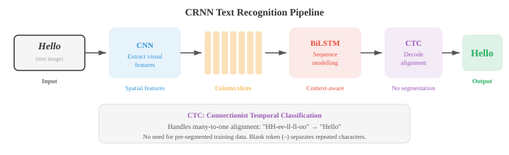
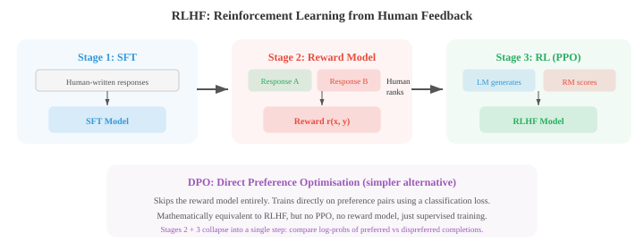
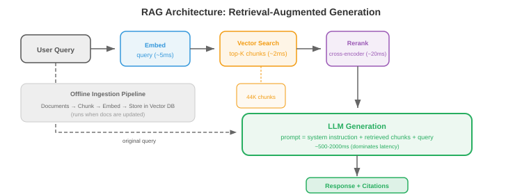

# 高级文本生成

> **一句话总结**：越过普通自回归解码，用文本扩散、RLHF/DPO 对齐、长上下文技巧、检索增强与推测解码，让 LLM 生成得更好、更可控、更快。

*高级文本生成超越普通的自回归解码，在质量、可控性与速度上做出改进。 本节涵盖文本扩散模型 (D3PM、MDLM)、光学字符识别、用于对齐的 RLHF 与 DPO、长上下文方法 (RoPE 缩放、环形注意力)、检索增强生成，以及用于加速推理的推测解码.*

- 标准的自回归生成 (第 04 节) 从左到右，一次产生一个 token. 这种方式简单有效，但天生是串行的，也谈不上什么全局规划，对输出的控制也有限。 本节要讲的都是超越普通自回归解码的方法：面向文本的扩散模型、光学字符识别、通过人类反馈实现的可控生成、长上下文处理、检索增强生成，以及用于加速推理的推测解码。

- **文本扩散模型 (text diffusion models)** 把扩散框架 (第 08 章为图像引入) 应用到离散文本上。 核心难点是文本是离散的：没法像给像素加连续高斯噪声那样，给 token 加连续噪声。 有几种思路解决这个问题。

- **D3PM** (Discrete Denoising Diffusion Probabilistic Models, Austin et al., 2021) 直接在离散 token 上用转移矩阵定义前向腐蚀过程。 每一步前向，一个 token 有一定概率被替换成别的 token (均匀噪声)、被掩盖 (吸收态)，或者保持不变。 反向过程学着去噪，从被腐蚀的 token 里预测出干净的那个。 第 $t$ 步的转移矩阵 $Q_t$ 控制腐蚀:

$$q(x_t \mid x_{t-1}) = \text{Cat}(x_t ; \, x_{t-1} Q_t)$$

- 这里 $\text{Cat}$ 表示分类分布，$x$ 是 one-hot 向量。 多步前向过程 $q(x_t \mid x_0)$ 有闭式解：$q(x_t \mid x_0) = \text{Cat}(x_t ; \, x_0 \bar{Q}_t)$，其中 $\bar{Q}_t = Q_1 Q_2 \cdots Q_t$ 是到第 $t$ 步为止所有转移矩阵的连乘。 训练目标是最小化一个跨时间步分解的变分下界 (ELBO)，和连续情况 (第 08 章) 类似:

$$\mathcal{L}_{\text{D3PM}} = D_{\text{KL}}(q(x_T \mid x_0) \| p(x_T)) + \sum_{t=2}^{T} D_{\text{KL}}(q(x_{t-1} \mid x_t, x_0) \| p_\theta(x_{t-1} \mid x_t)) - \log p_\theta(x_0 \mid x_1)$$

- 第一项保证完全腐蚀后的分布对上先验 (均匀分布或全掩码). 中间那堆 KL 项训练模型学会反演每一步腐蚀：真实的反向后验 $q(x_{t-1} \mid x_t, x_0)$ 可以用贝叶斯规则加上已知的转移矩阵闭式算出，模型 $p_\theta(x_{t-1} \mid x_t)$ 就是被训着去拟合它。

- 因为两个分布都是分类分布，KL 散度就是在词表上做一次简单求和。 最后一项衡量从最轻腐蚀态开始的重建质量。

- **MDLM** (Masked Diffusion Language Models, Sahoo et al., 2024) 简化了 D3PM，只用一种腐蚀操作 —— 掩码：前向过程逐步把 token 替换成 [MASK]，反向过程再预测原始 token. 这就把文本扩散和掩码语言建模 (BERT，第 04 节) 联系起来了，扩散时间步控制被掩掉的 token 比例。 $t = 0$ 时文本完全干净，$t = T$ 时完全被掩。

- **连续文本扩散 (continuous text diffusion)** 绕开离散问题，直接在连续嵌入空间里做。 先把 token 映射到嵌入向量 (第 06 章)，在这个连续空间里加噪声，再让一个去噪模型 (通常是 Transformer) 学着反演。 生成时，模型输出连续向量，再通过找最近邻嵌入映射回离散 token. 麻烦在于连续空间里小小的误差可能对应到完全错的 token，所以要小心地做四舍五入和截断。


- 文本扩散的魅力在于：它是通过迭代精炼**同时**生成所有 token 的，而不是从左到右一个个来。 这带来了全局一致性以及"填空"的便利 (在一段文字中间生成缺失部分)，但目前的文本扩散模型在长文本生成质量上还是落后于自回归模型。

- **文本 OCR** (Optical Character Recognition, OCR，光学字符识别) 是从图像里提取文字的任务。 虽然传统上不算语言生成，但现代 OCR 系统和 NLP 深度融合，越来越多地用到语言模型组件。

- **场景文字检测 (scene text detection)** 负责在自然图像里定位文字区域 (街道标牌、商品标签、车牌). 这活儿难，因为野外的文字任意角度、任意尺度、任意字体，背景还乱糟糟的。 检测方法一般用 CNN 或 Transformer 主干，输出文字区域的边界框或分割掩码。

- **CRNN** (Convolutional Recurrent Neural Network, CRNN，卷积循环神经网络，Shi et al., 2017) 是经典的文字识别架构。 CNN 先从文字图像里抽视觉特征，特征图沿水平方向切成一列列 (一个位置一列) 的序列，再由双向 LSTM 读这个序列，建模上下文。 输出通过 **CTC** (Connectionist Temporal Classification, CTC，连接时序分类) 解码，CTC 能处理输入列和输出字符之间的对齐，不需要显式的分割标注。

- CTC 解决的核心问题是：模型产出 $T$ 个输出分布 (每列一个)，但目标文本有 $L \leq T$ 个字符。

- 我们不知道哪一列对应哪个字符。 CTC 引入了一个 **blank token** $\epsilon$，定义了一个多对一的映射 $\mathcal{B}$，它把重复字符合并、把 blank 去掉：$\mathcal{B}(\text{"HH-ee-ll-ll-oo"}) = \text{"Hello"}$ (这里的 "-" 是 blank).

- 目标序列 $y$ 的概率就是所有能塌缩到 $y$ 的对齐路径的概率之和:

$$P(y \mid x) = \sum_{\pi \in \mathcal{B}^{-1}(y)} \prod_{t=1}^{T} P(\pi_t \mid x)$$

- 这里 $\pi$ 是一条长度为 $T$ 的对齐路径 (每列一个标签，blank 也算). 硬遍历所有路径是指数级的，但**前向算法** (第 05 章 HMM) 用动态规划就能 $O(T \cdot L)$ 时间高效算出这个求和。

- blank token 是必不可少的：没有它，像 "Hello" 里的 "ll" 那种重复字符就和单个 "l" 无法区分了。 训练时最大化 $\log P(y \mid x)$，推理时对 CTC 输出用束搜索或贪心解码找最佳路径。

- **文档 OCR (document OCR)** 处理结构化文档 (发票、表单、科学论文)，除了识字，还得理解版面。 现代系统像 LayoutLM 把文字识别和空间位置特征结合起来：每个 token 既有文本嵌入，又有一个编码它在页面上 $(x, y)$ 坐标的位置嵌入。 这样模型才能明白 "Total:" 下面的那个数字就是总金额。



- **视觉-语言 OCR (vision-language OCR)** 模型比如 TrOCR 把文字识别直接当作图像到文本的生成：一个 Vision Transformer 编码器处理图像，一个语言模型解码器一个字符一个字符地生成文本。 这利用了预训练视觉和语言模型的能力，不需要手工设计特征，就能处理各种脚本、字体和版面。

- **可控生成 (controllable generation)** 要解决的是：如何让语言模型按指定属性输出，比如某种风格、某个话题、某种情感、某种安全等级或某种事实准确性。 模型得听指令，但同时还要流畅连贯。

- **分类器无关引导 (Classifier-Free Guidance, CFG)** 用在文本上是把图像生成里的一个技巧搬过来。 训练时以一定比例随机丢掉条件信号 (比如提示词)，这样一个模型同时学会了有条件和无条件两种模式。 推理时对输出 logits 做插值:

$$\text{logits}_{\text{guided}} = (1 + w) \cdot \text{logits}_{\text{conditional}} - w \cdot \text{logits}_{\text{unconditional}}$$

- $w > 0$ 会放大条件的影响。 $w$ 越大，输出越紧跟提示词，但多样性也越低。

- **从人类反馈中强化学习 (Reinforcement Learning from Human Feedback, RLHF)** (Ouyang et al., 2022) 是把语言模型对齐到人类偏好的主流方法。 整个流程分三步。

- 第一步，**有监督微调 (Supervised Fine-Tuning, SFT)**：在人类写的高质量"提示-回复"数据集上微调基座语言模型。

- 第二步，**奖励模型训练 (reward model training)**：收集人类比较数据 (给定提示 $x$ 和两个回复 $y_1, y_2$，哪个更好?)，训练一个奖励模型 $r_\phi(x, y)$ 去预测人类偏好。 奖励模型用成对排序损失训练:

$$\mathcal{L}_{\text{RM}} = -\log \sigma(r_\phi(x, y_w) - r_\phi(x, y_l))$$

- 其中 $y_w$ 是人类偏好的回复，$y_l$ 是不偏好的。

- 第三步，**RL 微调 (RL fine-tuning)**：优化语言模型，在最大化奖励的同时保持贴近 SFT 模型 (防止模式坍塌). 这里用 PPO (Proximal Policy Optimisation，第 06 章讲过) 加一个 KL 惩罚:

$$\mathcal{L}_{\text{RL}} = -\mathbb{E}\left[r_\phi(x, y) - \beta \, D_{\text{KL}}(\pi_\theta \| \pi_{\text{SFT}})\right]$$

- KL 项防止模型飘得离基座太远，也防止它去钻奖励模型的空子 ("奖励黑客").



- **直接偏好优化 (Direct Preference Optimization, DPO)** (Rafailov et al., 2023) 简化了 RLHF，干脆把奖励模型这一步直接砍掉。 关键的数学洞察是：上面那个带 KL 约束的 RL 目标有一个闭式最优策略:

$$\pi^\ast(y \mid x) = \frac{1}{Z(x)} \pi_{\text{ref}}(y \mid x) \exp\!\left(\frac{r(x, y)}{\beta}\right)$$

- 其中 $Z(x)$ 是归一化配分函数。 把这个式子反解出奖励，得到 $r(x, y) = \beta \log \frac{\pi^\ast(y \mid x)}{\pi_{\text{ref}}(y \mid x)} + \beta \log Z(x)$. 再把这个隐式奖励代入 Bradley-Terry 偏好模型 $P(y_w \succ y_l) = \sigma(r(x, y_w) - r(x, y_l))$，那些烦人的 $Z(x)$ 项就直接抵消掉了，于是得到 DPO 损失:

$$\mathcal{L}_{\text{DPO}} = -\log \sigma\!\left(\beta \log \frac{\pi_\theta(y_w \mid x)}{\pi_{\text{ref}}(y_w \mid x)} - \beta \log \frac{\pi_\theta(y_l \mid x)}{\pi_{\text{ref}}(y_l \mid x)}\right)$$

- 从数学上看这和 RLHF 等价，但它把奖励模型和 RL 训练两步压成了一个监督步骤。

- sigmoid 里那一坨可以这样读："相对于参考模型，提高偏好回复的相对概率，压低不偏好回复的相对概率".

- 参数 $\beta$ 控制策略允许偏离参考模型多远。 实际用起来，DPO 更简单 (只要对当前模型和参考模型都算两个补全的对数概率就行)，也躲开了 PPO 训练的不稳定性。

- **Constitutional AI** (Bai et al., 2022) 把对齐过程自动化了一部分。 它不去收集人类比较数据，而是让语言模型自己按一套原则 ("宪法") 批评并修改自己的输出，比如"选那个危害更小的回复". 这些由 AI 生成的比较数据然后被用于偏好训练 (RLAIF: RL from AI Feedback，从 AI 反馈中强化学习).

- **长上下文方法 (long-context methods)** 要对付的是标准自注意力 $O(n^2)$ 的内存和算力开销，这个开销限制了序列长度。 当 $n$ 长到几万甚至几十万 token，标准注意力就跑不动了。

- **稀疏注意力 (sparse attention)** 把密集的 $n \times n$ 注意力矩阵换成一个稀疏模式，每个 token 只关注其他 token 的一个子集。 常见模式有：**局部注意力 (local attention)** (每个 token 只看固定大小窗口内的邻居)、**跨步注意力 (strided attention)** (每隔 $k$ 个 token 看一个)、**随机注意力 (random attention)** (随机挑一部分看). 把这些模式组合起来 (BigBird、Longformer 就是这么干的)，可以做到 $O(n)$ 或 $O(n \sqrt{n})$ 的复杂度，同时兼顾局部和全局依赖。


- **滑动窗口注意力 (sliding window attention)** 限制每个 token 只看前 $w$ 个 token (它的局部窗口). 复杂度是 $O(nw)$ 而不是 $O(n^2)$，但长距离信息必须通过跨层的重叠窗口一路传递。 有 $L$ 层、窗口大小为 $w$ 时，有效感受野是 $L \times w$ 个 token.

- **环形注意力 (ring attention)** 把长序列分布到多个设备上，排成环形拓扑。 每个设备持有序列的一块，计算自己这块的注意力，同时把键-值块传给环上的下一台设备。 这样计算和通信可以重叠，序列长度只受所有设备**总内存**的限制，而不是单机内存。

- **记忆增强模型 (memory-augmented models)** 通过给 Transformer 配一个外部记忆库来扩展上下文。 每一层都可以通过注意力读写这个记忆。 Memorizing Transformers 把之前分块的键-值对缓存下来，在后续块里对它们做注意力，从而把上下文延伸到训练窗口之外。 检索用的是近似方法 (对缓存键做 $k$ 近邻)，以保证效率。

- 上面这些是长上下文的**架构层面**解法。 同样重要的是模型如何**训练**才能真正用好长上下文。

- **渐进式上下文扩展 (progressive context extension)** 是标准做法。 一上来就用超长序列训练太贵 (注意力 $O(n^2)$)，所以模型先在较短的上下文长度 (通常 4K–8K token) 上预训练，然后**继续预训练 (continued pre-training)** 分阶段扩到目标长度。

- Llama 3.1 用 800B token 从 8K 扩到 128K，序列长度逐步递增。 DeepSeek-V3 先在 4K 上训，再扩到 32K，再到 128K.

- 每个阶段只用相对全预训练预算而言不多的 token，因为模型只需要学会怎么用更长的位置，而不用把语言本身从头再学一遍。

- 扩展期间位置编码得跟着调。 **RoPE 插值 (RoPE interpolation)** 缩小位置索引，让模型看到的旋转角度还是它训过的那些，只是分布到了更长的序列上。 如果模型在长度 $L$ 上训练，你想扩到 $L' = 4L$，就把所有位置索引除以 4.

- 这样模型永远看不到没见过的旋转角度，代价是相邻位置之间的有效分辨率下降。

- **RoPE 外推 (RoPE extrapolation)** 保留原始位置索引，直接把 RoPE 应用到超出 $L$ 的位置，指望模型对没见过的角度也能泛化。

- 插值稳定得多；外推没有基础频率调整 (ABF) 时会迅速退化。

- **YaRN** (Yet another RoPE extensioN, YaRN) 改进了朴素插值，关键是意识到：RoPE 的各个维度不该一视同仁。

- 高频维度 (即 $\theta_i = \theta_{\text{base}}^{-2i/d}$ 里 $i$ 较小的) 在训练长度内会转很多圈，外推起来问题不大。

- 低频维度 ($i$ 较大) 转得慢，对长度扩展更敏感。

- YaRN 只插值低频维度，高频维度直接外推，再给注意力 logits 加一个温度缩放 $t$ 补偿分布偏移:

$$\text{score}'_{ij} = \frac{q_i^T k_j}{t \sqrt{d_k}}$$

- 其中 $t > 1$ 会把注意力分布压平，防止在位置信号被压缩后模型对邻近 token 关注得过于尖锐。

- **长上下文数据整理 (long-context data curation)** 是一项关键但常被低估的挑战。 大多数预训练语料都是短文档 (新闻、网页、社交媒体贴子).

- 长上下文训练需要一个真的能"用满"整个上下文窗口的数据混合：书籍、代码仓库、长篇科学论文、多轮对话记录，以及主题相关的文档拼接。

- 如果模型只在被 padding 或 packing 塞满上下文窗口的短文档上训，它就会学会**忽略**远处的 token，因为它们从来不相关。

- **序列打包 (sequence packing)** 是一种训练效率技巧：把多个文档拼进一条训练序列避免 padding 浪费，用注意力掩码防止跨文档注意力。

- 对长上下文训练来说，打包策略很关键：把一堆无关短文档打包在一起，教给模型的是"远处 token 是噪声"；而打包少量真正的长文档，才教它去用满整个上下文。

- 一个已知的失败模式是 **"迷失在中间" (lost in the middle)** 现象 (Liu et al., 2023)：语言模型倾向于有效利用上下文窗口开头和结尾的信息，但对放在中间的信息力不从心。

- 这像人类记忆里的序列位置效应 (首因和近因).

- 一部分原因是训练数据分布 (重要信息通常在文档开头或结尾)，一部分原因是注意力模式倾向于聚焦邻近和最靠前的 token.

- 用把关键信息放在不同位置的长上下文训练可以缓解，但没彻底解决。

- **大海捞针 (needle-in-a-haystack)** 评测检查模型能否在一段长干扰上下文 ("干草堆") 的任意位置检索出一个具体事实 ("针").

- 一个真有长上下文能力的模型，无论针放在哪都应该几乎完美检索出来。

- 这个测试能清晰暴露"迷失在中间"效应，也被用作长上下文扩展方法的基准测试。

- **长上下文微调 (long-context fine-tuning)** 在预训练之后进行，用的是有针对性的 SFT 数据：长多轮对话、证据散落在几千 token 里的文档问答、长篇摘要、仓库级代码理解。

- Qwen3 在这一阶段用了 **双块注意力 (Dual Chunk Attention, DCA)**，它把长序列当作成对的块来处理，块内是完整注意力，块间是高效注意力，微调时能达到 4 倍的有效序列容量。

- **状态空间模型 (State Space Model, SSM)** 给长序列建模提供了一个根本不同的思路。 它不是修改注意力，而是把注意力**整个换掉**，替换成一个源自连续时间控制理论的线性动力系统。

- SSM 通过一个 $\mathbb{R}^N$ 里的潜在状态 $x(t)$ 把输入序列 $u(t)$ 映射到输出 $y(t)$，系统方程为:

$$x'(t) = Ax(t) + Bu(t), \quad y(t) = Cx(t) + Du(t)$$

- 其中 $A \in \mathbb{R}^{N \times N}$ 是状态转移矩阵，$B \in \mathbb{R}^{N \times 1}$ 是输入投影，$C \in \mathbb{R}^{1 \times N}$ 是输出投影，$D$ 是跳跃连接。

- 要把这套东西用到离散序列 (token) 上，得先用步长 $\Delta$ 把连续系统**离散化**. 零阶保持离散化给出:

$$\bar{A} = \exp(\Delta A), \quad \bar{B} = (\Delta A)^{-1}(\exp(\Delta A) - I) \cdot \Delta B$$

- 离散递推变成 $x_k = \bar{A} x_{k-1} + \bar{B} u_k$, $y_k = C x_k + D u_k$，这看起来就像 RNN：一次处理一个 token，带一个隐藏状态。

- 但和 RNN 不同，这个递推也可以展开成一个**全局卷积**：因为系统是线性的，输出就是 $y = \bar{K} \ast u$，其中卷积核 $\bar{K} = (C\bar{B}, \, C\bar{A}\bar{B}, \, C\bar{A}^2\bar{B}, \ldots)$ 只依赖固定参数。

- 这个**双视图** —— 递推形式用于高效自回归推理 (每步 $O(1)$)，卷积形式用于高效并行训练 (通过 FFT 做到 $O(n \log n)$) —— 就是 SSM 的核心洞察。


- **S4** (Structured State Spaces for Sequence Modeling, Gu et al., 2022) 让 SSM 真正可用，解决了关键的数值难题：状态矩阵 $A$ 得能捕捉长距离依赖，但直接朴素地参数化它，就会像普通 RNN 一样出现动力学消失或爆炸。

- S4 用 **HiPPO** (High-order Polynomial Projection Operators, HiPPO) 矩阵初始化 $A$，这个矩阵来自对连续信号做最优多项式逼近的理论。 HiPPO 矩阵有一种特殊结构，可证明地让状态维护整段输入历史的一个压缩表示，并优雅衰减:

$$
A_{nk} = -\begin{cases} (2n+1)^{1/2}(2k+1)^{1/2} & \text{if } n > k \\ n+1 & \text{if } n = k \\ 0 & \text{if } n < k \end{cases}
$$

- 这个下三角结构保证状态是用勒让德多项式对输入信号做的在线逼近。 长卷积核情况下算 $\bar{A}^k$ 很贵，所以 S4 利用 HiPPO 矩阵可以分解成低秩项加对角项之和这一事实，把卷积核计算做到 $O(n \log n)$.

- **Mamba** (Gu and Dao, 2023) 引入了关键创新 —— **选择性状态空间 (selective state spaces)**：让 SSM 参数依赖输入。 在 S4 里，矩阵 $A$、$B$、$C$ 和步长 $\Delta$ 都是固定的 —— 无论 token 内容是什么，用的都是同一套动力学。 Mamba 让 $B$、$C$、$\Delta$ 变成输入的函数:

$$B_k = \text{Linear}(u_k), \quad C_k = \text{Linear}(u_k), \quad \Delta_k = \text{softplus}(\text{Linear}(u_k))$$

- 这种选择性让模型在每个位置都能决定往状态里存什么、忽略什么 —— 类似注意力挑选相关 token 的能力，但没有平方级的开销。 步长 $\Delta_k$ 起到"门"的作用：$\Delta$ 大，状态会强吸收当前输入 (连续动力学走了一大步，相当于重置了状态); $\Delta$ 小，现有状态被保留，当前输入被忽略。

- 代价是输入依赖的参数打破了卷积视图 (卷积核不再固定)，所以 Mamba 不能用 FFT 训练。 取而代之，Mamba 用一种**硬件感知的并行扫描 (hardware-aware parallel scan)** 算法，利用递推的结合律：状态更新 $(x_k, u_k) \mapsto x_{k+1}$ 可以表达成一串结合性操作，用前缀和 (scan) 并行化，类似硬件设计里的并行前缀加法。 GPU 上这个算法跑在 $O(n)$ 时间、$O(\log n)$ 深度，几乎追平卷积的效率。

- Mamba 实现了每 token 真正 $O(1)$ 的推理 (只更新固定大小的状态，没有随上下文增长的 KV 缓存)，在长序列下比 Transformer 内存效率高得多。 状态维度 $N$ (通常是 16) 比 Transformer 的 KV 缓存小得多，后者要存 $O(n \cdot d)$ 的值。 实测上，相同参数量下，Mamba 在语言建模基准上匹配或超过 Transformer 质量，长序列推理速度显著更快。

- **混合架构 (hybrid architectures)** 把 SSM 层和注意力层混着用，大部分层用 SSM (高效长程传播)，中间穿插几层注意力 (精确的基于内容的检索). Jamba 和 Zamba 这类模型交错堆叠 Mamba 和 Transformer 块，质量比纯 SSM 好，同时保住大部分推理效率优势。 这说明注意力和 SSM 抓的是互补能力：SSM 擅长平滑的长程状态传播，注意力擅长精确的、内容依赖的查找。

- **检索增强生成 (Retrieval-Augmented Generation, RAG)** 通过在推理时给语言模型访问外部知识库的权限，解决模型的知识局限。 不再单纯靠训练时编码进参数里的知识，RAG 检索相关文档，然后在这些文档的条件下生成答案。

- 经典的**检索器-读者架构 (retriever-reader architecture)** 有两个组件。 **检索器 (retriever)** 拿到查询，从语料库里取回最相关的前 $k$ 个片段。 **读者 (reader)** (一个语言模型) 在查询和检索出的片段共同条件下生成答案。 检索器可以用稀疏方法 (BM25，它是第 02 节 TF-IDF 的扩展) 或稠密方法。

- **稠密段落检索 (Dense Passage Retrieval, DPR)** 用双编码器架构：一个编码器把问题映射成向量，另一个把段落映射成向量，通常都是 BERT 型的。 建索引时，所有段落被编码存好。 查询时，问题被编码，然后用近似最近邻搜索 (比如 FAISS) 找最近的段落。 相似度度量是问题和段落向量的点积。

- **分块策略 (chunking strategies)** 对检索质量影响很大。 文档得切成足够小让检索器处理，又要足够大以包含完整思想。 定长分块 (比如 256 token 加 50 token 重叠) 简单，但可能把句子切得很别扭。 语义分块沿段落或章节边界切。 分层分块建立不同粒度的摘要树。



- RAG 有几大好处：知识库可以在不重训模型的情况下更新、模型可以给出引用来源、幻觉减少了因为模型能把答案锚定在检索出的文本上。 主要挑战是检索质量 (如果检出错的段落，模型可能自信地给出错误答案) 和延迟 (检索给推理加了一步).

- **推测解码 (speculative decoding)** 加速自回归生成：用一个小而快的**草稿模型 (draft model)** 并行地提出多个候选 token，再由大的**目标模型 (target model)** 用一次前向传递统一验证。

- 算法是这样跑的：草稿模型自回归地生成 $k$ 个候选 token (这一步快，因为草稿模型小).

- 然后目标模型在一次前向传递里同时给这 $k$ 个 token 打分 (效率高，因为工作被批处理了).

- 对每个从草稿分布 $p_d(t)$ 采出来的候选 token $t$，以概率 $\min(1, \, p_{\text{target}}(t) / p_d(t))$ 接受它。 如果被拒绝，就从**修正分布 (adjusted distribution)** $p_{\text{adj}}(t) = \max(0, \, p_{\text{target}}(t) - p_d(t))$ (归一化后) 重新采一个 token.

- 这个接受-拒绝方案保证了输出分布和只用目标模型的输出分布完全一致。

- 来看为什么。 考虑发出 token $t$ 的等效概率。 它可能被直接接受 (概率是 $p_d(t) \cdot \min(1, p_{\text{target}}(t)/p_d(t))$)，或者通过重采样产生。

- 对 $p_{\text{target}}(t) \leq p_d(t)$ 的 token，直接接受贡献 $p_{\text{target}}(t)$. 对 $p_{\text{target}}(t) > p_d(t)$ 的 token，直接接受贡献 $p_d(t)$，重采样贡献剩余部分 $p_{\text{target}}(t) - p_d(t)$ (算上拒绝概率之后).

- 两种情形里，发出 $t$ 的总概率都等于 $p_{\text{target}}(t)$. 草稿模型只影响速度，不影响质量。


- 加速比取决于接受率：如果草稿模型和目标模型对齐得好，大部分 token 都被接受，挂钟时间大致等于草稿模型的时间。 典型加速是 2-3 倍，质量不打折。

- **Medusa** (Cai et al., 2024) 换了一个思路：不用单独的草稿模型，而是给目标模型自己加多个轻量预测头。 每个头同时预测一个不同的未来 token 位置 ($k = 1, 2, 3, \ldots$ 步之后). 每一步，Medusa 用一个树结构提出若干候选续写，目标模型的注意力层用一次前向就能验证哪些候选一致。 这样就彻底不需要独立的草稿模型了。

- **并行生成 (parallel generation)** 方法在更广层面上想打破自回归解码的串行瓶颈。 Jacobi 解码把所有位置都初始化成猜测值，然后并行地迭代精炼直到收敛，把生成当作一个不动点迭代。 非自回归模型 (Non-Autoregressive Transformer, NAT) 用一次前向同时生成所有 token，但质量往往下降，需要迭代精炼、CTC 损失或从自回归教师做知识蒸馏之类的技巧才能拉近差距。

- 上面这些技术 —— 对齐、长上下文、检索、高效解码、状态空间模型 —— 在现代生产 LLM 里融为一体。

- 本节剩下的部分调研一下前沿模型里的架构创新，看看第 01-04 节里的理论想法和上面这些方法在实践中是怎么组合起来的。

- **分组查询注意力 (Grouped Query Attention, GQA)** 是应用最广的注意力效率技术。 标准多头注意力 (Multi-Head Attention, MHA) 每个头维护独立的键值投影，每 token 要缓存 $n_{\text{heads}} \times d_{\text{head}}$ 个值。 GQA 把多个查询头分组，让它们共享一个键-值头。

- 拿 Llama 3、Qwen、Gemma 常见的 64 个查询头配 8 个 KV 头来说，每个 KV 头被 8 个查询头共享，相比 MHA 把 KV 缓存缩小到 1/8.

- 输出质量和 MHA 几乎一样，因为查询仍然可以关注不同的模式，只是共享同一个键-值子空间。 多查询注意力 (Multi-Query Attention, MQA) 是极端情形，所有查询共用一个 KV 头，但 GQA 在质量和效率之间取得更好的平衡。

- **多头潜在注意力 (Multi-head Latent Attention, MLA)**，由 DeepSeek-V2 引入，实现了更激进的 KV 缓存压缩。 它不缓存完整的键-值投影 (即便有 GQA)，而是把隐藏状态下投影成一个低秩**潜在向量 (latent vector)** $c_t \in \mathbb{R}^{d_c}$，其中 $d_c \ll n_{\text{heads}} \times d_{\text{head}}$:

$$c_t = W_{\text{down}} \, h_t$$

- 只缓存这个压缩向量。 注意力计算时，完整的键和值再通过上投影重建：$k_t = W_{\text{up}}^K c_t$, $v_t = W_{\text{up}}^V c_t$. 在 DeepSeek-V3 (671B 总参数，37B 激活) 里，压缩维度是 $d_c = 512$，而完整 MHA 需要 $128 \times 128 = 16{,}384$，相当于 93% 的 KV 缓存缩减。

- 一个细节：标准 RoPE 是位置相关的，和共享压缩不兼容，所以 MLA 用**解耦 RoPE (decoupled RoPE)**：查询和键的一小股独立流 (每头 64 维) 通过 RoPE 承载位置信息，而表示的主体走压缩潜在路径。


- **规模化的位置编码** 已经和最初的正弦方案分道扬镳很远了。 所有前沿模型都用 **RoPE** (第 04 节)，但为了长上下文有关键改动。 原始 RoPE 公式 $\theta_i = \theta_{\text{base}}^{-2i/d}$ 里的基础频率 $\theta_{\text{base}}$ 通常是 10,000，这限制了在训练长度之外的外推能力。

- **调整基础频率 (Adjusted Base Frequency, ABF)** 直接把 $\theta_{\text{base}}$ 增大到 500,000 (Llama 3) 或 1,000,000 (Qwen3、Gemma 3)，拉长旋转周期，让模型训练期间遇到的完整旋转次数变少，从而能外推得更远。

- **YaRN** (Yet another RoPE extensioN, YaRN) 用频率相关的插值：低频维度插值 (缩小)，高频维度外推，再用一个温度因子调整注意力分布。 DeepSeek-V3、Qwen、Kimi K2 都用基于 YaRN 的扩展，让在 4K–8K 上预训练的模型达到 128K 上下文。

- **iRoPE** (interleaved RoPE, iRoPE) 由 Llama 4 引入，走了更激进的路子：每第 4 层注意力**完全不用位置编码** (NoPE)，其他层用带分块注意力的标准 RoPE.

- NoPE 层可以无任何位置偏置地关注所有位置，而 RoPE 层提供局部顺序。 加上推理时的温度缩放，这让 Llama 4 Scout 达到了 1000 万 token 的上下文窗口 —— 比任何纯 RoPE 方案高几个数量级。

- **规模化的专家混合 (Mixture of Experts at scale)** 已经成了前沿模型的主流架构 (第 04 节介绍了 MoE 基础). 关键设计选择是专家数量、路由稀疏度和负载均衡。

- **路由稀疏度 (routing sparsity)** 差别很大：DeepSeek-V3 用 256 个专家，top-8 路由 (32 倍稀疏度); Qwen3 用 128 个专家，top-8 (16 倍稀疏); Mixtral 用 8 个专家，top-2 (4 倍稀疏); Llama 4 Maverick 用 128 个专家，top-1 加一个共享专家 (128 倍稀疏).

- 稀疏度越高，同样激活算力下总参数越多，但对负载均衡和通信基础设施的要求也越高。

- **无辅助损失的负载均衡 (auxiliary-loss-free load balancing)** (DeepSeek-V3) 替换掉了传统的负载均衡损失 (第 04 节)，因为传统损失会拉低模型质量。 取而代之，每个专家维护一个按训练步动态调整的偏置项：过载专家的偏置被下调 (少接 token)，欠载专家的偏置被上调。 这样不用任何辅助损失干扰主训练信号，就能让路由均衡。

- **共享专家 (shared experts)** 出现在大多数 MoE 设计里：一个或多个专家 FFN 无论路由如何都会处理每一个 token. 这些负责所有 token 都需要的常见模式 (基础语法、功能词)，让被路由的专家可以专精。 Llama 4 每 token 用 1 个共享加 1 个路由专家 (非常稀疏), DeepSeek-V3 用 1 个共享加 8 个路由。

- **稠密层与 MoE 层交替 (alternating dense and MoE layers)** 是另一个设计维度。 Gemma 2 和 3 交替局部/全局注意力层 (Gemma 3 里比例是 5:1，局部层用 1,024 token 滑动窗口，只有全局层缓存完整的 128K 上下文).

- Llama 4 Maverick 把稠密 FFN 层和 MoE 层交错。 Kimi K2 用混合稀疏度层 (一个稠密层散布在专家层之间). 这种异构设计让不同层去承担不同职能。

- **多 token 预测 (Multi-Token Prediction, MTP)**，用在 DeepSeek-V3 里，训练模型不仅预测下一个 token，还要预测再下一个 token. 每个位置，一个次级预测模块 (共享主模型的嵌入) 额外预测一个未来 token. MTP 损失相对主 next-token 损失的权重是 0.1-0.3. 除了训练时提升表示质量，MTP 头还能在推理时充当推测解码的草稿头，免费送一个加速。

- **知识蒸馏 (knowledge distillation)** 是一种训练策略：用一个大"教师"模型的输出去引导小"学生"模型的训练。 Gemma 2 和 3 大量用了蒸馏：小模型 (2B、4B) 用相对计算最优 50 倍的数据量、以教师的概率分布作为软目标训练。 这就是为什么 Gemma 3-4B 在质量上能追平 Gemma 2-27B.

- 蒸馏损失替换或补充标准交叉熵：学生最小化自己的输出分布与教师分布之间的 KL 散度:

$$\mathcal{L}_{\text{distill}} = D_{\text{KL}}(p_{\text{teacher}}(\cdot \mid x) \| p_{\text{student}}(\cdot \mid x))$$

- DeepSeek-R1 用 800K 条精选思维链样本把它的 671B 推理模型蒸馏到小到 1.5B 的稠密模型，造出了推理能力远超参数量的小模型。

- **通过强化学习实现推理 (reasoning via reinforcement learning)** 是最近 LLM 能力上最重要的进步。 DeepSeek-R1 证明了：对基座模型直接做纯强化学习 (不做有监督微调) 就能引出思维链推理、自我验证和错误修正 —— 只要奖励最终答案正确，这些行为就会自发涌现。

- DeepSeek-R1 用了 **GRPO** (Group Relative Policy Optimisation, GRPO，组相对策略优化)，它砍掉了 PPO 需要的价值网络。 对每个提示，GRPO 采样一组 $G$ 个输出，算它们的奖励，然后在组内归一化优势:

$$A_i = \frac{r_i - \text{mean}(r_1, \ldots, r_G)}{\text{std}(r_1, \ldots, r_G)}$$

- 策略梯度就用这些组相对优势，加上 PPO 那种截断目标。

- 砍掉 critic 网络让 RL 训练的内存和算力开销减半，让训 671B 参数模型加 RL 变得可行。

- 一个关键设计选择：DeepSeek-R1 用**基于规则的奖励 (rule-based rewards)** (对数学题核对标准答案、跑代码测试用例)，而不是神经奖励模型，因为在这个规模上神经奖励模型很容易被"奖励黑客"钻空子。

- **Qwen3 的混合思考模式 (hybrid thinking mode)** 把推理 (带 `<think>` 标签的一步步思维链) 和快速直接回答整合进同一个模型，让用户可以控制一个"思考预算"，用延迟换推理深度。

- 这是通过在思考和非思考数据上同时训练做到的，而不是靠不同的模型 checkpoint.

- **规模化训练稳定 (training stabilisation at scale)** 需要标准做法之外的新技术。 **Logit 软截顶 (logit soft-capping)** (Gemma 2) 让注意力分数走一次 $s \cdot \tanh(\text{logits} / s)$，软上限 $s$ 通常是 30-50，防止 logits 无界增长。

- **QK-Norm** (Qwen3) 在计算注意力分数之前对查询和键向量应用 RMSNorm，替代了对 QKV 偏置的需要。 **QK-Clip** (Kimi K2 的 MuonClip 优化器) 训练期间监控最大注意力 logit，一旦超过阈值就重新缩放查询-键权重矩阵，让 1T 参数模型的预训练零不稳定事件。

- **FP8 混合精度训练 (FP8 mixed-precision training)** (DeepSeek-V3) 在前向和反向的计算密集矩阵乘法上用 8 位浮点数，主权重仍保持更高精度。

- 相比 BF16/FP16 训练，吞吐大致翻倍，质量损失可以忽略。 DeepSeek-V3 训 671B 参数模型只用了 280 万 H800 GPU 小时 —— 只是同规模模型的一个零头 —— 这在很大程度上归功于这个和其他工程优化。

## Coding Tasks (use CoLab or notebook)

1. 从零实现一个简单的检索增强生成流水线。 用 TF-IDF (第 02 节) 给一组文档建索引，对查询检索最相关的段落，然后把它加到提示词前面。
```python
import jax.numpy as jnp
import math
from collections import Counter

# 知识库: 一组短段落
knowledge_base = [
    "The Eiffel Tower is a wrought-iron lattice tower in Paris, France. It was constructed from 1887 to 1889 as the centerpiece of the 1889 World's Fair.",
    "The Great Wall of China is a series of fortifications built along the northern borders of China. Construction began in the 7th century BC.",
    "Photosynthesis is the process by which plants convert sunlight, water, and carbon dioxide into glucose and oxygen using chlorophyll.",
    "The theory of general relativity, published by Albert Einstein in 1915, describes gravity as the curvature of spacetime caused by mass and energy.",
    "Python is a high-level programming language known for its simple syntax and readability. It was created by Guido van Rossum and released in 1991.",
    "The mitochondria are organelles found in eukaryotic cells. They generate most of the cell's supply of ATP, used as a source of chemical energy.",
]

# 构建 TF-IDF 索引 (复用第 02 节的概念)
def tokenise(text):
    return text.lower().split()

vocab = sorted(set(w for doc in knowledge_base for w in tokenise(doc)))
word2idx = {w: i for i, w in enumerate(vocab)}
V = len(vocab)
N = len(knowledge_base)

# 文档频率
doc_freq = Counter()
for doc in knowledge_base:
    for w in set(tokenise(doc)):
        doc_freq[w] += 1

def tfidf_vector(text):
    words = tokenise(text)
    counts = Counter(words)
    vec = jnp.zeros(V)
    for w, c in counts.items():
        if w in word2idx:
            tf = 1 + math.log(c)
            idf = math.log(N / (doc_freq.get(w, 0) + 1))
            vec = vec.at[word2idx[w]].set(tf * idf)
    return vec

# 给所有文档建索引
doc_vectors = jnp.stack([tfidf_vector(doc) for doc in knowledge_base])

def cosine_sim(a, b):
    return jnp.dot(a, b) / (jnp.linalg.norm(a) * jnp.linalg.norm(b) + 1e-8)

def retrieve(query, top_k=2):
    """检索与查询最相关的 top-k 段落."""
    q_vec = tfidf_vector(query)
    sims = jnp.array([cosine_sim(q_vec, doc_vectors[i]) for i in range(N)])
    top_indices = jnp.argsort(-sims)[:top_k]
    return [(int(i), float(sims[i]), knowledge_base[int(i)]) for i in top_indices]

# 测试检索
queries = [
    "Who built the Eiffel Tower?",
    "How do plants make food?",
    "What did Einstein discover?",
]

for query in queries:
    results = retrieve(query, top_k=1)
    print(f"\nQuery: '{query}'")
    for idx, sim, passage in results:
        print(f"  Retrieved (sim={sim:.3f}): '{passage[:80]}...'")

    # RAG 式提示词构造
    context = results[0][2]
    rag_prompt = f"Context: {context}\n\nQuestion: {query}\nAnswer:"
    print(f"  RAG prompt:\n    {rag_prompt[:120]}...")
```

2. 用一个玩具草稿模型和目标模型实现推测解码。 证明被接受的输出符合目标模型的分布。
```python
import jax
import jax.numpy as jnp

# 模拟一个草稿模型 (快, 精度低) 和一个目标模型 (慢, 精度高)
vocab_size = 8
seq_len = 5

key = jax.random.PRNGKey(42)

# 目标模型: 给定序列返回 logits
def target_model(seq, key):
    """模拟的目标模型: 产出 token logits (开销大)."""
    # 实际中这是一次大 Transformer 前向传递
    k1, k2 = jax.random.split(key)
    logits = jax.random.normal(k1, (len(seq), vocab_size)) * 2
    # 让它有一定可预测性: 偏向 token (seq[-1] + 1) % vocab_size
    for i in range(len(seq)):
        logits = logits.at[i, (seq[i] + 1) % vocab_size].add(3.0)
    return logits

def draft_model(seq, key):
    """模拟的草稿模型: 类似但更嘈杂 (开销小)."""
    k1, k2 = jax.random.split(key)
    logits = jax.random.normal(k1, (len(seq), vocab_size))
    for i in range(len(seq)):
        logits = logits.at[i, (seq[i] + 1) % vocab_size].add(2.0)
    return logits

def sample_token(logits, key):
    return jax.random.categorical(key, logits)

def speculative_decode(prefix, draft_steps=3, key=jax.random.PRNGKey(0)):
    """推测解码: 草稿提议, 目标验证."""
    seq = list(prefix)
    total_accepted = 0
    total_proposed = 0

    for _ in range(4):  # 生成 4 轮
        key, *subkeys = jax.random.split(key, draft_steps + 3)

        # 草稿模型提议 draft_steps 个 token
        draft_tokens = []
        draft_probs = []
        draft_seq = list(seq)
        for i in range(draft_steps):
            d_logits = draft_model(jnp.array(draft_seq), subkeys[i])
            d_probs = jax.nn.softmax(d_logits[-1])
            tok = sample_token(d_logits[-1], subkeys[i])
            draft_tokens.append(int(tok))
            draft_probs.append(d_probs)
            draft_seq.append(int(tok))

        # 目标模型一次给所有草稿 token 打分
        target_logits = target_model(jnp.array(draft_seq), subkeys[draft_steps])
        target_start = len(seq) - 1  # 最后一个前缀 token 的位置

        # 逐个接受/拒绝草稿 token
        accepted = 0
        for i in range(draft_steps):
            t_probs = jax.nn.softmax(target_logits[target_start + i])
            d_prob = draft_probs[i][draft_tokens[i]]
            t_prob = t_probs[draft_tokens[i]]

            # 以 min(1, target_prob / draft_prob) 接受
            accept_prob = jnp.minimum(1.0, t_prob / (d_prob + 1e-10))
            key, accept_key = jax.random.split(key)
            if jax.random.uniform(accept_key) < accept_prob:
                seq.append(draft_tokens[i])
                accepted += 1
            else:
                # 拒绝: 从修正分布重采样
                key, resample_key = jax.random.split(key)
                adjusted = jnp.maximum(0, t_probs - draft_probs[i])
                adjusted = adjusted / (adjusted.sum() + 1e-10)
                new_tok = jax.random.categorical(resample_key, jnp.log(adjusted + 1e-10))
                seq.append(int(new_tok))
                break

        total_accepted += accepted
        total_proposed += draft_steps

    return seq, total_accepted, total_proposed

# 跑一遍推测解码
prefix = [0, 1]
result_seq, accepted, proposed = speculative_decode(prefix)
acceptance_rate = accepted / proposed if proposed > 0 else 0

print(f"Prefix: {prefix}")
print(f"Generated sequence: {result_seq}")
print(f"Draft proposals: {proposed}")
print(f"Accepted: {accepted}")
print(f"Acceptance rate: {acceptance_rate:.1%}")
print(f"Speedup potential: {(accepted + proposed) / proposed:.2f}x")
```

3. 构建一个简单的 DPO 训练循环。 给定成对的偏好和非偏好补全，用 DPO 损失更新一个小模型。
```python
import jax
import jax.numpy as jnp

# 微型语言模型: 从 one-hot 到 logits 的线性投影
vocab_size = 10
seq_len = 4

key = jax.random.PRNGKey(42)
k1, k2 = jax.random.split(key)

# 当前策略参数 (可训练)
theta = jax.random.normal(k1, (vocab_size, vocab_size)) * 0.1
# 参考策略参数 (初始 theta 的冻结副本)
theta_ref = theta.copy()

def log_prob_sequence(params, sequence):
    """在一个简单自回归模型下计算 log P(sequence)."""
    total = 0.0
    for t in range(1, len(sequence)):
        # 简单起见: 位置 t 的 logits 只依赖 t-1 位置的 token
        logits = params[sequence[t-1]]
        log_probs = jax.nn.log_softmax(logits)
        total += log_probs[sequence[t]]
    return total

def dpo_loss(theta, theta_ref, preferred, dispreferred, beta=0.1):
    """单个偏好对的直接偏好优化损失."""
    log_pi_w = log_prob_sequence(theta, preferred)
    log_pi_l = log_prob_sequence(theta, dispreferred)
    log_ref_w = log_prob_sequence(theta_ref, preferred)
    log_ref_l = log_prob_sequence(theta_ref, dispreferred)

    # DPO 目标
    return -jax.nn.log_sigmoid(
        beta * ((log_pi_w - log_ref_w) - (log_pi_l - log_ref_l))
    )

# 偏好数据集: (提示前缀, 偏好补全, 非偏好补全)
preferences = [
    (jnp.array([1, 3, 5, 7]), jnp.array([1, 3, 5, 2])),  # 末尾偏好 7 而非 2
    (jnp.array([0, 2, 4, 6]), jnp.array([0, 2, 4, 9])),  # 偏好 6 而非 9
    (jnp.array([3, 3, 3, 3]), jnp.array([3, 3, 3, 0])),  # 偏好继续重复而非 0
    (jnp.array([5, 6, 7, 8]), jnp.array([5, 6, 7, 1])),  # 偏好 8 而非 1
]

grad_fn = jax.jit(jax.grad(dpo_loss))
lr = 0.05

print("Training DPO...")
for epoch in range(100):
    total_loss = 0.0
    for preferred, dispreferred in preferences:
        loss = dpo_loss(theta, theta_ref, preferred, dispreferred)
        grads = grad_fn(theta, theta_ref, preferred, dispreferred)
        theta = theta - lr * grads
        total_loss += loss
    if (epoch + 1) % 20 == 0:
        avg_loss = total_loss / len(preferences)
        print(f"  Epoch {epoch+1}: avg DPO loss = {avg_loss:.4f}")

# 验证: 训练后模型应该更偏好被偏好的补全
print("\nPreference check after DPO training:")
for preferred, dispreferred in preferences:
    lp_w = log_prob_sequence(theta, preferred)
    lp_l = log_prob_sequence(theta, dispreferred)
    print(f"  Preferred {list(preferred.astype(int))}: logP={lp_w:.3f}  "
          f"Dispreferred {list(dispreferred.astype(int))}: logP={lp_l:.3f}  "
          f"{'correct' if lp_w > lp_l else 'WRONG'}")
```

---

## 📌 本节要点

- **文本扩散**: D3PM 用离散转移矩阵定义前向腐蚀过程，MDLM 简化为纯掩码扩散，连续文本扩散则在嵌入空间加噪声。
- **CTC 与 OCR**: CTC 通过 blank token 与前向算法对齐输入列和输出字符，让 CRNN 能训练变长文字识别；现代 OCR 越来越靠视觉-语言模型。
- **CFG**：分类器无关引导通过训练时随机丢条件，推理时对有条件/无条件 logits 做线性外推来放大条件影响。
- **RLHF**: SFT → 奖励模型 → PPO+KL 微调的三步流程是让 LLM 对齐人类偏好的经典管线。
- **DPO**：用 KL 约束 RL 目标的闭式最优解，把奖励模型和 RL 训练压成一个监督步骤，与 RLHF 数学等价但简单稳定。
- **RoPE 扩展**：插值稳定但降分辨率，外推不稳，YaRN 分维度处理并加温度；ABF 加大基础频率，iRoPE 甚至用 NoPE 层解锁 10M 上下文。
- **状态空间模型**: SSM 具备递推 (推理 $O(1)$) 和卷积 (训练 $O(n \log n)$) 双视图；S4 用 HiPPO 初始化，Mamba 用输入依赖参数加并行扫描实现选择性状态。
- **RAG 与检索**: TF-IDF/BM25 或稠密双编码器 (DPR) 加向量数据库为语言模型提供外挂知识，分块策略决定检索质量。
- **推测解码**：小草稿模型并行提议、大目标模型一次验证，用 $\min(1, p_t/p_d)$ 接受、否则从修正分布 $\max(0, p_t-p_d)$ 重采样，保证输出分布不变。

---

## §6 · 主流开源 LLM 生态矩阵 (2024-2026)

> **小节定位**: 工程师选 LLM 必备速查。覆盖 12 款主流开源 LLM, 包含 **Hermes / Llama / Qwen / DeepSeek / Mistral / GLM / Gemma / Yi / SmolLM**, 给出选型建议。

### 6.1 选型决策树

```
任务是什么?
├─ 通用英语对话
│   ├─ 大模型 (>70B): Llama 3.1 405B / DeepSeek-V3 / Qwen 2.5 72B
│   └─ 中模型 (7-13B): Llama 3.1 8B / Mistral Nemo 12B / Qwen 2.5 7B
├─ 中文 / 国产
│   ├─ 旗舰: Qwen 2.5 72B / DeepSeek-V3 / GLM-4-Plus / Yi-Lightning
│   └─ 轻量: Qwen 2.5 7B / GLM-4-9B / Yi-1.5-9B / InternLM 2.5
├─ Code / Agent
│   ├─ DeepSeek-Coder-V2 / Qwen 2.5-Coder 32B / CodeLlama 70B
│   └─ Tool Use: Hermes 3 / Functionary / ToolACE
├─ 数学 / 推理
│   ├─ DeepSeek-R1 (671B MoE 37B 激活) / Qwen QwQ
│   └─ NuminaMath / OpenMath
├─ 端侧 / 边缘
│   ├─ 移动: Phi-3.5 Mini 3.8B / Gemma 2 2B / Qwen 2.5 1.5B
│   └─ 浏览器: WebLLM / MLC AI / Transformers.js
└─ 多模态
    ├─ 视觉语言: Qwen2-VL / InternVL2 / LLaVA-1.5 / Llama 3.2 Vision
    └─ 语音: Moshi / GLM-4-Voice / MiniMax-Voice
```

### 6.2 主流开源 LLM 详解

#### 6.2.1 Llama 3 / 3.1 / 3.2 (Meta, 2024)

**Llama 3.1 (2024-07)**:
- 8B / 70B / **405B** (史上最大开源)
- 128K 上下文
- 15.6T tokens 训练
- 多语言 (8 种)
- 商用许可 (月活 7 亿以下免费)

**Llama 3.2 (2024-09)**:
- 1B / 3B 端侧
- 11B / 90B 视觉
- 128K 上下文

**Llama 3.3 (2024-12)**:
- 70B 性能逼近 405B
- 200K 上下文

#### 6.2.2 Qwen 2 / 2.5 (阿里, 2024-2025)

**Qwen 2.5 (2024-09)**:
- 0.5B / 1.5B / 3B / 7B / 14B / 32B / 72B
- 18T tokens 训练
- 29 种语言
- 128K 上下文
- 18 个专项模型 (Coder / Math / VL)

**QwQ (2024-11)**:
- 32B 推理模型
- 蒸馏自更大的推理模型
- AIME 90%+

#### 6.2.3 DeepSeek V2 / V3 / R1 (DeepSeek, 2024-2025)

**DeepSeek-V3 (2025-02)**:
- 671B 总参 / 37B 激活 (MoE)
- 14.8T tokens 训练
- MLA + FP8 训练
- 成本 $5.5M (史上性价比最高)

**DeepSeek-R1 (2025-01)**:
- 671B MoE
- 纯规则奖励 + GRPO
- AIME 91% / MATH 95%+
- R1-Zero 自发涌现推理

**DeepSeek-Coder-V2**:
- 236B MoE / 21B 激活
- 338 种语言
- HumanEval 92%+

#### 6.2.4 Mistral Nemo / Large (Mistral AI, 2024)

**Mistral Nemo 12B (2024-07)**:
- 与 NVIDIA 联合
- 128K 上下文
- 多语言 (11 种)
- Apache 2.0

**Mistral Large 2 (2024-07)**:
- 123B 参数
- 128K 上下文
- 多语言 (11 种)
- 函数调用

**Mixtral 8x22B (2024-04)**:
- 8 个 22B 专家
- MoE 架构
- 64K 上下文

#### 6.2.5 GLM-4 / ChatGLM (智谱, 2024)

**GLM-4 (2024-01)**:
- 9B 参数
- 128K 上下文
- 中英双语
- Apache 2.0

**GLM-4-Plus / All Tools**:
- 全工具调用
- 视频理解
- 搜索增强

**CogVLM2 (2024)**:
- 19B 视觉语言
- 8K 图像分辨率

#### 6.2.6 Gemma 2 (Google, 2024)

**Gemma 2 (2024-07)**:
- 2B / 9B / 27B
- 8K 上下文
- 蒸馏教师 (大模型)
- 商用许可

**Gemma 2 2B 性能 > Llama 2 13B** (部分任务)

#### 6.2.7 Yi (01.AI, 2024)

**Yi-1.5 (2024-05)**:
- 9B / 34B
- 200K 上下文
- 中英双语 SOTA
- 商用许可

**Yi-Lightning (2024-10)**:
- 极速推理
- 性能对标 GPT-4

#### 6.2.8 SmolLM / SmolLM2 (HuggingFace, 2024-2025)

**SmolLM2 (2024-11)**:
- 135M / 360M / 1.7B
- 端侧优化
- 训练数据全公开
- 教学友好

**适用**: 端侧 / 嵌入式 / 教学

#### 6.2.9 Hermes 3 (Nous Research, 2024)

**Hermes 3 (2024-08)**:
- 8B / 70B / 405B
- 128K 上下文
- **Function Calling 原生支持**
- 工具使用最强
- Apache 2.0

**Hermes 3 特色**:
- 不依赖 OpenAI 兼容 API
- 严格的 schema 遵循
- 工具调用精度 95%+

**适用**: Agent 工具调用 / 函数调用

#### 6.2.10 Phi-3 / Phi-3.5 (Microsoft, 2024)

**Phi-3.5 (2024-08)**:
- Mini 3.8B / Small 7B / Medium 14B
- 128K 上下文
- 端侧 SOTA
- 商用许可

**特色**: 小模型大能力, 训练数据精选

#### 6.2.11 InternLM 2.5 (上海 AI Lab, 2024)

**InternLM 2.5 (2024-07)**:
- 7B / 20B
- 1M 上下文
- 工具调用 SOTA (中文)
- 全国产

#### 6.2.12 Baichuan 3 / 4 (百川, 2024)

**Baichuan 3 (2024-01)**:
- 8B / 53B
- 中英双语
- 商用

**Baichuan 4 (2024-05)**:
- 强化 Code + Agent
- 218B 总参

### 6.3 主流开源 LLM 横评矩阵

| 模型 | 厂商 | 规模 | 上下文 | 中文 | 商用 | 工具调用 | 推理 |
|------|------|------|--------|------|------|----------|------|
| **Llama 3.1 405B** | Meta | 405B | 128K | 中 | ✓ | 中 | 强 |
| **Qwen 2.5 72B** | 阿里 | 72B | 128K | 强 | ✓ | 强 | 强 |
| **DeepSeek-V3** | 深度求索 | 671B / 37B 激活 | 128K | 强 | ✓ | 强 | 极强 |
| **DeepSeek-R1** | 深度求索 | 671B | 128K | 强 | ✓ | 弱 | 极强 |
| **Hermes 3 70B** | Nous | 70B | 128K | 弱 | ✓ | **极强** | 中 |
| **Mistral Large 2** | Mistral | 123B | 128K | 中 | ✓ | 强 | 强 |
| **GLM-4-Plus** | 智谱 | — | 128K | 极强 | ✓ | 强 | 强 |
| **Gemma 2 27B** | Google | 27B | 8K | 弱 | ✓ | 中 | 中 |
| **Yi-1.5 34B** | 01.AI | 34B | 200K | 强 | ✓ | 强 | 强 |
| **Phi-3.5 Mini** | Microsoft | 3.8B | 128K | 中 | ✓ | 弱 | 强 |
| **SmolLM2 1.7B** | HuggingFace | 1.7B | 8K | 弱 | ✓ | 弱 | 弱 |
| **InternLM 2.5 20B** | 上海 AI Lab | 20B | 1M | 强 | ✓ | 极强 | 强 |

### 6.4 选型决策矩阵

| 场景 | 首选 | 备选 |
|------|------|------|
| **通用对话** | Llama 3.1 70B | Qwen 2.5 32B |
| **中文应用** | Qwen 2.5 72B | GLM-4-Plus / DeepSeek-V3 |
| **代码生成** | DeepSeek-Coder-V2 | Qwen 2.5-Coder 32B |
| **推理 / 数学** | DeepSeek-R1 | Qwen QwQ 32B |
| **Agent / 工具调用** | Hermes 3 70B | Qwen 2.5 32B |
| **端侧 / 嵌入式** | Phi-3.5 Mini | SmolLM2 1.7B |
| **长上下文** | InternLM 2.5 20B (1M) | Yi-1.5 34B (200K) |
| **多模态** | Qwen 2-VL | InternVL2 / Llama 3.2 Vision |
| **极致性价比** | DeepSeek-V3 | Qwen 2.5 32B |
| **商用生产** | Llama 3.1 / Qwen 2.5 | DeepSeek-V3 |

### 6.5 部署注意事项

**显存需求**:
- 7B FP16: 14 GB
- 7B INT4: 4 GB
- 70B FP16: 140 GB
- 70B INT4: 40 GB
- 405B FP16: 810 GB (8× H100)
- 405B INT4: 230 GB (3× H100)

**量化方案**:
- GPTQ (CPU + GPU)
- AWQ (GPU 推荐)
- BNB 4-bit (快速)
- SmoothQuant (W8A8)

**推理框架**:
- vLLM (默认)
- SGLang (多轮)
- TensorRT-LLM (极致)
- llama.cpp (端侧)

---

### 6.6 总结

> **开源 LLM 选择 = 模型大小 + 上下文 + 中文支持 + 商用 + 工具调用**。**2024-2025 没有"通用最强"**, Hermes 3 工具调用最强, DeepSeek-V3 性价比最高, Qwen 2.5 中文最强, Llama 3.1 生态最完整。

---

## 📌 本节要点 (新增)

- **开源 LLM 矩阵**: 12 款主流模型, 涵盖 Hermes (工具调用) / Llama (生态) / Qwen (中文) / DeepSeek (推理) / Mistral (欧洲) / GLM (国产) / Gemma (Google) / Yi (双语) / Phi (端侧) / SmolLM (极小) / InternLM (长上下文)。
- **选型决策**: 任务决定模型, 中文 + 商用 + 工具调用 + 推理 四维度交叉。
- **部署门槛**: 7B / 70B / 405B 三档显存, 量化 + 推理框架选型。
- **前沿架构**: GQA/MLA 压缩 KV 缓存，MoE 与共享专家规模化，MTP 加速训练与推理，GRPO+规则奖励让 R1 从纯 RL 里"涌现"出推理能力。