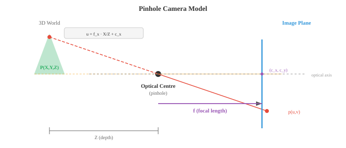

# 图像基础

> **一句话总结**: 数字图像本质是二维像素网格, 从颜色空间、成像模型到滤波、边缘检测与特征描述子, 构成模型看到图像之前的经典视觉工具箱.

## 🗺️ 本章导览

- 本章覆盖计算机视觉: 图像基础 → 卷积网络 → 目标检测 → 视觉 Transformer → 视频与 3D
- **01. 图像基础** (本节): 像素、颜色空间、经典图像处理
- **02. 卷积网络**: CNN 结构、经典模型 (LeNet/AlexNet/ResNet)
- **03. 目标检测与分割**: R-CNN 家族、YOLO、Mask R-CNN、语义/实例分割
- **04. 视觉 Transformer 与生成**: ViT、扩散模型、Flow Matching
- **05. 视频与 3D 视觉**: 光流、SLAM、NeRF、3D 表征

*图像基础讲的是数字图像如何被表示、如何形成, 以及在任何模型看到它之前会经过怎样的预处理. 本节涵盖像素、颜色空间 (RGB、HSV、YCbCr、LAB)、针孔相机模型、卷积、边缘检测 (Sobel、Canny)、直方图, 以及特征描述子 (SIFT、ORB) —— 一整套底层视觉工具.*

- **数字图像** (digital image) 就是一张由数字组成的二维网格. 网格中每一格叫**像素** (pixel, picture element), 它的值代表亮度或颜色. 灰度图是一个单独的二维矩阵, 每个像素存一个亮度值, 8 位图像里通常从 0 (黑) 到 255 (白).

- 彩色图像把这个想法扩展到三通道. 在 **RGB** (Red-Green-Blue) 颜色空间里, 每个像素存三个值: 红、绿、蓝各自的强度.

- 于是彩色图像就是一个形状为 (height, width, 3) 的三维张量. 把这三个通道按不同强度混合, 就能得到人眼可见的整个色谱.


- **位深** (bit depth) 决定每个通道能表达多少个不同的强度等级.

- 8 位图像每通道有 $2^8 = 256$ 级, 三通道组合出 $256^3 \approx 16.7$ 百万种可能颜色. 16 位图像每通道 65,536 级, 用于医学影像和 HDR 摄影这类对细微亮度差异要求高的场景.

- RGB 显示起来方便, 但换别的任务, 其他颜色空间往往更合适.

- **HSV** (Hue-Saturation-Value, 色相-饱和度-明度) 把颜色信息和亮度分开. 色相是纯颜色 (在色轮上 0-360 度), 饱和度衡量颜色有多鲜艳 (0 = 灰色, 1 = 纯色), 明度就是亮度. HSV 适合做基于颜色的分割, 因为你可以只对色相做阈值判断, 不受光照条件影响. 想检测"红色物体", 在 HSV 里比在 RGB 里简单得多.

- **YCbCr** 把亮度 (Y, 人眼感知到的明暗) 和色度 (Cb, Cr, 颜色差分信号) 分开. 这是 JPEG 压缩和视频编码器使用的颜色空间. 人眼对亮度比对颜色更敏感, 所以色度可以用更低的分辨率存储 (色度子采样), 视觉上几乎看不出损失.

- **LAB** (CIELAB) 的设计目标是: 两种颜色间的数值距离要对应人眼感知到的差异. 在 LAB 空间里等步长看起来就是等步长. L 通道是明度, A 从绿到红, B 从蓝到黄. 需要做感知上均匀的颜色比较时就用 LAB.

- **图像形成** (image formation) 描述三维场景如何变成一张二维图像. 最简单的模型是**针孔相机** (pinhole camera): 场景的光线穿过一个小孔, 投射到孔后面的传感器平面上. 世界坐标中的一个点 $(X, Y, Z)$ 投影到像素坐标 $(u, v)$:

```math
\begin{bmatrix} u \\ v \\ 1 \end{bmatrix} = \frac{1}{Z} \begin{bmatrix} f_x & 0 & c_x \\ 0 & f_y & c_y \\ 0 & 0 & 1 \end{bmatrix} \begin{bmatrix} X \\ Y \\ Z \end{bmatrix}
```

- 这个 3x3 矩阵叫**内参矩阵** (intrinsic matrix) $K$. 它编码了相机的内部属性: 焦距 $f_x, f_y$ (镜头把光线会聚的强度) 和主点 $(c_x, c_y)$ (光轴与传感器的交点, 一般在图像中心附近). 对同一台相机加同一支镜头, 这些参数是固定的.



- **外参** (extrinsic parameters) 描述相机在世界里的位置: 一个旋转矩阵 $R$ (3x3, 见第 02 章) 和一个平移向量 $t$ (3x1). 二者一起把世界坐标变换到相机坐标. 完整的投影是:

$$\mathbf{p} = K [R \mid t] \mathbf{P}$$

- 其中 $\mathbf{P} = [X, Y, Z, 1]^T$ 是三维点的齐次坐标, $\mathbf{p} = [u, v, 1]^T$ 是投影后的像素. $[R \mid t]$ 是把旋转与平移横向拼起来的 3x4 矩阵. 这全都是第 02 章的线性代数.

- 真实镜头会带来**畸变** (distortion).

    - **径向畸变** (radial distortion) 把直线变成曲线 (桶形畸变让图像向外鼓, 枕形畸变把图像向内挤).
    **切向畸变** (tangential distortion) 出现在镜头与传感器不完全平行的时候.

- 相机标定 (camera calibration) 从一组已知图案 (比如棋盘格) 的图像中估计出内参和畸变系数, 然后对图像做去畸变校正.

- **空间滤波** (spatial filtering) 是经典图像处理的地基. **滤波器** (filter, 又叫核 kernel) 是一个小矩阵 (通常 3x3 或 5x5), 它在图像上滑动. 每滑到一个位置, 就把滤波器里的数值与覆盖到的图像块逐元素相乘再求和, 得到一个输出像素. 这就是**二维卷积** (2D convolution), 也正是驱动 CNN (卷积神经网络, Convolutional Neural Network, CNN, 见第 02 节) 的同一种操作 —— 只不过这里的滤波器权重是手工设计的, 而不是学出来的.

$$(\text{image} * K)[i,j] = \sum_{m} \sum_{n} \text{image}[i+m, j+n] \cdot K[m, n]$$

- 这就是第 06 章一维卷积的二维推广. 用什么样的滤波器, 就决定这个操作能检测出什么: 不同的滤波器检测不同的特征.

- **模糊** (blurring) 通过平均邻近像素来平滑图像. **盒式滤波器** (box filter) 给所有邻居等权重.

- **高斯滤波器** (Gaussian filter) 按二维高斯 (第 05 章) 给邻居加权, 离得近的权重大, 离得远的权重小. 高斯模糊是最常用的平滑操作, 用 $\sigma$ 作为参数: $\sigma$ 越大, 平滑程度越强.

- **中值滤波** (median filtering) 把每个像素替换成邻域的中位数, 而不是加权平均. 它特别擅长去除椒盐噪声 (salt-and-pepper noise, 随机出现的黑白点), 同时能保住边缘, 因为中位数对离群值稳健 (见第 04 章).

- **边缘检测** (edge detection) 找出像素强度剧烈变化的地方. 边缘承载了图像里大部分的结构信息; 光看边缘, 你就能认出物体.

- **Sobel 算子** (Sobel operator) 用两个 3x3 滤波器分别估计水平和垂直方向的梯度:

```math
G_x = \begin{bmatrix} -1 & 0 & 1 \\ -2 & 0 & 2 \\ -1 & 0 & 1 \end{bmatrix}, \quad G_y = \begin{bmatrix} -1 & -2 & -1 \\ 0 & 0 & 0 \\ 1 & 2 & 1 \end{bmatrix}
```

- 图像与 $G_x$ 卷积得到水平梯度 (对竖直边缘响应强), 与 $G_y$ 卷积得到垂直梯度 (对水平边缘响应强).

- 梯度幅值 $\sqrt{G_x^2 + G_y^2}$ 和方向 $\arctan(G_y / G_x)$ 一起, 描述了每个像素处边缘的强度和朝向. 这就是第 03 章梯度概念在图像域的类比.


- **Canny 边缘检测器** (Canny edge detector) 是边缘检测的黄金标准. 它有四步:
    1. 用高斯滤波平滑图像, 降低噪声
    2. 用 Sobel 计算梯度幅值与方向
    3. **非极大值抑制** (Non-Maximum Suppression, NMS): 沿梯度方向只保留局部极大的像素, 把边缘变细
    4. **滞后阈值** (hysteresis thresholding): 用两个阈值 (高、低). 高于高阈值的像素一定是边缘. 处在两阈值之间的像素, 只有与已确认边缘相连才算边缘. 低于低阈值的像素直接丢掉.

- Canny 用两个阈值, 比单阈值稳健得多: 强边缘一定保留, 弱边缘只在它属于一段连续边缘时才保留.

- **频域** (frequency domain) 分析能揭示在空间域里难以察觉的模式. **二维傅里叶变换** (2D Fourier transform, 第 03 章一维版本的推广) 把一张图像分解成一堆不同频率、不同方向的二维正弦波之和:

$$F(u, v) = \sum_{x=0}^{M-1} \sum_{y=0}^{N-1} f(x, y) \cdot e^{-j2\pi(ux/M + vy/N)}$$

- 低频对应缓慢变化的平滑区域 (天空、墙面). 高频对应急剧变化的部分 (边缘、纹理、噪声). **幅值谱** (magnitude spectrum) 表示每个频率上有多少能量, **相位谱** (phase spectrum) 编码了空间上的排布方式.

- **低通滤波** (low-pass filtering) 去掉高频, 使图像平滑 (等价于空间域的高斯模糊). **高通滤波** (high-pass filtering) 去掉低频, 突出边缘和细节. **带通滤波** (band-pass filtering) 只保留某个频率范围, 常用于纹理分析.

- 实践中, 对大滤波器而言, 在频域做滤波可能比在空间域做卷积更快, 因为空间域的卷积等价于频域的逐元素相乘 (**卷积定理**, convolution theorem). 这直接接上了第 03 章傅里叶变换的性质.

- **直方图** (histogram) 汇总像素强度的分布. 它统计有多少像素落在每一个强度值上 (对 8 位图像就是 0-255). 这就是第 04 章的频数分布, 只不过对象换成了像素值.


- 暗图的直方图集中在左边 (低值). 亮图集中在右边. 低对比度图像的直方图很窄. 高对比度图像的直方图宽而铺开.

- **直方图均衡化** (histogram equalisation) 把直方图拉开, 让它覆盖整个强度范围, 从而提升对比度. 核心想法是找一个映射, 使得像素强度的累积分布函数 (Cumulative Distribution Function, CDF) 近似线性. 这正是第 04 章 CDF 概念的直接应用.

- **Otsu 法** (Otsu's method) 能自动找出把图像分成前景与背景的最佳阈值. 它尝试所有可能的阈值, 挑出使类内方差最小 (等价于类间方差最大) 的那个. 这就是第 04 章的方差概念, 套到像素强度分布上.

- **特征提取** (feature extraction) 识别图像中有辨识度的点或区域, 用于匹配、识别和三维重建. 好的特征应当可重复 (换个视角还能找到)、有区分度 (与其他特征可区分), 而且计算高效.

- **角点检测** (corner detection) 找的是那些像素强度在多个方向上都变化明显的点. 平滑区域在任何方向变化都很小. 边缘只在一个方向变化. 角点则至少在两个方向都变化, 因而局部独一无二, 是可靠的地标.

- **Harris 角点检测器** (Harris corner detector) 分析每个像素处的**结构张量** (structure tensor, 又叫二阶矩矩阵):

```math
M = \sum_{(x,y) \in W} w(x,y) \begin{bmatrix} I_x^2 & I_x I_y \\ I_x I_y & I_y^2 \end{bmatrix}
```

- 其中 $I_x$ 和 $I_y$ 是图像梯度 (用 Sobel 算), $W$ 是一个局部窗口, $w$ 是高斯加权函数. $M$ 的特征值 (第 02 章) 会告诉你这是什么类型的特征:
    - 两个特征值都小: 平坦区域 (没有特征)
    - 一大一小: 边缘
    - 两个都大: 角点

- Harris 不用显式算特征值, 而是用一个角点响应函数: $R = \det(M) - k \cdot (\text{trace}(M))^2$, 其中 $\det(M) = \lambda_1 \lambda_2$, $\text{trace}(M) = \lambda_1 + \lambda_2$ (都是第 02 章的内容). $R$ 是较大的正数就表示角点. 常数 $k$ 通常取 0.04-0.06.

- **Shi-Tomasi** 检测器把它简化成 $R = \min(\lambda_1, \lambda_2)$, 直接检查较小的特征值够不够大. 实践中稍微更稳一些.

- **斑点检测** (blob detection) 找的是与周围明显不同的一整块区域. 和角点 (点特征) 不同, 斑点有一个特征尺度.

- **SIFT** (尺度不变特征变换, Scale-Invariant Feature Transform, SIFT, Lowe, 2004) 在多个尺度上检测斑点, 并构造一个对旋转、尺度不变, 且对光照变化部分不变的描述子. 步骤是:
    1. 用不断增大的 $\sigma$ 做高斯模糊, 构建**尺度空间** (见下文)
    2. 在跨尺度的高斯差分 (Difference of Gaussians, DoG) 中找极值点
    3. 精修关键点位置, 剔除低对比度和边缘响应点
    4. 基于局部梯度方向, 为每个关键点分配一个主方向
    5. 在关键点周围 16x16 的图块内, 用梯度直方图构建一个 128 维的描述子

- **SURF** (加速稳健特征, Speeded-Up Robust Features, SURF) 用盒式滤波器和积分图对 SIFT 做近似, 让计算更快. **ORB** (定向 FAST 与旋转 BRIEF, Oriented FAST and Rotated BRIEF, ORB) 是一个快速的开源替代方案, 把 FAST 角点检测器与 BRIEF 二值描述子结合起来, 再加上旋转不变性.

- **HOG** (方向梯度直方图, Histogram of Oriented Gradients, HOG) 描述子把图像划分成小单元 (cell), 在每个 cell 内统计梯度方向的直方图, 再在若干 cell 组成的 block 上做归一化. HOG 捕捉的是边缘方向的分布, 对物体形状信息量极高. 深度学习之前, HOG + SVM (支持向量机, 第 06 章) 是行人检测和物体识别的主流方案.

- **图像金字塔** (image pyramids) 用多个分辨率来表示同一张图像.
    - **高斯金字塔** (Gaussian pyramid) 通过反复模糊并下采样 (分辨率减半) 构建, 每一层是原图的一个更粗糙版本.
    - **拉普拉斯金字塔** (Laplacian pyramid) 存的是相邻两层高斯金字塔之间的差, 捕获每次下采样丢失的细节. 拉普拉斯金字塔是可逆的: 从它可以重建出原始图像.


- **尺度空间** (scale space) 把"物体存在于不同尺度"这件事形式化. 一棵树是一个大斑点; 树上的一片叶子是一个小斑点. 想把两者都检测出来, 就得跨尺度搜索. 图像的尺度空间, 就是用不断增大的 $\sigma$ 与图像做高斯卷积得到的一族图像:

$$L(x, y, \sigma) = G(x, y, \sigma) * I(x, y)$$

- 其中 $G$ 是标准差为 $\sigma$ 的二维高斯. 在多个尺度上都持续存在的特征, 更可能是有意义的结构, 而不是噪声. 尺度空间是 SIFT 的理论基础, 也是现代计算机视觉中多尺度处理 (包括第 03 节目标检测里的特征金字塔网络) 的根基.

## 编程练习 (用 CoLab 或 notebook)

1. 加载一张图像, 转换到不同颜色空间 (RGB、HSV、LAB), 并可视化各个通道. 观察颜色信息在不同空间里如何分布.
```python
import jax.numpy as jnp
import matplotlib.pyplot as plt
from PIL import Image
import numpy as np

# 构造一张有明显颜色分块的合成测试图
H, W = 128, 256
img = np.zeros((H, W, 3), dtype=np.uint8)
img[:, :64] = [255, 50, 50]     # 红
img[:, 64:128] = [50, 255, 50]  # 绿
img[:, 128:192] = [50, 50, 255] # 蓝
img[:, 192:] = [255, 255, 50]   # 黄

# 加一条亮度梯度
for y in range(H):
    scale = 0.3 + 0.7 * y / H
    img[y] = (img[y] * scale).astype(np.uint8)

img_jnp = jnp.array(img, dtype=jnp.float32) / 255.0

# 手写 RGB 到 HSV 的转换
def rgb_to_hsv(rgb):
    r, g, b = rgb[..., 0], rgb[..., 1], rgb[..., 2]
    maxc = jnp.max(rgb, axis=-1)
    minc = jnp.min(rgb, axis=-1)
    diff = maxc - minc + 1e-7

    # 色相
    h = jnp.where(maxc == minc, 0.0,
        jnp.where(maxc == r, 60 * ((g - b) / diff % 6),
        jnp.where(maxc == g, 60 * ((b - r) / diff + 2),
                              60 * ((r - g) / diff + 4))))
    s = jnp.where(maxc < 1e-7, 0.0, diff / maxc)
    v = maxc
    return jnp.stack([h / 360, s, v], axis=-1)

hsv = rgb_to_hsv(img_jnp)

fig, axes = plt.subplots(2, 3, figsize=(14, 8))
for i, (ch, name) in enumerate(zip([img_jnp[...,0], img_jnp[...,1], img_jnp[...,2]],
                                     ['Red', 'Green', 'Blue'])):
    axes[0, i].imshow(ch, cmap='gray', vmin=0, vmax=1)
    axes[0, i].set_title(f'RGB: {name}'); axes[0, i].axis('off')

for i, (ch, name) in enumerate(zip([hsv[...,0], hsv[...,1], hsv[...,2]],
                                     ['Hue', 'Saturation', 'Value'])):
    axes[1, i].imshow(ch, cmap='gray', vmin=0, vmax=1)
    axes[1, i].set_title(f'HSV: {name}'); axes[1, i].axis('off')

plt.suptitle('RGB vs HSV Channels')
plt.tight_layout(); plt.show()
```

2. 用二维卷积从零实现 Sobel 边缘检测和高斯模糊. 把它们作用在一张图像上, 对比结果.
```python
import jax
import jax.numpy as jnp
import matplotlib.pyplot as plt

def conv2d(image, kernel):
    """从零实现的二维卷积 (valid 模式)."""
    H, W = image.shape
    kH, kW = kernel.shape
    out_h, out_w = H - kH + 1, W - kW + 1
    output = jnp.zeros((out_h, out_w))
    for i in range(out_h):
        for j in range(out_w):
            patch = image[i:i+kH, j:j+kW]
            output = output.at[i, j].set(jnp.sum(patch * kernel))
    return output

# 测试图: 深色背景上的白色矩形
img = jnp.zeros((64, 64))
img = img.at[15:50, 20:45].set(1.0)
# 加一点噪声
key = jax.random.PRNGKey(42)
img = img + jax.random.normal(key, img.shape) * 0.05

# Sobel 滤波器
sobel_x = jnp.array([[-1, 0, 1], [-2, 0, 2], [-1, 0, 1]], dtype=jnp.float32)
sobel_y = jnp.array([[-1, -2, -1], [0, 0, 0], [1, 2, 1]], dtype=jnp.float32)

# 高斯模糊核 (5x5, sigma=1)
ax = jnp.arange(-2, 3, dtype=jnp.float32)
xx, yy = jnp.meshgrid(ax, ax)
gaussian = jnp.exp(-(xx**2 + yy**2) / (2 * 1.0**2))
gaussian = gaussian / gaussian.sum()

# 应用滤波器
gx = conv2d(img, sobel_x)
gy = conv2d(img, sobel_y)
edges = jnp.sqrt(gx**2 + gy**2)
blurred = conv2d(img, gaussian)

fig, axes = plt.subplots(1, 4, figsize=(16, 4))
for ax, data, title in zip(axes,
    [img, edges, blurred, gx],
    ['Original', 'Edge Magnitude', 'Gaussian Blur', 'Horizontal Gradient']):
    ax.imshow(data, cmap='gray')
    ax.set_title(title); ax.axis('off')
plt.tight_layout(); plt.show()
```

3. 从零实现直方图均衡化, 作用在一张低对比度灰度图上. 对比处理前后的直方图.
```python
import jax.numpy as jnp
import matplotlib.pyplot as plt

# 构造一张低对比度图 (像素值集中在一个窄区间)
key = __import__('jax').random.PRNGKey(42)
img = __import__('jax').random.uniform(key, (128, 128)) * 0.3 + 0.3  # 值域 [0.3, 0.6]

def histogram_equalise(img, n_bins=256):
    """灰度图的直方图均衡化."""
    # 分箱量化
    bins = jnp.linspace(0, 1, n_bins + 1)
    hist = jnp.histogram(img, bins=bins)[0]

    # 计算 CDF
    cdf = jnp.cumsum(hist)
    cdf_normalised = (cdf - cdf.min()) / (cdf.max() - cdf.min())

    # 让每个像素经过 CDF 映射
    indices = jnp.clip((img * n_bins).astype(jnp.int32), 0, n_bins - 1)
    equalised = cdf_normalised[indices]
    return equalised

eq_img = histogram_equalise(img)

fig, axes = plt.subplots(2, 2, figsize=(12, 10))
axes[0, 0].imshow(img, cmap='gray', vmin=0, vmax=1)
axes[0, 0].set_title('Original (Low Contrast)'); axes[0, 0].axis('off')
axes[0, 1].imshow(eq_img, cmap='gray', vmin=0, vmax=1)
axes[0, 1].set_title('After Histogram Equalisation'); axes[0, 1].axis('off')

axes[1, 0].hist(img.ravel(), bins=64, color='#3498db', alpha=0.8)
axes[1, 0].set_title('Histogram Before'); axes[1, 0].set_xlim(0, 1)
axes[1, 1].hist(eq_img.ravel(), bins=64, color='#e74c3c', alpha=0.8)
axes[1, 1].set_title('Histogram After'); axes[1, 1].set_xlim(0, 1)

plt.tight_layout(); plt.show()
```

4. 从零实现 Harris 角点检测器. 在一张简单图像上检测角点并可视化.
```python
import jax
import jax.numpy as jnp
import matplotlib.pyplot as plt

def harris_corners(img, k=0.05, threshold=0.01):
    """从零实现的 Harris 角点检测."""
    # 用 Sobel 计算梯度
    sobel_x = jnp.array([[-1, 0, 1], [-2, 0, 2], [-1, 0, 1]], dtype=jnp.float32)
    sobel_y = jnp.array([[-1, -2, -1], [0, 0, 0], [1, 2, 1]], dtype=jnp.float32)

    # 对图像做 padding, 让 valid 卷积保持尺寸
    img_pad = jnp.pad(img, 1, mode='edge')
    H, W = img.shape

    Ix = jnp.zeros_like(img)
    Iy = jnp.zeros_like(img)
    for i in range(H):
        for j in range(W):
            patch = img_pad[i:i+3, j:j+3]
            Ix = Ix.at[i, j].set(jnp.sum(patch * sobel_x))
            Iy = Iy.at[i, j].set(jnp.sum(patch * sobel_y))

    # 结构张量的分量
    Ixx = Ix * Ix
    Iyy = Iy * Iy
    Ixy = Ix * Iy

    # 对结构张量做高斯平滑 (这里用窗口求和近似)
    w = 3  # 窗口半径
    R = jnp.zeros_like(img)
    pad_xx = jnp.pad(Ixx, w, mode='constant')
    pad_yy = jnp.pad(Iyy, w, mode='constant')
    pad_xy = jnp.pad(Ixy, w, mode='constant')

    for i in range(H):
        for j in range(W):
            sxx = jnp.sum(pad_xx[i:i+2*w+1, j:j+2*w+1])
            syy = jnp.sum(pad_yy[i:i+2*w+1, j:j+2*w+1])
            sxy = jnp.sum(pad_xy[i:i+2*w+1, j:j+2*w+1])
            det = sxx * syy - sxy * sxy
            trace = sxx + syy
            R = R.at[i, j].set(det - k * trace * trace)

    # 阈值化
    corners = R > threshold * R.max()
    return R, corners

# 测试图: 棋盘格 (角点很多)
block = 16
n = 4
checker = jnp.zeros((block * n, block * n))
for i in range(n):
    for j in range(n):
        if (i + j) % 2 == 0:
            checker = checker.at[i*block:(i+1)*block, j*block:(j+1)*block].set(1.0)

R, corners = harris_corners(checker)
cy, cx = jnp.where(corners)

fig, axes = plt.subplots(1, 3, figsize=(14, 4))
axes[0].imshow(checker, cmap='gray')
axes[0].set_title('Checkerboard'); axes[0].axis('off')
axes[1].imshow(R, cmap='hot')
axes[1].set_title('Harris Response'); axes[1].axis('off')
axes[2].imshow(checker, cmap='gray')
axes[2].scatter(cx, cy, c='#e74c3c', s=15, marker='x')
axes[2].set_title(f'Detected Corners ({len(cx)})'); axes[2].axis('off')
plt.tight_layout(); plt.show()
```

---

## 📌 本节要点

- **数字图像**: 二维像素网格; 灰度图是矩阵, 彩色图是 (H, W, 3) 张量.
- **颜色空间**: RGB 便于显示; HSV 便于按色相分割; YCbCr 用于 JPEG 与视频; LAB 提供感知均匀的距离.
- **针孔相机模型**: 三维点经内参 $K$ 与外参 $[R \mid t]$ 投影为像素, 全部是线性代数.
- **卷积与经典滤波**: 高斯模糊平滑图像, 中值滤波稳健去噪, 手工核对应固定特征提取.
- **边缘检测**: Sobel 给出梯度, Canny 用高斯平滑 + NMS + 滞后阈值形成黄金标准.
- **频域分析**: 二维傅里叶变换分离低频与高频, 卷积定理支撑大核的频域加速.
- **直方图工具**: 直方图均衡化拉伸对比度, Otsu 法基于类间方差自动选阈值.
- **角点与斑点**: Harris 通过结构张量特征值判别角点; SIFT 在尺度空间中定位斑点并输出 128 维描述子.
- **描述子家族**: SURF 加速 SIFT, ORB 是快速开源方案, HOG + SVM 曾是行人检测主流.
- **多尺度表示**: 高斯 / 拉普拉斯金字塔与尺度空间, 是 SIFT 与现代特征金字塔网络的共同根基.
