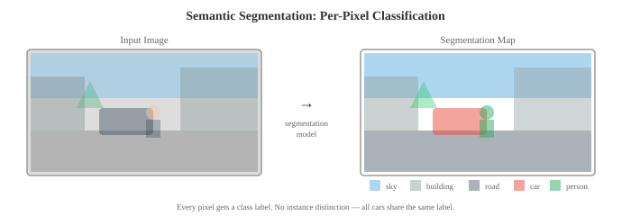
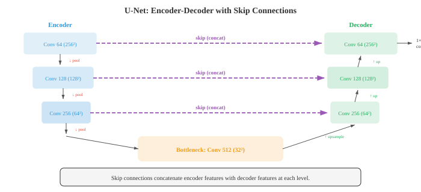

# 目标检测与分割

> **一句话总结**：目标检测框出图中每个物体，分割给每个像素贴标签；本节讲清 IoU、mAP、锚框，R-CNN 家族、YOLO、SSD、FPN，以及语义 / 实例 / 全景分割 (U-Net、Mask R-CNN、SAM) 的核心思想与评测指标。

*目标检测 (object detection) 定位并分类图像中的每一个物体；分割 (segmentation) 则给每个像素都分配一个标签。本文覆盖交并比 (Intersection over Union, IoU)、平均精度均值 (mean Average Precision, mAP)、锚框 (anchor box)、R-CNN 家族、YOLO、SSD、特征金字塔网络 (Feature Pyramid Network, FPN)，语义 / 实例 / 全景分割 (U-Net、Mask R-CNN、SAM)，以及衡量这些方法的评测指标。*

- 图像分类 (第 02 节) 回答 "这张图里有什么？" 目标检测问的是更难的问题："这张图里有哪些物体，它们在哪里？"

- 分割走得更远："哪些像素属于哪个物体或哪个类别？" 这三类任务构成了一个空间理解从粗到细的层级。

- 一个**目标检测**模型输出一组**边界框 (bounding box)**，每个框由四个坐标 (左上角 $x, y$，宽，高) 加上一个类别标签与一个置信度分数定义。一张图可能包含零个、一个、甚至几百个属于多个类别的物体。


- **交并比 (Intersection over Union, IoU)** 衡量预测框与真值框对齐的好坏。就是重叠面积除以并集面积:

$$\text{IoU} = \frac{\text{Area of Intersection}}{\text{Area of Union}}$$

- IoU 为 1 表示完美重叠；IoU 为 0 表示完全不重叠。判定 "检测正确" 的标准阈值是 IoU $\geq 0.5$，更严格的阈值 (0.75、0.9) 也常用。

- 如果一个检测框与某个真值框的 IoU 超过阈值且类别正确，就是**真阳性 (true positive, TP)**。

- **假阳性 (false positive, FP)** 是没有匹配上任何真值的预测框。

- **假阴性 (false negative, FN)** 是没有被任何预测框匹配到的真值物体。这些和第 06 章讲的精确率 / 召回率是同一套概念。

- **平均精度 (Average Precision, AP)** 用一个数概括某一类的检测质量。做法是：对每个类别，把所有检测按置信度从高到低排序，在每个排位上计算精确率与召回率，再算精确率-召回率曲线下面积:

$$\text{AP} = \int_0^1 p(r) \, dr$$

- 实际做法里，曲线要先插值：在每个召回率水平，精确率取所有召回率 $\geq r$ 处的最大精确率。这样把曲线抹平，保证单调不增。

- **平均精度均值 (mean Average Precision, mAP)** 就是把 AP 在所有类别上取平均。"mAP@0.5" 用 IoU 阈值 0.5; "mAP@[.5:.95]" (COCO 标准) 把 IoU 阈值从 0.5 到 0.95 以 0.05 为步长取十档再求平均，既奖励能检出物体，也奖励定位精确。

- **非极大值抑制 (Non-Maximum Suppression, NMS)** 用来去掉重复检测。当模型对同一个物体预测出好几个重叠框时，NMS 保留置信度最高的那一个，把与它重叠 (IoU 超过阈值) 的其他框全部丢掉。这一步在模型给出原始预测之后按类别独立执行。

- **两阶段检测器**先给出候选区域，再对每个候选做分类与位置微调。

- **R-CNN** (Girshick 等，2014) 是第一个成功的深度学习检测器。它用选择性搜索 (一个传统算法) 提出约 2000 个候选区域，把每个区域拉伸到固定大小，各自独立送进卷积神经网络 (Convolutional Neural Network, CNN)，再用支持向量机 (Support Vector Machine, SVM，见第 06 章) 做分类。R-CNN 精度高但极慢：每张图要跑 2000 次 CNN。

- **Fast R-CNN** (Girshick, 2015) 通过在整张图上只跑一次 CNN 得到一张共享的特征图，再从这张共享图上用 **RoI 池化 (Region of Interest pooling)** 抽取每个候选的特征，解决了这种冗余。

- RoI 池化把特征图上一块尺寸不定的区域切成固定大小的网格，每格做最大池化，从而输出固定尺寸。这样快得多，因为昂贵的 CNN 计算只做一次。

- **Faster R-CNN** (Ren 等，2015) 更进一步，用 **区域提议网络 (Region Proposal Network, RPN)** 代替了外部的候选生成算法。RPN 是一个小型 CNN，在共享特征图之上直接预测候选。它用一个小窗口在特征图上滑动，在每个位置预测 $k$ 个候选 (一个对应一个**锚框**)。


- **锚框 (anchor box)** 是特征图每个空间位置上预定义好的一批边界框，覆盖不同的尺度与长宽比 (例如三种尺度 $\times$ 三种比例 = 每个位置 9 个锚框)。RPN 对每个锚框预测两样东西：一个物体性分数 (物体 vs 背景) 和一组坐标偏移量，用来把锚框调得更贴合物体。这种参数化让回归变简单：网络不用预测绝对坐标，而是预测在一个合理起点框上的小幅调整量。

- 锚框的偏移量参数化如下:

$$t_x = \frac{x - x_a}{w_a}, \quad t_y = \frac{y - y_a}{h_a}, \quad t_w = \log\frac{w}{w_a}, \quad t_h = \log\frac{h}{h_a}$$

- 其中 $(x, y, w, h)$ 是预测框的中心与尺寸，$(x_a, y_a, w_a, h_a)$ 是锚框。宽高上的对数变换保证预测框始终是正的，也让回归对尺度不敏感。

- Faster R-CNN 用一个多任务损失训练：类别标签用分类损失 (第 05 章的交叉熵)，边界框回归用**平滑 L1 损失 (smooth L1 loss)**。平滑 L1 比 L2 对离群点更鲁棒:

```math
\text{smooth}_{L1}(x) = \begin{cases} 0.5x^2 & \text{if } |x| < 1 \\ |x| - 0.5 & \text{otherwise} \end{cases}
```

- **特征金字塔网络 (Feature Pyramid Network, FPN)** (Lin 等，2017) 处理的是多尺度问题：它在骨干网络上加一条自顶向下的通路，通过横向连接把高层语义与低层空间细节融合起来。骨干网络会在多个尺度上产生特征图 (每次池化把分辨率减半)。FPN 加了一条自顶向下的路径，每一层都接收来自上一层上采样后的特征，再通过一个横向的 1x1 卷积与对应的自底向上层合并。结果就是一座特征图金字塔，每一层都同时具有强语义与良好的空间分辨率。

- 小物体从金字塔高分辨率的那一层检测；大物体从低分辨率的那一层检测。今天大多数现代检测架构里，FPN 都是标配组件。

- **单阶段检测器**完全跳过候选步骤，一次前向传播就同时预测类别标签与边界框。这样快，但历史上精度不如两阶段检测器，直到焦点损失 (focal loss) 把这道差距补上。

- **YOLO** (You Only Look Once, Redmon 等，2016) 把图像划分成一个 $S \times S$ 网格。每个网格单元预测 $B$ 个边界框和 $C$ 个类别概率。如果某个物体的中心落在某个单元里，就由这个单元负责检测它。YOLO 极快，因为整个检测就是一次前向传播，没有候选阶段。

- **YOLOv2** 加入了锚框、批归一化 (Batch Normalization, BN)、多尺度训练。**YOLOv3** 用了特征金字塔网络，在三个尺度上预测。**YOLOv4-v8** 一路继续改进，用了更好的骨干、路径聚合网络，以及马赛克数据增强 (训练时把四张图拼在一起，增加上下文多样性)。

- **SSD** (Single Shot MultiBox Detector, Liu 等，2016) 在骨干网络内部的多个特征图尺度上预测，每个尺度都有对应的锚框。早期 (高分辨率) 的特征图负责检测小物体；后期 (低分辨率) 的特征图负责检测大物体。SSD 比 Faster R-CNN 快，精度也接近。

- **RetinaNet** (Lin 等，2017) 指出单阶段检测器的核心问题是：类别不平衡。绝大部分锚框对应背景，会产生大量简单负样本，把损失和梯度都占满，淹没了那些稀有的正样本。

- **焦点损失 (focal loss)** 通过给简单样本降权来解决这个问题:

$$\text{FL}(p_t) = -\alpha_t (1 - p_t)^\gamma \log(p_t)$$

- 其中 $p_t$ 是正确类别的预测概率。当模型既自信又正确时 ($p_t$ 高), $(1 - p_t)^\gamma$ 很小，简单负样本对损失的贡献被压低。超参数 $\gamma$ (通常取 2) 控制降权强度。取 $\gamma = 0$ 时，焦点损失就退化为标准交叉熵。有了焦点损失，RetinaNet 用单阶段的速度达到了可与两阶段检测器相当的精度。

- **无锚框检测 (anchor-free detection)** 完全去掉锚框，减少了超参数调节，也让流水线更简单。

- **FCOS** (Fully Convolutional One-Stage, Tian 等，2019) 在特征图的每个空间位置上预测四个数：该位置到最近边界框四条边 (左、上、右、下) 的距离，外加一个类别标签。一个**中心度 (centerness)** 分数会给远离物体中心的预测降权，改善质量。FCOS 用 FPN 处理多尺度。

- **CenterNet** (Zhou 等，2019) 把物体当成点来检测：它预测一张热力图，图上的峰值对应物体中心，然后在每个峰值处回归宽和高。这样，检测就变成了关键点估计。这个思路优雅、无锚框，但对热力图的后处理要求高。

- **CornerNet** 把物体检测成一对角点 (左上和右下)。它预测两张热力图 (每种角点一张)，用**关联嵌入 (associative embedding)** 把对应的角点两两配对成边界框。这样不用锚框，也能处理任意形状的物体。

- **语义分割 (semantic segmentation)** 给图中每个像素分配一个类别标签。和检测 (输出的是框) 不同，分割输出的是一张稠密的、像素级的标签图。一张街景可以把每个像素分别标为道路、人行道、汽车、行人、建筑、天空等等。



- **全卷积网络 (Fully Convolutional Networks, FCN)** (Long 等，2015) 把分类 CNN 改造去做分割：把全连接层换成卷积层，让网络输出一张空间图而不是单一类别。上采样 (通过转置卷积或双线性插值) 把输出恢复到输入分辨率。来自早期层的跳跃连接 (skip connection) 又把下采样过程中丢掉的空间细节补回来。

- **转置卷积 (transposed convolution)** (有时也叫 "反卷积") 是卷积在上采样方向的对偶。步长卷积会缩小空间维度，转置卷积则把它撑大。它先在输入元素间插入零，再做一次标准卷积，实际上就是在学怎么上采样。

- **U-Net** (Ronneberger 等，2015) 提出了一种对称的编码器-解码器架构，每一层都带跳跃连接。编码器 (收缩路径) 一边降低空间分辨率，一边增加通道数，就像分类 CNN 那样。解码器 (扩张路径) 又把分辨率上采样回到原尺寸。跳跃连接在每一层把编码器的特征图与解码器的特征图拼接起来，把细致的空间细节送到解码器。这种 "高层语义 + 低层细节" 的组合产出锐利、准确的分割边界。



- U-Net 最初是为生物医学图像分割设计的 (那里训练数据稀缺)，它的架构后来成了很多后续模型的基础，也包括潜空间扩散模型里的 U-Net (第 04 节)。

- **DeepLab** (Chen 等，2014-2018) 为分割引入了两大关键创新:

    - **空洞 (膨胀) 卷积 (atrous / dilated convolution)**：在卷积核元素之间插入间隙的标准卷积，由膨胀率 $r$ 控制。膨胀率为 $r$ 的 3x3 卷积核感受野是 $(2r + 1) \times (2r + 1)$，但只用了 9 个参数。这样可以在不下采样、不损失空间分辨率的前提下，在多个尺度上捕获上下文。

    - **空洞空间金字塔池化 (Atrous Spatial Pyramid Pooling, ASPP)**：并行地跑多个不同膨胀率的空洞卷积 (例如膨胀率 1, 6, 12, 18)，把结果拼接，再用一个 1x1 卷积融合。ASPP 同时在多个尺度上捕获上下文，精神上很像 Inception 模块 (第 02 节)，只是用的是膨胀率而不是不同的卷积核大小。

- DeepLab 还用**条件随机场 (Conditional Random Field, CRF)** (第 05 章) 作为后处理步骤，通过鼓励空间上邻近且颜色相近的像素共享同一标签，来细化分割边界。

- **实例分割 (instance segmentation)** 结合了检测与分割：它识别出每一个独立的物体实例，并给每一个实例产出一张像素级的掩码。场景里有两辆车就得到两张独立的掩码，而不是把两辆都标成 "car"。

- **Mask R-CNN** (He 等，2017) 在 Faster R-CNN 之上加了一个小的分割头，为每个被检测到的物体预测一张二值掩码。整体架构就是 Faster R-CNN + 一个掩码分支：掩码分支拿 RoI 池化后的特征作为输入，为每个类别输出一张 $m \times m$ 的二值掩码。它把 RoI 池化换成了 **RoIAlign**：在精确采样点上做双线性插值，而不是走量化后的网格单元，从而避免了量化带来的空间错位。这个小改动大幅提升了掩码质量。

- Mask R-CNN 用多任务损失训练：分类损失 + 框回归损失 + 掩码损失 (逐像素的二值交叉熵)。掩码分支为每个类别独立预测一张掩码；最终只用与预测类别对应的那张，这样就把掩码预测与类别预测解耦了，两者都变得更好。

- **全景分割 (panoptic segmentation)** 把语义分割与实例分割统一成一个任务。每个像素既得到一个类别标签 (语义)，又得到一个实例 ID (对可数的 "thing" 类别，比如车、人)。"stuff" 类别 (天空、道路、草地) 只有语义标签，因为它们是无定形的区域，数不出实例。

- 全景质量 (panoptic quality, PQ) 指标把它拆成两部分：分割质量 (匹配片段的平均 IoU) 和识别质量 (匹配片段的 F1 分数):

$$\text{PQ} = \underbrace{\frac{\sum_{(p,g) \in \text{TP}} \text{IoU}(p,g)}{|\text{TP}|}}_{\text{SQ}} \times \underbrace{\frac{|\text{TP}|}{|\text{TP}| + \frac{1}{2}|\text{FP}| + \frac{1}{2}|\text{FN}|}}_{\text{RQ}}$$

- **实时分割**对自动驾驶、增强现实等应用至关重要，这些场景对延迟预算很紧 (常常每帧不到 30 毫秒)。

- **BiSeNet** (Bilateral Segmentation Network, Yu 等，2018) 用两条并行路径：一条**空间路径 (spatial path)**，宽而浅，用来保留空间细节；一条**上下文路径 (context path)**，深而窄，用来捕获语义。二者的输出融合起来，既快又准。

- **DDRNet** (Deep Dual-Resolution Network, Hong 等，2021) 在整个网络中始终维持两条不同分辨率的分支，两者之间反复交换信息。高分辨率分支保留空间细节，低分辨率分支捕获全局上下文。多个双向融合模块在两个方向上合并信息。

- 实时分割的整体趋势是：避开厚重的编码器-解码器模式，转而在整个网络中保持足够的空间分辨率，用一点点精度换来大幅降低的延迟。

## 编码任务 (使用 CoLab 或 notebook)

1. 从零实现 IoU 计算和非极大值抑制。把 NMS 应用到一组重叠的边界框上，并把结果可视化。
```python
import jax.numpy as jnp
import matplotlib.pyplot as plt
import matplotlib.patches as patches

def compute_iou(box1, box2):
    """计算两个框 [x1, y1, x2, y2] 之间的 IoU。"""
    x1 = jnp.maximum(box1[0], box2[0])
    y1 = jnp.maximum(box1[1], box2[1])
    x2 = jnp.minimum(box1[2], box2[2])
    y2 = jnp.minimum(box1[3], box2[3])

    intersection = jnp.maximum(0, x2 - x1) * jnp.maximum(0, y2 - y1)
    area1 = (box1[2] - box1[0]) * (box1[3] - box1[1])
    area2 = (box2[2] - box2[0]) * (box2[3] - box2[1])
    union = area1 + area2 - intersection

    return intersection / (union + 1e-6)

def nms(boxes, scores, iou_threshold=0.5):
    """非极大值抑制。"""
    order = jnp.argsort(-scores)  # 按置信度降序排序
    keep = []

    remaining = list(range(len(scores)))
    order_list = order.tolist()

    while order_list:
        idx = order_list[0]
        keep.append(idx)
        order_list = order_list[1:]

        new_order = []
        for j in order_list:
            iou = compute_iou(boxes[idx], boxes[j])
            if iou < iou_threshold:
                new_order.append(j)
        order_list = new_order

    return keep

# 示例: 同一物体的重叠检测
boxes = jnp.array([
    [50, 60, 150, 160],   # 高置信度
    [55, 65, 155, 165],   # 重叠的重复框
    [52, 58, 148, 158],   # 重叠的重复框
    [200, 100, 300, 200], # 另一个物体
    [205, 105, 305, 205], # 重叠的重复框
])
scores = jnp.array([0.95, 0.80, 0.70, 0.90, 0.60])

keep = nms(boxes, scores, iou_threshold=0.5)

fig, axes = plt.subplots(1, 2, figsize=(14, 5))
colors = ['#3498db', '#e74c3c', '#27ae60', '#9b59b6', '#f39c12']

for ax, title, indices in zip(axes, ['Before NMS', 'After NMS'],
                               [range(len(boxes)), keep]):
    ax.set_xlim(0, 400); ax.set_ylim(0, 300)
    ax.set_aspect('equal'); ax.invert_yaxis()
    ax.set_title(title)
    for i in indices:
        b = boxes[i]
        rect = patches.Rectangle((b[0], b[1]), b[2]-b[0], b[3]-b[1],
                                  linewidth=2, edgecolor=colors[i],
                                  facecolor='none')
        ax.add_patch(rect)
        ax.text(b[0], b[1]-5, f'{scores[i]:.2f}', color=colors[i], fontsize=10)

plt.tight_layout(); plt.show()
print(f"Kept {len(keep)} of {len(boxes)} boxes after NMS")
```

2. 实现一个简化版的区域提议网络 (RPN)。给定一张特征图，在多个尺度与长宽比上生成锚框，并预测物体性分数和框偏移量。
```python
import jax
import jax.numpy as jnp
import matplotlib.pyplot as plt
import matplotlib.patches as patches

def generate_anchors(feature_h, feature_w, stride, scales, ratios):
    """为特征图上每个位置生成锚框。"""
    anchors = []
    for y in range(feature_h):
        for x in range(feature_w):
            cx = (x + 0.5) * stride
            cy = (y + 0.5) * stride
            for s in scales:
                for r in ratios:
                    w = s * jnp.sqrt(r)
                    h = s / jnp.sqrt(r)
                    anchors.append([cx - w/2, cy - h/2, cx + w/2, cy + h/2])
    return jnp.array(anchors)

def rpn_forward(feature_map, params):
    """简化版 RPN: 对每个锚框预测物体性与框偏移量。"""
    H, W, C = feature_map.shape
    n_anchors = params['cls_w'].shape[1]

    # 在特征图上滑动一个 1x1 卷积 (简化)
    cls_scores = feature_map.reshape(-1, C) @ params['cls_w']  # (H*W, n_anchors)
    box_offsets = feature_map.reshape(-1, C) @ params['reg_w']  # (H*W, n_anchors*4)

    cls_scores = jax.nn.sigmoid(cls_scores)
    return cls_scores.ravel(), box_offsets.reshape(-1, 4)

# 参数设置
feature_h, feature_w, channels = 4, 4, 16
stride = 16  # 特征图每个单元覆盖 16x16 像素
scales = [32, 64, 128]
ratios = [0.5, 1.0, 2.0]
n_anchors_per_pos = len(scales) * len(ratios)

key = jax.random.PRNGKey(42)
k1, k2, k3 = jax.random.split(key, 3)

feature_map = jax.random.normal(k1, (feature_h, feature_w, channels))
params = {
    'cls_w': jax.random.normal(k2, (channels, n_anchors_per_pos)) * 0.01,
    'reg_w': jax.random.normal(k3, (channels, n_anchors_per_pos * 4)) * 0.01,
}

anchors = generate_anchors(feature_h, feature_w, stride, scales, ratios)
scores, offsets = rpn_forward(feature_map, params)

print(f"Feature map: {feature_h}x{feature_w}, stride={stride}")
print(f"Anchors per position: {n_anchors_per_pos}")
print(f"Total anchors: {len(anchors)}")
print(f"Objectness scores shape: {scores.shape}")
print(f"Box offsets shape: {offsets.shape}")

# 可视化某个位置上的锚框
fig, ax = plt.subplots(figsize=(6, 6))
img_size = feature_h * stride
ax.set_xlim(0, img_size); ax.set_ylim(0, img_size)
ax.invert_yaxis(); ax.set_aspect('equal')

pos_idx = feature_h // 2 * feature_w + feature_w // 2  # 中心位置
colors = ['#3498db', '#e74c3c', '#27ae60']
for i, s in enumerate(scales):
    for j, r in enumerate(ratios):
        idx = pos_idx * n_anchors_per_pos + i * len(ratios) + j
        a = anchors[idx]
        rect = patches.Rectangle((a[0], a[1]), a[2]-a[0], a[3]-a[1],
                                  linewidth=1.5, edgecolor=colors[i],
                                  facecolor='none', linestyle=['--', '-', ':'][j])
        ax.add_patch(rect)

ax.scatter([img_size/2], [img_size/2], c='red', s=50, zorder=5)
ax.set_title(f'Anchors at centre position\n3 scales × 3 ratios = {n_anchors_per_pos}')
ax.grid(True, alpha=0.3)
plt.tight_layout(); plt.show()
```

3. 实现一个带跳跃连接的简化版 U-Net 编码器-解码器，用于 1D 分割 (对 1D 信号做二分类标注)。
```python
import jax
import jax.numpy as jnp
import matplotlib.pyplot as plt

def conv1d_same(x, kernel):
    """使用 same 填充的 1D 卷积。"""
    k = len(kernel)
    pad = k // 2
    x_pad = jnp.pad(x, pad, mode='edge')
    n = len(x)
    out = jnp.zeros(n)
    for i in range(n):
        out = out.at[i].set(jnp.sum(x_pad[i:i+k] * kernel))
    return out

def downsample(x):
    return x[::2]

def upsample(x, target_len):
    return jnp.interp(jnp.linspace(0, 1, target_len), jnp.linspace(0, 1, len(x)), x)

def unet_1d(x, params):
    """简化版 1D U-Net, 2 层编码器 / 解码器。"""
    # 编码器
    e1 = jnp.maximum(0, conv1d_same(x, params['enc1']))
    e1_down = downsample(e1)

    e2 = jnp.maximum(0, conv1d_same(e1_down, params['enc2']))
    e2_down = downsample(e2)

    # 瓶颈
    bottleneck = jnp.maximum(0, conv1d_same(e2_down, params['bottleneck']))

    # 带跳跃连接的解码器
    d2_up = upsample(bottleneck, len(e2))
    d2 = jnp.maximum(0, conv1d_same(d2_up + e2, params['dec2']))  # 跳跃连接

    d1_up = upsample(d2, len(e1))
    d1 = conv1d_same(d1_up + e1, params['dec1'])  # 跳跃连接

    return jax.nn.sigmoid(d1)

# 生成带标注区域的信号
n = 128
t = jnp.linspace(0, 4 * jnp.pi, n)
signal = jnp.sin(t) + 0.5 * jnp.sin(3 * t)
labels = (signal > 0.5).astype(jnp.float32)  # 二分类分割目标

key = jax.random.PRNGKey(42)
keys = jax.random.split(key, 5)
params = {
    'enc1': jax.random.normal(keys[0], (5,)) * 0.3,
    'enc2': jax.random.normal(keys[1], (5,)) * 0.3,
    'bottleneck': jax.random.normal(keys[2], (3,)) * 0.3,
    'dec2': jax.random.normal(keys[3], (5,)) * 0.3,
    'dec1': jax.random.normal(keys[4], (5,)) * 0.3,
}

def loss_fn(params, signal, labels):
    pred = unet_1d(signal, params)
    return -jnp.mean(labels * jnp.log(pred + 1e-7) + (1 - labels) * jnp.log(1 - pred + 1e-7))

grad_fn = jax.jit(jax.grad(loss_fn))
lr = 0.05

for step in range(500):
    grads = grad_fn(params, signal, labels)
    params = {k: params[k] - lr * grads[k] for k in params}

pred = unet_1d(signal, params)

fig, axes = plt.subplots(3, 1, figsize=(12, 7), sharex=True)
axes[0].plot(t, signal, color='#3498db', linewidth=1.5)
axes[0].set_title('Input Signal'); axes[0].set_ylabel('Value')

axes[1].fill_between(t, 0, labels, alpha=0.3, color='#27ae60')
axes[1].set_title('Ground Truth Labels'); axes[1].set_ylabel('Label')

axes[2].plot(t, pred, color='#e74c3c', linewidth=1.5)
axes[2].fill_between(t, 0, (pred > 0.5).astype(float), alpha=0.2, color='#e74c3c')
axes[2].set_title('U-Net Prediction'); axes[2].set_ylabel('Probability')
axes[2].set_xlabel('t')

plt.tight_layout(); plt.show()
print(f"Final loss: {loss_fn(params, signal, labels):.4f}")
print(f"Pixel accuracy: {jnp.mean((pred > 0.5) == labels):.2%}")
```

---

## 📌 本节要点

- **IoU (交并比)**：预测框与真值框重叠面积除以并集面积，是检测评测的基础。
- **mAP@[.5:.95]**: COCO 标准指标，对 10 个 IoU 阈值取 AP 平均，同时考核检出与定位精度。
- **NMS (非极大值抑制)**：按类别在重叠检测中保留最高置信度框，去掉重复。
- **两阶段检测器**: R-CNN → Fast R-CNN → Faster R-CNN，通过共享特征图与 RPN 逐步把速度和精度打上来。
- **锚框与偏移参数化**：网络学的是相对锚框的小幅调整，宽高用对数变换保证正值与尺度不变。
- **FPN (特征金字塔网络)**：自顶向下路径 + 横向连接，让每一层都同时有语义与空间分辨率。
- **单阶段检测器**: YOLO / SSD / RetinaNet，一次前向出结果，焦点损失解决背景压倒正样本的类别不平衡。
- **无锚框方法**: FCOS / CenterNet / CornerNet 把检测转化为距离回归或关键点估计，减少超参数。
- **U-Net**：对称编码器-解码器 + 每层跳跃连接，结合高层语义与低层细节，是分割的通用骨架。
- **Mask R-CNN 与 RoIAlign**：在 Faster R-CNN 上加掩码分支，用双线性插值代替量化，精度显著提升。