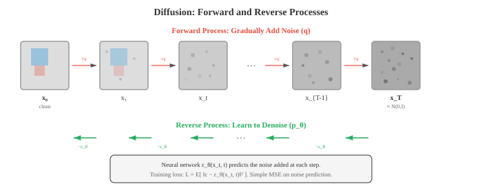

# 视觉 Transformer 与生成

> **一句话总结**: 视觉 Transformer 把图像切成 Patch 序列并用自注意力处理, 挑战 CNN 的统治; 生成模型则从 GAN、VAE 一路走到扩散模型与流匹配, 成为图像生成的主流范式.

*视觉 Transformer 把自注意力用到图像 Patch 上, 用数据驱动的空间学习挑战 CNN 的统治地位. 本节涵盖 ViT、DeiT、Swin Transformer, GAN (StyleGAN)、VAE、扩散模型 (DDPM、Stable Diffusion) 等图像生成方法, 以及超分辨率和神经风格迁移.*

- 卷积神经网络 (Convolutional Neural Network, CNN) (见文件 02) 内建了很强的空间归纳偏置: 局部连接、权重共享和平移等变. 视觉 Transformer (Vision Transformer, ViT) 抛出一个挑衅性的问题: 如果把这些偏置全部丢掉, 让模型只靠第 06 章的注意力机制从数据中学习空间结构, 会怎么样?

- **视觉 Transformer (Vision Transformer, ViT)** (Dosovitskiy 等, 2021) 把标准 Transformer 编码器直接用到图像上. 核心想法是: 把图像当成 Patch 序列, 就像 NLP 把文本当成 Token 序列一样.

- 整个流程如下:
    1. 把图像 (高 $H$, 宽 $W$, 通道 $C$) 切成大小为 $P \times P$ 的不重叠 Patch 网格, 一共得到 $N = HW / P^2$ 个 Patch.
    2. 把每个 Patch 展平成长度为 $P^2 \cdot C$ 的向量, 再通过一个可学习的线性嵌入 (第 02 章讲的单次矩阵乘) 投影到模型维度 $D$.
    3. 在序列前面加一个可学习的 **[CLS] Token** 嵌入 (类似 BERT 的 [CLS], 见第 07 章). 这个 Token 会关注所有 Patch, 它的最终表示用于分类.
    4. 加上**位置嵌入** (每个位置一个可学习向量), 提供空间信息, 因为注意力对置换等变.
    5. 把 $(N + 1)$ 个 Token 嵌入的序列送入标准 Transformer 编码器 (多头自注意力 + 前馈网络 (Feed-Forward Network, FFN), 见第 06 章).
    6. [CLS] Token 的最终表示经过一个分类头 (小型多层感知机 (Multi-Layer Perceptron, MLP)) 输出结果.

![ViT 流程: 图像切成 16x16 Patch, 每个 Patch 展平后线性投影, 前面拼上 [CLS] Token, 加上位置嵌入, 然后送入 Transformer 编码器块](../images/vit_pipeline.svg)

- **Patch 嵌入**其实等价于一个卷积核大小为 $P$、步长为 $P$ (不重叠) 的卷积. ViT 就是把 2D 图像变成 1D 序列, 然后用处理语言的同一套架构去处理它.

- ViT 的归纳偏置比 CNN 少: 它不强制局部连接, 也不强制平移等变. 这意味着它需要更多训练数据才能从零学到空间结构. 数据集小时 CNN 胜过 ViT; 但只要在超大数据集 (JFT-300M, 3 亿张图像) 上训练, ViT 就能追上甚至超过最好的 CNN. 这说明 CNN 的归纳偏置对数据效率有帮助, 但对最终性能并非必需.

- ViT 的自注意力关于 Patch 数量是 $O(N^2)$. 对 224x224 图像用 16x16 Patch, $N = 196$, 还算能接受. 但如果分辨率更高或 Patch 更小, 平方级代价就会变得难以承受.

- **DeiT** (Data-efficient Image Transformer, Touvron 等, 2021) 证明 ViT 光靠 ImageNet 也能训练得很好 (不需要庞大的 JFT 数据集), 靠的是强数据增强、正则化 (随机深度、标签平滑、Dropout) 以及**知识蒸馏 (knowledge distillation)**: 一个预训练好的 CNN 老师提供软标签, ViT 学生学着去匹配. DeiT 在 [CLS] Token 之外又加了一个**蒸馏 Token**, 专门用来预测老师的输出.

- **Swin Transformer** (Liu 等, 2021) 针对 ViT 的两大痛点: 关于图像尺寸的平方级开销, 以及缺乏检测和分割所需的层次化特征图.

- Swin 引入了**滑动窗口 (shifted windows)**: 不做全局自注意力, 而是在局部窗口 (比如 7x7 Patch) 内计算注意力. 这样代价关于图像尺寸就变成线性 $O(N)$ 而不是 $O(N^2)$. 但光有局部窗口, 各区域之间就不通消息了.

- **窗口滑动 (Window shifting)** 解决了这个问题: 在相邻的两层之间, 窗口划分错开半个窗口大小. 这样就在窗口之间建立了跨窗口的连接, 让信息可以跨层在图像的各个部分之间流动, 又不用付出全局注意力的代价.

- 

- Swin 还通过跨阶段合并 Patch, 构造出**层次化表示**. 每个阶段后, 相邻的 2x2 Patch 拼在一起再投影, 通道数翻倍、空间分辨率减半. 这就产生了类似 CNN 和特征金字塔网络 (Feature Pyramid Network, FPN) (见文件 03) 的多尺度特征图, 让 Swin 可以直接对接 Faster R-CNN 之类的检测头和 U-Net 之类的分割头.

- **金字塔视觉 Transformer (Pyramid Vision Transformer, PVT)** 也走类似的层次化路线, 用的是空间缩减注意力: 每个阶段先把键和值在空间上下采样, 再算注意力, 既降低了平方代价, 又保住了全局感受野.

- **自监督视觉学习 (self-supervised visual learning)** 从无标注图像中学习表示. 标签成本很高, 图像却很多. 目标是学出无需人工标注就能很好迁移到下游任务的特征.

- **对比学习 (contrastive learning)** 训练模型认识到: 同一张图像的两个增强视图 (一个"正样本对") 应该有相似表示, 而不同图像的视图 ("负样本对") 应该有不相似表示.

- **SimCLR** (Chen 等, 2020) 为一个 Batch 中的每张图像生成两个增强视图, 用共享的骨干网络加投影头编码这两个视图, 然后套用 **NT-Xent 损失** (归一化温度缩放交叉熵损失):

$$\ell_{i,j} = -\log \frac{\exp(\text{sim}(z_i, z_j) / \tau)}{\sum_{k \neq i} \exp(\text{sim}(z_i, z_k) / \tau)}$$

- 其中 $\text{sim}$ 是余弦相似度 (见第 01 章), $\tau$ 是温度参数. 分子把正样本对拉近, 分母把负样本对推远. SimCLR 需要很大的批大小 (4,096+) 才能提供足够多的负样本.

- **MoCo** (Momentum Contrast, He 等, 2020) 通过维护一个**动量更新队列**存放负样本嵌入, 解决了对大 Batch 的依赖. 查询编码器用梯度下降更新; 键编码器则用查询编码器的指数移动平均 (Exponential Moving Average, EMA) (见第 04 章) 更新: $\theta_k \leftarrow m \theta_k + (1 - m) \theta_q$, 取 $m = 0.999$. 队列存放最近的键嵌入, 提供了一大批一致的负样本, 而不需要巨大的 Batch.

- **BYOL** (Bootstrap Your Own Latent, Grill 等, 2020) 干脆把负样本完全去掉. 它用两个网络: 一个"在线"网络, 一个"目标"网络 (在线网络的 EMA). 在线网络去预测目标网络在另一个增强视图上给出的表示. 没有负样本, BYOL 靠预测头的非对称性和 EMA 目标, 避开了模型对所有输入都输出同一个向量的"崩溃"问题.

- **DINO** (Self-Distillation with No Labels, Caron 等, 2021) 把自蒸馏用到 ViT 上. 学生网络预测老师网络 (学生的 EMA) 在不同增强视图上的输出. 老师看大裁剪, 学生看小裁剪. DINO 学出来的特征天然带有场景布局的显式信息: 在没有任何分割监督的情况下, DINO 训练出来的 ViT 的自注意力图会自动把物体分割出来.

- **掩码图像建模 (masked image modelling)** 是 BERT 掩码语言建模 (见第 07 章) 在视觉上的对应. 输入 Patch 中很大一部分被遮住, 模型学着把它们重建出来.

- **MAE** (Masked Autoencoders, He 等, 2022) 遮住 75% 的 Patch, 训练一个 ViT 编码器-解码器去重建缺失的像素值. 编码器只处理未被遮住的 Patch (预训练时省下 4 倍计算), 轻量级解码器再从编码后的可见 Patch 加上可学习的掩码 Token 重建整张图.

- **BEiT** (BERT Pre-training of Image Transformers, Bao 等, 2022) 也遮 Patch, 但预测的是离散视觉 Token (来自一个预训练的 dVAE 分词器), 而不是原始像素. 这和 BERT 预测离散词 Token 是对应的, 也避开了像素级重建的低级细节.

- **图像生成 (image generation)** 的目标是产出训练集里不存在的、逼真的新图像. 核心难点在于建模自然图像那高维的概率分布.

- **生成对抗网络 (Generative Adversarial Network, GAN)** (Goodfellow 等, 2014) 用两个互相博弈的网络: **生成器 (generator)** $G$ 从随机噪声造假图, **判别器 (discriminator)** $D$ 则想区分真图和假图. 二者对抗训练: $G$ 想骗过 $D$, $D$ 想抓住 $G$.

$$\min_G \max_D \; \mathbb{E}_{x \sim p_{\text{data}}}[\log D(x)] + \mathbb{E}_{z \sim p(z)}[\log(1 - D(G(z)))]$$

- 生成器拿一个随机潜向量 $z$ (从高斯这种简单分布里采样), 经过一连串转置卷积映射成一张图像. 判别器就是一个标准的 CNN 分类器. 到达均衡时, $G$ 生成的图像和真数据无法区分, $D$ 对所有输入都给出 0.5.

- **模式崩溃 (mode collapse)** 是 GAN 最主要的失败模式: 生成器学会只产出几种能骗过判别器的图像, 而忽略训练数据的多样性. 它找到了一小组"安全"输出, 而不去覆盖整个分布.

- 让 GAN 稳定的训练技巧包括: 谱归一化 (约束判别器的 Lipschitz 常数)、渐进式增长 (先在低分辨率训, 再逐步提高)、特征匹配 (匹配判别器中间层特征的统计量, 而不是最终输出), 以及用 Wasserstein 距离替代原始的 JS 散度目标.

- **StyleGAN** (Karras 等, 2019) 是影响力最大的高质量图像合成 GAN 架构. 它的核心创新是**基于风格的生成器**: 潜向量 $z$ 不直接喂进生成器, 而是先经过一个**映射网络** (8 层 MLP) 变成风格向量 $w$. 这个风格向量通过**自适应实例归一化 (Adaptive Instance Normalisation, AdaIN)** 注入到生成器的每一层, 调制特征图的统计量:

$$\text{AdaIN}(x, y) = y_{s} \cdot \frac{x - \mu(x)}{\sigma(x)} + y_{b}$$

- 其中 $y_s$ 和 $y_b$ 是从 $w$ 派生出的缩放和偏置. 不同层控制不同方面: 早期层控制粗略特征 (姿势、脸型), 中间层控制中等特征 (发型、眼睛), 后期层控制细节 (雀斑、发丝纹理). StyleGAN 能生成 1024x1024 分辨率的照片级人脸.

- **变分自编码器 (Variational Autoencoder, VAE)** (见第 06 章) 提供了另一种生成路线. 与 GAN 不同, VAE 有一个原则化的概率框架和清晰的训练目标 (证据下界 (Evidence Lower Bound, ELBO)). 它生成的图像往往比 GAN 模糊, 但潜空间更平滑、更有结构. 在潜扩散模型里, 就是靠 VAE 这对编码器-解码器把图像压到潜空间再还原回去.

- **扩散模型 (diffusion models)** 已经成为图像生成的主导范式, 在质量和多样性上都超过了 GAN. 想法概念上很简单: 逐步给数据加噪声直到变成纯高斯噪声 (**前向过程**), 再学着一步一步反过来 (**反向过程**).

- **前向过程**在 $T$ 个时间步上加高斯噪声:

$$q(x_t | x_{t-1}) = \mathcal{N}(x_t; \sqrt{1 - \beta_t} \, x_{t-1}, \beta_t I)$$

- 其中 $\beta_t$ 是一个随时间递增的噪声调度. 步数足够多之后, 无论原图 $x_0$ 是什么, $x_T$ 都近似是纯高斯噪声. 利用重参数化技巧 (见第 06 章), 记 $\alpha_t = 1 - \beta_t$, $\bar{\alpha}_t = \prod_{s=1}^{t} \alpha_s$, 我们可以从 $x_0$ 直接采样 $x_t$:

$$x_t = \sqrt{\bar{\alpha}_t} \, x_0 + \sqrt{1 - \bar{\alpha}_t} \, \epsilon, \quad \epsilon \sim \mathcal{N}(0, I)$$

- **反向过程**学着去噪: 从纯噪声 $x_T$ 起, 模型每一步预测被加进去的噪声 $\epsilon$, 减掉它得到 $x_{t-1}$. 这一过程由神经网络 $\epsilon_\theta$ (通常是 U-Net, 见文件 03) 参数化, 用简单的均方误差 (Mean Squared Error, MSE) 损失训练:

$$\mathcal{L} = \mathbb{E}_{t, x_0, \epsilon}\left[\|\epsilon - \epsilon_\theta(x_t, t)\|^2\right]$$



- **DDPM** (Denoising Diffusion Probabilistic Models, Ho 等, 2020) 奠定了这套框架. 采样得走完全部 $T$ 步 (一般 1,000 步), 速度很慢. **DDIM** (Denoising Diffusion Implicit Models, Song 等, 2021) 把采样过程改写成确定性映射, 允许大跨步 (比如从 1,000 步压到 50 步), 而质量损失很小.

- **基于分数的模型 (score-based models)** (Song 和 Ermon, 2019) 给出了另一种视角. 模型不去预测噪声 $\epsilon$, 而是估计**分数函数** $\nabla_{x_t} \log p(x_t)$, 也就是对数概率对含噪图像的梯度. 这个梯度指向数据分布中概率更高 (更干净) 的区域. 采样时沿这个梯度走朗之万动力学. 基于分数的模型和 DDPM 在**随机微分方程 (Stochastic Differential Equation, SDE)** 框架下被统一: 前向过程是一个加噪的 SDE, 反向过程就是时间反演的 SDE.

- **无分类器引导 (Classifier-free guidance)** (Ho 和 Salimans, 2022) 控制样本质量与多样性之间的权衡. 模型同时被有条件 (带文本提示或类别标签) 和无条件 (随机丢掉条件) 训练. 采样时, 预测是两者的加权组合:

$$\hat{\epsilon} = \epsilon_\theta(x_t, \varnothing) + s \cdot (\epsilon_\theta(x_t, c) - \epsilon_\theta(x_t, \varnothing))$$

- 其中 $c$ 是条件, $\varnothing$ 是空条件, $s > 1$ 是引导强度. $s$ 越大, 生成图像越贴近条件, 但多样性越低. $s = 1$ 就是无引导模型; $s = 7.5$ 是常用默认值.

- **潜扩散 (latent diffusion)** (Rombach 等, 2022; Stable Diffusion) 把扩散过程从像素空间搬到一个学好的潜空间. 一个预训练好的 VAE 编码器把图像压到较低维度的潜表示 (通常空间下采样 4 倍或 8 倍), 扩散在这个压缩空间里进行, VAE 解码器再从去噪后的潜变量还原出像素. 这样效率提升巨大: 在像素空间扩散 512x512 图像要处理一个 $512 \times 512 \times 3$ 的张量, 而在潜空间只需要一个 $64 \times 64 \times 4$ 的张量.

- 潜扩散里的去噪 U-Net 接收含噪潜变量、时间步 (编码成正弦嵌入, 类比 Transformer 里的位置编码) 和一个条件信号 (来自冻结的 CLIP 或 T5 文本编码器的文本嵌入). 文本条件通过 U-Net 内部的交叉注意力层进入: 文本嵌入作为键和值, 图像特征作为查询. 这让模型能够在每个空间位置上, 关注文本提示词中相关的部分.

- **流匹配 (flow matching, Lipman 等, 2023, ICLR)** 是一个建立在**连续归一化流 (CNF)** 之上的独立生成建模框架, 并非 DDPM 的推广或特例. 它直接对确定性 ODE 速度场做回归学习, 从噪声到数据学习一条连续传输路径; DDPM 走的是 SDE 加噪-去噪的随机路径, 二者出发点不同. 后续工作证明 (Song 等, 2021, ICLR; Lipman 等, 2023, ICLR): 当条件流选为高斯路径时, 流匹配可以恢复到与扩散模型等价的目标, 但反之不成立 —— DDPM 不能覆盖流匹配的一般 CNF 框架.

- **连续归一化流 (Continuous Normalising Flow, CNF)** (Chen 等, 2018, Neural ODE) 定义了一个随时间变化的速度场 $v_\theta(x, t)$, 沿平滑轨迹把样本从简单分布 $p_0$ (噪声) 推到数据分布 $p_1$. 变换服从一个常微分方程 (Ordinary Differential Equation, ODE):

$$\frac{dx}{dt} = v_\theta(x, t), \quad t \in [0, 1]$$

- 从 $x_0 \sim \mathcal{N}(0, I)$ 出发, 把 ODE 前向积分到 $t = 1$, 就得到一个数据分布的样本. 速度场用神经网络参数化, 训练时让它匹配一个目标条件流.

- **最优传输 (Optimal Transport, OT)** 流匹配 (Lipman 等, 2023) 采用噪声到数据之间的直线路径作为目标流: 从噪声样本 $x_0$ 到数据样本 $x_1$ 的条件路径就是 $x_t = (1 - t) x_0 + t x_1$, 目标速度是 $v = x_1 - x_0$. 训练损失变成:

$$\mathcal{L} = \mathbb{E}_{t, x_0, x_1} \left[\|v_\theta(x_t, t) - (x_1 - x_0)\|^2\right]$$

- **整流流 (Rectified flows)** (Liu 等, 2022) 迭代地把学到的流路径拉直. 先训一遍模型, 再用这个模型通过模拟 ODE 生成 (噪声, 数据) 对; 这些配对比随机配对更"对齐", 再用它们重训模型. 反复做, 路径会越来越直, ODE 步数就能更少 (甚至一步), 从而实现极快的生成.

- 作为独立的 CNF 生成框架, 流匹配相比扩散有几个好处: 训练目标更简单 (直接对确定性 ODE 速度场回归, 无需 SDE 噪声调度), 采样 ODE 更平滑 (需要的积分步数更少, 据 Lipman 等 2023 ICLR 实验通常 5-20 步), 加上最优传输的联系提供了理论基础. Stable Diffusion 3 (Esser 等, 2024) 和 Flux.1 (Black Forest Labs, 2024) 都改用流匹配框架, 而非 DDPM 的扩散范式.

## 编程练习 (用 CoLab 或 Notebook)

1. 从零实现 ViT 的 Patch 嵌入. 把图像切成 Patch, 展平, 投影到模型维度, 加位置嵌入, 再拼上 [CLS] Token.
```python
import jax
import jax.numpy as jnp
import matplotlib.pyplot as plt

def create_patch_embedding(image, patch_size, d_model, params):
    """把一张图像变成 Patch 嵌入序列."""
    H, W, C = image.shape
    n_patches_h = H // patch_size
    n_patches_w = W // patch_size
    n_patches = n_patches_h * n_patches_w

    # 提取 Patch
    patches = []
    for i in range(n_patches_h):
        for j in range(n_patches_w):
            patch = image[i*patch_size:(i+1)*patch_size,
                          j*patch_size:(j+1)*patch_size, :]
            patches.append(patch.ravel())
    patches = jnp.stack(patches)  # (N, P*P*C)

    # 线性投影到 d_model
    embeddings = patches @ params['proj_w'] + params['proj_b']  # (N, d_model)

    # 前面拼上 CLS Token
    cls_token = params['cls_token']  # (1, d_model)
    embeddings = jnp.concatenate([cls_token, embeddings], axis=0)  # (N+1, d_model)

    # 加位置嵌入
    embeddings = embeddings + params['pos_embed']  # (N+1, d_model)

    return embeddings, patches

# 初始化
H, W, C = 32, 32, 3
patch_size = 8
d_model = 64
n_patches = (H // patch_size) * (W // patch_size)  # 16

key = jax.random.PRNGKey(42)
keys = jax.random.split(key, 5)

# 造一张有明显四象限的合成图
image = jnp.zeros((H, W, C))
image = image.at[:16, :16, 0].set(1.0)   # 左上红
image = image.at[:16, 16:, 1].set(1.0)   # 右上绿
image = image.at[16:, :16, 2].set(1.0)   # 左下蓝
image = image.at[16:, 16:, :2].set(1.0)  # 右下黄

params = {
    'proj_w': jax.random.normal(keys[0], (patch_size**2 * C, d_model)) * 0.02,
    'proj_b': jnp.zeros(d_model),
    'cls_token': jax.random.normal(keys[1], (1, d_model)) * 0.02,
    'pos_embed': jax.random.normal(keys[2], (n_patches + 1, d_model)) * 0.02,
}

embeddings, patches = create_patch_embedding(image, patch_size, d_model, params)

print(f"Image shape: {image.shape}")
print(f"Patch size: {patch_size}x{patch_size}")
print(f"Number of patches: {n_patches}")
print(f"Patch vector length: {patch_size**2 * C}")
print(f"Embedding shape: {embeddings.shape}  (CLS + {n_patches} patches)")

# 可视化 Patch
fig, axes = plt.subplots(2, 5, figsize=(14, 6))
axes[0, 0].imshow(image); axes[0, 0].set_title('Full Image'); axes[0, 0].axis('off')
for idx in range(min(9, n_patches)):
    ax = axes[(idx+1) // 5, (idx+1) % 5]
    patch_img = patches[idx].reshape(patch_size, patch_size, C)
    ax.imshow(patch_img); ax.set_title(f'Patch {idx}'); ax.axis('off')
plt.suptitle('ViT Patch Decomposition')
plt.tight_layout(); plt.show()
```

2. 实现一个简单的 GAN 训练循环. 在 2D 数据上训练生成器和判别器, 可视化生成分布逐渐收敛到真分布.
```python
import jax
import jax.numpy as jnp
import matplotlib.pyplot as plt

def generator(z, params):
    h = jnp.tanh(z @ params['g_w1'] + params['g_b1'])
    h = jnp.tanh(h @ params['g_w2'] + params['g_b2'])
    return h @ params['g_w3'] + params['g_b3']

def discriminator(x, params):
    h = jax.nn.leaky_relu(x @ params['d_w1'] + params['d_b1'], 0.2)
    h = jax.nn.leaky_relu(h @ params['d_w2'] + params['d_b2'], 0.2)
    return jax.nn.sigmoid(h @ params['d_w3'] + params['d_b3'])

def init_params(key):
    keys = jax.random.split(key, 6)
    z_dim, h_dim, data_dim = 2, 32, 2
    scale = 0.1
    return {
        'g_w1': jax.random.normal(keys[0], (z_dim, h_dim)) * scale,
        'g_b1': jnp.zeros(h_dim),
        'g_w2': jax.random.normal(keys[1], (h_dim, h_dim)) * scale,
        'g_b2': jnp.zeros(h_dim),
        'g_w3': jax.random.normal(keys[2], (h_dim, data_dim)) * scale,
        'g_b3': jnp.zeros(data_dim),
        'd_w1': jax.random.normal(keys[3], (data_dim, h_dim)) * scale,
        'd_b1': jnp.zeros(h_dim),
        'd_w2': jax.random.normal(keys[4], (h_dim, h_dim)) * scale,
        'd_b2': jnp.zeros(h_dim),
        'd_w3': jax.random.normal(keys[5], (h_dim, 1)) * scale,
        'd_b3': jnp.zeros(1),
    }

def d_loss(params, real_data, fake_data):
    real_score = discriminator(real_data, params)
    fake_score = discriminator(fake_data, params)
    return -jnp.mean(jnp.log(real_score + 1e-7) + jnp.log(1 - fake_score + 1e-7))

def g_loss(params, fake_data):
    fake_score = discriminator(fake_data, params)
    return -jnp.mean(jnp.log(fake_score + 1e-7))

# 真数据: 环形分布
key = jax.random.PRNGKey(42)
theta = jax.random.uniform(key, (512,)) * 2 * jnp.pi
real_data = jnp.stack([jnp.cos(theta), jnp.sin(theta)], axis=1)
real_data = real_data + jax.random.normal(key, real_data.shape) * 0.05

params = init_params(jax.random.PRNGKey(0))
d_grad = jax.grad(d_loss)
g_grad = jax.grad(g_loss)
lr = 0.001

snapshots = []
for step in range(3000):
    key, k1 = jax.random.split(key)
    z = jax.random.normal(k1, (512, 2))
    fake_data = generator(z, params)

    # 更新判别器
    grads = d_grad(params, real_data, fake_data)
    for k in ['d_w1', 'd_b1', 'd_w2', 'd_b2', 'd_w3', 'd_b3']:
        params[k] = params[k] - lr * grads[k]

    # 更新生成器
    fake_data = generator(z, params)
    grads = g_grad(params, fake_data)
    for k in ['g_w1', 'g_b1', 'g_w2', 'g_b2', 'g_w3', 'g_b3']:
        params[k] = params[k] - lr * grads[k]

    if step in [0, 500, 1500, 2999]:
        snapshots.append((step, fake_data.copy()))

fig, axes = plt.subplots(1, 4, figsize=(16, 4))
for ax, (step, fake) in zip(axes, snapshots):
    ax.scatter(real_data[:, 0], real_data[:, 1], s=5, alpha=0.3, c='#3498db', label='Real')
    ax.scatter(fake[:, 0], fake[:, 1], s=5, alpha=0.3, c='#e74c3c', label='Generated')
    ax.set_title(f'Step {step}'); ax.set_xlim(-2, 2); ax.set_ylim(-2, 2)
    ax.set_aspect('equal'); ax.legend(markerscale=3)
plt.suptitle('GAN Training: Generator Learns the Ring Distribution')
plt.tight_layout(); plt.show()
```

3. 实现扩散的前向过程: 在越来越大的时间步上给图像加噪, 可视化逐步破坏的过程. 再实现一次去噪.
```python
import jax
import jax.numpy as jnp
import matplotlib.pyplot as plt

def noise_schedule(T, beta_start=0.0001, beta_end=0.02):
    """线性噪声调度."""
    betas = jnp.linspace(beta_start, beta_end, T)
    alphas = 1.0 - betas
    alpha_bars = jnp.cumprod(alphas)
    return betas, alphas, alpha_bars

def forward_diffusion(x0, t, alpha_bars, key):
    """在时间步 t 给 x0 加噪."""
    alpha_bar_t = alpha_bars[t]
    noise = jax.random.normal(key, x0.shape)
    xt = jnp.sqrt(alpha_bar_t) * x0 + jnp.sqrt(1 - alpha_bar_t) * noise
    return xt, noise

# 造一张简单的 2D "图像" (棋盘)
img = jnp.zeros((32, 32))
for i in range(4):
    for j in range(4):
        if (i + j) % 2 == 0:
            img = img.at[i*8:(i+1)*8, j*8:(j+1)*8].set(1.0)

T = 1000
betas, alphas, alpha_bars = noise_schedule(T)

# 可视化前向过程
timesteps = [0, 50, 200, 500, 999]
key = jax.random.PRNGKey(42)

fig, axes = plt.subplots(1, len(timesteps), figsize=(16, 3.5))
for ax, t in zip(axes, timesteps):
    key, subkey = jax.random.split(key)
    xt, noise = forward_diffusion(img, t, alpha_bars, subkey)
    ax.imshow(xt, cmap='gray', vmin=-2, vmax=2)
    ax.set_title(f't={t}\n$\\bar{{\\alpha}}$={alpha_bars[t]:.3f}')
    ax.axis('off')
plt.suptitle('Diffusion Forward Process: Progressive Noise Addition')
plt.tight_layout(); plt.show()

# 简单去噪: 训一个小网络在 t=200 预测噪声
t_denoise = 200
key, k1 = jax.random.split(key)
xt, true_noise = forward_diffusion(img, t_denoise, alpha_bars, k1)

# 小 "去噪器": 只学一个常数噪声估计 (仅用于示意)
noise_estimate = jnp.zeros_like(img)
lr = 0.01
for step in range(100):
    residual = noise_estimate - true_noise
    noise_estimate = noise_estimate - lr * residual

# 反向走一步
alpha_bar_t = alpha_bars[t_denoise]
x_denoised = (xt - jnp.sqrt(1 - alpha_bar_t) * noise_estimate) / jnp.sqrt(alpha_bar_t)

fig, axes = plt.subplots(1, 3, figsize=(12, 4))
axes[0].imshow(img, cmap='gray'); axes[0].set_title('Original $x_0$'); axes[0].axis('off')
axes[1].imshow(xt, cmap='gray', vmin=-2, vmax=2)
axes[1].set_title(f'Noisy $x_{{200}}$'); axes[1].axis('off')
axes[2].imshow(x_denoised, cmap='gray')
axes[2].set_title('Denoised (one step)'); axes[2].axis('off')
plt.tight_layout(); plt.show()

mse = jnp.mean((x_denoised - img)**2)
print(f"Denoising MSE: {mse:.4f}")
```

---

## 📌 本节要点

- **视觉 Transformer (ViT)**: 把图像切成 Patch 序列, 用标准 Transformer 编码器处理, 靠数据学空间结构.
- **归纳偏置权衡**: ViT 归纳偏置比 CNN 弱, 小数据集吃亏, 但在超大数据集上追平甚至超过 CNN.
- **DeiT 与 Swin**: DeiT 靠知识蒸馏在 ImageNet 上高效训 ViT; Swin 用滑动窗口把注意力代价压到线性, 并给出层次化特征图.
- **自监督预训练**: SimCLR/MoCo/BYOL/DINO 靠对比或自蒸馏从无标注图像学特征, MAE/BEiT 走掩码重建路线.
- **GAN 与 StyleGAN**: 生成器-判别器对抗训练, 易模式崩溃; StyleGAN 用映射网络加 AdaIN 分层控制风格.
- **扩散模型 DDPM**: 前向加噪、反向去噪, 用简单 MSE 损失训练一个噪声预测 U-Net.
- **DDIM 与分数模型**: DDIM 用确定性采样大幅减少步数; 分数模型和 DDPM 在 SDE 框架下统一.
- **无分类器引导**: 加权组合有条件与无条件预测, 控制质量-多样性权衡, 常用 $s = 7.5$.
- **潜扩散**: 在 VAE 压缩后的潜空间做扩散, 大幅降低算力开销; 文本条件通过交叉注意力接入 U-Net.
- **流匹配**: 建立在 CNF 上的独立生成框架 (Lipman 等, 2023 ICLR), 非 DDPM 的推广; 直接学 ODE 速度场把噪声送到数据, 训练目标更简单、采样更快 (据 Lipman 2023 通常 5-20 步), Stable Diffusion 3 与 Flux.1 已采用.
