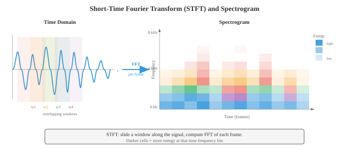

# 数字信号处理

> **一句话总结**: 数字信号处理把原始音频波形转成模型能吃的结构化表示, 涵盖采样、傅立叶变换、频谱图、梅尔滤波器组、MFCC 与加窗全流程.

## 🗺️ 本章导览

- 本章覆盖音频与语音: 数字信号处理 (Digital Signal Processing, DSP) → 自动语音识别 (Automatic Speech Recognition, ASR) → 文本到语音 (Text-to-Speech, TTS) → 说话人分析 → 源分离
- **01. 数字信号处理** (本节): 采样、傅立叶变换、频谱、滤波
- **02. 自动语音识别**: HMM、CTC、RNN-T、Whisper 家族
- **03. 文本到语音与声音**: WaveNet、Tacotron、VITS、Diffusion TTS
- **04. 说话人与音频分析**: 说话人辨识、日志化、活动检测
- **05. 源分离与降噪**: 主动降噪、Demucs、语音增强

*数字信号处理 (Digital Signal Processing, DSP) 把原始音频波形转换成机器学习模型能学的结构化表示. 本节涵盖声音物理、采样与量化、傅立叶变换 (离散傅立叶变换 DFT、快速傅立叶变换 FFT)、频谱图、梅尔滤波器组、梅尔频率倒谱系数 (MFCC) 与加窗——这是所有语音和音频 AI 的特征提取流水线.*

- **声音** 是一种压力波, 通过介质 (空气、水、固体) 传播. 一个振动的物体 (声带、吉他弦、扬声器锥盆) 推挤空气分子, 制造出高压 (压缩) 与低压 (稀疏) 交替的区域.

- 这些压力起伏在空气中以大约 343 m/s 的速度向外传播, 到达你的耳朵, 让鼓膜跟着振动, 再转导成神经信号.

- 把声音想象成往平静池塘扔一块石头: 石头是振动源, 涟漪是压力波, 浮在水面上一颠一颠的软木塞就是麦克风或鼓膜, 它对波的到达做出反应.

- 软木塞颠起的高度就是**振幅**, 每秒颠多少次就是**频率**, 波到来时它是从颠动的顶端还是底端开始, 决定了**相位**.

- **波形** 是压力 (或者经过麦克风把声转成电信号后的电压) 随时间变化的图像. 最简单的波形是**纯音**, 也就是一条正弦曲线:

$$x(t) = A \sin(2\pi f t + \phi)$$

- 其中:
    - $A$ 是振幅 (偏离零的峰值, 决定响度),
    - $f$ 是频率, 单位赫兹 Hz (每秒周期数, 决定音高),
    - $\phi$ 是相位, 单位弧度 (波的时间偏移).

- **周期** 是 $T = 1/f$, 也就是一个完整周期的时长.


- **振幅** 决定我们感知到的响度. 振幅翻倍, 功率翻四倍 (因为功率正比于振幅的平方).

- 人耳能覆盖的振幅范围非常大, 所以用对数刻度来表示: **分贝** (decibel, dB). 声压级公式是:

$$L = 20 \log_{10}\left(\frac{A}{A_\text{ref}}\right) \text{ dB}$$

- 其中 $A_\text{ref}$ 是参考振幅 (通常取听觉阈值 $20 \mu\text{Pa}$). 耳语约 30 dB, 正常对话 60 dB, 摇滚现场 110 dB. 每增加 6 dB 大致对应振幅翻倍; 每增加 10 dB 大致对应感知响度翻倍. 这里用的对数就是第 03 章那个函数.

- **频率** 决定音高. 低频 (20–250 Hz) 听起来是低音; 高频 (2000–20000 Hz) 听起来是高音. 人耳听力范围大约 20 Hz 到 20 kHz. 音会 A (Concert A) 是 440 Hz. 频率翻倍, 音高升高一个**八度** (octave).

- 大多数自然声音都不是纯音, 而是许多频率的复杂混合. 这就是为什么钢琴和小提琴弹同一个音, 听起来还是不一样: 它们的**基频** (fundamental frequency) 相同, 但**谐波** (harmonics, 基频的整数倍) 及其相对振幅 (也就是**音色**, timbre) 各异.

- **相位** 决定波从周期中的哪个位置起步. 两个振幅频率相同但相位不同的波, 可以相长干涉 (相位对齐, 振幅相加), 也可以相消干涉 (相位相反, 振幅抵消).

- 相位在立体声与波束形成里至关重要, 但在很多语音处理流水线中被大量丢弃——因为人耳对音高和音色的感知基本与相位无关.

- 真实世界的音频信号是关于时间的**连续**函数, 但计算机只能处理离散数字. **采样** (sampling) 把连续信号变成离散序列, 做法是每隔固定时间测一次信号的值.

- **采样率** $f_s$ 就是每秒测多少次. CD 音频用 $f_s = 44{,}100$ Hz; 电话用 8000 Hz; 现代语音模型通常用 16000 Hz.

- **奈奎斯特-香农采样定理** (Nyquist-Shannon sampling theorem) 说: 一个连续信号能被它的采样值完美重建, 当且仅当采样率至少是信号中最高频率的两倍:

$$f_s \geq 2 f_\text{max}$$

- 频率 $f_s / 2$ 叫**奈奎斯特频率**. 如果信号里有超过奈奎斯特频率的成分, 这些成分会折叠回有效范围, 变成假的低频分量. 这种现象叫**混叠** (aliasing). 混叠不可逆——一旦发生, 原始信号就再也从采样值里恢复不出来了.

- 日常里最好懂的混叠例子是电影里的"车轮倒转"效应: 车轮转速刚好略高于帧率, 摄像机没跟上, 看上去反而在慢慢倒转. 音频里, 一个 15 kHz 的音在 16 kHz 采样 ($f_\text{Nyquist} = 8$ kHz) 下会混叠成 $16 - 15 = 1$ kHz, 完全变成另一个音高.


- 为了防止混叠, **抗混叠滤波器** (anti-aliasing filter, 低通滤波器) 会在采样前先把 $f_s/2$ 以上的频率全部滤掉. 这一步由模数转换器 (Analog-to-Digital Converter, ADC) 硬件在信号数字化之前完成.

- **量化** (quantisation) 把每个连续值的采样映射到有限个离散电平中最近的一个. 一个 $n$ 位量化器有 $2^n$ 个电平. CD 音频用 16 位量化 ($2^{16} = 65{,}536$ 个电平); 电话经常用 8 位, 再配合 $\mu$ 律或 A 律的**压扩** (companding, 一种非线性映射, 把更多电平分给小振幅, 更贴合人耳感知). 量化会引入**量化噪声**, 本质是舍入误差, 方差为 $\Delta^2/12$, 其中 $\Delta$ 是电平之间的步长.

- **时域分析** 直接从波形里抽特征, 不做变换. 这类特征简单、算得快, 能反映信号的基本性质.

- 一帧 $N$ 个样本的**能量** (energy) 衡量整体响度:

$$E = \sum_{n=0}^{N-1} x[n]^2$$

- 语音段能量高, 静音段能量低. 能量就是第 01 章里的 $\ell_2$ 范数的平方, 应用到信号向量上.

- **过零率** (Zero-Crossing Rate, ZCR) 数一帧里信号变号的次数:

$$\text{ZCR} = \frac{1}{2(N-1)} \sum_{n=1}^{N-1} |\text{sign}(x[n]) - \text{sign}(x[n-1])|$$

- ZCR 高说明高频或噪声成分多; ZCR 低说明低频或有浊音 (voiced speech, 声带周期性振动的语音). ZCR 是一种粗糙的频率估计: $f$ Hz 的纯音每秒过零 $2f$ 次.

- **自相关** (autocorrelation) 衡量信号和它自身延迟版本的相似度:

$$R[k] = \sum_{n=0}^{N-1-k} x[n] \cdot x[n+k]$$

- 在 $k = 0$ 时, 自相关等于能量. 对周期信号来说, 自相关在滞后等于周期及其倍数的位置有峰. 这是**基音检测** (pitch detection) 的标准做法: 找 $R[k]$ 在 $k=0$ 之后的第一个显著峰, 基音就是 $f_s / k_\text{peak}$. 自相关和第 01 章的点积一脉相承: $R[k]$ 就是信号与其 $k$ 步平移版本的点积.

- **频域分析** 揭示信号的谱内容——这是在波形里看不出来的信息. 核心工具是**离散傅立叶变换** (Discrete Fourier Transform, DFT), 它把 $N$ 个样本的信号分解成 $N$ 个复数值的频率分量:

$$X[k] = \sum_{n=0}^{N-1} x[n] \cdot e^{-j 2\pi k n / N}, \quad k = 0, 1, \ldots, N-1$$

- 每个 $X[k]$ 是一个复数, 它的模 $|X[k]|$ 给出 $f_k = k \cdot f_s / N$ Hz 处频率分量的振幅, 它的辐角 $\angle X[k]$ 给出相位偏移. DFT 是一次基变换 (change of basis): 从时域基 (单位脉冲) 换到频域基 (复指数)——这正是第 02 章基这个概念的直接应用. DFT 可以写成矩阵乘法 $\mathbf{X} = W \mathbf{x}$, 其中 $W$ 是 $N \times N$ 的 DFT 矩阵, 元素为 $W_{kn} = e^{-j2\pi kn/N}$.

- **快速傅立叶变换** (Fast Fourier Transform, FFT) 是一种算法, 用 $O(N \log N)$ 次运算完成 DFT, 而不是朴素的 $O(N^2)$. 它把问题递归地拆成偶数下标和奇数下标两个子问题 (即 Cooley-Tukey 算法). 正是这份加速让实时频谱分析成为可能. FFT 是整个计算领域最重要的算法之一.

- **功率谱** $|X[k]|^2$ 展示能量在各频率上的分布. **幅度谱** $|X[k]|$ 展示振幅. 把这些画出来, 就能看清哪些频率主导了信号: 元音在基频的整数倍处有很强的谐波; 摩擦音 (比如 "s") 则在高频区有一片宽宽的能量.

- **频谱图** (spectrogram) 是信号频率内容随时间变化的可视化. 做法是把信号切成短的重叠帧, 对每一帧算 FFT, 把得到的幅度谱一列列拼起来. 横轴是时间, 纵轴是频率, 每个点的颜色 (或亮度) 表示幅度. 频谱图是音频处理里最重要的可视化, 没有之一.



- **梅尔刻度** (mel scale) 是一种感知频率刻度, 反映了人类如何感知音高. 人类把频率的相同比例感知为音高的相同间隔 (就像我们把强度的相同比例感知为响度的相同间隔). 1000 Hz 以下, 梅尔刻度近似线性; 1000 Hz 以上, 变得近似对数:

$$m = 2595 \log_{10}\left(1 + \frac{f}{700}\right)$$

- 反函数是 $f = 700(10^{m/2595} - 1)$. 梅尔刻度也是音乐半音在对数频率轴上等间距的原因: A4 (440 Hz) 到 A5 (880 Hz), A5 到 A6 (1760 Hz), 听起来都是"高了一个八度", 尽管 Hz 差值分别是 440 和 880.

- **梅尔滤波器组** (mel filterbank) 是一组三角形带通滤波器, 在梅尔刻度上均匀分布. 每个滤波器覆盖一段频率, 把该段的谱能量求和, 输出一个数. 典型语音系统用 40–80 个梅尔滤波器. 低频滤波器窄 (在我们感知敏感的地方保留高频率分辨率), 高频滤波器宽 (在我们感知迟钝的地方降低分辨率). 这刚好模仿了人耳耳蜗的频率分辨机制.


- **梅尔频率倒谱系数** (Mel-Frequency Cepstral Coefficients, MFCC) 是语音与音频的经典特征表示. 它把梅尔谱压缩成少量去相关的系数, 抓住谱包络的形状 (谱包络编码声道构型, 从而对应音素身份), 同时丢掉细致的谱细节 (那些编码基音和相位的东西).

- MFCC 流水线:
    1. **预加重**: 施加一阶高通滤波器 $y[n] = x[n] - \alpha x[n-1]$ (通常 $\alpha = 0.97$), 增强被声道衰减的高频.
    2. **分帧**: 把信号切成重叠帧 (通常帧长 25 ms, 帧移 10 ms).
    3. **加窗**: 每帧乘一个窗函数 (Hamming 汉明窗), 减小频谱泄漏 (下文详述).
    4. **FFT**: 计算每个加窗帧的功率谱.
    5. **梅尔滤波器组**: 把三角形梅尔滤波器组作用到功率谱上, 得到梅尔频带能量.
    6. **取对数**: 对梅尔频带能量取对数. 对数压缩动态范围, 把 (谱分量的) 乘法变加法, 也贴合人耳的响度感知.
    7. **DCT**: 对对数梅尔能量做离散余弦变换 (Discrete Cosine Transform, DCT). DCT 把梅尔频带去相关 (相邻频带高度相关), 并把能量压缩到前几个系数里. 保留前 13 个系数 (MFCC-0 到 MFCC-12).


- 第 7 步的 DCT 本质上是"频谱的傅立叶变换" (因此叫 **倒谱** cepstrum, 就是 spectrum 的字母重排). 低阶倒谱系数捕捉宽的谱形 (声道共振, 叫 **共振峰** formants), 高阶系数捕捉细谱细节 (基音谐波). 只保留前 13 个, 就等于保留共振峰、丢掉基音细节.

- **Delta** 与 **Delta-Delta** MFCC (MFCC 的一阶和二阶时间差分, 通过相邻帧的有限差分计算) 捕捉谱形的动态, 补进时序上下文. 一个完整的 MFCC 特征向量往往是 39 维: 13 个静态 + 13 个 delta + 13 个 delta-delta.

- 现代神经网络模型 (第 06 章) 已经基本用学习到的特征替代了 MFCC: 对数梅尔频谱 (即第 6 步的输出, 跳过 DCT) 是深度学习自动语音识别 (Automatic Speech Recognition, ASR) 和音频分类的标准输入. 模型自己学去相关. 但 MFCC 在低资源场景、经典 ML 流水线, 以及理解信号处理基础时依然重要.

- **加窗** (windowing) 是在做 FFT 之前, 把信号帧乘上一个平滑窗函数. 不加窗的话, FFT 会假设这一帧无限重复, 帧的突然开始和结束会造成人为不连续, 把能量摊到所有频率上, 这种伪影叫**频谱泄漏** (spectral leakage).

- **矩形窗** $w[n] = 1$ 对所有 $n$: 不做削减, 泄漏最大, 但主瓣最窄 (给定帧长下频率分辨率最好). 实际中很少用.

- **汉明窗 (Hamming window)**: $w[n] = 0.54 - 0.46 \cos(2\pi n / (N-1))$. 边缘削减到近似为零, 大幅减少泄漏. 语音处理的标准选择.

- **汉宁窗 (Hann window, 也叫 Hanning)**: $w[n] = 0.5 - 0.5 \cos(2\pi n / (N-1))$. 边缘正好削减到零. 和 Hamming 很像, 旁瓣压制略好一点.

- **布莱克曼窗 (Blackman window)**: $w[n] = 0.42 - 0.5 \cos(2\pi n / (N-1)) + 0.08 \cos(4\pi n / (N-1))$. 旁瓣压制更好, 但主瓣更宽 (频率分辨率更差). 当旁瓣伪影特别麻烦时才用.

- 存在一个基本权衡: 泄漏更少的窗主瓣更宽, 也就分不开两个靠得很近的频率. 这就是**频谱分辨率 vs. 泄漏权衡**, 是第 03 章测不准原理的一个推论.

- **叠加相加** (Overlap-Add, OLA) 是从加窗、处理过的帧重建信号的技术. 帧之间重叠 (通常 50–75%), 处理完之后把加窗输出相加. 如果窗和重叠选得对 (比如 Hann 窗配 50% 重叠), 重叠的窗加起来是常数, 就能完美重建. 这在任何基于帧的音频修改 (降噪、变调、变速) 里都不可或缺.

- **短时傅立叶变换** (Short-Time Fourier Transform, STFT) 是频谱图背后的正式框架. 它对信号的每一个加窗帧做 DFT:

```math
\text{STFT}\{x[n]\}(m, k) = \sum_{n=0}^{N-1} x[n + mH] \cdot w[n] \cdot e^{-j 2\pi k n / N}
```

- 其中 $m$ 是帧编号, $H$ 是帧移 (相邻帧间的样本数), $w[n]$ 是窗函数, $N$ 是 FFT 大小. 输出是一个二维复数矩阵: 信号的**时频表示** (time-frequency representation).

- STFT 体现了一个根本性的**时频权衡**:
    - 长帧 (大 $N$): 频率分辨率高 (能分辨靠得很近的频率), 但时间分辨率差 (说不清频率什么时候变的).
    - 短帧 (小 $N$): 时间分辨率高, 但频率分辨率差.
    - 时间分辨率和频率分辨率的乘积有下界: $\Delta t \cdot \Delta f \geq \frac{1}{4\pi}$. 这叫 **Gabor 极限**, 是物理里第 03 章海森堡测不准原理在信号处理中的对应.

- 典型的语音 STFT 参数: 帧长 25 ms (16 kHz 下 $N = 400$), 帧移 10 ms ($H = 160$), 汉明窗, 512 点 FFT (从 400 补零到 512, 一为效率, 二为更平滑的频谱插值).

- **滤波** (filtering) 通过放大某些频率、衰减另一些频率来改变信号的频率内容. **滤波器** (filter) 是一个吃输入信号、吐输出信号的系统. 滤波器的特征由**频率响应** $H(f)$ 刻画, 它描述每个频率被施加的增益和相移.

- **低通滤波器 (low-pass filter)**: 让低于截止频率 $f_c$ 的频率通过, 衰减更高的. 去掉高频噪声和细节. 采样前的抗混叠滤波器就是低通.

- **高通滤波器 (high-pass filter)**: 让高于 $f_c$ 的频率通过, 衰减更低的. 去掉低频轰鸣和直流偏置. MFCC 提取里的预加重滤波器 ($y[n] = x[n] - 0.97 x[n-1]$) 就是一个简单高通.

- **带通滤波器 (band-pass filter)**: 只让 $[f_1, f_2]$ 范围内的频率通过, 范围外衰减. 梅尔滤波器组里的每个三角形都是一个带通.

- **带阻 (陷波) 滤波器 (band-stop / notch filter)**: 衰减某个特定的窄频段. 用来去除特定干扰 (比如 50/60 Hz 的市电嗡声).

- **有限脉冲响应** (Finite Impulse Response, FIR) 滤波器把每个输出样本算成当前和过去输入样本的加权和:

$$y[n] = \sum_{k=0}^{M} b_k \cdot x[n-k]$$

- 权重 $b_k$ 叫**滤波器系数** (也叫 **抽头** taps). 滤波器阶数是 $M$. FIR 滤波器永远稳定 (输出不会发散), 且可以设计成完美线性相位 (所有频率延迟相同, 波形形状不失真). 缺点是要做出陡峭的截止就得堆抽头 (大 $M$), 计算量大. 输出就是输入与系数向量的卷积——正是第 06 章那个一维卷积操作.

- **无限脉冲响应** (Infinite Impulse Response, IIR) 滤波器带反馈: 输出同时依赖过去的输入和过去的输出:

```math
y[n] = \sum_{k=0}^{M} b_k \cdot x[n-k] - \sum_{k=1}^{L} a_k \cdot y[n-k]
```

- 反馈项 $a_k$ 造出一个递归结构, 其脉冲响应在理论上无限长. 用比 FIR 少得多的系数就能做到陡峭截止, 但可能不稳定 (如果传递函数的极点落在单位圆外, 输出会无限发散, 这是 $z$ 变换里的概念). 相位也非线性, 会扭曲波形形状. 经典滤波器设计 (Butterworth、Chebyshev、椭圆) 都是 IIR.

- 一个离散时间滤波器的**传递函数** (transfer function) 由 $z$ 变换给出:

$$H(z) = \frac{\sum_{k=0}^{M} b_k z^{-k}}{1 + \sum_{k=1}^{L} a_k z^{-k}}$$

- 分子的根叫**零点** (zeros), 分母的根叫**极点** (poles). 极零点图完整地刻画了滤波器的行为. 靠近单位圆的极点放大附近频率, 靠近单位圆的零点衰减附近频率. FIR 滤波器只有零点 (分母是 1). 这一点连着第 02 章的特征值与第 03 章的求根.

- **卷积定理**: 时域的卷积等于频域的逐元素乘法. 也就是说, 滤波既可以直接把信号和滤波器冲激响应做卷积, 也可以把两者的傅立叶变换相乘再逆变换. 长滤波器用频域做更快: $O(N \log N)$ 对比 $O(NM)$.

- **逆 STFT** (inverse STFT, iSTFT) 从 STFT 表示重建时域信号. 任何在频域修改音频的系统 (降噪、源分离、语音转换) 都靠它. 重建走的是叠加相加:

```math
x[n] = \frac{\sum_{m} w[n - mH] \cdot \text{IDFT}\{X(m, k)\}[n - mH]}{\sum_{m} w[n - mH]^2}
```

- 分母对窗的重叠做归一化, 保证合成窗与分析窗一致、重叠足够时能完美重建.

- **语音 DSP 链条小结**: 原始音频以 16 kHz 采样, 预加重, 切成 25 ms 的汉明加窗帧、帧移 10 ms, 每帧 FFT 变换、过梅尔滤波器组、取对数, 然后要么保留为对数梅尔特征 (给神经网络模型), 要么再做 DCT 得到 MFCC (给经典模型). 整条链条把 1D 时域信号变成一个 2D 时频表示, 供下游机器学习使用——那就是文件 02 的主题.

## Coding Tasks (use CoLab or notebook)

1. 生成一个正弦波, 用不同采样率采样, 演示混叠现象. 把连续信号、正确采样版本、欠采样 (混叠) 版本都画出来.
```python
import jax.numpy as jnp
import matplotlib.pyplot as plt

# 参数
f_signal = 5.0  # 5 Hz 信号
duration = 1.0  # 1 秒

# "连续" 信号 (用很高的采样率近似)
t_cont = jnp.linspace(0, duration, 10000)
x_cont = jnp.sin(2 * jnp.pi * f_signal * t_cont)

# 正确采样 (fs = 50 Hz, 远高于奈奎斯特 = 10 Hz)
fs_good = 50
t_good = jnp.arange(0, duration, 1.0 / fs_good)
x_good = jnp.sin(2 * jnp.pi * f_signal * t_good)

# 欠采样 (fs = 7 Hz, 低于奈奎斯特 = 10 Hz) -> 产生混叠
fs_bad = 7
t_bad = jnp.arange(0, duration, 1.0 / fs_bad)
x_bad = jnp.sin(2 * jnp.pi * f_signal * t_bad)

# 混叠频率: |f_signal - fs_bad| = |5 - 7| = 2 Hz
f_alias = abs(f_signal - fs_bad)
x_alias_cont = jnp.sin(2 * jnp.pi * f_alias * t_cont)

fig, axes = plt.subplots(3, 1, figsize=(12, 9))

# 图 1: 原始信号
axes[0].plot(t_cont, x_cont, color='#3498db', linewidth=1.5, label=f'Original {f_signal} Hz')
axes[0].set_title(f'Original {f_signal} Hz Signal')
axes[0].set_xlabel('Time (s)'); axes[0].set_ylabel('Amplitude')
axes[0].legend(); axes[0].grid(True, alpha=0.3)

# 图 2: 正确采样
axes[1].plot(t_cont, x_cont, color='#3498db', linewidth=1, alpha=0.4, label='Original')
axes[1].stem(t_good, x_good, linefmt='#27ae60', markerfmt='o', basefmt='k-',
             label=f'Sampled at {fs_good} Hz (above Nyquist)')
axes[1].set_title(f'Proper Sampling: fs = {fs_good} Hz > 2 x {f_signal} Hz')
axes[1].set_xlabel('Time (s)'); axes[1].set_ylabel('Amplitude')
axes[1].legend(); axes[1].grid(True, alpha=0.3)

# 图 3: 混叠采样
axes[2].plot(t_cont, x_cont, color='#3498db', linewidth=1, alpha=0.4, label='Original')
axes[2].stem(t_bad, x_bad, linefmt='#e74c3c', markerfmt='o', basefmt='k-',
             label=f'Sampled at {fs_bad} Hz (below Nyquist)')
axes[2].plot(t_cont, x_alias_cont, color='#f39c12', linewidth=1.5, linestyle='--',
             label=f'Aliased signal appears as {f_alias} Hz')
axes[2].set_title(f'Aliased Sampling: fs = {fs_bad} Hz < 2 x {f_signal} Hz')
axes[2].set_xlabel('Time (s)'); axes[2].set_ylabel('Amplitude')
axes[2].legend(); axes[2].grid(True, alpha=0.3)

plt.tight_layout(); plt.show()
```

2. 对由多个正弦分量组成的信号计算并可视化 FFT. 展示幅度谱并识别其中的分量频率.
```python
import jax.numpy as jnp
import matplotlib.pyplot as plt

# 构造复合信号: 220 Hz + 440 Hz + 880 Hz (A3 + A4 + A5)
fs = 8000  # 8 kHz 采样率
duration = 0.1  # 100 ms
t = jnp.arange(0, duration, 1.0 / fs)
n_samples = len(t)

# 三个频率分量, 振幅各异
x = 1.0 * jnp.sin(2 * jnp.pi * 220 * t) + \
    0.6 * jnp.sin(2 * jnp.pi * 440 * t) + \
    0.3 * jnp.sin(2 * jnp.pi * 880 * t)

# 计算 FFT
X = jnp.fft.fft(x)
freqs = jnp.fft.fftfreq(n_samples, d=1.0 / fs)
magnitude = jnp.abs(X) / n_samples  # 归一化

# 只画正频率部分
pos_mask = freqs >= 0
freqs_pos = freqs[pos_mask]
mag_pos = magnitude[pos_mask] * 2  # 乘 2, 补上负频率的能量

fig, axes = plt.subplots(2, 1, figsize=(12, 7))

# 时域
axes[0].plot(t * 1000, x, color='#3498db', linewidth=1)
axes[0].set_title('Composite Signal: 220 Hz + 440 Hz + 880 Hz')
axes[0].set_xlabel('Time (ms)'); axes[0].set_ylabel('Amplitude')
axes[0].grid(True, alpha=0.3)

# 频域
axes[1].plot(freqs_pos, mag_pos, color='#e74c3c', linewidth=1.5)
axes[1].set_title('Magnitude Spectrum (FFT)')
axes[1].set_xlabel('Frequency (Hz)'); axes[1].set_ylabel('Magnitude')
axes[1].set_xlim(0, 1500)
# 标注峰值
for f_peak, amp in [(220, 1.0), (440, 0.6), (880, 0.3)]:
    axes[1].annotate(f'{f_peak} Hz', xy=(f_peak, amp), fontsize=10,
                     ha='center', va='bottom', color='#9b59b6',
                     arrowprops=dict(arrowstyle='->', color='#9b59b6'))
axes[1].grid(True, alpha=0.3)

plt.tight_layout(); plt.show()
```

3. 用 JAX 从零搭建完整的 MFCC 流水线: 预加重、分帧、加窗、FFT、梅尔滤波器组、取对数、DCT. 把梅尔滤波器组与最终 MFCC 用热力图可视化.
```python
import jax
import jax.numpy as jnp
import matplotlib.pyplot as plt

# --- 生成一段类似语音的合成信号 ---
key = jax.random.PRNGKey(42)
fs = 16000
duration = 1.0
t = jnp.arange(0, duration, 1.0 / fs)

# 模拟浊音: 基频 + 谐波, 振幅逐次衰减
f0 = 150.0  # 基频
x = sum(jnp.sin(2 * jnp.pi * f0 * k * t) / k for k in range(1, 8))
# 加一点噪声
x = x + 0.1 * jax.random.normal(key, t.shape)
x = x / jnp.max(jnp.abs(x))  # 归一化

# --- Step 1: 预加重 ---
alpha = 0.97
x_pre = jnp.concatenate([x[:1], x[1:] - alpha * x[:-1]])

# --- Step 2: 分帧 ---
frame_len = int(0.025 * fs)   # 25 ms = 400 样本
hop_len = int(0.010 * fs)     # 10 ms = 160 样本
n_frames = (len(x_pre) - frame_len) // hop_len + 1
frames = jnp.stack([x_pre[i * hop_len : i * hop_len + frame_len]
                     for i in range(n_frames)])

# --- Step 3: 汉明窗 ---
hamming = 0.54 - 0.46 * jnp.cos(2 * jnp.pi * jnp.arange(frame_len) / (frame_len - 1))
windowed = frames * hamming

# --- Step 4: FFT ---
n_fft = 512
spectra = jnp.fft.rfft(windowed, n=n_fft)
power_spectra = jnp.abs(spectra) ** 2 / n_fft

# --- Step 5: 梅尔滤波器组 ---
n_mels = 40
f_min, f_max = 0.0, fs / 2.0

def hz_to_mel(f):
    return 2595 * jnp.log10(1 + f / 700)

def mel_to_hz(m):
    return 700 * (10 ** (m / 2595) - 1)

mel_min = hz_to_mel(f_min)
mel_max = hz_to_mel(f_max)
mel_points = jnp.linspace(mel_min, mel_max, n_mels + 2)
hz_points = mel_to_hz(mel_points)

freq_bins = jnp.floor((n_fft + 1) * hz_points / fs).astype(jnp.int32)
n_freqs = n_fft // 2 + 1
filterbank = jnp.zeros((n_mels, n_freqs))

for m in range(n_mels):
    f_left = freq_bins[m]
    f_center = freq_bins[m + 1]
    f_right = freq_bins[m + 2]
    # 上升边
    for k in range(int(f_left), int(f_center)):
        if f_center != f_left:
            filterbank = filterbank.at[m, k].set((k - f_left) / (f_center - f_left))
    # 下降边
    for k in range(int(f_center), int(f_right)):
        if f_right != f_center:
            filterbank = filterbank.at[m, k].set((f_right - k) / (f_right - f_center))

# 应用滤波器组
mel_spectra = jnp.dot(power_spectra, filterbank.T)

# --- Step 6: 取对数 ---
log_mel = jnp.log(mel_spectra + 1e-10)

# --- Step 7: DCT (type-II) ---
n_mfcc = 13
n_mel_channels = log_mel.shape[1]
dct_matrix = jnp.zeros((n_mfcc, n_mel_channels))
for i in range(n_mfcc):
    for j in range(n_mel_channels):
        dct_matrix = dct_matrix.at[i, j].set(
            jnp.cos(jnp.pi * i * (j + 0.5) / n_mel_channels)
        )
mfccs = jnp.dot(log_mel, dct_matrix.T)

# --- 可视化 ---
fig, axes = plt.subplots(3, 1, figsize=(14, 11))

# 梅尔滤波器组
freq_axis = jnp.linspace(0, fs / 2, n_freqs)
for m in range(n_mels):
    color = '#3498db' if m % 2 == 0 else '#e74c3c'
    axes[0].plot(freq_axis, filterbank[m], color=color, alpha=0.6, linewidth=0.8)
axes[0].set_title(f'Mel Filterbank ({n_mels} filters)')
axes[0].set_xlabel('Frequency (Hz)'); axes[0].set_ylabel('Weight')
axes[0].grid(True, alpha=0.3)

# 对数梅尔频谱图
im1 = axes[1].imshow(log_mel.T, aspect='auto', origin='lower',
                      extent=[0, duration, 0, n_mels], cmap='viridis')
axes[1].set_title('Log-Mel Spectrogram')
axes[1].set_xlabel('Time (s)'); axes[1].set_ylabel('Mel Band')
plt.colorbar(im1, ax=axes[1], label='Log Energy')

# MFCC
im2 = axes[2].imshow(mfccs.T, aspect='auto', origin='lower',
                      extent=[0, duration, 0, n_mfcc], cmap='coolwarm')
axes[2].set_title(f'MFCCs (first {n_mfcc} coefficients)')
axes[2].set_xlabel('Time (s)'); axes[2].set_ylabel('MFCC Index')
plt.colorbar(im2, ax=axes[2], label='Coefficient Value')

plt.tight_layout(); plt.show()
```

4. 实现 FIR 低通与高通滤波器, 可视化它们在同时含低频与高频分量的信号上的效果. 时域与频域两个视角都要展示.
```python
import jax
import jax.numpy as jnp
import matplotlib.pyplot as plt

# 构造一个含低频 (100 Hz) 与高频 (2000 Hz) 分量的信号
fs = 8000
duration = 0.05  # 50 ms, 便于清晰可视化
t = jnp.arange(0, duration, 1.0 / fs)

x_low = jnp.sin(2 * jnp.pi * 100 * t)
x_high = 0.5 * jnp.sin(2 * jnp.pi * 2000 * t)
x = x_low + x_high

# 用加窗 sinc 法设计一个简单 FIR 低通
def fir_lowpass(cutoff_hz, fs, n_taps=51):
    """用加窗 sinc 法设计 FIR 低通."""
    fc = cutoff_hz / fs  # 归一化截止
    n = jnp.arange(n_taps)
    mid = (n_taps - 1) / 2.0
    # sinc 函数 (理想低通的冲激响应)
    h = jnp.where(n == mid, 2 * fc,
                  jnp.sin(2 * jnp.pi * fc * (n - mid)) / (jnp.pi * (n - mid)))
    # 加汉明窗
    window = 0.54 - 0.46 * jnp.cos(2 * jnp.pi * n / (n_taps - 1))
    h = h * window
    h = h / jnp.sum(h)  # 归一化, 保证直流增益为 1
    return h

def apply_filter(x, h):
    """通过卷积施加 FIR 滤波器."""
    return jnp.convolve(x, h, mode='same')

# 500 Hz 截止的低通 (通过 100 Hz, 阻止 2000 Hz)
h_lp = fir_lowpass(500, fs, n_taps=51)
x_lp = apply_filter(x, h_lp)

# 高通 = delta - 低通 (谱反演)
delta = jnp.zeros(51)
delta = delta.at[25].set(1.0)
h_hp = delta - h_lp
x_hp = apply_filter(x, h_hp)

# 计算所有信号的频谱
def compute_spectrum(signal, fs):
    X = jnp.fft.rfft(signal)
    freqs = jnp.fft.rfftfreq(len(signal), d=1.0 / fs)
    mag = jnp.abs(X) / len(signal) * 2
    return freqs, mag

fig, axes = plt.subplots(3, 2, figsize=(14, 10))

# 时域
for i, (sig, title, color) in enumerate([
    (x, 'Original (100 Hz + 2000 Hz)', '#3498db'),
    (x_lp, 'Low-pass filtered (< 500 Hz)', '#27ae60'),
    (x_hp, 'High-pass filtered (> 500 Hz)', '#e74c3c')
]):
    axes[i, 0].plot(t * 1000, sig[:len(t)], color=color, linewidth=1)
    axes[i, 0].set_title(f'Time Domain: {title}')
    axes[i, 0].set_xlabel('Time (ms)'); axes[i, 0].set_ylabel('Amplitude')
    axes[i, 0].grid(True, alpha=0.3)

# 频域
for i, (sig, title, color) in enumerate([
    (x, 'Original', '#3498db'),
    (x_lp, 'Low-pass', '#27ae60'),
    (x_hp, 'High-pass', '#e74c3c')
]):
    freqs, mag = compute_spectrum(sig, fs)
    axes[i, 1].plot(freqs, mag, color=color, linewidth=1.5)
    axes[i, 1].set_title(f'Spectrum: {title}')
    axes[i, 1].set_xlabel('Frequency (Hz)'); axes[i, 1].set_ylabel('Magnitude')
    axes[i, 1].set_xlim(0, 3000)
    axes[i, 1].axvline(x=500, color='#f39c12', linestyle='--', alpha=0.7,
                        label='Cutoff (500 Hz)')
    axes[i, 1].legend(); axes[i, 1].grid(True, alpha=0.3)

plt.tight_layout(); plt.show()
```

---

## 📌 本节要点

- **波形与三参数**: 声音以正弦形式承载, 振幅决定响度, 频率决定音高, 相位决定周期起点.
- **奈奎斯特-香农采样定理**: 采样率必须至少是最高频率的两倍, 否则发生混叠, 且不可恢复.
- **量化**: 用有限电平近似连续幅度, 引入量化噪声, 步长决定精度; $\mu$/A 律等压扩贴合人耳感知.
- **时域特征**: 能量、过零率、自相关直接从波形计算, 快而粗, 常用于基音检测与语音活动判断.
- **DFT 与 FFT**: DFT 是从时域基到频域基的变换, FFT 把它降到 $O(N \log N)$, 使实时频谱分析成为可能.
- **梅尔刻度与滤波器组**: 用感知刻度上的三角带通把线性频谱压成 40–80 个梅尔频带, 模拟耳蜗.
- **MFCC 流水线**: 预加重 → 分帧 → 加窗 → FFT → 梅尔滤波器组 → log → DCT, 得到 13 维紧凑特征.
- **加窗与频谱泄漏**: 汉明/汉宁/布莱克曼窗抑制不连续带来的泄漏, 但主瓣变宽; 分辨率与泄漏是权衡.
- **STFT 与 Gabor 极限**: 时频分辨率之积有下界 $\Delta t \cdot \Delta f \geq 1/(4\pi)$, 是信号处理版测不准原理.
- **FIR vs. IIR 滤波**: FIR 稳定、线性相位、需多抽头; IIR 少系数陡截止, 但可能不稳、相位非线性.
