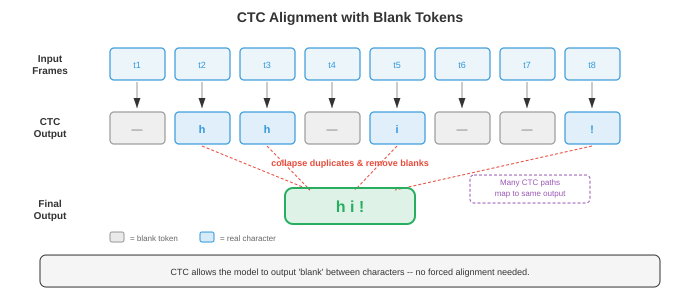

# 自动语音识别

> **一句话总结**：自动语音识别 (ASR) 把口语音频转成文字，本节梳理从经典 GMM-HMM 到 CTC、RNN-T、LAS、Conformer、Whisper、wav2vec 2.0 的完整技术演进。

*自动语音识别把口语音频转成书面文字，在人类语音与机器可读语言之间架起桥梁。 本节涵盖 GMM-HMM、CTC 损失、RNN-Transducer、基于注意力的编码器-解码器模型 (LAS)、Whisper 以及端到端 ASR，从经典流水线一路讲到现代神经架构.*

- **自动语音识别** (Automatic Speech Recognition, ASR) 的任务是把口语音频转成书面文字。 它既是 AI 里最古老的问题之一 (1950 年代最早的系统能识别单个数字)，也是商业化最成功的之一 (语音助手、转写服务、字幕生成).

- 难点在于语音的巨大变异性：说话人不同、口音不同、语速不同、背景噪声不同、麦克风特性不同，加上连续声学信号映射到离散词汇本身就存在根本性的歧义。

- 把 ASR 想象成法庭速记员。 速记员听到连续的声流，在脑子里把它切成一个个词，结合上下文消歧 ("they're" vs "their" vs "there")，再打字输出。 ASR 系统做的是同样的事，只不过分成若干阶段，每个阶段都可以显式表达，单独优化，也可以联合优化。

- **经典 ASR 流水线**把音频处理拆成一串独立阶段：原始音频先转成特征 (梅尔频率倒谱系数 MFCC 或对数梅尔频谱图，见文件 01), **声学模型** (acoustic model) 给每一帧特征与每个音素单元的匹配程度打分，**发音模型** (pronunciation model，也就是词典) 把音素序列映射成词，**语言模型** (language model) 给词序列的合理程度打分，最后 **解码器** (decoder) 搜索出综合得分最高的词序列。 每个组件单独训练、单独调优。


- **音素** (phoneme) 是一种语言里能区分词义的最小声音单位。 英语大约有 39-44 个音素 (具体数字取决于方言和采用的音素表). 例如 "bat" 和 "pat" 只差一个音素 (/b/ vs /p/). 大多数 ASR 系统建模的其实是**上下文相关音素**，叫**三音素** (triphone)：一个音素由它左右两侧的邻居定义 (比如 "b_t" 里的 "a" 与 "c_t" 里的 "a" 被视作不同的单位)，因为一个音素的声学实现会被邻居强烈影响 (这叫**协同发音**, coarticulation).

- 可能的三音素数量非常庞大 (40 个音素立方 = 64,000 个)，所以要用**决策树聚类** (decision tree clustering) 把声学上相似的三音素归成**senone** (通常 2000-10,000 个类别)，每个 senone 有自己的声学模型。 这个聚类本质上是第 06 章介绍过的决策树算法。

- **GMM-HMM** (Gaussian Mixture Model - Hidden Markov Model，高斯混合模型-隐马尔可夫模型) 从 1980 年代一直统治声学建模到 2010 年代初。 HMM (见第 05 章) 建模语音的时序结构：每个音素对应一个从左到右的 HMM，有 3-5 个状态，每个状态代表音素的一段子结构 (起始、中段、收尾). 状态到状态的转移隐式建模了时长。

- 在每个 HMM 状态上，发射概率 (emission probability，即某个特征向量在该状态下出现的可能性) 用**高斯混合模型** (Gaussian Mixture Model, GMM) 建模：多个多元高斯分布的加权和 (见第 05 章):

$$
p(\mathbf{x} | s) = \sum_{m=1}^{M} w_m \cdot \mathcal{N}(\mathbf{x} ; \boldsymbol{\mu}_m, \boldsymbol{\Sigma}_m)
$$

- 其中 $\mathbf{x}$ 是特征向量 (例如 39 维的 MFCC), $s$ 是 HMM 状态，$M$ 是混合成分数 (通常 8-64), $w_m$ 是混合权重，$\boldsymbol{\mu}_m$ 和 $\boldsymbol{\Sigma}_m$ 是每个高斯分量的均值和协方差。 为了算得快，协方差矩阵通常取对角形式 (即假设各特征维度独立，对 MFCC 来说这近似成立，因为离散余弦变换 (Discrete Cosine Transform, DCT) 已经做过去相关).

- 训练用 **Baum-Welch 算法** (EM 算法的特例，见第 05 章)，从带转录的语音数据里迭代估计 GMM 参数和 HMM 转移概率。 解码 (找出最可能的状态序列) 用 **Viterbi 算法** (动态规划，见第 05 章):

$$
\delta_t(j) = \max_{i} \left[ \delta_{t-1}(i) \cdot a_{ij} \right] \cdot b_j(\mathbf{x}_t)
$$

- 其中 $\delta_t(j)$ 是在时刻 $t$ 停在状态 $j$ 的最优路径概率，$a_{ij}$ 是从状态 $i$ 到状态 $j$ 的转移概率，$b_j(\mathbf{x}_t)$ 是特征 $\mathbf{x}_t$ 在状态 $j$ 的发射概率。

- **DNN-HMM** (Hinton et al., 2012) 用深度神经网络 (Deep Neural Network, DNN，见第 06 章) 替换掉了 GMM 发射模型，由 DNN 从一窗特征帧预测 senone 的后验概率 $p(s | \mathbf{x})$. HMM 仍负责时序结构和排列，但神经网络提供的发射得分判别力更强。 这个混合方法相对 GMM-HMM 基线把词错率 (WER) 降低了 20-30% (Hinton et al., 2012). 注意这是**相对 WER 下降**：比如 GMM-HMM 的 WER 是 30%，降 20% 相对 WER 后是 24% (降了 6 个百分点，而非 20 个百分点). 具体幅度因任务和基线质量而异 —— 在 Switchboard 等自然会话语音 (conversational speech) 上靠近 20%，在朗读语音 (read speech) 等受控任务上可达 30% 以上；基线 GMM 系统的调优水平、训练数据量和噪声条件也会影响相对增益。 DNN-HMM 从 2012 到 2016 年一直是主流范式。

- **WFST 解码** (Weighted Finite-State Transducer，加权有限状态转换器) 是传统 ASR 的标准解码框架。 每个组件 (HMM 拓扑 H、上下文依赖 C、词典 L、文法/语言模型 G) 都表示成一个加权有限状态转换器，然后组合成一个统一的搜索图 $H \circ C \circ L \circ G$. Viterbi 搜索在这个组合图上找出总代价最低的路径。 WFST 支持知识源的模块化组合，也支持高效的动态规划搜索。 它背后的数学框架来自有限自动机理论 (与第 05 章的状态机相关).

- **端到端 ASR** (end-to-end ASR) 干脆去掉那些独立组件 (发音模型、音素表、WFST 解码器)，训练一个单一神经网络，直接从音频特征映射到字符或词片 (word piece). 关键难点是**对齐问题** (alignment problem)：输入 (每秒几百帧特征) 和输出 (每秒几个字符) 长度差得非常远，而且训练时它们之间的对齐是未知的。

- **连接主义时序分类** (Connectionist Temporal Classification, CTC) (Graves et al., 2006) 通过引入一个特殊的**空白** (blank) 标记来解决对齐问题：网络可以输出任意的字符与空白序列，只要把连续重复合并、再删掉空白后能得到正确的转录就行。 例如 "cat" 可以由输出序列 "--cc-aa-t--" 产生 (其中 "-" 表示空白).

- 形式上，CTC 定义了一个多对一映射 $\mathcal{B}$，把所有长度为 $T$ 的输出序列 (字母表加空白) 映射到标签序列。 标签序列 $\mathbf{y}$ 的概率就是所有能坍缩到它的对齐路径的概率之和:

$$P(\mathbf{y} | \mathbf{x}) = \sum_{\boldsymbol{\pi} \in \mathcal{B}^{-1}(\mathbf{y})} \prod_{t=1}^{T} p(\pi_t | \mathbf{x})$$



- 直接枚举这些对齐会产生指数级数量，但 **CTC 前向-后向算法** (CTC forward-backward algorithm) 用动态规划把它降到 $O(T \cdot |\mathbf{y}|)$，与第 05 章的 HMM 前向-后向算法类似。

- CTC 做了一个**条件独立性假设**：给定输入，每个时刻的输出与其他所有时刻的输出独立。 这意味着 CTC 无法建模输出之间的依赖 (比如它学不到 "q" 后面几乎总是接 "u"). 要处理这类依赖，得靠外接的语言模型。

- **CTC 解码**的几种做法:
    - **贪心解码** (greedy decoding)：每一步取概率最高的 token，然后再坍缩。 快，但次优。
    - **束搜索** (beam search)：每一步保留前 $k$ 条候选路径，坍缩到相同前缀的候选会合并。 可以引入语言模型得分。
    - **前缀束搜索** (prefix beam search)：一种改进的束搜索，正确处理了 CTC 空白合并，确保候选是在坍缩之后再比较。

- **RNN-Transducer** (RNN-T) (Graves, 2012) 在 CTC 基础上加了一个显式的**预测网络** (prediction network，类似语言模型的 RNN)，让每个输出条件依赖前面的输出，从而去掉了条件独立性假设。 RNN-T 有三个组件:
    - **编码器** (encoder)：处理音频特征，输出隐藏表示 $\mathbf{h}_t^\text{enc}$ (通常是一堆 LSTM 层或 Conformer 层).
    - **预测网络**：自回归 RNN，从之前发射出去的标签生成隐藏表示 $\mathbf{h}_u^\text{pred}$.
    - **联合网络** (joint network)：在每一个 (时刻，标签) 位置把编码器与预测网络的输出组合起来，输出下一个 token 的分布 (含空白):

$$p(y | t, u) = \text{softmax}(W \cdot \text{tanh}(W_\text{enc} \mathbf{h}_t^\text{enc} + W_\text{pred} \mathbf{h}_u^\text{pred} + b))$$

- RNN-T 允许每个时刻发射零个或多个标签 (发射非空白 token 就在同一时刻继续发射；发射空白就前进到下一个时刻但不出输出). 训练在二维 (时间，标签) 网格上做前向-后向算法，复杂度 $O(T \cdot U)$，其中 $U$ 是输出长度。 RNN-T 是端侧流式 ASR 的主流架构 (Google 的 Pixel 手机等产品在用)，因为它天生支持流式：编码器从左到右处理音频，预测网络增量式产出输出。

- **Listen, Attend and Spell** (LAS) (Chan et al., 2016) 是一种基于注意力的编码器-解码器模型 (即第 06 章讲过的序列到序列架构). 它有三部分:
    - **Listener** (编码器)：金字塔式双向 LSTM，处理整个输入序列，每一层通过把相邻两个隐藏状态拼接的方式做 8 倍下采样，输出一段较短的编码器隐藏状态序列。
    - **Attention**：每一步解码时，在所有编码器状态上计算注意力权重，形成上下文向量 (与第 07 章的注意力机制相同).
    - **Speller** (解码器)：自回归 LSTM，依赖上下文向量与已生成字符，一次生成一个字符。

- LAS 效果强，但需要拿到完整音频后才能解码 (因为注意力要看全部编码器状态)，不适合流式场景。 它在处理很长的音频时也会吃亏，因为长序列上的注意力会变得弥散。

- **Conformer** (Gulati et al., 2020) 把卷积捕捉局部模式的能力和自注意力建模全局依赖的能力揉到一起。 每个 Conformer 块是一个三明治结构的四模块设计:
    1. **前馈模块** (feed-forward module，半步)：带残差连接的前馈网络，残差权重取一半。
    2. **多头自注意力模块**：标准 Transformer 自注意力 (见第 07 章)，用相对位置编码。
    3. **卷积模块**：逐点卷积，门控线性单元 (Gated Linear Unit, GLU), 1D 深度可分卷积，批归一化 (Batch Normalization, BN), Swish 激活，再一个逐点卷积。 深度可分卷积负责捕捉局部上下文 (类似特征序列上的 n-gram).
    4. **前馈模块** (半步)：与模块 1 结构相同。

- 输出是：$\mathbf{y} = \text{LayerNorm}(\mathbf{x} + \frac{1}{2}\text{FFN}_1 + \text{MHSA} + \text{Conv} + \frac{1}{2}\text{FFN}_2)$. 这种马卡龙式的结构 (FFN-Attention-Conv-FFN，前后各半个残差) 是靠经验发现比其他排列更好。 Conformer 现在是 CTC 与 RNN-T 系统的默认编码器，效果超过纯 Transformer 和纯 LSTM 编码器。


- **Whisper** (Radford et al., 2023) 是 OpenAI 的大规模基于注意力的 ASR 模型，用标准的编码器-解码器 Transformer 架构 (见第 07 章)，在从互联网爬来的 680,000 小时弱监督数据 (音频配上近似转录) 上训练。 几个关键设计:
    - 输入：80 通道对数梅尔频谱图 (见文件 01), 25 ms 窗、10 ms 步长，做零均值单位方差归一化。
    - 编码器：标准 Transformer 编码器，用正弦位置嵌入和 pre-activation 层归一化。
    - 解码器：Transformer 解码器，用字节级 BPE (Byte-Pair Encoding, BPE) 分词器 (见第 07 章) 自回归生成 token.
    - 多任务：单一模型同时做转写、翻译、语种识别和时间戳预测，用解码器提示里的特殊任务 token 来切换。
    - Whisper 的强泛化 (跨领域、跨口音、跨语言) 主要靠训练数据规模，而不是架构上的新意。

- **wav2vec 2.0** (Baevski et al., 2020) 是一个**自监督** (self-supervised) 的语音表征预训练框架。 核心想法是从大量无标注音频里学到语音表征，再用少量带标注数据微调。 这条路子和 BERT (Bidirectional Encoder Representations from Transformers，见第 07 章) 一脉相承，只不过针对的是连续音频信号。

- wav2vec 2.0 架构分三块:
    - **特征编码器**：多层 1D CNN (Convolutional Neural Network，卷积神经网络)，处理原始波形样本，以 20 ms 帧率输出潜在表征 $\mathbf{z}_t$ (16 kHz 采样下每 320 个样本出一个向量).
    - **量化模块**：用**乘积量化** (product quantisation) 把潜在表征离散化到一个有限码本 —— 把向量拆成若干组，每组独立量化，每组从 $V$ 个码字里挑，共 $G$ 个码本。 这样得到对比学习的目标 $\mathbf{q}_t$.
    - **上下文网络**：一个 Transformer 编码器，输入是 (部分被遮盖的) 潜在表征，输出上下文化表征 $\mathbf{c}_t$.


- 预训练时，随机把一段潜在表征**遮盖** (mask，换成一个可学的掩码嵌入)，模型要从一堆干扰项 (从同一段音频的其他位置采样得到的负样本) 里识别出被遮盖位置真正对应的量化表征。 对比损失如下:

$$\mathcal{L} = -\log \frac{\exp(\text{sim}(\mathbf{c}_t, \mathbf{q}_t) / \kappa)}{\sum_{\tilde{\mathbf{q}} \in Q_t} \exp(\text{sim}(\mathbf{c}_t, \tilde{\mathbf{q}}) / \kappa)}$$

- 其中 $\text{sim}$ 是余弦相似度，$\kappa$ 是温度参数，$Q_t$ 包含正确的量化目标加干扰项。 另外还有一个**多样性损失** (diversity loss) 鼓励码本条目被均匀使用。 这个损失本质上是 InfoNCE 对比损失，与视觉自监督学习里用的对比目标同属一家。

- 预训练之后，在顶部加一个线性投影加 CTC 头，用带标注数据微调。 wav2vec 2.0 只用 10 分钟带标注数据 (加上 53,000 小时无标注音频预训练) 就达到了接近当时最先进水平的效果，证明了自监督学习在低资源语音识别上的威力。

- **HuBERT** (Hsu et al., 2021) 是另一种自监督方案，把对比目标换成了**掩码预测** (masked prediction) 目标 —— 预测被遮盖帧的离散聚类归属。 目标由离线聚类步骤产出 (第一轮对 MFCC 做 k 均值，后续轮次对 HuBERT 特征做 k 均值). HuBERT 相比 wav2vec 2.0 简化了训练流程 (不需要量化模块和对比采样)，效果相当甚至更好。

- **Fast Conformer** (Rekesh et al., 2023, NVIDIA NeMo) 把标准 Conformer 里二次复杂度的自注意力换成了**降采样注意力**：输入序列先通过带步长卷积沿时间轴压缩 (通常压 8 倍)，在压缩后的子空间内计算多头自注意力，再通过上采样恢复原始分辨率。 注意力代价从 $O(T^2)$ 降至 $O((T/8)^2) = O(T^2/64)$ —— 严格来说，大 O 记号下 $O(T^2/64) = O(T^2)$ 仍属二次复杂度，这 64 倍是常数因子加速，而非改变了渐近阶。 但由于降采样后每个注意力头看到的序列长度是原来的 $1/8$，在局部窗口意义上它是**次二次** (sub-quadratic within local window) 的：降采样后的全局注意力实际等价于原始序列上的大步长局部注意力，并非真正的全体素点对交互。 这个让步让模型能在很长的音频 (数分钟) 上训练而不爆显存，同时保留足够的上下文建模能力。 注意上采样步骤 (例如转置卷积或最近邻插值) 本身也有计算开销，但远小于注意力层的节省。 Fast Conformer 是 NVIDIA NeMo 工具包的默认编码器，也是他们生产级模型的骨干。

- **Parakeet** (NVIDIA, 2024) 是一族高精度英语 ASR 模型，骨干是 Fast Conformer 编码器加 CTC 与 RNN-T 解码器，在 64,000 小时英语语音上训练。 Parakeet 模型 (0.6B 与 1.1B 参数) 在发布时于多个标准基准上刷到最低词错率，在多数英语测试集上超过 Whisper large-v3. 关键秘诀是：高效的 Fast Conformer 架构、积极的数据增强 (SpecAugment、速度扰动、噪声混入) 和大规模有监督训练数据 —— 这说明把已知组件精心打磨仍能推动前沿。

- **Canary** (NVIDIA, 2024) 把 NeMo 框架扩展到多语言、多任务 ASR. 它用 Fast Conformer 编码器加一个基于注意力的解码器 (不是 CTC 或 RNN-T)，单一模型同时处理跨语言的转写与翻译 (思路类似 Whisper 的多任务设计，但骨干换成更高效的 Fast Conformer). Canary 支持英语、德语、西班牙语和法语，精度有竞争力。

- **Moonshine** (Useful Sensors, 2024) 是专门为**端上和边缘部署**优化的一族 ASR 模型。 编码器采用混合架构，把最初的 Transformer/Conformer 层换成一个小 CNN 加少量 Transformer 层，从而大幅缩小模型体积 (基础模型不到 30M 参数). Moonshine 面向 CPU 与低功耗设备上的实时流式场景 —— Whisper 在这类场景下太大太慢 —— 用少量精度换取 5-10 倍更低的延迟与内存占用。

- **Distil-Whisper** (Gandhi et al., 2023) 把**知识蒸馏** (knowledge distillation，见第 06 章) 用到 Whisper 上，压出一个更小更快的模型。 学生模型只用 2 层解码器 (Whisper 有 32 层)，编码器保持完整，训练目标是拟合 Whisper 的输出分布。 Distil-Whisper 与老师的词错率相差不到 1%，速度快 6 倍，让全尺寸 Whisper 跑不动的实时应用变得可行。

- **Universal Speech Model** (USM) (Zhang et al., 2023, Google) 把自监督预训练规模拉到跨 300+ 种语言的 1200 万小时无标注音频，之后再有监督微调。 USM 证明了 wav2vec 2.0 / 自监督范式在真正海量数据上仍能扩展，在带标注数据非常有限的低资源语言上也能做出强表现。

- **Massively Multilingual Speech** (MMS) (Pratap et al., 2023, Meta) 把 wav2vec 2.0 预训练扩展到 1100 多种语言，用宗教录音等多语言音频源。 MMS 覆盖的语言远超此前任何 ASR 系统，让许多资源匮乏的语言第一次拥有了语音识别能力。

- 现代 ASR 版图正收敛到几种主流范式：(1) Conformer 家族编码器 + CTC 或 RNN-T 做流式，(2) 编码器-解码器 Transformer 做离线/多任务，(3) 自监督预训练做低资源场景，(4) 规模化 —— 更多数据、更大模型持续提升精度。 具体选哪种取决于部署约束：延迟预算、可用算力、语言数量，以及是流式还是批量。

- **语言模型融合** (language model integration) 通过引入超出声学模型范围的语言学知识来提升 ASR. 基本思路是解码时把声学模型得分 $p(\mathbf{x} | \mathbf{y})$ (音频匹配转录的程度) 与语言模型得分 $p(\mathbf{y})$ (转录作为一句话的合理性) 结合起来。

- **浅融合** (shallow fusion) 在束搜索时把两个得分线性相加:

$$\hat{\mathbf{y}} = \arg\max_\mathbf{y} \left[ \log p_\text{AM}(\mathbf{y} | \mathbf{x}) + \lambda \log p_\text{LM}(\mathbf{y}) \right]$$

- 其中 $\lambda$ 是可调权重，$p_\text{LM}$ 是外接语言模型 (通常是 n-gram 或第 07 章讲的神经 LM). 简单有效，但要求 LM 与 ASR 模型使用相同的 token 词表。

- **深融合** (deep fusion) (Gulcehre et al., 2015) 把语言模型嵌到解码器网络内部：LM 的隐藏状态与解码器隐藏状态拼接，经过一个门控机制后再送到输出投影。 整个系统 (包含预训练好的 LM) 联合微调。 融合更深，但训练更复杂。

- **冷融合** (cold fusion) (Sriram et al., 2018) 与深融合类似，但是从零开始训练带 LM 的 ASR 解码器，而不是微调预训练解码器。 这样迫使声学模型学到与 LM 互补的信息，而不是重复 LM 已经掌握的东西。

- **重打分** (rescoring, N-best rescoring) 是一种两趟法：先用束搜索生成 $N$ 条候选转录，再用一个更强大的语言模型 (比如大型 Transformer LM) 重新排名。 实现简单，也允许使用一趟解码下太慢的超大 LM.

- **内部语言模型估计** (Internal Language Model Estimation, ILME) 用于解决一个微妙问题：端到端模型会从训练转录里隐式学到一个内部 LM，浅融合外接 LM 时可能与之冲突 (相当于把语言学先验计算了两遍). ILME 估计出内部 LM 并在融合时减掉它的得分:

$$\hat{\mathbf{y}} = \arg\max_\mathbf{y} \left[ \log p_\text{E2E}(\mathbf{y} | \mathbf{x}) - \beta \log p_\text{ILM}(\mathbf{y}) + \lambda \log p_\text{LM}(\mathbf{y}) \right]$$

- **流式 vs 离线 ASR** (streaming vs. offline) 是根本性的架构选择。 离线 (或叫批量) ASR 拿到整段音频后再出结果；流式 ASR 边收音频边增量出结果，延迟有界。

- 实时应用离不开流式：实时字幕、语音助手 (用户话没说完就期望回应)、电话通话转写。 挑战在于，未来上下文对识别有帮助 (知道下一个词是 "York" 能帮 "New" 消歧)，但流式系统不能无限等待。

- **单向编码器** (unidirectional encoder，如从左到右的 LSTM、因果卷积、因果 Transformer) 天生支持流式，因为每个输出只依赖当前和过去的输入。 双向编码器 (会看未来上下文) 不能直接支持流式。

- **分块注意力** (chunked attention，也叫 blockwise 或 segmental attention) 把输入切成定长块，自注意力只在块内 (可选加上前几个块) 计算。 这样把延迟限制在块大小加上处理时间，同时块内还保留一些局部双向上下文。 代价是块越小精度越差。

- **前瞻** (lookahead) 允许流式编码器在为当前帧输出之前，先偷看少量未来帧 (例如 300-900 ms). 实现上就是给单向计算加一小段右上下文。 前瞻窗口会加延迟，但显著提升精度。

- 流式 ASR 的**延迟**包含几种成分:
    - **算法延迟** (algorithmic latency)：音频到达后模型能处理所需的时长 (由块大小、前瞻和特征提取决定).
    - **计算延迟** (computational latency)：模型跑一次前向的耗时。
    - **端点检测延迟** (endpointer latency)：检测到用户讲完话所耗的时间。
    - **首字延迟** (first-token latency)：第一个词出现的快慢。 **终稿延迟** (finalization latency)：最终结果被确认的快慢 (流式系统常先给出临时结果，随着音频到来再修正).

- ASR 的**评估指标**:

- **词错率** (Word Error Rate, WER) 是首要指标。 计算方法是把假设 (系统输出) 与参考 (真值转录) 用编辑距离对齐 (把一个变成另一个所需最少的替换、插入、删除次数)，然后:

$$\text{WER} = \frac{S + D + I}{N}$$

- 其中 $S$ 是替换数，$D$ 是删除数，$I$ 是插入数，$N$ 是参考里的词总数。 如果插入很多，WER 可以超过 100%. 5% 的 WER 在干净朗读语音上算达到人类水平；会话或含噪语音要难得多 (10-20% 或更高).

- **字错率** (Character Error Rate, CER) 是同一个公式，只不过在字符层而不是词层。 CER 更适合没有明确词边界的语言 (中文、日文)，也更能反映"差一点点对"的情况 ("cat" vs "bat" 是 100% WER，但只有 33% CER).

- **词信息损失** (Word Information Lost, WIL) 与**词信息保留** (Word Information Preserved, WIP) 是信息论视角的替代指标，相比 WER 更精细地反映参考与假设的相关性，但用得较少。

- **实时率** (Real-Time Factor, RTF) 度量计算效率：处理时间与音频时长之比。 RTF < 1 表示系统比实时快；RTF > 1 说明跟不上实时音频。 流式系统必须 RTF < 1.

- **数据增强** (data augmentation) 对稳健 ASR 至关重要。 常用手法:
    - **速度扰动** (speed perturbation)：以 0.9x 与 1.1x 速率重采样音频 (同时改变音高与时长).
    - **SpecAugment** (Park et al., 2019)：在频谱图上随机遮盖若干频段和时段。 这是 Dropout 在音频领域的对应，是 ASR 最有效的正则化方法之一，且不需要额外数据。
    - **噪声增强**：以不同信噪比把干净语音与录制噪声混合。
    - **房间冲激响应模拟**：把干净语音与模拟房间声学做卷积，模拟混响环境。

- ASR 的**分词** (tokenisation) 决定模型的输出词表。 选项包括:
    - **字符**：简单，词表小 (英语 ~30)，但输出序列长，且不含隐式语言模型。
    - **词片 / BPE** (见第 07 章)：子词单位，平衡词表大小与序列长度。 现代系统的标准做法 (Whisper 用字节级 BPE，约 50,000 个 token).
    - **词**：大词表 (50,000+)，输出序列短，但无法处理集外词。
    - **音素**：语言学动机、紧凑，但需要发音词典。

- ASR 的演进可以概括为：从大量工程化的模块系统 (GMM-HMM + WFST 解码，1990-2010 年代)，到混合系统 (DNN-HMM, 2012-2016)，再到把越来越多流水线组件吞进单个神经网络的端到端系统 (CTC、RNN-T、LAS, 2016-2020)，最后到利用海量无标注或弱标注数据的大规模预训练模型 (wav2vec 2.0、Whisper, 2020 至今). 每一次跃迁都在简化工程的同时提升精度，呼应了机器学习的大趋势 —— 从人工设计表征转向从数据中学习表征 (第 06 章讲的 CNN 取代图像特征、第 07 章讲的 Transformer 取代 NLP 特征都是同一个故事).

## Coding Tasks (use CoLab or notebook)

1. 用 JAX 从零实现 CTC 损失。 造一个玩具例子：一段短序列的 logits 加一个目标标签，用 CTC 前向算法算出总概率，再算负对数似然损失。
```python
import jax
import jax.numpy as jnp
import matplotlib.pyplot as plt

def ctc_forward(log_probs, targets):
    """
    CTC 前向算法 (对数域, 保证数值稳定).
    log_probs: (T, V) 词表上的对数概率 (index 0 = blank)
    targets: (U,) 目标标签下标 (不含 blank)
    Returns: CTC 下目标序列的对数概率.
    """
    T, V = log_probs.shape
    U = len(targets)

    # 构造扩展标签序列, 中间插入 blank: [blank, y1, blank, y2, ..., yU, blank]
    S = 2 * U + 1
    labels = jnp.zeros(S, dtype=jnp.int32)  # all blanks
    for i in range(U):
        labels = labels.at[2 * i + 1].set(targets[i])

    # 初始化 alpha (对数域)
    NEG_INF = -1e30
    alpha = jnp.full((T, S), NEG_INF)
    alpha = alpha.at[0, 0].set(log_probs[0, labels[0]])        # 从 blank 开始
    alpha = alpha.at[0, 1].set(log_probs[0, labels[1]])        # 或从第一个 label 开始

    # 向前填表
    for t in range(1, T):
        for s in range(S):
            # 保持同状态
            a = alpha[t - 1, s]
            # 来自前一个状态
            if s > 0:
                a = jnp.logaddexp(a, alpha[t - 1, s - 1])
            # 跳过 blank (当前与倒数第二个 label 不同时才允许)
            if s > 1 and labels[s] != 0 and labels[s] != labels[s - 2]:
                a = jnp.logaddexp(a, alpha[t - 1, s - 2])
            alpha = alpha.at[t, s].set(a + log_probs[t, labels[s]])

    # 总对数概率: 最后时刻最后两个状态的和
    log_prob = jnp.logaddexp(alpha[T - 1, S - 1], alpha[T - 1, S - 2])
    return log_prob, alpha

# --- 玩具示例 ---
T = 12   # 输入长度 (时间步)
V = 5    # 词表大小 (0=blank, 1='c', 2='a', 3='t', 4='x')
targets = jnp.array([1, 2, 3])  # "c", "a", "t"

# 生成随机 logits 并转成对数概率
key = jax.random.PRNGKey(42)
logits = jax.random.normal(key, (T, V))
log_probs = jax.nn.log_softmax(logits, axis=-1)

log_prob, alpha = ctc_forward(log_probs, targets)
ctc_loss = -log_prob

print(f"Target sequence: {targets.tolist()} ('c', 'a', 't')")
print(f"Input length T={T}, Vocab size V={V}")
print(f"CTC log-probability: {log_prob:.4f}")
print(f"CTC loss (neg log-prob): {ctc_loss:.4f}")

# 可视化前向变量 (alpha) 网格
fig, ax = plt.subplots(figsize=(12, 5))
# 从对数还原到线性以便可视化
alpha_linear = jnp.exp(alpha - jnp.max(alpha))  # 归一化便于观察
im = ax.imshow(alpha_linear.T, aspect='auto', origin='lower', cmap='viridis')
ax.set_xlabel('Time step (t)')
ax.set_ylabel('Extended label index (s)')

label_names = ['_', 'c', '_', 'a', '_', 't', '_']  # _ = blank
ax.set_yticks(range(len(label_names)))
ax.set_yticklabels(label_names)
ax.set_title(f'CTC Forward Variable (alpha lattice) | Loss = {ctc_loss:.2f}')
plt.colorbar(im, ax=ax, label='Normalised probability')
plt.tight_layout(); plt.show()
```

2. 用 JAX 搭一个简单的基于注意力的编码器-解码器 ASR 模型 (最小 LAS 风格架构). 编码器用 1D 卷积，解码器只有一层，用点积注意力。 在合成数据上跑一遍，把注意力权重可视化。
```python
import jax
import jax.numpy as jnp
import matplotlib.pyplot as plt

# --- 最小的基于注意力的编码器-解码器 ASR ---

def init_params(key, input_dim, hidden_dim, vocab_size):
    """初始化一个极简 LAS 风格模型的参数."""
    keys = jax.random.split(key, 8)
    scale = 0.1
    params = {
        # 编码器: 简单线性投影 (模拟卷积输出)
        'enc_w': jax.random.normal(keys[0], (input_dim, hidden_dim)) * scale,
        'enc_b': jnp.zeros(hidden_dim),
        # 注意力: query / key / value 投影
        'attn_q': jax.random.normal(keys[1], (hidden_dim, hidden_dim)) * scale,
        'attn_k': jax.random.normal(keys[2], (hidden_dim, hidden_dim)) * scale,
        'attn_v': jax.random.normal(keys[3], (hidden_dim, hidden_dim)) * scale,
        # 解码器 RNN (为示意用简单 Elman RNN)
        'dec_wh': jax.random.normal(keys[4], (hidden_dim, hidden_dim)) * scale,
        'dec_wx': jax.random.normal(keys[5], (vocab_size, hidden_dim)) * scale,
        'dec_wc': jax.random.normal(keys[6], (hidden_dim, hidden_dim)) * scale,
        'dec_b': jnp.zeros(hidden_dim),
        # 输出投影
        'out_w': jax.random.normal(keys[7], (hidden_dim, vocab_size)) * scale,
        'out_b': jnp.zeros(vocab_size),
    }
    return params

def encode(params, x):
    """编码器: 线性投影 (占位, 实际中可换成 conv/LSTM 堆)."""
    return jnp.tanh(x @ params['enc_w'] + params['enc_b'])

def attend(params, query, enc_out):
    """在编码器输出上做点积注意力."""
    q = query @ params['attn_q']                   # (hidden,)
    k = enc_out @ params['attn_k']                 # (T_enc, hidden)
    v = enc_out @ params['attn_v']                 # (T_enc, hidden)
    d_k = q.shape[-1]
    scores = (k @ q) / jnp.sqrt(d_k)              # (T_enc,)
    weights = jax.nn.softmax(scores)               # (T_enc,)
    context = weights @ v                          # (hidden,)
    return context, weights

def decode_step(params, h_prev, y_prev_onehot, enc_out):
    """单个解码步: RNN + 注意力."""
    # 嵌入上一个 token
    y_emb = y_prev_onehot @ params['dec_wx']       # (hidden,)
    # 对编码器做注意力
    context, attn_w = attend(params, h_prev, enc_out)
    # RNN 更新
    h = jnp.tanh(h_prev @ params['dec_wh'] + y_emb + context @ params['dec_wc']
                  + params['dec_b'])
    # 输出 logits
    logits = h @ params['out_w'] + params['out_b']
    return h, logits, attn_w

# --- 配置 ---
key = jax.random.PRNGKey(0)
input_dim = 40       # 例如 40 个梅尔频带
hidden_dim = 64
vocab_size = 10      # 演示用的小词表
T_enc = 30           # 编码器时间步
T_dec = 8            # 解码器步数

params = init_params(key, input_dim, hidden_dim, vocab_size)

# 合成输入: 类似梅尔特征的随机向量
key, subkey = jax.random.split(key)
x = jax.random.normal(subkey, (T_enc, input_dim))

# 编码
enc_out = encode(params, x)

# 解码 (Teacher forcing, 使用随机目标)
key, subkey = jax.random.split(key)
targets = jax.random.randint(subkey, (T_dec,), 0, vocab_size)

h = jnp.zeros(hidden_dim)
all_logits = []
all_attn = []

for t in range(T_dec):
    y_prev = jax.nn.one_hot(targets[t] if t > 0 else 0, vocab_size)
    h, logits, attn_w = decode_step(params, h, y_prev, enc_out)
    all_logits.append(logits)
    all_attn.append(attn_w)

all_attn = jnp.stack(all_attn)  # (T_dec, T_enc)
all_logits = jnp.stack(all_logits)  # (T_dec, vocab_size)

# --- 可视化注意力权重 ---
fig, axes = plt.subplots(1, 2, figsize=(14, 5))

im = axes[0].imshow(all_attn, aspect='auto', cmap='Blues', origin='lower')
axes[0].set_xlabel('Encoder time step')
axes[0].set_ylabel('Decoder step')
axes[0].set_title('Attention Weights (decoder -> encoder)')
plt.colorbar(im, ax=axes[0])

# 每个解码步的预测 token 分布
im2 = axes[1].imshow(jax.nn.softmax(all_logits, axis=-1), aspect='auto',
                      cmap='Oranges', origin='lower')
axes[1].set_xlabel('Vocabulary index')
axes[1].set_ylabel('Decoder step')
axes[1].set_title('Output Token Probabilities')
plt.colorbar(im2, ax=axes[1])

plt.suptitle('Minimal Attention-based ASR Model (untrained)')
plt.tight_layout(); plt.show()
```

3. 用动态规划 (编辑距离) 从零计算 WER，对多个假设与一个参考做评估。 把编辑距离矩阵可视化。
```python
import jax.numpy as jnp
import matplotlib.pyplot as plt
import numpy as np

def compute_wer(reference, hypothesis):
    """
    用动态规划 (词级 Levenshtein 距离) 计算 WER.
    返回 WER、替换数、删除数、插入数, 以及 DP 矩阵.
    """
    ref_words = reference.split()
    hyp_words = hypothesis.split()
    N = len(ref_words)
    M = len(hyp_words)

    # DP 矩阵: d[i][j] = ref[:i] 与 hyp[:j] 之间的编辑距离
    d = np.zeros((N + 1, M + 1), dtype=np.int32)
    # 回溯矩阵, 统计 S / D / I
    ops = np.zeros((N + 1, M + 1, 3), dtype=np.int32)  # [sub, del, ins]

    for i in range(N + 1):
        d[i][0] = i  # 全删除
    for j in range(M + 1):
        d[0][j] = j  # 全插入

    for i in range(1, N + 1):
        for j in range(1, M + 1):
            if ref_words[i - 1] == hyp_words[j - 1]:
                sub_cost = d[i - 1][j - 1]  # 匹配, 无需修改
            else:
                sub_cost = d[i - 1][j - 1] + 1  # 替换
            del_cost = d[i - 1][j] + 1      # 删除
            ins_cost = d[i][j - 1] + 1      # 插入

            d[i][j] = min(sub_cost, del_cost, ins_cost)

    # 回溯统计操作数
    i, j = N, M
    S, D, I = 0, 0, 0
    while i > 0 or j > 0:
        if i > 0 and j > 0 and d[i][j] == d[i-1][j-1] and ref_words[i-1] == hyp_words[j-1]:
            i -= 1; j -= 1  # 正确
        elif i > 0 and j > 0 and d[i][j] == d[i-1][j-1] + 1:
            S += 1; i -= 1; j -= 1  # 替换
        elif i > 0 and d[i][j] == d[i-1][j] + 1:
            D += 1; i -= 1  # 删除
        elif j > 0 and d[i][j] == d[i][j-1] + 1:
            I += 1; j -= 1  # 插入
        else:
            break

    wer = (S + D + I) / N if N > 0 else 0.0
    return wer, S, D, I, d

# --- 测试用例 ---
reference = "the cat sat on the mat"
hypotheses = [
    "the cat sat on the mat",          # 完全正确
    "the cat sit on the mat",          # 1 次替换
    "the cat on the mat",              # 1 次删除
    "the big cat sat on the mat",      # 1 次插入
    "a dog sat in a rug",              # 多处错误
]

print(f"Reference: '{reference}'\n")
print(f"{'Hypothesis':<40s} {'WER':>6s} {'S':>3s} {'D':>3s} {'I':>3s}")
print("-" * 60)
results = []
for hyp in hypotheses:
    wer, S, D, I, dp = compute_wer(reference, hyp)
    results.append((hyp, wer, S, D, I, dp))
    print(f"'{hyp}':<40s} {wer:>6.1%} {S:>3d} {D:>3d} {I:>3d}")

# 可视化最坏情况的 DP 矩阵
worst = results[-1]
hyp_words = worst[0].split()
ref_words = reference.split()
dp_matrix = worst[5]

fig, axes = plt.subplots(1, 2, figsize=(14, 5))

# DP 矩阵
im = axes[0].imshow(dp_matrix, cmap='YlOrRd', origin='upper')
axes[0].set_xticks(range(len(hyp_words) + 1))
axes[0].set_xticklabels([''] + hyp_words, rotation=45, ha='right', fontsize=9)
axes[0].set_yticks(range(len(ref_words) + 1))
axes[0].set_yticklabels([''] + ref_words, fontsize=9)
axes[0].set_xlabel('Hypothesis words')
axes[0].set_ylabel('Reference words')
axes[0].set_title(f'Edit Distance Matrix\nWER = {worst[1]:.1%}')
for i in range(dp_matrix.shape[0]):
    for j in range(dp_matrix.shape[1]):
        axes[0].text(j, i, str(dp_matrix[i, j]), ha='center', va='center', fontsize=8)
plt.colorbar(im, ax=axes[0])

# WER 对比柱状图
names = [f'Hyp {i+1}' for i in range(len(results))]
wers = [r[1] * 100 for r in results]
colors = ['#27ae60' if w == 0 else '#f39c12' if w < 30 else '#e74c3c' for w in wers]
axes[1].barh(names, wers, color=colors)
axes[1].set_xlabel('WER (%)')
axes[1].set_title('Word Error Rate Comparison')
for i, (w, r) in enumerate(zip(wers, results)):
    axes[1].text(w + 1, i, f'{w:.0f}% (S={r[2]}, D={r[3]}, I={r[4]})',
                 va='center', fontsize=9)
axes[1].set_xlim(0, max(wers) * 1.4)

plt.tight_layout(); plt.show()
```

4. 在一张对数梅尔频谱图上实现 SpecAugment (频率掩码 + 时间掩码)，把原图与增强后对比可视化。 频谱图由合成信号生成。
```python
import jax
import jax.numpy as jnp
import matplotlib.pyplot as plt

# --- 生成合成对数梅尔频谱图 ---
key = jax.random.PRNGKey(42)
fs = 16000
duration = 2.0
t = jnp.arange(0, duration, 1.0 / fs)

# 模拟语音: 带谐波的 chirp 信号
f0 = 120.0
x = sum(jnp.sin(2 * jnp.pi * f0 * k * t * (1 + 0.1 * t)) / k for k in range(1, 10))
key, subkey = jax.random.split(key)
x = x + 0.05 * jax.random.normal(subkey, t.shape)

# 计算对数梅尔频谱图 (简化版)
frame_len = 400  # 25 ms
hop_len = 160    # 10 ms
n_fft = 512
n_mels = 80

n_frames = (len(x) - frame_len) // hop_len + 1
hamming = 0.54 - 0.46 * jnp.cos(2 * jnp.pi * jnp.arange(frame_len) / (frame_len - 1))

frames = jnp.stack([x[i * hop_len : i * hop_len + frame_len] for i in range(n_frames)])
windowed = frames * hamming
spectra = jnp.abs(jnp.fft.rfft(windowed, n=n_fft)) ** 2

# 简易梅尔滤波器组
def hz_to_mel(f): return 2595 * jnp.log10(1 + f / 700)
def mel_to_hz(m): return 700 * (10 ** (m / 2595) - 1)

mel_points = jnp.linspace(hz_to_mel(0), hz_to_mel(fs / 2), n_mels + 2)
hz_pts = mel_to_hz(mel_points)
bins = jnp.floor((n_fft + 1) * hz_pts / fs).astype(jnp.int32)

n_freqs = n_fft // 2 + 1
fb = jnp.zeros((n_mels, n_freqs))
for m in range(n_mels):
    lo, mid, hi = int(bins[m]), int(bins[m+1]), int(bins[m+2])
    for k in range(lo, mid):
        if mid != lo:
            fb = fb.at[m, k].set((k - lo) / (mid - lo))
    for k in range(mid, hi):
        if hi != mid:
            fb = fb.at[m, k].set((hi - k) / (hi - mid))

log_mel = jnp.log(spectra @ fb.T + 1e-10)

# --- SpecAugment ---
def spec_augment(spec, key, n_freq_masks=2, freq_mask_width=15,
                 n_time_masks=2, time_mask_width=25):
    """应用 SpecAugment: 频率掩码 + 时间掩码."""
    augmented = spec.copy()
    T, F = spec.shape

    # 频率掩码
    for _ in range(n_freq_masks):
        key, k1, k2 = jax.random.split(key, 3)
        f_width = jax.random.randint(k1, (), 1, freq_mask_width + 1)
        f_start = jax.random.randint(k2, (), 0, max(1, F - freq_mask_width))
        mask = (jnp.arange(F) >= f_start) & (jnp.arange(F) < f_start + f_width)
        augmented = jnp.where(mask[None, :], 0.0, augmented)

    # 时间掩码
    for _ in range(n_time_masks):
        key, k1, k2 = jax.random.split(key, 3)
        t_width = jax.random.randint(k1, (), 1, time_mask_width + 1)
        t_start = jax.random.randint(k2, (), 0, max(1, T - time_mask_width))
        mask = (jnp.arange(T) >= t_start) & (jnp.arange(T) < t_start + t_width)
        augmented = jnp.where(mask[:, None], 0.0, augmented)

    return augmented

key, subkey = jax.random.split(key)
log_mel_aug = spec_augment(log_mel, subkey)

# --- 可视化 ---
fig, axes = plt.subplots(2, 1, figsize=(14, 8))

im0 = axes[0].imshow(log_mel.T, aspect='auto', origin='lower', cmap='inferno',
                       extent=[0, duration, 0, n_mels])
axes[0].set_title('Original Log-Mel Spectrogram')
axes[0].set_xlabel('Time (s)'); axes[0].set_ylabel('Mel Band')
plt.colorbar(im0, ax=axes[0], label='Log Energy')

im1 = axes[1].imshow(log_mel_aug.T, aspect='auto', origin='lower', cmap='inferno',
                       extent=[0, duration, 0, n_mels])
axes[1].set_title('After SpecAugment (frequency + time masking)')
axes[1].set_xlabel('Time (s)'); axes[1].set_ylabel('Mel Band')
plt.colorbar(im1, ax=axes[1], label='Log Energy')

plt.tight_layout(); plt.show()
```

---

## 📌 本节要点

- **ASR 目标**：把口语音频转成文字，核心难点是说话人、口音、噪声等变异性与连续-离散映射的对齐。
- **经典流水线**：特征提取 → 声学模型 → 词典 → 语言模型 → 解码器，各组件分开训练调优。
- **GMM-HMM 与 DNN-HMM**: HMM 建模时序，GMM 或 DNN 建模发射；DNN-HMM 相对 GMM 词错率降 20-30%.
- **CTC**：通过引入 blank 与多对一坍缩解决对齐问题，前向-后向算法在 $O(T \cdot |\mathbf{y}|)$ 内计算概率，但假设输出条件独立。
- **RNN-T**：编码器 + 预测网络 + 联合网络，去掉 CTC 的条件独立假设，是端侧流式 ASR 的主流架构。
- **LAS**：基于注意力的编码器-解码器 (Listener-Attention-Speller)，精度高但不支持流式。
- **Conformer**：卷积捕捉局部 + 自注意力捕捉全局，是现代 ASR 的默认编码器。
- **Whisper 与 wav2vec 2.0**：前者靠 68 万小时弱监督数据做多任务转写，后者靠自监督预训练 + 少量微调。
- **流式关键机制**：单向编码器、分块注意力、前瞻窗口，在延迟与精度间做权衡。
- **评估指标**: WER 是首要指标，中日文用 CER, RTF 度量实时性；SpecAugment 是最有效的数据增强手段之一。