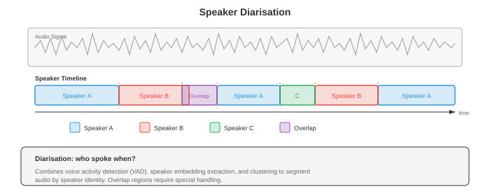

# 说话人与音频分析

> **一句话总结**: 本节讲怎么识别"谁在说、什么时候说、还有什么声音", 覆盖说话人验证/识别、i-vector/d-vector/x-vector、说话人分离、音频事件分类、音乐信息检索与语音情感识别.

*说话人与音频分析要回答: 谁在说话、什么时候说、以及录音里还有什么非语音的声音。本文覆盖说话人验证与识别、i-vector、d-vector、x-vector、说话人分离 (speaker diarisation)、音频事件分类、音乐信息检索 (Music Information Retrieval, MIR), 以及从语音中做情感识别.*

- 在文件 01 里我们打好了信号处理的地基: 频谱图、梅尔频率倒谱系数 (MFCC)、梅尔滤波器组。在文件 02 里我们识别了"说了什么"。现在换个问题: 是谁说的? 什么时候说的? 音频里还发生了什么? 说话人识别、说话人分离、音频分类、音乐分析这几件事其实都有一根共同的主线 — 学一个紧凑的嵌入 (embedding), 让它抓住手头任务真正关心的不变性, 这跟第 06 章讲的嵌入思想一脉相承。

- 想象一下, 识别说话人有点像在电话里认出朋友的声音。你根本不需要听懂他说了什么; 音色、节奏、嗓音质感里的某些东西, 就是他独一无二的印记。说话人识别系统学的就是从原始音频里提取出这份"声纹" — 不管说了什么内容, 只关心怎么说。

- **说话人识别 (speaker recognition)** 是两个相关任务的统称:
    - **说话人验证 (Speaker Verification, SV)**: 给一个声称的身份和一段音频, 判断说话人是不是他自称的那个人。这是一个二元决策 (接受 / 拒绝), 也是语音身份认证背后的技术 ("Hey Siri, 这是我的声音吗?")。
    - **说话人识别 (Speaker Identification, SI)**: 给一段音频和一组已知说话人库, 判断这段音频出自其中哪个人。这是一个多分类问题.


- 这两项任务底层共用同一种表示: 一个固定维度的**说话人嵌入 (speaker embedding)**, 它无论说话人说了什么都能刻画其身份特征。区别只在决策阶段: 验证比较两个嵌入, 识别在候选人集合里找最近的那个.

- **余弦相似度 (cosine similarity)** 是比较说话人嵌入的标准指标。给定注册嵌入 $e$ 与测试嵌入 $t$:

$$s = \frac{e \cdot t}{\|e\| \, \|t\|}$$

- 阈值 $\theta$ 决定接受 / 拒绝: 若 $s > \theta$, 接受。这个阈值在**误接受率 (False Acceptance Rate, FAR)** 与**误拒率 (False Rejection Rate, FRR)** 之间权衡。**等错误率 (Equal Error Rate, EER)** — 即 FAR = FRR 的那个点 — 是标准评估指标。EER 越低, 系统越好。当前主流系统在标准基准 (VoxCeleb) 上的 EER 已经低于 1%.

- **i-vector** (Dehak 等, 2010) 在深度学习出现之前是最主流的说话人嵌入。它的思想来自因子分析 (第 02 章的矩阵分解与第 04 章的降维)。**通用背景模型 (Universal Background Model, UBM)** — 一个在多样说话人数据上训练的大型高斯混合模型 (GMM) — 定义了一个超向量空间。每段语音的 GMM 超向量被投影到一个低维的**总变化空间 (total variability space)** 里:

$$M = m + Tw$$

- 其中 $M$ 是该段语音的 GMM 超向量, $m$ 是 UBM 的均值超向量, $T$ 是总变化矩阵 (从数据里学出来), $w$ 就是 i-vector — 一个低维 (通常 400-600 维) 表示, 同时包含说话人差异与信道差异.

- 为了把信道差异从 i-vector 里剔除, **概率线性判别分析 (Probabilistic Linear Discriminant Analysis, PLDA)** 把 i-vector 建模成说话人相关潜变量与信道相关潜变量之和。PLDA 为验证任务提供了一个原则化的对数似然比打分:

$$\text{score}(w_1, w_2) = \log \frac{P(w_1, w_2 \mid \text{same speaker})}{P(w_1 \mid \text{speaker}_1) \, P(w_2 \mid \text{speaker}_2)}$$

- **d-vector** (Variani 等, 2014) 是第一代神经网络说话人嵌入。一个用于说话人分类的深度神经网络 (Deep Neural Network, DNN) 以帧级特征为输入; 对一整段语音, 把最后隐藏层的激活在所有帧上取平均, 就得到固定维度的表示。方法很朴素, 但足够有效 — d-vector 证明了神经网络能学到区分说话人的特征, 不再需要 i-vector 那套复杂的统计机器.

- **x-vector** (Snyder 等, 2018) 显著推动了神经说话人嵌入的发展, 用的是**时延神经网络 (Time Delay Neural Network, TDNN)** 架构。TDNN 本质是每层带特定上下文窗口的一维卷积, 跟文件 03 里 WaveNet 的膨胀卷积同属一脉, 只不过 x-vector 作用在帧级特征上, 而不是原始波形样本上.


- x-vector 架构分三段:
    - **帧级层 (Frame-level layers)**: 一叠 TDNN 层处理 MFCC (来自文件 01), 每层的时间上下文窗口逐层放宽。比如第一层可能看 $\{t-2, t-1, t, t+1, t+2\}$, 后续层更宽.
    - **统计池化 (Statistics pooling)**: 帧级层之后, 对整段语音在时间维上算帧级输出的均值与标准差, 得到一个跟语音长度无关的定长向量:

```math
\begin{aligned}
\mu &= \frac{1}{T} \sum_{t=1}^{T} h_t \\
\sigma &= \sqrt{\frac{1}{T} \sum_{t=1}^{T} (h_t - \mu)^2}
\end{aligned}
```

-     其中 $h_t$ 是第 $t$ 帧的帧级输出。拼接 $[\mu; \sigma]$ 就是池化后的表示.
    - **段级层 (Segment-level layers)**: 全连接层处理池化后的向量。第一段级层 (Softmax 之前) 的输出就是 x-vector 嵌入.

- x-vector 用标准的交叉熵损失在说话人身份上训练。虽然目标是分类, 但学到的中间表示 (x-vector) 对未见过的说话人也泛化良好 — 因为网络学的是"提取区分说话人的特征", 而不是"死记具体说话人".

- **ECAPA-TDNN** (Desplanques 等, 2020) 是目前基于 TDNN 的说话人识别 SOTA 架构。它在 x-vector 之上做了三处改进:
    - **压缩-激励 (Squeeze-Excitation, SE) 块**: 来自第 08 章 SENet 的通道注意力, 用全局上下文重新加权特征通道, 让模型强化与说话人相关的通道.
    - **Res2Net 风格的多尺度特征**: 在每个 TDNN 块内部, 把通道分成几组并按层级依次处理, 从而在多个时间分辨率上生成特征 (类比第 08 章的多尺度特征提取).
    - **注意力统计池化 (Attentive statistics pooling)**: 不再等权重平均, 而是用一个注意力机制给每一帧的贡献加权。带更多说话人区分信息的帧 (比如元音, 携带更多说话人信息) 获得更高的注意力权重:

$$\alpha_t = \frac{\exp(v^T f(h_t))}{\sum_{\tau} \exp(v^T f(h_\tau))}$$

- 其中 $f$ 是一个小神经网络, $v$ 是可学习的注意力向量。加权后的均值与标准差为 $\tilde{\mu} = \sum_t \alpha_t h_t$ 与 $\tilde{\sigma} = \sqrt{\sum_t \alpha_t (h_t - \tilde{\mu})^2}$.

- ECAPA-TDNN 通常用 **AAM-Softmax (Additive Angular Margin Softmax, 加性角度间隔 Softmax)** 来训练。它在分类损失中加入一个角度间隔惩罚, 迫使同一说话人的嵌入在超球面上更靠拢, 不同说话人的嵌入被推得更远:

$$L = -\log \frac{e^{s \cos(\theta_{y_i} + m)}}{e^{s \cos(\theta_{y_i} + m)} + \sum_{j \neq y_i} e^{s \cos \theta_j}}$$

- 其中 $\theta_{y_i}$ 是嵌入与真实类别权重向量的夹角, $m$ 是间隔 (通常 0.2), $s$ 是缩放因子 (通常 30)。这个损失来自人脸识别 (第 08 章的 ArcFace), 用在说话人验证上效果非常好.

- **说话人分离 (speaker diarisation)** 回答的是"谁在什么时候说话"这个问题, 针对多说话人录音。把它想成给时间线上色: 每种颜色代表一位说话人, 系统要判断每位说话人在哪些时刻活跃, 也包括重叠说话的段落.



- **基于聚类的分离 (Clustering-based diarisation)** 是传统的流水线方案:
    - **切分 (Segmentation)**: 用滑窗或说话人变化检测把音频切成短段 (通常 1-2 秒).
    - **嵌入提取 (Embedding extraction)**: 对每段提取说话人嵌入 (x-vector、ECAPA-TDNN).
    - **聚类 (Clustering)**: 按说话人分组。标准做法是**凝聚层次聚类 (Agglomerative Hierarchical Clustering, AHC)**: 一开始每段自成一类, 反复把最相似的两类合并, 直到满足停止条件 (基于距离阈值或目标说话人数).
    - **重切分 (Re-segmentation)**: 用基于 Viterbi 的重对齐来细化边界.

- 说话人数量通常事先不知道, 这让问题比一般聚类更棘手。另一种常见方法是谱聚类, 用基于特征值的阈值来确定 $k$.

- **端到端神经分离 (End-to-End Neural Diarisation, EEND)** (Fujita 等, 2019) 把分离建模成一个多标签分类问题。一个神经网络 (通常是基于自注意力的模型, 即第 07 章的 Transformer) 接收整段录音作为输入, 对每一帧每位说话人输出一个二值活动标签。这种方式能直接处理重叠说话 — 而重叠是基于聚类方法的一大软肋.

- 对 $S$ 位说话人, EEND 在第 $t$ 帧的输出为:

$$\hat{y}_{t,s} = \sigma(f_s(h_t))$$

- 其中 $h_t$ 是 Transformer 在第 $t$ 帧的输出, $f_s$ 是针对说话人 $s$ 的线性投影。训练损失是把所有说话人与所有帧上的二元交叉熵加起来。这里一个关键难点是: 说话人数量必须固定, 否则要用可变输出架构 (EEND-EDA 用一种带吸引子的编码器-解码器结构来处理).

- **排列不变训练 (Permutation Invariant Training, PIT)** 用来在分离任务里处理标签歧义: 说话人本身没有天然顺序, 所以要对所有可能的"说话人-输出"分配都算一遍损失, 取最小值 (这跟文件 05 里源分离用的 PIT 是同一件事).

- **音频分类 (Audio classification)** 给一整段音频打一个标签。它跟自动语音识别 (Automatic Speech Recognition, ASR, 文件 02) 不一样 — ASR 是把语音转成文字, 音频分类涵盖的范围更广: 环境声 (警报、下雨、狗叫)、音乐流派 (摇滚、爵士、古典)、以及一般的音频事件.

- 标准做法沿用第 08 章图像分类的套路: 把音频转成频谱图 (一张 2D 时频"图像"), 再套一个 CNN 或 Transformer 分类器。这种"频谱当图像"的做法直接吃到了计算机视觉几十年的技术红利.

- **环境声分类 (Environmental Sound Classification, ESC)** 常用的数据集有 ESC-50 (50 类, 2000 段) 和 UrbanSound8K。典型架构就是把 CNN (第 06 章) 用在对数梅尔频谱图上。数据增强非常关键: 时间拉伸、音高偏移、加背景噪声, 还有 **SpecAugment** (文件 02 里的掩码方法, 用到频谱图上), 都能显著提升泛化.

- **音频事件检测 (Sound Event Detection, SED)** 是分类的时间版: 不仅要知道音频里有什么事件, 还要知道它们从什么时候开始、什么时候结束。**AudioSet** (Gemmeke 等, 2017) 是大规模基准, 有 527 个事件类别、200 万段 10 秒的 YouTube 片段, 每段只有弱标注 (段级标签, 而非帧级标签).

- **弱监督 SED** 要从段级标签学出帧级预测。标准做法用一个 CNN 输出帧级类别概率, 再通过注意力池化聚合成段级预测:

$$\hat{Y}_c = \sigma\left(\sum_t \alpha_{t,c} \cdot f_{t,c}\right)$$

- 其中 $f_{t,c}$ 是第 $t$ 帧类别 $c$ 的帧级 logit, $\alpha_{t,c}$ 是注意力权重。段级预测 $\hat{Y}_c$ 与段级标签对齐做训练.

- **声学场景分类 (Acoustic Scene Classification, ASC)** 判定整段音频的整体环境: "机场"、"公园"、"地铁站"、"办公室"。这是一个整体性任务: 模型要抓住的是整体的声学纹理, 而不是某个具体事件。DCASE 挑战赛每年评测 ASC, 获胜系统通常用多分辨率频谱图上 CNN 的集成.

- **音频嵌入 (Audio embeddings)** 是在大规模音频数据上学到的通用表示, 类似于词嵌入 (第 07 章) 或图像特征 (第 08 章), 可以迁移到下游任务.

- **VGGish** (Hershey 等, 2017) 把 VGG 图像分类网络 (第 08 章) 迁移到音频上。它把 0.96 秒的对数梅尔频谱图切片喂进一个类 VGG 的 CNN (在 AudioSet 上预训练), 每片输出一个 128 维的嵌入。VGGish 嵌入充当通用音频特征, 就跟 ImageNet 预训练 CNN 提供通用视觉特征是一回事.

- **PANNs (Pre-trained Audio Neural Networks, 预训练音频神经网络)** (Kong 等, 2020) 是一族 CNN 架构 (CNN6、CNN10、CNN14), 在完整 AudioSet 上做音频标注训练。用得最多的 CNN14 是一个 14 层 CNN, 用 $3 \times 3$ 卷积作用于对数梅尔频谱图。PANNs 输出 2048 维嵌入, 在多种音频任务上都能拿到 SOTA 迁移效果.

- **音频频谱图 Transformer (Audio Spectrogram Transformer, AST)** (Gong 等, 2021) 把视觉 Transformer (ViT, 第 08 章) 直接搬到音频频谱图上。频谱图被切成 $16 \times 16$ 的图块 (patch, 跟 ViT 切图片一样), 每块经线性投影得到 token 嵌入, 再加上位置嵌入, 然后送入一个标准 Transformer 编码器 (第 07 章)。用一个 [CLS] token 的输出做分类.


- AST 能从 **ImageNet 预训练**中受益: 既然频谱图是 2D 图像, 那就先拿一个在 ImageNet 图片上预训练好的 ViT, 再拿它在音频上微调。这种跨模态迁移出乎意料地有效, 因为两种数据在低层特征上是共通的 (边缘、纹理), 而位置嵌入可以通过插值适配不同的频谱图尺寸.

- **HTS-AT** (Chen 等, 2022) 在 AST 之上改进, 用了层级式的 Swin Transformer 架构 (第 08 章的移位窗口注意力), 通过多尺度特征提取降低计算开销同时提升性能.

- **BEATs** (Chen 等, 2023) 采用面向音频专门设计的预训练策略: 用一个离散 tokenizer 做迭代式掩码预测 (思路类似文件 02 里的 wav2vec 2.0, 但用在通用音频上)。这个 tokenizer 会被逐步精修, 从而生成语义越来越有意义的离散音频 token.

- **带嵌入的说话人分离**把说话人嵌入与时间建模结合起来。像 Pyannote.audio 这样的现代系统采用三段式流水线: (1) 一个神经切分模型, 检测说话人切换与重叠说话; (2) 对每一段应用嵌入提取 (ECAPA-TDNN); (3) 用聚类在整段录音上分配说话人身份.

- **音乐信息检索 (Music Information Retrieval, MIR)** 把音频分析用在音乐上。文件 01 里的谱表示在这里尤其好用, 因为音乐有丰富的谐波结构.

- **节拍跟踪 (Beat tracking)** 检测音乐的节奏脉动。标准做法先从频谱图算出**起始强度包络 (onset strength envelope)** (检测能量陡升, 用来标记音符起始), 再用自相关或 tempogram 估计速度 (tempo), 最后用动态规划 (Dynamic Programming, DP) 追踪每一个节拍位置 — 找出一串节拍时刻, 既最匹配起始包络, 又能保持速度稳定.

- **和弦识别 (Chord recognition)** 识别一段音乐随时间的和声内容。输入通常是一张**色度图 (chromagram)** (也叫音级轮廓, pitch class profile): 一个 12 维表示, 把所有八度折叠成一个八度, 显示 12 个音级 (C、C#、D、…、B) 各自的能量。再用 CNN 或循环神经网络 (Recurrent Neural Network, RNN) (第 06 章) 把每一帧分到标准和弦标签 (C 大调、A 小调、G7 等等).

- 色度图由短时傅里叶变换 (STFT) (文件 01) 计算得到, 把每个频率 bin 映射到它对应的音级:

$$\text{chroma}(p) = \sum_{k : \text{pitch}(k) \bmod 12 = p} |X(k)|^2$$

- 其中 $p \in \{0, 1, \ldots, 11\}$ 是音级, $\text{pitch}(k)$ 把频率 bin $k$ 映射到其 MIDI 音符号.

- **源分离基础** (细节见文件 05) 把一段音乐分离成各个乐器 (人声、鼓、贝斯、其他)。这是 MIR 里很多应用 (重混、卡拉 OK、乐谱转录) 的核心能力。像 Demucs (文件 05) 这样的模型在标准基准 MUSDB18 上已经能拿到相当不错的分离效果.

- **音乐标注 (Music tagging)** 给歌曲打标签 (流派、情绪、乐器、年代)。本质就是应用在音乐上的音频分类, 沿用同一套"频谱图 + CNN"套路。常用基准有 Million Song Dataset 与 MagnaTagATune.

- **音频指纹 (Audio fingerprinting)** 从一小段片段中识别出对应的具体录音, 即便存在噪声、混响、压缩失真也不受影响。经典系统是 Shazam, 它把频谱图上的显著峰值 (constellation points) 做哈希。神经方法学到一种鲁棒嵌入 — 对各种声学退化不敏感, 又能在不同录音之间保持区分度 — 这跟第 06 章、第 08 章里学习不变特征的思路是相通的.

## Coding Tasks (use CoLab or notebook)

- **Task 1: Speaker embedding extraction with statistics pooling.** Build a simple x-vector-style model that processes frame-level features through TDNN layers and statistics pooling to produce speaker embeddings.

```python
import jax
import jax.numpy as jnp
import jax.random as jr
import matplotlib.pyplot as plt

# 为多个说话人模拟帧级 MFCC 特征
def generate_speaker_data(key, n_speakers=5, utterances_per_speaker=20,
                          n_frames=100, n_features=40):
    """Generate synthetic speaker data with speaker-dependent patterns."""
    keys = jr.split(key, 3)
    all_features = []
    all_labels = []

    # 每位说话人有各自的特征谱模式
    speaker_patterns = jr.normal(keys[0], (n_speakers, n_features)) * 0.5

    for spk in range(n_speakers):
        for utt in range(utterances_per_speaker):
            k = jr.fold_in(keys[1], spk * utterances_per_speaker + utt)
            noise = jr.normal(k, (n_frames, n_features)) * 0.3
            features = speaker_patterns[spk][None, :] + noise
            all_features.append(features)
            all_labels.append(spk)

    perm = jr.permutation(keys[2], len(all_features))
    features = jnp.stack(all_features)[perm]
    labels = jnp.array(all_labels)[perm]
    return features, labels

key = jr.PRNGKey(42)
features, labels = generate_speaker_data(key)
n_speakers = 5
n_features = 40

# x-vector 风格模型
def init_xvector(key, n_features=40, hidden=128, embed_dim=64, n_speakers=5):
    keys = jr.split(key, 8)
    params = {
        # TDNN 层 1: 上下文窗口 [-2, 2]
        'tdnn1_w': jr.normal(keys[0], (5, n_features, hidden)) * jnp.sqrt(2.0 / (5 * n_features)),
        'tdnn1_b': jnp.zeros(hidden),
        # TDNN 层 2: 上下文窗口 [-2, 2]
        'tdnn2_w': jr.normal(keys[1], (5, hidden, hidden)) * jnp.sqrt(2.0 / (5 * hidden)),
        'tdnn2_b': jnp.zeros(hidden),
        # TDNN 层 3: 上下文窗口 [-3, 3]
        'tdnn3_w': jr.normal(keys[2], (7, hidden, hidden)) * jnp.sqrt(2.0 / (7 * hidden)),
        'tdnn3_b': jnp.zeros(hidden),
        # 段级层 (池化之后: 2*hidden -> embed_dim)
        'seg1_w': jr.normal(keys[3], (2 * hidden, embed_dim)) * jnp.sqrt(2.0 / (2 * hidden)),
        'seg1_b': jnp.zeros(embed_dim),
        # 分类头
        'cls_w': jr.normal(keys[4], (embed_dim, n_speakers)) * jnp.sqrt(2.0 / embed_dim),
        'cls_b': jnp.zeros(n_speakers),
    }
    return params

def xvector_forward(params, x, return_embedding=False):
    """x: (batch, frames, features) -> logits or embeddings."""
    # TDNN 层 (一维卷积)
    h = jax.lax.conv_general_dilated(
        x.transpose(0, 2, 1), params['tdnn1_w'].transpose(2, 1, 0),
        window_strides=(1,), padding='SAME'
    ).transpose(0, 2, 1) + params['tdnn1_b']
    h = jax.nn.relu(h)

    h = jax.lax.conv_general_dilated(
        h.transpose(0, 2, 1), params['tdnn2_w'].transpose(2, 1, 0),
        window_strides=(1,), padding='SAME'
    ).transpose(0, 2, 1) + params['tdnn2_b']
    h = jax.nn.relu(h)

    h = jax.lax.conv_general_dilated(
        h.transpose(0, 2, 1), params['tdnn3_w'].transpose(2, 1, 0),
        window_strides=(1,), padding='SAME'
    ).transpose(0, 2, 1) + params['tdnn3_b']
    h = jax.nn.relu(h)

    # 统计池化: 在时间维上算均值与标准差
    mu = jnp.mean(h, axis=1)
    sigma = jnp.std(h, axis=1)
    pooled = jnp.concatenate([mu, sigma], axis=-1)

    # 段级层 -> 嵌入
    embedding = jax.nn.relu(pooled @ params['seg1_w'] + params['seg1_b'])

    if return_embedding:
        return embedding

    # 分类
    logits = embedding @ params['cls_w'] + params['cls_b']
    return logits

def cross_entropy_loss(params, features, labels):
    logits = xvector_forward(params, features)
    one_hot = jax.nn.one_hot(labels, n_speakers)
    log_probs = jax.nn.log_softmax(logits)
    return -jnp.mean(jnp.sum(one_hot * log_probs, axis=-1))

grad_fn = jax.jit(jax.value_and_grad(cross_entropy_loss))

# 训练
params = init_xvector(jr.PRNGKey(0))
lr = 1e-3
losses = []

for epoch in range(300):
    loss_val, grads = grad_fn(params, features, labels)
    params = jax.tree.map(lambda p, g: p - lr * g, params, grads)
    losses.append(float(loss_val))

# 提取嵌入并用类似 t-SNE 的二维投影 (这里用 PCA) 可视化
embeddings = xvector_forward(params, features, return_embedding=True)

# 简单 PCA 到二维
emb_centered = embeddings - jnp.mean(embeddings, axis=0)
_, _, Vt = jnp.linalg.svd(emb_centered, full_matrices=False)
proj_2d = emb_centered @ Vt[:2].T

fig, axes = plt.subplots(1, 2, figsize=(14, 5))

axes[0].plot(losses, color='#3498db', linewidth=1.5)
axes[0].set_xlabel('Epoch')
axes[0].set_ylabel('Cross-Entropy Loss')
axes[0].set_title('Speaker Classification Training')
axes[0].set_yscale('log')

colors = ['#3498db', '#e74c3c', '#27ae60', '#f39c12', '#9b59b6']
for spk in range(n_speakers):
    mask = labels == spk
    axes[1].scatter(proj_2d[mask, 0], proj_2d[mask, 1], c=colors[spk],
                    label=f'Speaker {spk}', alpha=0.7, s=30)
axes[1].set_xlabel('PC 1')
axes[1].set_ylabel('PC 2')
axes[1].set_title('Speaker Embeddings (PCA projection)')
axes[1].legend()

plt.tight_layout()
plt.show()

# 验证演示: 余弦相似度
emb_norm = embeddings / jnp.linalg.norm(embeddings, axis=-1, keepdims=True)
sim_matrix = emb_norm @ emb_norm.T
print(f"Embedding shape: {embeddings.shape}")
print(f"Avg same-speaker similarity: {jnp.mean(sim_matrix[labels[:, None] == labels[None, :]]):.4f}")
print(f"Avg diff-speaker similarity: {jnp.mean(sim_matrix[labels[:, None] != labels[None, :]]):.4f}")
```

- **Task 2: Speaker verification with cosine similarity scoring.** Given pre-computed speaker embeddings, implement a verification system that computes EER (Equal Error Rate) and plots the DET curve.

```python
import jax
import jax.numpy as jnp
import jax.random as jr
import matplotlib.pyplot as plt

def generate_verification_pairs(key, n_speakers=20, dim=64, n_pairs=2000):
    """Generate speaker embeddings and verification trial pairs."""
    keys = jr.split(key, 5)

    # 说话人质心, 带一点方差
    centroids = jr.normal(keys[0], (n_speakers, dim))
    centroids = centroids / jnp.linalg.norm(centroids, axis=-1, keepdims=True)

    # 生成注册与测试嵌入, 保留说话人内部的方差
    enroll_embs = []
    test_embs = []
    trial_labels = []  # 1 = 同一说话人 (目标), 0 = 不同说话人 (冒名)

    for i in range(n_pairs):
        k1, k2, k3 = jr.split(jr.fold_in(keys[1], i), 3)
        is_target = jr.bernoulli(k1).astype(int)

        spk1 = jr.randint(k2, (), 0, n_speakers)
        emb1 = centroids[spk1] + jr.normal(jr.fold_in(k3, 0), (dim,)) * 0.15

        if is_target:
            spk2 = spk1
        else:
            spk2 = (spk1 + jr.randint(jr.fold_in(k3, 1), (), 1, n_speakers)) % n_speakers

        emb2 = centroids[spk2] + jr.normal(jr.fold_in(k3, 2), (dim,)) * 0.15

        enroll_embs.append(emb1)
        test_embs.append(emb2)
        trial_labels.append(int(is_target))

    return (jnp.stack(enroll_embs), jnp.stack(test_embs),
            jnp.array(trial_labels))

key = jr.PRNGKey(42)
enroll, test, labels = generate_verification_pairs(key)

# 计算余弦相似度得分
enroll_norm = enroll / jnp.linalg.norm(enroll, axis=-1, keepdims=True)
test_norm = test / jnp.linalg.norm(test, axis=-1, keepdims=True)
scores = jnp.sum(enroll_norm * test_norm, axis=-1)

# 在多个阈值上计算 FAR 与 FRR
thresholds = jnp.linspace(-1.0, 1.0, 500)

target_scores = scores[labels == 1]
impostor_scores = scores[labels == 0]

fars = []
frrs = []
for thresh in thresholds:
    far = jnp.mean(impostor_scores >= thresh)  # 误接受
    frr = jnp.mean(target_scores < thresh)     # 误拒绝
    fars.append(float(far))
    frrs.append(float(frr))

fars = jnp.array(fars)
frrs = jnp.array(frrs)

# 找 EER: FAR ≈ FRR 的位置
eer_idx = jnp.argmin(jnp.abs(fars - frrs))
eer = float((fars[eer_idx] + frrs[eer_idx]) / 2)
eer_threshold = float(thresholds[eer_idx])

print(f"Equal Error Rate (EER): {eer:.4f} ({eer*100:.2f}%)")
print(f"EER threshold: {eer_threshold:.4f}")

fig, axes = plt.subplots(1, 3, figsize=(18, 5))

# 得分分布
bins = jnp.linspace(-0.5, 1.0, 60)
axes[0].hist(target_scores, bins=bins, alpha=0.6, color='#27ae60',
             label='Target (same speaker)', density=True)
axes[0].hist(impostor_scores, bins=bins, alpha=0.6, color='#e74c3c',
             label='Impostor (different speaker)', density=True)
axes[0].axvline(eer_threshold, color='#f39c12', linestyle='--', linewidth=2,
                label=f'EER threshold = {eer_threshold:.3f}')
axes[0].set_xlabel('Cosine Similarity Score')
axes[0].set_ylabel('Density')
axes[0].set_title('Score Distributions')
axes[0].legend()

# FAR 与 FRR
axes[1].plot(thresholds, fars, color='#e74c3c', linewidth=2, label='FAR')
axes[1].plot(thresholds, frrs, color='#3498db', linewidth=2, label='FRR')
axes[1].axvline(eer_threshold, color='#f39c12', linestyle='--', linewidth=1.5)
axes[1].scatter([eer_threshold], [eer], color='#f39c12', s=100, zorder=5,
                label=f'EER = {eer:.4f}')
axes[1].set_xlabel('Threshold')
axes[1].set_ylabel('Error Rate')
axes[1].set_title('FAR and FRR vs Threshold')
axes[1].legend()

# DET 曲线 (FAR vs FRR)
axes[2].plot(fars, frrs, color='#9b59b6', linewidth=2)
axes[2].plot([0, 1], [0, 1], 'k--', alpha=0.3)
axes[2].scatter([eer], [eer], color='#f39c12', s=100, zorder=5,
                label=f'EER = {eer:.4f}')
axes[2].set_xlabel('False Acceptance Rate')
axes[2].set_ylabel('False Rejection Rate')
axes[2].set_title('DET Curve')
axes[2].set_xlim([0, 0.5])
axes[2].set_ylim([0, 0.5])
axes[2].legend()
axes[2].set_aspect('equal')

plt.tight_layout()
plt.show()
```

- **Task 3: Audio spectrogram patch embedding (AST-style).** Implement the patch extraction and embedding layer of the Audio Spectrogram Transformer, visualising how a spectrogram is tokenised.

```python
import jax
import jax.numpy as jnp
import jax.random as jr
import matplotlib.pyplot as plt

# 生成合成频谱图 (谐波结构 + 噪声)
def generate_spectrogram(key, n_time=128, n_freq=128):
    """Create a synthetic spectrogram with harmonic patterns."""
    k1, k2 = jr.split(key)
    spec = jr.normal(k1, (n_time, n_freq)) * 0.1

    # 加入谐波带 (模拟语音共振峰)
    for f0 in [15, 30, 45, 70]:
        width = 3
        envelope = jnp.exp(-0.5 * ((jnp.arange(n_freq) - f0) / width) ** 2)
        time_mod = 0.5 + 0.5 * jnp.sin(2 * jnp.pi * jnp.arange(n_time) / 40)
        spec += jnp.outer(time_mod, envelope)

    return jnp.clip(spec, 0, None)

key = jr.PRNGKey(42)
spectrogram = generate_spectrogram(key)
n_time, n_freq = spectrogram.shape

# 图块提取参数
patch_h = 16  # 时间
patch_w = 16  # 频率
stride_h = 16
stride_w = 16
embed_dim = 192  # ViT-Small 维度

n_patches_h = n_time // stride_h
n_patches_w = n_freq // stride_w
n_patches = n_patches_h * n_patches_w

print(f"Spectrogram: {n_time} x {n_freq}")
print(f"Patch size: {patch_h} x {patch_w}")
print(f"Number of patches: {n_patches_h} x {n_patches_w} = {n_patches}")

# 提取图块
def extract_patches(spec, patch_h, patch_w, stride_h, stride_w):
    """Extract non-overlapping patches from spectrogram."""
    patches = []
    positions = []
    for i in range(0, spec.shape[0] - patch_h + 1, stride_h):
        for j in range(0, spec.shape[1] - patch_w + 1, stride_w):
            patch = spec[i:i+patch_h, j:j+patch_w]
            patches.append(patch.flatten())
            positions.append((i, j))
    return jnp.stack(patches), positions

patches, positions = extract_patches(spectrogram, patch_h, patch_w, stride_h, stride_w)
print(f"Patches shape: {patches.shape}")  # (n_patches, patch_h * patch_w)

# 线性投影 (图块嵌入)
patch_dim = patch_h * patch_w
k1, k2 = jr.split(jr.PRNGKey(0))
W_embed = jr.normal(k1, (patch_dim, embed_dim)) * jnp.sqrt(2.0 / patch_dim)
b_embed = jnp.zeros(embed_dim)

# 可学习位置嵌入
pos_embed = jr.normal(k2, (n_patches + 1, embed_dim)) * 0.02  # +1 是给 CLS

# CLS token
cls_token = jnp.zeros((1, embed_dim))

# 前向传播
patch_tokens = patches @ W_embed + b_embed  # (n_patches, embed_dim)
tokens = jnp.concatenate([cls_token, patch_tokens], axis=0)  # (n_patches+1, embed_dim)
tokens = tokens + pos_embed  # 加位置嵌入

print(f"Token sequence shape: {tokens.shape}")
print(f"Each token has dimension: {embed_dim}")

# 可视化
fig, axes = plt.subplots(2, 2, figsize=(14, 10))

# 原始频谱图 + 图块网格
axes[0, 0].imshow(spectrogram.T, aspect='auto', origin='lower', cmap='magma')
for i in range(0, n_time + 1, stride_h):
    axes[0, 0].axvline(i - 0.5, color='white', linewidth=0.5, alpha=0.5)
for j in range(0, n_freq + 1, stride_w):
    axes[0, 0].axhline(j - 0.5, color='white', linewidth=0.5, alpha=0.5)
axes[0, 0].set_title(f'Spectrogram with {patch_h}x{patch_w} Patch Grid')
axes[0, 0].set_xlabel('Time frame')
axes[0, 0].set_ylabel('Frequency bin')

# 逐块可视化
n_show = min(16, n_patches)
patch_grid = patches[:n_show].reshape(n_show, patch_h, patch_w)
combined = jnp.concatenate([patch_grid[i] for i in range(min(8, n_show))], axis=1)
axes[0, 1].imshow(combined.T, aspect='auto', origin='lower', cmap='magma')
axes[0, 1].set_title(f'First {min(8, n_show)} Patches (concatenated)')
axes[0, 1].set_xlabel('Patch index (horizontal)')
axes[0, 1].set_ylabel('Frequency within patch')

# Token 嵌入相似度矩阵
token_norms = tokens / jnp.linalg.norm(tokens, axis=-1, keepdims=True)
sim = token_norms @ token_norms.T
im = axes[1, 0].imshow(sim, cmap='RdBu_r', vmin=-1, vmax=1)
axes[1, 0].set_title('Token Similarity Matrix (cosine)')
axes[1, 0].set_xlabel('Token index')
axes[1, 0].set_ylabel('Token index')
plt.colorbar(im, ax=axes[1, 0], fraction=0.046)

# 位置嵌入相似度
pos_norms = pos_embed / jnp.linalg.norm(pos_embed, axis=-1, keepdims=True)
pos_sim = pos_norms @ pos_norms.T
im2 = axes[1, 1].imshow(pos_sim, cmap='RdBu_r', vmin=-1, vmax=1)
axes[1, 1].set_title('Positional Embedding Similarity')
axes[1, 1].set_xlabel('Position index')
axes[1, 1].set_ylabel('Position index')
plt.colorbar(im2, ax=axes[1, 1], fraction=0.046)

plt.tight_layout()
plt.show()
```

- **Task 4: Simple chromagram computation for chord analysis.** Compute and visualise a chromagram from a synthetic harmonic signal, demonstrating the pitch class folding used in music information retrieval.

```python
import jax
import jax.numpy as jnp
import matplotlib.pyplot as plt

# 生成合成音乐信号: C 大调和弦 -> G 大调和弦
sr = 16000
duration = 2.0
t = jnp.linspace(0, duration, int(sr * duration))

# 前半段 C 大调 (C4=261.6, E4=329.6, G4=392.0)
# 后半段 G 大调 (G3=196.0, B3=246.9, D4=293.7)
half = len(t) // 2

c_major = (0.5 * jnp.sin(2 * jnp.pi * 261.63 * t[:half]) +
           0.4 * jnp.sin(2 * jnp.pi * 329.63 * t[:half]) +
           0.3 * jnp.sin(2 * jnp.pi * 392.00 * t[:half]))

g_major = (0.5 * jnp.sin(2 * jnp.pi * 196.00 * t[:half]) +
           0.4 * jnp.sin(2 * jnp.pi * 246.94 * t[:half]) +
           0.3 * jnp.sin(2 * jnp.pi * 293.66 * t[:half]))

signal = jnp.concatenate([c_major, g_major])

# 计算 STFT
n_fft = 4096  # 高分辨率以提高音高精度
hop_length = 512
window = jnp.hanning(n_fft)

def stft(signal, n_fft, hop_length, window):
    n_frames = 1 + (len(signal) - n_fft) // hop_length
    frames = jnp.stack([
        signal[i * hop_length : i * hop_length + n_fft] * window
        for i in range(n_frames)
    ])
    return jnp.fft.rfft(frames, n=n_fft)

S = stft(signal, n_fft, hop_length, window)
power_spec = jnp.abs(S) ** 2
freqs = jnp.fft.rfftfreq(n_fft, 1.0 / sr)

# 把频率 bin 映射到音级, 生成色度图
# 由频率算 MIDI 音符号: 69 + 12 * log2(f / 440)
note_names = ['C', 'C#', 'D', 'D#', 'E', 'F', 'F#', 'G', 'G#', 'A', 'A#', 'B']

def freq_to_chroma(freq):
    """Map frequency to pitch class (0-11). Returns -1 for freq <= 0."""
    midi = 69 + 12 * jnp.log2(jnp.clip(freq, 1e-10, None) / 440.0)
    return jnp.round(midi).astype(int) % 12

# 构建色度图: 把功率谱能量按音级累加
chromagram = jnp.zeros((power_spec.shape[0], 12))
valid_freqs = freqs[1:]  # 跳过直流分量
valid_power = power_spec[:, 1:]

for p in range(12):
    # 找出属于当前音级的频率 bin
    chroma_bins = freq_to_chroma(valid_freqs)
    mask = (chroma_bins == p).astype(jnp.float32)
    chromagram = chromagram.at[:, p].set(
        jnp.sum(valid_power * mask[None, :], axis=1)
    )

# 逐帧归一化
chromagram = chromagram / (jnp.max(chromagram, axis=1, keepdims=True) + 1e-8)

# 可视化
fig, axes = plt.subplots(3, 1, figsize=(14, 10))

# 波形
axes[0].plot(t[:3000], signal[:3000], color='#3498db', linewidth=0.5,
             label='C major')
axes[0].plot(t[half:half+3000], signal[half:half+3000], color='#e74c3c',
             linewidth=0.5, label='G major')
axes[0].set_title('Waveform: C major → G major')
axes[0].set_ylabel('Amplitude')
axes[0].set_xlabel('Time (s)')
axes[0].legend()

# 频谱图 (对数刻度)
time_axis = jnp.arange(power_spec.shape[0]) * hop_length / sr
axes[1].imshow(jnp.log1p(power_spec[:, :500].T), aspect='auto', origin='lower',
               cmap='magma', extent=[0, time_axis[-1], 0, freqs[500]])
axes[1].set_title('Power Spectrogram')
axes[1].set_ylabel('Frequency (Hz)')
axes[1].set_xlabel('Time (s)')

# 色度图
im = axes[2].imshow(chromagram.T, aspect='auto', origin='lower', cmap='YlOrRd',
                     extent=[0, time_axis[-1], -0.5, 11.5])
axes[2].set_yticks(range(12))
axes[2].set_yticklabels(note_names)
axes[2].set_title('Chromagram (pitch class energy over time)')
axes[2].set_ylabel('Pitch class')
axes[2].set_xlabel('Time (s)')
plt.colorbar(im, ax=axes[2], fraction=0.046, label='Normalised energy')

# 标出预期出现的音级
mid_frame = chromagram.shape[0] // 2
print(f"C major region - expected: C, E, G")
print(f"  Chroma values: {dict(zip(note_names, [f'{v:.2f}' for v in chromagram[mid_frame//2]]))}")
print(f"G major region - expected: G, B, D")
print(f"  Chroma values: {dict(zip(note_names, [f'{v:.2f}' for v in chromagram[mid_frame + mid_frame//2]]))}")

plt.tight_layout()
plt.show()
```

---

## 📌 本节要点

- **说话人识别双胞胎**: 说话人验证 (SV) 是二分类的"是不是这个人", 说话人识别 (SI) 是多分类的"是这堆人里的哪个", 底层都靠同一份说话人嵌入.
- **说话人嵌入 + 余弦相似度**: 定长嵌入抓住"声纹", 余弦相似度加阈值即可做验证; 用 EER 衡量系统好坏, SOTA 在 VoxCeleb 上已低于 1%.
- **i-vector 与 PLDA**: 深度学习之前的主流方案, 用 UBM/GMM + 因子分析投影到低维总变化空间, PLDA 剥离信道差异.
- **x-vector 三段式**: TDNN 帧级层 + 统计池化 (均值 + 标准差) + 段级层, 分类训练但学到可泛化的说话人嵌入.
- **ECAPA-TDNN + AAM-Softmax**: 在 x-vector 上加 SE 通道注意力、Res2Net 多尺度、注意力统计池化, 配合角度间隔损失, 成为当前 SOTA.
- **说话人分离两条路**: 传统聚类流水线 (切分 + 嵌入 + AHC) 处理不好重叠, 端到端 EEND 用 Transformer + PIT 直接建模多标签分类.
- **音频分类靠"频谱即图像"**: 把音频转对数梅尔频谱图后套 CNN/Transformer, 沿用视觉领域几十年的技术栈; SpecAugment 是关键数据增强.
- **通用音频嵌入家族**: VGGish、PANNs 提供预训练特征, AST/HTS-AT/BEATs 把 ViT/Swin/掩码预训练搬到频谱图, 甚至能从 ImageNet 预训练直接迁移.
- **音乐信息检索 (MIR)**: 节拍跟踪靠起始包络 + 动态规划, 和弦识别用色度图把八度折叠到 12 音级, 源分离与音频指纹分别支撑重混与识曲.
