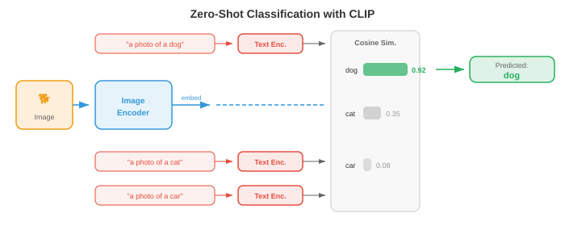

# 多模态表征

> **一句话总结**: 多模态表征通过对比学习把视觉、语言、音频投影到共享嵌入空间, CLIP 及其后继模型由此实现零样本迁移与跨模态检索.

## 🗺️ 本章导览

- 本章覆盖多模态学习: 表征 → 视觉语言 → 图像视频 tokenize → 跨模态生成 → 统一架构
- **01. 多模态表征** (本节): 融合策略、对比学习、CLIP
- **02. 视觉语言模型**: VLM、BLIP、LLaVA 家族
- **03. 图像与视频 Token 化**: VQ-VAE、Video Tokenizer
- **04. 跨模态生成**: Text-to-Image、Text-to-Video、扩散
- **05. 统一多模态架构**: 世界模型、Sora、Gemini 类系统

*多模态表征把视觉、语言与音频桥接到共享嵌入空间. 本节涵盖融合策略、CLIP、ALIGN、SigLIP、对比损失函数 (InfoNCE、NT-Xent)、零样本分类以及检索评测.*

- 想象一下, 你正坐在咖啡馆里. 你看到桌上一杯冒着热气的咖啡, 听到瓷器碰撞的清脆声, 闻到烘焙咖啡豆的香气, 手掌感受到杯身散发的温暖. 没有任何单一感官能告诉你全部信息: 大脑把这些信号融合成一个统一的知觉——"一杯热咖啡". **多模态学习** (multimodal learning) 让机器做同样的事: 它把来自多种模态 (视觉、语言、音频等) 的信息组合起来, 得到比任何单一模态更丰富、更鲁棒的表征.

- **模态** (modality) 是一种独立的信息通道. 机器学习里最常见的模态包括图像 (像素网格)、文本 (Token 序列)、音频 (波形或频谱图, 见第 9 章)、视频 (帧序列)、结构化数据 (表格、图). 每种模态都有自己的统计结构: 图像在空间上连贯, 文本是离散的序列, 音频是连续的时间信号. 多模态学习的挑战就是要跨越这些根本不同的数据类型.

- 为什么要费劲组合多种模态? 因为它们提供互补信息. 一张狗的照片能告诉你品种和毛色, 但说不出它的名字. 一句话"我家的金毛叫 Max"给了你名字和品种, 却看不出具体姿态. 图像加文本一起, 才是完整的画面. 这种互补性正是核心动机: 多模态模型能回答问题、生成内容、做出决策, 这些都是单模态模型做不到的.


## 融合策略

- 把它想成一个小组作业. 你有两种合作方式: 所有人一开始就挤在同一间屋里, 共享草稿和笔记; 或者每个人独立写完自己那部分, 最后再把文档合并. 这对应多模态学习里的**早期融合** (early fusion) 与**晚期融合** (late fusion).

- **早期融合** (也叫特征级融合) 在任何深度处理之前, 先把不同模态的原始特征或低层特征拼接、混合起来. 例如, 你可以把图像的像素特征和文本的 Token 嵌入拼在一起, 然后送进一个统一的 Transformer. 模型从一开始就能学习细粒度的跨模态交互, 但输入空间很大, 模型也必须同时应对差异极大的数据类型.

- 形式化地讲, 给定两种模态的特征向量 $x_{\text{img}} \in \mathbb{R}^{d_1}$ 与 $x_{\text{txt}} \in \mathbb{R}^{d_2}$, 早期融合就是简单拼接:

$$x_{\text{fused}} = [x_{\text{img}}; x_{\text{txt}}] \in \mathbb{R}^{d_1 + d_2}$$

- 拼接后的向量由一个共享网络处理. 优点是模型能在每一层都发现跨模态关联. 缺点是算力开销大, 而且要对齐差异巨大的特征类型 (稠密的像素值 vs 稀疏的 Token 索引) 相当困难.

- **晚期融合** (也叫决策级融合) 让每种模态各自走一遍编码器, 各自产出高层表征甚至最终预测, 然后把这些输出组合起来——通常是打分平均、投票, 或者一个可学习的组合层. 晚期融合更简单, 也方便直接复用现成的预训练单模态模型, 但它捕捉不到低层跨模态交互, 因为各模态从头到尾都没"看到"过对方的原始特征.

- 给定各模态的预测 $\hat{y}_1$ 与 $\hat{y}_2$, 一种简单的晚期融合规则是:

$$\hat{y} = \alpha \hat{y}_1 + (1 - \alpha) \hat{y}_2$$

- 其中 $\alpha \in [0, 1]$ 是可学习或手工调节的混合权重.

- **中期融合** (middle fusion, 也叫 intermediate fusion) 是大多数现代系统采用的务实折中方案. 每种模态先用各自的编码器抽取模态专属特征, 然后在网络中段把这些编码后的表征组合起来, 通常通过交叉注意力层. 这样每个编码器能专精于自己的模态, 同时又能实现丰富的跨模态交互. Flamingo、LLaVA 以及大多数视觉语言模型 (见 02 节) 用的都是中期融合.


- 融合策略的选择取决于数据量、算力预算和任务类型. 早期融合强大但吃数据. 晚期融合便宜但表达力有限. 带交叉注意力的中期融合已经成为大规模多模态模型的主流做法, 因为它在表达力与模块化之间取得了平衡.

## 联合嵌入空间

- 想象一台万能翻译器, 它能把任何语言的任何句子映射到同一个"语义空间"里的同一个点. 无论是英语的 "a dog on a beach"、法语版还是日语版, 都会落到同一个坐标. **联合嵌入空间** (joint embedding space) 做的正是这件事, 但是是跨模态的: 一张"狗在沙滩上"的照片和文字 "a dog on a beach" 应该落在同一向量空间里彼此靠近的位置.

- 形式化地讲, 我们学习两个编码函数: 模态 1 (比如图像) 的 $f_\theta : \mathcal{X}_1 \to \mathbb{R}^d$, 与模态 2 (比如文本) 的 $g_\phi : \mathcal{X}_2 \to \mathbb{R}^d$. 两者都把输入映射到同一个 $d$ 维空间. 训练目标要保证语义匹配的对 $(x_1, x_2)$ 的嵌入 $f_\theta(x_1)$ 与 $g_\phi(x_2)$ 靠得近 (余弦相似度高), 不匹配的对则远离.

- 这是第 7 章词嵌入空间的直接推广. 回想一下, Word2Vec 与 GloVe 把语义相近的词放到向量空间中相邻的位置. 联合嵌入空间把这一思想拓展到跨模态: 我们不再只测词与词的相似度, 而是测图像与文本、音频与文本, 甚至图像与音频之间的相似度.

- 相似度度量几乎总是**余弦相似度** (cosine similarity, 见第 1 章):

$$\text{sim}(u, v) = \frac{u \cdot v}{\|u\| \|v\|}$$

- 把所有嵌入做 $L_2$ 归一化投到单位超球面上, 余弦相似度就退化成简单的点积 $u \cdot v$, 计算极快, 还能用近似最近邻库进一步加速.


- 联合嵌入空间的威力在于, 它能实现**零样本迁移** (zero-shot transfer). 一旦图像和文本嵌入对齐了, 你就能把图像分类到从未训练过的类别: 只要把类别名称当文本嵌入进去, 找出哪一个文本嵌入与图像嵌入最接近就行. 无需任何任务专属的微调. 这正是 CLIP 及其后继者的关键洞见.

## 多模态对齐的对比学习

- 想象一个课堂练习: 学生拿到一堆打乱的照片和描述, 要求把每张照片和对应的描述配对. 要做好这件事, 你既要理解视觉内容, 也要理解语言, 还要知道两者如何关联. **对比学习** (contrastive learning) 就是照这个思路训练模型: 给定一批 (图像, 文本) 对, 模型要判断哪张图配哪段文本.

- 正如第 8 章第 04 节所看到的, 单模态下的对比学习 (SimCLR、MoCo) 把同一图像的不同增强视图拉近, 把不同图像的视图推远. 多模态对比学习把"增强视图"换成"匹配的模态": 一张图像和它的描述是正样本对; 这张图像与批中其他任何描述配对就是负样本对.

### CLIP

- **CLIP** (Contrastive Language-Image Pre-training, Radford 等, 2021) 是多模态对比学习的奠基模型. 它在 4 亿个从互联网爬取的 (图像, 文本) 对上, 联合训练一个图像编码器 (ViT 或 ResNet, 见第 8 章) 与一个文本编码器 (Transformer, 见第 7 章).

- 给定一批 $N$ 个图像-文本对, CLIP 计算所有图像嵌入与所有文本嵌入之间的 $N \times N$ 余弦相似度矩阵. 对角线上是匹配的正样本对; 所有非对角线都是不匹配的负样本对. 训练损失把对角线推高, 把非对角线压低.

- 损失是对称的交叉熵. 对于与文本 $j = i$ 配对的图像 $i$, 图像到文本方向的损失是:

$$\mathcal{L}_{i \to t} = -\frac{1}{N} \sum_{i=1}^{N} \log \frac{\exp(\text{sim}(z_i^{\text{img}}, z_i^{\text{txt}}) / \tau)}{\sum_{k=1}^{N} \exp(\text{sim}(z_i^{\text{img}}, z_k^{\text{txt}}) / \tau)}$$

- 文本到图像方向的损失把角色对调:

$$\mathcal{L}_{t \to i} = -\frac{1}{N} \sum_{i=1}^{N} \log \frac{\exp(\text{sim}(z_i^{\text{txt}}, z_i^{\text{img}}) / \tau)}{\sum_{k=1}^{N} \exp(\text{sim}(z_i^{\text{txt}}, z_k^{\text{img}}) / \tau)}$$

- 总的 CLIP 损失取两者平均:

$$\mathcal{L}_{\text{CLIP}} = \frac{1}{2}(\mathcal{L}_{i \to t} + \mathcal{L}_{t \to i})$$

- 这里 $\tau$ 是可学习的**温度** (temperature) 参数 (初始化为 $\tau = 0.07$). 温度控制 Softmax 分布的锐利程度: $\tau$ 小, 模型只死盯最相近的那个匹配; $\tau$ 大, 概率分布则更均匀. CLIP 把 $\tau$ 和模型权重一起学, 而不是当成固定超参数.


- CLIP 的图像编码器一般是 ViT-L/14 (一个 14x14 图块的大号视觉 Transformer, 见第 8 章第 04 节). 文本编码器是 12 层带因果掩码的 Transformer (类似 GPT, 见第 7 章第 04 节). 两个编码器都通过可学习的线性投影把输出映射到共享的 512 维或 768 维空间, 再做 $L_2$ 归一化.

- CLIP 最了不起的性质是**零样本图像分类** (zero-shot image classification). 要把图像分到 $K$ 个类别中的一个, 你为每个类别造一句提示词, 比如 "a photo of a {class name}", 用文本编码器嵌入每一条提示词, 用图像编码器嵌入图像, 挑出与图像嵌入余弦相似度最高的那条文本嵌入对应的类别. 在 ImageNet 上, CLIP 没见过任何 ImageNet 训练样本, 就取得了具有竞争力的准确率.

### ALIGN

- **ALIGN** (Jia 等, 2021) 把 CLIP 的思路扩展到更嘈杂、更大的数据集上: 18 亿个几乎没做过滤的图文对. CLIP 精心筛选数据, ALIGN 则证明: 规模可以抵消噪声. ALIGN 用 EfficientNet 图像编码器加 BERT 文本编码器, 训练用的还是同样的对比损失. 关键结论是: 数据量足够大时, 你不需要昂贵的清洗; 对比目标本身会自然给噪声样本低权重, 因为它们产生不一致的梯度.

### SigLIP

- **SigLIP** (Sigmoid Loss for Language-Image Pre-training, Zhai 等, 2023) 把 CLIP 基于 Softmax 的对比损失换成了更简单的 Sigmoid 损失. CLIP 把 $N \times N$ 相似度矩阵当成分类问题 (每一行做一次跨列的 Softmax), SigLIP 则把每个位置当成独立的二分类: 这一 (图像, 文本) 对匹配吗?

- SigLIP 对单个位置 $(i, j)$ 的损失是:

$$\mathcal{L}_{ij} = -y_{ij} \log \sigma(z_i^{\text{img}} \cdot z_j^{\text{txt}} / \tau) - (1 - y_{ij}) \log(1 - \sigma(z_i^{\text{img}} \cdot z_j^{\text{txt}} / \tau))$$

- 其中 $i = j$ 时 $y_{ij} = 1$ (匹配), 否则 $y_{ij} = 0$, $\sigma$ 是 Sigmoid 函数.

- SigLIP 的关键好处是: 它不需要跨整个 batch 做全局 Softmax 归一化. 在 CLIP 里, Softmax 分母要求把所有嵌入跨所有设备汇聚, 这在分布式训练里是通信瓶颈. SigLIP 的逐位 Sigmoid 损失可以本地计算, 因此更容易高效扩展到超大批. SigLIP 在训练开销更低的情况下能追平 CLIP 的效果.

## 对比损失函数细节

- 对比学习中用到的损失函数有一个共同结构: 都是想让正样本对的相似度比负样本对高一些, 再用某种"边距"或"温度"的概念控制模型推得多狠. 我们来把关键变体形式化.

### InfoNCE

- **InfoNCE** (Noise-Contrastive Estimation, van den Oord 等, 2018) 是 CLIP 损失背后的理论基础. 给定一个查询 $q$、一个正样本键 $k^+$ 与 $K$ 个负样本键 $\{k_1^-, \ldots, k_K^-\}$, 损失是:

$$\mathcal{L}_{\text{InfoNCE}} = -\log \frac{\exp(q \cdot k^+ / \tau)}{\exp(q \cdot k^+ / \tau) + \sum_{j=1}^{K} \exp(q \cdot k_j^- / \tau)}$$

- 这是一个 $(K+1)$ 路分类问题: 从 $K+1$ 个候选中找出正样本. InfoNCE 是查询与正样本键之间互信息的一个下界, 所以最大化它就能对齐语义匹配输入的表征. 负样本数 $K$ 越大, 这个下界越紧, 这就解释了为什么对比方法从大批中获益.

### NT-Xent

- **NT-Xent** (Normalised Temperature-scaled Cross-Entropy, Chen 等, 2020) 是 SimCLR (见第 8 章第 04 节) 用的损失, 本质上是把 InfoNCE 在一个 batch 内对称地应用一次. 对一批 $N$ 对样本, 它们的 $2N$ 个增强视图为每个锚点提供 $2N - 2$ 个负样本 (所有视图, 除了自身和它的正样本). 一对正样本 $(i, j)$ 的损失是:

$$\ell_{i,j} = -\log \frac{\exp(\text{sim}(z_i, z_j) / \tau)}{\sum_{k=1}^{2N} \mathbf{1}_{[k \neq i]} \exp(\text{sim}(z_i, z_k) / \tau)}$$

- NT-Xent 和 InfoNCE 是同一个数学公式; 名字不同是因为它们在不同语境下被引入 (自监督视觉 vs 表征学习理论).

### 温度的作用

- **温度** $\tau$ 是对比学习中最重要的超参数之一. 直觉上, 可以把温度当作物理意义上的温度: 高温下分子无序运动 (Softmax 变平, 所有负样本看起来一样糟); 低温下分子凝结成刚性结构 (Softmax 变尖, 只有最难的负样本重要).

- 形式化地讲, 当 $\tau \to 0$ 时, Softmax 逼近硬 argmax, 只挑出一个最难的负样本. 当 $\tau \to \infty$ 时, 所有负样本贡献相同. 实践中, 对归一化嵌入而言 $\tau \in [0.01, 0.1]$ 效果不错. 温度太低会导致训练不稳定 (难负样本上的梯度爆炸); 温度太高则让损失对违规不敏感.

- CLIP 把 $\tau$ 初始化为 0.07, 用对数参数化 $\tau = \exp(t)$ 来学它, $t$ 与模型权重一起靠梯度下降更新. 这样模型可以在训练中自动调整对比任务的难度.


### 三元组损失与基于边距的替代方案

- 在 InfoNCE 主导之前, **三元组损失** (triplet loss) 一直是度量学习的标准. 给定锚点 $a$、正样本 $p$、负样本 $n$:

$$\mathcal{L}_{\text{triplet}} = \max(0, \|a - p\|^2 - \|a - n\|^2 + m)$$

- 其中 $m$ 是边距, 保证正样本比负样本至少近 $m$. 三元组损失作用于单个三元组而非整个 batch, 因此样本效率不如 InfoNCE. 它对负样本采样策略也很敏感: 随机负样本往往太容易 (损失直接为零), 所以**难负样本挖掘** (hard negative mining, 挑出最近的错误匹配) 或**半难挖掘** (semi-hard mining, 挑出边距内的负样本) 就变得关键.

- InfoNCE 在整个 batch 上隐式做了难负样本挖掘, 这也是它在规模上胜过三元组损失的原因之一. InfoNCE 里的 Softmax 归一化自动给难负样本 (与锚点相似度高的样本) 加权, 提供了一个天然的课程表, 无需显式挖掘.

## 图文检索与零样本分类

- 一旦有了训练好的联合嵌入空间, 你就能做**图文检索**: 给定一张图像查询, 从数据库中找到最相关的文本 (图到文检索); 或者给定一段文本查询, 找到最相关的图像 (文到图检索). 这其实就是在共享嵌入空间里做最近邻搜索.

- 想象一位图书管理员, 能在百万条目的目录里瞬间比对任何照片和任何描述. 她不需要事先了解每一种可能的类别; 她只是测量每张照片与每段描述有多"近". 这正是 CLIP 类模型做检索与零样本分类的方式.

- **零样本分类** (zero-shot classification) 是文到图检索的一个特例. 给定 $K$ 个类别名称, 你构造文本提示词 $\{t_1, \ldots, t_K\}$ (例如 "a photo of a cat", "a photo of a dog") 并嵌入它们. 对于一张新图像 $x$, 预测类别是:

$$\hat{y} = \arg\max_{k} \; \text{sim}(f_\theta(x), g_\phi(t_k))$$

- 关键洞见是: 文本编码器扮演了一个灵活的分类头. 你不用为每个下游任务训练新的线性层, 只需用自然语言描述任务即可. 这就是 CLIP 泛化能力那么强的原因: 文本编码器在预训练中已经见过了海量多样的描述.

- **提示工程** (prompt engineering) 很重要. 仅仅把提示模板从 "{class name}" 换成 "a photo of a {class name}", CLIP 在 ImageNet 上的零样本准确率就能从 63.2% 提升到 68.4%. 更进一步, **提示集成** (prompt ensembling) 把多个模板 (例如 "a photo of a {class name}"、"a good photo of a {class name}"、"a drawing of a {class name}") 的文本嵌入取平均, 得到更鲁棒的文本表征.



## 视听对应

- 闭上眼, 听有人拍篮球. 你能听出球落地时那有节奏的砰砰声. 现在睁开眼: 视觉上的每一次落地都和一次砰声完美同步. 音频与视觉事件之间这种紧密对应, 是一个天然的免费监督信号, 机器可以从中学习. **视听对应学习** (audio-visual correspondence learning) 训练模型把声音与其视觉来源关联起来, 完全不需要人工标注.

- 这个思路和 CLIP 惊人地相似, 只是把文本换成了音频. 给定成对的视频帧与音频片段, 模型学习一个嵌入空间, 让时间上对齐的音视频对靠得近, 错位的对相互远离.

- **视听嵌入** (Audio-Visual Embedding, AVE) 方法 (Arandjelovic 与 Zisserman, 2017) 在视频数据上用对比损失训练一个视觉编码器 $f$ 与一个音频编码器 $g$. 正样本对是 (视频帧, 同一时刻的音频片段), 负样本是来自其他视频或其他时刻的音频片段. 模型学到狗叫声配狗的画面, 吉他声配吉他的画面, 全程无需标签.

- 音频编码器通常用 CNN 或音频 Transformer 处理**对数梅尔频谱图** (log-mel spectrogram, 见第 9 章第 01 节), 输出固定大小的嵌入. 视觉编码器用标准图像骨干 (ResNet、ViT) 处理视频帧. 两者都投影到共享的 $d$ 维空间, 训练用的仍是与 CLIP 一样的 InfoNCE 损失:

$$\mathcal{L}_{\text{AV}} = -\log \frac{\exp(\text{sim}(z^{\text{vis}}, z^{\text{aud}}) / \tau)}{\sum_{k=1}^{N} \exp(\text{sim}(z^{\text{vis}}, z_k^{\text{aud}}) / \tau)}$$


- 视听学习的**应用**包括: 声源定位 (声音来自图像中的哪里?)、视听语音识别 (把唇动与音频结合, 见第 9 章第 02 节)、视听源分离 (通过看说话人的脸来分离出他的声音, 即第 9 章第 05 节的"鸡尾酒会"问题), 以及基于音频条件的视频生成.

- **ImageBind** (Girdhar 等, 2023) 把这一想法扩展到六种模态: 图像、文本、音频、深度、热成像、惯性测量单元 (Inertial Measurement Unit, IMU) 数据. 关键洞见是: 你不需要为所有模态组合都准备成对数据. 只要把每一种模态都与图像对齐 (文本用图文对、音频用图像-音频对, 等等), 所有模态都会通过共享的图像嵌入空间隐式对齐. 这种通过一个公共锚点模态"绑定"的做法, 会涌现出对齐效果: 音频和文本从未直接一起训练, 却也变得相似.

## 评测

- 评测多模态模型需要能刻画跨模态理解的指标. 两大主流评测范式是**零样本基准**与**检索指标**.

### 零样本基准

- 零样本评测检验模型能否完成从未显式训练过的任务. 最常见的基准是 **ImageNet 零样本准确率**: 把全部 1000 个 ImageNet 类别名嵌入为文本, 把每张测试图像嵌入, 基于余弦相似度测 top-1 与 top-5 分类准确率. CLIP ViT-L/14 零样本达到 75.5% top-1 准确率, 与在 ImageNet 上有监督训练的 ResNet-50 相当.

- 其他零样本基准包括: CIFAR-10/100、STL-10、Food-101、Oxford Pets、Flowers-102. 跨多个数据集评测能检验模型是真的具备通用视觉理解能力, 还是只是记住了预训练数据里的某些模式.

- **线性探针** (linear probe) 评测是一种互补测试. 你冻结预训练图像编码器, 对一个带标注数据集抽取特征, 在上面训一个简单线性分类器. 这独立于零样本检索机制, 单独测学到的表征质量. CLIP 的特征是极好的线性探针特征, 常与有监督预训练相当甚至更好.

### 检索指标

- 检索任务 (图到文与文到图) 的标准指标是 **Recall@K** (R@K): 在前 $K$ 个检索结果里出现正确匹配的查询比例. 常用值是 R@1、R@5、R@10.

- 形式化地讲, 对一组 $Q$ 个查询:

$$\text{R@}K = \frac{1}{Q} \sum_{q=1}^{Q} \mathbf{1}[\text{rank}(q) \leq K]$$

- 其中 $\text{rank}(q)$ 是查询 $q$ 的检索排序列表中正确匹配的位置.

- 标准检索基准包括 **Flickr30K** (31000 张图像, 每张 5 条描述) 与 **MS-COCO** (123000 张图像, 每张 5 条描述). 评测在测试集上进行: 给定一张图, 从整个测试集中检索正确的描述, 反之亦然.

- **中位排名** (Median rank, MedR) 是补充指标: 所有查询中正确匹配位置的中位数. 完美模型 MedR = 1, 越低越好.

- 除了检索, 多模态模型还在组合理解基准上评测, 比如 **Winoground** (测试模型能不能区分 "a mug in a dog" 与 "a dog in a mug") 以及 **ARO** (Attribute, Relation, Order, 属性/关系/顺序), 后者测模型是真理解语言结构还是只在做词袋匹配. CLIP 类模型在这些基准上经常吃瘪, 揭示了一个根本局限: 对比预训练对齐的是全局语义, 未必能捕捉细粒度的组合结构.


## 收尾串联

- 本节介绍的多模态表征是本章后续内容的基石. CLIP 及其后继模型训练出的联合嵌入空间是连接视觉与语言的"胶水". 02 节在这块基石上进一步引入视觉语言模型, 从检索走向对图像生成文本. 03 节探讨如何把图像和视频 Token 化, 供序列模型使用. 04 节覆盖跨模态生成 (文到图、文到视频). 05 节考察在同一个模型中处理多种模态的统一架构.

- 核心要点: 在配对数据上做对比学习, 就能得到不同模态可互换的嵌入空间. 一个图像嵌入和一个文本嵌入变成了"同一类东西", 由此实现零样本分类、检索, 以及无缝集成到更大系统中. 这个想法简单到不像话——把匹配对拉近, 把不匹配对推远——但它异乎寻常地有效.

## 编程练习 (在 CoLab 或 notebook 中完成)

1. 从零实现 CLIP 对比损失. 创建随机图像和文本嵌入, 计算相似度矩阵, 并计算对称交叉熵损失.
```python
import jax
import jax.numpy as jnp
import matplotlib.pyplot as plt

def clip_loss(image_embeds, text_embeds, temperature=0.07):
    """计算对称的 CLIP 对比损失."""
    # L2 归一化嵌入
    image_embeds = image_embeds / jnp.linalg.norm(image_embeds, axis=1, keepdims=True)
    text_embeds = text_embeds / jnp.linalg.norm(text_embeds, axis=1, keepdims=True)

    # 计算余弦相似度矩阵 (N x N)
    logits = image_embeds @ text_embeds.T / temperature  # (N, N)

    # 标签: 对角线 (第 i 张图配第 i 段文)
    N = logits.shape[0]
    labels = jnp.arange(N)

    # 对称交叉熵: 图到文 + 文到图
    loss_i2t = -jnp.mean(jax.nn.log_softmax(logits, axis=1)[jnp.arange(N), labels])
    loss_t2i = -jnp.mean(jax.nn.log_softmax(logits, axis=0)[labels, jnp.arange(N)])
    return (loss_i2t + loss_t2i) / 2, logits * temperature

# 模拟 64 维空间中 8 个图文对的一个 batch
key = jax.random.PRNGKey(42)
k1, k2 = jax.random.split(key)
N, D = 8, 64
image_embeds = jax.random.normal(k1, (N, D))
text_embeds = jax.random.normal(k2, (N, D))

loss, sim_matrix = clip_loss(image_embeds, text_embeds)
print(f"CLIP loss (random embeddings): {loss:.4f}")

# 可视化相似度矩阵
fig, ax = plt.subplots(figsize=(6, 5))
im = ax.imshow(sim_matrix, cmap='coolwarm', vmin=-1, vmax=1)
ax.set_xlabel("Text index"); ax.set_ylabel("Image index")
ax.set_title(f"Cosine Similarity Matrix (loss={loss:.3f})")
plt.colorbar(im); plt.tight_layout(); plt.show()
# 试试改温度 (0.01, 0.1, 1.0), 看损失怎么变化
# 试试让匹配对相似: 令 text_embeds = image_embeds + 小噪声
```

2. 搭一个玩具版联合嵌入模型, 用 InfoNCE 损失与梯度下降对齐 2D "图像" (随机向量) 与 "描述" (不同的随机向量).
```python
import jax
import jax.numpy as jnp
import matplotlib.pyplot as plt

def info_nce_loss(img_enc, txt_enc, img_data, txt_data, tau=0.1):
    """在一批配对 (image, text) 数据上计算 InfoNCE."""
    z_img = img_data @ img_enc  # (N, D)
    z_txt = txt_data @ txt_enc  # (N, D)
    # L2 归一化
    z_img = z_img / jnp.linalg.norm(z_img, axis=1, keepdims=True)
    z_txt = z_txt / jnp.linalg.norm(z_txt, axis=1, keepdims=True)
    logits = z_img @ z_txt.T / tau
    labels = jnp.arange(logits.shape[0])
    return -jnp.mean(jax.nn.log_softmax(logits, axis=1)[jnp.arange(len(labels)), labels])

# 生成 32 组配对样本: img 在 R^8, txt 在 R^6, 嵌入到 R^4
key = jax.random.PRNGKey(0)
k1, k2, k3, k4 = jax.random.split(key, 4)
N, d_img, d_txt, d_embed = 32, 8, 6, 4

img_data = jax.random.normal(k1, (N, d_img))
txt_data = jax.random.normal(k2, (N, d_txt))

# 可学习的投影矩阵
img_enc = jax.random.normal(k3, (d_img, d_embed)) * 0.1
txt_enc = jax.random.normal(k4, (d_txt, d_embed)) * 0.1

grad_fn = jax.jit(jax.grad(info_nce_loss, argnums=(0, 1)))
lr = 0.05
losses = []

for step in range(300):
    loss = info_nce_loss(img_enc, txt_enc, img_data, txt_data)
    losses.append(float(loss))
    g_img, g_txt = grad_fn(img_enc, txt_enc, img_data, txt_data)
    img_enc = img_enc - lr * g_img
    txt_enc = txt_enc - lr * g_txt

print(f"Initial loss: {losses[0]:.3f}, Final loss: {losses[-1]:.3f}")
print(f"Random baseline (log N): {jnp.log(N):.3f}")

plt.figure(figsize=(8, 4))
plt.plot(losses, color='#2c3e50')
plt.axhline(y=0, color='green', linestyle='--', alpha=0.5, label='Perfect alignment')
plt.axhline(y=float(jnp.log(N)), color='red', linestyle='--', alpha=0.5, label='Random (log N)')
plt.xlabel("Step"); plt.ylabel("InfoNCE Loss")
plt.title("Learning a Joint Embedding Space")
plt.legend(); plt.grid(alpha=0.3); plt.tight_layout(); plt.show()
# 改一下 d_embed (试 2, 4, 16), 看嵌入维度对对齐的影响
```

3. 用预先算好的嵌入实现零样本分类. 把类"原型"模拟成文本嵌入, 用最近邻查找对新图像分类.
```python
import jax
import jax.numpy as jnp
import matplotlib.pyplot as plt

# 模拟 5 个类, 每个类在 R^32 里有一个原型文本嵌入
key = jax.random.PRNGKey(42)
n_classes, d = 5, 32
class_names = ["cat", "dog", "car", "plane", "ship"]

# 类原型 (想象它们来自文本编码器)
k1, k2 = jax.random.split(key)
class_prototypes = jax.random.normal(k1, (n_classes, d))
class_prototypes = class_prototypes / jnp.linalg.norm(class_prototypes, axis=1, keepdims=True)

# 生成 200 张测试"图像" (嵌入 = 类原型 + 噪声)
n_per_class = 40
true_labels = jnp.repeat(jnp.arange(n_classes), n_per_class)
keys = jax.random.split(k2, n_classes * n_per_class)

image_embeds = []
for i in range(n_classes):
    noise = jax.random.normal(keys[i], (n_per_class, d)) * 0.5
    cluster = class_prototypes[i] + noise
    image_embeds.append(cluster)
image_embeds = jnp.concatenate(image_embeds, axis=0)
image_embeds = image_embeds / jnp.linalg.norm(image_embeds, axis=1, keepdims=True)

# 零样本分类: 与各原型算余弦相似度
similarities = image_embeds @ class_prototypes.T  # (200, 5)
predicted_labels = jnp.argmax(similarities, axis=1)
accuracy = jnp.mean(predicted_labels == true_labels)
print(f"Zero-shot accuracy: {accuracy:.1%}")

# 混淆矩阵
conf = jnp.zeros((n_classes, n_classes), dtype=jnp.int32)
for true, pred in zip(true_labels, predicted_labels):
    conf = conf.at[true, pred].add(1)

fig, ax = plt.subplots(figsize=(6, 5))
im = ax.imshow(conf, cmap='Blues')
ax.set_xticks(range(n_classes)); ax.set_xticklabels(class_names, rotation=45)
ax.set_yticks(range(n_classes)); ax.set_yticklabels(class_names)
ax.set_xlabel("Predicted"); ax.set_ylabel("True")
for i in range(n_classes):
    for j in range(n_classes):
        ax.text(j, i, int(conf[i, j]), ha='center', va='center', fontsize=11)
ax.set_title(f"Zero-Shot Confusion Matrix (acc={accuracy:.1%})")
plt.colorbar(im); plt.tight_layout(); plt.show()
# 试着加大噪声 (0.5 -> 1.0 -> 2.0), 看准确率如何下降
# 试着做提示集成: 对每个原型平均 3 个带噪副本
```

---

## 📌 本节要点

- **模态与多模态学习**: 模态是独立的信息通道 (图像、文本、音频等), 多模态学习融合多通道以获得更丰富的表征.
- **三种融合策略**: 早期融合拼原始特征, 晚期融合合并各自预测, 中期融合借交叉注意力在中间层交互, 是现代主流做法.
- **联合嵌入空间**: 图像与文本编码器把输入映射到同一 $d$ 维空间, 匹配对靠近, 不匹配对远离, 相似度用余弦度量.
- **CLIP 对比损失**: 对 $N \times N$ 相似度矩阵做对称交叉熵, 温度 $\tau$ 与模型权重一起学, 训练目标推高对角线压低非对角线.
- **ALIGN 与 SigLIP**: ALIGN 用海量嘈杂数据证明规模能替代清洗; SigLIP 用逐位 Sigmoid 换掉全局 Softmax, 更省通信、更易扩展.
- **InfoNCE 与温度**: InfoNCE 是互信息下界, 大批负样本让下界更紧; 温度 $\tau$ 控制 Softmax 锐度, 太低易崩太高不敏感.
- **零样本迁移**: 把类别名当文本嵌入, 与图像嵌入比余弦相似度即可, 无需任务微调; 提示工程与提示集成显著提升准确率.
- **视听对应与 ImageBind**: 音视频对齐把 CLIP 思路推广到时间同步的音画对, ImageBind 用图像作锚点绑定六种模态.
- **评测两条路**: 零样本准确率 + 线性探针 测表征质量; Recall@K 与 MedR 测检索; Winoground/ARO 揭示组合理解的短板.
