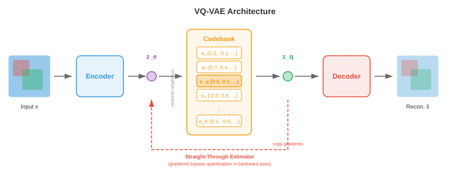
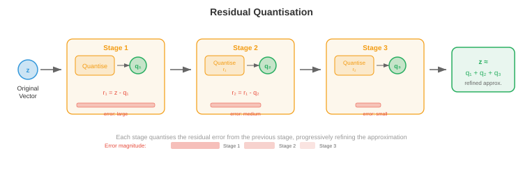
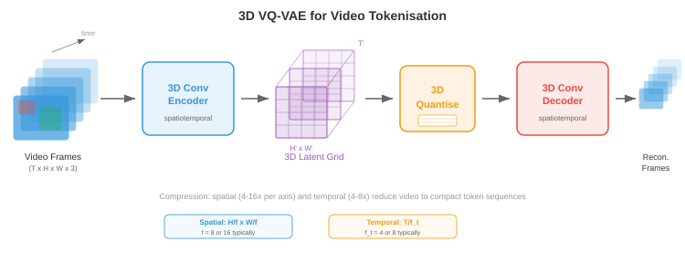

# 图像与视频 Token 化

> **一句话总结**: 图像与视频 Token 化把连续视觉数据转成 Transformer 能像文本一样处理的离散 Token 序列, 核心方法从 VQ-VAE、VQ-GAN 一路发展到残差量化与无查表量化.

*图像与视频 Token 化把连续视觉数据转换成离散 Token 序列, 让 Transformer 能像处理文本一样处理它们. 本节涵盖 VQ-VAE、VQ-GAN、码本学习、DALL-E 的 dVAE、视频 Token 化, 以及无查表量化.*

## 为什么要给图像做 Token 化

- 把语言想成一个有限的字母表: 英语大约 26 个字母, 现代语言模型把文本切成 30,000 到 100,000 个子词 Token. 每一句话都变成一串离散符号, Transformer 就能一个一个地预测. 图像则不一样, 它活在一个连续的高维空间里: 一张 256x256 的 RGB 图像是 $\mathbb{R}^{256 \times 256 \times 3} \approx \mathbb{R}^{196{,}608}$ 中的一个点. 如果你想让语言模型用它讲英语的那套机器去 "讲" 图像, 就得把这些连续像素阵列转成一个可控长度的离散 Token 序列, 且这些 Token 来自一个有限词表. 这个转换过程就是 **图像 Token 化**.

- 想象你是一位马赛克艺术家. 你手上没有无穷种色调的瓷砖, 只有一套固定调色板, 比方说 8192 种不同颜色的瓷砖. 要把一张照片复现成马赛克, 你必须 (1) 决定每块瓷砖对应照片的哪个区域, (2) 为每个区域挑最接近的瓷砖颜色, (3) 接受细节会丢一些, 但整体画面还认得出来. 图像 Token 化做的正是这件事: 编码器把空间图块 (patch) 压成潜向量, 码本 (codebook) 把每个向量映射到最近的一项, 结果就是一个整数索引组成的网格, 每个图块一个索引, 后续的离散模型就能处理它.

- Token 化的收益有三. 第一, 大幅压缩图像: 一张 256x256 的图可能变成 16x16 的 Token 网格, 序列长度从 65,536 个像素降到 256 个 Token, 这样基于注意力的模型才吃得下 —— 毕竟它的开销随序列长度平方增长. 第二, 统一表示: 文本 Token 和图像 Token 活在同一个离散词表里, 让单个自回归 Transformer 就能生成文本与图像交错的内容. 第三, 加了一个有用的瓶颈, 迫使模型学习语义有意义的编码, 而不是把像素噪声硬背下来.


- 回想一下第 8 章讲过的卷积神经网络 (Convolutional Neural Network, CNN) 如何从图像中抽出层级化的特征图, 以及第 7 章讲过的文本分词器怎么把字符串转成整数序列. 图像 Token 化正好卡在这两者的交界: 它用一个 CNN 或视觉 Transformer 编码器 (第 8 章) 提取空间特征, 再借离散词表的思路 (第 7 章) 把这些特征转成 Token 索引.

## VQ-VAE: 向量量化

- 第 6 章讲过, 标准的 **变分自编码器 (Variational Autoencoder, VAE)** 把输入编码为一个连续的潜分布, 然后把从该分布采样得到的样本解码回重建结果. 潜空间是连续的, 直接喂给离散序列模型很不顺手. **向量量化变分自编码器 (Vector Quantised Variational Autoencoder, VQ-VAE)** 由 van den Oord 等人在 2017 年提出, 用一个可学习的嵌入向量码本, 把每个编码器输出 "吸附" 到码本里最近的一项, 从而用离散潜取代连续潜.

- 想象一座刚好有 $K$ 层带编号的书架的图书馆. 一本新书 (编码器输出) 来了, 图书管理员会把它放到那层它最像的旧书 (码本向量) 所在的架子上, 并记录架子编号. 之后要取书, 只需要架子编号: 那层码本向量就是不错的替代. 这就是向量量化.

- 正式地讲, VQ-VAE 有三个组成部分:

- **编码器** $E$: 把输入图像 $\mathbf{x} \in \mathbb{R}^{H \times W \times 3}$ 映射到一个连续潜向量的空间网格 $\mathbf{z}_e = E(\mathbf{x}) \in \mathbb{R}^{h \times w \times d}$, 其中 $h \times w$ 是下采样后的空间分辨率, $d$ 是嵌入维度.

- **码本** $\mathcal{C} = \{\mathbf{e}_1, \mathbf{e}_2, \ldots, \mathbf{e}_K\} \subset \mathbb{R}^d$: 包含 $K$ 个可学习的嵌入向量. 典型码本大小从 512 到 16,384 项.

- **解码器** $D$: 从量化后的潜表示重建图像.

- **量化步骤** 用最近码本项替换编码器在空间位置 $(i, j)$ 的输出 $\mathbf{z}_e(\mathbf{x})$:

$$\mathbf{z}_q(i,j) = \mathbf{e}_{k^\ast} \quad \text{where} \quad k^\ast = \arg\min_k \|\mathbf{z}_e(i,j) - \mathbf{e}_k\|_2$$

- 这就是嵌入空间里的最近邻查找, 和 k-means 分配 (第 6 章) 是同一个操作. 索引 $k^\ast$ 就是空间位置 $(i,j)$ 的离散 Token, 整张图被表示为一个 $h \times w$ 的整数网格, 每个整数取自 $\{1, \ldots, K\}$.



- 麻烦在于 $\arg\min$ 不可微: 离散选择挡住了反向传播. VQ-VAE 用 **直通估计器 (straight-through estimator)** 解决这个问题: 前向传播时, 解码器收到的是 $\mathbf{z}_q$ (量化后的向量); 反向传播时, 重建损失对 $\mathbf{z}_q$ 的梯度被直接复制给 $\mathbf{z}_e$, 就好像量化步骤是恒等函数一样. 紧凑地写出来是:

$$\mathbf{z}_q = \mathbf{z}_e + \text{sg}(\mathbf{z}_q - \mathbf{z}_e)$$

- 其中 $\text{sg}(\cdot)$ 是停止梯度算子. 前向时它的值就是 $\mathbf{z}_q$; 反向时, 梯度只从 $\mathbf{z}_e$ 这项流过去.

- 完整的 VQ-VAE 损失有三项:

$$\mathcal{L} = \underbrace{\|\mathbf{x} - D(\mathbf{z}_q)\|_2^2}_{\text{reconstruction}} + \underbrace{\|\text{sg}(\mathbf{z}_e) - \mathbf{e}\|_2^2}_{\text{codebook (VQ)}} + \underbrace{\beta \|\mathbf{z}_e - \text{sg}(\mathbf{e})\|_2^2}_{\text{commitment}}$$

- **重建损失** 训练编码器和解码器忠实地还原输入. **码本损失** (也叫 VQ 损失) 把码本向量往编码器输出方向拉; 注意 $\text{sg}(\mathbf{z}_e)$ 意思是编码器不从这一项拿梯度, 所以它只更新码本. **承诺损失 (commitment loss)** 做反方向的事: 鼓励编码器输出贴近码本向量, 防止编码器 "跑离" 码本. 超参 $\beta$ (通常 0.25) 用来调节码本项与承诺项的平衡.

- 实践中, 码本通常用 **指数移动平均 (exponential moving average, EMA)** 而不是梯度下降来更新, 这样更稳. 设 $\mathbf{n}_k$ 是分配给码本项 $k$ 的编码器输出的计数, $\mathbf{s}_k$ 是它们的求和. EMA 更新是:

$$\mathbf{n}_k \leftarrow \gamma \mathbf{n}_k + (1 - \gamma) |\{(i,j) : k^\ast_{ij} = k\}|$$

$$\mathbf{s}_k \leftarrow \gamma \mathbf{s}_k + (1 - \gamma) \sum_{(i,j) : k^\ast_{ij} = k} \mathbf{z}_e(i,j)$$

$$\mathbf{e}_k \leftarrow \frac{\mathbf{s}_k}{\mathbf{n}_k}$$

- 其中 $\gamma$ 是衰减率 (通常 0.99). 这等价于在编码器输出上跑一个在线 k-means 算法.

### 码本坍缩

- VQ-VAE 有一个臭名昭著的失败模式叫 **码本坍缩 (codebook collapse)** (也叫索引坍缩): 模型学会只使用 $K$ 个码本项中一小部分, 剩下的绝大多数项都 "死掉" 了. 想象一座图书馆, 90% 的书架都是空的, 因为管理员总把书塞给固定几个热门书架. 这浪费了表示能力.

- 码本坍缩之所以发生, 是因为编码器、码本、解码器在训练中共同适应. 如果某一项连续好几个批次都没被选中, 它就漂离编码器流形, 更不可能被选中, 形成正反馈循环.

- 有几种技术可以缓解码本坍缩:
    - **码本重置**: 定期从随机采样的编码器输出复制值, 重新初始化死掉的项. 让死项在潜空间的活跃区域重新起步.
    - **带 Laplace 平滑的 EMA 更新**: 在 $\mathbf{n}_k$ 上加一个小常数, 防止任何一项计数为零, 确保所有项都能拿到梯度信号.
    - **调节承诺损失**: 增大 $\beta$ 会迫使编码器输出更紧密地围绕码本项聚集, 让分配分布更均匀.
    - **因子化编码**: 把码本查找拆成多个小查找的乘积 (比如两个各 $\sqrt{K}$ 大小的码本), 通过降低每次查找的有效码本大小来提升利用率.
    - **熵正则化**: 加一个惩罚项, 鼓励码本使用分布均匀, 即最大化熵 $H = -\sum_k p_k \log p_k$, 其中 $p_k$ 是经验分配概率.


## VQ-GAN: 用对抗训练换来更高保真度

- VQ-VAE 的重建还算不错, 但像素级的 $\ell_2$ 损失倾向于生成模糊的输出, 原因是它一视同仁地惩罚每个像素偏差, 会在所有合理的细节上取平均, 而不是选一个清晰的. 想象让人画一张脸, 目标是使它与所有可能的脸的平均差异最小 —— 他画出的会是一张模糊的平均脸, 而不是清晰的具体脸.

- **VQ-GAN** (Esser 等, 2021) 通过把 VQ-VAE 框架和 **判别器** (来自生成对抗网络, 第 6 章) 结合起来解决这个问题. 判别器是一个基于图块的卷积网络, 用来判断一个局部图像图块是真实的 (来自训练数据) 还是伪造的 (来自解码器). 这种对抗损失鼓励解码器产生感知上锐利、真实的纹理, 而不是像素级的平均.

- VQ-GAN 目标在 VQ-VAE 损失上加了两项:

$$\mathcal{L}_\text{VQ-GAN} = \mathcal{L}_\text{VQ-VAE} + \lambda_\text{adv} \mathcal{L}_\text{adv} + \lambda_\text{perc} \mathcal{L}_\text{perc}$$

- **对抗损失** $\mathcal{L}_\text{adv}$ 是作用于解码器输出的标准生成对抗网络 (Generative Adversarial Network, GAN) 目标. 判别器 $\mathcal{D}$ 试图区分真实图块和解码图块, 而解码器 (生成器) 试图骗过它. 非饱和形式写作:

$$\mathcal{L}_\text{adv} = -\mathbb{E}[\log \mathcal{D}(D(\mathbf{z}_q))]$$

- **感知损失 (perceptual loss)** $\mathcal{L}_\text{perc}$ 比较原图和重建图在一个预训练网络 (通常是 VGG 或 LPIPS) 中激活的特征:

$$\mathcal{L}_\text{perc} = \sum_l \|\phi_l(\mathbf{x}) - \phi_l(D(\mathbf{z}_q))\|_2^2$$

- 其中 $\phi_l$ 表示预训练网络第 $l$ 层的特征图. 这个损失捕捉的是高层结构相似性, 而不是像素级精度.

- 权重 $\lambda_\text{adv}$ 会自适应设置, 使对抗梯度和重建梯度大致平衡, 防止训练早期重建质量还差时对抗损失就占了主导.


- 结果是在同样码本大小下, 相较 VQ-VAE 得到显著更锐利的重建. VQ-GAN 是许多主流图像生成系统背后的骨干 Token 化器, 包括最初的 DALL-E、Parti, 以及众多文生图模型. 它把一张 256x256 图像变成 16x16 或 32x32 的离散 Token 网格 (码本大小 1024 到 16384), 每个空间维度上做到 16 到 64 倍的压缩比.

## 残差量化与多尺度码本

- 单一码本给重建质量设了一个硬上限: 每个空间位置就用一个码本向量表示, 任何比码本能表达更精细的细节都会丢. 想象用一个固定调色板里的单个词描述一种颜色: "青绿色" 很接近但不精确. 如果你能加一个修饰 —— "青绿色, 但蓝一点、亮一点" —— 就会更贴近.

- **残差量化 (residual quantisation, RQ)** 把这个思路做成迭代. 第一次量化产生 $\mathbf{z}_q^{(1)}$ 之后, 计算残差 $\mathbf{r}^{(1)} = \mathbf{z}_e - \mathbf{z}_q^{(1)}$, 再用第二个码本量化这个残差得到 $\mathbf{z}_q^{(2)}$, 依此类推共 $T$ 层:

$$\mathbf{r}^{(0)} = \mathbf{z}_e$$

$$\mathbf{z}_q^{(t)} = \text{Quantise}(\mathbf{r}^{(t-1)}, \mathcal{C}^{(t)})$$

$$\mathbf{r}^{(t)} = \mathbf{r}^{(t-1)} - \mathbf{z}_q^{(t)}$$

- 最终量化表示是 $\hat{\mathbf{z}} = \sum_{t=1}^{T} \mathbf{z}_q^{(t)}$. $T$ 层, 每层用大小为 $K$ 的码本, 有效词表大小为 $K^T$, 但你只需要存 $T \times K$ 个向量, 而不是 $K^T$ 个. 举个例子, 8 层、每层 $K = 1024$ 就能提供 $1024^8 \approx 10^{24}$ 个有效项, 而只用存 8192 个向量.

- 每一层依次捕捉更精细的细节: 第一个码本捕获粗结构, 第二个捕获中频修正, 依此类推. 这类似 JPEG 中的逐次逼近或网页图片的渐进渲染, 先出粗略版本, 细节再逐步补上.



- **多尺度码本 (multi-scale codebooks)** 把这个思路扩展到不同空间分辨率上运作. 与其在同一个空间网格上反复量化, 不如在多个尺度上量化: 粗网格捕获全局结构, 细网格捕获局部细节. 这跟第 8 章目标检测里的特征金字塔思想有关 —— 不同尺度的特征捕获不同层次的细节.

- **乘积量化 (product quantisation)** 是一种相关技术, 把 $d$ 维潜向量拆成 $M$ 个 $d/M$ 维的子向量, 每个子向量用自己的码本独立量化. 这样有效词表大小为 $K^M$, 只需要存 $M \times K$ 个向量. 乘积量化在近似最近邻搜索 (第 13 章) 中广泛使用, 也被搬到图像 Token 化里.

- **有限标量量化 (Finite Scalar Quantisation, FSQ)** 由 Mentzer 等人在 2023 年提出, 走的完全是另一条路: 它根本不学习码本, 只是把潜向量每一维四舍五入到一组固定的整数级别 (比如 $\{-2, -1, 0, 1, 2\}$) 中的一个. 每维 $L$ 级、共 $d$ 维, 隐含的码本大小就是 $L^d$. FSQ 完全避免了码本坍缩, 因为压根没有可学的码本向量, 只有被确定性四舍五入的编码器输出. 舍入的不可微性由直通估计器处理.

## 实用中的图像 Token 化器

- 从 VQ-VAE 到 VQ-GAN 再到残差量化的演进, 催生了一批用在最前沿生成模型里的实用图像 Token 化器.

### DALL-E Token 化器 (dVAE)

- 最初的 **DALL-E** (Ramesh 等, 2021) 用了一个离散 VAE (discrete VAE, dVAE) 把 256x256 图像 Token 化成 32x32 的 Token 网格, 码本大小 8192. dVAE 把硬 $\arg\min$ 量化替换成 Gumbel-Softmax 松弛, 让训练时的前向传播可微. 推理时用 $\arg\max$ 得到硬 Token 分配. dVAE 用重建损失、相对均匀先验的 Kullback-Leibler (KL) 散度, 以及 Gumbel-Softmax 的一套学习温度调度组合训练. 之后 DALL-E 训练了一个 120 亿参数的自回归 Transformer 来建模 256 个文本 Token 和 1024 个图像 Token (32x32) 的联合分布.

### LlamaGen

- **LlamaGen** (Sun 等, 2024) 展示了: 只要你有一个好的图像 Token 化器, 就能把标准的 Llama 风格语言模型架构 (第 7 章) 拿来做自回归图像生成. LlamaGen 用了改进的 VQ-GAN Token 化器 (码本 16,384 项), 并训练一个普通的自回归 Transformer (除了 Token 化器外没有任何针对图像的特殊改动) 按光栅扫描顺序从左到右预测图像 Token. 关键洞见是: 一旦图像被 Token 化成离散序列, 用在语言上的那套"下一 Token 预测" 范式对图像同样奏效, 这印证了 Token 化真的填平了模态之间的鸿沟.

### Cosmos Token 化器

- **Cosmos Token 化器** (NVIDIA, 2024) 设计上把图像和视频统一在一个框架里. 它采用因果 3D 架构, 把图像当作单帧视频, 让同一个 Token 化器同时处理两种模态. Cosmos 同时支持连续和离散两种 Token 化模式: 连续模式输出实值潜向量 (给扩散模型后端用), 离散模式对潜向量应用有限标量量化得到整数 Token (给自回归模型后端用). 编码器使用因果 3D 卷积, 使得每一帧的 Token 只依赖当前和过去帧, 从而支持流式视频 Token 化.


## 视频 Token 化

- 视频在图像的空间维度之外又加了一维 —— 时间. 视频是一串帧, 通常每秒 24 到 30 帧, 相邻帧高度冗余, 因为视觉世界不会在 33 毫秒里发生剧变. 视频 Token 化利用这种时间冗余, 达到比逐帧独立 Token 化高得多的压缩率.

- 想象视频压缩就像翻页画册. 如果你每一页都从零开始画, 就得画上千张详图. 但大多数页跟相邻页几乎一样, 所以你可以每 10 页画一张完整 "关键帧", 中间几页只标注一些小变化. 视频 Token 化器自动学会了这个技巧.

### 3D VQ-VAE

- 把 VQ-VAE 扩展到视频最直接的做法是 **3D VQ-VAE**, 把编码器和解码器里的 2D 卷积换成同时作用于空间和时间维度的 3D 卷积. 如果编码器在空间上下采样 $f_s$ 倍、在时间上下采样 $f_t$ 倍, 那么 $T \times H \times W$ 的视频片段会变成 $(T/f_t) \times (H/f_s) \times (W/f_s)$ 的 Token 网格.

- 举个例子, 取 $f_s = 16$ 和 $f_t = 4$, 一段 16 帧的 256x256 视频片段就变成 $4 \times 16 \times 16 = 1024$ 个 Token 的序列. 这样紧凑到 Transformer 可以自回归建模, 而原始像素数会是 $16 \times 256 \times 256 \times 3 \approx 310$ 万个值.

- 3D 卷积联合学习空间和时间特征. 早期层捕获局部运动 (帧间移动的边缘), 更深的层捕获更高层次的动态 (物体的出现、消失或形变). 这就是第 8 章卷积网络里的层级特征提取原理, 扩展到时间轴上而已.



### 因果视频 Token 化器

- 标准 3D 卷积会同时看过去、当前、未来帧, 意味着你得先拿到整段视频片段, 才能开始 Token 化其中任何一部分. **因果视频 Token 化器 (causal video tokeniser)** 对时间卷积加约束, 让每个输出只依赖当前帧和过去帧, 永远不看未来帧. 这类似自回归 Transformer 里的因果掩码 (第 7 章): 信息只向前流动, 不倒流.

- 因果 Token 化在两个场景里必不可少. 第一, **流式**: 你可以在帧到来的同时实时 Token 化视频, 不用先缓存未来帧. 第二, **自回归生成**: Transformer 逐帧生成视频时, 第 $t$ 帧的 Token 必须能在不知道第 $t+1$ 帧的前提下算出, 因为第 $t+1$ 帧还没生成.

- 因果约束通过对时间卷积做非对称填充实现: 一个时间尺寸为 $k$ 的卷积核, 在过去侧填 $k-1$ 个零, 未来侧填 0 个零, 保证时刻 $t$ 的输出只依赖时刻 $t-k+1, \ldots, t$ 的输入.

- 因果视频 Token 化器有一个漂亮的性质: 它可以直接 Token 化一张图像 (视作只有一帧的 "视频"), 不需要特殊处理. 第一帧没有过去上下文, 它的 Token 就仅由这一帧算出. 这种 **图像-视频统一** 意味着一个 Token 化器就能服务两种模态, 简化了架构, 也让同一个解码器能同时生成图像与视频.

### 时间压缩策略

- 不同应用对时间压缩率的要求不同. 动作识别 (细微动作很重要) 需要温和压缩 ($f_t = 2$) 来保留时间细节. 长视频生成 (存储上千帧代价太高) 就需要激进压缩 ($f_t = 8$ 甚至更高).

- 有些 Token 化器采用 **因子化压缩 (factorised compression)**: 空间和时间压缩分两个阶段. 先用 2D 编码器独立压缩每一帧, 得到逐帧的潜网格; 再用 1D 时间编码器在时间维度上压缩. 这种因子化在计算上比完整 3D 卷积便宜, 而且允许空间与时间使用不同的压缩比. 代价是它对时空模式 (比如斜向移动的球) 的表达效率, 不如联合 3D 编码.

- **时间插值 Token (temporal interpolation tokens)** 是最近的一个创新: Token 化器只完整编码关键帧, 中间帧则用轻量的插值代码表示, 描述如何在关键帧之间过渡. 这跟经典视频压缩里的 I 帧和 P 帧 (H.264/HEVC) 思路一致, 只不过在一个学到的潜空间里操作.


## 连续 Token 还是离散 Token

- 不是每个下游模型都需要离散 Token. **扩散模型 (diffusion models)** (第 10 章第 04 节) 天生就跟连续值打交道 —— 它们在高斯样本上迭代去噪, 而它们的损失函数 (去噪分数匹配) 定义在连续空间上. 面向扩散后端时, Token 化器编码器直接输出连续潜向量, 从不做量化. **潜扩散模型 (latent diffusion models)** (Stable Diffusion、DALL-E 3、Flux) 用类似 VQ-GAN 的编码器-解码器, 但完全跳过码本, 在连续潜空间中运作.

- **自回归模型** (GPT 风格) 则相反, 它们从有限词表里预测下一个 Token, 用的是 $K$ 类上的 softmax. 它们从根本上就需要离散 Token. 每个用自回归 Transformer 做图像生成的系统 (DALL-E、Parti、LlamaGen、Chameleon) 都依赖一个离散 Token 化器.

- 因此, 连续与离散的选择由生成后端决定:

- 用 **离散 Token** 的场景: 模型是自回归的 (用交叉熵损失做下一 Token 预测)、你想让图像 Token 与文本 Token 共享一个词表以做统一多模态模型, 或者你需要精细的 Token 级控制 (比如按 Token 替换来做检索或编辑).

- 用 **连续 Token** 的场景: 模型是扩散模型或流匹配模型、任务要求非常高的重建保真度 (连续潜完全避免量化误差), 或者你想用作用在实值向量上的回归损失.

- 有些新架构两种模式都支持. 比如 Cosmos Token 化器, 同一个编码器既能输出连续潜 (扩散模式) 也能输出 FSQ 离散 Token (自回归模式), 只需要一个可开关的轻量量化头.

- **软量化 (soft quantisation)** 是折中方案: 与其做硬 $\arg\min$ 分配, 不如对前 $k$ 个最近码本项做加权平均, 权重由负距离的 softmax 给出. 这比硬量化保留更多信息, 又大致保持离散. 一些系统在训练时用软量化, 推理时切回硬量化.


## 应用

### 自回归图像生成

- 一旦图像变成离散 Token 序列, 你就可以训练一个标准自回归 Transformer 来建模它们. 图像 Token 被展平成 1D 序列 (通常按光栅扫描顺序: 从左到右、从上到下), Transformer 用标准交叉熵损失学习 $p(\text{token}_i | \text{token}_1, \ldots, \text{token}_{i-1})$. 生成时逐个采样 Token, 再把补全后的网格喂进 Token 化器的解码器, 得到像素.

- 以文本作为条件也很直白: 把文本 Token 放到图像 Token 序列前面, 让模型学 $p(\text{image tokens} | \text{text tokens})$. DALL-E、Parti、LlamaGen 做文生图的方式正是如此. 文本和图像 Token 共享同一个 Transformer、同一套注意力机制, 甚至常常共享同一张嵌入表 (文本与图像 Token 只是占据不同的索引区间).

- 光栅扫描顺序引入了一个人为的不对称: 图像左上角先生成, 而右下角完全没有上下文可参考. 有几项工作解决这个问题. **掩码图像建模 (masked image modelling, MaskGIT)** 训练一个双向 Transformer, 同时生成所有 Token, 但置信度各异, 迭代地把最有把握的 Token 揭开. **多尺度生成** 先生成粗 Token (捕获全局构图), 再用残差 Token 做细化. 这些方法用纯左到右生成的简洁性, 换来更好的全局一致性.

### 视觉-语言统一 Token

- 图像 Token 化最深层的动机是 **统一**: 把视觉和语言放进同一种表示格式, 让单一模型架构同时处理两者. 我们在第 7 章讨论过, 语言模型是非常强的序列到序列机器. 把图像表示成 Token 序列, 我们就白得了整套语言建模基础设施 —— 预训练配方、缩放律、基于人类反馈的强化学习 (Reinforcement Learning from Human Feedback, RLHF)、上下文长度扩展.

- **Chameleon** (Meta, 2024) 是一个突出的例子: 它用码本 8192 项的 VQ-GAN Token 化器把图像转成 Token, 与文本 Token 交错在一个约 65,000 项 (文本 + 图像) 的共同词表里. 一个标准 Transformer 在文本-图像混合序列上训练, 就能实现: 给图生文、给文生图, 或生成文本与图像交错的内容, 都走同一次前向传播.

- **Gemini** (Google, 2024) 走的是类似路线, 但规模更大, 一个 Transformer 原生地理解并生成图像、音频、文本, 各模态用专属 Token 化器输入到共享序列.

- 统一模型里的关键工程难点是 **词表平衡**: 如果 65,000 项词表里有 8192 项是图像 Token, 模型可能会分配给视觉的容量不足. 解决方案包括: 为每个模态用独立的嵌入层 (只在注意力层共享)、按模态设置损失权重, 以及预训练时精细控制数据混合比例.


## 编程任务 (使用 Colab 或 notebook)

1. 用 JAX 实现一个最小 VQ 层: 给一批编码器输出向量, 做最近邻码本查找, 计算 VQ-VAE 损失 (重建 + 码本 + 承诺). 把码本利用率可视化为直方图.
```python
import jax
import jax.numpy as jnp
import matplotlib.pyplot as plt

# --- 最小 VQ 层 ---
key = jax.random.PRNGKey(42)
d = 8          # 嵌入维度
K = 64         # 码本大小
n_vectors = 256  # 一批编码器输出

# 随机编码器输出与码本
k1, k2 = jax.random.split(key)
z_e = jax.random.normal(k1, (n_vectors, d))       # 编码器输出
codebook = jax.random.normal(k2, (K, d)) * 0.1     # 码本 (小幅初始化)

# 最近邻查找: 为每个 z_e 找最近的码本项
# distances[i, k] = ||z_e[i] - codebook[k]||^2
distances = (
    jnp.sum(z_e ** 2, axis=1, keepdims=True)
    - 2 * z_e @ codebook.T
    + jnp.sum(codebook ** 2, axis=1, keepdims=True).T
)
indices = jnp.argmin(distances, axis=1)       # Token 索引
z_q = codebook[indices]                        # 量化后向量

# VQ-VAE 损失项
beta = 0.25
loss_codebook = jnp.mean((jax.lax.stop_gradient(z_e) - z_q) ** 2)
loss_commit   = jnp.mean((z_e - jax.lax.stop_gradient(z_q)) ** 2)
loss_total    = loss_codebook + beta * loss_commit
print(f"Codebook loss: {loss_codebook:.4f}, Commitment loss: {loss_commit:.4f}")

# 码本利用率
unique, counts = jnp.unique(indices, return_counts=True, size=K, fill_value=-1)
plt.figure(figsize=(10, 4))
plt.bar(range(K), counts, color='#3498db', alpha=0.8)
plt.xlabel('Codebook Index'); plt.ylabel('Assignment Count')
plt.title(f'Codebook Utilisation ({jnp.sum(counts > 0)}/{K} entries used)')
plt.grid(True, alpha=0.3); plt.tight_layout(); plt.show()
# 尝试: 把 K 增大到 512 观察坍缩, 再加入码本重置逻辑.
```

2. 搭一个玩具级 2D 向量量化器, 让它学着 "铺满" 一个 2D 分布. 生成随机 2D 点, 通过 EMA 更新学习码本, 并可视化 Voronoi 区域.
```python
import jax
import jax.numpy as jnp
import matplotlib.pyplot as plt

# 从高斯混合生成 2D 数据
key = jax.random.PRNGKey(0)
n_points = 2000
K = 16  # 码本项数
gamma = 0.99  # EMA 衰减

# 四个簇
keys = jax.random.split(key, 5)
centres = jnp.array([[2, 2], [-2, 2], [-2, -2], [2, -2]], dtype=jnp.float32)
data = jnp.concatenate([
    jax.random.normal(keys[i], (n_points // 4, 2)) * 0.5 + centres[i]
    for i in range(4)
])

# 用随机数据点初始化码本
idx = jax.random.choice(keys[4], n_points, (K,), replace=False)
codebook = data[idx]
ema_count = jnp.ones(K)
ema_sum = codebook.copy()

# 运行若干 epoch 的 EMA 码本学习
for epoch in range(30):
    # 把每个点分配到最近的码本项
    dists = jnp.sum((data[:, None, :] - codebook[None, :, :]) ** 2, axis=2)
    assignments = jnp.argmin(dists, axis=1)
    # EMA 更新
    for k in range(K):
        mask = (assignments == k)
        count_k = jnp.sum(mask)
        ema_count = ema_count.at[k].set(gamma * ema_count[k] + (1 - gamma) * count_k)
        if count_k > 0:
            sum_k = jnp.sum(data[mask], axis=0)
            ema_sum = ema_sum.at[k].set(gamma * ema_sum[k] + (1 - gamma) * sum_k)
    codebook = ema_sum / ema_count[:, None]

# 可视化分配与码本
fig, ax = plt.subplots(1, 1, figsize=(8, 8))
colors = plt.cm.tab20(jnp.linspace(0, 1, K))
for k in range(K):
    mask = assignments == k
    ax.scatter(data[mask, 0], data[mask, 1], c=[colors[k]], s=5, alpha=0.3)
ax.scatter(codebook[:, 0], codebook[:, 1], c='black', s=120, marker='X',
           edgecolors='white', linewidths=1.5, zorder=10, label='Codebook')
ax.set_title(f'Learned VQ Codebook ({K} entries) on 2D Data')
ax.legend(); ax.set_aspect('equal'); ax.grid(True, alpha=0.3)
plt.tight_layout(); plt.show()
# 尝试: 把 K 增大到 64, 观察更精细的铺陈; 减小 gamma 观察不稳定性.
```

3. 演示残差量化: 用 $T$ 级连续量化对一批向量编码, 并度量每一级重建误差如何下降.
```python
import jax
import jax.numpy as jnp
import matplotlib.pyplot as plt

key = jax.random.PRNGKey(7)
d = 16         # 嵌入维度
K = 32         # 每层码本大小
T = 8          # 残差层数
n_vectors = 512

# 待量化的随机数据
k1, *cb_keys = jax.random.split(key, T + 1)
z = jax.random.normal(k1, (n_vectors, d))

# 每层用独立的随机码本
codebooks = [jax.random.normal(cb_keys[t], (K, d)) * (0.5 ** t)
             for t in range(T)]

# 残差量化循环
residual = z.copy()
z_hat = jnp.zeros_like(z)
errors = []

for t in range(T):
    cb = codebooks[t]
    dists = (jnp.sum(residual ** 2, axis=1, keepdims=True)
             - 2 * residual @ cb.T
             + jnp.sum(cb ** 2, axis=1, keepdims=True).T)
    indices = jnp.argmin(dists, axis=1)
    z_q_t = cb[indices]
    z_hat = z_hat + z_q_t
    residual = residual - z_q_t
    mse = jnp.mean(jnp.sum((z - z_hat) ** 2, axis=1))
    errors.append(float(mse))
    print(f"Level {t+1}: MSE = {mse:.4f}")

plt.figure(figsize=(8, 5))
plt.plot(range(1, T + 1), errors, 'o-', color='#e74c3c', linewidth=2, markersize=8)
plt.xlabel('Residual Quantisation Level')
plt.ylabel('Reconstruction MSE')
plt.title('Error Reduction with Residual Quantisation')
plt.xticks(range(1, T + 1)); plt.grid(True, alpha=0.3)
plt.tight_layout(); plt.show()
# 尝试: 换成大小为 K*T 的单一码本, 与 RQ 对比, 哪个赢?
```

4. 模拟一个简单的 1D "视频 Token 化器": 生成一串 1D 信号 (模拟视频帧), 做因果时间压缩, 并与非因果压缩在重建质量上做对比.
```python
import jax
import jax.numpy as jnp
import matplotlib.pyplot as plt

key = jax.random.PRNGKey(99)
n_frames = 16
frame_len = 64

# 生成一段 "视频": 高斯凸起在帧间缓慢移动
x_axis = jnp.linspace(-3, 3, frame_len)
frames = jnp.stack([
    jnp.exp(-0.5 * (x_axis - (-2 + 4 * t / n_frames)) ** 2)
    for t in range(n_frames)
])  # 形状: (n_frames, frame_len)

# 因果时间压缩: 每帧的编码只依赖过去帧
# 简单方法: 当前帧与过去帧的指数衰减平均
alpha_causal = 0.6
causal_codes = jnp.zeros_like(frames)
causal_codes = causal_codes.at[0].set(frames[0])
for t in range(1, n_frames):
    causal_codes = causal_codes.at[t].set(
        alpha_causal * frames[t] + (1 - alpha_causal) * causal_codes[t - 1]
    )

# 非因果: 同时用过去和未来帧 (双边平滑)
kernel = jnp.array([0.2, 0.6, 0.2])  # 过去、当前、未来
padded = jnp.concatenate([frames[:1], frames, frames[-1:]], axis=0)
noncausal_codes = jnp.stack([
    kernel[0] * padded[t] + kernel[1] * padded[t+1] + kernel[2] * padded[t+2]
    for t in range(n_frames)
])

# 重建误差
mse_causal = jnp.mean((frames - causal_codes) ** 2)
mse_noncausal = jnp.mean((frames - noncausal_codes) ** 2)
print(f"Causal MSE: {mse_causal:.6f}, Non-causal MSE: {mse_noncausal:.6f}")

fig, axes = plt.subplots(1, 3, figsize=(15, 5))
for ax, data, title in zip(axes,
    [frames, causal_codes, noncausal_codes],
    ['Original Frames', f'Causal (MSE={mse_causal:.5f})',
     f'Non-causal (MSE={mse_noncausal:.5f})']):
    ax.imshow(data, aspect='auto', cmap='viridis', origin='lower')
    ax.set_xlabel('Spatial Position'); ax.set_ylabel('Frame Index')
    ax.set_title(title)
plt.tight_layout(); plt.show()
# 尝试: 改变 alpha_causal 和卷积核权重. alpha=1.0 时会发生什么?
```

---

## 📌 本节要点

- **图像 Token 化**: 把连续像素阵列转成有限词表里的离散 Token 序列, 让 Transformer 可以像处理文本一样处理图像.
- **VQ-VAE**: 用可学习码本 + 最近邻查找把连续潜替换为离散 Token, 训练靠直通估计器和重建 + 码本 + 承诺三项损失.
- **码本坍缩**: 大部分码本项失效的典型失败模式, 用重置、EMA + Laplace 平滑、承诺权重调节、因子化和熵正则化来缓解.
- **VQ-GAN**: 在 VQ-VAE 上加入图块判别器与感知损失, 换来显著更锐利的重建, 是 DALL-E、Parti、LlamaGen 等系统的骨干 Token 化器.
- **残差量化**: 逐级量化残差, 用 $T \times K$ 个向量实现 $K^T$ 的等效词表, 每层捕获更精细的细节.
- **有限标量量化 (FSQ)**: 舍去可学码本, 把潜每维四舍五入到固定整数级别, 完全绕开码本坍缩.
- **视频 Token 化**: 利用相邻帧的时间冗余, 用 3D 卷积把 $T \times H \times W$ 视频压成 $(T/f_t) \times (H/f_s) \times (W/f_s)$ 的 Token 网格.
- **因果视频 Token 化器**: 时间卷积不看未来帧, 支持流式实时 Token 化与逐帧自回归生成, 单帧图像可直接作为一帧视频处理.
- **连续 vs 离散 Token**: 扩散/流匹配模型用连续潜避免量化误差, 自回归 Transformer 需要离散 Token, Cosmos 等新架构两种模式可切换.
- **统一视觉-语言模型**: 图像 Token 与文本 Token 共享同一词表和 Transformer (如 Chameleon、Gemini), 关键工程难点是词表平衡与模态容量分配.
