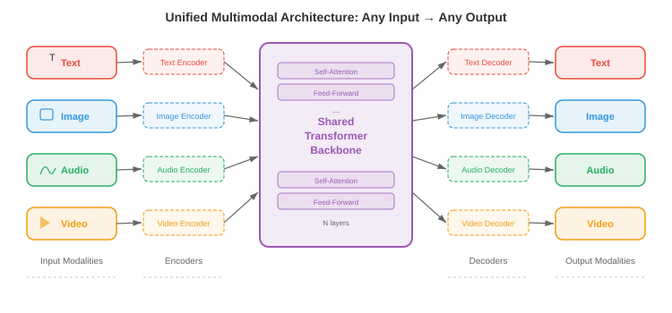
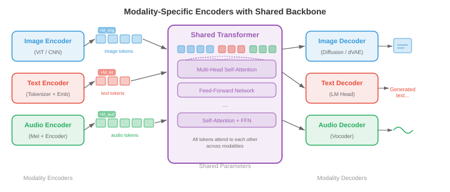
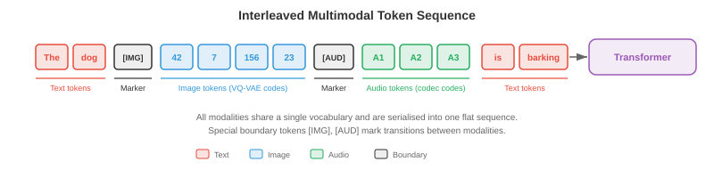
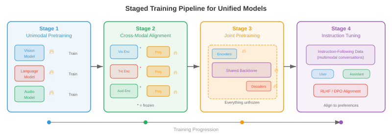
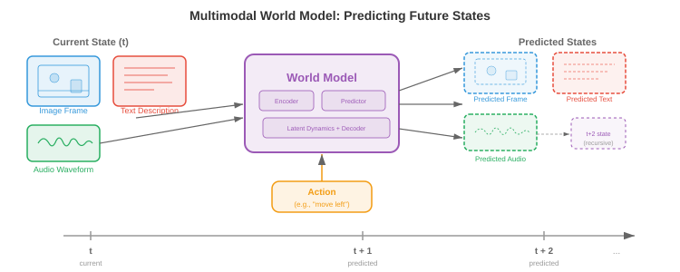

# 统一多模态架构

> **一句话总结**: 统一多模态架构用一个共享权重的模型代替一堆专家模型, 让文本、图像、音频、视频在同一次前向传播里读、想、生成。

*统一多模态架构用一个能跨文本、图像、音频、视频进行读取、推理、生成的单一系统, 替代多个各自为政的专家模型。本节涵盖任意到任意模型 (CoDi, NExT-GPT)、原生多模态大语言模型 (Gemini, GPT-4o)、多模态分词策略, 以及统一化在架构上的取舍。*

## 统一化的意义

- 想象一位会说五种语言的翻译, 能在一句话说到一半时无缝切换语言。早期多模态系统更像是五个翻译各自坐在不同房间里, 每人负责一种语言, 通过墙上一个小口互相递纸条。**统一多模态架构 (unified multimodal architecture)** 就是那个通晓多语的人: 一个共享权重的模型, 在一次前向传播里读、写、并对文本、图像、音频、视频乃至动作进行推理。

- 动机既实用又有理论支撑。实用层面: 为每一对模态 (文生图、图生文、音生文等) 维护单独的专家模型会带来组合爆炸, $k$ 个模态最多需要 $k(k-1)$ 条有向流水线。统一模型把它们全部压缩为一个系统。理论层面: 人类的认知不会把视觉与语言放在孤立模块里处理, 跨模态的绑定发生得早且深, 统一化正是要模仿这一点。

- 共享权重鼓励**跨模态迁移**。一个在文本里学到时间模式 (主语在动词前、原因在结果前) 的 Transformer, 可以把同样的注意力回路复用到视频里的时间模式 (物体先出现再运动), 或音频的时间模式 (先起音再持续)。这就是你在第 7 章语言模型微调、第 8 章 ImageNet 预训练里见过的迁移学习, 在多模态层面的对应物。

- 形式化地讲, 令 $\mathcal{M} = \{m_1, m_2, \ldots, m_k\}$ 为一组模态。一个统一模型定义单一带参数的函数 $f_\theta$, 把任意输入模态的子集映射到任意输出模态的子集:

$$f_\theta : \mathcal{P}(\mathcal{M}) \rightarrow \mathcal{P}(\mathcal{M})$$

- 其中 $\mathcal{P}(\mathcal{M})$ 是模态的幂集 (即所有子集)。关键约束在于 $\theta$ 大部分是共享的, 只有薄薄一层模态特定的适配层不同。



- 统一化的美好承诺伴随着一个根本张力: 不同模态在结构上差异巨大。文本是 1 维离散 token 序列。图像是 2 维连续像素网格。音频是 1 维连续波形, 时间尺度和文本又完全不同。视频则在图像之上再加一个时间轴。把这些结构迥异的东西调和成一条 Transformer 能消化的序列, 是这个领域最核心的工程挑战。

## 任意到任意模型

- 想象一个万能遥控器, 可以用同一个界面操作电视、空调、音响。**任意到任意模型 (any-to-any model)** 就是 AI 版本: 接受任意模态组合作为输入, 并产出任意模态组合作为输出。

- **CoDi (Composable Diffusion, 可组合扩散)** 通过训练模态特定的扩散模型, 再用共享的条件机制对齐它们的潜空间, 来实现任意到任意生成。每种模态有自己的扩散过程 (回想本章第 04 节讲的扩散模型), 但噪声预测网络接入一层联合的交叉注意力, 同时看到所有输入模态的嵌入。这样 CoDi 就能在一次前向里, 从文本提示同时生成一张图和配套音频。

- **NExT-GPT** 走了另一条路。它把一个大语言模型 (Large Language Model, LLM) 主干 (即"大脑") 通过轻量**投影层 (projection layers)** 分别接到输入端的模态编码器和输出端的模态解码器上。输入编码器 (如 CLIP 的图像编码器、CLAP 的音频编码器) 把每个模态转到 LLM 的嵌入空间。LLM 在混合后的 token 序列上推理, 并输出特殊的"模态信号 token"来把信息路由到相应的解码器 (如 Stable Diffusion 生图、AudioLDM 生音)。训练时只更新投影层, LLM 与专家编码器/解码器都冻结。

- **Gemini** (Google DeepMind) 从预训练开始就是原生多模态的。不像 NExT-GPT 那种"即插即用"的路线, Gemini 的 Transformer 从头训练, 输入是交错的文本、图像、音频、视频 token 序列。这意味着跨模态的注意力模式在预训练中自然生长, 而不是事后拼接上去的。它用 SentencePiece 对文本分词, 并学一个类似本章第 03 节讨论过的向量量化 (Vector Quantization, VQ) 方法的视觉分词器。

- **GPT-4o** ("o" 代表 "omni") 又代表另一种范式: 端到端模型, 所有模态共享同一个 Transformer 和同一个下一个 token 预测目标。音频输入被处理成谱 token, 图像处理成 patch token, 文本处理成子词 token, 全部塞进一条序列。模型产出的输出 token 由模态特定的解码头解码。它的关键创新是低延迟: 早期 GPT-4V 那种"自动语音识别 (Automatic Speech Recognition, ASR) → LLM → 文本转语音 (Text-to-Speech, TTS)" 的级联被砍掉了。


- 这些模型分布在一个整合深度的谱系上:

    - **浅整合** (NExT-GPT): 冻结的专家由训练过的适配器串起来。搭建快, 跨模态推理有限。
    - **中整合** (CoDi): 跨模态特定生成器共享条件。对齐更好, 但仍然模块化。
    - **深整合** (Gemini, GPT-4o): 单一模型在所有模态上端到端训练。跨模态推理最丰富, 训练也最昂贵。

## 模态特定编码器/解码器 + 共享主干

- 想象一座工厂: 只有一条装配线 (共享主干), 但为不同原料准备了不同的装卸区 (编码器), 为不同成品准备了不同的发货部门 (解码器)。每个装卸区都为它要处理的货物做了专门优化, 但一旦进入工厂, 一切都沿着同一条传送带前进。

- 统一模型的主流架构模式就是这种三段式结构:

    - **模态编码器 (modality encoders)** $E_m$, 把模态 $m$ 的原始输入转成一列嵌入向量 $\mathbf{h}_1^m, \mathbf{h}_2^m, \ldots, \mathbf{h}_{n_m}^m$, 每个维度为 $d$。
    - **共享 Transformer 主干 (shared transformer backbone)** $T_\theta$, 用自注意力处理来自所有输入模态的、拼接或交错的嵌入。
    - **模态解码器 (modality decoders)** $D_m$, 把主干输出的嵌入变回模态 $m$ 的原生形式 (文本 token、图像像素、音频波形)。

- 对文本, 编码器通常就是一个嵌入查找表 $E_\text{text}(w) = \mathbf{W}_e[w]$, 其中 $w$ 是 token 索引, 和你在第 7 章 Transformer 里见到的一模一样。对图像, 编码器常常是**视觉 Transformer (Vision Transformer, ViT)**, 把图像切成 patch 再线性投影每个 patch, 见第 8 章。对音频, 编码器先算梅尔频谱图, 再交给卷积前端或音频谱 Transformer (Audio Spectrogram Transformer, AST) 处理, 见第 9 章。

- 共享主干就是一个标准 Transformer, 自注意力横跨所有模态 token。给定拼接后的输入序列 $\mathbf{H} = [\mathbf{h}_1^{m_1}, \ldots, \mathbf{h}_{n_1}^{m_1}, \mathbf{h}_1^{m_2}, \ldots, \mathbf{h}_{n_2}^{m_2}]$, 自注意力让每个 token 都能看到其他所有 token, 无论来自哪个模态:

$$\text{Attention}(\mathbf{Q}, \mathbf{K}, \mathbf{V}) = \text{softmax}\left(\frac{\mathbf{Q}\mathbf{K}^\top}{\sqrt{d_k}}\right)\mathbf{V}$$

- 这就是第 7 章那个注意力公式, 只不过现在 $\mathbf{Q}$、$\mathbf{K}$、$\mathbf{V}$ 里装的是多种模态的 token。图像 patch 的 token 可以关注文本 token, 于是不需要单独的交叉注意力模块也能进行跨模态推理。

- 每个 token 会加上**模态嵌入 (modality embeddings)**, 让主干知道这个 token 来自哪个模态。这类似位置嵌入, 只不过编码的是模态身份而不是序列位置。一个可学习的向量 $\mathbf{e}_m \in \mathbb{R}^d$ 被加到模态 $m$ 的每个 token 上:

$$\tilde{\mathbf{h}}_i^m = \mathbf{h}_i^m + \mathbf{e}_m + \mathbf{p}_i$$

- 其中 $\mathbf{p}_i$ 是位置 $i$ 的位置嵌入。



## 多模态分词

- 想象你正在写一封信, 里面既有英文文字又有手绘草图。你可能先写一句话, 再画一个示意图, 然后写一句提到这个图的话, 又贴进一段乐谱。这封信就是一条把不同"模态"交错在一起的线性流。多模态分词做的正是这件事: 把文本、图像、音频、视频都变成一条扁平的 token 序列, 交给 Transformer 从左到右处理。

- 文本这边分词已经很成熟: **字节对编码 (Byte-Pair Encoding, BPE)** 或 SentencePiece 会产出一个子词 token 词表, 详见第 7 章。挑战在于把这套思路推广到连续模态。

- 图像有两大路线。**离散**路线用 VQ-VAE 或 VQ-GAN (细节见本章第 03 节) 把每张图映射为一列码本索引。若码本有 $|\mathcal{C}|$ 项、一张图编成 $n$ 个码, 图像就成了 $n$ 个从大小为 $|\mathcal{C}|$ 的词表里取的离散 token, 可直接与文本词表兼容。**连续**路线用 ViT 或卷积神经网络 (Convolutional Neural Network, CNN) 编码器产出 $n$ 个连续嵌入向量, 再线性投影到 Transformer 的嵌入维度。Gemini 和 GPT-4o 走连续路线的变体; 自回归图像生成器如 Parti 和 LlamaGen 则更爱离散路线。

- 音频通常先转为梅尔频谱图, 再用神经音频编解码器 (如 EnCodec、SoundStream, 输出多级离散 token) 离散化, 或用学过的编码器连续投影。举例来说, AudioLM 把音频表示为来自多层码本的离散 token 序列, 再自回归地建模。

- 视频的分词建立在图像之上, 但必须同时压缩时间维。常见策略是**3D VQ-VAE** (如 VideoGPT 或本章第 03 节的 Cosmos Tokeniser), 把时空 patch 量化为离散 token。时间压缩因子很关键: 24 fps 的原始视频若不做激进的时间下采样, 每秒产生的 token 数会多到爆表。

- 所有模态分完词后, 会被**交错 (interleave)** 成一条序列, 用特殊分隔 token 标记模态边界。典型格式如下:

```
[TEXT] The cat sits on a mat [/TEXT] [IMAGE] <img_tok_1> <img_tok_2> ... <img_tok_n> [/IMAGE] [AUDIO] <aud_tok_1> ... <aud_tok_m> [/AUDIO]
```

- 然后 Transformer 用它标准的因果 (或双向) 注意力机制处理整条混合序列。模态分隔 token 身兼两职: 既告诉模型模态在哪里换, 又充当"池化点", 它们的表示汇总了每一段模态的信息。



- 一个关键设计取舍是**token 预算 (token budget)**。一张图分成 256 个 token、一段 50 个 token 的文字说明, 意味着图像吃掉了 5 倍于文本的上下文窗口。模型必须在分辨率 (更多 token = 更多细节) 与上下文长度 (更多 token = 更高内存和算力开销) 之间权衡。**Token 合并** (逐步把相似 token 合成一个)、**自适应分词** (简单区域用少 token、复杂区域用多 token) 等技术有助于管理这个取舍。

## 训练配方: 分阶段预训练与联合微调

- 你不会在教一个孩子算术之前先教他微积分。同理, 你也不能把一个统一多模态模型从随机初始化就同时训练所有模态还指望它收敛得好。主流做法是**分阶段训练 (staged training)**, 让模型在精心设计的顺序中逐步学到更复杂的跨模态能力。

- **阶段 1: 单模态预训练。** 每个模态编码器在大规模单模态数据集上独立训练。文本主干按标准语言建模目标 (下一个 token 预测) 在数万亿文本 token 上预训练, 完全照第 7 章的路子。视觉编码器按图像分类或自监督目标 (掩码自编码器 MAE、DINO) 预训练, 照第 8 章。音频编码器按语音识别或音频分类数据预训练, 照第 9 章。这个阶段产出强壮的单模态特征抽取器。

- **阶段 2: 跨模态对齐。** 把预训练好的编码器接到共享主干上, 用配对多模态数据 (图像-字幕对、音频-转录对) 训练, 采用对比或生成目标。这个阶段编码器权重可以先冻结 (保住单模态知识), 只更新投影层和主干。CLIP 风格的对齐 (本章第 01 节) 就是在这一阶段被并入统一模型的。

- **阶段 3: 联合多模态预训练。** 解冻全部 (或大部分) 参数, 在单模态和多模态数据混合上、用单一下一个 token 预测目标、跨全部模态 token 训练。损失函数是:

$$\mathcal{L} = -\sum_{t=1}^{T} \log p_\theta(x_t \mid x_{<t})$$

- 其中 $x_t$ 可以是文本 token、图像 token 或音频 token。模型必须不分模态地预测下一个 token, 这就逼它长出真正的跨模态理解。

- **阶段 4: 指令微调与对齐。** 预训练好的模型在精心筛选的、包含多模态指令的指令跟随数据集上微调 (例如 "详细描述这张图"、"这段视频里发出什么声音?"、"生成一张 X 的图片")。这个阶段常用**基于人类反馈的强化学习 (Reinforcement Learning from Human Feedback, RLHF)** 或直接偏好优化 (Direct Preference Optimization, DPO) 把模型输出对齐到人类偏好。

- 阶段内还会用**模态特定预热 (modality-specific warm-up)** 来防止模态坍塌。若一个模态 (通常是训练数据最多的文本) 主导了梯度信号, 模型可能"遗忘"更弱的模态。预热策略包括:

    - **梯度平衡**: 缩放每个模态的梯度, 让它们对参数更新贡献相当。
    - **数据比例调度**: 逐步提高多模态数据相对于单模态数据的占比。
    - **损失加权**: 给每个模态分配权重 $\lambda_m$, 总损失为 $\mathcal{L} = \sum_m \lambda_m \mathcal{L}_m$, 通过调 $\lambda_m$ 平衡各模态学习速率。



- **为什么不能跳过阶段?** 从零开始联合训练一切听着很诱人, 但实际会栽跟头, 原因有几个。第一, 模型得同时学低层特征 (边缘检测、音素识别) 和高层跨模态推理, 二者学习动力学差得远。第二, 各模态数据分布严重不均衡 (万亿级文本 token vs. 十亿级图像 token vs. 亿级音频片段)。第三, 优化地形高度非凸, 分阶段训练提供了一条"课程", 引导模型走向更好的盆地, 类似第 6 章的课程学习思想。

## 多模态思维链推理

- 你在解几何题时, 可能会画个图、标出角度、写出方程、再一步步求解。你不会从题面直接跳到答案。**多模态思维链 (multimodal chain-of-thought, CoT) 推理**让模型也能这样干: 在到达最终答案之前, 先生成中间推理步骤, 这些步骤可能涉及文本、视觉标注乃至生成的示意图。

- 纯文本 CoT (见第 7 章提示策略) 里, 模型用自然语言生成一列推理步骤。多模态 CoT 拓展了这一点, 允许中间步骤引用或生成视觉内容。例如, 给一张图表和问题"哪一年销售额最高?", 一个多模态 CoT 模型可能先描述图表 ("这张图展示了 2018 到 2023 年的销售..."), 再指出相关视觉特征 ("最高的柱子出现在 2021..."), 最后输出答案 ("2021")。

- 形式化地, 令 $\mathbf{x}$ 为多模态输入, $y$ 为目标答案。标准预测直接建模 $p(y \mid \mathbf{x})$。思维链引入中间推理 $\mathbf{r} = (r_1, r_2, \ldots, r_L)$, 把预测分解成:

$$p(y \mid \mathbf{x}) = \sum_{\mathbf{r}} p(y \mid \mathbf{r}, \mathbf{x}) \cdot p(\mathbf{r} \mid \mathbf{x})$$

- 实际中, 这个求和用贪心或束搜索在推理链上近似。推理步骤 $r_i$ 可以是文本 token、对图像区域的引用, 甚至是生成的视觉 token (例如覆盖在输入图上的边界框标注)。

- **训练多模态 CoT** 通常需要人类标注员为数据集写出逐步的多模态推理轨迹, 再在这些轨迹上微调模型。有些做法从更大的教师模型蒸馏 CoT 能力: 教师为大规模数据集生成推理轨迹, 学生小模型在输入与教师轨迹上一起训练。

- 多模态 CoT 对以下任务尤其强悍: **空间推理** (如"红球是不是在蓝方块的左边?")、**基于示意图的数学推理** (如几何题)、以及答案依赖于结合图中多个区域信息的**多步视觉问答**。

## 多模态智能体

- 想象厨房里的一位机器人厨师。它看着台面上的食材 (视觉)、读着平板上的菜谱 (文本)、听着定时器的响声 (音频), 然后动手拿刀切洋葱 (动作)。**多模态智能体 (multimodal agent)** 就是数字版的这位厨师: 一个通过多种模态感知世界、思考做什么、然后基于感知采取动作的模型。

- 智能体循环遵循经典的**观察-推理-行动 (observe-reason-act)** 循环:

    1. **观察**: 智能体从环境接收多模态输入 (截图、用户的语音指令、视频流)。
    2. **推理**: 统一模型处理多模态输入, 可能借助思维链规划一系列步骤。
    3. **行动**: 模型输出一个动作 (一句文字回复、一次工具调用、一次坐标 $(x, y)$ 的鼠标点击、一条机器人电机指令)。

- **工具使用 (tool use)** 是多模态智能体的一项关键能力。模型被训练成能识别自己回答不了某个问题、必须调用外部工具的时刻: 计算器、代码解释器、网页浏览器、搜索引擎等。模型在输出 token 序列里生成一个结构化的工具调用 (例如 `search("current weather in London")`), 系统执行调用, 结果作为附加输入 token 反馈给模型继续处理。

- **视觉定位 (visual grounding)** 把语言连接到图像或视频里的具体区域。当智能体说"点击右上角的蓝色按钮"时, 它必须把"右上角的蓝色按钮"这句话定位到像素坐标。架构上通常这样做: 训练模型把边界框坐标作为特殊 token 输出, 或让模型对图像产出一张热力图指示被指的区域。这把本章第 02 节 (视觉-语言模型 (Vision-Language Model, VLM)) 讨论过的定位与指代工作, 拓展到了动作领域。

- **网页智能体 (web agents)** 如 WebVoyager 与 SeeAct 展示了多模态智能体在网页上的导航能力。智能体接收网页截图, 识别出可交互元素 (按钮、文本框、链接), 输出动作 (点击、输入、滚动) 来完成用户指定的目标。核心挑战是巨大的动作空间: 一个典型网页有数以百计的可点击目标。


- **具身智能体 (embodied agents)** 把这套东西拓展到物理环境。装有摄像头和麦克风的机器人接收视觉与音频输入, 通过统一模型处理后输出电机指令。像 PaLM-E (Google) 这样的项目, 把机器人的传感器数据直接嵌入语言模型的 token 序列, 让机器人能按照"拿起碗旁边的绿色方块"这样的指令行动: 把指令与视觉观察对齐, 生成一列电机动作。

- 智能体的训练配方在标准分阶段预训练之上再加一段**强化学习 (Reinforcement Learning, RL)**。智能体与环境 (模拟桌面、网页浏览器、机器人模拟器) 交互, 完成任务时获得奖励, 用 PPO 或 REINFORCE 等算法更新策略。奖励信号通常稀疏 (任务成功 = 1, 否则 = 0), 让这个优化很棘手, 强烈依赖多模态预训练提供的先验。

## 基准与评测

- 评测一个能看、能听、能读、能行动的模型, 需要一整套多样化的基准。没有单一指标能覆盖多模态能力, 所以领域内靠一堆专门的评测组合。

- **MMLU (Massive Multitask Language Understanding, 大规模多任务语言理解)** 测试跨 57 个学科的知识。虽然它本来是纯文本的, 但常作为基线: 一个统一多模态模型不该在获得视觉能力后丢掉文本能力。多模态训练后 MMLU 掉分, 就是灾难性遗忘的信号。

- **MMBench** 从 20 个细粒度能力维度评测视觉-语言理解, 包括属性识别、空间关系理解、光学字符识别 (Optical Character Recognition, OCR)。每题给一张图和一道选择题, 系统地检验模型是不是真的看懂了图, 还是靠纯文本捷径蒙对。

- **SEED-Bench** 提供 19,000 道选择题, 覆盖图像与视频理解的 12 个评测维度。它特别测时间理解 (给定一帧, 之前/之后发生了什么) 和组合推理 (综合多个视觉属性)。

- **MM-Vet** 通过要求模型在一道题里同时用到多种技能 (识别、OCR、空间感、语言生成、知识检索) 来评测综合多模态能力。

- **MathVista** 测视觉输入上的数学推理: 几何示意图、统计图表、函数图、科学图。这个基准专门瞄准多模态思维链能力。

- **视听基准**如 AVQA (Audio-Visual Question Answering, 视听问答) 测模型能不能推理它看到的和听到的之间的关系。例如: "在说话的那个人是左边的还是右边的?"

- **智能体基准**如 WebArena、OSWorld、SWE-bench, 评测在交互式环境里完成任务的能力。指标通常是成功率: 智能体正确完成的任务占多大比例? 这些基准特别难, 因为需要长时段规划和错误恢复。

- **整体评测**框架如 LMSYS Chatbot Arena, 用人类偏好判断做两两对比。两个模型看到同一多模态输入, 人类裁判选哪个回复更好。用数千次这种对比算出 Elo 评分, 得到一个与整体模型质量相关性不错的标量。

- 多模态评测里一个长期头痛的问题是**数据污染 (data contamination)**: 这些模型在互联网规模数据上训练, 基准里的图和题可能出现在训练集里。仔细去重与设立留出测试集是必不可少但并不完美的防线。

## 世界模型

- 闭上眼睛, 想象一下把一个玻璃杯推下桌沿会发生什么。你"看到"它掉下去、"听到"碎裂声、"感觉"这是个坏主意。你的大脑在跑一个**世界模型 (world model)**: 对环境的物理与因果结构的内部模拟, 能跨模态预测未来状态。

- 在 AI 语境里, 世界模型是一个学到的函数, 给定当前状态和动作, 预测世界的下一个状态:

$$\hat{s}_{t+1} = g_\phi(s_t, a_t)$$

- 其中 $s_t$ 是当前状态表示 (可能包含视觉、听觉、本体感觉信息), $a_t$ 是动作, $\hat{s}_{t+1}$ 是预测的下一个状态。状态 $s_t$ 活在一个学到的潜空间里, 而不是原始像素空间, 这让预测问题变得可行。

- **视频预测模型**如 Sora (OpenAI) 与 Genie (Google DeepMind) 代表着通往世界模型的一大步。它们能在文本提示和/或动作序列条件下生成时间上连贯的视频帧。虽然常常被当作视频生成器讨论, 但底层能力更像世界模拟: 模型已经内化了足够多的物理 (重力、碰撞、遮挡、流体动力学), 能渲染出可信的未来。

- 与多模态架构的关联很深。只预测像素的世界模型是有限的, 真正有用的世界模型要跨模态预测。如果你推那个玻璃杯, 世界模型应该预测视觉轨迹 (杯子落下)、听觉事件 (杯子碎裂)、以及语义后果 (你现在地上有一堆碎玻璃)。统一多模态架构天生适合当世界模型, 因为它们已经把所有模态放在共享空间里表示了。

- 形式化地, 多模态世界模型的目标是:

$$\mathcal{L}_\text{world} = \mathbb{E}\left[\sum_{m \in \mathcal{M}} \lambda_m \| s_{t+1}^m - g_\phi^m(s_t, a_t) \|^2 \right]$$

- 其中 $s_{t+1}^m$ 是模态 $m$ 的真实下一状态表示, $g_\phi^m$ 是世界模型的模态特定预测头。共享的潜在动力学 $g_\phi$ 在联合多模态空间里演化, 模态特定的头把预测解码回各模态的原生格式。



- **JEPA (Joint Embedding Predictive Architecture, 联合嵌入预测架构)**, 由 Yann LeCun 提出, 是一种避开像素级预测陷阱的世界模型框架。它不预测原始像素 (那会把容量浪费在无关细节比如具体纹理上), 而是在嵌入空间预测。模型学一个把观测映到嵌入的编码器, 以及一个预测未来嵌入的预测器:

$$\hat{\mathbf{z}}_{t+1} = h_\psi(\mathbf{z}_t, a_t), \quad \mathbf{z}_t = \text{Enc}(s_t)$$

- 损失比较的是嵌入而不是原始观测, 这对感知混淆更鲁棒 (许多不同的像素配置可能对应同一个语义状态)。对多模态世界模型这条路尤其有前景, 因为它天然运行在统一架构本就提供的共享嵌入空间里。

- 世界模型的实用价值远超学术兴趣。在**基于模型的强化学习 (model-based RL)** 里, 智能体用自己的世界模型"想象"动作的后果再决定要不要做, 大幅减少所需的真实交互次数 (回想第 11 章基于模型 RL 的讨论)。在**自动驾驶**里, 世界模型预测在不同方向盘决策下, 场景在接下来几秒会怎么演变。在**机器人**里, 世界模型让机器人在真正执行之前, 先在脑子里排演一遍操作序列。

- 世界模型研究的前沿正走向**交互式世界模型**: 实时运行、能响应任意用户动作, 本质上是完全从数据里学出来的通用模拟器。Genie 2 (Google DeepMind) 在 3D 环境里展示了这一点: 给一张图, 它生成一个可交互、可控的 3D 世界, 用户可以在里面探索。世界模型与统一多模态架构的合流暗示了一个未来: 单一模型能跨所有模态感知、预测、模拟并行动。

## 编程任务 (用 CoLab 或 notebook)

**任务 1: 搭一个极简的多模态 token 交错器**

- 写一个函数, 接收一段文本字符串和一张假的"图片" (小的 2D 数组), 把它们分词后的表示交错成一条扁平序列, 并加上模态嵌入。

```python
import jax
import jax.numpy as jnp

# 模拟多模态分词: 文本 token + "图像 patch" token
def interleave_modalities(text_tokens, image_patches, embed_dim=32, key=jax.random.PRNGKey(0)):
    """把文本与图像 token 用可学习的模态嵌入交错在一起。"""
    k1, k2, k3 = jax.random.split(key, 3)
    n_text = text_tokens.shape[0]
    n_img = image_patches.shape[0]
    # 随机投影矩阵 (代替真实编码器)
    W_text = jax.random.normal(k1, (text_tokens.shape[-1], embed_dim)) * 0.02
    W_img = jax.random.normal(k2, (image_patches.shape[-1], embed_dim)) * 0.02
    # 模态嵌入: 文本一个, 图像一个
    mod_emb = jax.random.normal(k3, (2, embed_dim)) * 0.02
    text_embs = text_tokens @ W_text + mod_emb[0]  # (n_text, embed_dim)
    img_embs = image_patches @ W_img + mod_emb[1]   # (n_img, embed_dim)
    # 交错: 先 [IMG] token, 再 [TEXT] token (类似 LLaVA)
    combined = jnp.concatenate([img_embs, text_embs], axis=0)
    print(f"Combined sequence: {n_img} image + {n_text} text = {combined.shape[0]} tokens")
    return combined

# 试一下: 5 个文本 token (维度 16) + 4 个图像 patch (维度 64)
text = jax.random.normal(jax.random.PRNGKey(1), (5, 16))
image = jax.random.normal(jax.random.PRNGKey(2), (4, 64))
seq = interleave_modalities(text, image)
# 实验: 改 embed_dim、调换交错顺序、加第三种模态
```

**任务 2: 可视化跨模态注意力模式**

- 造一个合成的多模态序列, 计算自注意力分数, 看看图像 token 怎么关注文本 token, 反之亦然。

```python
import jax
import jax.numpy as jnp
import matplotlib.pyplot as plt

def cross_modal_attention(n_text=6, n_img=4, d=32, key=jax.random.PRNGKey(42)):
    """计算并可视化文本与图像 token 之间的注意力。"""
    k1, k2, k3 = jax.random.split(key, 3)
    # 模拟两个模态的 token 嵌入
    text_embs = jax.random.normal(k1, (n_text, d))
    img_embs = jax.random.normal(k2, (n_img, d))
    seq = jnp.concatenate([img_embs, text_embs], axis=0)  # (n_img+n_text, d)
    # 学到的 Q, K 投影
    Wq = jax.random.normal(k3, (d, d)) * 0.1
    Wk = jax.random.normal(jax.random.PRNGKey(99), (d, d)) * 0.1
    Q, K = seq @ Wq, seq @ Wk
    scores = Q @ K.T / jnp.sqrt(d)
    attn = jax.nn.softmax(scores, axis=-1)
    # 画图
    labels = [f"img_{i}" for i in range(n_img)] + [f"txt_{i}" for i in range(n_text)]
    fig, ax = plt.subplots(figsize=(7, 6))
    ax.imshow(attn, cmap="viridis")
    ax.set_xticks(range(len(labels))); ax.set_xticklabels(labels, rotation=45, fontsize=8)
    ax.set_yticks(range(len(labels))); ax.set_yticklabels(labels, fontsize=8)
    ax.set_xlabel("Key (attended to)"); ax.set_ylabel("Query (attending from)")
    ax.set_title("Cross-modal self-attention map")
    plt.colorbar(ax.images[0], ax=ax, shrink=0.8)
    plt.tight_layout(); plt.show()

cross_modal_attention()
# 实验: 加大 d、加因果掩码, 观察注意力模式如何变化
```

**任务 3: 用模态特定损失加权模拟分阶段训练**

- 演示模态特定的损失权重如何影响一个玩具多模态训练循环。观察损失平衡如何防止某一模态一家独大。

```python
import jax
import jax.numpy as jnp
import matplotlib.pyplot as plt

def staged_training_sim(steps=200, key=jax.random.PRNGKey(7)):
    """模拟带可调模态损失权重的多模态训练。"""
    # 两个'模态', 损失尺度不同 (文本损失约为图像损失的 10 倍)
    losses_text, losses_img = [], []
    param = jnp.array([0.0, 0.0])  # 由两个模态损失共同更新的共享参数
    lr = 0.05
    # 试着改这些权重, 看它对收敛平衡的影响
    lambda_text, lambda_img = 1.0, 5.0  # 上调较弱模态的权重

    for step in range(steps):
        k1, k2, key = jax.random.split(key, 3)
        noise_t = jax.random.normal(k1, ()) * 0.3
        noise_i = jax.random.normal(k2, ()) * 0.1
        loss_t = (param[0] - 3.0) ** 2 + noise_t  # 文本目标 = 3.0
        loss_i = 0.1 * (param[1] - 1.0) ** 2 + noise_i  # 图像目标 = 1.0 (尺度更小)
        # 加权的组合梯度
        grad_t = lambda_text * 2 * (param[0] - 3.0)
        grad_i = lambda_img * 0.2 * (param[1] - 1.0)
        param = param - lr * jnp.array([grad_t, grad_i])
        losses_text.append(float(loss_t)); losses_img.append(float(loss_i))

    fig, ax = plt.subplots(figsize=(8, 4))
    ax.plot(losses_text, label=f"Text loss (weight={lambda_text})", alpha=0.7)
    ax.plot(losses_img, label=f"Image loss (weight={lambda_img})", alpha=0.7)
    ax.set_xlabel("Training step"); ax.set_ylabel("Loss"); ax.legend()
    ax.set_title("Modality loss balancing during staged training")
    plt.tight_layout(); plt.show()

staged_training_sim()
# 实验: 把 lambda_img 设为 1.0, 看图像损失收敛慢多少
```

---

## 📌 本节要点

- **统一多模态架构**: 一个共享权重的模型跨文本、图像、音频、视频进行读写与推理, 取代 $k(k-1)$ 条模态对流水线。
- **任意到任意模型**: CoDi 用共享条件对齐扩散模型, NExT-GPT 靠冻结 LLM + 投影层, Gemini 与 GPT-4o 走原生端到端。
- **整合深度谱系**: 浅整合速度快跨模态弱, 深整合推理最强但训练最贵。
- **三段式结构**: 模态编码器 → 共享 Transformer 主干 → 模态解码器, 加模态嵌入区分 token 来源。
- **多模态分词**: 用离散码本或连续投影把图像/音频/视频转成扁平 token 序列, 靠分隔符标记模态边界。
- **Token 预算权衡**: 分辨率与上下文长度的取舍, 靠 token 合并与自适应分词管理。
- **分阶段训练**: 单模态预训练 → 跨模态对齐 → 联合预训练 → 指令微调, 加梯度平衡防模态坍塌。
- **多模态思维链**: 用可能含视觉标注的中间推理步骤代替直接输出答案, 尤其擅长空间与图表数学题。
- **多模态智能体**: 观察-推理-行动循环 + 工具调用 + 视觉定位, 网页与具身场景均可用。
- **世界模型**: 在潜空间预测跨模态未来状态, JEPA 在嵌入空间预测比像素级更鲁棒, 是通用模拟器的雏形。
