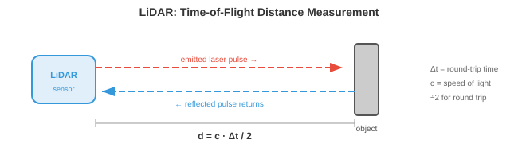
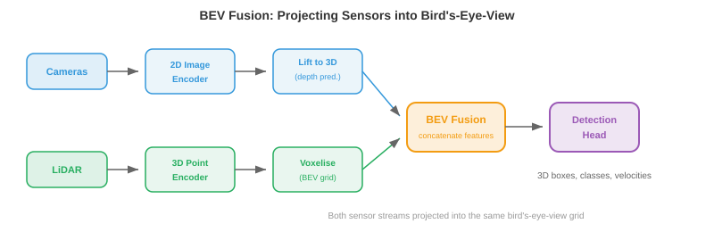
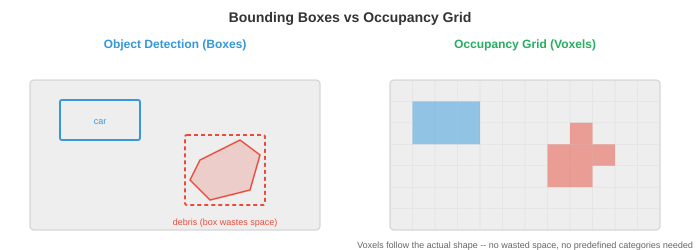

# 感知

> **一句话总结**：感知是自主系统用传感器把原始数字转成"前方 12 米有个行人在往左走"的世界理解，涉及传感器融合、点云、深度、占用与语义地图。

## 🗺️ 本章导览

- 本章覆盖自主系统：感知 → 机器人学习 → VLA → 自动驾驶 → 极端环境机器人
- **01. 感知** (本节)：传感器融合、点云、语义占用
- **02. 机器人学习**：模仿学习、BC、DAgger、Diffusion Policy
- **03. 视觉-语言-动作模型**: VLA、RT-1/RT-2、机器人基础模型
- **04. 自动驾驶**：感知 → 预测 → 规划管线，端到端方案
- **05. 太空与极端环境机器人**：火星车、深海、灾害救援

*感知是自主系统"感觉并解释物理世界"的方式。 本节涵盖传感器模态、标定、传感器融合、3D 目标检测、深度估计、占用网络、车道线检测与语义建图 —— 这是每一台机器人、无人机与自动驾驶汽车所依赖的感官底座.*

- 对人类来说，感知世界毫不费力：你看到一辆车驶来，听到引擎声，感受到脚下的地面，瞬间就在脑中构建出对周围环境的心智模型。 自主系统必须做同样的事，只不过用的是电子传感器与算法，而不是眼睛和耳朵。

- 根本挑战是：传感器给你的是一堆原始数字 (像素强度、点云、信号反射)，系统必须把这些数字变成结构化的理解 —— "前方 12 米有一位行人，正以 1.5 m/s 向左移动." 这就是感知问题。

- 下游的一切 (预测、规划、控制) 都依赖感知。 一辆有着完美规划器但感知糟糕的自动驾驶汽车，照样会撞车。 感知就是瓶颈。

## 传感器模态

- 自主系统会用多种传感器，每种都有不同的长处与失效模式。 单靠任何一种传感器都不够。


- **相机 (Cameras)** 以高分辨率捕捉稠密的彩色信息。 一张图像包含数百万像素，每个像素记录 RGB 值 (如第 8 章所讲). 相机便宜、轻便，能提供丰富的纹理与色彩信息 —— 这对识别路牌、检测红绿灯、辨认物体来说是必不可少的。

- 相机类型包括 **单目 (monocular)** (单镜头，无原生深度)、**双目 (stereo)** (两枚镜头相隔一段基线，借视差恢复深度，见第 8 章)，以及 **鱼眼 (fisheye)** (超宽视场，180° 以上，带严重径向畸变，用于全景泊车).

- 相机的主要短板是：投影过程中丢失了深度信息。 三维场景通过针孔相机模型 (回忆第 8 章的内参矩阵 $K$) 被映射到二维像平面:

$$\begin{bmatrix} u \\ v \\ 1 \end{bmatrix} = \frac{1}{Z} K \begin{bmatrix} X \\ Y \\ Z \end{bmatrix}$$

- 除以 $Z$ 就把绝对深度抹掉了。 两个大小不同、距离不同的物体，可能在图像上产生一模一样的投影。 从单张图像恢复深度是病态问题 (ill-posed)，这就是为什么要么上双目，要么用学出来的单目深度模型。

- 相机在恶劣条件下也吃力：直射阳光会眩光，黑暗会削弱信号，雨雾会散射光线。

- **激光雷达 (Light Detection and Ranging, LiDAR)** 发射激光脉冲，测量每个脉冲反弹回来的时间。 由于光速已知 ($c \approx 3 \times 10^8$ m/s)，到每个反射点的距离是:

$$d = \frac{c \cdot \Delta t}{2}$$



- 除以 2 是因为要算往返 (去一趟回一趟). 通过让激光扫过整个场景，LiDAR 构建出 **点云 (point cloud)**：一组三维坐标 $(x, y, z)$，通常还带强度 (反射率) 值。

- **旋转式激光雷达 (spinning LiDAR)** (例如 Velodyne) 让激光阵列旋转 360° 生成完整环视。 典型设备每秒能产生 30 万个以上的点，分布在 64–128 条垂直通道上。 结果是一个稀疏但几何上很准确的三维场景表示。

- **固态激光雷达 (solid-state LiDAR)** 没有运动部件，改用光学相控阵或 MEMS 微镜。 这让它更便宜、更紧凑、更可靠，但视场通常更窄 (120° 对比 360°).

- LiDAR 给的是精准深度，但数据稀疏 (远比相机的"像素"少)、没有颜色信息，而且昂贵。 大雨、大雪、扬尘下性能也会下降，因为颗粒会散射激光脉冲。

- **毫米波雷达 (Radio Detection and Ranging, Radar)** 与 LiDAR 用的是同一种飞行时间原理，只不过换成了无线电波 (毫米波，汽车上常用 77 GHz). 无线电波穿透雨、雾、尘、雪的能力远比光好，使雷达成为最抗天气的传感器。

- 雷达还能借 **多普勒效应 (Doppler effect)** 直接测速。 当物体向传感器靠近时，反射波被压缩 (频率变高)；远离时被拉伸 (频率变低). 速度是:

$$v = \frac{\Delta f \cdot c}{2 f_0}$$

- 其中 $\Delta f$ 是频率偏移，$f_0$ 是发射频率。 这样就能拿到瞬时径向速度，不需要任何跟踪或跨帧计算。

- 代价是分辨率：雷达的角分辨率比相机或 LiDAR 粗得多，分不清挨得近的物体，也看不清细节。 它擅长在任何天气下检测远距离 (200 米以上) 的车辆。

- **超声波传感器 (ultrasonic sensors)** 发出高频声波脉冲 (40–70 kHz)，测量回声返回时间。 它们只在很近的距离 (0.2–5 米) 工作，主要用于泊车辅助。 物理原理与 LiDAR 一样，只是把光换成了声音，所以 $d = \frac{v_{\text{sound}} \cdot \Delta t}{2}$，其中 $v_{\text{sound}} \approx 343$ m/s.

- **惯性测量单元 (Inertial Measurement Unit, IMU)** 含加速度计与陀螺仪，分别测量线加速度与角速度。 IMU 提供高频运动数据 (通常 200–1000 Hz)，填补慢速传感器更新之间的空白。 它不直接感知环境，而是跟踪机器人自身的运动，对航迹推算与状态估计至关重要。

- IMU 会 **漂移 (drift)**：微小的测量误差随时间累积，导致估计位置偏离真实。 这就是为什么 IMU 几乎总是与其他传感器 (相机、GPS、LiDAR) 融合使用，而不是单打独斗。

- **全球导航卫星系统 (Global Navigation Satellite Systems, GNSS)** (含 GPS) 通过对多颗卫星信号做三角定位，给出地表上的绝对位置。 标准 GPS 精度是 2–5 米，无法满足车道级驾驶的要求。 **实时动态差分定位 (Real-Time Kinematic, RTK-GPS)** 借助固定基站修正误差，可以做到厘米级精度，但要求天空开阔，也需要基站基础设施。

## 传感器标定

- 各种传感器要协同工作，就必须先 **标定 (calibrate)**：每个传感器的测量都要能对齐到一个共同的坐标系。

- **内参标定 (intrinsic calibration)** 确定传感器的内部参数。 对相机来说，就是焦距、主点与畸变系数 (见第 8 章). 对 LiDAR 来说，就是各条激光束之间的精确角度偏移。 一种常见方法是张正友棋盘格标定 (Zhang's checkerboard calibration)：用一个已知的平面图案从多个角度拍摄，反解出内参矩阵。

- **外参标定 (extrinsic calibration)** 确定两个传感器之间的刚体变换 (旋转 $R$ 与平移 $\mathbf{t}$). 如果一台相机和一台 LiDAR 装在同一辆车上，外参标定就要找出那个 $4 \times 4$ 变换矩阵，把点从 LiDAR 坐标映射到相机坐标:

$$\mathbf{p}_{\text{cam}} = \begin{bmatrix} R & \mathbf{t} \\ \mathbf{0}^T & 1 \end{bmatrix} \mathbf{p}_{\text{lidar}}$$

- 这是齐次坐标下的仿射变换，正是我们在第 2 章 (线性变换) 学过的那一类。 这个矩阵算错了，LiDAR 点就会投影到错误的像素上，整条融合流水线随之崩塌。

- **时间标定 (temporal calibration)** 同步各传感器的时钟。 一台 30 Hz 采样的相机与一台 10 Hz 的 LiDAR 产生的数据时间戳不同。 若车辆以 30 m/s (高速公路速度) 行驶，10 ms 的时序误差就对应 30 cm 的空间误差。 硬件触发 (共享时钟脉冲) 或软件同步 (时间戳之间做插值) 都是必要手段。

## 传感器融合

- 单一传感器覆盖不了所有工况。 相机能看到颜色和纹理但丢深度；LiDAR 能精准测深度但稀疏且色盲；雷达在任何天气下都能工作但分辨率差。 **传感器融合 (sensor fusion)** 综合它们的长处，补上各自的短板。

- **早期融合 (early fusion)** (也叫数据级融合) 在任何处理之前就把原始传感器数据合起来。 例如把 LiDAR 点投影到相机图上，生成 RGBD 表示 (每像素带颜色 + 深度)，或者用相机像素颜色给每个 LiDAR 点着色。 这样保留的信息最多，但要求精确标定，对错位极为敏感。

- **后期融合 (late fusion)** (也叫决策级融合) 让每个传感器各走各的检测管线，再把最终输出 (边界框、类别标签、置信度分数) 合并。 每个传感器投票，融合模块调解分歧。 这样更简单也更模块化，但每条管线拿不到别的传感器的原始数据。

- **中级融合 (mid-level fusion)** 在中间的特征表示上做融合。 每个传感器的原始数据先被编码到一个学出来的特征空间 (用卷积神经网络 (Convolutional Neural Network, CNN) 或 Transformer)，再把特征合起来。 这是现代系统的主流做法，因为它让网络自己去学从每种模态里抽什么。



- **BEVFusion** (Liu 等，2023, arXiv:2205.13542) 是中级融合的代表架构。 关键设计是两条模态分支 **并行 (in parallel)** 各自把自己的原始数据编码成同一张 **鸟瞰图 (bird's-eye-view, BEV)** 网格上的特征图，再在 BEV 空间里对齐、沿通道维做 **拼接 (concatenate)**，交给融合卷积与检测头。 严格顺序是 "相机 lift-to-BEV + LiDAR encode-to-BEV → concat → fuse"，两条分支互不阻塞。

- **相机分支 (camera branch)**：多路 2D 图像先过一个共享的 2D 编码器 (例如 ResNet 或 Swin) 抽特征，再借 **Lift-Splat-Shoot** 风格的做法给每个像素预测一份离散深度分布 $\alpha(u,v,d)$；把 2D 特征沿相机射线按深度权重"抬升 (lift)"到 3D 特征云，最后把这团 3D 特征"铺 (splat)"到 BEV 网格上，得到相机 BEV 特征图 $F^{\text{BEV}}_{\text{cam}}$.

- **LiDAR 分支 (LiDAR branch)**: LiDAR 点云不是天然 BEV，也要走一遍编码器。 常见流程是体素化 (voxelize) 或柱化 (pillarize) 后，用 3D 稀疏卷积骨干 (VoxelNet/SECOND) 或 PointPillars 编码，再沿高度轴压平到 2D，得到 LiDAR BEV 特征图 $F^{\text{BEV}}_{\text{lidar}}$. "点云已经是 3D" 只是坐标是 3D，特征仍需学出来。

- **对齐与融合 (align & fuse)**：两条分支的 BEV 特征图落在同一米制网格里，直接沿通道维 concat 成 $[F^{\text{BEV}}_{\text{cam}}; F^{\text{BEV}}_{\text{lidar}}]$，再经几层 2D 卷积 (BEV 编码器) 做跨模态融合，最后送进检测头。 这种"先各自到 BEV，再 concat"的顺序让相机分支的可微 lift 操作不必等 LiDAR，训练与推理都能并行，而且任一模态失效时另一条仍能出 BEV 特征，优雅退化。

- BEV 表示之所以强大，是因为它提供了一个统一的、带米制尺度的坐标系，在里面做空间推理 (距离、大小、重叠) 非常直白。 在相机图像里，近处的自行车和远处的卡车可能占同样多像素；在 BEV 里，它们真实的大小与位置一目了然。

## 3D 目标检测

- 感知的核心任务就是在 3D 里检测物体：它们在哪里、多大、是什么、朝向哪。 每一个检测都是一个 **3D 边界框 (3D bounding box)**，带位置 $(x, y, z)$、尺寸 $(l, w, h)$、朝向角 $\theta$、类别标签与置信度分数。

- **基于 LiDAR 的检测**直接在点云上做。 难点在于点云无序、不规则，且密度差异极大 (近处物体有几千个点，远处物体只剩几个). 回忆第 8 章，PointNet 用共享的多层感知机 (Multi-Layer Perceptron, MLP) 加上一个置换不变的聚合 (最大池化) 来处理这种情况。

- **PointPillars** 把点云转成结构化表示：把地面离散成一格一格的垂直"柱子 (pillar)". 每个柱子里的所有点由一个小 PointNet 编码成固定长度的特征向量。 结果是一张 2D 伪图像，可以交给标准的 2D CNN 骨干处理，后面再接一个检测头 (类似第 8 章的 SSD 架构). 又快又好用。

- **CenterPoint** 把物体当作点而不是框来检测。 它先在 BEV 上预测一张物体中心的热力图，然后在每个峰值处回归出框的属性 (尺寸、高度、朝向、速度). 这是 CenterNet (第 8 章) 的 3D 版本：无锚框、训练时无需非极大值抑制 (Non-Maximum Suppression, NMS)，而且天然适合跟踪 —— 只要跨帧关联这些中心点就行了。

- **纯相机的 3D 检测**必须从 2D 图像里推断深度，本质上更难。 现代方法如 **BEVDet** 和 **BEVFormer** 用 Transformer 架构把 2D 图像特征"抬升"到 3D. BEVFormer 用空间交叉注意力：BEV 查询关注投影到各相机图上的特定 3D 参考点，从相应位置把特征取过来。

- 基于 LiDAR 与基于相机的 3D 检测之间的精度差距一直在快速缩小，靠的是更好的深度估计、更大的模型，以及时序融合 (用多帧累积深度线索，类似双目匹配，只不过换成了跨时间).

## 深度估计

- 深度估计就是给每个像素或点分配一个距离值。

- **双目匹配 (stereo matching)** 用两台已知基线 $b$ 的相机。 同一个 3D 点在两张图上出现的水平位置略有不同，差值就是 **视差 (disparity)** $d$. 深度按下式算 (见第 8 章):

$$Z = \frac{f \cdot b}{d}$$

- 其中 $f$ 是焦距。 难点在于在两张图之间找到正确的对应关系，尤其在缺乏纹理的区域、遮挡处以及重复纹理里。 现代双目网络 (例如 RAFT-Stereo) 用带相关体的迭代细化。

- **单目深度估计 (monocular depth estimation)** 从一张图像预测深度。 因为这是病态问题 (无穷多个 3D 场景都能生成同一张图)，网络必须学统计先验："地板是平的", "物体越远越小", "纹理梯度暗示后退的表面".

- **Depth Anything** (第 8 章讲过) 靠自监督在海量无标注数据集上训练，再在有标注数据上微调，拿到了强大的单目深度。 关键洞见是：尺度不变损失能处理这种固有歧义 —— 模型预测的是相对深度 (顺序)，而不是绝对米数。

- **LiDAR-相机深度融合**把稀疏的 LiDAR 深度测量投影到相机图上当作监督。 网络学会在稀疏点之间"填空"，输出稠密深度图，兼具 LiDAR 的精度与相机的分辨率。

## 占用网络

- 传统感知输出的是一堆边界框，一个物体一个。 但真实世界里有很多东西塞不进方框里：形状奇怪的碎片、施工护栏、伸出的树枝、半塌的墙。



- **占用网络 (occupancy networks)** 把场景表示成稠密的 3D 体素网格。 每个体素 (一小块立方空间，例如 0.2m × 0.2m × 0.2m) 被分类为空闲、占用或未知，还可以带一个语义标签 (道路、人行道、车辆、植被等).

- 这是从以物体为中心的感知 ("检测那辆车") 转向以场景为中心的感知 ("3D 空间里哪些部分被占了?"). 好处是通用性：系统不再需要一份预定义的物体类别清单，也能避免撞上任意形状的障碍物。

- 架构上，占用网络把传感器输入 (相机、LiDAR 或两者) 编码成一个 3D 特征体，再逐体素预测标签。 这个 3D 特征体通常通过把 2D 特征抬升到 3D 得到 (类似 BEV 构造，只是向上再延伸)，用 3D 卷积或稀疏卷积处理。

- **TPVFormer (Tri-Perspective View)** 避开了完整 3D 注意力的立方级开销：把 3D 体分解到三个正交平面 (俯视、正视、侧视). 每个平面各用 2D 注意力，然后在每个体素处合并这三份特征。 这让人联想到奇异值分解 (Singular Value Decomposition, SVD) 把矩阵分解成更简单的因子 (第 2 章)：把一个难啃的 3D 问题拆成能处理的 2D 片段。

- 输出的体素网格直接告诉规划器：哪些空间区域可以安全占用、哪些不行 —— 天然充当感知与规划之间的接口。

## 车道线检测与道路拓扑

- 对结构化道路上的车辆来说，理解 **车道几何 (lane geometry)** 至关重要。 系统必须知道车道在哪、怎么弯、在哪合并与分叉、自车在哪条车道里。

- 经典方法是给检测到的车道标记拟合一条参数曲线。 常用的模型是三次多项式:

$$x(y) = a_0 + a_1 y + a_2 y^2 + a_3 y^3$$

- 其中 $y$ 是纵向距离 (前方), $x$ 是横向偏移。 这是一种多项式近似 (回忆第 3 章的泰勒级数)，之所以用它，是因为道路是平滑曲线，低次多项式就抓得挺准。 系数由检测到的车道点做最小二乘回归估得。

- 现代方法用神经网络直接检测车道。 **LaneNet** 把每条车道当作一个实例，用一个嵌入分支把属于同一条车道的像素聚到一起，再做曲线拟合。 **GANet** 用基于图的方法，把车道拓扑表示为一张有向图：节点是车道点，边编码连通性 (哪几条车道在交叉口合并、分叉或相连).

- **道路拓扑 (road topology)** 超越单条车道曲线，描述完整结构：车道之间怎么连、哪几条允许左转、高速匝道在哪汇入。 这被建模为一张有向图：交叉口是节点，车道段是边，边上附带属性 (限速、车道类型、转向限制).

- 图结构对路径规划来说是必要的：规划器不仅要知道"车道在哪"，更要知道"哪一串车道能到达目的地".

## 语义建图

- 感知不会在单帧检测到物体后就结束。 随着时间推移，自主系统会构建一张 **语义地图 (semantic map)**：一份持久的、结构化的环境表示，把大量观测累积起来。

- 最简单的形式，语义地图是一张 2D 网格 (**占用网格 (occupancy grid)**)，每个网格单元存的是被占用的概率。 机器人一边移动一边用传感器扫描，通过贝叶斯更新持续修正这些概率:

$$P(\text{occupied} \mid z_{1:t}) = \frac{P(z_t \mid \text{occupied}) \cdot P(\text{occupied} \mid z_{1:t-1})}{P(z_t)}$$

- 这就是贝叶斯定理的现场应用 (第 5 章)：每个新测量 $z_t$ 都在更新每个单元的先验信念。 为了避免把很多小概率连乘产生数值问题，常用 **对数几率 (log-odds)** 表示:

$$l_t = l_{t-1} + \log \frac{P(z_t \mid \text{occupied})}{P(z_t \mid \text{free})}$$

- 把对数几率相加等价于把概率相乘 (回忆 $\log(ab) = \log a + \log b$)，累加求和就自然而然地把随时间累积的证据聚拢起来。

- 更丰富的地图会给每个单元附上语义标签 (道路、人行道、建筑、植被)，也可以扩到 3D. 它们与占用网络关系密切，只是更强调持久性与时序聚合，而不是单帧预测。

- **同步定位与建图 (Simultaneous Localization and Mapping, SLAM)** (第 8 章讲过) 是那个一边建图、一边跟踪机器人在图中位置的算法。 视觉-惯性 SLAM 融合相机与 IMU 数据；LiDAR SLAM 用点云配准。 感知流水线把检测结果和深度估计喂给 SLAM 系统，后者维护全局地图。

- 现代方法越来越多地用神经隐式表示 (例如第 8 章的 NeRF) 来构建稠密、照片级真实的地图，可在任意 3D 点上查询。 这些神经地图把整个场景的压缩表示存进网络权重，支持新视角合成、精细的空间查询等任务。

## 编程练习 (使用 CoLab 或笔记本)

1. 用投影矩阵把 3D LiDAR 点投到 2D 相机图上。 可视化哪些点落在图像范围内。
```python
import jax.numpy as jnp
import matplotlib.pyplot as plt

# 模拟 3D LiDAR 点 (x=前, y=左, z=上)
rng = jax.random.PRNGKey(0)
points_3d = jax.random.uniform(rng, (200, 3), minval=jnp.array([5, -10, -2]),
                                maxval=jnp.array([50, 10, 3]))

# 相机内参 (焦距 500, 图像中心 320x240)
K = jnp.array([[500, 0, 320],
               [0, 500, 240],
               [0,   0,   1.0]])

# 外参: LiDAR 到相机 (单位旋转, 少量平移)
R = jnp.eye(3)
t = jnp.array([0.0, 0.0, -0.5])

# 投影: p_cam = K @ (R @ p_lidar + t)
p_cam = (R @ points_3d.T).T + t
p_img = (K @ p_cam.T).T
p_img = p_img[:, :2] / p_img[:, 2:3]  # 除以 Z

# 只保留相机前方且在图像范围内的点
mask = (p_cam[:, 2] > 0) & (p_img[:, 0] > 0) & (p_img[:, 0] < 640) & \
       (p_img[:, 1] > 0) & (p_img[:, 1] < 480)
depth = p_cam[mask, 2]

plt.figure(figsize=(8, 5))
plt.scatter(p_img[mask, 0], p_img[mask, 1], c=depth, cmap="viridis", s=5)
plt.colorbar(label="Depth (m)")
plt.xlim(0, 640); plt.ylim(480, 0)
plt.title("LiDAR points projected onto camera image")
plt.xlabel("u (pixels)"); plt.ylabel("v (pixels)")
plt.show()
```

2. 用贝叶斯对数几率更新构建一个简单的 2D 占用网格。 模拟一个测距传感器扫描环境，看着地图逐步浮现。
```python
import jax
import jax.numpy as jnp
import matplotlib.pyplot as plt

# 网格设定: 50x50 单元, 每格 0.2m
grid_size = 50
log_odds = jnp.zeros((grid_size, grid_size))

# 传感器模型: 对数几率更新值
l_occ = 0.85   # 命中意味着占用的置信度
l_free = -0.4  # 穿过意味着空闲的置信度

# 模拟障碍物: 网格坐标 (5,20) 到 (5,30) 的一堵墙
wall_y = jnp.arange(20, 30)

# 机器人位于 (25, 25), 向外扫描
robot = jnp.array([25, 25])

for angle_deg in range(0, 360, 5):
    angle = jnp.radians(angle_deg)
    direction = jnp.array([jnp.cos(angle), jnp.sin(angle)])

    for step in range(1, 25):
        cell = (robot + direction * step).astype(int)
        r, c = int(cell[0]), int(cell[1])
        if r < 0 or r >= grid_size or c < 0 or c >= grid_size:
            break

        # 检查是否是墙体所在单元
        is_wall = (r == 5) and (c >= 20) and (c < 30)
        if is_wall:
            log_odds = log_odds.at[r, c].add(l_occ)
            break
        else:
            log_odds = log_odds.at[r, c].add(l_free)

# 将对数几率转换为概率
prob = 1.0 / (1.0 + jnp.exp(-log_odds))

plt.figure(figsize=(6, 6))
plt.imshow(prob.T, origin="lower", cmap="RdYlGn_r", vmin=0, vmax=1)
plt.colorbar(label="P(occupied)")
plt.plot(25, 25, "b*", markersize=10, label="Robot")
plt.legend()
plt.title("2D Occupancy Grid from Bayesian Updates")
plt.show()
```

3. 用视差从一对双目图像计算深度。 模拟对 3D 点的两幅相机视图，计算视差，再恢复深度。
```python
import jax
import jax.numpy as jnp

# 相机参数
f = 500.0     # 焦距 (像素)
b = 0.12      # 基线 (米, 12 cm)

# 已知深度的 3D 点
depths_true = jnp.array([5.0, 10.0, 20.0, 50.0, 100.0])

# 视差 = f * b / Z
disparities = f * b / depths_true

# 从视差恢复深度
depths_recovered = f * b / disparities

for z, d, z_r in zip(depths_true, disparities, depths_recovered):
    print(f"True depth: {z:6.1f}m  Disparity: {d:6.2f}px  Recovered: {z_r:6.1f}m")

# 注意: 视差与深度成反比
# 近处物体视差大, 远处物体视差极小
# 这就是为什么双目在近距离最准
```

---

## 📌 本节要点

- **感知问题**：把原始传感器数字 (像素、点云、反射) 转成"哪里有什么在怎么动"的结构化理解，是所有下游 (预测/规划/控制) 的瓶颈。
- **传感器模态**：相机看颜色纹理但缺深度；LiDAR 测深度精准但稀疏无色；Radar 抗天气且直测速度但分辨率低；IMU 高频但漂移；GNSS 给绝对位置但精度不够。
- **相机投影方程**: $(u,v,1)^T = \frac{1}{Z} K (X,Y,Z)^T$，除以 $Z$ 就丢了绝对深度，所以单目深度是病态问题。
- **多普勒测速**：雷达用频移 $v = \Delta f \cdot c / (2 f_0)$ 一步给出瞬时径向速度，不需要跨帧跟踪。
- **三种标定**：内参 (焦距/畸变)，外参 (刚体变换 $R, \mathbf{t}$)，时间 (同步时钟) —— 任一错位都会毁掉整条融合管线。
- **融合层级**：早期 (数据级) 保留最多信息但要求对齐精确；后期 (决策级) 简单模块化但丢原始信号；中级 (特征级) 让网络自己学抽什么，是主流做法。
- **BEV 表示**：把所有模态投到共享的鸟瞰网格，空间关系与真实尺度直白可读，是现代融合与检测的通用坐标系。
- **3D 检测流派**: PointPillars 把点云柱化成 2D 伪图；CenterPoint 用热力图 + 属性回归；BEVFormer 用注意力把 2D 相机特征抬升到 3D.
- **占用网络**：用稠密体素网格表示场景，从"物体为中心"转向"空间为中心"，处理任意奇形障碍物，TPVFormer 用三视图分解降本。
- **贝叶斯建图**：用对数几率 $l_t = l_{t-1} + \log \frac{P(z_t|\text{occ})}{P(z_t|\text{free})}$ 把多次观测累积成占用概率，与 SLAM/NeRF 一起支撑持久语义地图。