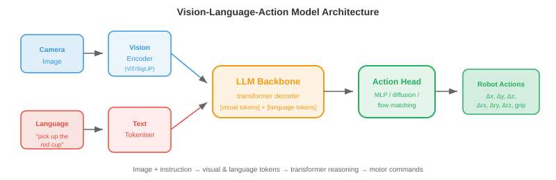
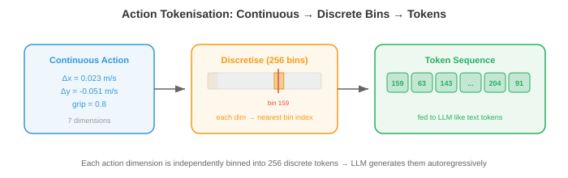

# 视觉-语言-动作模型

> **一句话总结**：视觉-语言-动作模型把 "看图 + 懂话 + 出动作" 塞进一个神经网络，用统一的 Transformer 把机器人控制变成了"下一个 token 预测"问题。

*视觉-语言-动作模型 (Vision-Language-Action model, VLA) 把感知、语言理解与执行动作统一到同一个神经网络里。 本节涵盖 VLA 的架构、动作分词 (action tokenisation)、RT-2、Octo、OpenVLA、预训练策略、泛化能力、与具身无关的模型，以及评测基准.*

- 在前几节里，我们分别讲了感知 (让机器人感受世界) 和机器人学习 (控制身体). 传统上，这两块是彼此独立的流水线：感知模块负责识别物体，语言模块负责理解指令，控制模块负责生成动作。 每个模块都被单独设计、单独训练、单独调试。

- **视觉-语言-动作模型 (Vision-Language-Action model, VLA)** 把这条流水线塌缩进一个神经网络。 模型的输入是图像 (视觉) 和一条自然语言指令 (语言)，输出则是马达指令 (动作). 一个模型，端到端搞定。

- 这延续了第 10 章看到的那种"统一"趋势：就像多模态模型把视觉理解和语言理解合并进同一个架构，VLA 把这种统一进一步扩展到物理动作上。 洞见在于：语言天然是一种灵活的任务描述接口 ("把红杯子拿起来放到架子上")，而已经预训练好的大型视觉-语言模型早就同时理解图像和指令。

## 从视觉-语言到动作

- 回想第 10 章，LLaVA、Flamingo 这类**视觉-语言模型 (Vision-Language Model, VLM)** 接受图像和文本作为输入，输出仍然是文本。 它们能理解场景、回答问题、按指令行事，一切都在语言层面完成。

- VLA 提出的问题是：如果输出不是文本，而是**机器人动作**呢？与其生成 "红色的杯子在桌子的左边"，不如让模型直接生成一串马达指令，把机械臂挪过去把杯子抓起来。

- 关键的架构洞见是：动作可以像单词一样，表示成 token. 如果 VLM 用下一个 token 预测 (next-token prediction) 逐字生成语言，那 VLA 就可以按同样的方式生成动作 token. Transformer 本质上并不在乎输出 token 的含义是"杯子"还是"夹爪前移 2 cm".

- 这样一来，机器人控制被重构为一个序列建模问题，而这恰好是 Transformer 的看家本领 (见第 7 章). 模型学到的映射就是：(图像观测，语言指令) $\to$ (动作 token 序列).

## VLA 架构



- 一个典型的 VLA 由三部分组成:

    - **视觉编码器 (vision encoder)**：把相机图像转成视觉 token. 通常用预训练好的视觉 Transformer (Vision Transformer, ViT，见第 8 章) 或 SigLIP 编码器 (见第 10 章). 图像被切成一块块图块 (patch)，每块嵌入为一个 token，和标准视觉 Transformer 里的做法完全一致。

    - **语言模型主干**：一个预训练好的大语言模型 (Large Language Model, LLM)，比如 LLaMA 或 PaLM，用来处理交错排列的视觉 token 与语言 token. 推理就发生在这里：模型通过同时关注指令和视觉特征来理解"拿起**红色**杯子"这句话。

    - **动作头 (action head)**：把 LLM 的输出映射到机器人动作。 可以是一个简单的多层感知机 (Multi-Layer Perceptron, MLP)，把最后一层隐藏状态映射到连续动作值；也可以是一种分词方案，把动作转成 LLM 现有词表中的离散 token.

- 整个架构看起来是这样:

$$\text{Image} \xrightarrow{\text{ViT}} \text{visual tokens} \quad + \quad \text{Instruction} \xrightarrow{\text{tokeniser}} \text{language tokens} \quad \xrightarrow{\text{LLM}} \quad \text{action tokens}$$

- 视觉 token 和语言 token 被拼接 (或交错) 后送进 Transformer 主干，主干再自回归地产出动作 token. 这跟第 10 章讲的 VLM 架构是同一个，只不过输出模态从文本换成了动作。

## 动作分词

- 机器人的动作是连续的：关节速度、末端执行器位置、夹爪开合宽度。 要让 LLM 生成这些量，得先把它们转成离散 token.



- 最简单的做法是**均匀离散化 (uniform discretisation)**. 每一个动作维度都被切成 $N$ 个箱 (bin)，覆盖其有效值域。 比如 x 方向速度范围是 -0.1 到 0.1 m/s，用 256 个箱，那每个箱就代表 $\frac{0.2}{256} \approx 0.8$ mm/s. 一个动作值被映射到离它最近的那个箱，箱的索引就变成一个 token.

- 假设有 7 个动作维度 (6 个自由度 + 夹爪)，每个维度 256 个箱，那动作词表就有 $7 \times 256 = 1792$ 个 token. 这些被追加到 LLM 已有的文本词表里。 模型逐维度自回归地生成一个动作 token，就像生成一个个单词一样。

- **动作分块 (action chunking)** 一次预测未来多个时间步，而不是只预测一个动作。 如果分块大小是 $H$，模型就一次输出 $H \times d$ 个 token (其中 $d$ 是动作维数). 这对生成平滑、时间上连贯的运动非常关键。 一次只预测一步容易产生抖动，因为每次预测都相互独立。 分块强迫模型规划一小段轨迹，从而抓住时序结构。

- 更精巧的做法是通过向量量化变分自编码器 (Vector-Quantised Variational Autoencoder, VQ-VAE，见第 10 章) 做**学习式分词 (learned tokenisation)**. VQ-VAE 的编码器把一段连续动作序列映射为一串离散码本索引，解码器再从这些索引里还原出连续动作。 LLM 就去生成这些码本索引，而不是均匀分箱后的值。 这跟第 10 章里图像分词器把视觉信息压缩成紧凑离散码的思路是一样的。

## 代表性 VLA 模型

- **RT-2** (Robotic Transformer 2, Google DeepMind) 是首个大规模 VLA. 它拿一个预训练好的 VLM (PaLM-E 或 PaLI-X，最大到 55B 参数) 在机器人示教数据上做微调。 动作被表示成文本字符串：token 序列 "1 128 91 241 5 101 127" 就编码了一个 7 维动作 (每个数字是一个箱的索引).

- RT-2 展示了一个令人瞩目的性质：VLM 主干中的**涌现能力 (emergent capabilities)** 会迁移到机器人任务上。 模型能执行涉及它在机器人数据里从未见过的概念的指令 (例如 "把香蕉挪到那个 A 打头的国家" 就同时需要视觉物体识别 + 世界知识 + 动作). VLM 的语言理解和视觉推理相当于"白送"给你。

- RT-2 的局限是：训练数据只来自单一机器人具身 (specific arm, specific gripper)，所以它无法泛化到不同的机器人上。

- **Octo** (UC Berkeley) 是一个开源的、**与具身无关 (embodiment-agnostic)** 的 VLA，目标是跨平台通用。 它的关键创新有几点:

    - 用**扩散动作头 (diffusion action head)** 取代自回归 token 预测。 动作头拿 Transformer 的输出，通过去噪扩散过程 (denoising diffusion，见第 8 章) 生成动作。 这天然能处理多峰的动作分布 (见下图)，即完成同一任务存在多种同样有效的方式。


    - **灵活的观测与动作空间**: Octo 对不同机器人配置采用任务专用的分词器。 它在 Open X-Embodiment 数据集上做预训练，该数据集包含来自 22 种不同机器人具身的示教。

    - **高效微调**: Octo 只需 100 条示教就能微调到一台新机器人上，这让数据受限的实验室也能用得起。

- **OpenVLA** (Stanford, UC Berkeley) 走的是另一条路：直接拿一个现成的开源 VLM (基于 Llama) 微调用于机器人。 它用 7B 参数的主干、均匀动作分词 (每维 256 个箱)，在 Open X-Embodiment 数据上训练。 优势是简单：架构就是一个把动作 token 追加进词表的标准 VLM，用现成的 LLM 基础设施就能训练和部署。

- **$\pi_0$** (Physical Intelligence) 代表了当前的最先进水平。 它用预训练 VLM 主干搭配一个**流匹配 (flow matching)** 动作头 (见第 8 章). 流匹配通过学习一个把噪声输送到动作分布的速度场来生成动作，由此产出平滑、时间上连贯的动作轨迹。 $\pi_0$ 展现出惊人的通用性，能跨多种机器人具身完成任务，包括双手操作和灵巧手控制。

## 预训练配方

- VLA 极大受益于预训练好的 VLM 主干，因为后者已经理解视觉场景和语言。 训练流水线通常分几个阶段:

    1. **VLM 预训练**：在互联网上数十亿的图文对上训练一个视觉-语言模型 (或直接用现成的)，比如第 10 章讲过的对比语言-图像预训练 (Contrastive Language-Image Pre-training, CLIP)、SigLIP 或 LLaVA 式训练。

    2. **机器人数据联合训练**：在互联网数据与机器人示教数据的混合集上微调 VLM. 互联网数据防止视觉与语言理解发生灾难性遗忘 (catastrophic forgetting)，机器人数据则教会模型生成动作。 混合比例很关键：机器人数据过多会拖垮语言理解，过少又学不到动作。

    3. **任务专用微调**：可选的一步——针对特定任务或特定机器人在示教数据上再做微调，通常配合低秩适配 (Low-Rank Adaptation, LoRA，见第 10 章)，把可训练参数量压到很小。

- 机器人数据的规模比互联网数据小几个数量级。 VLM 可能在数十亿图像上做预训练，但目前最大的机器人数据集 (Open X-Embodiment) 跨所有具身加起来也只有数百万帧。 正是这种数据稀缺，才让"从预训练 VLM 起步"成为必需：视觉和语言的表征能直接迁移过来，只有动作映射需要从有限的机器人数据里学。

## 泛化能力

- VLA 的承诺是**泛化**：完成训练时没见过的任务、操纵没见过的物体、置身于没见过的环境、听从没见过的指令。

- VLA 沿几条轴线做泛化:

    - **新物体**: VLM 主干靠互联网预训练已经能识别物体。 如果模型从网页图像里知道"螺丝刀"长什么样，就算机器人示教里从未出现过螺丝刀，它也能操纵。

    - **新指令**：组合式语言理解让模型能执行已知概念的新组合。 就算训练时只见过堆红块，"把蓝块堆到绿块上"也照样能做——因为模型从语言预训练里就理解了颜色形容词。

    - **新环境**：一定程度上，VLA 能跨视觉域迁移 (不同桌面、不同光照、不同背景)，因为视觉编码器在多样化的网页图像上做过预训练。 但这有极限：在实验室里训练出来的机器人到了杂乱的厨房里可能就抓瞎。

    - **新具身**：这是最难的一条轴。 不同机器人有不同的动作空间 (关节角 vs 末端执行器速度)、不同的传感器 (腕部相机 vs 头顶相机)、不同的物理能力。 像 Octo 和 $\pi_0$ 这样与具身无关的模型，通过灵活的分词器和跨多种机器人类型的预训练来应对这一点。

- 泛化能力用**留出任务 (held-out tasks)** 来评估：让机器人去做训练里从未见过的任务。 新任务上 50–80% 的成功率就算强结果了，相比之下，分布内任务能到 >90%. 随着模型规模扩大、机器人数据集增长，这个差距正在缩小。

## 与具身无关的模型

- 这个领域正朝着**"一模型多机器人"**的方向走。 不必为每台机器人各自训一套策略，一个 VLA 就能应付多种具身。

- 这需要解决**动作空间不匹配 (action space mismatch)** 的问题。 一台配平行夹爪的 7 自由度机械臂有 7 个动作维度；双手系统有 14 个；四足机器人有 12 个；人形机器人则超过 30 个。 动作分词方案必须足够灵活，能应付所有情况。

- 常见解法有:
    - **填充动作向量 (padded action vectors)**：采用最大动作空间，较小的用零补齐。
    - **每具身独立的动作头 (per-embodiment action heads)**：共享一个 Transformer 主干，为每种机器人类型配一个独立的小 MLP.
    - **归一化动作表示 (normalised action representations)**：把所有动作表达在同一个参考系里 (例如世界坐标系下的末端执行器速度)，这样即便机器人不同，只要末端执行器动作相似，就共用同样的动作 token.

- 共享主干学到的是通用的视觉与语言理解，再加上通用的操纵策略 (从上方接近物体、对准、闭合夹爪). 与具身相关的部分只需要把这些高层策略翻译成具体的马达指令。

## 基准与评测

- 评测 VLA 有个独特的难点：需要真实机器人实验 (或高保真仿真).

- **SIMPLER** (Simulated Manipulation Policy Evaluation for Robot learning) 提供了一套标准化仿真环境，让研究者不用真实硬件就能横向比较 VLA. 它跟真实世界成功率的相关性很好，也支持可复现的评测。

- **真实世界评测**依然是黄金标准。 典型协议是:
    1. 定义一组任务，每个任务有清晰的成功判据 (物体到达目标位置、选对物体、任务在时限内完成).
    2. 每个任务跑 $N$ 次试验 (一般 10–50 次).
    3. 报告成功率及置信区间。
    4. 加入留出 (从未训练过的) 任务，用来度量泛化能力。

- **Open X-Embodiment** 数据集与基准聚合了来自 22 家机构、多种机器人平台的数据，提供了一套共享示教的标准化格式，以及跨具身迁移的公共评测套件。

## 编程练习 (用 CoLab 或 notebook)

1. 实现动作分词：把连续动作离散化到箱，再还原，观察量化误差随箱数变化的情况。
```python
import jax.numpy as jnp

# 连续动作: 7 维 (6 自由度 + 夹爪)
action_true = jnp.array([0.023, -0.051, 0.012, 0.1, -0.03, 0.005, 0.8])
action_min = jnp.array([-0.1, -0.1, -0.1, -0.5, -0.5, -0.5, 0.0])
action_max = jnp.array([ 0.1,  0.1,  0.1,  0.5,  0.5,  0.5, 1.0])

for n_bins in [16, 64, 256, 1024]:
    # 分词: 把连续值映射到箱索引
    normalised = (action_true - action_min) / (action_max - action_min)
    tokens = jnp.clip((normalised * n_bins).astype(int), 0, n_bins - 1)

    # 反分词: 把箱索引还原到连续值
    reconstructed = (tokens + 0.5) / n_bins * (action_max - action_min) + action_min

    error = jnp.linalg.norm(action_true - reconstructed)
    print(f"bins={n_bins:4d}  tokens={tokens}  error={error:.6f}")
```

2. 模拟动作分块 vs 单步预测。 生成一条平滑轨迹，给单步预测加噪，与分块预测做对比。
```python
import jax
import jax.numpy as jnp
import matplotlib.pyplot as plt

# 真值平滑轨迹 (例如: 一次伸手动作)
t = jnp.linspace(0, 2 * jnp.pi, 100)
gt_x = jnp.sin(t)
gt_y = 1 - jnp.cos(t)

# 单步预测: 每一步的噪声相互独立
rng = jax.random.PRNGKey(42)
noise_ss = jax.random.normal(rng, (100, 2)) * 0.05
single_step = jnp.stack([gt_x, gt_y], axis=1) + noise_ss
# 单步误差累积产生漂移
single_step_cumulative = jnp.cumsum(noise_ss, axis=0) * 0.3 + jnp.stack([gt_x, gt_y], axis=1)

# 分块预测 (chunk_size=10): 块内噪声相关, 更平滑
chunk_size = 10
rng2 = jax.random.PRNGKey(7)
chunks = []
for i in range(0, 100, chunk_size):
    chunk_noise = jax.random.normal(jax.random.fold_in(rng2, i), (2,)) * 0.05
    chunk = jnp.stack([gt_x[i:i+chunk_size], gt_y[i:i+chunk_size]], axis=1)
    chunks.append(chunk + chunk_noise)
chunked = jnp.concatenate(chunks, axis=0)

plt.figure(figsize=(8, 4))
plt.plot(gt_x, gt_y, "k-", linewidth=2, label="Ground truth")
plt.plot(single_step_cumulative[:, 0], single_step_cumulative[:, 1],
         "r-", alpha=0.7, label="Single-step (drifts)")
plt.plot(chunked[:, 0], chunked[:, 1], "b-", alpha=0.7, label="Chunked (stable)")
plt.legend(); plt.axis("equal"); plt.grid(True)
plt.title("Action Chunking vs Single-Step Prediction")
plt.show()
```

3. 可视化 VLA 的动作分布如何呈现多峰。 用一个简单的二维高斯混合来说明为什么扩散/流匹配动作头比回归更合适。
```python
import jax
import jax.numpy as jnp
import matplotlib.pyplot as plt

# 绕开障碍物的两种同样有效的方式: 从左走或从右走
rng = jax.random.PRNGKey(0)
k1, k2 = jax.random.split(rng)

mode1 = jax.random.normal(k1, (200, 2)) * 0.15 + jnp.array([-1.0, 0.5])
mode2 = jax.random.normal(k2, (200, 2)) * 0.15 + jnp.array([ 1.0, 0.5])
samples = jnp.concatenate([mode1, mode2])

# 回归会预测均值 = 两个模式的平均 (无效!)
mean_pred = samples.mean(axis=0)

plt.figure(figsize=(6, 5))
plt.scatter(samples[:, 0], samples[:, 1], s=5, alpha=0.5, label="True action distribution")
plt.plot(*mean_pred, "rx", markersize=15, markeredgewidth=3, label="Regression mean (invalid!)")
plt.plot(-1, 0.5, "g^", markersize=12, label="Mode 1 (go left)")
plt.plot(1, 0.5, "b^", markersize=12, label="Mode 2 (go right)")
plt.legend(); plt.grid(True)
plt.title("Multimodal Actions: Why Regression Fails")
plt.xlabel("Action dim 1"); plt.ylabel("Action dim 2")
plt.show()
```

---

## 📌 本节要点

- **VLA 的核心思想**：把"看图 + 懂话 + 出动作"塞进一个端到端神经网络，取代分立的感知/语言/控制流水线。
- **三段式架构**：视觉编码器 (ViT/SigLIP) + LLM 主干 + 动作头，视觉与语言 token 拼接送入 Transformer，自回归吐出动作 token.
- **动作分词**：连续动作通过均匀分箱或 VQ-VAE 学习式分词转成离散 token，让 LLM 能用生成语言的老办法生成动作。
- **动作分块**：一次预测多步动作 (H×d 个 token)，强迫模型规划短轨迹，避免单步预测导致的抖动漂移。
- **RT-2 的启示**：大 VLM 微调到机器人上会带来涌现能力——从未在机器人数据里出现过的世界知识也能被调用。
- **Octo 与具身无关**：用扩散动作头处理多峰动作分布，跨 22 种具身预训练，100 条示教就能微调到新机器人。
- **$\pi_0$ 与流匹配**：用流匹配动作头学习速度场，产出平滑连贯的动作轨迹，跨具身通用性最强。
- **预训练配方**: VLM 大规模预训练 → 与机器人数据联合训练 (防遗忘) → LoRA 任务专用微调；混合比例是关键。
- **泛化四轴**：新物体、新指令、新环境、新具身——前三条靠 VLM 主干迁移，新具身最难，需要与具身无关的设计。
- **评测双轨**: SIMPLER 提供仿真基准，真实世界评测按任务成功率 + 置信区间报告，Open X-Embodiment 提供跨具身共享数据。