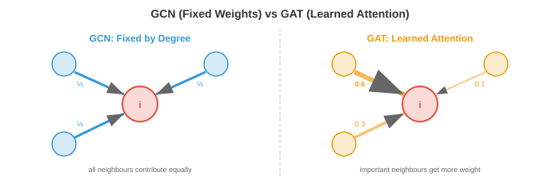

# 图注意力网络

> **一句话总结**: 图注意力网络 (Graph Attention Network, GAT) 用可学习的、依赖于数据的权重替代均匀邻居聚合, 并延伸出 GATv2、图 Transformer、位置编码、时序图等一整套现代图学习工具箱。

*图注意力网络用学到的、依赖于数据的加权方式取代了均匀的邻居聚合。本节涵盖 GAT、多头图注意力、GATv2、图 Transformer、位置与结构编码, 以及可扩展性。*

- 在图卷积网络 (Graph Convolutional Network, GCN) (文件 3) 里, 每个节点用固定权重聚合邻居特征, 这些权重完全由图结构决定 (归一化的邻接矩阵)。一个有三个邻居的节点会给每个邻居差不多相等的权重 ($\approx 1/3$)。但邻居的重要性并不都一样: 来自密切合作者的消息, 应该比来自远方泛泛之交的消息更重要。

- **图注意力网络 (Graph Attention Network, GAT)** 通过学习**该关注哪些邻居**来解决这个问题, 用的正是 Transformer (第 7 章) 背后的那套注意力机制。它不再用固定的、结构决定的权重, 而是让每个节点动态计算基于内容的注意力分数。

## GAT: 图注意力网络

- **GAT** (Veličković 等人, 2018) 会为每个节点与它的邻居计算注意力系数。对节点 $i$ 与邻居 $j$:

$$e_{ij} = \text{LeakyReLU}\left(\mathbf{a}^T \left[W\mathbf{h}_i \| W\mathbf{h}_j\right]\right)$$

- 其中 $W \in \mathbb{R}^{d' \times d}$ 是共享的线性变换, $\|$ 表示拼接, $\mathbf{a} \in \mathbb{R}^{2d'}$ 是可学习的注意力向量。分数 $e_{ij}$ 衡量节点 $j$ 的特征对节点 $i$ 有多重要。

- 原始分数用 Softmax 在所有邻居上归一化:

$$\alpha_{ij} = \text{softmax}_j(e_{ij}) = \frac{\exp(e_{ij})}{\sum_{k \in \mathcal{N}(i)} \exp(e_{ik})}$$

- 这保证注意力权重在每个节点的邻域上加起来为 1, 就像 Transformer 里的注意力 (第 7 章) 那样。节点的更新特征是:

$$\mathbf{h}_i' = \sigma\left(\sum_{j \in \mathcal{N}(i)} \alpha_{ij} W\mathbf{h}_j\right)$$



- 与 GCN 的关键区别: 权重 $\alpha_{ij}$ 是**从数据中学出来的**, 不是由图结构固定的。节点可以学会聚焦最有信息量的邻居, 忽略嘈杂或不相关的邻居。

- 注意, 注意力只在边上计算 (节点 $i$ 只关注它的邻居 $\mathcal{N}(i)$), 而不是在所有节点对上计算。这让计算量与边数成正比, 而不是与节点数的平方成正比。

## 多头图注意力

- 就像 Transformer (第 7 章) 里那样, **多头注意力** (multi-head attention) 会并行跑 $K$ 个独立的注意力机制, 每个都有自己的参数 $W^k$ 与 $\mathbf{a}^k$。结果在中间层拼接, 在最后一层平均:

$$\mathbf{h}_i' = \Big\|_{k=1}^{K} \sigma\left(\sum_{j \in \mathcal{N}(i)} \alpha_{ij}^k W^k \mathbf{h}_j\right)$$

- 每个头可以关注邻域的不同方面: 一个头可能盯结构特征, 另一个头盯语义相似性。这和 Transformer 里多头注意力的初衷一样: 不同头捕捉不同类型的关系。

- 用 $K$ 个头、每个头输出维度 $d'$ 时, 拼接后的输出维度为 $K \times d'$。最后一层通常用平均替代拼接, 得到固定大小的输出。

## GATv2: 修正静态注意力

- 原版 GAT 有个微妙的局限: 它的注意力函数是**静态的** (static, 也叫基于排序的)。注意力分数依赖拼接结果 $[W\mathbf{h}_i \| W\mathbf{h}_j]$, 但因为注意力向量 $\mathbf{a}$ 是在拼接**之后**才作用上去, 所以可以拆成两个独立分量: $\mathbf{a}^T [W\mathbf{h}_i \| W\mathbf{h}_j] = \mathbf{a}_1^T W\mathbf{h}_i + \mathbf{a}_2^T W\mathbf{h}_j$。

- 这意味着, 对给定节点 $i$, 它对邻居的排序完全由邻居特征 $\mathbf{h}_j$ 决定 (因为 $\mathbf{a}_1^T W\mathbf{h}_i$ 项对 $i$ 的所有邻居都是常数)。注意力排序其实**不依赖**查询节点的特征。节点 $i$ 和节点 $k$ 会以完全相同的顺序给同一组邻居打分, 这限制了表达力。

- **GATv2** (Brody 等人, 2022) 通过把非线性变换放在注意力向量**之前**来解决这个问题:

$$e_{ij} = \mathbf{a}^T \text{LeakyReLU}\left(W \left[\mathbf{h}_i \| \mathbf{h}_j\right]\right)$$

- 把 LeakyReLU 移到内部, 意味着注意力分数变成了联合特征的非线性函数, 无法拆成独立项。这样注意力变**动态**了: 邻居的排序现在真的取决于具体的查询节点。GATv2 在不增加任何计算成本的情况下, 表达力严格强于 GAT。

## 图 Transformer

- 标准的消息传递图神经网络 (Graph Neural Network, GNN) 受限于图拓扑: 一个节点只能关注它直接相连的邻居。经过 $k$ 层后, 来自 $k$ 跳邻居的信息已经被多次聚合搅在一起, 保真度下降。这种局部瓶颈 (再叠加过度平滑, 见文件 3) 会限制模型捕捉长距离依赖的能力。

- **图 Transformer** (Graph Transformer) 通过对所有节点对施加**全局自注意力**打破这个瓶颈, 不管两个节点之间有没有边。每个节点都能在一层之内关注到其他任何节点, 和标准 Transformer (第 7 章) 里一样。

- 基本思路: 把所有节点当作 Token, 应用 Transformer 自注意力:

$$\text{Attention}(Q, K, V) = \text{softmax}\left(\frac{QK^T}{\sqrt{d_k}}\right)V$$

- 其中 $Q = XW_Q$, $K = XW_K$, $V = XW_V$ 是节点特征 $X$ 的查询、键、值投影 (和第 7 章完全一样)。这本质上就是一个跑在完全图 (complete graph, $K_n$, 文件 2) 上的 GNN。

- 问题在于: 完全图会忽略真实的图结构。边信息 (到底谁跟谁相连) 丢失了。有两种做法把这个信息找回来:

- **Graphormer** (Ying 等人, 2021) 通过在注意力分数里加**偏置项**的方式, 把图结构注入 Transformer:

$$A_{ij} = \frac{(\mathbf{h}_i W_Q)(W_K^T \mathbf{h}_j^T)}{\sqrt{d_k}} + b_{\text{spatial}}(i, j) + b_{\text{edge}}(i, j)$$

- 空间偏置 $b_{\text{spatial}}$ 编码节点 $i$ 和 $j$ 之间的最短路径距离。边偏置 $b_{\text{edge}}$ 编码最短路径上的边特征。此外, Graphormer 还用了**中心性编码** (centrality encoding), 把节点度数加进它的输入嵌入, 让模型知道每个节点在结构上的角色。

- **GPS** (General, Powerful, Scalable Graph Transformer, Rampášek 等人, 2022) 在每一层里同时做局部消息传递和全局注意力:

$$\mathbf{h}_i' = \text{MLP}\left(\mathbf{h}_i^{\text{MPNN}} + \mathbf{h}_i^{\text{Attention}}\right)$$

- 每一层既跑一个标准 GNN (处理局部结构), 又跑一个 Transformer (处理全局上下文), 然后把结果合并。这样两边好处都占: 消息传递带来局部结构, 注意力带来长距离依赖。

## 位置编码与结构编码

- 序列上的 Transformer 会用位置编码 (第 7 章) 来注入顺序信息。图没有天然的顺序, 所以需要专门为图设计的编码。

- **拉普拉斯特征向量编码** (Laplacian eigenvector encodings) 用图拉普拉斯 (文件 2) 的特征向量作为位置特征。最小的 $k$ 个非平凡特征向量给出图的谱嵌入: 在图上"相邻"的节点, 其特征向量取值也相近。把这些向量拼到节点特征上即可。

- 一个微妙之处: 拉普拉斯特征向量有符号歧义 (如果 $\mathbf{u}$ 是特征向量, 那 $-\mathbf{u}$ 也是)。模型必须对这种符号翻转保持不变。解决办法包括在训练时用随机翻转符号作数据增强, 或学习对符号不变的变换。

- **随机游走编码** (random walk encodings) 计算从节点 $i$ 出发经过 $k$ 步随机游走后回到 $i$ 的概率, 对 $k = 1, 2, \ldots, K$ 都算一遍。这些概率编码局部结构信息: 稠密簇中的节点回归概率高, 稀疏区域的节点回归概率低。落点概率 $p_{ii}^{(k)} = (A_{\text{rw}}^k)_{ii}$, 其中 $A_{\text{rw}} = D^{-1}A$ 是随机游走转移矩阵。

- **度数编码** (degree encodings) 直接把节点度数作为特征加进去。这招意外地好用, 因为度数是一个很强的结构信号: 叶节点 (度数 1)、桥节点、枢纽节点的行为大不一样。

- 这些编码补上了普通 Transformer 缺失的结构信息, 让图 Transformer 在需要长距离推理的任务上, 能够胜过标准的消息传递 GNN。

## 可扩展性

- GNN 面临的根本可扩展性挑战是: 图可能有数百万节点、数十亿条边。在完整图上训练 GNN, 需要把所有节点特征和整个邻接矩阵放进内存, 这通常做不到。

- **小批量训练** (mini-batch training) 在 GNN 上比在图像或序列上要复杂得多, 因为节点彼此相连。天真地采样一批节点, 就需要它们的邻居 (第 1 层)、邻居的邻居 (第 2 层)、以此类推。这种**邻域爆炸** (neighbourhood explosion) 意味着, 1000 个目标节点的一个批次可能要在计算图里涉及数百万个节点。

- **邻居采样** (neighbourhood sampling, GraphSAGE 风格, 文件 3) 通过每层每个节点只采样固定数量的邻居来限制爆炸。2 层、每层采 15 个邻居时, 无论完整图多大, 每个目标节点的子图最多也就 $15^2 = 225$ 个节点。

- **Cluster-GCN** (Chiang 等人, 2019) 先用图聚类算法 (比如 METIS) 把图划分成若干簇, 然后每次训练一个簇。簇内的边稠密 (大部分邻居都在同一个簇里), 所以子图能捕捉到相关结构。跨簇边通过偶尔加入簇间边来处理。

- **图 Transformer 的可扩展性**更棘手, 因为全局注意力是 $O(n^2)$ 的。对于数百万节点的图, 完整注意力根本跑不动。解决方案包括:
    - 稀疏注意力模式 (只关注图上最近的 $k$ 个节点)
    - 线性注意力近似
    - 把便宜的局部消息传递 ($O(|E|)$) 与在粗化图 (节点更少) 上的全局注意力结合起来

## 时序图与动态图

- 目前学过的图都是**静态的**: 节点、边、特征都固定。但现实中很多图**会随时间演化**: 新用户加入社交网络, 金融交易产生新边, 交通模式全天变化, 分子间的相互作用也在起伏。

- **时序图** (temporal graph) 给每条边加上时间戳: $(i, j, t)$ 表示节点 $i$ 在时刻 $t$ 与节点 $j$ 发生了交互。挑战在于, 要学到同时捕捉图结构与时间动态的表示。

- 有两种范式:

- **离散时间动态图** (Discrete-Time Dynamic Graph, DTDG): 把图表示成一系列快照 $G_1, G_2, \ldots, G_T$, 每个时间步一个。GNN 处理每个快照, 循环神经网络 (Recurrent Neural Network, RNN) 或时序注意力机制捕捉跨快照的演化。这种做法简单, 但会丢失细粒度时间信息 (快照之间发生的事件丢了), 而且要选一个快照频率。

- **连续时间动态图** (Continuous-Time Dynamic Graph, CTDG): 把事件建模成时间戳交互流。每个事件 $(i, j, t)$ 在它发生的精确时刻更新节点 $i$ 与 $j$ 的表示。这保留了全部时间信息。

- **时序图网络** (Temporal Graph Network, TGN) (Rossi 等人, 2020) 是 CTDG 的主流架构。每个节点维护一个**记忆状态** $\mathbf{s}_i(t)$, 每当节点参与一次交互就更新一次:

$$\mathbf{s}_i(t^+) = \text{GRU}\left(\mathbf{s}_i(t^-), \; \mathbf{m}_i(t)\right)$$

- 其中 $\mathbf{m}_i(t)$ 是从这次交互算出的消息 (综合两个节点的特征、边特征和时间编码)。门控循环单元 (Gated Recurrent Unit, GRU) (第 6 章) 会选择性地保留和遗忘过去的信息, 让记忆既能捕捉长期模式, 又能适应最近的事件。

- **时间编码** (time encoding) 把距上一次交互的时间间隔表示成一个特征向量, 类比于 Transformer 里的位置编码 (第 7 章)。常用做法是可学习的傅里叶特征:

$$\Phi(t) = \left[\cos(\omega_1 t), \sin(\omega_1 t), \ldots, \cos(\omega_d t), \sin(\omega_d t)\right]$$

- 这给模型提供了对时间间隔的丰富表征: "这个用户 5 分钟前刚活跃过" 和 "3 个月前活跃过", 会被嵌入到完全不同的位置。

- **时序图注意力** (Temporal Graph Attention, TGAT) 在节点的时序邻域上做自注意力: 邻域是最近发生的一批交互, 每个交互的权重同时取决于特征相关性 (像 GAT 那样) 和时间近因。来自遥远过去的交互自然会被降权。

- 应用场景包括欺诈检测 (金融图里的异常交易模式)、交通预测 (基于历史流量预测拥堵)、社交网络动态 (预测病毒式内容扩散), 以及药物相互作用随时间的预测。

## 编程任务 (在 CoLab 或 Notebook 里做)

1. 从零实现一个 GAT 注意力头。计算一个节点和它邻居之间的注意力权重, 并验证它们加起来等于 1。
```python
import jax
import jax.numpy as jnp

rng = jax.random.PRNGKey(0)
k1, k2, k3 = jax.random.split(rng, 3)

n_nodes, d_in, d_out = 5, 4, 3

# 随机节点特征
H = jax.random.normal(k1, (n_nodes, d_in))

# 可学习参数
W = jax.random.normal(k2, (d_in, d_out)) * 0.5
a = jax.random.normal(k3, (2 * d_out,)) * 0.5

# 邻接关系 (节点 0 连接到 1, 2, 3)
neighbours_of_0 = [1, 2, 3]

# 变换特征
Wh = H @ W  # (n_nodes, d_out)

# 计算节点 0 的注意力分数
h_i = Wh[0]
scores = []
for j in neighbours_of_0:
    h_j = Wh[j]
    e_ij = jnp.dot(a, jnp.concatenate([h_i, h_j]))
    e_ij = jax.nn.leaky_relu(e_ij, negative_slope=0.2)
    scores.append(float(e_ij))

scores = jnp.array(scores)
alpha = jax.nn.softmax(scores)

print(f"Raw scores: {scores}")
print(f"Attention weights: {alpha}")
print(f"Sum of weights: {alpha.sum():.4f}")

# 加权聚合
h_new = sum(alpha[k] * Wh[neighbours_of_0[k]] for k in range(len(neighbours_of_0)))
print(f"Updated node 0 features: {h_new}")
```

2. 对比 GCN (固定权重) 与 GAT (学习权重) 的聚合方式。展示 GAT 能给邻居分配不同权重, 而 GCN 一视同仁。
```python
import jax
import jax.numpy as jnp

# 4 个节点: 节点 0 连接到 1, 2, 3
A = jnp.array([[0,1,1,1],
               [1,0,0,0],
               [1,0,0,0],
               [1,0,0,0]], dtype=float)

# 特征: 节点 1 非常相关, 节点 2 是噪声, 节点 3 中等
H = jnp.array([[0.0, 0.0],   # 节点 0
               [1.0, 0.0],   # 节点 1 (信号)
               [0.0, 0.0],   # 节点 2 (噪声)
               [0.5, 0.0]])  # 节点 3 (中等)

# GCN: 归一化邻接权重
A_hat = A + jnp.eye(4)
D_inv = jnp.diag(1.0 / A_hat.sum(axis=1))
gcn_weights = (D_inv @ A_hat)[0]  # 节点 0 的权重
print(f"GCN weights for node 0: {gcn_weights}")
print("  → 所有邻居拿到大致相等的权重")

# GAT: 学到的注意力 (这里模拟一下)
# 假设注意力机制学到聚焦于节点 1
gat_weights = jnp.array([0.1, 0.7, 0.05, 0.15])  # 学到的
print(f"\nGAT weights for node 0: {gat_weights}")
print("  → 节点 1 (信息量大) 拿到最多关注")

gcn_output = gcn_weights @ H
gat_output = gat_weights @ H
print(f"\nGCN output: {gcn_output}  (被噪声稀释)")
print(f"GAT output: {gat_output}  (聚焦到信号上)")
```

3. 展示位置编码的好处。为一张图计算拉普拉斯特征向量编码, 说明结构上相似的节点会得到相似的编码。
```python
import jax.numpy as jnp
import matplotlib.pyplot as plt

# 哑铃图: 两个团被一条桥连接
n = 10
A = jnp.zeros((n, n))
# 团 1: 节点 0-4
for i in range(5):
    for j in range(i+1, 5):
        A = A.at[i,j].set(1).at[j,i].set(1)
# 团 2: 节点 5-9
for i in range(5, 10):
    for j in range(i+1, 10):
        A = A.at[i,j].set(1).at[j,i].set(1)
# 桥
A = A.at[4,5].set(1).at[5,4].set(1)

D = jnp.diag(A.sum(axis=1))
L = D - A
eigenvalues, eigenvectors = jnp.linalg.eigh(L)

# 用前 3 个非平凡特征向量作为位置编码
pe = eigenvectors[:, 1:4]

print("Laplacian Positional Encodings:")
for i in range(n):
    group = "Clique 1" if i < 5 else "Clique 2"
    bridge = " (bridge)" if i in [4, 5] else ""
    print(f"  Node {i} ({group}{bridge}): {pe[i]}")

plt.scatter(pe[:5, 0], pe[:5, 1], c="#3498db", s=80, label="Clique 1")
plt.scatter(pe[5:, 0], pe[5:, 1], c="#e74c3c", s=80, label="Clique 2")
plt.scatter(pe[[4,5], 0], pe[[4,5], 1], c="black", s=120, marker="*",
            label="Bridge nodes", zorder=5)
plt.legend(); plt.grid(True)
plt.title("Laplacian Eigenvector Positional Encodings")
plt.xlabel("Eigenvector 1"); plt.ylabel("Eigenvector 2")
plt.show()
```

---

## 📌 本节要点

- **GAT 核心思想**: 用可学习的、依赖数据的注意力权重取代 GCN 的固定结构权重, 让节点自主决定关注哪些邻居。
- **注意力仅沿边计算**: 注意力只在 $\mathcal{N}(i)$ 上算, 计算量正比于边数而非节点数平方。
- **多头图注意力**: 并行 $K$ 组注意力捕捉不同关系, 中间层拼接、末层平均, 与 Transformer 多头机制同源。
- **GATv2 修正静态排序**: 把 LeakyReLU 移到 $\mathbf{a}$ 之前, 让排序真正依赖查询节点, 表达力严格更强且零额外开销。
- **图 Transformer**: 用全局自注意力打破局部瓶颈, 相当于在完全图上做 GNN, 但会丢失结构信息。
- **结构注入**: Graphormer 用最短路距离+边+中心性偏置, GPS 在每层里融合消息传递与全局注意力。
- **位置与结构编码**: 拉普拉斯特征向量、随机游走返回概率、度数, 三类编码补齐图上"没有天然顺序"的短板。
- **可扩展性策略**: 邻居采样、Cluster-GCN 划分聚类、稀疏/线性注意力近似, 是大图训练的实用手段。
- **时序图两大范式**: 离散时间快照序列 (DTDG) 简单但丢时间, 连续时间事件流 (CTDG) 精确但复杂。
- **TGN 与时间编码**: 每个节点用 GRU 维护记忆状态, 傅里叶时间编码让 "5 分钟前" 与 "3 个月前" 拥有截然不同的表示。
