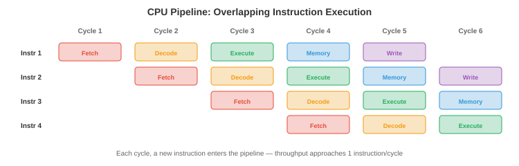

# 计算机架构

> **一句话总结**：本节自下而上讲清硬件如何跑程序：数制、逻辑门、CPU、指令集、流水线、存储层级、虚拟内存与 I/O，全是 AI 模型最终落到的物理地基。

*计算机架构讲的是我们怎么造出能执行指令的机器。本节覆盖数制、逻辑门、CPU 设计、指令集架构、流水线、存储层级和虚拟内存 —— 每个程序、每个框架、每个 AI 模型最终都要落在这套硬件地基上。*

- 每一个神经网络、每一次训练循环、每一次推理调用，最终都变成一串串电信号在晶体管里流动。对认真的 ML 从业者来说，理解硬件不是可选项：它解释了为什么矩阵乘法很快、为什么内存是瓶颈、为什么 GPU 主宰了 AI 训练，也解释了为什么"缓存友好"的代码可以比朴素写法快 100 倍。

## 数制

- 计算机把一切都表示成**二进制** (base 2，以 2 为基)：由 0 和 1 组成的序列。每一位叫做一个**比特** (bit); 8 个比特一组叫一个**字节** (byte)。二进制数 $b_{n-1} b_{n-2} \ldots b_1 b_0$ 的值是 $\sum_{i=0}^{n-1} b_i \cdot 2^i$。

- 举个例子，$1011_2 = 1 \cdot 8 + 0 \cdot 4 + 1 \cdot 2 + 1 \cdot 1 = 11_{10}$。

- **十六进制** (hexadecimal, base 16) 是二进制的紧凑写法。每个十六进制位对应 4 个比特：$0\text{-}9$ 对应 $0000\text{-}1001$, $A\text{-}F$ 对应 $1010\text{-}1111$。所以 $\text{0xFF} = 1111\,1111_2 = 255_{10}$。内存地址和颜色代码通常都用十六进制。

- **补码** (two's complement) 用来表示有符号整数。对一个 $n$ 位数，最高位的权重是 $-2^{n-1}$ 而不是 $+2^{n-1}$。一个 8 位补码的范围是 $-128$ 到 $+127$。取负操作：每一位翻转后加 1。这种表示让加法和减法可以共用同一套硬件电路，因此成为通用方案。

- **IEEE 754 浮点数** (IEEE 754 floating point) 把实数表示成 $(-1)^s \times 1.m \times 2^{e-\text{bias}}$，其中 $s$ 是符号位，$m$ 是尾数 (mantissa，小数部分), $e$ 是带偏置的指数。


    - **float32** (单精度): 1 位符号 + 8 位指数 + 23 位尾数 = 32 位。范围 $\approx \pm 3.4 \times 10^{38}$，精度约 7 位十进制数字。
    - **float64** (双精度): 1 位符号 + 11 位指数 + 52 位尾数 = 64 位。范围 $\approx \pm 1.8 \times 10^{308}$，精度约 15 位十进制数字。
    - **float16** (半精度): 1 + 5 + 10 = 16 位。范围和精度都受限，但只占一半内存和带宽。在 ML 训练里广泛用于混合精度 (见第 6 章)。
    - **bfloat16**: 1 + 8 + 7 = 16 位。指数范围和 float32 相同，但精度更低。Google 专门为 ML 设计：完整的指数范围能防止训练时溢出，而降低的精度对梯度更新来说是可接受的。

- 浮点运算**不是精确的**。在 float64 里 $0.1 + 0.2 \neq 0.3$ (等于 $0.30000000000000004$)。原因是 $0.1$ 没有精确的二进制表示，就像 $1/3$ 没有精确的十进制表示一样。这些误差在数百万次运算 (比如梯度下降) 里累积起来，就会引发数值不稳定 —— 这也是为什么会有损失缩放 (loss scaling，见第 6 章) 和 Kahan 求和这类技术。

## 逻辑门

- 所有计算最终都归结到**逻辑门** (logic gate)：实现布尔运算的物理电路 (对应第 1 篇里的命题逻辑)。

- 基础的几种门:
    - **与门** (AND)：只有两个输入都是 1 时输出才是 1。
    - **或门** (OR)：至少一个输入是 1 时输出就是 1。
    - **非门** (NOT，反相器)：把输入翻转。
    - **与非门** (NAND, NOT-AND)：通用门。任何其他门都能只用 NAND 搭出来。这也是为什么 NAND 是数字电路的基础构件。
    - **异或门** (XOR, exclusive OR)：两个输入不同时输出 1。是加法 (二进制加法的求和位就是 XOR) 和密码学的关键。

- **半加器** (half adder) 用 XOR (和) 和 AND (进位) 把两个单比特相加。**全加器** (full adder) 加两个比特再加一个进位输入，串接起来就能构成 $n$ 位加法器。CPU 就是这样做整数加法的：一串简单逻辑门的级联。

- **多路复用器** (multiplexer, MUX) 根据控制信号从多个输入里挑一个输出。$n$ 位控制信号可以从 $2^n$ 个输入里选一个。多路复用器相当于 if-else 链的硬件版本，在 CPU 数据通路里被大量用来路由数据。

- 现代处理器里有几十亿个晶体管，每个晶体管就是一个微型开关。晶体管要么导通 (通电，代表 1) 要么截止 (不通电，代表 0)。门由晶体管搭起来，加法器由门搭起来，算术逻辑单元由加法器搭起来，CPU 又由算术逻辑单元搭起来。整个计算的层级都建立在这个地基上。

## CPU 架构

- **中央处理器** (Central Processing Unit, CPU) 负责执行指令。它的核心部件:

    - **算术逻辑单元** (Arithmetic Logic Unit, ALU)：做整数运算 (加、减、乘) 和逻辑运算 (AND、OR、XOR、移位)。真正的计算就发生在这里，由前面讲过的那些逻辑门搭成。

    - **寄存器** (register): CPU 内部又小又快的存储位。现代 CPU 有几十个通用寄存器，每个存一个字 (在 64 位 CPU 上是 64 位)。寄存器是系统里最快的存储：访问只要约 0.3 纳秒。

    - **程序计数器** (Program Counter, PC)：存放下一条要执行的指令的内存地址。

    - **控制单元** (Control Unit)：解码指令并指挥数据通路，告诉 ALU 做什么运算、用哪些寄存器。

- **指令周期** (取指-译码-执行) 每秒重复几十亿次:

    1. **取指** (Fetch)：从 PC 指向的内存地址读出指令。
    2. **译码** (Decode)：判断这条指令是干嘛的 (加法？从内存读？分支?) 以及用了哪些操作数。
    3. **执行** (Execute)：完成操作 (ALU 计算、访存或分支)。
    4. PC 递增 (除非这条指令是分支或跳转)。

- 一个 4 GHz 的 CPU 每秒跑 40 亿个周期，每个周期 0.25 纳秒。在这么短的时间里，光只能走大约 7.5 厘米 —— 这就是为什么芯片的物理尺寸很重要：信号在一个周期内没法穿过一块很大的芯片。

## 指令集架构

- **指令集架构** (Instruction Set Architecture, ISA) 是硬件与软件之间的契约：它规定了 CPU 能识别哪些指令、有哪些寄存器、内存模型是什么，以及编码格式。

- **CISC** (Complex Instruction Set Computer，复杂指令集计算机)：指令可以很复杂、长度不固定，而且能直接访问内存。一条指令可能就把两个内存值相乘再存回内存。**x86** (Intel/AMD) 是主流的 CISC ISA，撑起了绝大多数桌面机和服务器。它的向后兼容性 (现代 x86 CPU 还能跑 1980 年代的代码) 既是它的优势，也是它的包袱。

- **RISC** (Reduced Instruction Set Computer，精简指令集计算机)：指令简单、长度固定，只在寄存器上操作。访问内存要用独立的 load/store 指令。指令简单换来更高的时钟频率和更容易做流水线。

    - **ARM** (Advanced RISC Machine)：移动设备上的主流 RISC ISA，现在也越来越多地进入服务器和笔记本 (苹果 M 系列芯片就是 ARM)。ARM 的能效使它非常适合电池供电和散热受限的设备。
    - **RISC-V**：一个开源的 RISC ISA。任何人都能设计 RISC-V 芯片，不用付授权费。在嵌入式系统、科研和 AI 加速器领域越来越流行。

- CISC vs RISC 的界限已经模糊了：现代 x86 CPU 内部会把复杂的 CISC 指令拆解成更简单的微操作 (本质上内部就是 RISC)，两边的好处都占到了。

## 流水线

- 不做流水线的话，CPU 要等一条指令完全跑完才开始下一条。这样很浪费硬件：ALU 在执行时，取指和译码单元只能干瞪眼。



- **流水线** (pipelining) 让指令的执行相互重叠，就像流水生产线。指令 1 在执行时，指令 2 正在译码，指令 3 正在取指。一条 5 级流水线 (取指、译码、执行、访存、写回) 可以同时有 5 条指令在飞。

- 吞吐量逼近每周期一条指令 (虽然单条指令仍要 5 个周期才走完)。这和 ML 里的流水线是同一个原理：数据并行让计算和通信互相重叠 (见第 6 章)。

- **冒险** (hazard) 指流水线卡壳的几种情形:

    - **数据冒险** (data hazard)：指令 2 需要指令 1 还没算出的结果。比如 "Add R1, R2, R3" 后面跟 "Sub R4, R1, R5" —— 第二条要用 R1，但第一条还在算。**转发** (forwarding，也叫旁路) 通过把结果直接从一个流水线阶段送到另一个阶段，不等写回就用上，来解决这个问题。

    - **控制冒险** (control hazard)：分支指令 (if-else) 意味着 CPU 在分支结果出来之前不知道下一条该取哪。**分支预测** (branch prediction) 猜一下分支往哪走，然后按预测的路径推测性地取指令。现代预测器准确率超过 95%，用的是历史表和类似神经网络的模式匹配。一次预测失败大约要付出 15 个周期的代价 (流水线必须清空重启)。

    - **结构冒险** (structural hazard)：两条指令同时抢同一个硬件资源 (比如都要用内存端口)。靠复制资源或插入停顿来解决。

## 存储层级

- 计算机内存里有一个根本矛盾：快的贵而且小，便宜的慢而且大。**存储层级** (memory hierarchy) 通过利用**局部性** (locality) 来弥合这道鸿沟：程序倾向于反复访问同一块数据 (时间局部性)，也倾向于访问相邻的数据 (空间局部性)。


- 从最快到最慢的层级:

    - **寄存器** (register)：约 0.3 ns 访问，总量约 KB 级。就在 CPU 内部。
    - **L1 缓存**：约 1 ns，每核 32-64 KB。分成指令缓存和数据缓存两部分。
    - **L2 缓存**：约 4 ns，每核 256 KB-1 MB。
    - **L3 缓存**：约 10 ns, 8-64 MB，所有核共享。
    - **内存** (RAM, DRAM)：约 50-100 ns, 8-512 GB。主存。
    - **固态硬盘** (SSD)：约 10-100 μs, 256 GB-8 TB。持久化存储。
    - **机械硬盘** (HDD)：约 5-10 ms, 1-20 TB。机械式，随机访问非常慢。

- 寄存器和内存之间的速度差约 300 倍，寄存器和硬盘之间约 3000 万倍。缓存层级把这道鸿沟藏了起来：如果 CPU 要的数据在 L1 里 (**缓存命中**, cache hit)，访问就很快；如果不在 (**缓存未命中**, cache miss), CPU 就要停下来等更慢的层级把数据搬过来。

- **缓存的关联度** (cache associativity) 决定一个内存地址能存到缓存的哪些位置:
    - **直接映射** (direct-mapped)：每个地址只能映射到一个固定的缓存行。简单，但容易冲突。
    - **全关联** (fully associative)：任意地址可以放到任意位置。灵活，但查询开销大。
    - **组关联** ($k$-way set-associative)：每个地址映射到 $k$ 个位置组成的一个集合。真实 CPU 里用的实用折中方案 (通常是 4 路或 8 路)。

- **缓存一致性** (cache coherence) 保证所有 CPU 核看到的是一致的内存视图。当核 1 写入一个核 2 缓存过的地址时，一致性协议 (如 MESI) 会让核 2 的副本失效或更新。这对并发编程 (见第 4 篇) 至关重要，也是共享内存并行难做的原因之一。

- 对 ML 从业者而言，存储层级解释了为什么:
    - 矩阵操作应尽量顺序访问内存 (行主序 vs 列主序的布局很重要)。
    - 批大小 (batch size) 影响性能：大批可以摊薄访存延迟。
    - 混合精度 (float16/bfloat16) 让有效内存带宽翻倍，而带宽往往才是真正的瓶颈。

## 虚拟内存

- **虚拟内存** (virtual memory) 让每个进程都以为自己拥有一大块连续的内存空间，尽管物理内存有限又要多进程共享。

- 地址空间被划分成固定大小的**页** (page，通常 4 KB)。**页表** (page table) 把虚拟页号映射到物理帧号。当程序访问虚拟地址 0x1234 时，CPU 通过查页表把它翻译成物理地址。

- **快表** (Translation Lookaside Buffer, TLB) 是页表条目的缓存。由于页表本身住在内存 (慢), TLB 用快速硬件保存最近用过的翻译结果。一次 TLB 未命中就要去内存里走一遍页表，代价是几百个周期。

- 当程序访问一个不在物理内存里的页时，会发生**缺页** (page fault)。操作系统会从磁盘把页调入 (swap)，耗时上百万个周期。缺页太多 (**抖动**, thrashing) 会把性能拖垮。这也是为什么 ML 训练需要足够的内存，能装下模型、优化器状态，以及一批合理大小的数据。

- **页面置换** (page replacement) 算法在内存满时决定驱逐哪一页:
    - **LRU** (Least Recently Used，最近最少使用)：淘汰最久没被访问过的页。对多数工作负载来说实测最优。硬件里用**时钟算法** (clock algorithm，一个带引用位的循环链表) 来近似。
    - **FIFO** (先进先出)：淘汰最老的那页。简单，但可能把常用的页也踢走。
    - **最优算法** (Bélády's)：淘汰将来最久不会用到的页。无法实际实现 (需要未来信息)，但可作理论基准。

- 虚拟内存还提供**隔离** (isolation)：每个进程有自己独立的虚拟地址空间。一个进程的 bug 没法破坏另一个进程的内存，因为它们的虚拟地址映射到不同的物理帧。这是操作系统安全性和稳定性的基础。

## I/O、中断与 DMA

- CPU 需要和外部世界通信：磁盘、网卡、键盘、GPU 等。这就是 **I/O 子系统**。

- **程序控制 I/O** (programmed I/O，轮询): CPU 反复检查设备的状态寄存器，等数据就绪。写起来简单，但 CPU 在自旋等待时完全在浪费周期。

- **中断驱动 I/O**：设备在数据就绪时发一个硬件**中断** (interrupt) 给 CPU。CPU 正常执行程序，直到中断到来，然后跑一个**中断处理程序** (interrupt handler，一个内核函数) 来处理数据。比轮询高效得多，因为 CPU 不用在等待时空转。

- 中断的机制:
    1. 设备通过一根硬件线拉起中断信号。
    2. CPU 执行完当前指令，把当前状态 (寄存器、程序计数器) 压到栈上保存。
    3. CPU 查**中断向量表** (interrupt vector table，一张函数指针表，每种中断类型一条) 找到处理程序的地址。
    4. 处理程序在内核态运行，处理 I/O 后返回。
    5. CPU 恢复保存的状态，继续执行被打断的程序。

- 这和上下文切换 (context switch，见第 3 篇) 用的是同一套"保存-恢复"套路，只不过这里是硬件而不是定时器触发的。

- **DMA** (Direct Memory Access，直接内存访问)：对于大块数据传输 (读磁盘、收网络包、拷贝 GPU 内存)，让 CPU 一个字节一个字节地搬太浪费了。**DMA 控制器**直接在设备和内存之间搬数据，不需要 CPU 掺和。CPU 只负责设置传输的三要素 (源、目的、大小), DMA 控制器完成搬运，完成时给 CPU 发一个中断。

- DMA 对 ML 至关重要：当你调用 `model.to('cuda')` 时，数据就是通过 DMA 经过 PCIe 总线从系统内存搬到 GPU 内存的。训练过程中跨 GPU 的梯度同步用的是基于 DMA 的 RDMA (Remote DMA，远程直接内存访问)，提供高带宽低延迟的传输 (见第 6 章)。

- **总线** (bus) 把 CPU、内存和 I/O 设备连起来。现代系统对高速设备 (GPU、NVMe SSD、网卡) 用 **PCIe** (Peripheral Component Interconnect Express，外围组件互联高速总线)。PCIe 4.0 每个 x16 插槽提供约 32 GB/s; PCIe 5.0 再翻倍。GPU 训练时，总线带宽经常就是瓶颈：GPU 算得比数据能喂给它的还快。

- **MMIO** (Memory-Mapped I/O，内存映射 I/O)：设备寄存器被映射到内存地址。CPU 用普通的 load/store 指令读写这些地址，硬件会把访问路由到设备而不是内存。这把内存访问和 I/O 访问统一到同一套机制里，硬件和软件都变简单。

## 编程任务 (用 CoLab 或 notebook)

1. 玩一下 IEEE 754 浮点表示。把一个 float 转成它的二进制形式，观察符号、指数、尾数三个字段。
```python
import struct

def float_to_bits(f):
    """展示一个 float32 的 IEEE 754 二进制表示。"""
    packed = struct.pack('>f', f)
    bits = ''.join(f'{byte:08b}' for byte in packed)
    sign = bits[0]
    exponent = bits[1:9]
    mantissa = bits[9:]
    return sign, exponent, mantissa

for val in [1.0, -1.0, 0.1, 0.5, 3.14, float('inf'), float('nan')]:
    s, e, m = float_to_bits(val)
    print(f"{val:>10}  sign={s}  exp={e} ({int(e, 2) - 127:>4d})  mantissa={m[:10]}...")
```

2. 模拟一个直接映射缓存。跟踪一串内存访问的命中/未命中情况。
```python
def simulate_cache(accesses, cache_size=8, block_size=1):
    """模拟一个直接映射缓存。"""
    cache = [None] * cache_size
    hits, misses = 0, 0

    for addr in accesses:
        cache_line = addr % cache_size
        if cache[cache_line] == addr:
            hits += 1
            status = "HIT "
        else:
            misses += 1
            cache[cache_line] = addr
            status = "MISS"
        print(f"  Access {addr:3d} → line {cache_line}: {status}")

    print(f"\nHits: {hits}, Misses: {misses}, Hit rate: {hits/(hits+misses):.1%}")

# 顺序访问 (局部性好)
print("Sequential access:")
simulate_cache([0, 1, 2, 3, 4, 5, 6, 7, 0, 1, 2, 3])

# 跨步访问 (冲突未命中)
print("\nStrided access (stride = cache size):")
simulate_cache([0, 8, 0, 8, 0, 8])
```

3. 演示浮点加法不满足结合律。构造 $(a + b) + c \neq a + (b + c)$ 的例子。
```python
import jax.numpy as jnp

a = jnp.float32(1e8)
b = jnp.float32(1.0)
c = jnp.float32(-1e8)

left = (a + b) + c   # (1e8 + 1) + (-1e8)
right = a + (b + c)  # 1e8 + (1 + (-1e8))

print(f"(a + b) + c = {left}")   # 应该是 1.0
print(f"a + (b + c) = {right}")  # 可能把 1.0 丢掉
print(f"Equal: {left == right}")
print(f"\n1.0 加到 1e8 上时会被丢掉, 因为 float32 只有约 7 位精度")
```

---

## 📌 本节要点

- **二进制与补码**：计算机用比特表示一切；补码让加减法共用同一套加法器硬件。
- **IEEE 754 浮点**: float32/float64/float16/bfloat16 在范围、精度、内存三者间权衡；bfloat16 是为 ML 量身定制。
- **浮点不精确**: $0.1+0.2\neq0.3$；长链累加会放大误差，需要 loss scaling 或 Kahan 求和。
- **逻辑门到 CPU**：晶体管 → 门 → 加法器 → ALU → CPU，层层搭起。
- **取指-译码-执行**: CPU 每秒重复几十亿次这个循环；光速让芯片尺寸也成了硬约束。
- **CISC vs RISC**: x86 复杂但兼容老代码，ARM/RISC-V 简单省电；现代 x86 内部也拆成 RISC 微操作。
- **流水线与冒险**：指令重叠推进吞吐量逼近每周期一条；数据冒险靠转发，控制冒险靠分支预测。
- **存储层级**：寄存器→L1/L2/L3→内存→SSD/HDD，速度差达 3000 万倍，靠局部性和缓存弥合。
- **虚拟内存**：页表 + TLB 把虚拟地址翻译成物理地址；缺页与抖动会毁掉训练性能。
- **中断与 DMA**：中断让 CPU 别自旋等 I/O; DMA/RDMA 是 GPU 训练时数据搬运的关键路径。