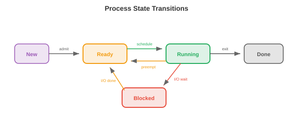

# 操作系统

> **一句话总结**: 操作系统 (Operating System, OS) 是硬件与应用之间的软件层, 负责管理资源、提供抽象、强制隔离, 让进程、线程、内存、文件和网络井然有序地运转.

*操作系统是硬件与应用程序之间的软件层, 它管理资源、提供抽象、并强制隔离. 本节讲操作系统做什么, 以及进程、线程、CPU 调度、内存管理、文件系统和系统调用.*

- 一台没有操作系统的电脑就像一间没有厨师的厨房: 食材 (硬件) 都在, 但没人协调谁用炉子、盘子放哪儿、如何防止两个人同时抢同一把刀. **OS** 就是那个协调者.

- 对 ML 从业者来说, 操作系统概念解释了很多现象: 为什么 `nvidia-smi` 能显示每个进程的 GPU 显存占用, 为什么训练会崩溃报 "out of memory", 为什么 `fork()` 会复制你的 Python 进程, 为什么 Docker 容器能提供隔离的环境.

## 操作系统做什么

- 操作系统有三大核心职责:

    - **抽象 (Abstraction)**: 把硬件复杂性藏在干净的接口后面. 程序读写 "文件" 时不需要知道底层存储是 SSD、HDD 还是网络硬盘. 它们分配 "内存" 时不需要管物理 RAM 芯片. 它们跑在 "CPU" 上时不用操心中断和缓存一致性.

    - **资源管理 (Resource management)**: 多个程序共享 CPU、内存、磁盘和网络. 操作系统决定谁拿到什么、什么时候拿、拿多久. 一个公平高效的分配策略, 能让系统保持响应.

    - **隔离与保护 (Isolation and protection)**: 程序之间不能互相干扰. 你浏览器里的 bug 不应该让内核崩溃. 恶意程序不应该能读到其它程序的密码. 操作系统靠硬件支持 (特权级、虚拟内存) 强制这些边界.

## 进程

- **进程 (process)** 就是正在运行的程序, 是操作系统的基本工作单元. 每个进程都有:

    - **代码 (Code)** (程序指令, 只读).
    - **数据 (Data)** (全局变量、堆分配).
    - **栈 (Stack)** (函数调用帧、局部变量).
    - **状态 (State)** (寄存器值、程序计数器、打开的文件等等).

- **进程控制块 (Process Control Block, PCB)** 是操作系统追踪进程的数据结构. 它保存进程 ID (PID)、状态、程序计数器、寄存器内容、内存映射、打开的文件描述符、以及调度优先级. 当操作系统从一个进程切换到另一个进程时, 会把当前进程的状态存进它的 PCB, 再加载下一个进程的状态. 这就是**上下文切换 (context switch)**.

- 上下文切换代价不小: 保存与恢复寄存器、刷新缓存、失效 TLB 条目, 都是微秒级开销. 在跑着几千个进程的系统上, 这个开销会很可观. 这也是为什么老式 Apache 那种 "每请求一个进程" 的服务器架构, 后来被基于线程或事件驱动的架构取代.

- Unix 里**创建进程**用的是 `fork()` 和 `exec()`:

    - `fork()` 创建当前进程的一个**副本**. 子进程拿到父进程内存、文件描述符和状态的复制品. 两个进程都从同一个点继续执行, 但 `fork()` 在子进程里返回 0, 在父进程里返回子进程的 PID.

    - `exec()` 把当前进程的代码替换成一个新程序. `fork()` 之后, 子进程通常会调用 `exec()` 去跑另一个程序.

    - 这种 fork-then-exec 模型很优雅: 创建新进程 (fork) 与加载新程序 (exec) 是两个独立的操作, 可以分别定制. 在 fork 和 exec 之间, 子进程可以重定向 I/O、修改环境变量、或者降权.



- **进程状态**: 一个进程会处在下面几种状态之一:
    - **运行 (Running)**: 当前正在某个 CPU 核心上执行.
    - **就绪 (Ready)**: 等待 CPU 核心 (可运行但还没被调度).
    - **阻塞 (Blocked)** (等待): 在某个事件发生前无法继续 (I/O 完成、锁获取、定时器到期).
    - **终止 (Terminated)**: 执行完毕, 等父进程收集它的退出状态.

## 线程

- **线程 (thread)** 是进程内的轻量级执行单元. 同一进程里的所有线程共享同样的代码、数据、堆, 但每个线程有自己的栈和寄存器状态.

- 相比多进程的优点: 线程共享内存, 所以它们之间的通信很快 (直接读写共享变量就行). 进程之间通信则要用进程间通信 (Inter-Process Communication, IPC), 比如管道、套接字、共享内存映射, 更慢也更复杂.

- 缺点: 共享内存很危险. 两个线程同时写同一个变量会造成**竞态条件 (race condition)** (结果取决于哪个线程先跑). 这就引出了同步机制, 我们会在第 4 节讲.

- **内核线程 (Kernel threads)** 由操作系统调度器管理. 每个线程被独立地调度到 CPU 核心上. 创建和切换内核线程要走系统调用, 开销跟进程上下文切换类似 (但略小).

- **用户线程 (User threads)** (绿色线程, green threads) 由用户态的运行时库管理, 操作系统看不见. 它们创建和切换更便宜 (不用系统调用), 但一个用户线程做阻塞操作会阻塞整个进程里的所有线程 (因为操作系统只看到一个内核线程).

- 现代系统用**混合模型**: 很多用户线程映射到少数几个内核线程 (M:N 线程模型). Go 的 goroutine、Erlang 的 process, 都是由语言运行时调度到操作系统线程上的用户级线程.

- **线程池 (Thread pools)** 预先创建固定数量的线程等着接活. 有任务来了, 就分给空闲线程. 这样就避免了每来一个任务就创建、销毁线程的开销. Web 服务器、数据库引擎、ML 推理服务, 用的都是线程池.

## CPU 调度

- **调度器 (scheduler)** 决定每一刻哪个进程/线程跑在哪个 CPU 核心上. 目标是: 最大化 CPU 利用率、最小化响应时间 (对交互任务)、最大化吞吐量 (对批处理任务), 同时保证公平.

- **先来先服务 (First Come First Served, FCFS)**: 进程按到达顺序执行. 简单但会有**护航效应 (convoy effect)**: 一个长任务把后面所有短任务都堵住了.

- **最短作业优先 (Shortest Job First, SJF)**: 先跑最短的进程. 可以证明它能最小化平均等待时间, 但需要提前知道任务的长度 (一般来说做不到). 它的抢占式版本叫**最短剩余时间优先 (Shortest Remaining Time First, SRTF)**: 如果来了个更短的任务, 就中断正在跑的任务.

- **时间片轮转 (Round Robin, RR)**: 每个进程拿一个固定的**时间片 (time quantum)** (比如 10 ms), 然后被抢占并放回队尾. 公平且响应快, 但时间片长度很关键: 太小会导致频繁上下文切换, 太大就退化成 FCFS.

- **优先级调度 (Priority scheduling)**: 每个进程有一个优先级, 高优先级先跑. 危险在于**饥饿 (starvation)**: 如果高优先级进程源源不断地来, 低优先级进程可能永远跑不上. **老化 (Aging)** 解决这个问题: 一个进程等得越久, 优先级就越高.

- **多级反馈队列 (Multilevel Feedback Queues, MLFQ)**: 多个队列, 每个有不同的优先级和时间片. 新进程从最高优先级队列开始 (短时间片). 如果进程用完了整个时间片 (CPU 密集型), 就被降到低优先级队列 (更长时间片). 交互式进程自然停留在高优先级队列 (在用完时间片前就因为 I/O 阻塞了). 这套机制能自适应工作负载, 不需要提前知道任务类型.

- **完全公平调度器 (Completely Fair Scheduler, CFS)**: Linux 用的调度器. 它维护一棵红黑树 (一种平衡二叉搜索树), 里面的进程按 "虚拟运行时间" 排序 —— 也就是它们已经消耗了多少 CPU 时间. 虚拟运行时间最小的那个下一个跑. 这样长期看, 每个进程都能拿到公平的份额. CFS 每次调度决策的复杂度是 $O(\log n)$.

## 内存管理

- 操作系统管理物理 RAM, 把它分配给进程, 不用了就回收.

- **分页 (Paging)** (来自第 2 节) 把虚拟内存分成固定大小的页, 物理内存分成同样大小的页框. 页表把页映射到页框. 分页消除了外部碎片 (分配之间的浪费空间), 因为所有页大小都一样.

- **按需分页 (Demand paging)** 只在页第一次被访问时才把它加载进 RAM (不是在进程启动时). 这样能省内存: 一个 1 GB 代码的程序, 一次典型运行可能只用到 50 MB. 剩下的从不加载.

- 当 RAM 满了、又要新页时, 操作系统必须**驱逐 (evict)** 一个现有的页. **页替换 (page replacement)** 算法 (LRU、FIFO、时钟, 来自第 2 节) 决定驱逐哪一页. 好的替换策略能最小化缺页; 差的策略会导致抖动 (thrashing).

- **分段 (Segmentation)** 把内存分成可变大小的段 (代码、数据、栈、堆), 每段有自己的基址和长度. 段提供逻辑组织, 分页提供物理管理. 现代系统很少用分段 (主要用于保护), 内存管理主要靠分页.

- **堆 (heap)** 是动态分配内存的地方 (C 里的 `malloc`/`free`, Java 里的 `new`, Python 里是隐式的). 操作系统把大块内存交给进程, 一个**内存分配器 (memory allocator)** (比如 `glibc malloc`、`jemalloc`、`tcmalloc`) 再把这些大块切成更小的分配. 分配器的设计影响性能: 碎片浪费空间, 线程间的竞争浪费时间.

## 文件系统

- **文件系统 (file system)** 把持久化存储 (SSD、HDD) 上的数据组织成一个命名文件和目录的层次结构.

- **inode** (索引节点) 存文件的元数据: 大小、所有权、权限、时间戳、以及指向磁盘上数据块的指针. 文件名存在目录里, 目录把名字映射到 inode 编号. 这种分离意味着一个文件可以有多个名字 (**硬链接 (hard links)**) 指向同一个 inode.

- **FAT** (File Allocation Table, 文件分配表): 一种简单的文件系统, 用在 U 盘和 SD 卡上. 一张表把每个簇 (块) 映射到文件中的下一个簇, 形成一个链表. 简单, 但不支持权限、日志, 对大文件也支持得不好.

- **ext4**: Linux 的默认文件系统. 用 inode 加上直接、间接、二级间接、三级间接的块指针, 能处理任意大小的文件. 支持**区段 (extents)** (连续的块范围), 对大文件效率更高. 最大文件 16 TB, 最大分区 1 EB.

- **日志 (Journaling)** 保护文件系统不被崩溃搞坏. 修改文件系统结构之前, 先把变更写进**日志 (journal)**. 如果系统在操作中途崩溃了, 重启时会重放日志来完成或撤销这个操作. 没有日志的话, 一次写入中途崩溃可能让文件系统进入不一致状态 (文件的数据块更新了但 inode 没更新, 或者反过来).

- **基于 B-树的文件系统 (B-tree based file systems)** (Btrfs、ZFS) 用 B-树 (平衡搜索树) 组织数据和元数据, 支持高效搜索、写时复制快照、以及内建的校验和保证数据完整性. 这些 B-树跟数据库索引里用的是同一种.

## 系统调用与内核态

- **系统调用 (system call)** 是用户程序与操作系统内核之间的接口. 程序需要做特权操作时 (读文件、分配内存、创建进程、发网络包), 就发一个系统调用.

- CPU 有两种模式:
    - **用户态 (User mode)**: 受限. 程序能执行自己的代码、访问自己的内存, 但不能直接访问硬件、其它进程的内存, 或操作系统的数据结构.
    - **内核态 (Kernel mode)**: 不受限. 操作系统内核能访问所有硬件和内存. 系统调用就是从用户态到内核态的受控通道.

- 当程序调用 `read()` 时, 发生的事情是:
    1. 程序把参数放到寄存器里, 触发一个**陷阱 (trap)** (软件中断).
    2. CPU 切到内核态, 跳到系统调用处理程序.
    3. 内核验证参数、执行 I/O 操作、把数据拷到用户的缓冲区.
    4. 内核切回用户态, 返回结果.

- 常见的系统调用: `open`、`read`、`write`、`close` (文件), `fork`、`exec`、`wait`、`exit` (进程), `mmap`、`brk` (内存), `socket`、`bind`、`listen`、`accept` (网络).

- **中断 (Interrupts)** 是硬件信号, 强制 CPU 暂时停下手头的活, 去跑一个中断处理程序 (在内核里). 键盘按键、网络包到达、定时器 tick 都会产生中断. 定时器中断特别重要: 它让操作系统能抢占正在跑的进程, 切到另一个 (抢占式多任务).

## 网络基础

- 网络栈是操作系统的一个子系统, 让机器之间能通信. 理解它能解释分布式训练是怎么同步梯度的, 模型服务是怎么处理请求的, 以及为什么延迟这么重要.


- **TCP/IP 模型**把网络分成若干层, 每层给上一层提供一个抽象:

    - **链路层 (Link layer)**: 处理单条物理链路上的通信 (以太网、Wi-Fi). 涉及 MAC 地址和帧.
    - **网络层 (Network layer, IP)**: 把包从源路由到目的地, 跨越多个网络. 每台机器有个 **IP 地址** (比如 IPv4 的 192.168.1.1, 或者 128 位的 IPv6 地址). 路由器根据目的 IP 一跳一跳地转发包.
    - **传输层 (Transport layer, TCP/UDP)**: 提供应用之间的端到端通信.
    - **应用层 (Application layer)**: 应用直接用的协议, 比如 HTTP、DNS、gRPC.

- **TCP** (Transmission Control Protocol, 传输控制协议) 提供可靠的、有序的传输. 它先建立连接 (三次握手: SYN、SYN-ACK、ACK), 保证所有数据按顺序到达 (靠序列号和确认), 重传丢失的包, 并控制发送速率避免压垮网络 (**拥塞控制 (congestion control)**). 代价是延迟: 握手多一次往返, 重传增加延迟.

- **UDP** (User Datagram Protocol, 用户数据报协议) 提供不可靠、无序的传输. 没握手、没重传、不保证顺序. 延迟比 TCP 低得多. 用在速度比可靠性更重要的地方: 视频流、在线游戏、DNS 查询. 在 ML 里, 有些梯度同步协议用基于 UDP 的 RDMA 来降低延迟.

- **套接字 (Sockets)** 是操作系统提供的网络通信 API. 一个**套接字 (socket)** 就是一个由 (IP 地址, 端口号) 标识的端点. 服务器创建一个套接字, 把它绑定到一个端口 (比如 HTTP 用 80), 监听连接, 然后接受它们. 客户端创建一个套接字, 连到服务器的地址:端口. 数据像文件一样通过套接字读写.

- **DNS** (Domain Name System, 域名系统) 把人类可读的名字 (google.com) 翻译成 IP 地址 (142.250.80.46). 它是一个分布式的分层数据库: 你的机器问一个本地解析器, 解析器问根服务器, 根服务器再委派给每个域名的权威服务器.

- **HTTP** (HyperText Transfer Protocol, 超文本传输协议) 是 Web 的请求-响应协议. 客户端发一个请求 (方法 + URL + 头部 + 可选的正文), 服务器发一个响应 (状态码 + 头部 + 正文). ML 模型服务 (比如 TensorFlow Serving、Triton) 把模型作为 HTTP 或 gRPC 端点暴露出去.

- **延迟 vs 带宽 (Latency vs bandwidth)**: 延迟是一个包从源到目的地的时间 (由物理距离和网络跳数决定). 带宽是数据速率 (每秒多少字节). 一条高带宽、高延迟的连接 (卫星互联网) 能传输大量数据, 但每个字节到达都要很久. 在分布式训练里, **延迟**对同步屏障重要 (所有 GPU 都要等最慢的那个), **带宽**对传输大梯度张量重要 (第 6 章).

## 虚拟化与容器

- **虚拟化 (Virtualisation)** 在一台物理机器上跑多个操作系统. **虚拟机监控器 (hypervisor)** (VMware、KVM、Xen) 创建**虚拟机 (virtual machines, VMs)**, 每个虚拟机有自己的虚拟 CPU、内存、磁盘、网络接口. 每个虚拟机跑一个完整的操作系统 (客户机 OS, guest OS), 客户机 OS 以为自己独占硬件.

- 虚拟机提供强隔离 (一个虚拟机崩溃不影响其它) 和灵活性 (在同一台机器上跑 Linux 和 Windows, 在物理主机之间迁移虚拟机). 代价是开销: 每个虚拟机跑一整个操作系统内核, 消耗内存和 CPU 来做那些跟宿主机 OS 冗余的操作系统事务.


- **容器 (Containers)** (Docker、Podman) 提供一个更轻量的替代方案. 容器不虚拟化整个硬件, 而是共享宿主机 OS 内核, 利用内核特性来隔离进程:

    - **命名空间 (Namespaces)** 隔离进程能看到的东西: 每个容器有自己的进程树视图 (PID 命名空间)、网络接口 (network 命名空间)、文件系统挂载点 (mount 命名空间)、以及主机名 (UTS 命名空间). 容器里的进程看不到其它容器里的进程.

    - **控制组 (Cgroups, control groups)** 限制进程能用多少资源: CPU 时间、内存、磁盘 I/O、网络带宽. 容器不能消耗比它的 cgroup 允许更多的资源, 防止一个容器把其它容器饿死.

- 容器毫秒级启动 (不用启动 OS), 开销极小 (共享内核), 通过 **Dockerfile** 定义, Dockerfile 里写清基础镜像、依赖、命令. 这让容器可复现: `docker build` 在任何地方都能产出同样的环境.

- 对 ML 来说, 容器解决了 "在我这儿好使" 的问题. 一个装着特定版本 CUDA、cuDNN、PyTorch、Python 的训练环境被打包成容器镜像. 任何人在任何机器上都能复现完全一样的环境. 云端训练平台 (AWS SageMaker、GCP Vertex AI) 就在容器里跑训练任务.

- **Kubernetes** (K8s) 在规模化场景下编排容器: 把容器调度到一个机器集群上, 重启失败的容器, 根据负载扩缩容, 管理容器之间的网络. 大规模 ML 服务 (几千个模型副本处理几百万请求) 就跑在 Kubernetes 上.

## 安全基础

- 操作系统通过多种机制强制安全:

- **权限 (Permissions)**: 每个文件有一个所有者、一个组、以及权限位 (针对所有者、组、其它人的读/写/执行). 进程以启动它的用户身份 (UID) 运行, 只能访问权限位允许的文件. **root** 用户 (UID 0) 绕过所有权限检查, 这就是为什么以 root 身份运行很危险.

- **权限分离 (Privilege separation)**: 进程以完成任务所需的最小权限运行. Web 服务器不需要 root 权限; 它应该以一个受限用户身份运行, 只能读 Web 文件、绑定 80 端口. 如果服务器被攻破, 攻击者能做的事就限制在那个受限用户能做的范围内.

- **沙盒 (Sandboxing)**: 在文件权限之外, 进一步限制进程能做什么. **seccomp** (Linux) 限制进程能调用哪些系统调用. **AppArmor** 和 **SELinux** 定义强制访问控制策略. 容器结合了命名空间、cgroups 和 seccomp, 形成多层隔离.

- **地址空间布局随机化 (Address Space Layout Randomisation, ASLR)**: 每次程序运行时, 随机化栈、堆、库的内存位置. 这让攻击者更难利用内存破坏漏洞 (缓冲区溢出), 因为他们没法预测代码或数据在内存里的位置.

- 安全是全系统的事: 一条链子只有它最薄弱的一环那么结实. 一个模型服务系统需要安全的网络通信 (TLS/HTTPS)、认证的 API 访问 (API 密钥、OAuth)、输入验证 (防对抗性输入)、以及隔离的执行 (最小权限容器).

## 编码任务 (用 CoLab 或 notebook)

1. 探索进程创建. 用 Python 的 `os.fork()` (仅 Unix) 创建一个子进程, 观察父子进程都从同一点继续.
```python
import os

pid = os.fork()

if pid == 0:
    # 子进程
    print(f"Child: my PID is {os.getpid()}, parent PID is {os.getppid()}")
else:
    # 父进程
    print(f"Parent: my PID is {os.getpid()}, child PID is {pid}")
    os.wait()  # 等子进程结束
```

2. 模拟时间片轮转调度. 给一组进程及各自的执行时间 (burst time), 模拟调度过程并计算平均等待时间.
```python
def round_robin(processes, quantum=3):
    """模拟时间片轮转调度.
    processes: (name, burst_time) 元组列表.
    """
    queue = [(name, burst, 0) for name, burst in processes]  # (name, remaining, wait)
    time = 0
    log = []

    while queue:
        name, remaining, waited = queue.pop(0)
        waited += (time - waited - (processes[[p[0] for p in processes].index(name)][1] - remaining))
        run_time = min(quantum, remaining)
        log.append(f"  t={time:3d}: {name} runs for {run_time} (remaining: {remaining - run_time})")
        time += run_time
        remaining -= run_time

        if remaining > 0:
            queue.append((name, remaining, time))
        else:
            log.append(f"  t={time:3d}: {name} DONE (turnaround: {time})")

    for line in log:
        print(line)

print("Round Robin (quantum=3):")
round_robin([("P1", 10), ("P2", 4), ("P3", 6)], quantum=3)
```

3. 用 LRU 模拟页替换. 给一段页访问序列和固定的页框数, 统计缺页数.
```python
def lru_page_replacement(pages, n_frames):
    """模拟 LRU 页替换."""
    frames = []
    faults = 0

    for page in pages:
        if page in frames:
            frames.remove(page)
            frames.append(page)  # 移到最近使用位置
            status = "HIT "
        else:
            faults += 1
            if len(frames) >= n_frames:
                evicted = frames.pop(0)  # 移除最久未用
                status = f"MISS (evict {evicted})"
            else:
                status = "MISS (cold)"
            frames.append(page)
        print(f"  Page {page}: {status}  frames={frames}")

    print(f"\nTotal faults: {faults}/{len(pages)} ({faults/len(pages):.0%})")

print("LRU with 3 frames:")
lru_page_replacement([1, 2, 3, 4, 1, 2, 5, 1, 2, 3, 4, 5], n_frames=3)
```

---

## 📌 本节要点

- **操作系统三大职责**: 抽象硬件、管理资源、隔离与保护, 让多个程序在同一台机器上安全共处.
- **进程 (process)**: 运行中的程序, 由 PCB 追踪; 上下文切换代价高.
- **fork 与 exec**: Unix 创建进程的经典组合, 先复制再替换, 中间可定制.
- **线程 (thread)**: 进程内轻量执行单元, 共享内存但需要同步; 内核线程、用户线程、M:N 混合各有取舍.
- **CPU 调度**: FCFS、SJF、RR、优先级、MLFQ、CFS —— 各种策略在公平、响应、吞吐之间权衡; Linux CFS 用红黑树做 $O(\log n)$ 决策.
- **内存管理**: 分页消除外部碎片, 按需分页省内存, 页替换 (LRU 等) 避免抖动.
- **文件系统**: inode 存元数据, 硬链接靠共享 inode; ext4、Btrfs、ZFS 各有特长; 日志防崩溃.
- **系统调用 (system call)**: 用户态与内核态之间的受控通道, 用陷阱指令切换; 定时器中断支撑抢占式多任务.
- **网络栈**: TCP/IP 分层, TCP 可靠 UDP 快, 套接字是通用 API; 分布式训练里延迟与带宽都关键.
- **虚拟化与容器**: 虚拟机跑独立 OS 隔离最强, 容器共享内核靠命名空间 + cgroups 更轻量; K8s 编排大规模 ML 服务.
