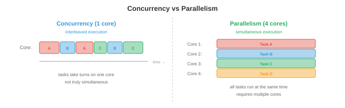

# 并发与并行

> **一句话总结**: 并发是"管理"多任务交替推进, 并行是"同时"在多核上真跑; 本节把同步原语、经典难题、死锁、无锁结构、异步与扩展律串成一条主线.

*并发与并行是程序"同时做多件事"的两种玩法. 本节讲清楚并发与并行的区别、同步原语、经典并发难题、死锁、无锁数据结构、并行编程模型、异步编程与扩展律 —— 这些是多线程服务器、分布式训练以及现代一切应用的地基.*

- 一个中央处理器 (Central Processing Unit, CPU) 核心一次只能执行一条指令. 但现代系统动辄 8 核、64 核, 甚至上千核 (图形处理器 (Graphics Processing Unit, GPU)). 就算只有一个核, 我们也想同时处理多件事: 下载文件、渲染界面、响应用户输入. **并发** (concurrency) 与**并行** (parallelism) 就是应对这类多任务场景的两种策略.

## 并发 vs 并行



- **并发**关心的是"*管理*"多个任务. 任务通过交替 (interleaving) 推进: 任务 A 跑一会, 换任务 B, 再回来 A. 单核上, 并发制造出"同时执行"的假象. 任务并非真的同步, 只是轮流上场.

- **并行**关心的是"*执行*"多个任务同时进行. 有 $n$ 个核, 就能真让 $n$ 个任务在同一瞬间跑. 并行需要多个硬件执行单元.

- 打个比方: 并发像一个厨子在切菜和搅锅之间来回切换; 并行则是两个厨子, 一人一件事一起干. 系统可以只并发不并行 (单核、任务交替), 可以只并行不并发 (多核跑各自独立、互不通信的程序), 也可以两者兼有 (多核跑相互交互的交替任务).

- 在机器学习里, 并发常见于数据加载 (数据预处理与 GPU 计算重叠), 并行则出现在分布式训练 (多张 GPU 同时算梯度, 见第 6 章).

## 同步原语

- 多个线程共享数据时, **同步** (synchronisation) 用来防止**竞态条件** (race condition). 竞态条件指结果依赖于线程执行顺序 —— 而这个顺序是不可预测的.

- 想象两个线程都在给共享计数器加 1: `counter += 1`. 这其实是三步: (1) 读 counter, (2) 加 1, (3) 写回 counter. 如果两个线程都读到了同一个值 (比如 5), 各自加 1, 各自写回 6, 那么最终 counter 变成 6, 而正确答案应该是 7. 有一次加法被丢了.

- **互斥锁** (mutual exclusion lock, mutex) 保证同一时刻只有一个线程能进入临界区. 线程进入临界区前**获取** (acquire) 锁, 离开时**释放** (release) 锁. 其他线程想拿这把已被持有的锁, 只能阻塞等它被释放.

```
lock.acquire()
counter += 1      # 同一时刻这里只能有一个线程
lock.release()
```

- 互斥锁正确, 但会带来**争用** (contention): 大量线程抢同一把锁时, 大家都在等而不是在算, 可扩展性受限. 极端情况下, 所有线程都要同一把锁, 整个程序就串行化了.

- **信号量** (semaphore) 是互斥锁的推广. 计数信号量维护一个计数器: `wait()` 减 1 (若会变负则阻塞), `signal()` 加 1. 初始化为 1 的信号量行为等价于互斥锁. 初始化为 $n$ 的信号量允许最多 $n$ 个线程同时进入临界区 (常用于资源池, 例如数据库连接池).

- **条件变量** (condition variable) 让线程等到某个特定条件被满足. 线程先释放锁, 在条件变量上等待, 直到另一个线程发出信号才被唤醒. 这样就避免了**忙等** (busy-waiting) —— 在循环里反复检查条件、白白浪费 CPU.

- **监视器** (monitor) 把互斥锁、条件变量与共享数据打包成一个抽象. Java 的 `synchronized` 关键字与 Python 的 `threading.Condition` 就是监视器式语义的实现.

- **读写锁** (read-write lock) 区分**读者** (读不改数据, 可共享访问) 与**写者** (需要独占). 多个读者可以同时持锁, 但写者会阻塞所有读者和其他写者. 读远多于写的场景 (例如一个缓存好的模型在做预测服务) 里最合适.

## 经典并发难题

- **生产者-消费者** (producer-consumer, 有界缓冲区): 生产者生成物品放入固定大小缓冲区; 消费者取走物品. 难点: 缓冲区满时生产者要等, 空时消费者要等, 双方都不能破坏缓冲区.

- 标准解法用两个信号量 (一个数空槽, 一个数满槽) 加一把互斥锁保护缓冲区本身. 大多数消息队列、日志系统、数据管道背后都是这套模式.

- **读者-写者** (readers-writers): 多个读者可以同时读, 写者需要独占. 难点是**公平性**: 如果读者源源不断进来, 写者可能永远拿不到锁 —— 也就是**饿死** (starvation). 解法要么偏向读者、要么偏向写者, 要么严格轮流.

- **哲学家进餐** (dining philosophers): 五位哲学家围桌而坐, 每两人之间放一把叉子. 每人需要两把叉子才能吃. 如果五人同时拿起左手叉子, 就没人拿得到右手叉子, 全体饿死 (死锁). 解法有: 原子地一次拿两把叉、引入不对称性 (让某位先拿右手叉)、或者引入一个"服务员"信号量, 最多允许 4 人同时进餐.

## 死锁

- **死锁** (deadlock) 是指一组线程各自持有某个资源, 又都在等对方手里的资源, 形成环形依赖. 谁都动不了.


- 死锁的四个**必要条件** (必须同时成立):

    1. **互斥**: 资源同一时刻只能被一个线程持有.
    2. **占有并等待**: 线程持有一个资源的同时又在等另一个.
    3. **非抢占**: 资源不能被强行从线程手中夺走.
    4. **环形等待**: 等待图中存在环.

- **死锁预防** (deadlock prevention) 通过打破四条中的任一条来避免:
    - 打破环形等待: 给资源规定一个全序. 所有线程按同一顺序获取资源. 如果每个线程永远都先拿锁 A 再拿锁 B, 就构不成环.
    - 打破占有并等待: 要求线程一次性 (原子地) 申请到全部资源.

- **死锁避免** (deadlock avoidance) 动态判断当前的资源请求会不会导致死锁. **银行家算法** (Banker's algorithm) 维护每个线程可能提出的最大需求, 只批准那些让系统仍处于"**安全状态**" (safe state, 所有线程最终都能完成的状态) 的请求. 算法每次判断复杂度 $O(n^2 m)$ ($n$ 个线程, $m$ 种资源类型), 对多数真实系统来说太贵.

- **死锁检测** (deadlock detection) 允许死锁发生, 然后检测出来 (在等待图里找环), 再恢复 (杀掉某个线程或回滚某个事务).

- 实际系统一般用"常见情况预防 (资源排序) + 罕见情况检测"的组合. 数据库是最典型的例子: 它检测事务之间的死锁, 中止其中一个来打破循环.

## 无锁与无等待数据结构

- 锁会带来争用、优先级反转 (priority inversion), 还有死锁风险. **无锁** (lock-free) 数据结构干脆不用锁, 靠硬件提供的**原子操作** (atomic operations) 实现.

- 最关键的原子操作是**比较并交换** (Compare-And-Swap, CAS): 原子地检查某个内存位置是不是期望值, 若是就替换成新值. 伪代码:

```
CAS(address, expected, new_value):
    if *address == expected:
        *address = new_value
        return true
    else:
        return false
```

- CAS 由单条硬件指令实现, 因此无需锁也能保证原子性. 无锁算法用 CAS 配合重试循环: 读当前值 → 算新值 → 尝试 CAS. 如果这中间有别的线程改了值, CAS 就会失败, 本线程重试.

- 但光"原子"还不够. 现代 CPU 与编译器会**重排** (reorder) 内存操作: 只要在单线程视角下语义不变, 读写可以被推前或延后, 缓存可以延迟同步. 单线程无感, 但多线程下, A 线程写了数据再写标志位, B 线程可能先看到标志位再看到旧数据 —— CAS 本身成功了, 但配套的数据没跟上, 无锁结构就坏了.

- **内存屏障** (memory barrier, memory fence) 是硬件指令, 强制它前后的内存操作按程序顺序对其他核可见. 例如 x86 的 `mfence` (完全屏障), ARM 的 `dmb` (data memory barrier). 屏障保证"在这条线之前的写, 全部在这条线之后的读看到之前完成".

- 直接手写屏障太底层, 主流语言用**获取-释放语义** (acquire-release semantics) 抽象:

    - **获取** (acquire) 读: 保证这条读之后的所有内存操作, 不会被重排到它之前 (对应"进入临界区"的语义).
    - **释放** (release) 写: 保证这条写之前的所有内存操作, 不会被重排到它之后 (对应"离开临界区"的语义).
    - 一次 acquire 读能**看到**先前 release 写发布的所有数据 —— 这就是无锁编程的核心同步保证.

- C++11、Java、Rust 的**内存模型** (memory model) 把这套语义标准化了. C++ `std::atomic` 支持 `memory_order_acquire` / `memory_order_release` / `memory_order_seq_cst` (顺序一致, 最强, 默认); Java 的 `volatile` 与 `java.util.concurrent.atomic` 类隐含 acquire-release; Rust 的 `Ordering::Acquire` / `Release` / `SeqCst` 一一对应. 用错顺序会引入**难以复现**的错误 —— 只在特定 CPU (弱内存模型如 ARM) 上、特定时序下才浮现 [Boehm & Adve, 2008; Herlihy & Shavit, *The Art of Multiprocessor Programming*, 2nd ed., 2020].

- 简单心法: 写无锁结构时, **发布数据用 release, 读数据用 acquire**; 拿不准就用 `seq_cst`, 慢一点但正确. 顺序一致是最强的内存模型, 让所有线程看到操作的同一全局顺序.

- **无锁** (lock-free): 至少有一个线程能在有限步内继续推进 (不会死锁, 但某个具体线程可能在争用下无限次重试).

- **无等待** (wait-free): 每个线程都能在有界步数内推进 (最强保证, 但也最难实现).

- 无锁栈、无锁队列、无锁哈希表在高性能系统里很常见. Java 的 `ConcurrentHashMap` 和 Go 的 atomic 操作都建立在 CAS 之上.

## 并行编程模型

- **共享内存** (shared memory) 并行: 所有线程访问同一内存空间. 同步由程序员负责. **OpenMP** 用编译指示符 (pragma) 把循环并行化:

```c
#pragma omp parallel for
for (int i = 0; i < n; i++) {
    result[i] = compute(data[i]);
}
```

- 编译器会把循环迭代切分到可用核心上. OpenMP 特别适合数据并行 (对大量数据点做同样操作) 的负载, 科学计算里用得很多.

- **消息传递** (message passing) 并行: 每个进程有自己的内存, 通信靠收发消息. **消息传递接口** (Message Passing Interface, MPI) 是跨节点分布式计算的事实标准:

```c
MPI_Send(data, count, MPI_FLOAT, dest, tag, MPI_COMM_WORLD);
MPI_Recv(data, count, MPI_FLOAT, src, tag, MPI_COMM_WORLD, &status);
```

- MPI 能扩展到上千节点, 就因为没有共享状态要同步. 分布式深度学习 (第 6 章) 用类似 `MPI_AllReduce` (环形 all-reduce) 这样的集合通信操作在多张 GPU 间同步梯度.

- **GPU 并行**遵循**单指令多线程** (Single Instruction, Multiple Threads, SIMT) 模型: 数千线程对不同数据执行同一条指令. 这对矩阵运算 (第 2 章) 完美契合 —— 每个元素都做同样的乘加. GPU 编程的细节留到后面章节.

## 异步与事件驱动编程

- 并发不一定非用线程. **异步** (asynchronous) 编程用一个线程 + 一个**事件循环** (event loop) 就能处理大量 I/O 密集型任务.

- 事件循环维护一个任务队列. 某个任务需要等 I/O (网络响应、文件读取) 时, 它注册一个回调、让出控制权. 事件循环去处理下一个准备就绪的任务. I/O 完成后, 回调重新入队并最终被执行. 整个等待过程没有任何线程被阻塞.

- **协程** (coroutine) 是可以挂起、恢复的函数. `async/await` 语法 (Python、JavaScript、Rust) 让协程看起来跟普通顺序代码一样:

```python
async def fetch_data(url):
    response = await http_get(url)  # 在这里挂起, 事件循环去跑别的任务
    return process(response)         # 响应到来时从这里继续
```

- `await` 关键字把协程挂起, 把控制权还给事件循环. 等到被 await 的操作完成, 协程从原地恢复. 这是**协作式** (cooperative) 多任务: 协程自愿让出; 与之对应的是**抢占式** (preemptive) 多任务, 由操作系统 (Operating System, OS) 强行切换线程.

- 异步非常适合**I/O 密集型** (I/O-bound) 负载且并发连接数很大的场景 (Web 服务器同时应付成千上万个客户端). 它并不适合**CPU 密集型** (CPU-bound) 工作 —— 单线程事件循环无法利用多核. CPU 密集型任务该上线程或进程.

- Python 的**全局解释器锁** (Global Interpreter Lock, GIL) 挡住了线程真正的并行: 同一时刻只有一个线程能执行 Python 字节码. 这也是为什么 Python 用多进程 (每个进程一个独立解释器) 做 CPU 并行, 用异步做 I/O 并发. Python 3.13+ (free-threaded Python) 开始移除 GIL, 未来将支持真正的多线程并行.

## 扩展律

- **阿姆达尔定律** (Amdahl's law) 描述并行化带来的理论加速上限. 设程序中有比例 $p$ 是可并行的, 剩下 $1 - p$ 是串行的:

$$\text{Speedup}(n) = \frac{1}{(1-p) + \frac{p}{n}}$$


- 其中 $n$ 是处理器个数. 当 $n \to \infty$, 最大加速趋近 $\frac{1}{1-p}$. 如果程序 95% 是并行的, 最大加速就是 $\frac{1}{0.05} = 20\times$, 加再多核也没用. **串行部分才是瓶颈**.

- 这对机器学习有深远影响: 如果数据加载占训练时间的 10% 且是串行的, 那么加多少 GPU 顶多把训练提速 10 倍. 那 10% 串行瓶颈把一切都卡死了 (所以高效的数据管道以及"计算与 I/O 重叠"如此重要, 见第 6 章).

- **古斯塔夫森定律** (Gustafson's law) 给出更乐观的视角. 它不再固定问题规模再堆处理器, 而是固定总时间, 问在这段时间里能多做多少工作. 若并行部分随问题规模一起放大:

$$\text{Speedup}(n) = 1 - p + p \cdot n$$

- 这是 $n$ 的线性函数. 论点: 处理器多了, 我们去解更大的问题, 而不是把同一问题解得更快. 在机器学习里, 这对应"多 GPU 就把批大小 (batch size) 放大" (weak scaling), 而不是保持批大小不变 (strong scaling).

## 编程练习 (在 CoLab 或 notebook 里做)

1. 复现一个竞态条件. 让两个线程无同步地给共享计数器加 1, 观察丢失的更新.
```python
import threading

counter = 0

def increment(n):
    global counter
    for _ in range(n):
        counter += 1  # 非原子: 读、加、写

threads = [threading.Thread(target=increment, args=(100000,)) for _ in range(4)]
for t in threads: t.start()
for t in threads: t.join()

print(f"Expected: {4 * 100000}")
print(f"Actual:   {counter}")
print(f"Lost updates: {4 * 100000 - counter}")
```

2. 用锁修好这个竞态条件, 并测量开销.
```python
import threading
import time

lock = threading.Lock()
counter = 0

def increment_locked(n):
    global counter
    for _ in range(n):
        with lock:
            counter += 1

start = time.time()
threads = [threading.Thread(target=increment_locked, args=(100000,)) for _ in range(4)]
for t in threads: t.start()
for t in threads: t.join()
elapsed = time.time() - start

print(f"Counter: {counter} (correct: {4 * 100000})")
print(f"Time with lock: {elapsed:.3f}s")
```

3. 可视化阿姆达尔定律. 对不同并行比例, 画出加速比随处理器数的曲线.
```python
import jax.numpy as jnp
import matplotlib.pyplot as plt

n_procs = jnp.arange(1, 65)

for p, color in [(0.5, "#e74c3c"), (0.9, "#f39c12"), (0.95, "#27ae60"), (0.99, "#3498db")]:
    speedup = 1 / ((1 - p) + p / n_procs)
    plt.plot(n_procs, speedup, color=color, linewidth=2, label=f"p={p}")
    # 最大加速比参考线
    plt.axhline(1 / (1 - p), color=color, linestyle="--", alpha=0.3)

plt.xlabel("Number of processors")
plt.ylabel("Speedup")
plt.title("Amdahl's Law: Serial Fraction Limits Speedup")
plt.legend()
plt.grid(True)
plt.show()
```

---

## 📌 本节要点

- **并发 vs 并行**: 并发是交替管理多任务, 并行是多核真同时执行, 两者可独立存在也可并存.
- **竞态条件**: 结果依赖线程执行顺序, `counter += 1` 这样的非原子操作在多线程下会丢更新.
- **同步原语**: 互斥锁独占, 信号量计数, 条件变量避免忙等, 读写锁读多写少最优.
- **经典问题**: 生产者-消费者用双信号量, 读者-写者要顾公平, 哲学家进餐是死锁教科书案例.
- **死锁四条件**: 互斥、占有并等待、非抢占、环形等待 —— 破一即可, 常用手段是给资源排序.
- **无锁结构**: 用 CAS 原子指令 + 重试循环取代锁; 无锁保证系统前进, 无等待保证每线程前进.
- **并行模型**: 共享内存 (OpenMP) 便于开发, 消息传递 (MPI) 便于跨节点扩展, GPU 走 SIMT.
- **异步与 GIL**: 异步用事件循环 + 协程处理海量 I/O 并发; Python GIL 让线程无法真正并行, CPU 密集要靠多进程.
- **阿姆达尔定律**: 串行比例 $1-p$ 决定加速上限 $\frac{1}{1-p}$, 数据加载 10% 串行就锁死 10 倍加速天花板.
- **古斯塔夫森定律**: 换个视角看, 处理器变多时我们去解更大的问题, 加速比可近似线性 (弱扩展).
