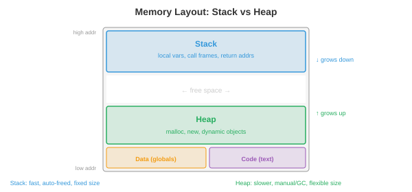

# 编程语言

> **一句话总结**：编程语言是人类意图与机器执行之间的接口，本节梳理范式、类型系统、内存管理、编译流水线、解释与 JIT、关键特性、领域专用语言以及设计取舍。

*编程语言是人类意图与机器执行之间的接口。本节涵盖语言范式、类型系统、内存管理策略、编译流水线、解释与 JIT 编译、关键语言特性、领域专用语言，以及设计取舍。*

- 每一个软件、每一个机器学习 (Machine Learning, ML) 模型、每一个操作系统 (Operating System, OS)，都是用某种编程语言写出来的。可为什么会有几百种语言，各自都有不同的强项？因为语言设计本身就是在做取舍：性能 vs 安全、表达力 vs 简洁、控制力 vs 抽象。搞懂这些取舍，你才知道什么活该用什么工具，也才明白自己在哪些约束里工作。

## 语言范式

- **范式** (paradigm) 是一种编程风格：一组指导你如何组织代码、如何思考问题的原则。

- **命令式** (imperative) 编程把计算描述成一串改变状态的命令。"把 x 设为 5。给 x 加 3。如果 x > 7，就打印出来。" C、Python 和 Java 骨子里都是命令式的。心智模型是一台带内存的机器，你一步一步地修改它。

- **面向对象** (Object-Oriented Programming, OOP) 编程围绕**对象**来组织代码：对象是数据 (属性) 和行为 (方法) 的打包。对象之间通过互相发送消息来协作。核心思想有三条：**封装** (encapsulation，把内部状态藏在公共接口后面)、**继承** (inheritance，从已有类派生新类) 和**多态** (polymorphism，通过共享接口统一处理不同类型)。Java、C++ 和 Python 都支持 OOP。

- **函数式编程** (Functional Programming, FP) 把计算看作数学函数的求值。核心原则：**不可变性** (immutability，数据一旦创建就不再变)、**纯函数** (pure functions，输出只依赖输入，无副作用)、**一等函数** (first-class functions，函数就是值，可以当参数传、当返回值、也可以存变量里)。Haskell 是纯函数式的。Python、JavaScript 和 Scala 都支持函数式风格。

- 纯函数容易推理、容易测试、容易并行 (没有共享的可变状态就没有竞态)。这也是为什么函数式思想在分布式系统和数据流水线里越来越流行。本书通篇用的 JAX 就是函数式的：`jax.grad` 能工作，正是因为 JAX 函数是纯的。

- **逻辑编程** (logic programming) 描述的是*什么*应当为真，而不是*怎么*计算。你陈述事实和规则，运行时自己找解。Prolog 是经典例子：给它"苏格拉底是人"和"人都会死"，引擎就能推出"苏格拉底会死"。逻辑编程用在 AI 知识库和类型检查里。

- 大多数现代语言都是**多范式**的：Python 同时支持命令式、OOP 和函数式；Rust 支持命令式和函数式。范式是工具，不是宗教。

## 类型系统

- **类型** (type) 给值分类，决定哪些操作是合法的。整数 3 和字符串 "3" 是不同类型：整数可以相加，字符串不行 (好吧，字符串可以拼接，但那是另一种操作)。

- **静态类型** (static typing)：类型在**编译期** (compile time) 检查，程序还没跑就查完了。类型错误抓得早。C、Java、Rust 和 Go 都是静态类型的。你要声明类型 (或者让编译器推断)：

```rust
let x: i32 = 5;     // Rust: x 是 32 位整数
let y: f64 = 3.14;  // y 是 64 位浮点数
// let z = x + y;    // 编译错误: 不能把 i32 和 f64 相加
```

- **动态类型** (dynamic typing)：类型在**运行期** (runtime) 检查，操作真正执行时才查。更灵活，但类型错误只有代码跑起来才暴露。Python、JavaScript 和 Ruby 都是动态类型的：

```python
x = 5       # x 是 int (暂时)
x = "hello" # 现在 x 是字符串 —— 不报错
```

- **强类型** (strong typing)：语言不允许隐式的类型转换。Python 是强类型的：`"3" + 5` 会抛 TypeError。**弱类型** (weak typing)：语言默默地帮你转类型。JavaScript 是弱类型的：`"3" + 5` 会得到 `"35"` (数字被强转成字符串)。C 也是弱类型的：你可以把指针强转成整数。

- **类型推断** (type inference) 让编译器在没有显式标注时自己推出类型：

```rust
let x = 5;        // 编译器推断: i32
let y = x + 3.0;  // 编译错误: 类型混用, 即使能推断也不行
```

- **泛型** (generics，参数化多态) 让你写出能对任意类型工作的代码：

```rust
fn largest<T: PartialOrd>(list: &[T]) -> &T {
    let mut max = &list[0];
    for item in &list[1..] {
        if item > max { max = item; }
    }
    max
}
// 对整数、浮点数、字符串都能用 —— 只要类型支持比较
```

- 对 ML 而言：Python 的动态类型让做实验飞快，但也会藏 bug。生产级 ML 系统越来越多地用类型注解 (`def train(model: nn.Module, lr: float) -> float`) 和静态分析工具 (mypy)，把错误在部署前抓出来。PyTorch 和 JAX 用 Python 图的是灵活；TensorRT 和 ONNX Runtime 用 C++ 图的是性能。

## 内存管理

- 任何程序都要分配和释放内存。怎么管这件事，是语言设计里最重要的一个决定。



- **栈** (stack) 存放局部变量和函数调用帧。分配几乎不花时间 (挪一下栈指针就行)，释放也是自动的 (函数返回时把帧弹掉)。栈访问快，因为它一直在缓存里。但栈大小固定 (通常 1-8 MB)，而且只能后进先出 (Last-In-First-Out, LIFO) 分配。

- **堆** (heap) 存放动态分配的数据 (对象、数组、编译期不知道大小的字符串)。堆分配慢 (要找空闲块)，释放要么显式调用，要么自动回收。堆可以一直长到吃满可用内存。

- **手动内存管理** (C、C++)：程序员显式地分配 (`malloc`) 和释放 (`free`) 堆内存。控制力和性能最强，但极容易出错：
    - **释放后使用** (use-after-free)：访问已经释放的内存。会导致崩溃或安全漏洞。
    - **重复释放** (double free)：同一块内存释放两次。破坏分配器内部的数据结构。
    - **内存泄漏** (memory leak)：分配了但从不释放。程序会慢慢吃光可用内存。

- **垃圾回收** (Garbage Collection, GC)：运行时自动检测并回收不再可达的内存。程序员永远不用调 `free`。

    - **追踪式 GC** (Java、Go、Python 的循环回收器)：周期性地从"根" (栈变量、全局变量) 出发遍历所有可达对象，回收不可达的。简单，但会造成 **GC 停顿**：回收器工作时程序停下来。现代回收器 (Go 的并发 GC、Java 的 ZGC) 已经把停顿时间压到亚毫秒级。

    - **引用计数** (reference counting，Python 的主要机制，Swift，Objective-C)：每个对象记录有多少个引用指向它。计数降到 0 就立即释放。没有停顿，但处理不了**循环引用** (A 引用 B，B 引用 A，两者计数都 > 0，但谁都不再可达)。Python 用一个单独的循环检测器来兜底。

- **所有权** (ownership，Rust)：编译器在编译期就强制执行内存安全规则，运行时零开销。

    - 每个值有且仅有一个**所有者** (owner)。所有者出作用域，值就被销毁 (drop，即释放)。
    - 值可以被**借用** (borrow，即引用)，但编译器保证：要么有一个可变引用，要么有任意多个不可变引用，绝不同时存在。
    - 这一套在编译期就杜绝了释放后使用、重复释放、数据竞争和悬垂指针。没有 GC，没有运行时开销。

- **借用检查器** (borrow checker) 是 Rust 的杀手锏，也是它最陡峭的学习曲线。它在没有垃圾回收的前提下保证了内存安全和线程安全，这也是为什么 Rust 越来越多地被用在性能关键系统里 (OS 内核、游戏引擎、以及 Candle、Burn 这类 ML 推理运行时)。

## 编译流水线

- **编译器** (compiler) 在程序运行前把源代码翻译成机器码 (或另一种目标语言)。流水线分几个阶段：


1. **词法分析** (Lexing，又称 tokenisation)：把源文本切成词法记号 (token) 流。`x = 3 + y` 变成 `[IDENT("x"), EQUALS, INT(3), PLUS, IDENT("y")]`。词法分析器会剥掉空白和注释。

2. **语法分析** (Parsing)：从记号流构建**抽象语法树** (Abstract Syntax Tree, AST)。AST 表示程序的层次结构。`3 + y * 2` 被解析成 `Add(3, Mul(y, 2))` (乘法优先级更高)。语法分析器会查语法：括号不配对、少写分号，都在这里被抓出来。

3. **语义分析** (semantic analysis)：查类型、解析变量名、验证函数调用参数是否正确。静态类型检查就发生在这一步。产物是一棵带类型和标注的 AST。

4. **优化** (optimisation)：在不改变行为的前提下让程序跑得更快。常见优化有：
    - **常量折叠** (constant folding)：编译期就把 `3 + 5` 算出来，替换成 `8`。
    - **死代码消除** (dead code elimination)：删掉永远不会执行到的代码。
    - **循环展开** (loop unrolling)：把循环体重复几遍写成顺序代码，减少分支开销。
    - **内联** (inlining)：把函数调用替换成函数体本身，省掉调用开销。

5. **代码生成** (code generation)：把优化后的表示翻译成目标机器码 (x86、ARM) 或某种中间表示。

- **LLVM** 是目前占统治地位的编译器基础设施。它提供一套通用的中间表示 (LLVM 中间表示，LLVM IR)，很多语言都编译到它。LLVM 的优化器在这层 IR 上工作，后端为各种目标生成机器码。Clang (C/C++)、Rust、Swift、Julia 以及许多其他语言都用 LLVM。这意味着 LLVM 优化器一升级，所有这些语言都跟着受益。

## 解释与 JIT 编译

- **解释器** (interpreter) 一行一行 (或一条语句一条语句地) 执行程序，不产生机器码。启动快、开发交互性好，但执行慢 (每一行每次跑都要重新分析)。

- 大多数"解释型"语言实际上会先编译成**字节码** (bytecode)：一种比源码更简单、但又不针对具体机器的中间表示。字节码跑在**虚拟机** (Virtual Machine, VM) 上。

    - **CPython** (标准 Python 实现) 把 Python 源码编译成字节码 (`.pyc` 文件)，由 CPython VM 执行。VM 一条一条地解释字节码。这就是为什么 Python 跑计算密集型代码大约比 C 慢 100 倍。

    - **JVM** (Java 虚拟机)：Java 编译成 JVM 字节码 (`.class` 文件)。JVM 起初解释执行字节码，然后把频繁执行的路径 ("热点"，hot spots) 用 **JIT 编译**成原生机器码。这就是为什么 Java 启动比 C 慢 (解释开销)，但长时间运行的程序能接近 C 的速度 (JIT 优化过的热点)。

- **即时** (Just-In-Time, JIT) 编译在程序运行时把代码编译成机器码，能利用只有运行时才拿得到的信息。JIT 可以基于实际运行数据来优化：如果某个函数总是被整数参数调用，JIT 就生成专门处理整数的机器码，跳过类型检查。

- **PyPy** 是 Python 的另一种实现，带 JIT 编译器。靠把热循环 JIT 编译成机器码，它跑大多数 Python 代码比 CPython 快 5-10 倍。但它跟 C 扩展模块 (NumPy、PyTorch) 兼容性有限，所以在 ML 领域用得不多。

- 从解释到编译是一条光谱，不是非黑即白：
    - 纯解释：Bash shell 脚本。
    - 字节码解释：CPython。
    - 字节码 + JIT：JVM、.NET CLR、LuaJIT、PyPy。
    - 提前 (Ahead-Of-Time, AOT) 编译：C、C++、Rust、Go。
    - AOT + 运行时代码生成：JAX 的 `jax.jit` 在第一次调用时把 Python 函数编译成优化后的 XLA 代码，然后缓存起来。

## 关键语言特性

- **闭包** (closure)：一个函数捕获了它所在作用域里的变量。这个函数把它被定义时的环境"封闭"了起来：

```python
def make_adder(n):
    def add(x):
        return x + n  # n 从外层作用域被捕获
    return add

add5 = make_adder(5)
print(add5(3))  # 8
```

- 闭包是回调、装饰器、偏函数应用背后的机制。它是函数式编程的基石。

- **模式匹配** (pattern matching)：一种强大的控制流机制，它按数据形状解构并分支：

```rust
match value {
    Some(x) if x > 0 => println!("Positive: {}", x),
    Some(0)           => println!("Zero"),
    Some(x)           => println!("Negative: {}", x),
    None              => println!("Nothing"),
}
```

- 模式匹配比 if-else 链表达力强得多：它检查的是数据结构 (是 Some 还是 None？里面的值符不符合某个条件？)，不只是相等。Python 在 3.10 引入了结构化模式匹配 (`match`/`case`)。

- **代数数据类型** (Algebraic Data Types, ADT)：一种类型可以是若干变体之一，每个变体带不同数据。`Result` 类型要么是 `Ok(value)`，要么是 `Err(error)`。`Tree` 类型要么是 `Leaf(value)`，要么是 `Node(left, right)`。ADT 配上模式匹配，可以对所有情况做穷尽处理，直接消灭一整类 bug (空指针异常、未处理的错误码)。

- **Trait 与接口** (traits and interfaces)：定义某个类型必须实现的一组方法，但不指定怎么实现。这就实现了多态：一个接受"任何实现了 Display trait 的类型"的函数，对整数、字符串和自定义类型都能用。Rust 用 trait，Java 用 interface，Go 用隐式接口，Python 用鸭子类型 ("走起来像鸭子……")。

## 领域专用语言

- **领域专用语言** (Domain-Specific Language, DSL) 是为某个特定问题域设计的语言，牺牲通用性来换取在该域内的表达力。

- **SQL**：关系数据库的语言。`SELECT name FROM users WHERE age > 30` 比等价的命令式循环可读得多，也更容易被优化。数据库引擎会自动优化查询执行计划，挑连接策略、选索引。

- **正则表达式** (regular expressions)：一门用于文本模式匹配的迷你语言。`\d{3}-\d{4}` 可以匹配 "555-1234" 这种电话号码。正则引擎会把模式编译成有限自动机，好高效匹配。

- **着色器语言** (shader languages，GLSL、HLSL、Metal Shading Language)：跑在 GPU 核上的程序，用来算像素颜色、顶点位置或通用计算。着色器是大规模并行的：每次调用独立处理一个像素或一个元素。这跟 CUDA 用来跑 ML 计算的执行模型是同一套。

- 在 ML 里，PyTorch 和 JAX 这样的框架本质上是嵌入在 Python 里的张量计算 DSL。它们提供领域专用的抽象 (张量、自动微分、设备放置)，同时借用 Python 的生态。

## 语言设计取舍

- 没有哪门语言样样都最好。设计就是选择做哪些取舍：

- **性能 vs 安全**：C 给你原始速度和硬件控制，但也放任你搞坏内存。Rust 给你差不多的速度，外加编译期的内存安全。Java 用 GC 换来内存安全，代价是垃圾回收开销。Python 给你最强的安全性和表达力，代价是执行速度慢 100 倍。

- **表达力 vs 简洁**：Haskell 的类型系统能表达极其精确的约束，但学习曲线陡。Go 特意省掉了泛型 (直到最近才加)、继承和异常，为的是简洁。Python "做一件事应该只有一种明显做法"的哲学，让语言保持可学。

- **控制力 vs 抽象**：C/C++ 让你控制内存布局、缓存行为和硬件交互。Python 把这些全藏起来。对 ML 训练来说 (GPU 计算才是大头)，Python 的开销可以忽略。对 ML 推理来说 (每一微秒都要抠)，C++ 或 Rust 就可能不可少。

- **编译速度 vs 运行速度**：Go 几秒就编完 (类型系统简单，优化也少)。Rust 要编几分钟 (类型系统复杂，优化激进)。这是开发迭代速度和部署性能之间的取舍。

- ML 生态正好反映了这些取舍：Python 用来做实验和训练 (表达力胜)，C++/CUDA 用来写核函数和推理 (性能胜)，Rust 用来做基础设施和安全关键系统 (安全胜)。

## 编程任务 (使用 CoLab 或 notebook)

1. 探索闭包和高阶函数。实现一个简单的函数工厂，验证闭包会捕获它所在的环境。
```python
def make_multiplier(factor):
    """返回一个把输入乘以 factor 的函数。"""
    def multiply(x):
        return x * factor
    return multiply

double = make_multiplier(2)
triple = make_multiplier(3)

print(f"double(5) = {double(5)}")  # 10
print(f"triple(5) = {triple(5)}")  # 15

# 闭包按引用捕获, 不是按值
def make_counter():
    count = [0]  # 用可变容器来允许修改
    def increment():
        count[0] += 1
        return count[0]
    return increment

counter = make_counter()
print(f"counter() = {counter()}")  # 1
print(f"counter() = {counter()}")  # 2
print(f"counter() = {counter()}")  # 3
```

2. 对比动态类型和静态类型的行为。看看 Python 的动态类型如何提供灵活性，又如何藏匿 bug。
```python
def add(a, b):
    return a + b

# 对不同类型都能工作 —— 灵活!
print(add(3, 5))           # 8 (int + int)
print(add("hello ", "world"))  # "hello world" (str + str)
print(add([1, 2], [3, 4]))    # [1, 2, 3, 4] (list + list)

# 但类型错误只有运行时才暴露:
try:
    print(add("hello", 5))  # TypeError! str + int
except TypeError as e:
    print(f"Runtime error: {e}")
    print("静态类型检查器在运行前就能抓到这个错")
```

3. 对一个计算密集型任务，测一下解释型 Python 和编译/JIT 方案之间的性能差距。
```python
import time
import jax
import jax.numpy as jnp

n = 1_000_000

# 纯 Python 循环 (解释执行)
start = time.time()
total = 0.0
for i in range(n):
    total += i * i
python_time = time.time() - start

# JAX (通过 XLA 编译)
@jax.jit
def sum_squares_jax(n):
    return jnp.sum(jnp.arange(n, dtype=jnp.float32) ** 2)

_ = sum_squares_jax(10)  # 预热 JIT
start = time.time()
result = sum_squares_jax(n)
jax_time = time.time() - start

print(f"Python loop: {python_time:.4f}s")
print(f"JAX (JIT):   {jax_time:.6f}s")
print(f"Speedup:     {python_time / jax_time:.0f}x")
```

---

## 📌 本节要点

- **语言范式**：命令式、OOP、函数式、逻辑式各有侧重，现代语言多为多范式。
- **类型系统**：静态 vs 动态、强 vs 弱是正交的两条轴，泛型让代码复用不牺牲类型安全。
- **栈与堆**：栈快但受限于 LIFO，堆灵活但分配释放开销大。
- **内存管理**：手动 (C/C++)、GC (Java/Go/Python) 与所有权 (Rust) 是三种主流路线。
- **借用检查器**: Rust 用编译期规则消灭内存与线程安全 bug，运行时零开销。
- **编译流水线**：词法 → 语法 → 语义 → 优化 → 代码生成，LLVM 是通用底座。
- **解释与 JIT**：从纯解释到 AOT 是一条光谱，JIT 靠运行时信息做特化优化。
- **闭包与模式匹配**：前者是函数式基石，后者配 ADT 可穷尽处理所有分支。
- **DSL**: SQL、正则、着色器、PyTorch/JAX 都是牺牲通用性换表达力的例子。
- **设计取舍**：性能/安全/表达力/编译速度之间不存在免费午餐，ML 生态按需混搭 Python、C++/CUDA、Rust。