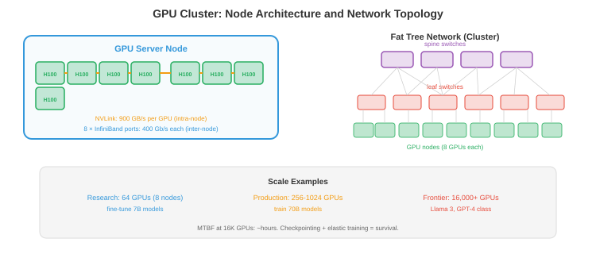

# 大规模基础设施

> **一句话总结**：从单机走向千卡集群，一套完整的大规模基础设施要解决可扩展性、分布式一致性、微服务拆分、数据管道、GPU 训练集群、数据库分片、向量检索、可观测性与 CI/CD 这一整套工程难题。

*要让系统服务上百万用户，靠一台服务器是不够的。本节讲可扩展性模式、分布式系统基础、微服务、数据管道、数据库扩展、搜索与向量系统、可观测性、可靠性工程以及 CI/CD*

- 一个每秒处理 1 次请求的模型，在笔记本上就能跑。可一旦你要以 99.9% 的可用性顶住每秒 10 万次请求，就得上分布式系统、自动故障切换和精心设计的数据管道。本节讲的就是从"跑得起来"到"扛得住"之间的那些模式。

## 可扩展性

- **垂直扩展 (vertical scaling, scale up)**：换台更大的机器。更多 CPU、更多内存、更强 GPU。简单粗暴，但有硬上限 (市面上最大的机器就那么大)，而且单点故障。

- **水平扩展 (horizontal scaling, scale out)**：加更多机器。每台机器分担一部分流量。没有单机上限，但需要：负载均衡 (见 01 节)、数据分区、以及处理分布式状态。

- **无状态服务 (stateless services)** 天生就适合水平扩展。在负载均衡器后面多加几个实例就行。一个启动时加载权重、然后独立处理请求的模型推理服务器就是无状态的 —— 任意实例都能处理任意请求。

- **有状态服务 (stateful services)** (数据库、KV 缓存、特征仓库) 扩展起来更难。状态必须在机器间分区 (分片，见 01 节)，还要复制以保证容错。

- **可扩展性公式**：对于一个有 $n$ 台服务器的系统:
    - **理想情况**：吞吐随机器线性扩展 ($n$ 台服务器 → $n\times$ 吞吐)。
    - **实际情况**：协调、负载均衡和数据传输带来的开销，让吞吐是次线性扩展的。阿姆达尔定律 (Amdahl's law，见第 13 章) 在此适用：串行部分 (共享状态、协调) 限制了加速比。

## 分布式系统

- **分布式系统 (distributed system)** 就是一群机器协同提供某项服务。核心挑战有:

- **网络分区 (network partitions)**：机器之间不总能通信。网线被拔、交换机故障、数据中心断电。系统必须处理**部分**失败。

- **时钟偏差 (clock skew)**：不同机器的时钟不一样。"事件 A 在机器 1 上 10:00:01 发生"和"事件 B 在机器 2 上 10:00:01 发生"不代表它们同时发生。**逻辑时钟 (logical clocks)** (Lamport 时间戳、向量时钟) 不依赖物理时钟就能给事件排序。

- **共识 (consensus)**：多台机器怎么就一个值达成一致 (比如谁是 leader)? **Raft** 是标准共识算法。集群中的节点选出一个 leader，由 leader 处理所有写操作。如果 leader 挂了，其他节点再选一个新的。运作需要多数派 (5 个节点里 3 个)，所以能容忍 $\lfloor(n-1)/2\rfloor$ 次失败。

- **PACELC 定理 (PACELC theorem)**: CAP 定理的现代扩展，由 Daniel Abadi 于 2010-2012 年提出 (据 Abadi, "Consistency Tradeoffs in Modern Distributed Database System Design", IEEE Computer 2012)。CAP 只讲了分区发生时的取舍，但**大多数时间系统是没有分区的**，那时候的取舍是什么？PACELC 补上了这块:
    - **P (Partition) 时**：在**可用性 (Availability, A)** 和**一致性 (Consistency, C)** 之间选 —— 这是原 CAP。
    - **E (Else，无分区时)**：在**延迟 (Latency, L)** 和**一致性 (Consistency, C)** 之间选 —— 强一致要跨节点同步写，延迟必然升高；弱一致 (最终一致) 可以本地写完立即返回，延迟低。
    - **例子分类**: DynamoDB、Cassandra 是 **PA/EL** (分区选 A，平时选 L); Spanner、HBase 是 **PC/EC** (两种情况都选 C); MongoDB (默认) 是 **PA/EC**。ML 场景里，特征仓库的实时读通常选 PA/EL (推理延迟敏感，弱一致可接受)，而模型注册中心和权限系统选 PC/EC (需要强一致)。

- **Spanner + TrueTime 案例 (Spanner, Google 2012)**：谷歌的全球分布式数据库 Spanner 展示了如何用**物理时间同步**跳出 CAP/PACELC 的常规权衡 (据 Corbett et al., "Spanner: Google's Globally-Distributed Database", OSDI 2012)。核心创新是 **TrueTime API**:
    - **硬件基础**：每个数据中心部署一批 **GPS 接收器**和**原子钟 (atomic clocks)**，时间服务通过 Marzullo 算法交叉校验，对外暴露带**不确定区间**的时间戳 `TT.now() = [earliest, latest]`，保证真实时间落在区间内。典型的不确定度 $\epsilon$ 约 1-7ms (据 2012 论文)。
    - **Commit-wait 协议**：事务提交时，分配时间戳 $s = \text{TT.now().latest}$，然后**主动等待** $\epsilon$ 毫秒后才对外返回，确保 $s$ 一定小于任何未来事务的时间戳。这样就实现了**外部一致性 (external consistency)** —— 事务的可见顺序和真实时间顺序完全一致，全球任何客户端观察到的都是相同的顺序。
    - **代价**：每次提交至少多 $\epsilon$ 的延迟 (读 latency 不受影响，因为读可以用 snapshot)。
    - **意义**: Spanner 证明了给你**足够精确的时钟**，就能同时拿到强一致、高可用和地理分布 —— 这也是 Google 内部广告系统、Cloud Spanner、以及 F1 数据库的基础。业界后续的模仿者 CockroachDB、YugabyteDB 用软件时钟 (HLC, Hybrid Logical Clock) 逼近类似语义，但精度不如硬件方案。

- **分布式锁 (distributed locks)**：保证只有一台机器执行某个关键操作。**Redlock** (基于 Redis) 在多个 Redis 实例上申请锁，只要多数实例都授予了锁就算获取成功 —— **但 Redlock 算法本身存在争议**: Martin Kleppmann 在其 2016 年的分析 "How to do distributed locking" (据 Kleppmann 2016) 中指出 Redlock 依赖于时钟准确性假设，在 GC 停顿、时钟漂移或网络延迟下无法保证互斥安全，不适合作为强正确性保证 (correctness) 场景下的锁。生产实践中推荐使用基于共识协议的方案：**etcd** 或 **Consul** (据 etcd/Consul 官方文档)，并配合 **fencing token** (单调递增序号) 机制 —— 存储层校验 token，拒绝过期持有者的写入 —— 从根本上防止双写。用途包括：防止重复的模型部署、确保只有一个训练任务往 checkpoint 写数据。

## 微服务


- **微服务 (microservices)** 把系统拆成一堆小的、可独立部署的服务。每个服务负责一个领域:

```
┌─────────────┐  ┌──────────────┐  ┌─────────────┐
│ API Gateway │→ │ Feature Svc  │→ │ Feature DB  │
└─────────────┘  └──────────────┘  └─────────────┘
       │
       ├────────→ ┌──────────────┐  ┌─────────────┐
       │          │ Model Svc    │→ │ Model Store │
       │          └──────────────┘  └─────────────┘
       │
       └────────→ ┌──────────────┐  ┌─────────────┐
                  │ Logging Svc  │→ │ Log Store   │
                  └──────────────┘  └─────────────┘
```

- **好处**：独立部署 (更新模型服务不用碰特征服务)、独立扩展 (模型服务器按请求量扩，特征服务器按特征仓库读取率扩)、技术自由 (模型服务用 Python，特征服务用 Go)。

- **代价**：网络开销 (每次服务调用都是一次网络往返)、复杂度 (调试要跨多个服务)、数据一致性 (没有跨服务事务)。

- **服务发现 (service discovery)**: API 网关怎么找到模型服务？几种做法：基于 DNS (每个服务注册一个 DNS 名)、K8s 服务 (内建)、或者用服务注册中心 (Consul、Eureka)。

- **Saga 模式**：对于跨多个服务的操作 (创建用户 + 分配资源 + 发送欢迎邮件)，用 saga：一串本地事务，任一步失败就执行对应的补偿动作。

## 数据管道

- ML 系统吞的数据量惊人。**数据管道 (data pipelines)** 负责搬运、变换和供给这些数据:

### 批处理

- 按固定周期 (每小时、每天) 处理大批量数据。

- **MapReduce**：最早的批处理范式。Map (对每条记录独立变换) → Shuffle (按 key 分组) → Reduce (每组做聚合)。概念简单，但写起来啰嗦。

- **Apache Spark**：现代的批处理引擎。内存计算 (对迭代算法比 MapReduce 快 100 倍)。支持 SQL、DataFrame 和 ML 管道。大规模特征工程的事实标准。

- **例子**：为推荐系统算用户特征。输入：过去 30 天里 10 亿条用户行为事件。输出：1 亿个用户特征向量。作为 Spark 任务每天跑一次，结果写入特征仓库。

### 流处理

- 数据一到就实时处理 (亚秒级延迟)。

- **Apache Flink**：流处理领域的领头羊。exactly-once 处理、事件时间处理 (按事件发生时间而非到达时间处理)、窗口操作 (滚动窗口、滑动窗口、会话窗口)。

- **Kafka Streams**：内嵌在 Kafka 里的轻量级流处理。适合简单的变换 (过滤、聚合)，不用单独部署集群。

- **例子**：实时反欺诈。每笔信用卡交易是一个 Kafka 事件。Flink 任务算滚动统计量 (交易频率、地理位置变化)，在 100ms 内标出异常。

### Lambda 架构

- 把批处理和流处理组合起来。**批处理层**给出准确、完整的结果 (但有延迟), **速度层**给出近似的实时结果，**服务层**把两者合并。

- 实践中很多团队现在用 **Kappa 架构**：只用流处理，把流当作唯一真相来源。因为流是可重放的 (Kafka 保留了事件)，通过重放流就能模拟批处理。

## ML 训练基础设施

- 训练一个前沿模型 (1000 亿参数以上) 是个大规模的基础设施问题：上千张 GPU 跑几个月，耗电以兆瓦计，产生几个 PB 的数据，花掉几千万美元。基础设施决定了训练是成是败。

### GPU 集群

- 训练集群就是一堆 GPU 服务器，用高速网络连起来。关键部件:



- **GPU 服务器 (节点，nodes)**：每台服务器有 4-8 张 GPU。典型配置：8 × H100 GPU、2 × AMD EPYC CPU、2 TB 内存、30 TB NVMe SSD。节点内部的 GPU 通过 **NVLink** 互联 (H100 上每张 GPU 900 GB/s)，比 PCIe 快 30 倍。

- **集群规模**：小的训练集群有 64-256 张 GPU (8-32 个节点)。前沿模型的训练集群有 4,000-32,000 张 GPU (500-4000 个节点)。Meta 的 Llama 3 用了 16,384 张 H100。谷歌在 8,000+ 芯片的 TPU pod 上训练。

- **粗略估算**：训练一个 700 亿参数模型大约要 200 万美元的算力。训练一个 4000 亿以上参数的前沿模型要 5000-10000 万美元。集群硬件本身在 H100 价位下要 5 亿-10 亿美元 (每张 GPU 30K 美元 × 16,000 张 = 4.8 亿美元)。

### 网络拓扑

- GPU 节点之间的网络是最关键的基础设施部件。如果 GPU 没法足够快地交换梯度，它们就得干等着通信完成。

- **InfiniBand** 是 GPU 集群网络的标准。NVIDIA 的 **Quantum-2 InfiniBand** 每端口提供 400 Gb/s。每个节点通常有 8 个 InfiniBand 端口 (每张 GPU 一个)，每节点总二分带宽 400 GB/s。

- **远程直接内存访问 (Remote Direct Memory Access, RDMA)**: InfiniBand 支持 RDMA，让不同节点上的 GPU 内存能直接互传数据，不用经过 CPU。延迟从约 100μs (TCP) 降到约 1μs，对高效梯度 all-reduce (见第 6 章) 至关重要。

- **NCCL AllReduce 算法 (NVIDIA Collective Communications Library)**：多 GPU 梯度聚合的核心是 **AllReduce** —— 所有 GPU 各有一份梯度，最终每张 GPU 都要拿到所有梯度的总和 (求和、平均等)。NCCL 提供了两种主要算法 (据 NCCL 官方文档，NVIDIA 2024):

    - **Ring 算法 (ring-based)**: GPU 排成一个逻辑环。分两步：**ReduceScatter** (每个 GPU 轮流转发并累加一块数据，各 GPU 最终拿到某一块的完整累加值) → **AllGather** (每个 GPU 把自己的累加块沿环发给所有其他 GPU)。总数据传输量：每 GPU 发送和接收各 $2(N-1)/N \times \text{size}$。**带宽最优 (bandwidth-optimal)**：数据量接近 $2 \times \text{size}$，和 GPU 数量 $N$ 基本无关。
        - 适合大消息 (>512 KB)：带宽利用率高，但延迟随 $N$ 线性增长 (每步串行)。

    - **Tree 算法 (tree-based)**：用二叉树 (binary tree) 做 Reduce (从叶子到根逐层加和) → Broadcast (从根到叶子逐层分发)。总数据传输量：每 GPU 约 $2 \times \text{size}$。**延迟最优 (latency-optimal)**：通信步数 $O(\log N)$，比 Ring 的 $O(N)$ 少得多。
        - 适合小消息 (<512 KB)：延迟低，但根节点附近带宽压力大 (热路径)。

    - **NCCL 默认策略**：用 **Ring 做 AllReduce** (大消息)。对小消息用 **双二叉树 (double binary tree, NCCL 2.4+)** —— 两棵互补的二叉树分担负载，消除单根节点的带宽瓶颈。NCCL 在运行时根据消息大小自动选择。

    - **实际配置**：节点内 8 GPU (NVLink) → NCCL 用 ring 或 tree，超低延迟。跨节点 → NCCL 走 InfiniBand/RoCE RDMA，用 ring (大梯度)，并与计算重叠：每张 GPU 算完一层梯度就开始 AllReduce，不等整层算完 (gradient bucketing)。

- **网络拓扑很重要**: **胖树 (fat tree, Clos 网络)** 提供全二分带宽 (任意 GPU 之间都能全速通信)。更便宜的拓扑 (**rail-optimised**、**3D torus**) 带宽小些但便宜。拓扑得配上并行策略:
    - **数据并行 (data parallelism)**：所有 GPU 之间做 all-reduce → 需要高二分带宽 (胖树)。
    - **张量并行 (tensor parallelism)**：通信集中在节点内部 → NVLink 就够了 (不走网络)。
    - **流水线并行 (pipeline parallelism)**：通信只发生在相邻流水线阶段之间 → 只需特定节点对之间有带宽 (rail-optimised 也够用)。

- **以太网替代方案**: **RoCE v2** (基于融合以太网的 RDMA, RDMA over Converged Ethernet) 在标准以太网上跑 RDMA。比 InfiniBand 便宜，但延迟更高、更容易拥塞。谷歌的部分 TPU pod 网络就用 RoCE。超以太网联盟 (Ultra Ethernet Consortium) 在为 AI 负载开发无损以太网。

### 训练用存储

- 训练需要三层存储:

    - **数据集存储**：训练语料 (1-100 TB 的文本，或 PB 级的多模态数据)。放在分布式文件系统或对象存储里。必须支持高吞吐的顺序读 (数据加载器一次读一大批)。**Lustre** 和 **GPFS** 是常见的高性能计算 (High Performance Computing, HPC) 文件系统；云上的替代包括 **FSx for Lustre** (AWS) 和 **Filestore** (GCP)。

    - **Checkpoint 存储**：定期保存的训练状态 (模型权重 + 优化器状态 + 调度器状态)。以 Adam 优化器混合精度训练一个 700 亿参数模型为例：每个 checkpoint 约 980 GB (BF16 权重 140 GB + FP32 主权重 280 GB + FP32 动量和方差各 280 GB，合计 70B × 14 字节，据 DeepSpeed ZeRO 文档 2024)。三个月的训练每小时存一次 = 约 2000 个 checkpoint = 约 2 PB。实践中只留最近 N 个，老的删掉。存 checkpoint 得足够快，不能明显拖慢训练。

    - **日志和指标**：实验追踪数据 (损失曲线、学习率调度、梯度范数)。数据量不大，但要实时写。W&B、MLflow、TensorBoard 都能干这活。

- **存储瓶颈**：一个 16,000 GPU 的集群装载训练批数据时，需要持续读 ~100 GB/s。如果文件系统撑不住这个吞吐，GPU 就要闲等数据。数据管道优化 (预取、缓存、格式优化，用 WebDataset 或 Mosaic Streaming) 非常关键。

### 任务调度

- 一个 GPU 集群要服务多个团队和项目。**任务调度器 (job scheduler)** 负责给训练任务分配 GPU:

- **SLURM**: HPC 领域的标准任务调度器。用户提交任务时指定 GPU 数、内存和时间上限。SLURM 分配资源、管理队列。支持基于优先级的调度、抢占、以及团队间的公平配额。

- **Kubernetes 加 GPU 调度** (见第 18 章 02 节)：云原生方案。K8s 的 GPU 设备插件把 GPU 暴露成可调度资源。**Volcano** 和 **Run:ai** 添加了 ML 专属的调度特性：gang 调度 (一次性把某任务需要的所有 GPU 都分配好，不是一张一张给)、优先级队列、GPU 时间共享。

- **调度里的难题**:
    - **碎片化 (fragmentation)**：一个 1000 张 GPU 的集群可能有 200 张空闲，但分散在 50 个节点上 (每节点 4 张空闲)。一个需要 128 张连续 GPU 的任务就是跑不了，哪怕总量够。**碎片整理** (迁移任务合并空闲 GPU) 或**拓扑感知调度** (分配连接良好的 GPU) 能解决这问题。
    - **优先级和抢占**：紧急实验应能抢占低优先级任务。但抢占一个已经跑了两天的训练任务，就浪费了那些算力。调度器得在优先级和效率之间平衡。
    - **公平配额**：各团队按时间应拿到分配份额的算力，即使某团队一次提交了远超自己份额的任务。

### 容错

- 上千张 GPU 一跑好几个月，硬件故障不是意外，是家常便饭。16,000 张 GPU 集群的平均故障间隔时间要按小时算，不是按月算。

- **常见故障**: GPU 内存错误 (ECC 可纠错和不可纠错)、NVLink 故障 (节点内 GPU 通信断)、InfiniBand 链路故障 (节点间通信断)、节点崩溃 (内核 panic、电源故障)、存储故障 (硬盘或控制器坏)。

- **Checkpoint** 是主要防线。每隔 N 步保存完整训练状态 (模型、优化器、数据加载器位置)。出故障时：定位故障节点、替换或移除、从最近的 checkpoint 重新开始训练。故障的代价就是最后一次 checkpoint 到故障之间的算力。

- **Checkpoint 频率的权衡**：频繁存 checkpoint (每 10 分钟一次) 在故障时浪费得少，但拖慢训练 (存 980 GB 要时间)。稀疏存 checkpoint (每 2 小时一次) 训练快，但故障时可能浪费 2 小时算力。多数团队 20-60 分钟存一次。

- **弹性训练 (elastic training)**：现代框架 (PyTorch Elastic、DeepSpeed) 支持在不重启的情况下缩放训练规模。500 个节点里坏了 2 个，训练用 498 个节点继续。坏的节点被替换后重新上线时，训练自动把它们收编回来。

- **健康监控 (health monitoring)**：持续监控所有 GPU (温度、内存错误、算力吞吐)、网络链路 (丢包、延迟) 和存储 (吞吐、错误率)。异常时自动告警。有些集群会定期跑 GPU 健康检查 (一段短的计算测试)，在硬件真正故障前提前发现劣化。

- **规模化视角**：训练 Meta 的 Llama 3 (16,384 张 H100, 54 天) 经历了约 466 次任务中断。有效训练时间只占钟表时间的 90% —— 10% 花在了故障和恢复上。能把这个数字做到 90% (而不是 50% 或 70%) 的基础设施能力，就是能训前沿模型的组织和训不了的分界线。

### 成本和效率

- 训练基础设施的成本主要在 GPU 时长:

| 组成 | 占总成本比例 |
|-----------|----------------|
| GPU 算力 | 70-80% |
| 网络 (InfiniBand) | 10-15% |
| 存储 | 5-10% |
| 冷却与电力 | 5-10% |

- **GPU 利用率** (模型 FLOPs 利用率，Model FLOPs Utilisation, MFU) 衡量的是 GPU 理论峰值算力中真正用于有效计算的比例。H100 的峰值是 989 TFLOPS (FP8)。做到 40-50% MFU 算不错，50-60% 算优秀。差距来自：通信开销 (all-reduce、流水线气泡)、内存带宽限制，以及 checkpoint 和数据加载时的空闲。

- **提升 MFU**：让计算和通信重叠 (见第 6 章)、用高效注意力 (Flash Attention，见第 16 章)、优化数据加载 (别让 GPU 饿着)、降低 checkpoint 开销 (异步 checkpoint、先存到快速 NVMe 再后台复制到持久存储)。

- **自建还是买云**：小规模 (<256 张 GPU)，云更便宜 (无前期投入，按小时付费)。大规模 (>1000 张 GPU，持续使用 6 个月以上)，自己拥有硬件更便宜 (3 年内的总拥有成本 (TCO) 大约低 2-3 倍)。多数 AI 公司混着用：自建集群跑持续训练，云上应对突发算力和实验需求。

## 数据库扩展

- **读副本 (read replicas)**：把读查询路由到主数据库的副本上。主库处理写，副本处理读。因为大多数负载是读密集的 (95% 以上是读)，这能让读吞吐随副本数量线性扩展。

- **分区 (partitioning，也叫分片 sharding，见 01 节)**：把数据切到多个数据库上。每个分区独立，支持并行读写。难点在跨分区查询 (从不同分片 join 数据)。

- **连接池 (connection pooling)**：数据库的连接数是有限的。连接池 (PostgreSQL 用 PgBouncer) 在多个请求之间复用连接，避免几百个服务实例一起连时把连接耗光。

## 搜索和向量系统

### 文本搜索

- **倒排索引 (inverted index)**：文本搜索的基石。为每个词存一个包含该词的文档列表。查询时对每个查询词的列表求交。**Elasticsearch** 是行业标准：分布式、实时、支持全文搜索、聚合和地理空间查询。

- **BM25**：标准的文本检索评分函数。用词频、逆文档频率和文档长度归一化给文档打分。简单但有效 —— 在关键词密集的查询上仍能和神经方法一较高下。

### 向量搜索

- **向量数据库 (vector databases)** 存储嵌入 (高维向量)，支持快速的**近似最近邻 (Approximate Nearest Neighbour, ANN)** 搜索。给一个查询嵌入，找出 $k$ 个最相似的已存嵌入。

- **FAISS** (Facebook AI Similarity Search)：一个做 ANN 搜索的库 (不是数据库)。支持多种索引类型:
    - **Flat**：精确搜索，$O(n)$。用于小数据集或作为 ground truth。
    - **IVF (Inverted File)**：把向量分成若干簇，只在最近的几簇里搜。每次查询 $O(n/k)$。
    - **HNSW (Hierarchical Navigable Small World)**：基于图。构建一个分层图，从粗到细导航。极快极准，多数应用的默认选择。
    - **乘积量化 (Product Quantisation, PQ)**：把向量压缩成紧凑编码，省内存。用精度换内存。

- **托管的向量数据库**: Pinecone、Weaviate、Milvus、Qdrant。它们负责 FAISS 不做的那些事：扩展、复制、实时更新。

- **用于 RAG (检索增强生成，Retrieval-Augmented Generation)**：用户查询 → 用文本编码器嵌入 → 在向量数据库里搜相关文档 → 把检索到的文档拼到 LLM 的 prompt 前面。检索质量直接决定 LLM 回答的质量。

## 可观测性

- **可观测性 (observability)** 是指从系统对外输出中理解系统内部发生什么的能力。三大支柱:

### 日志

- **结构化日志 (structured logs)** (JSON) 能被搜索和解析。非结构化日志 ("ERROR: something failed") 不行。永远要记录：时间戳、服务名、请求 ID (用于跨服务追踪)、严重级别、以及相关上下文。

- **ELK 栈** (Elasticsearch、Logstash、Kibana)：标准的日志管道。Logstash 收集和转换日志，Elasticsearch 建索引，Kibana 做可视化和搜索。

### 指标

- **指标 (metrics)** 是随时间变化的数值测量：请求速率、错误率、延迟分位数、GPU 利用率、队列深度。**Prometheus** 从各服务拉取指标；**Grafana** 在仪表盘里可视化并支持告警。

- **服务的 RED 方法**: **R**ate (速率，请求/秒)、**E**rrors (错误率)、**D**uration (延迟)。每个服务都监控这三个。

- **资源的 USE 方法**: **U**tilisation (利用率，使用比例)、**S**aturation (饱和度，队列深度)、**E**rrors (错误)。每种资源 (CPU、GPU、内存、磁盘、网络) 都监控这三个。

### 追踪

- **分布式追踪 (distributed tracing)** 跟着一次请求跨多个服务走完全程。用户请求打到 API 网关 → 特征服务 → 模型服务 → 后处理。一个 **trace** 记录每一跳的时序，让你看到延迟花在了哪。

- **OpenTelemetry**: trace、指标和日志的开源标准。代码里一次埋点，就能导出到任何后端 (Jaeger、Zipkin、Datadog)。

## 可靠性

- **SLO** (服务等级目标，Service Level Objective)：目标可靠性。"99.9% 的请求在 200ms 内完成"。这给了你一个具体的错误预算：0.1% 的请求 (约每月 43 分钟) 可以慢或失败。

- **SLI** (服务等级指标，Service Level Indicator)：度量本身。"过去 5 分钟的 P99 延迟"。

- **SLA** (服务等级协议，Service Level Agreement)：有法律效力的合同承诺。"如果可用性掉到 99.95% 以下，客户可以获得抵扣"。

- **错误预算 (error budgets)**：你的 SLO 是 99.9%，目前做到了 99.99%，就有预算去做有风险的改动 (上新模型、迁移数据库)。如果你在 99.85%，就冻结所有改动，专心搞可靠性。错误预算把可靠性从抽象目标变成可量化的资源。

- **混沌工程 (chaos engineering)**：故意注入故障 (杀掉一台服务器、加网络延迟、损坏数据)，测试系统能不能正确处理。Netflix 的 Chaos Monkey 随机干掉生产实例。系统扛住了就是有韧性；扛不住，那就在用户之前发现了 bug。

## CI/CD

- **持续集成 (Continuous Integration, CI)**：自动构建并测试每一次代码改动。每次 push 触发：lint、类型检查、单元测试、集成测试。任何一项失败，改动被拒。这能在 bug 上生产前就把它抓住。

- **持续部署 (Continuous Deployment, CD)**：自动部署通过 CI 的改动。几种部署策略:

    - **蓝绿部署 (Blue-green)**：跑两套一样的环境 (蓝 = 当前，绿 = 新版)。瞬间把流量从蓝切到绿。绿的挂了，立刻切回蓝 (瞬间回滚)。

    - **金丝雀部署 (Canary)**：把小比例流量 (1-5%) 路到新版本，监控错误。指标看着不错就逐步加大流量。这样限制了坏部署的爆炸半径。

    - **特性开关 (Feature flags)**：新代码部署上去，但藏在开关后面。先给一小部分用户开 (内部测试，再 beta 用户，最后全量)。这把**部署** (代码上线) 和**发布** (用户看到功能) 解耦。

- 对 ML 来说：CI/CD 还要加上模型专属步骤。一次模型改动触发：单元测试 (形状测试、梯度检查)、在留出集上的评估 (准确率不能倒退)、影子部署 (新旧模型并跑对比输出)、以及渐进式放量 (canary 从 1% 到 100%)。

---

## 📌 本节要点

- **可扩展性**：无状态服务水平扩展最容易，有状态服务需要分片加复制；Amdahl 定律限制了实际加速比。
- **分布式系统三大挑战**：网络分区、时钟偏差、共识；Raft + 逻辑时钟 + 分布式锁是常用工具箱。
- **微服务**：换来独立部署和扩展，代价是网络开销、复杂度和数据一致性；Saga 处理跨服务事务。
- **数据管道**：批处理 (Spark) 做离线特征，流处理 (Flink) 做实时决策；Kappa 架构以流为唯一真相来源。
- **GPU 训练集群**: NVLink 节点内互联 + InfiniBand 节点间互联 + RDMA，拓扑要匹配并行策略。
- **训练容错**: checkpoint + 弹性训练 + 健康监控，16K GPU 集群故障是常态，90% 有效训练时间是行业标杆。
- **向量搜索**: HNSW 是通用默认，IVF 便宜，Flat 只用于 ground truth; RAG 检索质量决定 LLM 输出质量。
- **可观测性**：结构化日志 + Prometheus 指标 + OpenTelemetry 追踪；服务用 RED，资源用 USE。
- **可靠性**: SLO/SLI/SLA 三件套加错误预算，混沌工程把故障从惊喜变成演习。
- **CI/CD**：蓝绿部署秒级回滚，金丝雀限制爆炸半径，特性开关解耦部署和发布；ML 场景还要加评估和影子部署。