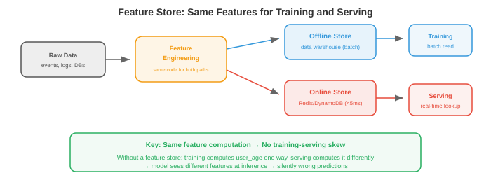

# ML 系统设计

> **一句话总结**: 把前三节的通用基础设施套到机器学习场景里, 覆盖生命周期、数据管理、训练、评估、上线、特征工程、流水线与监控这一整条链路.

*ML 系统设计是把 01-03 节讲过的基础设施模式, 套到机器学习特有的挑战上. 本节覆盖 ML 生命周期、数据管理、训练基础设施、模型评估、上线策略、特征工程、ML 流水线与监控.*

- 系统设计面试题里说"设计一个 YouTube 推荐系统", 考的**不是**让你描述推荐算法, 而是让你设计**整个系统**: 数据流水线、特征工程、模型训练、评估、上线、监控与迭代. 本节给你搭这个框架.

## ML 系统生命周期


- 无论是垃圾邮件分类器还是基础模型 (foundation model), 每个 ML 系统都遵循同一条生命周期:

```
Problem Framing → Data → Features → Training → Evaluation → Deployment → Monitoring → Iteration
       ↑                                                                                    │
       └────────────────────────────────────────────────────────────────────────────────────┘
```

### 问题定义 (Problem Framing)

- 在碰数据或模型之前, 先定义清楚:
    - **预测什么？** (点击概率、下一个 token、目标边界框)
    - **用户是谁？** (终端用户、内部分析师、其他 ML 模型)
    - **有什么约束？** (延迟 < 100ms、离线批处理即可、必须端上运行)
    - **业务指标是什么？** (营收、活跃度、准确率), 以及 ML 指标怎么映射到业务指标？
    - **基线 (baseline) 是什么？** (启发式规则、基于规则的系统、已有模型) — 你必须打败它, 才有理由上 ML.

- **常见错误**: 没搞清楚问题就跳到模型架构. "我们应该用 transformer" 不是系统设计的答案. "我们要在 200ms 内为 1000 万候选算出点击概率, 所以需要两阶段系统: 快速召回加一个小的排序模型" 才是.

## 数据管理

### 数据采集与标注

- **显式标注 (explicit labels)**: 人工标注数据 (点/不点、目标边界框、对话质量评分). 贵 (依复杂度约每条 0.02-10 美元)、慢、主观.

- **隐式标注 (implicit labels)**: 从用户行为里推导标签. 点击、停留时长、购买、跳过. 便宜且量大, 但噪声也大 (点击不代表满意, 跳过不代表不喜欢).

- **程序化标注 (programmatic labelling)** (Snorkel): 写若干标注函数 (启发式规则、正则、已有模型) 对每条样本投票, 再统计聚合出概率化标签. 能扩展到百万级样本, 精度中等.

- **主动学习 (active learning)**: 模型挑出自己最不确定的样本, 请人标. 这样能最大化标注效率: 1000 条主动挑出来的标签, 效果可以顶 1 万条随机标签.

### 数据质量

- **数据校验 (data validation)**: 每一批进来的数据都检查 schema 违规 (字段缺失、类型错误)、分布漂移 (均值大幅变化) 与体量异常 (预期 100 万行, 实际来 50 万行).

- **Great Expectations** 与 **TFX Data Validation** 就是这类工具: 你事先声明对数据的期望, 违反时告警.

- **数据版本化 (data versioning)**: 每次训练都要可复现. **DVC** (第 15 章) 把数据文件和代码一起追踪, 每个数据集版本对应一个哈希, 训练配置里引用这个哈希.

### 特征仓库 (Feature Store)



- **特征仓库 (feature store)** (第 15 章) 为训练和上线提供一致的特征. 关键概念:

    - **离线特征 (offline features)**: 由批处理流水线 (Spark) 算出, 存在数据仓库里. 用于训练和批量推理. 例子: 用户过去 30 天的平均会话时长、商品的总购买次数.

    - **在线特征 (online features)**: 实时算, 或者预算好后放进低延迟存储 (Redis、DynamoDB). 用于实时推理. 例子: 用户最近 5 次动作、购物车当前内容.

    - **训练-上线偏差 (training-serving skew)**: 如果特征在训练和上线两侧的计算方式不同, 模型推理时看到的特征值就和它训练时看到的不一样. 特征仓库通过让两边共用同一份计算逻辑, 消除这个问题.

## 训练基础设施

- 分布式训练的深入内容已经在第 6 章讲过 (数据并行、模型并行、混合精度、缩放律), 本节只关心**系统**层面:

- **实验追踪 (experiment tracking)** (W&B、MLflow — 第 15 章): 每次训练运行都记录超参数、指标、git 提交、数据版本和硬件. 这是模型版本控制的 ML 版.

- **超参数调优 (hyperparameter tuning)**: 对超参做自动搜索. 方法: 网格搜索 (穷举, 贵)、随机搜索 (出乎意料地有效)、贝叶斯优化 (对目标函数建模, 在可能提升的地方采样), 以及 **ASHA** (异步逐次减半: 起很多次试验, 早早砍掉表现差的).

- **训练流水线编排 (training pipeline orchestration)** (Airflow、Kubeflow — 第 15 章): 把数据准备 → 训练 → 评估 → 模型注册这一串自动化, 按每日调度重训, 失败时告警.

## 模型评估

### 离线评估

- **留出测试集 (held-out test set)**: 在训练时模型没见过的数据上评估. 标准做法, 但如果测试集代表不了生产数据, 结果会具误导性.

- **切片评估 (slice-based evaluation)**: 在子群体上评估 (按用户人口统计、内容类型、语言、时间段). 一个整体准确率 95% 的模型, 在某个少数群体上可能只有 70% — 这不能接受.

- **回测 (backtesting)**: 对时序或序列预测, 按时间顺序在历史数据上评估. 用 $t$ 时刻之前的数据训练, 在 $t$ 到 $t + \Delta t$ 的数据上评估. 避免拿未来数据训练造成的信息泄漏.

### 在线评估


- **A/B 测试 (A/B testing)**: 把线上流量随机切分成对照组 (旧模型) 和实验组 (新模型). 对比业务指标 (营收、活跃度、留存) 并做显著性检验. 这是评估 ML 变更的金标准.

    - **样本量 (sample size)**: 要有足够的数据才能检出预期的效应量 (effect size). 点击率提升 0.1% 需要几百万次曝光才能达到显著.

    - **持续时间 (duration)**: 至少跑一个完整周期 (大多数产品 1-2 周) 以覆盖星期内的日效应.

    - **护栏指标 (guardrail metrics)**: 除了目标指标, 同时监控**不应该**变化的指标 (页面加载时间、错误率、崩溃率). 一个能涨营收但会增加崩溃的模型, 净收益是负的.

- **影子部署 (shadow deployment)**: 新模型在生产环境和旧模型并行跑, 两者接同样的请求, 但只有旧模型的预测真正返回给用户. 对比二者输出. 这能在不影响用户的前提下抓 bug 和质量问题.

- **交错评估 (interleaving)**: 排序类问题里, 把新旧模型的结果交错到同一个列表里返回. 用户在这个交错列表上交互, 你就衡量哪个模型的结果更吸量. 达到显著性所需的用户数比 A/B 测试少.

## 模型上线

### 批处理 vs 实时

- **批量推理 (batch inference)**: 对所有可能的输入预算好预测, 存到数据库/缓存, 从缓存里返回. 适用条件: 输入空间有限 (每晚给所有用户跑一次推荐)、鲜度不敏感 (每天预测一次就够)、延迟容忍度高.

- **实时推理 (real-time inference)**: 每个请求按需计算预测. 适用条件: 输入空间无限 (任意用户查询)、鲜度重要 (就要对这个查询立即预测)、延迟必须低.

- 很多系统**两者并用**: 批处理预算好一批候选 (便宜, 覆盖 80% 流量), 实时处理剩下的 (贵, 覆盖长尾查询和新用户).

### 模型版本化与注册中心

- **模型注册中心 (model registry)** (MLflow、W&B、SageMaker) 存放训练好的模型及其元数据:
    - 版本号与训练日期.
    - 训练配置与数据版本.
    - 评估指标 (准确率、延迟、内存占用).
    - 阶段: 开发 → 预发 → 生产 → 归档.

- **回滚 (rollback)**: 如果新模型在生产环境让指标恶化, 立即回退到上个版本. 注册中心让这变成一键操作.

## 特征工程

- **特征工程 (feature engineering)** 把原始数据变成模型需要的输入. 它在 ML 里往往是杠杆最大的活: 好特征能改善所有模型, 而好模型的天花板由它拿到的特征决定.

### 在线特征 vs 离线特征

- **离线特征**预算好且变化慢 (用户人口统计、30 天聚合值). 由批处理流水线 (Spark) 算, 存在特征仓库里.

- **在线特征**反映当前状态且变化快 (购物车里的商品、最近一次动作、当前位置). 从事件流实时算, 或从快查存储里查.

- **特征鲜度 (feature freshness)**: 有些特征要秒级新 (反欺诈: 结合最近 5 笔交易, 这一笔是不是异常？), 有些可以小时级过期 (推荐: 用户根据历史偏好什么类别？). 越新的特征计算和服务成本越高.

### 常见特征模式

- **计数特征 (counting features)**: 时间窗内的事件计数 (最近 7 天购买次数、最近 24 小时登录次数).
- **嵌入特征 (embedding features)**: 类别变量学到的嵌入 (用户嵌入、商品嵌入、查询嵌入). 是双塔模型和类似架构的输入.
- **交叉特征 (cross features)**: 两个或更多特征的组合 (user_age × item_category). 捕捉单一特征捕不到的交互.
- **时序特征 (temporal features)**: 距上次动作的时长、星期几、几点. 捕捉时序模式.
- **聚合特征 (aggregation features)**: 某个数值特征在某个分组上的均值、中位数、最小、最大、标准差 (这个卖家的商品平均评分).

## ML 流水线

- 一条 ML 流水线把从数据到模型上线的整个流程编排起来:

```
Data ingestion → Validation → Feature engineering → Training → Evaluation → Registration → Deployment → Monitoring
```

- 每一步都是编排器 (Airflow、Kubeflow、Metaflow — 第 15 章) 里的一个任务. 这条流水线:
    - 按调度跑 (每天重训) 或按触发跑 (有新数据到达).
    - 幂等 (重跑得到同样结果).
    - 有重试逻辑 (特征计算失败就带退避重试 3 次).
    - 产出被版本化并存起来的产物 (训练好的模型、评估报告、特征统计).

- **Metaflow** (Netflix/Outerbounds 出品) 特别适合 ML: 代码、数据、模型一起版本化, 同一份代码支持本地开发和云上执行, 并且集成了 K8s 与 AWS.

## 监控

- 通用监控基础已经在第 15 章讲过 (Prometheus、Grafana、告警). 本节聚焦 **ML 特有的监控**:

### 数据漂移 (Data Drift)

- **数据漂移**指进来的数据分布相对训练数据发生了变化. 在夏季数据上训练的模型, 到冬天可能表现很差 (用户行为不同、可售商品不同).

- **检测**: 用统计检验对比入模特征分布与训练分布:
    - **KS 检验 (Kolmogorov-Smirnov)**: 对比两个经验分布, 检验它们是否来自同一底层分布.
    - **PSI (Population Stability Index, 群体稳定性指数)**: 度量分布偏移的幅度. PSI < 0.1 为稳定, 0.1-0.25 为中等偏移, > 0.25 为显著偏移.
    - **嵌入漂移 (embedding drift)**: 用质心距离或 MMD (Maximum Mean Discrepancy, 最大均值差异) 对比入模查询的嵌入分布与训练集的.

### 概念漂移 (Concept Drift)

- **概念漂移**指输入与输出之间的关系变了. 特征看起来一样, 但正确预测已经不同了. 例子: 文化事件、疫情、产品调整后, 用户偏好发生迁移.

- 概念漂移比数据漂移更难检测, 因为它需要有标签的数据. 转而监控代理指标: 点击率、转化率、用户满意度评分. 持续下滑就暗示可能发生了概念漂移.

### 模型退化

- 模型会因为多种原因随时间退化: 数据漂移、概念漂移、特征流水线 bug (某个特征开始返回 null)、上游数据变化 (第三方 API 换了响应格式).

- **应对**: 检测到退化时, 动作视严重程度而定:
    - 轻: 用近期数据重训 (定时重训就能覆盖).
    - 中: 排查根因 (是哪个特征变了？影响的是哪个用户群？).
    - 重: 立即回滚到上一版本模型, 再排查.

### 反馈回路 (Feedback Loops)

- ML 系统会形成**反馈回路**: 模型的预测影响用户行为, 而这些行为会成为下一版模型的训练数据. 这种回路可能是良性的, 也可能是恶性的.

- **正反馈回路** (危险): 推荐模型主要展示热门商品 → 用户只点得到热门商品 (因为他们看到的只有这些) → 模型学到热门商品更热门 → 多样性坍塌. 模型自己制造了印证自己偏见的数据.

- **负反馈回路** (同样危险): 反欺诈模型抓光了 A 类欺诈 → 训练数据里再也没有 A 类欺诈样本 → 下一版模型学不会识别 A 类 → A 类欺诈死灰复燃.

- **缓解手段**:
    - **探索 (exploration)**: 展示一些模型不确定的物品 (epsilon-greedy、Thompson 采样). 生成更多样的训练数据.
    - **反事实日志 (counterfactual logging)**: 记录模型**本来会**预测什么, 而不仅是用户看到的. 在反事实数据上训练来去偏.
    - **保留集 (holdout sets)**: 拿一小部分流量不做模型过滤直接透出. 未过滤的数据为评估模型质量提供真值.
    - **延迟标签 (delayed labels)**: 等真实结果出来再用作训练. 今天点的推荐明天可能会后悔; 反欺诈预测要等 30-90 天的拒付窗口.

### 嵌入表管理

- 大规模 ML 系统的嵌入表 (embedding table) 常有 1 亿以上的条目 (每个用户、商品、广告或实体一个嵌入). 大规模管理它们本身就是个系统挑战:

- **存储**: 1 亿实体 × 256 维 × float16 = 50 GB, 塞不进 GPU 内存. 解决方案: 存 CPU 内存 + GPU 侧缓存、跨多机分片, 或者用**哈希嵌入 (hash embeddings)** (把实体哈希到一张固定大小的表里, 接受哈希冲突).

- **更新**: 模型重训后嵌入会变. 把新嵌入表推到线上要求: 在不打断线上流量的前提下把 50 GB 装入内存、验证正确性、指标恶化时回滚. 嵌入表也用蓝绿部署.

- **陈旧性 (staleness)**: 新创建的用户没有嵌入 (冷启动问题). 解决方案: 用默认嵌入、用一个"特征到嵌入"模型从用户属性推一个嵌入, 或者退回到非个性化模型.

### 公平性与偏见

- ML 系统可能系统性地对不同群体区别对待, 这往往反映了训练数据里的偏见. **公平性监控 (fairness monitoring)** 是责任, 不是可选项.

- **要监控的指标**:
    - **人口统计均等 (demographic parity)**: 各群体 (性别、族裔、年龄) 的正预测率是否有差异？
    - **机会均等 (equal opportunity)**: 各群体的真正例率是否有差异？(招聘模型对来自各群体的合格候选人识别能力应当同样好.)
    - **校准 (calibration)**: 模型对 A 群体说 P(合格) = 0.7 时, A 群体中真的有 70% 合格吗？B 群体也一样吗？

- **落地做法**:
    - 在切片 (子群体) 上评估模型, 而不只是看整体指标.
    - 把公平性指标纳入模型评估流水线 (一个提升整体准确率但让某个具体群体变差的模型, 未经审查不应上线).
    - 记录已知的局限性与失败模式.
    - 对部署在敏感领域 (招聘、放贷、刑事司法、医疗) 的模型建立评审流程.

---

## 📌 本节要点

- **系统 > 算法**: ML 系统设计考的是整套流水线, 不是让你背模型架构.
- **问题定义先行**: 预测什么、用户、约束、业务指标、基线 — 五问要先答清楚, 再动模型.
- **训练-上线偏差**: 特征仓库通过让训练和上线共用同一份计算逻辑来消除它.
- **在线评估三招**: A/B 测试是金标准, 影子部署零风险抓 bug, 交错评估更省样本.
- **批 vs 实时**: 输入空间有限且鲜度不敏感就批处理预算, 反之实时算, 大系统两者并用.
- **数据漂移 vs 概念漂移**: 前者是特征分布变了, 后者是输入→输出的映射变了; 后者更难检.
- **反馈回路**: 模型改变用户行为, 用户行为又成为训练数据; 用探索、反事实日志、保留集去偏.
- **公平性是责任**: 切片评估、公平指标、评审流程, 敏感领域必须闭环.
