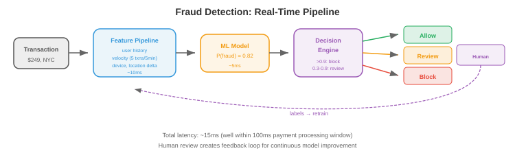

# ML 设计案例

> **一句话总结**: 通过七个完整案例 (推荐、搜索、广告点击、欺诈、内容审核、对话式 AI、图像检索) 走一遍 ML 系统设计的通用套路：问题定义 → 数据 → 特征 → 模型 → 服务 → 评估 → 迭代。

*学 ML 系统设计最好的方式是过实际案例。本文件走完七个完整设计：推荐系统、搜索排序、广告点击预测、欺诈检测、内容审核、对话式 AI，以及大规模图像检索。*

- 每个案例都遵循同一套框架：
    1. **问题定义**: 我们在做什么？用户是谁？约束是什么？
    2. **数据**: 我们有什么数据？怎么采集？怎么打标？
    3. **特征**: 模型需要什么特征？
    4. **模型**: 什么架构和训练方式？
    5. **服务**: 怎么部署、怎么上线？
    6. **评估**: 怎么衡量成功？
    7. **迭代**: 长期能做哪些改进？

---

## 1. 推荐系统 (例如 YouTube、Netflix、Spotify)

### 问题定义

- **目标**: 给用户推他们会喜欢的内容，最大化参与度 (观看时长、播放数、点击数)。
- **规模**: 10 亿以上用户，1 亿以上物品，每秒 1 万以上推荐请求。
- **延迟**: 整条推荐流水线要在 200 ms 内完成。
- **关键难点**: 候选集巨大 (1 亿物品)，不可能在实时里为所有用户对所有物品打分。

### 架构：两阶段流水线


```
1 亿物品 → 候选生成 (快, 粗) → 1000 个候选
       → 排序 (慢, 精) → 100 个排序后物品
       → 重排 (业务规则) → 20 个展示给用户
```

### 候选生成

- **目标**: 把 1 亿物品压到约 1000 个候选。必须快 (<50 ms)。
- **双塔模型 (two-tower)**: 把用户和物品都编码到同一个嵌入空间。用户嵌入捕捉偏好，物品嵌入捕捉内容特性。评分 = 用户嵌入与物品嵌入的点积。
- **训练**: 在 (user, positive_item, negative_items) 三元组上做对比学习。正样本 = 用户互动过的物品；负样本 = 随机物品 + 困难负例 (用户没互动的热门物品)。
- **服务**: 预先计算所有物品的嵌入。请求到来时：计算用户嵌入，再用近似最近邻 (Approximate Nearest Neighbor, ANN) 搜索 (向量数据库里的 HNSW) 找出最近的 1000 个物品嵌入。

### 排序

- **目标**: 对这 1000 个候选精细打分。可以花约 100 ms。
- **模型**: 一个吃丰富特征的深度神经网络 (多层感知机 (Multi-Layer Perceptron, MLP) 或 Transformer)：用户特征 (画像、历史、上下文)、物品特征 (内容、热度、新鲜度)、交叉特征 (用户-物品交互历史、上下文相关性)。
- **输出**: 参与度的预测概率 (点击、观看 50% 以上、点赞、分享)。多目标可以合成：$\text{score} = w_1 \cdot P(\text{click}) + w_2 \cdot P(\text{watch}) + w_3 \cdot P(\text{like})$。

### 重排

- 施加业务规则：多样性 (别一次给同一个创作者的 5 个视频)、新鲜度 (给新内容加权)、安全性 (过滤被标记的内容)，以及个性化探索 (放几个排名偏低但用户可能会喜欢的东西)。

### 简单估算

- **物品嵌入索引**: 1 亿物品 × 256 维 × float16 = 50 GB。HNSW 索引会再多约 2 倍开销 → 约 100 GB。单机 128 GB 内存放得下，或者分片到 4 台 32 GB 机器上。

- **用户嵌入计算**: 每个用户约 5 ms (在用户特征上跑一个小 MLP)。10K QPS 下需要约 50 个模型副本扛住流量。

- **ANN 搜索**: 用 HNSW 在 1 亿向量里取 top-1000 约 2 ms。10K QPS 下每个索引副本能扛约 500 QPS → 需要 20 个副本。

- **排序模型**: 1000 个候选 × 每个约 0.1 ms = 每次请求 100 ms。10K QPS 需要每秒 1000 GPU 秒 → 光排序就要约 10 块 A10G GPU。

- **总基础设施**: 约 20 个嵌入索引副本 + 约 50 个用户嵌入服务器 + 约 10 块排序 GPU + 缓存 + 负载均衡。云上大约每月 5 万到 10 万美元。

### 冷启动

- **新用户** (没有历史): 用画像特征、设备/位置上下文，配合基于热度的推荐。互动 5-10 次之后再切到个性化模型。

- **新物品** (没有参与度数据): 用基于内容的特征 (标题、描述、缩略图嵌入)。分配一块探索预算：把新物品展示给一小部分用户，快速攒参与度数据。加权期过后仍无参与度的物品降权。

- **冷启动是一个系统问题**: 特征仓库必须优雅地处理特征缺失 (返回默认值，而不是报错)。模型训练时要模拟特征缺失 (训练期间对用户历史特征做 Dropout，等价于在训练里就见过新用户)。

### 评估

- **离线**: 归一化折损累计增益 (Normalized Discounted Cumulative Gain, NDCG)、recall@K、precision@K，在留出集上评估。
- **线上**: A/B 测试衡量观看时长、DAU、留存。长周期 A/B (跑几周) 才能捕捉短测试看不到的留存效应。

---

## 2. 搜索排序 (例如 Google、Bing)

### 问题定义

- **目标**: 给定用户查询，从数十亿文档的语料里返回最相关的结果。
- **延迟**: 总共 <500 ms (检索 100 ms + 排序 200 ms + 渲染 100 ms + 其他开销)。

### 架构：查询理解 → 检索 → 排序

### 查询理解

- 检索前先处理原始查询，改善结果：

- **拼写纠错**: "reccomendation systm" → "recommendation system." 用编辑距离模型，或者用搜索日志里 (拼错, 纠正) 对训练一个序列到序列模型。

- **查询扩展**: 加相关词提高召回。"Python ML" → "Python machine learning scikit-learn pytorch." 用同义词词典、词嵌入，或让大语言模型 (Large Language Model, LLM) 生成扩展。

- **意图分类**: 判断用户想要什么。"buy Nike shoes" 属于**交易型** (展示商品页)。"How does backpropagation work" 属于**信息型** (展示文章)。"facebook.com" 属于**导航型** (直接跳到站点)。不同意图应该触发不同的检索策略和结果版式。

- **实体识别**: 从查询里抽实体。"best restaurants near Times Square" → 位置："Times Square"，实体类型："restaurants." 路由到位置感知的搜索管线。

### 检索

- **BM25** (传统): 基于词项匹配的检索，用倒排索引。快，对关键词查询有效。没有语义理解 ("dog food" 匹配不到 "canine nutrition")。

- **稠密检索 (dense retrieval)**: 用双编码器 (bi-encoder，如 DPR 或 ColBERT) 把查询和文档都编码成嵌入。用 ANN 搜索检索。捕捉语义相似度 ("dog food" 能匹配到 "canine nutrition")。比 BM25 慢，但对自然语言查询更好。

- **混合检索 (hybrid retrieval)**: BM25 + 稠密检索合体。BM25 抓精确关键词匹配，稠密检索抓语义匹配。合并去重，两全其美。

### 排序

- **Learning to rank (学习排序)**: 一个模型对每个 (query, document) 对打分。三种思路：
    - **Pointwise**: 独立预测每个文档的相关度分数。简单但忽略了相对顺序。
    - **Pairwise**: 预测两个文档中哪个更相关。LambdaMART (梯度提升树) 是经典做法。
    - **Listwise**: 直接对整条排序列表优化列表级指标 (NDCG)。更复杂，但效果最好。

- **交叉编码器 (cross-encoder)**: 一个 Transformer 把 `[query, document]` 一起吃进去输出相关度分数。比双编码器 (独立编码 query 和 document) 更准，因为能捕捉细粒度交互。但太慢，跑不动全语料——只用来重排检索出来的 top 100-1000 个候选。

### 特征

- **查询特征**: 查询长度、语言、意图分类 (导航型、信息型、交易型)。
- **文档特征**: PageRank、新鲜度、内容质量分、域名权威度。
- **查询-文档特征**: BM25 分、嵌入相似度、精确匹配数、历史日志里这个 (query, document) 对的点击率。

---

## 3. 广告点击预测

### 问题定义

- **目标**: 预测用户点广告的概率。这个概率决定了实时竞价里出多少钱。
- **规模**: 每秒 10 万以上次拍卖，每次要在 10 ms 内给出预测。
- **收入影响**: 点击预测准确率提升 0.1% 就等于额外几百万美元收入。

### 架构

- **特征工程**是广告系统的核心。特征包括：
    - **用户特征**: 画像、浏览历史、购买历史、设备、位置、时段。
    - **广告特征**: 素材 (图/文)、广告主、类目、历史点击率 (Click-Through Rate, CTR)、出价金额。
    - **上下文特征**: 页面内容、广告位置、设备类型、连接速度。
    - **交叉特征**: user_category × ad_category 的交叉、user_region × ad_campaign 的交叉。

- **模型**: 历史上是逻辑回归 (简单、快、可解释)。现代系统用深度学习：一个 **DLRM** (Deep Learning Recommendation Model，深度学习推荐模型)，为类别特征配嵌入表，稠密特征走 MLP。

- **校准 (calibration)**: 预测概率必须准 (模型说 P(click) = 0.05，就应该有 5% 的曝光真的被点)。校准至关重要，因为预测概率直接决定出价。

- **探索-利用**: 一直展示预测最好的广告长期不划算 (永远发现不了某个新广告可能更好)。汤普森采样或 $\epsilon$-greedy 探索保证一小部分曝光留给不确定的广告，用来收集数据。

### 实时竞价

- 用户加载页面时，一场广告拍卖要在 <100 ms 内跑完：
    1. 发布方把出价请求 (用户信息、页面上下文) 发给多个广告交易所。
    2. 每个广告主的竞价服务器为自己的广告预测 CTR。
    3. 出价 = CTR × value_per_click。出价高的赢拍卖。
    4. 中标广告展示；被点了广告主就付费。

---

## 4. 欺诈检测

### 问题定义

- **目标**: 实时检测欺诈交易 (信用卡欺诈、账号盗用、假评论)。
- **延迟**: <100 ms (交易必须在支付完成前被批准或标记)。
- **关键难点**: 类别极度不平衡 (欺诈率 0.1%)。误报会挡住正常用户；漏报会赔钱。

### 架构



### 特征

- **交易特征**: 金额、币种、商户类目、时段、是否跨境。
- **用户特征**: 账户年龄、平均交易金额、近期交易次数、设备指纹。
- **速率特征 (velocity)** (实时，从流式管线来): 最近 5 分钟交易数、最近 1 小时去重商户数、与上一笔交易的地理距离。
- **图特征**: 这个商户是否连着已知欺诈团伙？这台设备是否被已标记账号共用？

### 模型

- **梯度提升树 (XGBoost、LightGBM)** 是表格型欺诈检测的标配。它处理混合特征类型很稳，可解释 (特征重要性)，训得快。

- **处理不平衡**: 多数类欠采样、少数类过采样 (SMOTE)，或者在损失函数里用类权重。Focal loss (第 8 章) 会压低简单负例的权重。

- **代价矩阵**: 一次误报 (挡住合法交易) 有代价 (用户不爽，丢单)。一次漏报 (放过欺诈) 有另一种代价 (钱丢了)。决策阈值应该最小化总期望代价，而不是最大化准确率。

### Human-in-the-Loop (人工在环)

- 不确定的预测 (模型置信度在 0.3 到 0.7 之间) 送到人工复审。审核员的判决变成再训练的标签。这形成一个反馈闭环：模型见到越来越多打好标的欺诈案例，能力持续提升。

---

## 5. 内容审核

### 问题定义

- **目标**: 自动检测并从平台移除有害内容 (仇恨言论、暴力、错误信息、儿童性剥削材料 (Child Sexual Abuse Material, CSAM))。
- **规模**: 每天数十亿条帖子 (文本、图片、视频)。
- **难点**: 严重依赖语境 (讽刺、反讽、文化差异)。必须在言论自由与安全之间拿捏平衡。

### 架构

- **多模态分类**: 文本、图片、视频各一个模型，再来一层融合合并信号。

- **文本审核**: 微调过的语言模型把文本分类到不同类目 (骚扰、仇恨言论、错误信息、垃圾内容)。多语种模型覆盖 100+ 种语言。

- **图像审核**: 视觉模型检测：露骨内容 (裸露、暴力)、图片中的文字 (光学字符识别 (Optical Character Recognition, OCR) + 文本分类器)，以及已知有害内容 (与已知 CSAM 哈希库做哈希匹配)。

- **视频审核**: 按固定间隔采样帧，每帧跑图像分类器，再结合音频转写 (自动语音识别 (Automatic Speech Recognition, ASR) → 文本分类器)。

- **策略即代码 (policy-as-code)**: 审核策略以结构化规则定义，把模型输出映射到动作：

```python
if text_model.hate_speech_score > 0.9:
    action = "remove"
elif text_model.hate_speech_score > 0.7:
    action = "human_review"
else:
    action = "allow"
```

- 策略经常变 (新法规、演变中的社区共识)。把策略跟模型解耦，改策略不用重训模型。

### 主动式 vs 被动式审核

- **主动式** (发布前): 内容上线前先跑分类器。高置信度违规自动拦截。有害内容永远不曝光，但发布多了延迟，也有误报 (合法内容被挡) 的风险。

- **被动式** (发布后): 内容立即上线。用户可举报，举报触发分类器 + 人工复审。对发布方延迟更低，但有害内容在被发现前是可见的。

- **多数平台两者都用**: 主动式覆盖高危类目 (CSAM: 零容忍，发布前就拦)，被动式覆盖有争议的类目 (错误信息：需要人工判断，收到举报后再审)。

### 哈希匹配

- 对于已知有害内容 (CSAM、恐怖主义宣传)，用**感知哈希 (perceptual hashing)**：计算图像/视频的哈希，对轻微修改 (裁剪、缩放、压缩) 依然稳健。跟已知有害内容库 (NCMEC 的哈希库、GIFCT 共享哈希库) 比对。命中 → 直接下架，不需要分类器。

- **PhotoDNA** (微软) 是 CSAM 检测的标准感知哈希，在很多司法辖区是**法定义务**，不只是技术选择。

### 简单估算

- **规模**: 10 亿帖子/天 = 约 1.2 万帖子/秒。每帖要跑：文本分类 (约 5 ms)、图像分类 (约 20 ms)、哈希匹配 (约 1 ms)。12K QPS 下需要约 60 个文本分类器、约 240 个图像分类器、约 12 个哈希匹配器 (再加冗余)。

- **人工复审**: 假设 2% 帖子被送去复审 = 每天 2000 万条。按每个审核员每天 100 条算，需要 20 万审核员 (这就是为什么自动化准确率重要：误报率每降 0.1%，每天就少 100 万条复审)。

- **延迟预算**: 主动审核必须在发布管线 (约 500 ms) 内跑完。文本 (5 ms) + 图像 (20 ms) + 哈希 (1 ms) + 开销 = 在预算内。视频是例外：10 分钟视频每秒采 1 帧也需要 600 次分类器调用 → 走异步处理。

### 升级流程

- 自动移除 → 申诉的人工复审 → 专家复审 (法律、文化专家) → 疑难交策略团队。每一级处理的量更少但更精细。

- **反馈到模型**: 人工复审的判决是再训练最优质的标签。模型和审核员意见不合的样本优先做主动学习——它们代表模型最搞不定的场景。

---

## 6. 对话式 AI (基于 RAG 的聊天机器人)

### 问题定义

- **目标**: 一个用公司文档回答产品问题的聊天机器人。
- **需求**: 准确 (不能幻觉)、能给出引用、能处理追问，并且不越出产品域。


### 架构：检索增强生成 (Retrieval-Augmented Generation, RAG)

```
用户查询 → 查询嵌入 → 向量检索 (文档) → Top-K 文档块
                                              ↓
用户查询 + 检索到的块 → LLM → 回复 (带引用)
```

### 组件

- **文档摄入 (ingestion)**: 把文档切块并嵌入。**切块策略**影响很大：

    - **定长切块**: 每 N 个 token 切一块 (比如 500)，块间重叠 M 个 token (比如 50)。简单、块大小可预测，但可能切在句中或段中，丢上下文。

    - **语义切块**: 按段落或章节边界切。每块是一段自洽的信息。大小可变 (有的 100 token，有的 800)，需要检索系统能吃变长。

    - **递归切块**: 先尝试按段落切。段落太长就按句子切。句子太长就按定长切。在连贯性和大小一致性之间取得最佳平衡。

    - **嵌入**: 用文本编码器 (例如 E5、BGE、Cohere embed) 给每块做嵌入，存到向量数据库。

- **检索**: 把用户查询嵌入，在向量数据库里找最相似的 $k$ 个块 (典型 $k = 5$-$10$)。可选：用交叉编码器再重排一遍拉高精度。

- **生成**: 用检索出的块作为上下文构造提示词：

```
System: You are a helpful assistant. Answer based ONLY on the provided context.
If the answer is not in the context, say "I don't know."

Context:
[chunk 1]
[chunk 2]
...

User: {question}
```

- **护栏 (guardrails)**: 防止 LLM 回答产品域外的问题、生成有害内容，或跟检索出的上下文矛盾。做法：输入过滤 (拒掉跑题查询)、输出过滤 (检查回复是否与检索内容一致)，以及"宪法式"提示词 (指示模型拒绝某些请求)。

- **对话记忆**: 保留最近 $n$ 轮对话，塞进提示词里，让模型能理解追问 ("那价格呢？" → 需要上文说的是哪个产品)。

### 查询改写

- 用户经常问模糊的追问："那价格呢？" (什么的价格？) **查询改写 (query rewriting)** 用对话历史生成一个独立完整的查询：

    - 输入: 对话历史 + "那价格呢？"
    - 改写后: "产品 X 企业版的价格是多少？"

- 拿改写后的查询去做嵌入并检索向量数据库。不改写的话，检索就只会搜 "价格"，返回一堆无关内容。

- 查询改写可以用一次小 LLM 调用 (约 50 ms)，或者用微调过的序列到序列模型 (约 5 ms)。

### 简单估算

- **文档语料**: 1 万页，平均每页 2000 token = 2000 万 token。按 500 token/块 + 50 token 重叠 = 约 4.4 万块。
- **嵌入索引**: 4.4 万块 × 768 维 × float16 = 约 65 MB。轻松装内存。就算 1000 万块也不过约 15 GB。
- **延迟拆解**: 查询嵌入 (5 ms) + 向量检索 (2 ms) + 交叉编码器重排 top-50 (20 ms) + LLM 生成 (500-2000 ms) = 总共约 600-2100 ms。LLM 占大头。用流式输出减少感知延迟。
- **成本**: 按 3 美元/百万 token (Claude / GPT-4 API) 算，每天 1000 次查询，每次约 2000 token = 约 6 美元/天。规模上到 100 万查询/天，就自建一个 7B 模型跑在 2 块 A10G GPU 上 (约 50 美元/天)，成本降 100 倍。

### 评估

- **检索质量**: Recall@K (top-K 里是否包含答案)、MRR (Mean Reciprocal Rank，平均倒数排名)。
- **生成质量**: 事实准确性 (回复是否与检索内容一致)、有据性 (是否正确引用了对应块)、答案相关性。
- **端到端**: 用户满意度 (点赞/点踩)、升级到人工客服的比率。

---

## 7. 大规模图像检索

### 问题定义

- **目标**: 给定一张图，从 10 亿以上图片语料里找视觉相似的图。
- **应用**: 反向图像检索、商品搜索 (拍照 → 匹配商品)、去重。
- **延迟**: 含网络往返 <500 ms。

### 架构

```
查询图片 → 嵌入模型 (ViT/CLIP) → 512 维向量 → ANN 检索 → Top-K 结果
```

### 嵌入抽取

- **模型**: 预训练视觉编码器 (视觉 Transformer (Vision Transformer, ViT)、CLIP 的图像编码器、DINOv2)。有需要就在特定领域 (时尚、电商、医学影像) 上微调。

- **训练**: 对比学习 (第 10 章)。正样本对 = 同一张图的不同视角 (或图-文对)。负样本对 = 随机图。模型学到相似图产生相似嵌入，不同图产生不同嵌入。

### 索引

- **离线**: 给全部 10 亿张图做嵌入并建 ANN 索引。用 HNSW (文件 03)，建索引要几个小时，索引存在内存里 (10 亿 × 512 维 × float16 + 图结构开销约 128 GB)。

- **分片 (sharding)**: 把索引切到多台机器上。每台放一个分片。查询时并行搜所有分片，合并 top-K。

- **增量更新**: 新图 (上传、新商品) 要加进索引。HNSW 支持增量插入，不用重建。向量数据库 (Milvus、Pinecone) 原生支持。

### 服务

- **嵌入服务**: 一台跑 ViT 的 GPU 服务器。每张图约 20 ms 延迟。批处理提高吞吐。

- **检索服务**: ANN 索引服务器。用 HNSW，从 10 亿向量里取 top-100 约 10 ms。

- **缓存**: 缓存热门查询的结果。做去重时，把最近上传图片的嵌入缓存下来，新上传先比对缓存再去搜索全量索引。

### 评估

- **Precision@K**: top-K 里的结果真的相似吗？
- **Recall@K**: 语料里所有真正相似的图，top-K 里覆盖了多少？
- **Mean Average Precision (mAP，平均精度均值)**: 精确率-召回率曲线下面积。
- **人工评估**: 对主观相似度，让人评分判断检索到的图是否相关。

---

## 面试框架

- 遇到系统设计题，按下面这套框架走：

1. **明确需求** (2-3 分钟): 问规模、延迟、一致性要求和边界情况。"用户量多少？可接受的延迟是多少？故障时怎么办？"

2. **高层设计** (5-7 分钟): 画出主要组件与交互。从主路径 (happy path) 开始。用文件 01-03 里的那些模式。

3. **深入某个模块** (15-20 分钟): 挑最有意思或最有挑战的组件详细展开。这里体现你的深度。对 ML 系统来说，深入的往往是：模型架构、特征管线，或者服务架构。

4. **评估与监控** (3-5 分钟): 怎么衡量成功？可能会出什么问题？怎么发现和响应？

5. **迭代** (2-3 分钟): 有更多时间/资源你会改进什么？体现你懂取舍、会排优先级。

- **面试官在看什么**: 结构化思考 (不上来就砸方案)、取舍意识 (每个选择都有代价)、实战知识 (你真的做过系统)，以及沟通能力 (能不能把设计说清楚)。

---

## 📌 本节要点

- **两阶段推荐流水线**: 快而粗的候选生成 + 慢而准的排序 + 业务重排，把 1 亿物品压到 20 条。
- **双塔 + ANN**: 用户塔和物品塔各自出嵌入，向量数据库做 ANN 检索，是候选生成的主流做法。
- **搜索三段式**: 查询理解 → 检索 (BM25 / 稠密 / 混合) → 排序 (Pointwise / Pairwise / Listwise + 交叉编码器重排)。
- **广告点击预测**: 特征工程是核心，模型必须校准 (预测概率直接决定出价)，用探索机制避免局部最优。
- **欺诈检测**: 类别极度不平衡 + 严延迟约束，梯度提升树 + 速率/图特征 + 人工在环反馈闭环。
- **内容审核**: 多模态分类 + 策略即代码 + 主动/被动结合，已知有害内容走感知哈希 (PhotoDNA)。
- **RAG 聊天机器人**: 切块 (递归切块最平衡) + 向量检索 + 查询改写 + LLM 生成，护栏防止越域和幻觉。
- **图像检索**: ViT/CLIP 编码 + HNSW 分片索引 + 嵌入缓存，秒级从 10 亿图里找相似。
- **面试框架**: 明确需求 → 高层设计 → 深入模块 → 评估监控 → 迭代改进，展示结构化思考与取舍意识。
